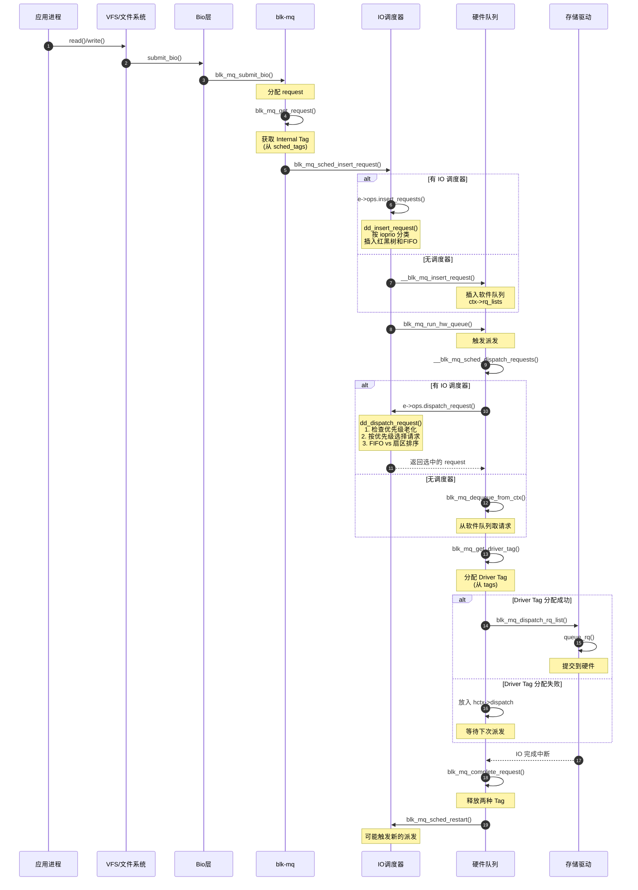

# IO 调度器工作流程与代码实现详解

## 一、引言与概念澄清

### 1.1 IO 调度器的核心职责

在深入分析之前，必须先澄清一个常见的误解：**IO 调度器的核心职责是决定请求的存储位置和调度顺序，而不是触发队列执行**。

```
┌─────────────────────────────────────────────────────────────────┐
│                    IO 调度器核心职责                              │
├─────────────────────────────────────────────────────────────────┤
│  ✓ 决定请求存储位置（红黑树？FIFO队列？哪个优先级队列？）           │
│  ✓ 决定请求选择顺序（按扇区？按时间？按优先级？）                   │
│  ✓ 实现读写平衡、优先级调度、防饥饿机制                           │
│  ✗ 不负责触发队列执行（这是事件驱动的）                           │
└─────────────────────────────────────────────────────────────────┘
```

### 1.2 队列执行的触发机制

队列执行（`blk_mq_run_hw_queue()`）是由以下事件触发的：

| 触发事件 | 函数调用点 | 源码位置 |
|---------|-----------|---------|
| 请求插入后 | `blk_mq_sched_insert_request()` | blk-mq-sched.c:485 |
| 批量插入后 | `blk_mq_sched_insert_requests()` | blk-mq-sched.c:519 |
| IO 完成后 | `blk_mq_sched_restart()` | blk-mq-sched.c:74 |
| 资源释放后 | `blk_mq_put_dispatch_budget()` | blk-mq.c |

**关键理解**：调度器只负责"请求放在哪里、按什么顺序取出"，而"什么时候取出"是由上述事件触发的。

### 1.3 核心问题

本文将回答以下核心问题：

1. **软件队列和硬件队列如何交互？** - 请求如何从 CPU 本地队列流向硬件队列
2. **两种 Tag 与调度器有什么关系？** - Internal Tag 和 Driver Tag 的分配时机和所有权
3. **IO 优先级如何影响调度顺序？** - 三级优先级机制和防饥饿策略

---

## 二、队列架构详解

### 2.1 软件队列（blk_mq_ctx）

软件队列是 **Per-CPU** 的数据结构，用于临时存放本 CPU 提交的 IO 请求。

**源码定义** - `common/block/blk-mq.h:16-40`：

```c
/**
 * struct blk_mq_ctx - State for a software queue facing the submitting CPUs
 */
struct blk_mq_ctx {
    struct {
        spinlock_t      lock;
        struct list_head    rq_lists[HCTX_MAX_TYPES];  // 请求链表（按类型分）
    } ____cacheline_aligned_in_smp;

    unsigned int        cpu;                          // 所属 CPU
    unsigned short      index_hw[HCTX_MAX_TYPES];     // 在硬件队列中的索引
    struct blk_mq_hw_ctx    *hctxs[HCTX_MAX_TYPES];   // 映射到的硬件队列

    /* incremented at dispatch time */
    unsigned long       rq_dispatched[2];             // 已派发计数（读/写）
    unsigned long       rq_merged;                    // 已合并计数

    /* incremented at completion time */
    unsigned long       rq_completed[2];              // 已完成计数

    struct request_queue    *queue;                   // 所属请求队列
    struct blk_mq_ctxs      *ctxs;
};
```

**关键字段解读**：

| 字段 | 作用 | 说明 |
|-----|------|-----|
| `rq_lists[type]` | 请求链表 | 存放待处理请求，按类型（default/read/poll）分 |
| `index_hw[type]` | 硬件队列索引 | 本软件队列在对应硬件队列的 ctxs 数组中的位置 |
| `hctxs[type]` | 硬件队列指针 | 本软件队列映射到的硬件队列 |

### 2.2 硬件队列（blk_mq_hw_ctx）

硬件队列是与存储控制器硬件队列对应的数据结构，是请求派发的核心。

**源码定义** - `common/include/linux/blk-mq.h:17-150`：

```c
/**
 * struct blk_mq_hw_ctx - State for a hardware queue facing the hardware
 * block device
 */
struct blk_mq_hw_ctx {
    struct {
        spinlock_t      lock;
        /**
         * @dispatch: Used for requests that are ready to be
         * dispatched to the hardware but for some reason (e.g. lack of
         * resources) could not be sent to the hardware.
         */
        struct list_head    dispatch;      // 待派发队列（获取 Driver Tag 失败时暂存）
        unsigned long       state;         // 队列状态
    } ____cacheline_aligned_in_smp;

    struct delayed_work run_work;          // 延迟执行工作队列
    cpumask_var_t       cpumask;           // 可运行的 CPU 掩码
    
    void            *sched_data;           // 调度器私有数据
    struct request_queue    *queue;        // 所属请求队列
    
    /**
     * @ctx_map: Bitmap for each software queue. If bit is on, there is a
     * pending request in that software queue.
     */
    struct sbitmap      ctx_map;           // 软件队列位图（标记哪些有请求）
    struct blk_mq_ctx   **ctxs;            // 关联的软件队列数组
    unsigned short      nr_ctx;            // 软件队列数量

    /**
     * @tags: Tags owned by the block driver. A tag at this set is only
     * assigned when a request is dispatched from a hardware queue.
     */
    struct blk_mq_tags  *tags;             // Driver Tag（驱动拥有）
    
    /**
     * @sched_tags: Tags owned by I/O scheduler. If there is an I/O
     * scheduler associated with a request queue, a tag is assigned when
     * that request is allocated.
     */
    struct blk_mq_tags  *sched_tags;       // Internal Tag（调度器拥有）

    unsigned int        queue_num;         // 硬件队列编号
    atomic_t            nr_active;         // 活跃请求数
};
```

**关键字段解读**：

| 字段 | 作用 | 与调度器的关系 |
|-----|------|--------------|
| `dispatch` | 待派发队列 | 调度器返回请求但 Driver Tag 分配失败时暂存 |
| `ctx_map` | 软件队列位图 | 无调度器时用于遍历有请求的软件队列 |
| `ctxs` | 软件队列数组 | 映射到本硬件队列的所有软件队列 |
| `sched_tags` | Internal Tag | **调度器专用**，请求分配时使用 |
| `tags` | Driver Tag | 驱动专用，派发时使用 |

### 2.3 队列架构图

```
┌─────────────────────────────────────────────────────────────────────────────┐
│                              Block 层队列架构                                │
├─────────────────────────────────────────────────────────────────────────────┤
│                                                                             │
│  ┌─────────┐ ┌─────────┐ ┌─────────┐ ┌─────────┐      软件队列层            │
│  │  ctx 0  │ │  ctx 1  │ │  ctx 2  │ │  ctx 3  │      (Per-CPU)            │
│  │ CPU 0   │ │ CPU 1   │ │ CPU 2   │ │ CPU 3   │                           │
│  │rq_lists │ │rq_lists │ │rq_lists │ │rq_lists │                           │
│  └────┬────┘ └────┬────┘ └────┬────┘ └────┬────┘                           │
│       │           │           │           │                                 │
│       └─────┬─────┴─────┬─────┴─────┬─────┘                                 │
│             │           │           │                                       │
│             ▼           ▼           ▼                                       │
│  ┌──────────────────────────────────────────────┐                           │
│  │            Hardware Queue (hctx)              │      硬件队列层          │
│  │  ┌────────────────┐  ┌────────────────────┐  │                           │
│  │  │  sched_tags    │  │      tags          │  │                           │
│  │  │ (Internal Tag) │  │  (Driver Tag)      │  │                           │
│  │  │  nr_requests   │  │  queue_depth       │  │                           │
│  │  └───────┬────────┘  └─────────┬──────────┘  │                           │
│  │          │                     │             │                           │
│  │          ▼                     ▼             │                           │
│  │  ┌───────────────────────────────────────┐   │                           │
│  │  │           IO Scheduler                │   │      调度器层            │
│  │  │  ┌─────────────────────────────────┐  │   │                           │
│  │  │  │      mq-deadline 内部队列        │  │   │                           │
│  │  │  │  ┌──────────┐ ┌──────────┐      │  │   │                           │
│  │  │  │  │ RT 优先级│ │ BE 优先级│ ...  │  │   │                           │
│  │  │  │  │ sort_list│ │ sort_list│      │  │   │                           │
│  │  │  │  │ fifo_list│ │ fifo_list│      │  │   │                           │
│  │  │  │  └──────────┘ └──────────┘      │  │   │                           │
│  │  │  └─────────────────────────────────┘  │   │                           │
│  │  └───────────────────────────────────────┘   │                           │
│  │                      │                       │                           │
│  │                      ▼                       │                           │
│  │  ┌───────────────────────────────────────┐   │                           │
│  │  │          dispatch 队列                │   │      待派发队列          │
│  │  │    (Driver Tag 分配失败时暂存)         │   │                           │
│  │  └───────────────────────────────────────┘   │                           │
│  └──────────────────────────────────────────────┘                           │
│                         │                                                   │
│                         ▼                                                   │
│  ┌──────────────────────────────────────────────┐                           │
│  │              Storage Driver                   │      存储驱动层          │
│  │            (queue_rq 回调)                    │                           │
│  └──────────────────────────────────────────────┘                           │
│                                                                             │
└─────────────────────────────────────────────────────────────────────────────┘
```

### 2.4 软件队列与硬件队列的交互

**映射关系建立** - `common/block/blk-mq.c:2940-2950`：

```c
/*
 * Map software to hardware queues.
 *
 * If the cpu isn't present, the cpu is mapped to first hctx.
 */
for_each_possible_cpu(i) {
    ctx = per_cpu_ptr(q->queue_ctx, i);
    for (j = 0; j < set->nr_maps; j++) {
        // 根据映射表确定硬件队列索引
        hctx_idx = set->map[j].mq_map[i];
        ctx->hctxs[j] = hctx;
        ctx->index_hw[j] = hctx->nr_ctx;
        hctx->ctxs[hctx->nr_ctx++] = ctx;
    }
}
```

**请求从软件队列到硬件队列的流程**：

```c
// 1. 从软件队列收集请求
void blk_mq_flush_busy_ctxs(struct blk_mq_hw_ctx *hctx, struct list_head *list)
{
    // 遍历 ctx_map 中标记为有请求的软件队列
    sbitmap_for_each_set(&hctx->ctx_map, flush_busy_ctx, &data);
}

// flush_busy_ctx 回调 - common/block/blk-mq.c:1000-1010
static bool flush_busy_ctx(struct sbitmap *sb, unsigned int bitnr, void *data)
{
    struct blk_mq_ctx *ctx = hctx->ctxs[bitnr];
    
    spin_lock(&ctx->lock);
    // 将软件队列的请求移到临时列表
    list_splice_tail_init(&ctx->rq_lists[type], flush_data->list);
    sbitmap_clear_bit(sb, bitnr);  // 清除位图标记
    spin_unlock(&ctx->lock);
    return true;
}
```

---

## 三、两种 Tag 与调度器的交互

### 3.1 Tag 的本质

Tag 是 Block 层用于**追踪和管理 IO 请求**的机制。每个 Tag 对应一个请求槽位，Tag 数量决定了并发请求上限。

```
┌─────────────────────────────────────────────────────────────────┐
│                      Tag 机制概览                                │
├─────────────────────────────────────────────────────────────────┤
│                                                                 │
│   Internal Tag (sched_tags)         Driver Tag (tags)          │
│   ┌─────────────────────┐           ┌─────────────────────┐    │
│   │  所有者: 调度器       │           │  所有者: 驱动        │    │
│   │  数量: nr_requests   │           │  数量: queue_depth   │    │
│   │  分配时机: 请求分配    │           │  分配时机: 派发时     │    │
│   │  存储: rq->internal_tag│         │  存储: rq->tag        │    │
│   └─────────────────────┘           └─────────────────────┘    │
│                                                                 │
│   典型值: 62 (2*31)                  典型值: 31 (UFS设备)       │
│   可调: /sys/block/sda/queue/        不可调: 硬件决定           │
│         nr_requests                                             │
│                                                                 │
└─────────────────────────────────────────────────────────────────┘
```

### 3.2 Tag 分配时机的关键区别

**关键源码** - `common/block/blk-mq.h:172-178`：

```c
static inline struct blk_mq_tags *blk_mq_tags_from_data(struct blk_mq_alloc_data *data)
{
    if (data->q->elevator)
        return data->hctx->sched_tags;  // 有调度器：使用 sched_tags
    return data->hctx->tags;             // 无调度器：直接使用 tags
}
```

**Internal Tag 分配** - `common/block/blk-mq.c:289-294`：

```c
// blk_mq_rq_ctx_init() - 请求分配时
struct blk_mq_tags *tags = blk_mq_tags_from_data(data);
struct request *rq = tags->static_rqs[tag];

if (data->q->elevator) {
    rq->tag = BLK_MQ_NO_TAG;       // Driver Tag 初始为无效
    rq->internal_tag = tag;        // Internal Tag 已分配
} else {
    rq->tag = tag;                 // 无调度器时直接分配 Driver Tag
    rq->internal_tag = BLK_MQ_NO_TAG;
}
```

**Driver Tag 分配** - `common/block/blk-mq.c:1075-1090`：

```c
static bool __blk_mq_get_driver_tag(struct request *rq)
{
    struct sbitmap_queue *bt = rq->mq_hctx->tags->bitmap_tags;
    unsigned int tag_offset = rq->mq_hctx->tags->nr_reserved_tags;

    // 检查是否需要 sched_tag 来源验证
    if (blk_mq_tag_is_reserved(rq->mq_hctx->sched_tags, rq->internal_tag)) {
        bt = rq->mq_hctx->tags->breserved_tags;
        tag_offset = 0;
    } else {
        if (!hctx_may_queue(rq->mq_hctx, bt))
            return false;
    }

    // 从 sbitmap 分配 Tag
    tag = __sbitmap_queue_get(bt);
    if (tag == BLK_MQ_NO_TAG)
        return false;

    rq->tag = tag + tag_offset;
    return true;
}
```

### 3.3 Tag 分配时机对比

```
┌─────────────────────────────────────────────────────────────────────────────┐
│                         Tag 分配时机对比                                     │
├─────────────────────────────────────────────────────────────────────────────┤
│                                                                             │
│  时间线 ──────────────────────────────────────────────────────────────────▶ │
│                                                                             │
│  ┌────────────────┐    ┌────────────────┐    ┌────────────────┐            │
│  │  请求分配阶段   │    │  调度器处理阶段 │    │   派发阶段     │            │
│  │                │    │                │    │                │            │
│  │ blk_mq_get_    │    │ dd_insert_     │    │ blk_mq_dispatch│            │
│  │ request()      │    │ requests()     │    │ _rq_list()     │            │
│  └───────┬────────┘    └───────┬────────┘    └───────┬────────┘            │
│          │                     │                     │                      │
│          ▼                     ▼                     ▼                      │
│  ┌───────────────┐     ┌───────────────┐     ┌───────────────┐             │
│  │ Internal Tag  │     │ 进入调度器     │     │  Driver Tag   │             │
│  │   分配        │     │ 内部队列       │     │    分配       │             │
│  │ (sched_tags)  │     │               │     │   (tags)      │             │
│  └───────────────┘     └───────────────┘     └───────────────┘             │
│                                                                             │
│  分配失败: io_schedule() 阻塞      无阻塞               分配失败: 返回 false │
│            等待 Tag 释放                                请求放入 dispatch 队列│
│                                                                             │
└─────────────────────────────────────────────────────────────────────────────┘
```

### 3.4 调度器如何使用 Tag

**mq-deadline 的深度限制** - `common/block/mq-deadline.c:604-616`：

```c
/*
 * Called by __blk_mq_alloc_request(). The shallow_depth value set by this
 * function is used by __blk_mq_get_tag().
 */
static void dd_limit_depth(unsigned int op, struct blk_mq_alloc_data *data)
{
    struct deadline_data *dd = data->q->elevator->elevator_data;

    /* Do not throttle synchronous reads. */
    if (op_is_sync(op) && !op_is_write(op))
        return;

    /*
     * Throttle asynchronous requests and writes such that these requests
     * do not block the allocation of synchronous requests.
     */
    data->shallow_depth = dd->async_depth;
}

/* 初始化时计算 async_depth - dd_depth_updated() */
static void dd_depth_updated(struct blk_mq_hw_ctx *hctx)
{
    struct blk_mq_tags *tags = hctx->sched_tags;
    unsigned int shift = tags->bitmap_tags->sb.shift;

    // async_depth = 3/4 * sbitmap 单词容量
    dd->async_depth = max(1U, 3 * (1U << shift) / 4);

    sbitmap_queue_min_shallow_depth(tags->bitmap_tags, dd->async_depth);
}
```

**深度限制的意义**：

```
┌─────────────────────────────────────────────────────────────────┐
│                   Tag 深度限制策略                               │
├─────────────────────────────────────────────────────────────────┤
│                                                                 │
│  假设 nr_requests = 64                                          │
│                                                                 │
│  ┌──────────────────────────────────────────────────────────┐  │
│  │         Internal Tag 池 (64 个)                           │  │
│  │  ┌─────────────────────────────────────────────────────┐ │  │
│  │  │ 同步读请求: 可以使用全部 64 个 Tag                    │ │  │
│  │  │ (不受 shallow_depth 限制)                            │ │  │
│  │  └─────────────────────────────────────────────────────┘ │  │
│  │  ┌─────────────────────────────────────────────────────┐ │  │
│  │  │ 异步请求/写请求: 最多使用 48 个 Tag (async_depth)     │ │  │
│  │  │ (受 shallow_depth 限制, 3/4 * 64 = 48)              │ │  │
│  │  └─────────────────────────────────────────────────────┘ │  │
│  │                                                          │  │
│  │  目的: 保证同步读请求总能获得 Tag，不被异步请求饿死        │  │
│  └──────────────────────────────────────────────────────────┘  │
│                                                                 │
└─────────────────────────────────────────────────────────────────┘
```

---

## 四、IO 优先级对调度顺序的影响

### 4.1 Linux IO 优先级体系

Linux 通过 `ioprio` 机制为进程设置 IO 优先级，影响调度器的请求选择。

**优先级类别定义** - `include/uapi/linux/ioprio.h`：

```c
/*
 * Gives us 8 prio classes with 13-bits of data for each class
 */
#define IOPRIO_CLASS_SHIFT	13
#define IOPRIO_NR_CLASSES	8

enum {
    IOPRIO_CLASS_NONE   = 0,    // 未设置，视为 BE
    IOPRIO_CLASS_RT     = 1,    // 实时优先级（最高）
    IOPRIO_CLASS_BE     = 2,    // Best Effort（默认）
    IOPRIO_CLASS_IDLE   = 3,    // 空闲优先级（最低）
};

// 每个类别内还有 0-7 共 8 个级别
#define IOPRIO_BE_NR    8
```

### 4.2 mq-deadline 的三级优先级

**优先级映射** - `common/block/mq-deadline.c:50-116`：

```c
enum dd_prio {
    DD_RT_PRIO   = 0,    // 实时优先级 - 最高
    DD_BE_PRIO   = 1,    // Best Effort - 中等
    DD_IDLE_PRIO = 2,    // 空闲优先级 - 最低
    DD_PRIO_MAX  = 2,
};

enum { DD_PRIO_COUNT = 3 };

/* Maps an I/O priority class to a deadline scheduler priority. */
static const enum dd_prio ioprio_class_to_prio[] = {
    [IOPRIO_CLASS_NONE] = DD_BE_PRIO,    // 未设置 -> BE
    [IOPRIO_CLASS_RT]   = DD_RT_PRIO,    // 实时 -> RT
    [IOPRIO_CLASS_BE]   = DD_BE_PRIO,    // BE -> BE
    [IOPRIO_CLASS_IDLE] = DD_IDLE_PRIO,  // 空闲 -> IDLE
};
```

### 4.3 每个优先级独立的数据结构

**dd_per_prio 结构** - `common/block/mq-deadline.c:72-82`：

```c
/*
 * Deadline scheduler data per I/O priority (enum dd_prio). Requests are
 * present on both sort_list[] and fifo_list[].
 */
struct dd_per_prio {
    struct list_head dispatch;              // 待派发队列（高优先级）
    struct rb_root sort_list[DD_DIR_COUNT]; // 红黑树（按扇区排序）
    struct list_head fifo_list[DD_DIR_COUNT]; // FIFO队列（按时间排序）
    struct request *next_rq[DD_DIR_COUNT];  // 下一个顺序请求指针
    struct io_stats_per_prio stats;         // 统计信息
};

struct deadline_data {
    /*
     * run time data
     */
    struct dd_per_prio per_prio[DD_PRIO_COUNT];  // 3 个优先级各有独立队列

    /* Data direction of latest dispatched request. */
    enum dd_data_dir last_dir;      // 上次派发方向（读/写）
    unsigned int batching;          // 当前批次计数
    unsigned int starved;           // 写饥饿计数

    /*
     * settings that change how the i/o scheduler behaves
     */
    int fifo_expire[DD_DIR_COUNT];  // FIFO 超时时间（读/写）
    int fifo_batch;                 // 批处理大小
    int writes_starved;             // 写饥饿阈值
    int front_merges;               // 是否允许前向合并
    u32 async_depth;                // 异步请求深度限制
    int prio_aging_expire;          // 优先级老化时间

    spinlock_t lock;
    spinlock_t zone_lock;
};
```

### 4.4 优先级队列架构图

```
┌─────────────────────────────────────────────────────────────────────────────┐
│                     mq-deadline 优先级队列架构                               │
├─────────────────────────────────────────────────────────────────────────────┤
│                                                                             │
│  deadline_data                                                              │
│  ┌─────────────────────────────────────────────────────────────────────┐   │
│  │                                                                     │   │
│  │  per_prio[DD_RT_PRIO]  (优先级 0 - 最高)                            │   │
│  │  ┌─────────────────────────────────────────────────────────────┐   │   │
│  │  │ dispatch: 待派发队列                                         │   │   │
│  │  │ sort_list[READ]:  红黑树 ──▶ 按扇区号排序                     │   │   │
│  │  │ sort_list[WRITE]: 红黑树 ──▶ 按扇区号排序                     │   │   │
│  │  │ fifo_list[READ]:  FIFO ──▶ 按到达时间排序                     │   │   │
│  │  │ fifo_list[WRITE]: FIFO ──▶ 按到达时间排序                     │   │   │
│  │  └─────────────────────────────────────────────────────────────┘   │   │
│  │                                                                     │   │
│  │  per_prio[DD_BE_PRIO]  (优先级 1 - 默认)                            │   │
│  │  ┌─────────────────────────────────────────────────────────────┐   │   │
│  │  │ dispatch: 待派发队列                                         │   │   │
│  │  │ sort_list[READ]:  红黑树                                     │   │   │
│  │  │ sort_list[WRITE]: 红黑树                                     │   │   │
│  │  │ fifo_list[READ]:  FIFO                                       │   │   │
│  │  │ fifo_list[WRITE]: FIFO                                       │   │   │
│  │  └─────────────────────────────────────────────────────────────┘   │   │
│  │                                                                     │   │
│  │  per_prio[DD_IDLE_PRIO]  (优先级 2 - 最低)                          │   │
│  │  ┌─────────────────────────────────────────────────────────────┐   │   │
│  │  │ dispatch: 待派发队列                                         │   │   │
│  │  │ sort_list[READ]:  红黑树                                     │   │   │
│  │  │ sort_list[WRITE]: 红黑树                                     │   │   │
│  │  │ fifo_list[READ]:  FIFO                                       │   │   │
│  │  │ fifo_list[WRITE]: FIFO                                       │   │   │
│  │  └─────────────────────────────────────────────────────────────┘   │   │
│  │                                                                     │   │
│  └─────────────────────────────────────────────────────────────────────┘   │
│                                                                             │
│  调度顺序: RT (0) ──▶ BE (1) ──▶ IDLE (2)                                  │
│            除非低优先级请求因老化而需要优先处理                               │
│                                                                             │
└─────────────────────────────────────────────────────────────────────────────┘
```

### 4.5 优先级调度逻辑

**核心派发函数** - `common/block/mq-deadline.c:572-598`：

```c
/*
 * Called from blk_mq_run_hw_queue() -> __blk_mq_sched_dispatch_requests().
 *
 * One confusing aspect here is that we get called for a specific
 * hardware queue, but we may return a request that is for a
 * different hardware queue. This is because mq-deadline has shared
 * state for all hardware queues, in terms of sorting, FIFOs, etc.
 */
static struct request *dd_dispatch_request(struct blk_mq_hw_ctx *hctx)
{
    struct deadline_data *dd = hctx->queue->elevator->elevator_data;
    const unsigned long now = jiffies;
    struct request *rq;
    enum dd_prio prio;

    spin_lock(&dd->lock);
    
    // 第一步：检查是否有低优先级老化请求需要优先处理（防饥饿）
    rq = dd_dispatch_prio_aged_requests(dd, now);
    if (rq)
        goto unlock;

    // 第二步：按优先级从高到低依次选择请求
    for (prio = 0; prio <= DD_PRIO_MAX; prio++) {
        rq = __dd_dispatch_request(dd, &dd->per_prio[prio], now);
        if (rq || dd_queued(dd, prio))
            break;  // 当前优先级有请求就不再看更低优先级
    }

unlock:
    spin_unlock(&dd->lock);

    return rq;
}
```

**优先级老化检查** - `common/block/mq-deadline.c:536-562`：

```c
/*
 * Check whether there are any requests with priority other than DD_RT_PRIO
 * that were inserted more than prio_aging_expire jiffies ago.
 */
static struct request *dd_dispatch_prio_aged_requests(struct deadline_data *dd,
                                                      unsigned long now)
{
    struct request *rq;
    enum dd_prio prio;
    int prio_cnt;

    lockdep_assert_held(&dd->lock);

    // 只有多个优先级都有请求时才检查老化
    prio_cnt = !!dd_queued(dd, DD_RT_PRIO) + !!dd_queued(dd, DD_BE_PRIO) +
               !!dd_queued(dd, DD_IDLE_PRIO);
    if (prio_cnt < 2)
        return NULL;

    // 从 BE 优先级开始检查（跳过 RT，RT 不会被饿死）
    for (prio = DD_BE_PRIO; prio <= DD_PRIO_MAX; prio++) {
        // 检查是否有请求等待超过 prio_aging_expire 时间
        rq = __dd_dispatch_request(dd, &dd->per_prio[prio],
                                   now - dd->prio_aging_expire);
        if (rq)
            return rq;
    }

    return NULL;
}
```

### 4.6 防饥饿机制详解

**两种防饥饿机制**：

| 机制 | 参数 | 默认值 | 作用 |
|-----|------|-------|------|
| 优先级老化 | `prio_aging_expire` | 10秒 | 低优先级请求等待超时后优先处理 |
| 写饥饿保护 | `writes_starved` | 2 | 读请求连续饿死写请求超过此次数后处理写 |

**写饥饿保护逻辑** - `common/block/mq-deadline.c:456-480`：

```c
// 在 __dd_dispatch_request() 中
if (!list_empty(&per_prio->fifo_list[DD_READ])) {
    BUG_ON(RB_EMPTY_ROOT(&per_prio->sort_list[DD_READ]));

    // 检查是否有写请求，以及写是否被饿死
    if (deadline_fifo_request(dd, per_prio, DD_WRITE) &&
        (dd->starved++ >= dd->writes_starved))
        goto dispatch_writes;  // 写被饿死，优先处理写

    data_dir = DD_READ;
    goto dispatch_find_request;
}

/*
 * there are either no reads or writes have been starved
 */
if (!list_empty(&per_prio->fifo_list[DD_WRITE])) {
dispatch_writes:
    BUG_ON(RB_EMPTY_ROOT(&per_prio->sort_list[DD_WRITE]));

    dd->starved = 0;  // 重置饥饿计数

    data_dir = DD_WRITE;
    goto dispatch_find_request;
}
```

### 4.7 设置 IO 优先级的方法

```bash
# 1. 使用 ionice 命令设置进程 IO 优先级
ionice -c 1 -n 0 -p <pid>   # 设置为实时优先级，级别 0（最高）
ionice -c 2 -n 4 -p <pid>   # 设置为 BE 优先级，级别 4
ionice -c 3 -p <pid>        # 设置为空闲优先级

# 2. 启动时设置
ionice -c 1 -n 0 dd if=/dev/zero of=/tmp/test bs=1M count=100

# 3. 编程方式
#include <sys/syscall.h>
#include <linux/ioprio.h>

int ioprio_set(int which, int who, int ioprio);
int ioprio_get(int which, int who);

// 设置当前进程为实时优先级
syscall(SYS_ioprio_set, IOPRIO_WHO_PROCESS, 0, 
        IOPRIO_PRIO_VALUE(IOPRIO_CLASS_RT, 0));
```

---

## 五、请求完整流程

### 5.1 完整流程时序图



### 5.2 关键代码路径分析

**请求分配与 Internal Tag** - `blk_mq_get_request()`：

```c
// common/block/blk-mq.c - 简化版
static struct request *blk_mq_get_request(struct request_queue *q,
                                          struct bio *bio,
                                          struct blk_mq_alloc_data *data)
{
    struct elevator_queue *e = q->elevator;
    struct blk_mq_ctx *ctx;
    struct blk_mq_hw_ctx *hctx;
    struct request *rq;
    
    // 1. 获取软件队列和硬件队列
    ctx = blk_mq_get_ctx(q);
    hctx = blk_mq_map_queue(q, bio->bi_opf, ctx);
    
    // 2. 如果有调度器，可能限制深度
    if (e && e->type->ops.limit_depth)
        e->type->ops.limit_depth(bio->bi_opf, data);
    
    // 3. 获取 Tag（Internal Tag 或 Driver Tag）
    tag = blk_mq_get_tag(data);  // 阻塞等待直到获取
    
    // 4. 初始化 request
    rq = blk_mq_rq_ctx_init(data, tag);
    
    return rq;
}
```

**调度器插入请求** - `blk_mq_sched_insert_request()`：

```c
// common/block/blk-mq-sched.c:430-486
void blk_mq_sched_insert_request(struct request *rq, bool at_head,
                                 bool run_queue, bool async)
{
    struct request_queue *q = rq->q;
    struct elevator_queue *e = q->elevator;
    struct blk_mq_ctx *ctx = rq->mq_ctx;
    struct blk_mq_hw_ctx *hctx = rq->mq_hctx;

    // 检查是否需要绕过调度器（flush 请求等）
    if (blk_mq_sched_bypass_insert(hctx, rq)) {
        blk_mq_request_bypass_insert(rq, at_head, false);
        goto run;
    }

    if (e) {
        // 有调度器：调用调度器的 insert_requests
        LIST_HEAD(list);
        list_add(&rq->queuelist, &list);
        e->type->ops.insert_requests(hctx, &list, at_head);
    } else {
        // 无调度器：直接插入软件队列
        spin_lock(&ctx->lock);
        __blk_mq_insert_request(hctx, rq, at_head);
        spin_unlock(&ctx->lock);
    }

run:
    if (run_queue)
        blk_mq_run_hw_queue(hctx, async);  // 触发派发
}
```

**调度器派发请求** - `__blk_mq_do_dispatch_sched()`：

```c
// common/block/blk-mq-sched.c:117-160
static int __blk_mq_do_dispatch_sched(struct blk_mq_hw_ctx *hctx)
{
    struct request_queue *q = hctx->queue;
    struct elevator_queue *e = q->elevator;
    LIST_HEAD(rq_list);
    int count = 0;

    do {
        struct request *rq;
        int budget_token;

        // 检查调度器是否有请求
        if (e->type->ops.has_work && !e->type->ops.has_work(hctx))
            break;

        // 获取派发预算（资源检查）
        budget_token = blk_mq_get_dispatch_budget(q);
        if (budget_token < 0)
            break;

        // 从调度器获取请求
        rq = e->type->ops.dispatch_request(hctx);
        if (!rq) {
            blk_mq_put_dispatch_budget(q, budget_token);
            break;
        }

        // 分配 Driver Tag
        if (!blk_mq_get_driver_tag(rq)) {
            // 分配失败，放入 dispatch 队列等待重试
            blk_mq_request_bypass_insert(rq, false, true);
            break;
        }

        list_add_tail(&rq->queuelist, &rq_list);
        count++;
    } while (count < max_dispatch);

    // 批量派发到驱动
    if (!list_empty(&rq_list))
        blk_mq_dispatch_rq_list(hctx, &rq_list, count);

    return count;
}
```

---

## 六、mq-deadline 调度器代码详解

### 6.1 请求插入流程

**dd_insert_request()** - `common/block/mq-deadline.c:768-820`：

```c
/*
 * add rq to rbtree and fifo
 */
static void dd_insert_request(struct blk_mq_hw_ctx *hctx, struct request *rq,
                              bool at_head)
{
    struct request_queue *q = hctx->queue;
    struct deadline_data *dd = q->elevator->elevator_data;
    const enum dd_data_dir data_dir = rq_data_dir(rq);  // 读或写
    
    // 1. 获取请求的 IO 优先级
    u16 ioprio = req_get_ioprio(rq);
    u8 ioprio_class = IOPRIO_PRIO_CLASS(ioprio);
    
    // 2. 映射到调度器优先级
    enum dd_prio prio = ioprio_class_to_prio[ioprio_class];
    struct dd_per_prio *per_prio = &dd->per_prio[prio];

    // 3. 更新统计
    if (!rq->elv.priv[0]) {
        per_prio->stats.inserted++;
        rq->elv.priv[0] = (void *)(uintptr_t)1;  // 标记已插入
    }

    // 4. 尝试合并
    if (blk_mq_sched_try_insert_merge(q, rq, &free)) {
        blk_mq_free_requests(&free);
        return;
    }

    trace_block_rq_insert(rq);

    // 5. 根据 at_head 决定插入位置
    if (at_head) {
        // 插入到 dispatch 队列头部（高优先级）
        list_add(&rq->queuelist, &per_prio->dispatch);
        rq->fifo_time = jiffies;
    } else {
        // 正常插入：同时插入红黑树和 FIFO
        deadline_add_rq_rb(per_prio, rq);  // 插入红黑树

        if (rq_mergeable(rq)) {
            elv_rqhash_add(q, rq);
            if (!q->last_merge)
                q->last_merge = rq;
        }

        // 设置超时时间并插入 FIFO
        rq->fifo_time = jiffies + dd->fifo_expire[data_dir];
        list_add_tail(&rq->queuelist, &per_prio->fifo_list[data_dir]);
    }
}
```

**插入流程图**：

```
┌─────────────────────────────────────────────────────────────────────────────┐
│                      dd_insert_request() 流程                                │
├─────────────────────────────────────────────────────────────────────────────┤
│                                                                             │
│   输入: request (rq)                                                        │
│         │                                                                   │
│         ▼                                                                   │
│   ┌─────────────────────┐                                                   │
│   │  获取 ioprio_class   │ ◀── req_get_ioprio(rq)                           │
│   └──────────┬──────────┘                                                   │
│              │                                                              │
│              ▼                                                              │
│   ┌─────────────────────┐                                                   │
│   │ 映射到 dd_prio       │ ◀── ioprio_class_to_prio[ioprio_class]           │
│   │ RT / BE / IDLE      │                                                   │
│   └──────────┬──────────┘                                                   │
│              │                                                              │
│              ▼                                                              │
│   ┌─────────────────────┐                                                   │
│   │  尝试合并请求        │ ◀── blk_mq_sched_try_insert_merge()              │
│   └──────────┬──────────┘                                                   │
│              │ 合并失败                                                     │
│              ▼                                                              │
│      ┌───────┴───────┐                                                      │
│      │   at_head?    │                                                      │
│      └───────┬───────┘                                                      │
│         yes/ \no                                                            │
│            /   \                                                            │
│           ▼     ▼                                                           │
│   ┌──────────┐ ┌──────────────────────────┐                                 │
│   │ dispatch │ │ sort_list + fifo_list    │                                 │
│   │  队列头   │ │ 红黑树(扇区) + FIFO(时间) │                                 │
│   └──────────┘ └──────────────────────────┘                                 │
│                                                                             │
└─────────────────────────────────────────────────────────────────────────────┘
```

### 6.2 请求选择流程

**__dd_dispatch_request()** - `common/block/mq-deadline.c:423-534`：

```c
/*
 * deadline_dispatch_requests selects the best request according to
 * read/write expire, fifo_batch, etc and with a start time <= @latest_start.
 */
static struct request *__dd_dispatch_request(struct deadline_data *dd,
                                             struct dd_per_prio *per_prio,
                                             unsigned long latest_start)
{
    struct request *rq, *next_rq;
    enum dd_data_dir data_dir;

    // 1. 首先检查 dispatch 队列（最高优先级）
    if (!list_empty(&per_prio->dispatch)) {
        rq = list_first_entry(&per_prio->dispatch, struct request, queuelist);
        if (started_after(dd, rq, latest_start))
            return NULL;
        list_del_init(&rq->queuelist);
        goto done;
    }

    // 2. 尝试继续当前批次（顺序 IO 优化）
    rq = deadline_next_request(dd, per_prio, dd->last_dir);
    if (rq && dd->batching < dd->fifo_batch)
        goto dispatch_request;  // 继续批处理

    // 3. 选择数据方向（读/写）
    if (!list_empty(&per_prio->fifo_list[DD_READ])) {
        // 有读请求
        if (deadline_fifo_request(dd, per_prio, DD_WRITE) &&
            (dd->starved++ >= dd->writes_starved))
            goto dispatch_writes;  // 写已饥饿，转去处理写

        data_dir = DD_READ;
        goto dispatch_find_request;
    }

    if (!list_empty(&per_prio->fifo_list[DD_WRITE])) {
dispatch_writes:
        dd->starved = 0;  // 重置饥饿计数
        data_dir = DD_WRITE;
        goto dispatch_find_request;
    }

    return NULL;

dispatch_find_request:
    // 4. 选择具体请求：FIFO 还是顺序
    next_rq = deadline_next_request(dd, per_prio, data_dir);
    if (deadline_check_fifo(per_prio, data_dir) || !next_rq) {
        // FIFO 中有超时请求，或没有顺序请求
        // 从 FIFO 选择（最老的请求）
        rq = deadline_fifo_request(dd, per_prio, data_dir);
    } else {
        // 继续顺序 IO（提高吞吐量）
        rq = next_rq;
    }

    if (!rq)
        return NULL;

    dd->last_dir = data_dir;
    dd->batching = 0;

dispatch_request:
    if (started_after(dd, rq, latest_start))
        return NULL;

    dd->batching++;
    deadline_move_request(dd, per_prio, rq);

done:
    // 更新统计
    dd->per_prio[prio].stats.dispatched++;
    rq->rq_flags |= RQF_STARTED;
    return rq;
}
```

**选择流程决策树**：

```
┌─────────────────────────────────────────────────────────────────────────────┐
│                   __dd_dispatch_request() 决策树                             │
├─────────────────────────────────────────────────────────────────────────────┤
│                                                                             │
│                        开始                                                 │
│                          │                                                  │
│                          ▼                                                  │
│                ┌──────────────────┐                                         │
│                │ dispatch 队列    │──▶ 有 ──▶ 返回队首请求                   │
│                │ 是否为空？        │                                         │
│                └────────┬─────────┘                                         │
│                         │ 空                                                │
│                         ▼                                                   │
│                ┌──────────────────┐                                         │
│                │ batching <       │──▶ 是 ──▶ 继续顺序 IO                    │
│                │ fifo_batch ?     │         (返回 next_rq)                   │
│                └────────┬─────────┘                                         │
│                         │ 否                                                │
│                         ▼                                                   │
│                ┌──────────────────┐                                         │
│                │ 有读请求？        │──▶ 否 ──▶ 检查写请求                     │
│                └────────┬─────────┘                                         │
│                         │ 是                                                │
│                         ▼                                                   │
│                ┌──────────────────┐                                         │
│                │ 写被饥饿？        │──▶ 是 ──▶ 选择写请求                     │
│                │ starved >= 2     │                                         │
│                └────────┬─────────┘                                         │
│                         │ 否                                                │
│                         ▼                                                   │
│                   选择读请求                                                │
│                         │                                                   │
│                         ▼                                                   │
│                ┌──────────────────┐                                         │
│                │ FIFO 有超时？     │──▶ 是 ──▶ 从 FIFO 选择                  │
│                │ 或 无顺序请求？    │         (最老的请求)                     │
│                └────────┬─────────┘                                         │
│                         │ 否                                                │
│                         ▼                                                   │
│                   从红黑树选择                                               │
│                  (下一个顺序请求)                                             │
│                                                                             │
└─────────────────────────────────────────────────────────────────────────────┘
```

### 6.3 读写平衡机制

**核心参数**：

| 参数 | 默认值 | 作用 |
|-----|-------|------|
| `fifo_expire[READ]` | 500ms | 读请求超时时间 |
| `fifo_expire[WRITE]` | 5000ms | 写请求超时时间 |
| `writes_starved` | 2 | 写饥饿阈值 |
| `fifo_batch` | 16 | 批处理大小 |

**读写平衡逻辑**：

```
┌─────────────────────────────────────────────────────────────────────────────┐
│                        读写平衡机制                                          │
├─────────────────────────────────────────────────────────────────────────────┤
│                                                                             │
│  默认行为：优先处理读请求（因为读通常是同步的，用户在等待）                      │
│                                                                             │
│  ┌─────────────────────────────────────────────────────────────────────┐   │
│  │                          调度流程                                    │   │
│  │                                                                     │   │
│  │   [有读请求?] ──是──▶ [检查写饥饿]                                   │   │
│  │        │                   │                                        │   │
│  │        │             starved >= 2?                                  │   │
│  │        │                 / \                                        │   │
│  │        │               是   否                                      │   │
│  │        │               │     │                                      │   │
│  │        │               ▼     ▼                                      │   │
│  │        │           处理写  处理读                                    │   │
│  │        │           starved=0  starved++                             │   │
│  │        │                                                            │   │
│  │        否                                                           │   │
│  │        │                                                            │   │
│  │        ▼                                                            │   │
│  │   [有写请求?] ──是──▶ 处理写                                         │   │
│  │                                                                     │   │
│  └─────────────────────────────────────────────────────────────────────┘   │
│                                                                             │
│  示例场景：                                                                 │
│  - 连续 3 个读请求后，即使还有读请求，也会处理 1 个写请求                      │
│  - 这防止了写请求被无限期延迟                                                │
│                                                                             │
└─────────────────────────────────────────────────────────────────────────────┘
```

### 6.4 批处理优化

**fifo_batch 机制**：

```c
// 在 __dd_dispatch_request() 中
rq = deadline_next_request(dd, per_prio, dd->last_dir);
if (rq && dd->batching < dd->fifo_batch)
    /* we have a next request and still entitled to batch */
    goto dispatch_request;  // 继续当前方向的顺序 IO

// ...

dispatch_request:
    dd->batching++;  // 增加批处理计数
    deadline_move_request(dd, per_prio, rq);
```

**批处理的意义**：

```
┌─────────────────────────────────────────────────────────────────────────────┐
│                          批处理优化                                          │
├─────────────────────────────────────────────────────────────────────────────┤
│                                                                             │
│  无批处理：                                                                  │
│  ┌─────────────────────────────────────────────────────────────────────┐   │
│  │  R1 ──▶ W1 ──▶ R2 ──▶ W2 ──▶ R3 ──▶ W3   (频繁切换方向)            │   │
│  │  磁头来回移动，寻道时间增加，吞吐量下降                               │   │
│  └─────────────────────────────────────────────────────────────────────┘   │
│                                                                             │
│  有批处理 (fifo_batch=16)：                                                 │
│  ┌─────────────────────────────────────────────────────────────────────┐   │
│  │  R1 ──▶ R2 ──▶ R3 ──▶ ... ──▶ R16 ──▶ W1 ──▶ W2 ──▶ ...           │   │
│  │  连续处理同方向请求，减少方向切换，提高吞吐量                          │   │
│  └─────────────────────────────────────────────────────────────────────┘   │
│                                                                             │
│  对 SSD 的影响：                                                            │
│  - SSD 无寻道时间，批处理意义减小                                           │
│  - 但仍有助于减少内部队列切换开销                                           │
│                                                                             │
└─────────────────────────────────────────────────────────────────────────────┘
```

---

## 七、调试与验证命令

### 7.1 查看当前调度器配置

```bash
# 查看当前使用的调度器
cat /sys/block/sda/queue/scheduler
# 输出示例: [mq-deadline] kyber bfq none

# 切换调度器
echo "mq-deadline" > /sys/block/sda/queue/scheduler

# 查看调度器参数
ls /sys/block/sda/queue/iosched/
# 输出: fifo_batch  front_merges  prio_aging_expire  read_expire  
#       write_expire  writes_starved  async_depth

# 查看各参数值
cat /sys/block/sda/queue/iosched/read_expire      # 默认 500 (ms)
cat /sys/block/sda/queue/iosched/write_expire     # 默认 5000 (ms)
cat /sys/block/sda/queue/iosched/writes_starved   # 默认 2
cat /sys/block/sda/queue/iosched/fifo_batch       # 默认 16
cat /sys/block/sda/queue/iosched/prio_aging_expire # 默认 10000 (ms)
```

### 7.2 查看队列信息

```bash
# 查看软件队列数量（等于 CPU 数）
ls /sys/block/sda/mq/ | wc -l
# 或
cat /sys/block/sda/queue/nr_requests  # Internal Tag 数量

# 查看硬件队列信息
ls /sys/block/sda/mq/
# 输出: 0  (单队列设备)
# 或: 0 1 2 3 4 5 6 7  (多队列设备如 NVMe)

# 查看特定硬件队列的 CPU 映射
cat /sys/block/sda/mq/0/cpu_list

# 查看 Tag 数量
cat /sys/block/sda/device/queue_depth  # Driver Tag (queue_depth)
```

### 7.3 使用 debugfs 查看详细信息

```bash
# 挂载 debugfs（如果未挂载）
mount -t debugfs none /sys/kernel/debug

# 查看调度器内部队列状态
ls /sys/kernel/debug/block/sda/sched/
# 输出: async_depth  batching  dispatch0  dispatch1  dispatch2
#       fifo_list_read  fifo_list_write  owned_by_driver  queued
#       read0  read1  read2  starved  write0  write1  write2

# 查看各优先级队列中的请求数
cat /sys/kernel/debug/block/sda/sched/queued

# 查看饥饿计数
cat /sys/kernel/debug/block/sda/sched/starved

# 查看批处理计数
cat /sys/kernel/debug/block/sda/sched/batching

# 查看硬件队列状态
cat /sys/kernel/debug/block/sda/hctx0/tags
cat /sys/kernel/debug/block/sda/hctx0/sched_tags
```

### 7.4 使用 ftrace 监控调度器行为

```bash
# 启用 block 相关 tracepoint
cd /sys/kernel/debug/tracing
echo 1 > events/block/block_rq_insert/enable
echo 1 > events/block/block_rq_issue/enable
echo 1 > events/block/block_rq_complete/enable

# 开始追踪
echo 1 > tracing_on
# 执行 IO 操作
dd if=/dev/sda of=/dev/null bs=4k count=100
# 停止追踪
echo 0 > tracing_on

# 查看结果
cat trace
# 输出示例:
#  dd-1234  [002] .... 123.456: block_rq_insert: 8,0 R 0 () 12345 + 8 [dd]
#  dd-1234  [002] .... 123.457: block_rq_issue: 8,0 R 0 () 12345 + 8 [dd]
#  <idle>-0 [002] .... 123.458: block_rq_complete: 8,0 R () 12345 + 8 [0]
```

### 7.5 使用 blktrace 详细分析

```bash
# 安装 blktrace
apt install blktrace  # Debian/Ubuntu
yum install blktrace  # CentOS/RHEL

# 开始追踪
blktrace -d /dev/sda -o sda_trace &

# 执行测试
fio --name=test --filename=/dev/sda --rw=randread --bs=4k --numjobs=4 \
    --runtime=10 --time_based --ioengine=libaio --direct=1 --iodepth=32

# 停止追踪
killall blktrace

# 分析结果
blkparse -i sda_trace -o sda_analysis.txt

# 生成 IO 延迟分布
btt -i sda_trace.blktrace.* -l sda_latency.txt
```

### 7.6 监控 IO 优先级

```bash
# 查看进程的 IO 优先级
ionice -p <pid>
# 输出示例: best-effort: prio 4

# 查看所有进程的 IO 优先级
for pid in $(ls /proc/ | grep -E '^[0-9]+$'); do
    ionice -p $pid 2>/dev/null && echo "PID: $pid"
done

# 实时监控 IO 统计
iotop -o -b -n 5

# 查看块设备统计
iostat -x 1
```

### 7.7 验证优先级调度效果

```bash
# 启动低优先级后台 IO
ionice -c 3 dd if=/dev/zero of=/tmp/test1 bs=1M count=1000 &

# 启动高优先级前台 IO
ionice -c 1 -n 0 dd if=/dev/zero of=/tmp/test2 bs=1M count=100

# 观察结果：高优先级 IO 应该更快完成

# 使用 fio 测试优先级
fio --name=rt_test --filename=/dev/sda --rw=randread --bs=4k \
    --prioclass=1 --prio=0 --numjobs=1 --runtime=10 &

fio --name=idle_test --filename=/dev/sda --rw=randread --bs=4k \
    --prioclass=3 --numjobs=1 --runtime=10 &
```

---

## 八、总结

### 8.1 核心要点回顾

| 主题 | 关键点 |
|------|--------|
| **调度器职责** | 决定请求存储位置和选择顺序，不触发队列执行 |
| **软件队列** | Per-CPU，临时存放本 CPU 提交的请求 |
| **硬件队列** | 与硬件对应，拥有两种 Tag 池 |
| **Internal Tag** | 调度器拥有，请求分配时获取，数量由 `nr_requests` 控制 |
| **Driver Tag** | 驱动拥有，派发时获取，数量由 `queue_depth` 控制 |
| **IO 优先级** | 三级：RT > BE > IDLE，通过 `ioprio` 设置 |
| **防饥饿机制** | `prio_aging_expire` 和 `writes_starved` |

### 8.2 mq-deadline 调度策略

```
┌─────────────────────────────────────────────────────────────────────────────┐
│                     mq-deadline 调度策略总结                                 │
├─────────────────────────────────────────────────────────────────────────────┤
│                                                                             │
│  1. 优先级调度: RT ──▶ BE ──▶ IDLE （除非低优先级老化）                      │
│                                                                             │
│  2. 读写平衡: 优先读，但写不能被饿死 (writes_starved=2)                       │
│                                                                             │
│  3. 请求选择:                                                               │
│     - 优先: dispatch 队列（之前因 Driver Tag 不足暂存的）                    │
│     - 其次: 继续当前批次（顺序 IO 优化）                                     │
│     - 然后: 检查 FIFO 是否有超时请求                                        │
│     - 最后: 从红黑树选择顺序请求                                            │
│                                                                             │
│  4. 批处理: 同方向连续处理最多 16 个请求 (fifo_batch=16)                      │
│                                                                             │
│  5. 深度限制: 异步请求最多使用 3/4 的 Internal Tag                           │
│                                                                             │
└─────────────────────────────────────────────────────────────────────────────┘
```

### 8.3 适用场景

| 场景 | 推荐调度器 | 原因 |
|------|-----------|------|
| 通用服务器 | mq-deadline | 平衡的读写性能，低延迟 |
| 数据库 | mq-deadline | 读优先 + FIFO 超时保证写入 |
| 高性能 NVMe | none | NVMe 已有硬件队列，调度器开销不必要 |
| 多租户/容器 | bfq | 公平带宽分配 |

---

## 参考资源

- Linux 内核源码：`common/block/mq-deadline.c`
- Linux 内核文档：`Documentation/block/`
- blk-mq 设计文档：`Documentation/block/blk-mq.rst`
