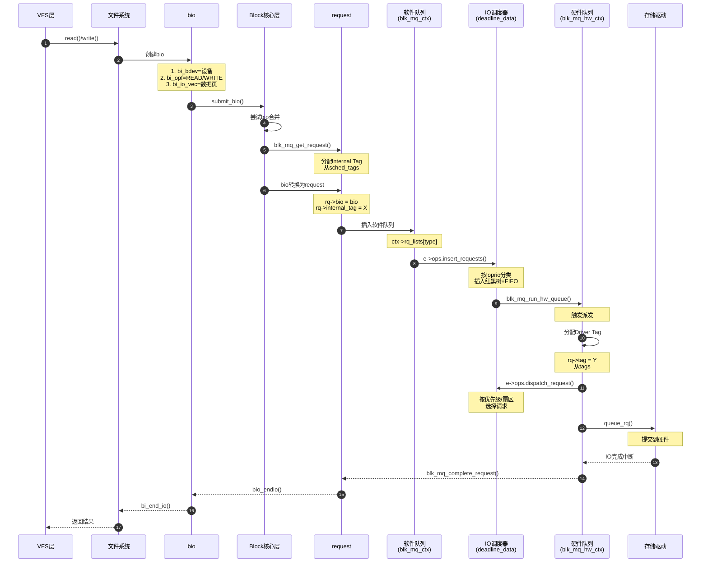
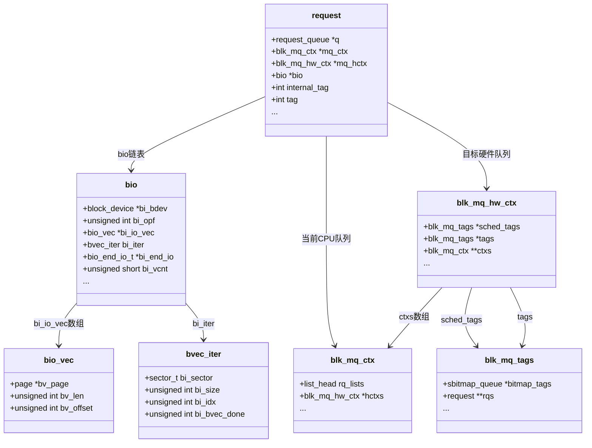

# IO 流程关键结构体详解（一）：总览与 Bio 层

> 本文是 **IO 流程关键结构体详解系列** 的第一篇，按照真实 IO 请求的生命周期为主线，介绍各阶段涉及的关键结构体。

**系列文章**：[查看完整系列](./README.md)

---

## 一、完整 IO 流程概览

### 1.1 IO 请求的完整生命周期



**流程关键点**：
- **阶段1（本文）**：VFS → Bio 创建
- **阶段2-4（下一篇）**：Bio → Request → 软件队列
- **阶段5（第三篇）**：调度器处理
- **阶段6-7（第四篇）**：硬件队列与派发
- **阶段8-9（第五篇）**：驱动处理与完成

### 1.2 结构体关系总览



---

## 二、阶段1：VFS 到 Bio 创建

### 2.1 struct bio - Block IO 的基本单位

**源码位置**: `include/linux/blk_types.h:221-289`

**在此阶段的作用**: 文件系统将 page cache 的数据封装为 bio，是文件系统与 Block 层的接口。

#### 2.1.1 完整结构体定义

```c
struct bio {
    struct bio          *bi_next;       // bio链表的下一个节点
    struct block_device *bi_bdev;       // 目标块设备
    unsigned int        bi_opf;         // 操作类型+标志
    unsigned short      bi_flags;       // BIO_* 标志位
    unsigned short      bi_ioprio;      // IO优先级
    unsigned short      bi_write_hint;  // 写入提示
    blk_status_t        bi_status;      // IO完成状态
    atomic_t            __bi_remaining; // 剩余引用计数
    
    struct bvec_iter    bi_iter;        // 当前迭代位置
    
    bio_end_io_t        *bi_end_io;     // 完成回调函数
    void                *bi_private;    // 私有数据指针
    
    // cgroup 相关
    struct blkcg_gq     *bi_blkg;       // cgroup关联
    struct bio_issue    bi_issue;       // IO发起时间戳
    u64                 bi_iocost_cost; // IO成本（可选）
    
    // 加密相关
    struct bio_crypt_ctx *bi_crypt_context;
    
    // 数据完整性
    struct bio_integrity_payload *bi_integrity;
    
    unsigned short      bi_vcnt;        // 当前bio_vec数量
    unsigned short      bi_max_vecs;    // 最大bio_vec数量
    atomic_t            __bi_cnt;       // bio引用计数
    
    struct bio_vec      *bi_io_vec;     // bio_vec数组指针
    struct bio_set      *bi_pool;       // 所属bio_set
    
    // 内联bio_vec数组（小bio优化）
    struct bio_vec      bi_inline_vecs[];
};
```

#### 2.1.2 核心字段详解 ⭐⭐⭐

| 字段名 | 类型 | 作用 | 使用场景 |
|--------|------|------|---------|
| **设备与操作** ||||
| `bi_bdev` | `struct block_device *` | **目标块设备** | submit_bio确定队列<br/>merge检查设备是否匹配 |
| `bi_opf` | `unsigned int` | **操作类型+标志**<br/>• 低8位: `REQ_OP_READ`/`WRITE`等<br/>• 高24位: `REQ_SYNC`/`REQ_META`等 | 整个IO路径判断：<br/>1. 读/写方向<br/>2. 是否同步<br/>3. 是否需要flush |
| **数据描述** ||||
| `bi_io_vec` | `struct bio_vec *` | **指向bio_vec数组** | 遍历获取各个内存段 |
| `bi_vcnt` | `unsigned short` | **bio_vec数量** | 遍历循环次数<br/>合并时检查是否超限 |
| `bi_iter` | `struct bvec_iter` | **迭代器**（见2.3详解）<br/>• `bi_sector`: 当前扇区<br/>• `bi_size`: 剩余字节数<br/>• `bi_idx`: 当前bio_vec索引<br/>• `bi_bvec_done`: 当前vec已处理字节 | 1. 遍历bio<br/>2. 分割bio<br/>3. 计算进度 |
| **回调机制** ||||
| `bi_end_io` | `bio_end_io_t *` | **完成回调函数** | IO完成时调用通知上层 |
| `bi_private` | `void *` | **回调上下文** | 传递给bi_end_io的私有数据 |

**详细说明**：

**bi_opf 字段组成**：
```c
// 示例：同步空闲写
bi_opf = REQ_OP_WRITE | REQ_SYNC | REQ_IDLE;

// 操作类型（低8位）
#define REQ_OP_READ     0
#define REQ_OP_WRITE    1
#define REQ_OP_FLUSH    2
#define REQ_OP_DISCARD  3

// 标志位（高24位）
#define REQ_SYNC        (1 << 8)   // 同步IO
#define REQ_META        (1 << 9)   // 元数据IO
#define REQ_PRIO        (1 << 10)  // 高优先级
#define REQ_IDLE        (1 << 11)  // 空闲时处理
#define REQ_FUA         (1 << 12)  // 强制写入介质
#define REQ_RAHEAD      (1 << 13)  // 预读

// 判断操作类型
static inline unsigned int bio_op(const struct bio *bio) {
    return bio->bi_opf & REQ_OP_MASK;
}
```

**bi_iter 使用示例**：
```c
// 遍历bio的所有段
struct bio_vec bvec;
struct bvec_iter iter;

bio_for_each_segment(bvec, bio, iter) {
    // bvec.bv_page: 当前页
    // bvec.bv_len: 当前段长度
    // bvec.bv_offset: 页内偏移
    
    // iter.bi_sector: 当前扇区位置
    // iter.bi_size: 剩余未处理字节数
}
```

#### 2.1.3 重要字段简介 ⭐⭐

| 字段名 | 类型 | 作用 |
|--------|------|------|
| `bi_next` | `struct bio *` | bio链表（批量提交时链接） |
| `bi_ioprio` | `unsigned short` | IO优先级（0-7，调度器使用） |
| `bi_status` | `blk_status_t` | 完成状态（BLK_STS_OK/IOERR等） |
| `__bi_remaining` | `atomic_t` | 引用计数（clone、chain时递减） |
| `__bi_cnt` | `atomic_t` | bio引用计数（bio_get/bio_put） |
| `bi_max_vecs` | `unsigned short` | 最大bio_vec数量（bio_alloc时指定） |

#### 2.1.4 次要字段概述 ⭐

| 字段组 | 相关字段 | 说明 |
|--------|---------|------|
| **cgroup统计** | `bi_blkg`, `bi_issue`, `bi_iocost_cost` | IO统计、限流、成本计算 |
| **安全特性** | `bi_crypt_context`, `bi_integrity` | 加密上下文、数据完整性检查（DIF/DIX） |
| **内存管理** | `bi_pool`, `bi_inline_vecs[]` | bio_set管理、小bio内联优化 |
| **特殊标志** | `bi_flags`, `bi_write_hint` | BIO_CLONED/BOUNCED等、写入提示 |

#### 2.1.5 bio 创建示例代码

```c
// fs/ext4/page-io.c - 文件系统创建bio示例
struct bio *bio;
struct inode *inode = page->mapping->host;

// 1. 分配bio（最多1个bio_vec）
bio = bio_alloc(GFP_NOFS, 1);
if (!bio)
    return -ENOMEM;

// 2. 填充核心字段
bio->bi_iter.bi_sector = block * (blocksize >> 9);  // 起始扇区
bio->bi_bdev = inode->i_sb->s_bdev;                 // 目标设备
bio->bi_opf = REQ_OP_WRITE;                         // 写操作
bio->bi_end_io = ext4_end_bio;                      // 完成回调
bio->bi_private = io_end;                           // 私有数据

// 3. 添加数据页
if (bio_add_page(bio, page, blocksize, 0) < blocksize) {
    bio_put(bio);
    return -EIO;
}

// 4. 提交bio
submit_bio(bio);
```

---

### 2.2 struct bio_vec - 内存段描述

**源码位置**: `include/linux/bvec.h:31-40`

**在此阶段的作用**: 描述 bio 中每个物理内存段（page + offset + length）。

#### 2.2.1 完整结构体定义

```c
struct bio_vec {
    struct page     *bv_page;    // 页指针
    unsigned int    bv_len;      // 长度（字节）
    unsigned int    bv_offset;   // 页内偏移
};
```

#### 2.2.2 所有成员变量详解

| 字段名 | 类型 | 大小 | 作用 | 典型值 |
|--------|------|------|------|--------|
| `bv_page` | `struct page *` | 8字节 | **指向物理页**<br/>通常是page cache页 | 内核page结构指针 |
| `bv_len` | `unsigned int` | 4字节 | **有效数据长度**<br/>不超过页大小 | 通常4096（一整页）<br/>也可以512/1024等 |
| `bv_offset` | `unsigned int` | 4字节 | **页内偏移**<br/>数据起始位置 | 0-4095<br/>（PAGE_SIZE-1） |

**结构体大小**: 16 字节（64位系统）

#### 2.2.3 使用示例

```c
// 示例1：添加一个完整页
struct bio_vec bvec;
bvec.bv_page = page;
bvec.bv_len = PAGE_SIZE;  // 4096
bvec.bv_offset = 0;

// 示例2：添加部分页（512字节，从偏移1024开始）
bvec.bv_page = page;
bvec.bv_len = 512;
bvec.bv_offset = 1024;

// 示例3：获取虚拟地址
void *data = page_address(bvec.bv_page) + bvec.bv_offset;
memcpy(buffer, data, bvec.bv_len);
```

#### 2.2.4 bio_vec 数组布局示例

```
bio {
    bi_io_vec ───┐
    bi_vcnt = 3  │
}                │
                 │
                 ▼
    ┌─────────────────────────────────────────────────────┐
    │ bio_vec[0]  │ bio_vec[1]  │ bio_vec[2]  │  ...      │
    └─────────────────────────────────────────────────────┘
         │             │             │
         │             │             └──► Page C (offset=2048, len=2048)
         │             └────────────────► Page B (offset=0, len=4096)
         └──────────────────────────────► Page A (offset=0, len=4096)

总数据量 = 4096 + 4096 + 2048 = 10240 字节
```

---

### 2.3 struct bvec_iter - Bio 迭代器

**源码位置**: `include/linux/bvec.h:17-29`

**在此阶段的作用**: 跟踪 bio 的处理进度，支持部分完成、分割、遍历等操作。

#### 2.3.1 完整结构体定义

```c
struct bvec_iter {
    sector_t        bi_sector;      // 当前扇区位置
    unsigned int    bi_size;        // 剩余未处理字节数
    unsigned int    bi_idx;         // 当前bio_vec索引
    unsigned int    bi_bvec_done;   // 当前vec已处理字节数
};
```

#### 2.3.2 所有成员变量详解

| 字段名 | 类型 | 作用 | 更新时机 | 示例 |
|--------|------|------|---------|------|
| `bi_sector` | `sector_t` (u64) | **当前扇区位置**<br/>（1扇区=512字节） | • bio创建时初始化<br/>• 每处理一段后递增 | 初始: 1000<br/>处理4KB后: 1008 |
| `bi_size` | `unsigned int` | **剩余未处理字节数** | • 初始为总长度<br/>• 每处理一段后递减 | 初始: 8192<br/>处理4KB后: 4096 |
| `bi_idx` | `unsigned int` | **当前bio_vec索引**<br/>指向正在处理的vec | • 初始为0<br/>• 当前vec处理完后递增 | 第1个vec: 0<br/>第2个vec: 1 |
| `bi_bvec_done` | `unsigned int` | **当前vec已处理字节数** | • 每个vec开始时为0<br/>• 部分处理后更新<br/>• vec完成时重置为0 | vec内处理2KB: 2048 |

#### 2.3.3 详细工作原理

**完整遍历示例**：

```c
// 假设bio有3个bio_vec:
// vec[0]: 4096字节
// vec[1]: 4096字节  
// vec[2]: 2048字节
// 总计: 10240字节

struct bio *bio;
bio->bi_iter.bi_sector = 1000;    // 起始扇区（LBA）
bio->bi_iter.bi_size = 10240;     // 总字节数
bio->bi_iter.bi_idx = 0;          // 从第0个vec开始
bio->bi_iter.bi_bvec_done = 0;    // 当前vec已处理0字节

// 遍历所有段
struct bio_vec bvec;
struct bvec_iter iter;

bio_for_each_segment(bvec, bio, iter) {
    // 第一次迭代:
    //   iter.bi_sector = 1000, bi_size = 10240, bi_idx = 0, bi_bvec_done = 0
    //   bvec = vec[0] (4096字节)
    
    // 第二次迭代:
    //   iter.bi_sector = 1008, bi_size = 6144, bi_idx = 1, bi_bvec_done = 0
    //   bvec = vec[1] (4096字节)
    
    // 第三次迭代:
    //   iter.bi_sector = 1016, bi_size = 2048, bi_idx = 2, bi_bvec_done = 0
    //   bvec = vec[2] (2048字节)
}
```

**部分处理示例（bio分割）**：

```c
// 假设只能处理前6144字节（1.5个vec）

bio_advance(bio, 6144);

// 结果:
// bi_sector = 1000 + (6144 >> 9) = 1012  (增加12个扇区)
// bi_size = 10240 - 6144 = 4096           (剩余4096字节)
// bi_idx = 1                              (跳过vec[0]，到vec[1])
// bi_bvec_done = 2048                     (vec[1]已处理2048字节)

// 此时bio只包含剩余部分:
// - vec[1]的后2048字节
// - vec[2]的全部2048字节
```

#### 2.3.4 关键辅助宏和函数

```c
// 1. 遍历bio的所有段
#define bio_for_each_segment(bvl, bio, iter) \
    __bio_for_each_segment(bvl, bio, iter, (bio)->bi_iter)

// 2. 获取bio的起始扇区
static inline sector_t bio_sector(struct bio *bio) {
    return bio->bi_iter.bi_sector;
}

// 3. 获取bio的剩余字节数
static inline unsigned int bio_size(struct bio *bio) {
    return bio->bi_iter.bi_size;
}

// 4. 推进bio（已处理nbytes字节）
void bio_advance(struct bio *bio, unsigned int nbytes);

// 5. 获取当前bio_vec
#define bio_iter_iovec(bio, iter) \
    ((struct bio_vec) { \
        .bv_page    = bio_iter_page((bio), (iter)), \
        .bv_len     = bio_iter_len((bio), (iter)), \
        .bv_offset  = bio_iter_offset((bio), (iter)), \
    })
```

#### 2.3.5 实际应用场景

**场景1：驱动层遍历bio获取DMA地址**

```c
// drivers/scsi/ufs/ufshcd.c
struct bio_vec bvec;
struct bvec_iter iter;
struct scatterlist *sg;
int i = 0;

bio_for_each_segment(bvec, rq->bio, iter) {
    sg_set_page(&sg[i], bvec.bv_page, bvec.bv_len, bvec.bv_offset);
    i++;
}
```

**场景2：bio分割（设备一次只能处理4KB）**

```c
unsigned int max_bytes = 4096;

while (bio->bi_iter.bi_size > 0) {
    unsigned int bytes = min(bio->bi_iter.bi_size, max_bytes);
    
    // 处理当前bytes
    submit_to_hardware(bio, bytes);
    
    // 推进迭代器
    bio_advance(bio, bytes);
}
```

---

## 三、bio 完整生命周期示例

### 3.1 创建 → 提交 → 完成

```c
// 1. 文件系统创建bio
struct bio *bio = bio_alloc(GFP_NOFS, nr_pages);
bio->bi_iter.bi_sector = start_sector;
bio->bi_bdev = bdev;
bio->bi_opf = REQ_OP_READ | REQ_SYNC;
bio->bi_end_io = my_end_io;
bio->bi_private = my_data;

// 2. 添加数据页
for (i = 0; i < nr_pages; i++) {
    bio_add_page(bio, pages[i], PAGE_SIZE, 0);
}

// 3. 提交bio
submit_bio(bio);

// 4. IO完成时回调
static void my_end_io(struct bio *bio)
{
    struct my_data *data = bio->bi_private;
    
    if (bio->bi_status == BLK_STS_OK) {
        // IO成功
        complete(&data->io_done);
    } else {
        // IO失败
        printk("IO error: %d\n", bio->bi_status);
    }
    
    bio_put(bio);  // 释放bio
}
```

### 3.2 bio字段在各阶段的变化

| 阶段 | bi_sector | bi_size | bi_idx | bi_bvec_done | 状态 |
|------|-----------|---------|--------|--------------|------|
| 创建 | 1000 | 12288 | 0 | 0 | 初始化 |
| 提交 | 1000 | 12288 | 0 | 0 | submit_bio() |
| 处理中 | 1008 | 8192 | 1 | 0 | 已处理4KB |
| 处理中 | 1016 | 4096 | 2 | 0 | 已处理8KB |
| 完成 | 1024 | 0 | 3 | 0 | bi_end_io() |

---

## 四、总结与下篇预告

### 4.1 本文要点

1. **bio 是文件系统与 Block 层的接口**
   - 核心字段：`bi_bdev`, `bi_opf`, `bi_io_vec`, `bi_iter`, `bi_end_io`
   - `bi_opf` 组合了操作类型和标志位
   - `bi_iter` 跟踪处理进度

2. **bio_vec 描述物理内存段**
   - 三元组：`(page, offset, length)`
   - 支持非连续内存的 scatter-gather IO

3. **bvec_iter 是强大的迭代器**
   - 四个字段精确定位当前位置
   - 支持部分处理、分割、遍历

### 4.2 下篇预告

**[24-Request分配与软件队列](./24-Request分配与软件队列.md)** 将介绍：

- **阶段2**：`request_queue` - bio如何合并
- **阶段3**：
  - `blk_mq_tags` - Internal Tag池
  - `sbitmap_queue` - 位图分配机制
  - `request` - 如何从bio转换
- **阶段4**：`blk_mq_ctx` - 软件队列（Per-CPU）

**关键问题**：
- Internal Tag 和 Driver Tag 有什么区别？
- request 如何分配和初始化？
- 为什么需要软件队列？

---

## 附录：快速参考

### A. bio 核心字段速查

| 字段 | 作用 | 访问宏 |
|------|------|--------|
| `bi_bdev` | 目标设备 | - |
| `bi_opf` | 操作类型 | `bio_op(bio)` |
| `bi_iter.bi_sector` | 起始扇区 | `bio_sector(bio)` |
| `bi_iter.bi_size` | 剩余字节数 | `bio_size(bio)` |
| `bi_vcnt` | bio_vec数量 | - |
| `bi_io_vec` | bio_vec数组 | `bio_iovec(bio)` |

### B. 常用宏

```c
// 操作类型判断
bio_op(bio)              // 获取操作类型
bio_data_dir(bio)        // 读(0)或写(1)
op_is_write(bio->bi_opf) // 是否为写

// 遍历
bio_for_each_segment(bvec, bio, iter)  // 遍历所有段

// 大小计算
bio_sectors(bio)         // 扇区数
bio_size(bio)            // 字节数
```

### C. 相关源码文件

- `include/linux/blk_types.h` - bio 定义
- `include/linux/bvec.h` - bio_vec, bvec_iter
- `block/bio.c` - bio 操作函数
- `block/blk-merge.c` - bio 合并逻辑

---

**下一篇**: [24-Request分配与软件队列](./24-Request分配与软件队列.md)

**返回**: [系列文章目录](./README.md)
