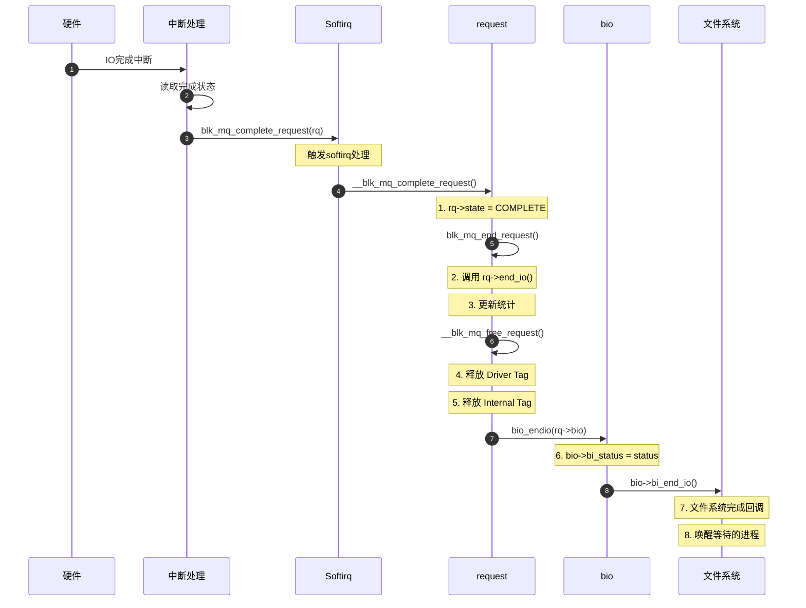

# IO 流程关键结构体详解（五）：驱动处理与 IO 完成

> 本文是 **IO 流程关键结构体详解系列** 的第五篇（最后一篇），介绍驱动层如何处理 request、IO 完成流程，以及完整的调试参考。

**系列文章**：[查看完整系列](./README.md)  
**上一篇**：[26-硬件队列与Tag派发](./26-硬件队列与Tag派发.md)

---

## 本篇涵盖的流程阶段

```
┌────────────────────────────────────────────────────────────────────────┐
│   阶段8                              阶段9                              │
│                                                                        │
│   驱动处理                     ──▶    IO完成与清理                      │
│                                                                        │
│   queue_rq()                        blk_mq_complete_request()         │
│   (驱动访问request字段)              (释放Tag、回调、清理)              │
└────────────────────────────────────────────────────────────────────────┘
```

---

## 一、阶段8：驱动处理

### 1.1 驱动视角的 request

驱动层通过 `queue_rq()` 回调接收 request，关心以下字段：

#### 1.1.1 驱动最关心的字段 ⭐⭐⭐

| 字段名 | 类型 | 驱动的使用 | 访问宏 |
|--------|------|-----------|--------|
| **IO位置与大小** ||||
| `__sector` | `sector_t` | **起始LBA**<br/>（512字节为单位） | `blk_rq_pos(rq)` |
| `__data_len` | `unsigned int` | **总字节数** | `blk_rq_bytes(rq)` |
| `nr_phys_segments` | `unsigned short` | **物理段数量**<br/>DMA映射需要的数量 | `blk_rq_nr_phys_segments(rq)` |
| **操作类型** ||||
| `cmd_flags` | `unsigned int` | **操作类型和标志**<br/>判断读/写/flush等 | `req_op(rq)`<br/>`rq_data_dir(rq)` |
| **数据访问** ||||
| `bio` | `struct bio *` | **bio链表**<br/>遍历获取各个段的数据 | `__rq_for_each_bio(bio, rq)` |
| **硬件队列标签** ||||
| `tag` | `int` | **Driver Tag**<br/>硬件队列标签（0-30） | 直接访问 `rq->tag` |
| **超时管理** ||||
| `timeout` | `unsigned int` | 超时时间（jiffies） | `rq->timeout` |
| `deadline` | `unsigned long` | 超时deadline | `rq->deadline` |
| **完成回调** ||||
| `end_io` | `rq_end_io_fn *` | 驱动完成回调 | 驱动可设置自己的回调 |
| `end_io_data` | `void *` | 回调数据 | - |

#### 1.1.2 驱动次要关心的字段 ⭐⭐

| 字段 | 用途 |
|------|------|
| `rq_disk`, `part` | 目标磁盘和分区 |
| `ioprio` | IO优先级（某些驱动支持硬件优先级） |
| `write_hint` | 写入提示（生命周期提示） |
| `crypt_ctx`, `crypt_keyslot` | 硬件加密支持 |
| `stats_sectors` | 统计用扇区数 |

### 1.2 驱动处理示例代码

#### 1.2.1 UFS 驱动示例

```c
// drivers/scsi/ufs/ufshcd.c - 简化版
static int ufshcd_queuecommand(struct blk_mq_hw_ctx *hctx,
                                const struct blk_mq_queue_data *bd)
{
    struct request *rq = bd->rq;
    struct ufs_hba *hba = hctx->driver_data;
    struct ufshcd_lrb *lrbp;
    int tag = rq->tag;  // Driver Tag
    int err;

    // 1. 获取request信息
    unsigned int lba = blk_rq_pos(rq);          // 起始LBA
    unsigned int transfer_len = blk_rq_bytes(rq); // 传输字节数
    unsigned int data_direction = rq_data_dir(rq); // 读(0)或写(1)

    // 2. 获取LRB（Local Request Buffer）
    lrbp = &hba->lrb[tag];  // 使用Driver Tag作为索引
    lrbp->cmd = rq;
    lrbp->sense_bufflen = 0;
    lrbp->lun = ufshcd_scsi_to_upiu_lun(cmd->device->lun);

    // 3. 构建UPIU命令
    ufshcd_comp_scsi_upiu(hba, lrbp);

    // 4. 映射DMA
    err = ufshcd_map_sg(hba, lrbp);
    if (err) {
        lrbp->cmd = NULL;
        return BLK_STS_RESOURCE;
    }

    // 5. 构建UTP Transfer Request Descriptor
    ufshcd_prepare_req_desc_hdr(lrbp, &upiu_flags, data_direction);

    // 6. 提交到硬件
    spin_lock_irqsave(hba->host->host_lock, flags);
    ufshcd_send_command(hba, tag);  // 使用tag作为硬件队列槽位
    spin_unlock_irqrestore(hba->host->host_lock, flags);

    return BLK_STS_OK;
}
```

#### 1.2.2 遍历 bio 获取数据段

```c
// 驱动遍历request的所有bio段
struct request *rq;
struct bio *bio;
struct bio_vec bvec;
struct bvec_iter iter;
struct scatterlist *sg;
int sg_cnt = 0;

// 遍历所有bio
__rq_for_each_bio(bio, rq) {
    // 遍历bio的所有段
    bio_for_each_segment(bvec, bio, iter) {
        // 设置scatter-gather列表
        sg_set_page(&sg[sg_cnt], 
                    bvec.bv_page,      // 页
                    bvec.bv_len,       // 长度
                    bvec.bv_offset);   // 偏移
        sg_cnt++;
    }
}

// 映射DMA
dma_map_sg(dev, sg, sg_cnt, DMA_TO_DEVICE);
```

### 1.3 驱动必须处理的 request 字段

```
queue_rq(hctx, bd) 入参分析:

struct blk_mq_queue_data *bd = {
    .rq = request,           // 要处理的请求
    .last = true/false,      // 是否为本批次最后一个
};

驱动处理流程:
1. 从 rq->tag 获取硬件队列槽位
2. 从 rq->__sector, rq->__data_len 构建命令
3. 遍历 rq->bio 链表获取数据地址
4. 构建硬件命令描述符
5. 提交到硬件（写doorbell寄存器等）
6. 返回 BLK_STS_OK / BLK_STS_RESOURCE / BLK_STS_IOERR
```

---

## 二、阶段9：IO 完成与清理

### 2.1 完成流程概览



### 2.2 Request 完成时的字段变化

| 阶段 | state | tag | internal_tag | rq_flags | queuelist | 操作 |
|------|-------|-----|--------------|----------|-----------|------|
| **派发中** | IN_FLIGHT | 5 | 10 | RQF_STARTED | 驱动队列 | 硬件执行 |
| **中断到达** | IN_FLIGHT | 5 | 10 | RQF_STARTED | 驱动队列 | `blk_mq_complete_request()` |
| **标记完成** | **COMPLETE** | 5 | 10 | RQF_STARTED | 驱动队列 | 状态更新 |
| **结束请求** | COMPLETE | 5 | 10 | RQF_STARTED | 空 | `blk_mq_end_request()` |
| **释放Tag** | COMPLETE | **-1** | **-1** | 0 | 空 | `__blk_mq_free_request()` |
| **回收** | **IDLE** | -1 | -1 | 0 | 空 | 归还到static_rqs |

### 2.3 完成流程关键代码

```c
// block/blk-mq.c - IO完成主流程

// 1. 驱动调用（中断上下文）
void blk_mq_complete_request(struct request *rq)
{
    // 标记完成状态
    WRITE_ONCE(rq->state, MQ_RQ_COMPLETE);
    
    // 触发softirq处理
    if (rq->q->nr_hw_queues == 1) {
        __blk_complete_request(rq);
    } else {
        // 多队列：使用IPI
        rq->csd.func = __blk_mq_complete_request_remote;
        rq->csd.info = rq;
        smp_call_function_single_async(rq->mq_ctx->cpu, &rq->csd);
    }
}

// 2. Softirq处理
void __blk_mq_complete_request(struct request *rq)
{
    struct request_queue *q = rq->q;

    // 调用完成回调
    if (rq->end_io) {
        rq->end_io(rq, 0);
    } else {
        // 默认完成处理
        blk_mq_end_request(rq, 0);
    }
}

// 3. 结束request
void blk_mq_end_request(struct request *rq, blk_status_t error)
{
    // 更新bio状态
    if (rq->bio) {
        bio_set_flag(rq->bio, BIO_TRACE_COMPLETION);
        blk_update_request(rq, error, blk_rq_bytes(rq));
    }

    // 释放request
    __blk_mq_free_request(rq);
}

// 4. 释放request
static void __blk_mq_free_request(struct request *rq)
{
    struct request_queue *q = rq->q;
    struct blk_mq_ctx *ctx = rq->mq_ctx;
    struct blk_mq_hw_ctx *hctx = rq->mq_hctx;
    const int sched_tag = rq->internal_tag;

    // 释放Driver Tag
    if (rq->tag != BLK_MQ_NO_TAG)
        blk_mq_put_tag(hctx->tags, ctx, rq->tag);
    
    // 释放Internal Tag
    if (sched_tag != BLK_MQ_NO_TAG)
        blk_mq_put_tag(hctx->sched_tags, ctx, sched_tag);
    
    // 可能触发重新派发
    blk_mq_sched_restart(hctx);
    
    // request回收（状态重置为IDLE）
    WRITE_ONCE(rq->state, MQ_RQ_IDLE);
    if (refcount_dec_and_test(&rq->ref))
        __blk_mq_free_request(rq);  // 引用计数为0，真正释放
}
```

### 2.4 Bio 完成回调

```c
// block/bio.c
void bio_endio(struct bio *bio)
{
    // 1. 更新引用计数
    if (!bio_flagged(bio, BIO_CHAIN)) {
        if (bio->bi_end_io)
            bio->bi_end_io(bio);  // 调用完成回调
        return;
    }

    // 2. bio chain 场景
    if (atomic_dec_and_test(&bio->__bi_remaining)) {
        // 所有child bio都完成了
        if (bio->bi_end_io)
            bio->bi_end_io(bio);
    }
}

// 文件系统的完成回调示例
static void ext4_end_bio(struct bio *bio)
{
    struct inode *inode = bio->bi_private;
    
    // 1. 检查IO状态
    if (bio->bi_status != BLK_STS_OK) {
        printk("IO error on sector %llu\n", bio->bi_iter.bi_sector);
        SetPageError(bio_page(bio));
    }

    // 2. 标记页为最新
    SetPageUptodate(bio_page(bio));

    // 3. 唤醒等待的进程
    unlock_page(bio_page(bio));

    // 4. 释放bio
    bio_put(bio);
}
```

---

## 三、Tag 释放与重用

### 3.1 Tag 释放流程

```c
// block/blk-mq-tag.c
void blk_mq_put_tag(struct blk_mq_tags *tags, struct blk_mq_ctx *ctx,
                    unsigned int tag)
{
    if (!blk_mq_tag_is_reserved(tags, tag)) {
        const int real_tag = tag - tags->nr_reserved_tags;
        
        // 清除位图位
        __sbitmap_queue_clear(tags->bitmap_tags, real_tag, ctx->cpu);
    } else {
        // 保留tag
        __sbitmap_queue_clear(tags->breserved_tags, tag, ctx->cpu);
    }
}

// lib/sbitmap.c
static inline void __sbitmap_queue_clear(struct sbitmap_queue *sbq,
                                         unsigned int nr, unsigned int cpu)
{
    // 1. 清除位图位
    sbitmap_clear_bit(&sbq->sb, nr);

    // 2. 累积wait_cnt
    if (likely(!sbq_full_cleared))
        return;

    // 3. 批量唤醒
    ws = &sbq->ws[index];
    if (atomic_inc_return(&ws->wait_cnt) >= sbq->wake_batch) {
        atomic_set(&ws->wait_cnt, 0);
        wake_up_nr(&ws->wait, sbq->wake_batch);  // 唤醒等待的进程
    }
}
```

### 3.2 Tag 释放触发的后续动作

```
┌─────────────────────────────────────────────────────────────────┐
│                  Tag释放的连锁反应                               │
├─────────────────────────────────────────────────────────────────┤
│                                                                 │
│  IO完成                                                          │
│    │                                                             │
│    ├─▶ 释放 Driver Tag                                          │
│    │     └─▶ 唤醒 hctx->dispatch_wait                           │
│    │          └─▶ blk_mq_sched_restart(hctx)                    │
│    │               └─▶ blk_mq_run_hw_queue(hctx, true)          │
│    │                    └─▶ 重新派发dispatch队列                 │
│    │                                                             │
│    └─▶ 释放 Internal Tag                                        │
│          └─▶ 唤醒 sched_tags->bitmap_tags->ws[]                 │
│               └─▶ 阻塞在blk_mq_get_tag()的进程被唤醒             │
│                    └─▶ 继续分配request                          │
│                                                                 │
└─────────────────────────────────────────────────────────────────┘
```

---

## 四、完整生命周期回顾

### 4.1 Request 生命周期各阶段

| 阶段 | 函数 | internal_tag | tag | state | queuelist | 所在位置 |
|------|------|-------------|-----|-------|-----------|---------|
| **1. 分配** | `blk_mq_get_request()` | 10 ✓ | -1 | IDLE | 空 | 刚分配 |
| **2. 初始化** | `blk_mq_bio_to_request()` | 10 | -1 | IDLE | 空 | bio→rq |
| **3. 插入ctx** | `__blk_mq_insert_request()` | 10 | -1 | IDLE | ctx->rq_lists | 软件队列 |
| **4. 插入调度器** | `dd_insert_request()` | 10 | -1 | IDLE | 红黑树+FIFO | 调度器 |
| **5. 选择派发** | `dd_dispatch_request()` | 10 | -1 | IDLE | 临时list | 已选出 |
| **6. 分配Driver Tag** | `blk_mq_get_driver_tag()` | 10 | 5 ✓ | IDLE | 派发list | 准备派发 |
| **7. 派发** | `queue_rq()` | 10 | 5 | IN_FLIGHT ✓ | 驱动队列 | 硬件执行 |
| **8. 完成** | `blk_mq_complete_request()` | 10 | 5 | COMPLETE ✓ | 驱动队列 | 中断到达 |
| **9. 释放Tag** | `__blk_mq_free_request()` | -1 ✗ | -1 ✗ | IDLE ✓ | 空 | 回收 |

### 4.2 关键时间戳

| 时间戳字段 | 记录时机 | 用途 |
|-----------|---------|------|
| `alloc_time_ns` | `blk_mq_get_request()` | 分配延迟统计 |
| `start_time_ns` | `blk_mq_start_request()` | 派发延迟统计 |
| `io_start_time_ns` | `queue_rq()` | IO执行时间统计 |
| 完成时间 | `blk_mq_complete_request()` | 通过当前时间计算 |

**延迟计算**：
```
总延迟 = 完成时间 - alloc_time_ns
├─ 等待延迟 = start_time_ns - alloc_time_ns   (等待调度+Driver Tag)
├─ 派发延迟 = io_start_time_ns - start_time_ns (派发准备)
└─ 硬件延迟 = 完成时间 - io_start_time_ns      (硬件执行)
```

---

## 五、附录

### 附录 A：结构体关系速查表

#### A.1 指针引用关系

| 从结构体 | 字段 | 到结构体 | 关系类型 | 说明 |
|---------|------|---------|---------|------|
| **bio相关** |||||
| `bio` | `bi_bdev` | `block_device` | 聚合 | 目标设备 |
| `bio` | `bi_io_vec` | `bio_vec` | 聚合（数组） | 内存段 |
| `bio` | `bi_next` | `bio` | 链表 | bio链表 |
| **request相关** |||||
| `request` | `q` | `request_queue` | 聚合 | 所属队列 |
| `request` | `mq_ctx` | `blk_mq_ctx` | 聚合 | 当前CPU队列 |
| `request` | `mq_hctx` | `blk_mq_hw_ctx` | 聚合 | 目标硬件队列 |
| `request` | `bio` | `bio` | 聚合（链表） | bio链表 |
| **队列相关** |||||
| `blk_mq_ctx` | `hctxs[]` | `blk_mq_hw_ctx` | 聚合 | 映射的硬件队列 |
| `blk_mq_ctx` | `queue` | `request_queue` | 聚合 | 所属队列 |
| `blk_mq_hw_ctx` | `queue` | `request_queue` | 聚合 | 所属队列 |
| `blk_mq_hw_ctx` | `ctxs[]` | `blk_mq_ctx` | 聚合（数组） | 软件队列数组 |
| `blk_mq_hw_ctx` | `sched_tags` | `blk_mq_tags` | 聚合 | Internal Tag池 |
| `blk_mq_hw_ctx` | `tags` | `blk_mq_tags` | 聚合 | Driver Tag池 |
| `blk_mq_hw_ctx` | `sched_data` | `deadline_data` | 聚合 | 调度器数据 |
| **调度器相关** |||||
| `elevator_queue` | `elevator_data` | `deadline_data` | 聚合 | 调度器私有数据 |
| `deadline_data` | `per_prio[]` | `dd_per_prio` | 聚合（数组） | 优先级队列 |
| **Tag相关** |||||
| `blk_mq_tags` | `bitmap_tags` | `sbitmap_queue` | 聚合 | 位图队列 |
| `blk_mq_tags` | `static_rqs[]` | `request` | 聚合（数组） | request数组 |

#### A.2 关键结构体大小

```bash
# 使用 pahole 查看结构体大小和布局
pahole -C bio vmlinux
# struct bio {
#     sizeof = 168 bytes
# }

pahole -C request vmlinux
# struct request {
#     sizeof = 360 bytes
# }

pahole -C blk_mq_hw_ctx vmlinux
# struct blk_mq_hw_ctx {
#     sizeof = 704 bytes
# }

pahole -C blk_mq_ctx vmlinux
# struct blk_mq_ctx {
#     sizeof = 192 bytes
# }
```

### 附录 B：常用访问宏汇总

#### B.1 Request 访问宏

```c
// 操作类型
req_op(rq)                    // 获取操作类型 (REQ_OP_READ/WRITE/...)
rq_data_dir(rq)               // 读(0)或写(1)
op_is_write(rq->cmd_flags)    // 是否为写
op_is_sync(rq->cmd_flags)     // 是否为同步
op_is_flush(rq->cmd_flags)    // 是否为flush

// 位置和大小
blk_rq_pos(rq)                // 起始扇区 (rq->__sector)
blk_rq_sectors(rq)            // 扇区数 (__data_len >> 9)
blk_rq_bytes(rq)              // 字节数 (__data_len)
blk_rq_cur_sectors(rq)        // 当前bio的扇区数
blk_rq_cur_bytes(rq)          // 当前bio的字节数

// Bio遍历
__rq_for_each_bio(bio, rq)    // 遍历rq的所有bio
rq_for_each_segment(bvec, rq, iter)  // 遍历rq的所有段

// Tag相关
blk_mq_rq_to_pdu(rq)          // 获取request后的私有数据区
blk_mq_unique_tag(rq)         // 获取全局唯一tag

// 状态检查
blk_rq_is_passthrough(rq)     // 是否为透传请求
blk_rq_is_seq(rq)             // 是否为顺序请求
```

#### B.2 Bio 访问宏

```c
// 操作类型
bio_op(bio)                   // 操作类型
bio_data_dir(bio)             // 读或写
op_is_write(bio->bi_opf)      // 是否为写

// 位置和大小
bio_sector(bio)               // 起始扇区
bio_sectors(bio)              // 扇区数
bio_size(bio)                 // 字节数

// 遍历
bio_for_each_segment(bvec, bio, iter)  // 遍历所有段
bio_for_each_bvec(bvec, bio, iter)     // 遍历所有bvec

// 段数
bio_segments(bio)             // 段数
bio_pages(bio)                // 页数
```

### 附录 C：调试技巧

#### C.1 使用 crash 分析结构体

```bash
# 启动crash
crash /usr/lib/debug/vmlinux /proc/kcore

# 查看结构体定义
crash> struct request
crash> struct blk_mq_hw_ctx
crash> struct bio

# 查看结构体字段偏移
crash> struct -o request
struct request {
    [0] struct request_queue *q;
    [8] struct blk_mq_ctx *mq_ctx;
    [16] struct blk_mq_hw_ctx *mq_hctx;
    [24] unsigned int cmd_flags;
    [28] req_flags_t rq_flags;
    [32] int tag;
    [36] int internal_tag;
    ...
}

# 查看实际request实例
crash> struct request ffff888012345678
struct request {
  q = 0xffff88801111111,
  mq_ctx = 0xffff88802222222,
  mq_hctx = 0xffff88803333333,
  cmd_flags = 0x1,  // REQ_OP_WRITE
  tag = 5,
  internal_tag = 10,
  __sector = 1000,
  __data_len = 4096,
  bio = 0xffff888044444444,
  ...
}

# 遍历链表
crash> list request.queuelist -s request -H ffff888012345678
```

#### C.2 使用 bpftrace 跟踪

```bash
# 跟踪request的tag分配
bpftrace -e '
kprobe:blk_mq_get_request {
    printf("Alloc request: pid=%d\n", pid);
}

kretprobe:blk_mq_get_request {
    $rq = (struct request *)retval;
    printf("  internal_tag=%d tag=%d\n", 
           $rq->internal_tag, $rq->tag);
}
'

# 跟踪Driver Tag分配
bpftrace -e '
kprobe:blk_mq_get_driver_tag {
    $rq = (struct request *)arg0;
    printf("Get driver tag: internal_tag=%d\n", $rq->internal_tag);
}

kretprobe:blk_mq_get_driver_tag /@rv/ {
    $rq = (struct request *)arg0;
    printf("  Success! tag=%d\n", $rq->tag);
}
'

# 跟踪完整生命周期
bpftrace -e '
kprobe:blk_mq_get_request {
    @alloc_time[arg1] = nsecs;  // bio作为key
    printf("alloc bio=%p\n", arg1);
}

kprobe:blk_mq_start_request {
    $rq = (struct request *)arg0;
    $bio = $rq->bio;
    @start_time[$bio] = nsecs;
    printf("start bio=%p tag=%d\n", $bio, $rq->tag);
}

kprobe:blk_mq_complete_request {
    $rq = (struct request *)arg0;
    $bio = $rq->bio;
    $now = nsecs;
    printf("complete bio=%p total=%dus\n", 
           $bio, ($now - @alloc_time[$bio]) / 1000);
}
'
```

#### C.3 使用 ftrace 监控

```bash
# 启用相关tracepoint
cd /sys/kernel/debug/tracing
echo 1 > events/block/block_rq_insert/enable
echo 1 > events/block/block_rq_issue/enable
echo 1 > events/block/block_rq_complete/enable
echo 1 > events/block/block_bio_queue/enable
echo 1 > events/block/block_bio_complete/enable

# 过滤特定设备
echo 'dev == 8,0' > events/block/filter

# 开始追踪
echo 1 > tracing_on

# 执行IO
dd if=/dev/sda of=/dev/null bs=4k count=10

# 查看结果
cat trace

# 典型输出:
# dd-1234  [002] .... 123.456: block_bio_queue: 8,0 R 12345 + 8 [dd]
# dd-1234  [002] .... 123.457: block_rq_insert: 8,0 R 0 () 12345 + 8 [dd]
# dd-1234  [002] .... 123.458: block_rq_issue: 8,0 R 0 () 12345 + 8 [dd]
# <idle>-0 [002] ..s. 123.460: block_rq_complete: 8,0 R () 12345 + 8 [0]
# <idle>-0 [002] ..s. 123.461: block_bio_complete: 8,0 R 12345 + 8 [0]
```

#### C.4 通过 sysfs/debugfs 查看运行时状态

```bash
# ===== 队列配置 =====
cat /sys/block/sda/queue/scheduler
cat /sys/block/sda/queue/nr_requests           # Internal Tag数量
cat /sys/block/sda/device/queue_depth          # Driver Tag数量

# ===== 软件队列统计 =====
cat /sys/block/sda/mq/0/cpu0/dispatched        # CPU0派发数
cat /sys/block/sda/mq/0/cpu0/merged            # CPU0合并数
cat /sys/block/sda/mq/0/cpu0/completed         # CPU0完成数

# ===== 硬件队列状态 =====
cat /sys/kernel/debug/block/sda/hctx0/state    # 队列状态
cat /sys/kernel/debug/block/sda/hctx0/run      # 派发次数
cat /sys/kernel/debug/block/sda/hctx0/queued   # 已入队数
cat /sys/kernel/debug/block/sda/hctx0/dispatched # 派发批次统计

# ===== Tag使用情况 =====
cat /sys/kernel/debug/block/sda/hctx0/tags
# nr_tags=31
# nr_reserved_tags=3
# active_queues=1

cat /sys/kernel/debug/block/sda/hctx0/tags_bitmap
# 显示每个tag的使用状态

cat /sys/kernel/debug/block/sda/hctx0/sched_tags
# nr_tags=62
# nr_reserved_tags=6

# ===== 调度器状态 =====
cat /sys/kernel/debug/block/sda/sched/queued
# 显示各优先级队列中的请求数

cat /sys/kernel/debug/block/sda/sched/starved
# 写饥饿计数

cat /sys/kernel/debug/block/sda/sched/batching
# 当前批处理计数
```

### 附录 D：结构体大小与内存布局

#### D.1 主要结构体大小对比

| 结构体 | 大小（字节） | 主要成员 | 说明 |
|--------|------------|---------|------|
| `bio` | 168 | bi_io_vec, bi_iter | 可变大小（bi_inline_vecs） |
| `bio_vec` | 16 | page, len, offset | 固定大小 |
| `bvec_iter` | 20 | sector, size, idx, bvec_done | 固定大小 |
| `request` | 360 | 多个union节省空间 | 大结构体 |
| `blk_mq_ctx` | 192 | rq_lists, 统计字段 | Per-CPU |
| `blk_mq_hw_ctx` | 704 | 大量字段 | 大结构体 |
| `blk_mq_tags` | 128 | 指针数组 | 可变大小（rqs数组） |
| `deadline_data` | ~256 | per_prio[3] | - |
| `dd_per_prio` | ~80 | 红黑树根+链表头 | - |

#### D.2 内存分配方式

| 结构体 | 分配方式 | 释放时机 | 数量 |
|--------|---------|---------|------|
| `bio` | `bio_alloc()` from bio_set | IO完成后 | 动态，取决于IO量 |
| `bio_vec` | 随bio一起分配（inline或独立） | 随bio释放 | 动态 |
| `request` | 预分配（static_rqs） | 从不释放（回收复用） | nr_tags个 |
| `blk_mq_ctx` | Per-CPU分配 | 队列销毁时 | CPU数量 |
| `blk_mq_hw_ctx` | 队列初始化时 | 队列销毁时 | nr_hw_queues个 |
| `blk_mq_tags` | 队列初始化时 | 队列销毁时 | 每个hctx 2个 |
| `deadline_data` | 调度器初始化时 | 调度器退出时 | 1个 |

### 附录 E：性能分析要点

#### E.1 关键性能指标

| 指标 | 查看方式 | 优化目标 |
|------|---------|---------|
| **Internal Tag 使用率** | `debugfs/.../sched_tags` | < 80%（避免阻塞） |
| **Driver Tag 使用率** | `debugfs/.../tags` | 接近100%（充分利用硬件） |
| **dispatch队列长度** | `debugfs/.../dispatch` | 接近0（无Driver Tag瓶颈） |
| **批次大小分布** | `debugfs/.../dispatched[]` | 偏向大批次（高吞吐） |
| **平均队列深度** | `iostat -x` | 匹配工作负载 |

#### E.2 瓶颈分析

```
问题1: Internal Tag经常耗尽（进程大量D状态）
原因: nr_requests 太小或IO延迟太高
解决: 
  - 增加 nr_requests: echo 128 > /sys/block/sda/queue/nr_requests
  - 优化IO延迟（驱动/硬件层面）

问题2: dispatch队列持续有请求（Driver Tag不足）
原因: queue_depth 太小或硬件处理慢
解决:
  - 硬件队列深度不可调，只能优化硬件性能
  - 考虑更换更快的存储设备

问题3: 调度器队列堆积（派发不及时）
原因: 派发触发不及时或调度器选择慢
解决:
  - 调整调度器参数
  - 考虑切换到 none（无调度器）

问题4: 软件队列不均衡（某些CPU的ctx堆积）
原因: CPU亲和性设置不当或负载不均
解决:
  - 调整进程CPU亲和性
  - 检查irqbalance配置
```

### 附录 F：完整结构体列表

#### F.1 按流程阶段分类

| 阶段 | 涉及结构体 | 文章 |
|------|-----------|------|
| **阶段1** | `bio`, `bio_vec`, `bvec_iter` | 第23篇 |
| **阶段2** | `request_queue`（合并） | 第24篇 |
| **阶段3** | `blk_mq_tags`, `sbitmap_queue`, `request` | 第24篇 |
| **阶段4** | `blk_mq_ctx` | 第24篇 |
| **阶段5** | `elevator_queue`, `deadline_data`, `dd_per_prio` | 第25篇 |
| **阶段6-7** | `blk_mq_hw_ctx` | 第26篇 |
| **阶段8-9** | `request`（完成）, `bio`（完成） | 第27篇 |

#### F.2 按功能分类

| 功能类别 | 结构体 | 说明 |
|---------|--------|------|
| **数据封装** | `bio`, `bio_vec`, `bvec_iter` | 描述IO数据 |
| **请求管理** | `request`, `request_queue` | IO请求 |
| **队列管理** | `blk_mq_ctx`, `blk_mq_hw_ctx` | 软/硬件队列 |
| **Tag管理** | `blk_mq_tags`, `sbitmap_queue` | Tag分配 |
| **调度管理** | `elevator_queue`, `deadline_data`, `dd_per_prio` | IO调度 |

### 附录 G：源码文件索引

| 功能 | 头文件 | 实现文件 |
|------|--------|---------|
| **bio** | `include/linux/blk_types.h` | `block/bio.c` |
| **bio合并** | `include/linux/bio.h` | `block/blk-merge.c` |
| **request** | `include/linux/blkdev.h` | `block/blk-core.c` |
| **blk-mq核心** | `include/linux/blk-mq.h` | `block/blk-mq.c` |
| **软件队列** | `block/blk-mq.h` | `block/blk-mq.c` |
| **Tag管理** | `block/blk-mq-tag.h` | `block/blk-mq-tag.c` |
| **sbitmap** | `include/linux/sbitmap.h` | `lib/sbitmap.c` |
| **调度框架** | `include/linux/elevator.h` | `block/blk-mq-sched.c` |
| **mq-deadline** | - | `block/mq-deadline.c` |

---

## 六、系列总结

### 6.1 完整IO路径回顾

```
VFS
  │
  ▼ bio (阶段1)
  │ • bi_bdev: 目标设备
  │ • bi_opf: 操作类型
  │ • bi_io_vec: 数据段
  ▼
submit_bio()
  │
  ▼ request_queue (阶段2)
  │ • 尝试bio合并
  │ • max_segments, max_sectors限制
  ▼
blk_mq_get_request() (阶段3)
  │ • 分配Internal Tag (10)
  │ • request初始化
  │ • rq->internal_tag = 10
  │ • rq->tag = -1
  ▼
blk_mq_ctx (阶段4)
  │ • 插入ctx->rq_lists
  │ • 设置ctx_map位
  ▼
IO调度器 (阶段5)
  │ • 按ioprio分类
  │ • 插入红黑树+FIFO
  ▼
blk_mq_hw_ctx (阶段6)
  │ • 从调度器选择请求
  │ • 分配Driver Tag (5)
  │ • rq->tag = 5
  ▼
queue_rq() (阶段7-8)
  │ • 驱动构建硬件命令
  │ • 提交到硬件
  │ • rq->state = IN_FLIGHT
  ▼
硬件执行
  │
  ▼ 完成中断 (阶段9)
  │ • blk_mq_complete_request()
  │ • 释放Driver Tag
  │ • 释放Internal Tag
  │ • bio_endio()
  │ • bio->bi_end_io()
  ▼
文件系统回调
  │
  ▼
进程唤醒
```

### 6.2 核心数据结构关系图

```
                        request_queue
                             │
                ┌────────────┼────────────┐
                │            │            │
                ▼            ▼            ▼
          blk_mq_ctx   blk_mq_hw_ctx  elevator_queue
          (软件队列)    (硬件队列)     (调度器)
                │            │            │
                │            ├─▶ sched_tags (blk_mq_tags)
                │            │      └─▶ sbitmap_queue
                │            │
                │            ├─▶ tags (blk_mq_tags)
                │            │      └─▶ sbitmap_queue
                │            │
                │            └─▶ sched_data (deadline_data)
                │                   └─▶ per_prio[3] (dd_per_prio)
                │
                └─▶ rq_lists
                       └─▶ request
                             └─▶ bio
                                   └─▶ bio_vec
```

### 6.3 重要字段对比

| 字段 | 属于结构体 | 作用 | 分配时机 |
|------|-----------|------|---------|
| `internal_tag` | request | 调度器使用 | request分配时 |
| `tag` | request | 驱动使用 | 派发时 |
| `index_hw` | blk_mq_ctx | ctx在hctx中的索引 | 队列初始化 |
| `ctx_map` | blk_mq_hw_ctx | 标记哪些ctx有请求 | 动态更新 |
| `sched_tags` | blk_mq_hw_ctx | Internal Tag池 | 队列初始化 |
| `tags` | blk_mq_hw_ctx | Driver Tag池 | 队列初始化 |
| `sched_data` | blk_mq_hw_ctx | 指向deadline_data | 调度器初始化 |

### 6.4 学习建议

1. **快速入门**：重点看各篇的 ⭐⭐⭐ 核心字段
2. **深入理解**：结合源码验证每个字段的使用
3. **实践调试**：使用附录的调试命令观察实际运行
4. **性能优化**：理解瓶颈分析和优化方向

---

## 七、常见问题

### Q1: 为什么需要这么多层队列？

```
A: 每层队列有特定作用：
   • bio: 文件系统接口
   • request: Block层内部处理单位
   • ctx (软件队列): 减少CPU间锁争用
   • 调度器队列: 优化IO顺序
   • dispatch: Driver Tag不足时缓冲
   • 驱动队列: 硬件队列
```

### Q2: Internal Tag 和 Driver Tag 能否设为相同大小？

```
A: 可以但不推荐
   • nr_requests = queue_depth 时
   • 好处: 简化理解
   • 坏处: 无法平滑突发流量，容易触发Driver Tag瓶颈
   • 推荐: nr_requests = 2 * queue_depth（现代内核默认）
```

### Q3: 无调度器时（none）结构体有什么变化？

```
A: 简化的路径
   • 不分配 sched_tags (hctx->sched_tags = NULL)
   • request直接使用Driver Tag (rq->tag != -1, rq->internal_tag = -1)
   • 请求直接插入 ctx->rq_lists，无调度器排序
   • 派发时直接从ctx收集，无dd_dispatch_request()
```

### Q4: 如何定位IO慢的瓶颈？

```
A: 逐层检查
   1. Internal Tag耗尽? → 增加nr_requests或优化IO延迟
   2. dispatch队列堆积? → Driver Tag不足，硬件瓶颈
   3. 调度器队列堆积? → 调度器配置不当或派发不及时
   4. 硬件延迟高? → 设备性能问题或驱动问题
   
   使用工具:
   • ftrace: 追踪各阶段时间戳
   • blktrace: IO延迟分布
   • iostat: 队列深度和利用率
```

---

**上一篇**: [26-硬件队列与Tag派发](./26-硬件队列与Tag派发.md)  
**返回**: [系列文章目录](./README.md)

**系列完成！** 🎉
