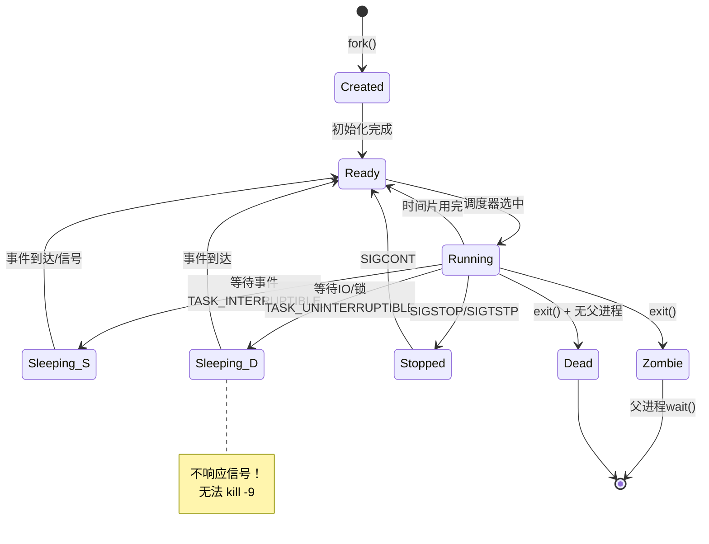
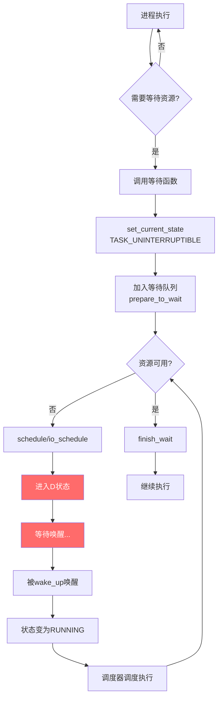
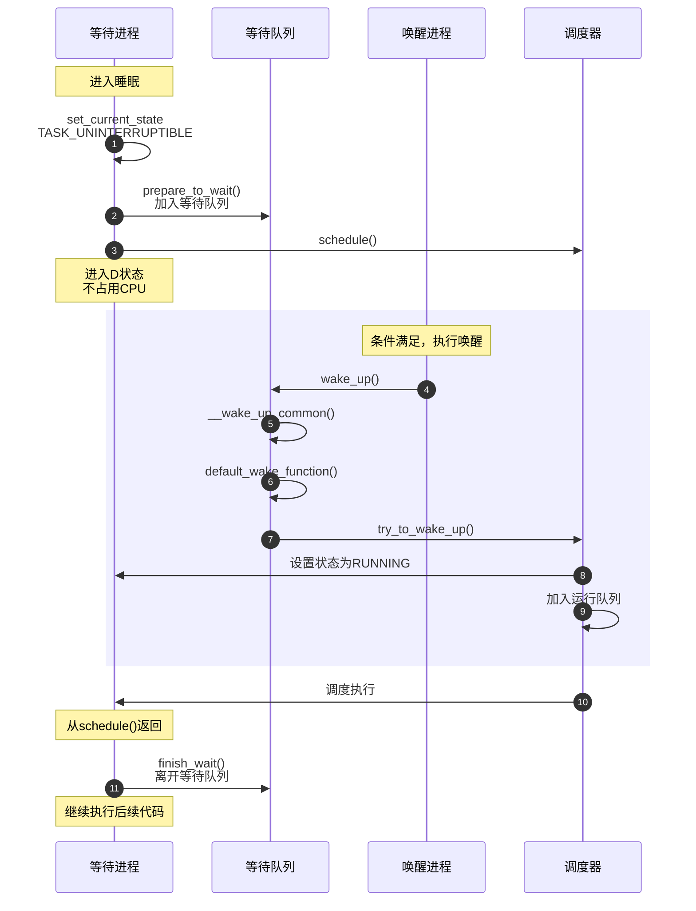

# Linux 进程 D 状态深入解析

> 本文系统性地介绍 Linux 进程 D 状态（TASK_UNINTERRUPTIBLE），涵盖定义、进入机制、退出机制、典型场景、问题排查等内容。

**相关文章**：
- [24-Request分配与软件队列](./io-structs/24-Request分配与软件队列.md) - Internal Tag 等待导致 D 状态
- [27-驱动处理与IO完成](./io-structs/27-驱动处理与IO完成.md) - IO 完成时唤醒 D 状态进程

---

## 一、D 状态基础

### 1.1 进程状态概览

Linux 内核使用 `task_struct` 结构体的 `__state` 字段来表示进程状态。

**源码位置**: `include/linux/sched.h:85-110`

```c
/* Used in tsk->state: */
#define TASK_RUNNING            0x0000  // 运行状态
#define TASK_INTERRUPTIBLE      0x0001  // 可中断睡眠
#define TASK_UNINTERRUPTIBLE    0x0002  // 不可中断睡眠 ⭐D状态
#define __TASK_STOPPED          0x0004  // 停止状态
#define __TASK_TRACED           0x0008  // 跟踪状态

/* Used in tsk->exit_state: */
#define EXIT_DEAD               0x0010  // 死亡状态
#define EXIT_ZOMBIE             0x0020  // 僵尸状态

/* Used in tsk->state again: */
#define TASK_PARKED             0x0040  // 停靠状态
#define TASK_DEAD               0x0080  // 死亡状态
#define TASK_WAKEKILL           0x0100  // 可被SIGKILL唤醒
#define TASK_WAKING             0x0200  // 正在唤醒
#define TASK_NOLOAD             0x0400  // 不计入负载

/* 组合状态 */
#define TASK_KILLABLE           (TASK_WAKEKILL | TASK_UNINTERRUPTIBLE)
#define TASK_IDLE               (TASK_UNINTERRUPTIBLE | TASK_NOLOAD)
```

**状态字符对照表**：

| 状态码 | `ps` 显示 | 含义 | 可否被信号打断 |
|--------|----------|------|--------------|
| TASK_RUNNING | R | 运行/就绪 | - |
| TASK_INTERRUPTIBLE | S | 可中断睡眠 | 可以 |
| TASK_UNINTERRUPTIBLE | D | 不可中断睡眠 | **不可以** |
| __TASK_STOPPED | T | 停止（SIGSTOP） | - |
| __TASK_TRACED | t | 被跟踪（ptrace） | - |
| EXIT_ZOMBIE | Z | 僵尸 | - |
| TASK_DEAD | X | 死亡 | - |
| TASK_KILLABLE | D | 可被 SIGKILL 的 D 状态 | 仅 SIGKILL |
| TASK_IDLE | I | 空闲内核线程 | - |

### 1.2 进程状态转换图



### 1.3 为什么需要 D 状态？

**D 状态存在的核心原因**：保护关键内核操作不被中断，确保数据一致性。

```
┌────────────────────────────────────────────────────────────────────────┐
│                    D 状态的必要性                                       │
├────────────────────────────────────────────────────────────────────────┤
│                                                                        │
│  场景：进程正在将数据写入磁盘                                           │
│                                                                        │
│  ┌─────────┐      ┌─────────┐      ┌─────────┐      ┌─────────┐      │
│  │  进程   │ ──▶  │  内核   │ ──▶  │ Block层 │ ──▶  │  磁盘   │      │
│  │ write() │      │ 文件系统 │      │ request │      │ 硬件    │      │
│  └─────────┘      └─────────┘      └─────────┘      └─────────┘      │
│                         │                                              │
│                         ▼                                              │
│             此时如果进程被信号中断：                                     │
│             • 内核数据结构可能处于不一致状态                             │
│             • 正在写的数据可能损坏                                      │
│             • 锁可能无法正确释放                                        │
│                                                                        │
│  解决方案：使用 TASK_UNINTERRUPTIBLE（D状态）                           │
│           进程完全不响应信号，直到操作完成                               │
│                                                                        │
└────────────────────────────────────────────────────────────────────────┘
```

**D 状态 vs S 状态对比**：

| 特性 | D 状态 (TASK_UNINTERRUPTIBLE) | S 状态 (TASK_INTERRUPTIBLE) |
|------|------------------------------|----------------------------|
| **信号响应** | 完全忽略 | 被信号唤醒 |
| **kill -9** | 无效！ | 可以终止 |
| **使用场景** | 关键IO、内核锁 | 普通等待、用户输入 |
| **load average** | 计入 | 计入 |
| **风险** | 可能导致进程无法终止 | 无风险 |
| **典型函数** | `io_schedule()` | `schedule()` + 信号检查 |

### 1.4 D 状态的副作用

**无法被任何信号终止**：

```bash
# 场景：NFS服务器挂掉，进程卡在D状态
$ kill -9 1234
# 无效！进程仍然是D状态

$ ps aux | grep 1234
root  1234  0.0  0.0  0  0 ?  D  10:00  0:00  [process_name]

# 只有当D状态的等待条件满足（如NFS恢复、IO完成），进程才能退出D状态
```

**计入 load average**：

D 状态进程虽然没有使用 CPU，但会增加系统负载。这是因为它们代表"等待运行但因资源阻塞而无法运行"的工作。

```bash
$ uptime
10:00:00 up 1 day,  2:30,  1 user,  load average: 50.00, 45.00, 40.00

# 如果大部分是D状态进程，CPU可能实际上很空闲
$ ps aux | awk '$8 == "D"' | wc -l
48
```

---

## 二、进入 D 状态的机制

### 2.1 核心函数分析

进入 D 状态的标准流程涉及两个关键操作：

```c
// 1. 设置状态为 TASK_UNINTERRUPTIBLE
set_current_state(TASK_UNINTERRUPTIBLE);

// 2. 让出 CPU，进入睡眠
schedule();
```

**`set_current_state()` 宏定义**：

```c
// include/linux/sched.h
#define set_current_state(state_value)  \
    smp_store_mb(current->__state, (state_value))

// 使用内存屏障确保状态设置对其他CPU可见
```

### 2.2 io_schedule() - IO 等待的标准方式

**源码位置**: `kernel/sched/core.c:8636-8643`

```c
void __sched io_schedule(void)
{
    int token;

    token = io_schedule_prepare();  // 1. 设置 in_iowait 标记
    schedule();                     // 2. 让出 CPU
    io_schedule_finish(token);      // 3. 恢复 in_iowait 标记
}
EXPORT_SYMBOL(io_schedule);
```

**io_schedule_prepare() 详解**：

```c
// kernel/sched/core.c:8604-8612
int io_schedule_prepare(void)
{
    int old_iowait = current->in_iowait;

    current->in_iowait = 1;           // 标记进程在IO等待
    blk_schedule_flush_plug(current); // 刷新block plug

    return old_iowait;
}
```

**`in_iowait` 标记的作用**：

1. **统计计数**：内核统计 `rq->nr_iowait` 用于分析 IO 等待情况
2. **负载计算**：影响 CPU 利用率计算（`iowait%` 在 `top` 中显示）
3. **调度决策**：某些调度策略会考虑 IO 等待情况

### 2.3 典型 D 状态场景

#### 场景1：Block 层 Tag 分配等待（最常见）

当 Internal Tag 耗尽时，进程会进入 D 状态等待。

**源码位置**: `block/blk-mq-tag.c:90-166`

```c
unsigned int blk_mq_get_tag(struct blk_mq_alloc_data *data)
{
    struct blk_mq_tags *tags = blk_mq_tags_from_data(data);
    struct sbitmap_queue *bt;
    struct sbq_wait_state *ws;
    DEFINE_SBQ_WAIT(wait);
    unsigned int tag_offset;
    int tag;

    // ... 初始化 bt 和 tag_offset ...

    // 1. 尝试获取 tag
    tag = __blk_mq_get_tag(data, bt);
    if (tag != BLK_MQ_NO_TAG)
        goto found_tag;  // 成功

    // 2. 获取失败，如果是非阻塞模式则直接返回
    if (data->flags & BLK_MQ_REQ_NOWAIT)
        return BLK_MQ_NO_TAG;

    // 3. 进入等待循环
    ws = bt_wait_ptr(bt, data->hctx);
    do {
        // 触发派发，可能释放一些 tag
        blk_mq_run_hw_queue(data->hctx, false);

        // 再次尝试
        tag = __blk_mq_get_tag(data, bt);
        if (tag != BLK_MQ_NO_TAG)
            break;

        // 准备等待（设置 TASK_UNINTERRUPTIBLE）
        sbitmap_prepare_to_wait(bt, ws, &wait, TASK_UNINTERRUPTIBLE);

        // 最后再尝试一次
        tag = __blk_mq_get_tag(data, bt);
        if (tag != BLK_MQ_NO_TAG)
            break;

        // ⭐ 关键：进入 D 状态
        io_schedule();  // 进程在这里进入D状态，等待tag释放

        // 被唤醒后清理等待状态
        sbitmap_finish_wait(bt, ws, &wait);

        // ... 重新获取上下文 ...
    } while (1);

    sbitmap_finish_wait(bt, ws, &wait);

found_tag:
    return tag + tag_offset;
}
```

**触发条件**：

```bash
# 查看当前 Internal Tag 数量
$ cat /sys/block/sda/queue/nr_requests
62

# 如果并发 IO 超过 62，多余的进程会进入 D 状态等待 Tag
```

#### 场景2：页面回写等待

当进程需要等待某个页面写回磁盘时，会进入 D 状态。

**源码位置**: `mm/filemap.c`

```c
void wait_on_page_writeback(struct page *page)
{
    while (PageWriteback(page)) {
        // 等待页面回写完成
        wait_on_page_bit(page, PG_writeback);
    }
}

// wait_on_page_bit 最终调用 io_schedule()
static inline int wait_on_page_bit_common(...)
{
    // ...
    for (;;) {
        set_current_state(TASK_UNINTERRUPTIBLE);
        // ...
        io_schedule();  // 进入 D 状态
        // ...
    }
}
```

**触发条件**：

```bash
# 大量脏页回写时
$ cat /proc/meminfo | grep Dirty
Dirty:          1048576 kB  # 1GB 脏页
```

#### 场景3：内核锁等待

Mutex、rwsem 等内核锁在获取失败时可能使用 D 状态等待。

**源码位置**: `kernel/locking/mutex.c`

```c
static int __sched
__mutex_lock_common(struct mutex *lock, unsigned int state, ...)
{
    // ...
    for (;;) {
        // 设置状态（可能是 TASK_UNINTERRUPTIBLE）
        set_current_state(state);
        
        // 检查是否能获取锁
        if (__mutex_trylock(lock))
            break;
        
        // 无法获取，让出 CPU
        schedule();  // 如果 state 是 TASK_UNINTERRUPTIBLE，进入 D 状态
    }
    __set_current_state(TASK_RUNNING);
    // ...
}
```

#### 场景4：NFS 等网络文件系统

NFS 操作可能因网络问题导致长时间 D 状态。

**源码位置**: `net/sunrpc/xprt.c`

```c
// NFS RPC 调用可能进入 D 状态等待服务器响应
void xprt_wait_for_buffer_space(struct rpc_xprt *xprt)
{
    DEFINE_WAIT(wait);
    
    prepare_to_wait(&xprt->pending, &wait, TASK_UNINTERRUPTIBLE);
    // ...
    if (test_bit(XPRT_WRITE_SPACE, &xprt->state))
        schedule();  // 等待网络缓冲区，进入 D 状态
    finish_wait(&xprt->pending, &wait);
}
```

**危险**：如果 NFS 服务器挂掉，客户端进程可能长时间处于 D 状态。

```bash
# 典型的 NFS hang 栈
$ cat /proc/<pid>/stack
[<0>] rpc_wait_bit_killable+0x30/0x50
[<0>] __rpc_execute+0x150/0x3e0
[<0>] rpc_run_task+0x120/0x170
[<0>] nfs_file_read+0x80/0x100
```

#### 场景5：设备驱动等待

硬件设备操作（如重置、固件加载）通常使用 D 状态。

```c
// 驱动等待硬件响应的典型模式
static int wait_for_hardware_ready(struct device *dev)
{
    DEFINE_WAIT(wait);
    unsigned long timeout = jiffies + HZ * 10;  // 10秒超时

    while (!hardware_is_ready(dev)) {
        if (time_after(jiffies, timeout))
            return -ETIMEDOUT;

        prepare_to_wait(&dev->wait_queue, &wait, TASK_UNINTERRUPTIBLE);
        if (!hardware_is_ready(dev))
            schedule();  // 进入 D 状态
        finish_wait(&dev->wait_queue, &wait);
    }
    return 0;
}
```

### 2.4 D 状态进入流程图



---

## 三、从 D 状态恢复

### 3.1 等待队列结构

等待队列是实现进程睡眠和唤醒的核心机制。

**源码位置**: `include/linux/wait.h:30-41`

```c
// 等待队列头（用于管理等待的进程）
struct wait_queue_head {
    spinlock_t          lock;   // 保护链表
    struct list_head    head;   // 等待进程链表头
};
typedef struct wait_queue_head wait_queue_head_t;

// 等待队列项（每个等待进程一个）
struct wait_queue_entry {
    unsigned int        flags;      // 标志（如 WQ_FLAG_EXCLUSIVE）
    void                *private;   // 通常指向 task_struct
    wait_queue_func_t   func;       // 唤醒回调函数
    struct list_head    entry;      // 链表节点
};
```

**等待队列布局**：

```
wait_queue_head {
    lock: spinlock
    head ───┐
}           │
            ▼
    ┌───────────────────────────────────────────────────────┐
    │ entry0 ──▶ entry1 ──▶ entry2 ──▶ entry3 ──▶ (head)  │
    └───────────────────────────────────────────────────────┘
        │           │           │           │
        ▼           ▼           ▼           ▼
     task_A      task_B      task_C      task_D
     (D状态)     (D状态)     (D状态)     (D状态)
```

### 3.2 唤醒机制

#### 3.2.1 唤醒函数族

**源码位置**: `kernel/sched/wait.c:155-160`

```c
// 唤醒等待队列中的进程
void __wake_up(struct wait_queue_head *wq_head, unsigned int mode,
               int nr_exclusive, void *key)
{
    __wake_up_common_lock(wq_head, mode, nr_exclusive, 0, key);
}
EXPORT_SYMBOL(__wake_up);

// 常用宏
#define wake_up(x)                  __wake_up(x, TASK_NORMAL, 1, NULL)
#define wake_up_nr(x, nr)           __wake_up(x, TASK_NORMAL, nr, NULL)
#define wake_up_all(x)              __wake_up(x, TASK_NORMAL, 0, NULL)
#define wake_up_interruptible(x)    __wake_up(x, TASK_INTERRUPTIBLE, 1, NULL)
```

**唤醒函数对比**：

| 函数 | 唤醒数量 | 唤醒类型 | 典型使用 |
|------|---------|---------|---------|
| `wake_up(wq)` | 1个 | S和D状态 | 通用唤醒 |
| `wake_up_nr(wq, n)` | n个 | S和D状态 | 批量唤醒 |
| `wake_up_all(wq)` | 全部 | S和D状态 | 广播唤醒 |
| `wake_up_interruptible(wq)` | 1个 | 仅S状态 | 可中断等待 |

#### 3.2.2 唤醒流程详解

```c
// kernel/sched/wait.c - 核心唤醒逻辑
static int __wake_up_common(struct wait_queue_head *wq_head, unsigned int mode,
                            int nr_exclusive, int wake_flags, void *key,
                            wait_queue_entry_t *bookmark)
{
    wait_queue_entry_t *curr, *next;
    int cnt = 0;

    list_for_each_entry_safe_from(curr, next, &wq_head->head, entry) {
        unsigned flags = curr->flags;
        int ret;

        // 调用等待项的回调函数（通常是 default_wake_function）
        ret = curr->func(curr, mode, wake_flags, key);
        if (ret < 0)
            break;

        // 处理独占唤醒
        if (ret && (flags & WQ_FLAG_EXCLUSIVE) && !--nr_exclusive)
            break;

        cnt++;
    }

    return cnt;
}

// 默认唤醒函数
int default_wake_function(struct wait_queue_entry *wq_entry, unsigned mode,
                          int wake_flags, void *key)
{
    WARN_ON_ONCE(IS_ENABLED(CONFIG_SCHED_DEBUG) && (mode & ~TASK_NORMAL));
    // 调用 try_to_wake_up 唤醒进程
    return try_to_wake_up(wq_entry->private, mode, wake_flags);
}
```

**`try_to_wake_up()` 的关键操作**：

1. 将进程状态设置为 `TASK_RUNNING`
2. 将进程加入运行队列（rq）
3. 如果需要，触发调度（抢占或IPI）

### 3.3 唤醒流程时序图



### 3.4 实际唤醒场景

#### 场景1：Tag 释放唤醒

当 IO 完成时，释放 Tag，唤醒等待 Tag 的进程。

```c
// lib/sbitmap.c - Tag 释放时的唤醒
static inline void __sbitmap_queue_wake_up(struct sbitmap_queue *sbq)
{
    struct sbq_wait_state *ws;
    int wait_cnt;

    ws = &sbq->ws[sbq->wake_index];
    wait_cnt = atomic_read(&ws->wait_cnt);

    // 累积足够多释放后批量唤醒
    if (wait_cnt >= sbq->wake_batch) {
        atomic_set(&ws->wait_cnt, 0);
        wake_up_nr(&ws->wait, sbq->wake_batch);  // 唤醒等待的进程
    }
}
```

#### 场景2：IO 完成中断唤醒

硬件中断通知 IO 完成，触发唤醒。

```c
// 简化的 IO 完成路径
void blk_mq_complete_request(struct request *rq)
{
    // 1. 处理请求完成
    blk_mq_end_request(rq, BLK_STS_OK);
    
    // 2. 释放 Tag（触发等待进程唤醒）
    blk_mq_put_tag(tags, ctx, rq->tag);
    // 上面的函数最终会调用 wake_up_nr()
}
```

#### 场景3：锁释放唤醒

Mutex 释放时唤醒等待的进程。

```c
// kernel/locking/mutex.c
void __sched mutex_unlock(struct mutex *lock)
{
    // ...
    __mutex_unlock_slowpath(lock, _RET_IP_);
    // 内部会调用 wake_up 唤醒等待锁的进程
}
```

#### 场景4：超时唤醒

使用 `io_schedule_timeout()` 可以设置超时。

```c
// kernel/sched/core.c:8623-8633
long __sched io_schedule_timeout(long timeout)
{
    int token;
    long ret;

    token = io_schedule_prepare();
    ret = schedule_timeout(timeout);  // 超时后自动唤醒
    io_schedule_finish(token);

    return ret;
}
```

---

## 四、D 状态问题与排查

### 4.1 问题表现

#### 表现1：进程无法终止

```bash
$ kill -9 1234
$ ps aux | grep 1234
root  1234  0.0  0.0  0  0 ?  D  10:00  0:00  [process]
# 进程仍然存在，状态仍是 D
```

#### 表现2：系统负载飙高

```bash
$ uptime
 10:00:00 up 1 day,  load average: 150.00, 140.00, 130.00

$ top
# CPU 利用率可能很低，但 load average 很高
# 因为 D 状态进程计入 load average
%Cpu(s):  2.0 us,  1.0 sy,  0.0 ni, 96.0 id,  1.0 wa, 0.0 hi, 0.0 si
```

#### 表现3：系统响应缓慢或无响应

大量进程 D 状态可能导致：
- 新进程无法启动（等待内存分配）
- 文件操作卡住（等待 IO）
- 终端无响应

### 4.2 典型问题案例

#### 案例1：NFS 服务器无响应

**现象**：

```bash
$ ps aux | awk '$8 == "D"'
root  1234  0.0  0.0  0  0 ?  D  10:00  0:00  cat /mnt/nfs/file
root  1235  0.0  0.0  0  0 ?  D  10:01  0:00  ls /mnt/nfs/
root  1236  0.0  0.0  0  0 ?  D  10:02  0:00  vim /mnt/nfs/doc
```

**内核栈**：

```bash
$ cat /proc/1234/stack
[<0>] rpc_wait_bit_killable+0x30/0x50
[<0>] __rpc_execute+0x150/0x3e0
[<0>] rpc_run_task+0x120/0x170
[<0>] nfs4_do_call_sync+0x88/0x100
[<0>] _nfs4_proc_open+0x100/0x2a0
[<0>] nfs4_atomic_open+0x180/0x280
```

**原因**：NFS 服务器网络不可达或服务挂掉。

**解决**：
```bash
# 短期：强制卸载
$ umount -f /mnt/nfs

# 长期：使用 soft mount 选项
$ mount -t nfs -o soft,timeo=10 server:/export /mnt/nfs
```

#### 案例2：磁盘故障导致 IO hang

**现象**：

```bash
$ dmesg | tail
[12345.678901] sd 0:0:0:0: [sda] tag#5 FAILED Result: hostbyte=DID_NO_CONNECT driverbyte=DRIVER_OK
[12345.678902] sd 0:0:0:0: [sda] tag#5 CDB: Read(10) 28 00 00 00 10 00 00 00 08 00
[12345.678903] blk_update_request: I/O error, dev sda, sector 4096 op 0x0:(READ) flags 0x0 phys_seg 1 prio class 0

$ ps aux | awk '$8 == "D"' | wc -l
45
```

**内核栈**：

```bash
$ cat /proc/<pid>/stack
[<0>] io_schedule+0x12/0x40
[<0>] blk_mq_get_tag+0x150/0x270
[<0>] blk_mq_get_request+0xcb/0x3f0
[<0>] blk_mq_submit_bio+0x200/0x600
```

**原因**：磁盘硬件故障或连接断开。

**解决**：
```bash
# 检查磁盘状态
$ smartctl -a /dev/sda

# 如果是可移除设备，尝试重置
$ echo 1 > /sys/block/sda/device/delete
$ echo "- - -" > /sys/class/scsi_host/host0/scan
```

#### 案例3：Block 层 Tag 耗尽

**现象**：

```bash
$ cat /sys/block/sda/queue/nr_requests
62

# 300 个并发 IO
$ for i in $(seq 1 300); do dd if=/dev/sda of=/dev/null bs=4k count=1000 & done

$ ps aux | awk '$8 == "D"' | wc -l
238  # 300 - 62 = 238 个等待 Tag
```

**内核栈**：

```bash
$ cat /proc/<pid>/stack
[<0>] io_schedule+0x12/0x40
[<0>] blk_mq_get_tag+0x150/0x270
[<0>] blk_mq_get_request+0xcb/0x3f0
```

**解决**：
```bash
# 增加 Tag 数量
$ echo 256 > /sys/block/sda/queue/nr_requests
```

### 4.3 排查工具与方法

#### 工具1：ps/top 查看 D 状态进程

```bash
# 查看所有 D 状态进程
$ ps aux | awk '$8 ~ /D/'

# 或者使用更精确的方式
$ ps -eo pid,stat,wchan:20,cmd | grep " D"

# top 中按状态过滤
$ top
# 然后按 'o' 输入 STATE=D
```

#### 工具2：/proc/PID/stack 查看内核栈

```bash
# 查看进程的内核调用栈
$ cat /proc/1234/stack
[<0>] io_schedule+0x12/0x40
[<0>] blk_mq_get_tag+0x150/0x270
[<0>] blk_mq_get_request+0xcb/0x3f0
[<0>] blk_mq_submit_bio+0x200/0x600
[<0>] submit_bio_noacct+0x100/0x280
[<0>] ext4_mpage_readpages+0x300/0x500

# 批量查看所有 D 状态进程的栈
$ for pid in $(ps aux | awk '$8 ~ /D/ {print $2}'); do
    echo "=== PID $pid ==="
    cat /proc/$pid/stack 2>/dev/null
done
```

#### 工具3：vmstat 监控系统状态

```bash
$ vmstat 1
procs -----------memory---------- ---swap-- -----io---- -system-- ------cpu-----
 r  b   swpd   free   buff  cache   si   so    bi    bo   in   cs us sy id wa st
 2 45      0 123456  12345 234567    0    0  1000  2000 5000 8000  2  3 90  5  0
#    ^
#    b = blocked (D状态)

# b 列显示 D 状态进程数量
# wa 列显示 IO 等待百分比
```

#### 工具4：perf 分析

```bash
# 记录调度切换事件
$ perf record -e sched:sched_switch -a -g -- sleep 10

# 分析 D 状态相关
$ perf script | grep -A5 "prev_state=D"

# 或者使用 perf sched
$ perf sched record -- sleep 10
$ perf sched latency
```

#### 工具5：bpftrace 实时跟踪

```bash
# 跟踪进入 io_schedule 的进程
$ bpftrace -e '
kprobe:io_schedule {
    @[comm, kstack] = count();
}

END {
    print(@);
}
'

# 跟踪长时间 D 状态
$ bpftrace -e '
kprobe:io_schedule {
    @start[tid] = nsecs;
}

kretprobe:io_schedule /@start[tid]/ {
    $dur = (nsecs - @start[tid]) / 1000000;  // ms
    if ($dur > 1000) {  // 超过1秒
        printf("%s[%d] D state for %d ms\n", comm, pid, $dur);
        print(kstack);
    }
    delete(@start[tid]);
}
'
```

#### 工具6：ftrace

```bash
# 启用调度切换跟踪
$ cd /sys/kernel/debug/tracing
$ echo 1 > events/sched/sched_switch/enable

# 过滤 D 状态切换（prev_state == 2 表示 TASK_UNINTERRUPTIBLE）
$ echo 'prev_state == 2' > events/sched/sched_switch/filter

# 查看实时输出
$ cat trace_pipe

# 示例输出:
# dd-1234  [002] .... 123.456: sched_switch: prev_comm=dd prev_pid=1234 prev_prio=120 prev_state=D ==> next_comm=swapper next_pid=0 next_prio=120
```

#### 工具7：crash 分析 crash dump

```bash
# 加载 crash dump
$ crash /usr/lib/debug/vmlinux vmcore

# 查看 D 状态进程
crash> ps | grep UN
   1234    1   2  ffff88001234567   UN   0.0   12345  6789  process

# 查看进程调用栈
crash> bt 1234
PID: 1234   TASK: ffff88001234567  CPU: 2   COMMAND: "process"
 #0 [ffff888012345000] __schedule at ffffffff810abcde
 #1 [ffff888012345100] schedule at ffffffff810acdef
 #2 [ffff888012345200] io_schedule at ffffffff810aefgh
 #3 [ffff888012345300] blk_mq_get_tag at ffffffff812abcde

# 查看等待队列
crash> waitq <wait_queue_head_addr>
```

### 4.4 解决方法

#### 短期解决方案

| 问题类型 | 解决方法 |
|---------|---------|
| NFS hang | `umount -f` 强制卸载 |
| 磁盘故障 | 重置设备 `echo 1 > /sys/block/sda/device/delete` |
| 驱动问题 | 卸载并重新加载驱动 |
| 网络问题 | 重置网络连接 |
| 无法恢复 | 重启系统 |

#### 长期解决方案

```bash
# 1. 增加 Tag 数量，减少等待
$ echo 256 > /sys/block/sda/queue/nr_requests

# 2. 使用 soft mount 选项（NFS）
$ mount -t nfs -o soft,timeo=10,retrans=3 server:/export /mnt/nfs

# 3. 优化 IO 性能
$ echo deadline > /sys/block/sda/queue/scheduler  # 或 mq-deadline, none

# 4. 监控预警
# 配置监控系统，当 D 状态进程数超过阈值时报警

# 5. 使用超时机制的内核配置
# 某些驱动支持 IO 超时设置
```

---

## 五、源码深入分析

### 5.1 schedule() 核心逻辑

**源码位置**: `kernel/sched/core.c:6400-6520`

```c
static void __sched notrace __schedule(unsigned int sched_mode)
{
    struct task_struct *prev, *next;
    unsigned long *switch_count;
    unsigned long prev_state;
    struct rq_flags rf;
    struct rq *rq;
    int cpu;

    cpu = smp_processor_id();
    rq = cpu_rq(cpu);
    prev = rq->curr;

    // 1. 检查前一个进程状态
    prev_state = READ_ONCE(prev->__state);
    if (!(sched_mode & SM_MASK_PREEMPT) && prev_state) {
        // 进程主动让出CPU（非抢占）
        if (signal_pending_state(prev_state, prev)) {
            // 有待处理信号，设置为 RUNNING（仅对 TASK_INTERRUPTIBLE 有效）
            // ⭐ 关键：TASK_UNINTERRUPTIBLE 不会进入这里
            WRITE_ONCE(prev->__state, TASK_RUNNING);
        } else {
            // 从运行队列移除
            prev->sched_contributes_to_load = (prev_state & TASK_UNINTERRUPTIBLE) &&
                                              !(prev_state & TASK_NOLOAD);
            if (prev->sched_contributes_to_load)
                rq->nr_uninterruptible++;  // D 状态计数

            deactivate_task(rq, prev, DEQUEUE_SLEEP | DEQUEUE_NOCLOCK);
            // ...
        }
        switch_count = &prev->nvcsw;  // 主动切换计数
    }

    // 2. 选择下一个进程
    next = pick_next_task(rq, prev, &rf);

    // 3. 如果不同进程，执行上下文切换
    if (likely(prev != next)) {
        // ...
        rq = context_switch(rq, prev, next, &rf);
    }
    // ...
}
```

**关键点**：
- `prev_state & TASK_UNINTERRUPTIBLE` 用于计入负载
- `signal_pending_state()` 对 D 状态进程返回 false，不会被信号唤醒
- D 状态进程从运行队列移除，但增加 `nr_uninterruptible` 计数

### 5.2 io_schedule 与普通 schedule 的区别

```c
// 普通 schedule
void schedule(void)
{
    sched_submit_work(current);
    do {
        preempt_disable();
        __schedule(SM_NONE);
        sched_preempt_enable_no_resched();
    } while (need_resched());
    sched_update_worker(current);
}

// IO schedule
void io_schedule(void)
{
    int token;

    token = io_schedule_prepare();  // 设置 in_iowait=1
    schedule();                     // 调用普通 schedule
    io_schedule_finish(token);      // 恢复 in_iowait
}
```

**`in_iowait` 的影响**：

```c
// kernel/sched/core.c - 更新 CPU 统计
void update_cpu_stats(struct rq *rq)
{
    // ...
    if (current->in_iowait) {
        // 计入 iowait 统计
        rq->iowait += delta;
    }
    // ...
}

// 影响 /proc/stat 中的 iowait 统计
// 影响 top 中显示的 wa%
```

### 5.3 等待队列的完整实现

#### prepare_to_wait()

**源码位置**: `kernel/sched/wait.c:265-276`

```c
void prepare_to_wait(struct wait_queue_head *wq_head,
                     struct wait_queue_entry *wq_entry,
                     int state)
{
    unsigned long flags;

    wq_entry->flags &= ~WQ_FLAG_EXCLUSIVE;  // 非独占等待
    spin_lock_irqsave(&wq_head->lock, flags);
    if (list_empty(&wq_entry->entry))
        __add_wait_queue(wq_head, wq_entry);  // 加入等待队列
    set_current_state(state);                  // 设置进程状态
    spin_unlock_irqrestore(&wq_head->lock, flags);
}
```

#### finish_wait()

```c
void finish_wait(struct wait_queue_head *wq_head,
                 struct wait_queue_entry *wq_entry)
{
    unsigned long flags;

    __set_current_state(TASK_RUNNING);  // 恢复 RUNNING 状态
    if (!list_empty_careful(&wq_entry->entry)) {
        spin_lock_irqsave(&wq_head->lock, flags);
        list_del_init(&wq_entry->entry);  // 从等待队列移除
        spin_unlock_irqrestore(&wq_head->lock, flags);
    }
}
```

#### 独占等待 vs 普通等待

```c
// 独占等待（WQ_FLAG_EXCLUSIVE）
// 只唤醒一个等待者，适用于互斥资源

prepare_to_wait_exclusive(wq, &wait, TASK_UNINTERRUPTIBLE);
// 设置 wq_entry->flags |= WQ_FLAG_EXCLUSIVE

// 普通等待
// 可能唤醒多个等待者
prepare_to_wait(wq, &wait, TASK_UNINTERRUPTIBLE);
```

**唤醒时的处理**：

```c
// __wake_up_common() 中
if (ret && (flags & WQ_FLAG_EXCLUSIVE) && !--nr_exclusive)
    break;  // 独占等待者被唤醒后停止

// 对于普通等待，会继续唤醒其他等待者
```

---

## 六、附录

### 附录 A：D 状态与 load average 的关系

#### 为什么 D 状态计入 load average

Linux 的 load average 定义与其他 Unix 系统不同：

```c
// 传统 Unix: load average = 运行队列中的进程数
// Linux: load average = 运行队列 + 不可中断睡眠进程数

// kernel/sched/loadavg.c
static inline long calc_load_nohz_fold(void)
{
    // nr_running: 运行中的进程
    // nr_uninterruptible: D 状态进程
    return atomic_long_xchg(&calc_load_nohz[idx], 0);
}
```

**原因**：
- D 状态进程代表"有工作要做但被阻塞"
- 反映了系统资源（IO、锁等）的压力
- 帮助识别 IO 瓶颈

#### 如何区分 CPU 负载和 IO 等待

```bash
# 方法1: 使用 vmstat
$ vmstat 1
procs -----------memory---------- ---swap-- -----io---- -system-- ------cpu-----
 r  b   swpd   free   buff  cache   si   so    bi    bo   in   cs us sy id wa st
 5 20      0 123456  12345 234567    0    0  5000 10000 8000 9000  5  3 70 22  0

# r: 运行队列中的进程（CPU 负载）
# b: D 状态进程（IO 等待）
# wa: IO 等待百分比

# 方法2: 使用 sar
$ sar -q 1
12:00:01 AM   runq-sz  plist-sz   ldavg-1   ldavg-5  ldavg-15   blocked
12:00:02 AM         5       300     25.00     23.00     20.00        20
#                                                                   ^
#                                                              D状态进程数

# 方法3: 直接统计
$ cat /proc/loadavg
25.00 23.00 20.00 5/300 12345
#                  ^
#                  运行/总进程

$ ps aux | awk '$8 ~ /D/' | wc -l
20  # D 状态进程数
```

### 附录 B：D 状态调试命令速查

#### 快速诊断

```bash
# 1. 列出所有 D 状态进程
ps aux | awk '$8 ~ /D/'

# 2. 统计 D 状态进程数量
ps aux | awk '$8 ~ /D/' | wc -l

# 3. 查看某个 D 状态进程的内核栈
cat /proc/<PID>/stack

# 4. 查看所有 D 状态进程的内核栈
for pid in $(ps aux | awk '$8 ~ /D/ {print $2}'); do
    echo "=== PID $pid $(cat /proc/$pid/comm 2>/dev/null) ==="
    cat /proc/$pid/stack 2>/dev/null
    echo
done | head -100

# 5. 查看系统 IO 等待情况
vmstat 1 5

# 6. 查看磁盘 IO 统计
iostat -x 1 5

# 7. 查看 Block 层 Tag 使用情况
cat /sys/kernel/debug/block/sda/hctx0/tags
cat /sys/kernel/debug/block/sda/hctx0/sched_tags
```

#### 深入分析

```bash
# 1. 使用 perf 跟踪调度
perf record -e sched:sched_switch -a -- sleep 10
perf script | grep "prev_state=D"

# 2. 使用 ftrace 跟踪
cd /sys/kernel/debug/tracing
echo 'prev_state == 2' > events/sched/sched_switch/filter
echo 1 > events/sched/sched_switch/enable
cat trace_pipe

# 3. 使用 bpftrace 分析
bpftrace -e 'kprobe:io_schedule { @[kstack] = count(); }'

# 4. 分析 NFS 问题
rpcdebug -m rpc -s all
dmesg | grep -i nfs

# 5. 分析 Block 层问题
echo 1 > /sys/kernel/debug/tracing/events/block/enable
cat /sys/kernel/debug/tracing/trace_pipe
```

### 附录 C：相关源码文件索引

| 功能模块 | 源码文件 | 关键函数/定义 |
|---------|---------|-------------|
| **进程状态定义** | `include/linux/sched.h` | `TASK_RUNNING`, `TASK_UNINTERRUPTIBLE`, ... |
| **调度器核心** | `kernel/sched/core.c` | `__schedule()`, `io_schedule()`, `try_to_wake_up()` |
| **等待队列** | `include/linux/wait.h` | `wait_queue_head`, `wait_queue_entry` |
| **等待队列实现** | `kernel/sched/wait.c` | `prepare_to_wait()`, `finish_wait()`, `__wake_up()` |
| **Block 层 Tag** | `block/blk-mq-tag.c` | `blk_mq_get_tag()` |
| **sbitmap** | `lib/sbitmap.c` | `sbitmap_prepare_to_wait()`, `sbitmap_queue_wake_up()` |
| **页面等待** | `mm/filemap.c` | `wait_on_page_writeback()` |
| **锁实现** | `kernel/locking/mutex.c` | `__mutex_lock_common()` |
| **NFS RPC** | `net/sunrpc/xprt.c` | RPC 等待函数 |

### 附录 D：与系列文章的关联

| 文章 | D 状态相关内容 | 位置 |
|------|--------------|------|
| **第24篇**<br/>[Request分配与软件队列](./io-structs/24-Request分配与软件队列.md) | Internal Tag 等待导致 D 状态 | sbitmap 等待机制 |
| **第26篇**<br/>[硬件队列与Tag派发](./io-structs/26-硬件队列与Tag派发.md) | Driver Tag 不足时不进入 D 状态 | dispatch 队列机制 |
| **第27篇**<br/>[驱动处理与IO完成](./io-structs/27-驱动处理与IO完成.md) | IO 完成唤醒 D 状态进程 | Tag 释放流程 |

**关键对比**：

| 资源不足 | 处理方式 | 是否 D 状态 |
|---------|---------|------------|
| Internal Tag 不足 | `io_schedule()` 阻塞等待 | **是** |
| Driver Tag 不足 | 放入 dispatch 队列重试 | 否 |

---

## 七、总结

### 7.1 核心要点

1. **D 状态是 TASK_UNINTERRUPTIBLE**
   - 进程完全不响应信号，包括 SIGKILL
   - 用于保护关键内核操作不被中断

2. **进入 D 状态的机制**
   - `set_current_state(TASK_UNINTERRUPTIBLE)` + `schedule()`
   - 通常使用 `io_schedule()` 以便统计 IO 等待

3. **典型触发场景**
   - Block 层 Tag 等待（最常见）
   - 页面回写等待
   - 内核锁等待
   - NFS/网络 IO
   - 设备驱动等待

4. **唤醒机制**
   - 等待队列 + `wake_up()` 函数族
   - 条件满足时由其他进程/中断唤醒

5. **问题排查**
   - `/proc/<PID>/stack` 查看内核栈
   - `ps aux | awk '$8 ~ /D/'` 找 D 状态进程
   - `vmstat` 的 `b` 列显示 D 状态进程数

### 7.2 快速参考

```
D 状态 = TASK_UNINTERRUPTIBLE = 0x0002

进入 D 状态:
  set_current_state(TASK_UNINTERRUPTIBLE);
  prepare_to_wait(&wq, &wait, TASK_UNINTERRUPTIBLE);
  io_schedule();

退出 D 状态:
  wake_up(&wq);  // 另一个进程调用
  try_to_wake_up() → 状态变为 TASK_RUNNING
  finish_wait(&wq, &wait);

常见栈帧:
  io_schedule+0x12/0x40
  blk_mq_get_tag+0x150/0x270  ← Tag 等待
  wait_on_page_bit+0x80/0x100 ← 页面等待
  __rpc_execute+0x150/0x3e0   ← NFS/RPC 等待
```

---

**相关文章**：
- [24-Request分配与软件队列](./io-structs/24-Request分配与软件队列.md)
- [26-硬件队列与Tag派发](./io-structs/26-硬件队列与Tag派发.md)
- [27-驱动处理与IO完成](./io-structs/27-驱动处理与IO完成.md)
