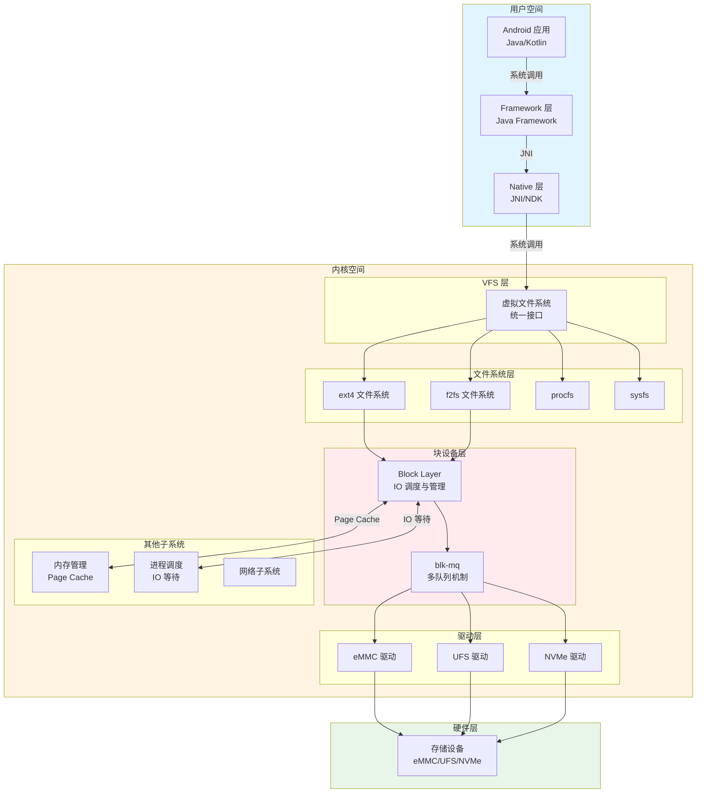
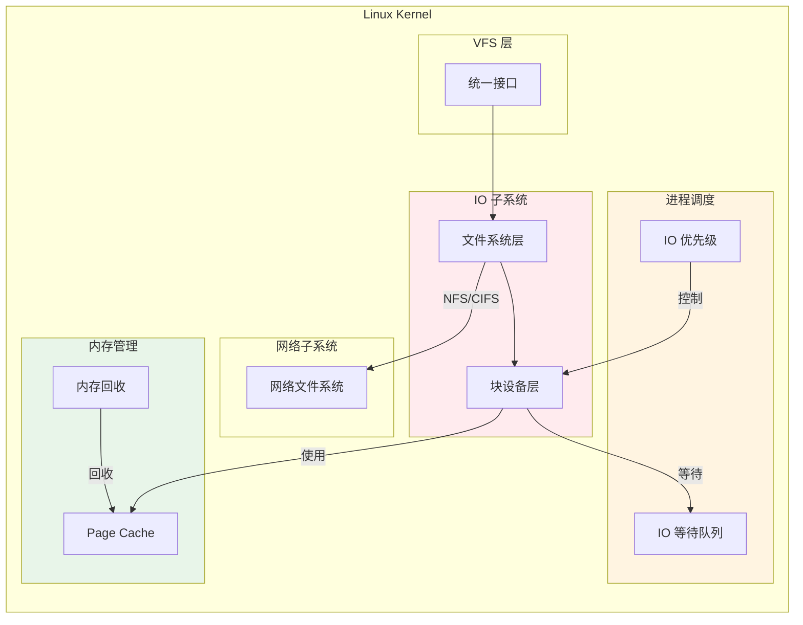

# IO 在 Android 架构中的位置与角色定位

## 学习目标

- 理解 Android 系统架构的层次结构
- 掌握 IO 子系统在 Kernel 中的位置和作用
- 了解 IO 与其他 Kernel 子系统的关系
- 理解 IO 在 Android 应用场景中的关键作用
- 建立 IO 在整个系统中的宏观认知

## 背景介绍

IO（Input/Output）子系统是 Linux Kernel 中最核心的子系统之一，负责管理所有与存储设备的数据交互。在 Android 系统中，IO 性能直接影响应用启动速度、数据读写效率、系统响应性等关键指标。作为 Framework 层工程师，理解 IO 在整体架构中的位置，是深入理解系统性能和问题排查的基础。

## Android 系统架构层次

### 整体架构图



### 架构层次说明

#### 1. 用户空间（User Space）

**Android 应用层**：
- Java/Kotlin 应用代码
- 通过 Framework API 访问文件系统
- 例如：`FileInputStream.read()`, `FileOutputStream.write()`

**Framework 层**：
- Java Framework 提供文件操作 API
- 封装系统调用，提供高级抽象
- 例如：`java.io.File`, `android.content.ContentProvider`

**Native 层**：
- JNI/NDK 代码
- 直接调用系统调用
- 例如：`open()`, `read()`, `write()`

#### 2. 内核空间（Kernel Space）

**VFS 层（虚拟文件系统）**：
- 位置：`fs/` 目录
- 作用：提供统一的文件系统接口
- 关键文件：`fs/read_write.c`, `fs/filemap.c`

**文件系统层**：
- ext4：传统日志文件系统，用于 `/data`, `/system` 等
- f2fs：Flash-Friendly 文件系统，针对闪存优化
- procfs：进程信息文件系统
- sysfs：系统信息文件系统

**块设备层（Block Layer）**：
- 位置：`block/` 目录
- 作用：IO 请求调度、合并、管理
- 关键文件：`block/blk-core.c`, `block/blk-mq.c`

**驱动层**：
- eMMC 驱动：嵌入式多媒体卡
- UFS 驱动：通用闪存存储（Universal Flash Storage）
- NVMe 驱动：非易失性内存快速存储

#### 3. 硬件层（Hardware）

- 存储设备：eMMC、UFS、NVMe 等物理存储介质

## IO 子系统在 Kernel 中的位置

### Kernel 子系统关系图



### IO 与其他子系统的关系

#### 1. IO 与内存管理（Memory Management）

**Page Cache**：
- IO 子系统使用 Page Cache 缓存文件数据
- 减少磁盘访问，提高性能
- 位置：`mm/filemap.c`

**内存回收**：
- 内存压力时，回收 Page Cache 中的页面
- 影响 IO 性能（缓存命中率下降）
- 位置：`mm/vmscan.c`

**交互方式**：
- IO 读取时，先查找 Page Cache
- 未命中时，分配页面并触发磁盘 IO
- 写入时，先写入 Page Cache，异步写回磁盘

#### 2. IO 与进程调度（Process Scheduler）

**IO 等待队列**：
- 进程等待 IO 完成时，进入等待队列
- 调度器选择其他进程运行
- 位置：`kernel/sched/`

**IO 优先级**：
- 通过 `ioprio_set()` 设置进程 IO 优先级
- 影响 IO 请求的调度顺序
- 位置：`block/ioprio.c`

**交互方式**：
- 进程发起 IO 请求后，可能进入睡眠状态
- IO 完成时，唤醒等待的进程
- 调度器根据 IO 优先级调度请求

#### 3. IO 与文件系统（File System）

**VFS 抽象**：
- VFS 提供统一的文件操作接口
- 具体文件系统实现这些接口
- 位置：`fs/` 目录

**文件系统实现**：
- ext4：`fs/ext4/`
- f2fs：`fs/f2fs/`
- 每个文件系统有自己的 IO 路径

**交互方式**：
- 文件系统将文件操作转换为块设备操作
- 通过 `submit_bio()` 提交 IO 请求
- 块设备层处理这些请求

#### 4. IO 与网络子系统（Network）

**网络文件系统**：
- NFS（Network File System）
- CIFS（Common Internet File System）
- 通过网络协议栈访问远程存储

**交互方式**：
- 网络文件系统将文件操作转换为网络请求
- 通过网络协议栈发送数据
- 接收网络响应后，完成文件操作

## IO 在 Android 应用场景中的作用

### 1. 应用启动

**场景**：
- 用户点击应用图标
- 系统需要加载应用 APK、DEX 文件、资源文件

**IO 路径**：
```
应用启动
  ↓
读取 APK 文件（/data/app/...）
  ↓
读取 DEX 文件（/data/dalvik-cache/...）
  ↓
读取资源文件（assets、res）
  ↓
Page Cache 缓存
  ↓
块设备层处理
  ↓
存储设备读取
```

**性能影响**：
- IO 延迟直接影响应用启动时间
- Page Cache 命中率影响启动速度
- 冷启动 vs 热启动的差异主要来自 IO

### 2. 数据存储

**场景**：
- 应用保存用户数据
- 数据库写入
- 配置文件保存

**IO 路径**：
```
应用写入数据
  ↓
Framework 层处理
  ↓
VFS 层
  ↓
文件系统层（ext4/f2fs）
  ↓
Page Cache（脏页）
  ↓
异步写回（writeback）
  ↓
块设备层
  ↓
存储设备写入
```

**性能影响**：
- 写入策略（同步/异步）影响响应时间
- 写回合并减少 IO 次数
- 文件系统日志影响数据安全性

### 3. 多媒体处理

**场景**：
- 拍照、录像
- 音频录制
- 视频播放

**IO 特点**：
- 大文件连续读写
- 高吞吐量要求
- 实时性要求

**优化策略**：
- 预读（readahead）提高读取性能
- 批量写入减少 IO 次数
- IO 优先级保证实时性

### 4. 系统更新

**场景**：
- OTA 更新
- 系统升级
- 分区镜像写入

**IO 特点**：
- 大块连续写入
- 需要数据完整性保证
- 可能涉及多个分区

**关键机制**：
- 数据完整性校验
- 原子写入保证
- 错误恢复机制

## IO 子系统的核心职责

### 1. 统一接口

**作用**：
- 为上层提供统一的块设备访问接口
- 屏蔽不同存储设备的差异
- 位置：`block/blk-core.c` 中的 `submit_bio()`

**关键函数**：
```c
// 提交 bio 到块设备层
blk_qc_t submit_bio(struct bio *bio);
```

### 2. 请求调度

**作用**：
- 合并相邻扇区的请求
- 排序请求，优化磁盘访问顺序
- 管理请求队列

**关键机制**：
- IO 调度器（elevator）
- 请求合并（merge）
- 多队列架构（blk-mq）

### 3. 资源管理

**作用**：
- 限制并发 IO 数量
- 管理 Tag 资源
- 控制 IO 带宽

**关键机制**：
- Tag 机制（限制并发请求数）
- Budget 机制（SCSI 等驱动）
- QoS 控制（cgroup）

### 4. 性能优化

**作用**：
- 减少磁盘访问次数
- 提高 IO 吞吐量
- 降低 IO 延迟

**关键技术**：
- 请求合并
- 预读（readahead）
- 批量处理（batch dispatch）

## 源码位置总览

### 核心目录结构

```
kernel/
├── block/              # 块设备层核心代码
│   ├── blk-core.c      # 块层核心，submit_bio 等
│   ├── blk-mq.c        # 多队列实现
│   ├── blk-mq-sched.c  # IO 调度器集成
│   ├── blk-mq-tag.c    # Tag 管理
│   └── ...
├── fs/                 # 文件系统层
│   ├── read_write.c    # 系统调用实现
│   ├── filemap.c       # Page Cache 操作
│   ├── ext4/           # ext4 文件系统
│   ├── f2fs/           # f2fs 文件系统
│   └── ...
├── mm/                 # 内存管理
│   ├── filemap.c       # Page Cache 核心实现
│   ├── page-writeback.c # 写回机制
│   └── ...
└── include/linux/
    ├── blkdev.h        # 块设备核心定义
    ├── blk-mq.h        # blk-mq 定义
    └── ...
```

### 关键头文件

**块设备层**：
- `include/linux/blkdev.h` - 块设备核心数据结构
- `include/linux/blk-mq.h` - blk-mq 数据结构
- `include/linux/bio.h` - bio 结构定义

**文件系统层**：
- `include/linux/fs.h` - 文件系统核心定义
- `include/linux/file.h` - file 结构定义

**内存管理**：
- `include/linux/pagemap.h` - Page Cache 相关定义
- `include/linux/writeback.h` - 写回相关定义

## 总结

### 核心要点

1. **IO 子系统是 Kernel 的核心组件**：
   - 位于 VFS 层和驱动层之间
   - 负责所有块设备 IO 的调度和管理

2. **IO 与多个子系统紧密协作**：
   - 内存管理：Page Cache 缓存文件数据
   - 进程调度：IO 等待队列和优先级
   - 文件系统：将文件操作转换为块设备操作

3. **IO 性能影响系统整体性能**：
   - 应用启动速度
   - 数据读写效率
   - 系统响应性

4. **理解 IO 位置有助于问题排查**：
   - 性能问题定位
   - 瓶颈分析
   - 优化方向确定

### 关键概念

- **块设备层（Block Layer）**：Kernel 中管理块设备 IO 的子系统
- **VFS（虚拟文件系统）**：提供统一文件系统接口的抽象层
- **Page Cache**：缓存文件数据的内存区域
- **blk-mq**：多队列块设备 IO 机制

### 下一步学习

- [02-IO 子系统内部模块划分与源码组织](02-IO子系统内部模块划分与源码组织.md) - 深入了解 IO 子系统的内部结构
- [03-IO 的上下游模块与同级交互](03-IO的上下游模块与同级交互.md) - 理解 IO 与系统其他部分的交互机制
- [04-单次文件读写的完整 IO 流程](04-单次文件读写的完整IO流程.md) - 从一次读写操作理解整个 IO 过程

## 参考资料

- Linux 内核源码：`block/`, `fs/`, `mm/`
- Linux 内核文档：`Documentation/block/`, `Documentation/filesystems/`
- Android 源码：`kernel/` 目录
- 相关文章：[IO完整流程：从用户空间到内核空间](../android/22-IO完整流程：从用户空间到内核空间.md)

## 更新记录

- 2026-01-26：初始创建，包含 IO 在 Android 架构中的位置和角色定位
