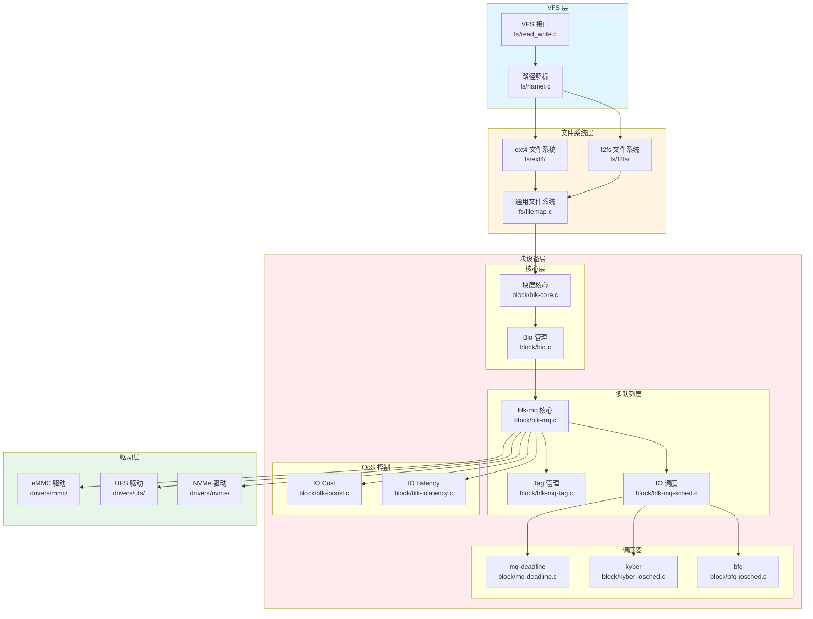
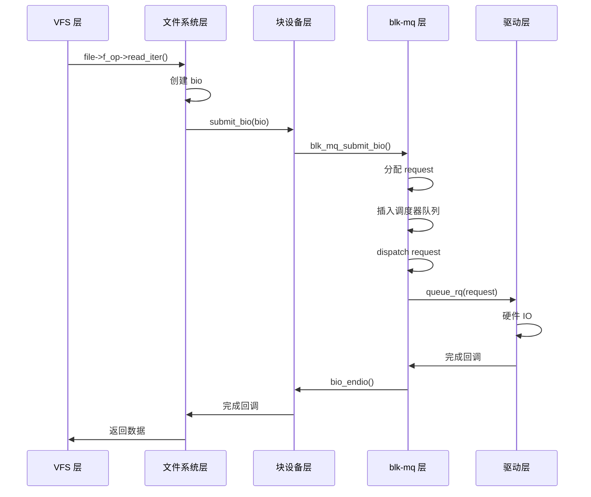

# IO 子系统内部模块划分与源码组织

## 学习目标

- 理解 IO 子系统的分层架构
- 掌握各模块的源码位置和组织方式
- 了解关键数据结构的作用和关系
- 理解模块间的接口和交互方式
- 建立 IO 子系统内部结构的完整认知

## 背景介绍

IO 子系统是 Linux Kernel 中一个复杂的子系统，由多个层次和模块组成。理解其内部结构是深入理解 IO 机制的基础。本文将从架构角度分析 IO 子系统的内部组织，帮助 Framework 层工程师建立清晰的模块认知。

## IO 子系统的分层架构

### 整体架构图



## 各层详细分析

### 1. VFS 层（虚拟文件系统层）

**位置**：`fs/` 目录

**核心文件**：

#### fs/read_write.c
- **作用**：实现 `read()`, `write()` 等系统调用
- **关键函数**：
  - `SYSCALL_DEFINE3(read, ...)` - read 系统调用
  - `SYSCALL_DEFINE3(write, ...)` - write 系统调用
  - `vfs_read()` - VFS 层读操作
  - `vfs_write()` - VFS 层写操作

#### fs/namei.c
- **作用**：路径解析，将路径名转换为 inode
- **关键函数**：
  - `path_lookup()` - 路径查找
  - `path_openat()` - 打开文件路径解析

#### fs/filemap.c
- **作用**：文件映射和 Page Cache 操作
- **关键函数**：
  - `generic_file_read_iter()` - 通用文件读迭代器
  - `generic_file_write_iter()` - 通用文件写迭代器
  - `filemap_read()` - 文件映射读操作

**与 IO 的关系**：
- VFS 层是 IO 的入口
- 将文件操作转换为块设备操作
- 通过 `submit_bio()` 提交 IO 请求

### 2. 文件系统层

**位置**：`fs/` 目录下的各个文件系统目录

#### ext4 文件系统
- **位置**：`fs/ext4/`
- **关键文件**：
  - `fs/ext4/inode.c` - inode 操作
  - `fs/ext4/file.c` - 文件操作
  - `fs/ext4/super.c` - 超级块操作
- **IO 路径**：`ext4_file_read_iter()` → `generic_file_read_iter()`

#### f2fs 文件系统
- **位置**：`fs/f2fs/`
- **特点**：针对闪存优化的文件系统
- **关键文件**：
  - `fs/f2fs/file.c` - 文件操作
  - `fs/f2fs/data.c` - 数据操作

#### 通用文件系统接口
- **位置**：`fs/filemap.c`
- **作用**：提供文件系统通用的 IO 操作
- **关键函数**：
  - `generic_file_read_iter()` - 通用读操作
  - `generic_file_write_iter()` - 通用写操作
  - `generic_perform_write()` - 通用写执行

### 3. 块设备层（Block Layer）

**位置**：`block/` 目录

#### 3.1 核心层

##### block/blk-core.c
- **作用**：块设备层核心实现
- **关键函数**：
  - `submit_bio()` - 提交 bio 到块设备层（IO 入口）
  - `submit_bio_noacct()` - 提交 bio（无统计）
  - `bio_endio()` - bio 完成处理
- **关键数据结构**：
  - `struct bio` - 块 IO 描述符
  - `struct block_device` - 块设备

##### block/bio.c
- **作用**：bio 的分配、释放、管理
- **关键函数**：
  - `bio_alloc()` - 分配 bio
  - `bio_free()` - 释放 bio
  - `bio_add_page()` - 添加页面到 bio

#### 3.2 多队列层（blk-mq）

##### block/blk-mq.c
- **作用**：blk-mq 核心实现
- **关键函数**：
  - `blk_mq_submit_bio()` - 提交 bio 到 blk-mq
  - `__blk_mq_alloc_request()` - 分配 request
  - `blk_mq_dispatch_rq_list()` - dispatch 请求列表
  - `blk_mq_complete_request()` - 完成请求
- **关键数据结构**：
  - `struct request` - IO 请求
  - `struct request_queue` - 请求队列
  - `struct blk_mq_hw_ctx` - 硬件队列上下文
  - `struct blk_mq_ctx` - 软件队列上下文

##### block/blk-mq-tag.c
- **作用**：Tag 管理
- **关键函数**：
  - `blk_mq_get_tag()` - 获取 tag
  - `blk_mq_put_tag()` - 释放 tag
  - `blk_mq_get_driver_tag()` - 获取 driver tag
- **关键数据结构**：
  - `struct blk_mq_tags` - Tag 集合
  - `struct sbitmap_queue` - sbitmap 队列

##### block/blk-mq-sched.c
- **作用**：IO 调度器集成
- **关键函数**：
  - `blk_mq_sched_insert_request()` - 插入请求到调度器
  - `blk_mq_sched_dispatch_requests()` - dispatch 调度器请求
- **与调度器的接口**：
  - `elevator_type.ops.insert_requests()` - 插入请求
  - `elevator_type.ops.dispatch_request()` - dispatch 请求

#### 3.3 IO 调度器

##### block/mq-deadline.c
- **作用**：Deadline 调度器实现
- **特点**：
  - 按截止时间排序
  - 保证请求的延迟上限
  - 适合实时性要求高的场景

##### block/kyber-iosched.c
- **作用**：Kyber 调度器实现
- **特点**：
  - 基于令牌桶算法
  - 自动调整深度
  - 适合现代 SSD

##### block/bfq-iosched.c
- **作用**：BFQ（Budget Fair Queueing）调度器
- **特点**：
  - 公平调度
  - 适合交互式应用

#### 3.4 QoS 控制

##### block/blk-iocost.c
- **作用**：IO Cost 控制
- **功能**：
  - 基于成本的 IO 带宽控制
  - cgroup v2 支持

##### block/blk-iolatency.c
- **作用**：IO 延迟控制
- **功能**：
  - 限制 IO 延迟
  - cgroup v2 支持

### 4. 驱动层

**位置**：`drivers/` 目录下的各个驱动目录

#### eMMC 驱动
- **位置**：`drivers/mmc/`
- **关键文件**：
  - `drivers/mmc/core/queue.c` - 队列管理
  - `drivers/mmc/core/core.c` - 核心功能

#### UFS 驱动
- **位置**：`drivers/ufs/`
- **关键文件**：
  - `drivers/ufs/ufshcd.c` - UFS 主机控制器驱动

#### NVMe 驱动
- **位置**：`drivers/nvme/`
- **关键文件**：
  - `drivers/nvme/host/core.c` - NVMe 核心驱动

**与块层的接口**：
- 实现 `struct blk_mq_ops` 结构
- 关键函数：`queue_rq()` - 队列请求到硬件

## 关键数据结构

### 1. struct bio

**定义位置**：`include/linux/bio.h`

**作用**：块 IO 描述符，表示一个块设备 IO 操作

**关键字段**：
```c
struct bio {
    struct bio          *bi_next;        // bio 链
    struct block_device *bi_bdev;        // 目标块设备
    unsigned short      bi_flags;        // 标志
    unsigned short      bi_ioprio;       // IO 优先级
    blk_status_t        bi_status;       // 状态
    struct bvec_iter    bi_iter;         // IO 迭代器（位置、大小）
    bio_end_io_t        *bi_end_io;      // 完成回调
    void                *bi_private;     // 私有数据
    struct bio_vec      *bi_inline_vecs; // 内联向量
    // ...
};
```

**生命周期**：
1. 创建：文件系统层创建 bio
2. 提交：通过 `submit_bio()` 提交
3. 处理：块设备层处理
4. 完成：调用 `bi_end_io()` 回调

### 2. struct request

**定义位置**：`include/linux/blkdev.h`

**作用**：IO 请求，由一个或多个 bio 组成

**关键字段**：
```c
struct request {
    struct request_queue *q;              // 所属队列
    struct blk_mq_hw_ctx *mq_hctx;       // 硬件队列上下文
    struct blk_mq_ctx    *mq_ctx;        // 软件队列上下文
    u64                  __sector;       // 起始扇区
    unsigned int         tag;            // driver tag
    unsigned int         internal_tag;  // internal tag（调度器使用）
    unsigned int         rq_flags;       // 请求标志
    struct bio          *bio;            // bio 链表头
    struct bio          *biotail;        // bio 链表尾
    // ...
};
```

**与 bio 的关系**：
- 一个 request 可以包含多个 bio
- bio 通过 `bi_next` 链接成链表
- request 是块设备层调度的单位

### 3. struct request_queue

**定义位置**：`include/linux/blkdev.h`

**作用**：请求队列，管理一个块设备的所有 IO 请求

**关键字段**：
```c
struct request_queue {
    struct elevator_queue *elevator;     // IO 调度器
    struct blk_mq_ops     *mq_ops;       // blk-mq 操作函数表
    unsigned int          nr_hw_queues;   // 硬件队列数量
    struct blk_mq_ctxs   *queue_ctx;     // 软件队列集合
    // ...
};
```

**作用**：
- 管理 IO 请求队列
- 关联 IO 调度器
- 管理硬件队列和软件队列

### 4. struct blk_mq_hw_ctx

**定义位置**：`include/linux/blk-mq.h`

**作用**：硬件队列上下文，代表一个硬件队列

**关键字段**：
```c
struct blk_mq_hw_ctx {
    struct {
        spinlock_t      lock;            // 保护 dispatch 列表的锁
        struct list_head dispatch;       // dispatch 队列
        unsigned long   state;           // 硬件队列状态
    } ____cacheline_aligned_in_smp;
    
    struct request_queue *queue;         // 所属队列
    struct blk_mq_tags  *tags;           // Tag 集合
    struct blk_mq_tags  *sched_tags;    // 调度器 Tag 集合
    atomic_t            nr_active;       // 活跃请求数
    unsigned int        queue_num;       // 硬件队列编号
    // ...
};
```

**作用**：
- 管理硬件队列
- 直接映射到设备的硬件提交队列
- 管理 Tag 资源

### 5. struct blk_mq_ctx

**定义位置**：`include/linux/blk-mq.h`

**作用**：软件队列上下文，按 CPU 或 NUMA 节点分配

**关键字段**：
```c
struct blk_mq_ctx {
    struct {
        spinlock_t      lock;                    // 保护软件队列的锁
        struct list_head rq_lists[HCTX_MAX_TYPES]; // 请求列表
    } ____cacheline_aligned_in_smp;
    
    unsigned int        cpu;                     // 所属 CPU
    struct blk_mq_hw_ctx *hctxs[HCTX_MAX_TYPES]; // 关联的硬件队列
    struct request_queue *queue;                 // 所属队列
    // ...
};
```

**作用**：
- 管理软件队列
- 可以合并相邻扇区的请求
- 减少锁竞争（per-CPU）

## 模块间的接口和交互

### 1. VFS 到文件系统

**接口**：`struct file_operations`

```c
const struct file_operations ext4_file_operations = {
    .read_iter  = ext4_file_read_iter,
    .write_iter = ext4_file_write_iter,
    // ...
};
```

**调用路径**：
```
vfs_read() 
  → file->f_op->read_iter() 
    → ext4_file_read_iter()
```

### 2. 文件系统到块设备层

**接口**：`submit_bio()`

```c
blk_qc_t submit_bio(struct bio *bio);
```

**调用路径**：
```
ext4_readpage()
  → submit_bio(bio)
    → blk_mq_submit_bio()
```

### 3. 块设备层到驱动层

**接口**：`struct blk_mq_ops`

```c
struct blk_mq_ops {
    blk_status_t (*queue_rq)(struct blk_mq_hw_ctx *hctx,
                             const struct blk_mq_queue_data *bd);
    void (*complete)(struct request *rq);
    // ...
};
```

**调用路径**：
```
blk_mq_dispatch_rq_list()
  → q->mq_ops->queue_rq()
    → nvme_queue_rq()  // 驱动实现
```

### 4. 完成回调链

**路径**：
```
驱动完成
  → blk_mq_complete_request()
    → bio_endio()
      → bio->bi_end_io()
        → 文件系统完成回调
          → VFS 完成处理
```

## 源码组织总览

### block/ 目录结构

```
block/
├── Makefile              # 编译配置
├── blk-core.c           # 块层核心
├── bio.c                # bio 管理
├── blk-mq.c             # blk-mq 核心
├── blk-mq-tag.c         # Tag 管理
├── blk-mq-sched.c       # IO 调度器集成
├── blk-mq-sysfs.c       # sysfs 接口
├── mq-deadline.c        # Deadline 调度器
├── kyber-iosched.c      # Kyber 调度器
├── bfq-iosched.c        # BFQ 调度器
├── blk-iocost.c         # IO Cost 控制
├── blk-iolatency.c      # IO 延迟控制
├── blk-stat.c           # IO 统计
├── blk-wbt.c            # 写回节流
└── ...
```

### 关键头文件

**include/linux/blkdev.h**：
- `struct request`
- `struct request_queue`
- `struct block_device`
- 块设备层核心定义

**include/linux/blk-mq.h**：
- `struct blk_mq_hw_ctx`
- `struct blk_mq_ctx`
- `struct blk_mq_ops`
- blk-mq 相关定义

**include/linux/bio.h**：
- `struct bio`
- `struct bio_vec`
- `struct bvec_iter`
- bio 相关定义

## 数据流转示例

### 读操作数据流转



## 总结

### 核心要点

1. **IO 子系统采用分层架构**：
   - VFS 层：统一接口
   - 文件系统层：具体实现
   - 块设备层：IO 调度和管理
   - 驱动层：硬件交互

2. **关键数据结构**：
   - `bio`：块 IO 描述符
   - `request`：IO 请求
   - `request_queue`：请求队列
   - `blk_mq_hw_ctx`：硬件队列上下文

3. **模块间通过接口交互**：
   - `file_operations`：VFS 到文件系统
   - `submit_bio()`：文件系统到块设备层
   - `blk_mq_ops`：块设备层到驱动层

4. **源码组织清晰**：
   - `block/`：块设备层代码
   - `fs/`：文件系统代码
   - `drivers/block/`：块设备驱动

### 关键概念

- **bio（Block IO）**：块 IO 描述符，表示一个块设备 IO 操作
- **request**：IO 请求，由一个或多个 bio 组成
- **blk-mq**：多队列块设备 IO 机制
- **Tag**：请求标识符，用于高效的请求管理

### 下一步学习

- [03-IO 的上下游模块与同级交互](03-IO的上下游模块与同级交互.md) - 理解 IO 与系统其他部分的交互
- [04-单次文件读写的完整 IO 流程](04-单次文件读写的完整IO流程.md) - 从一次读写操作理解整个 IO 过程
- [05-并发 IO 请求的处理机制](05-并发IO请求的处理机制.md) - 理解大量并发 IO 时的系统行为

## 参考资料

- Linux 内核源码：`block/`, `fs/`
- Linux 内核文档：`Documentation/block/`
- 关键头文件：`include/linux/blkdev.h`, `include/linux/blk-mq.h`, `include/linux/bio.h`

## 更新记录

- 2026-01-26：初始创建，包含 IO 子系统内部模块划分与源码组织
