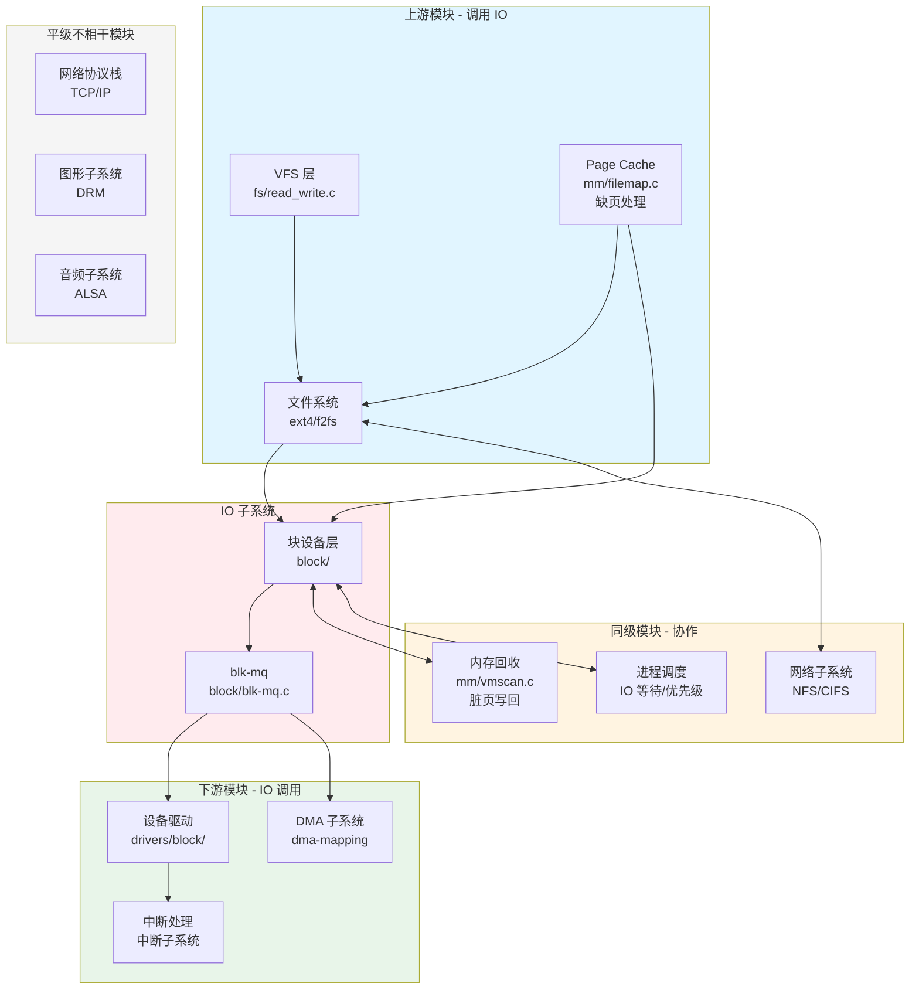
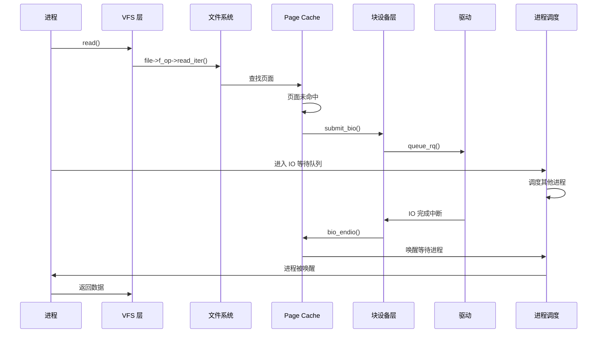
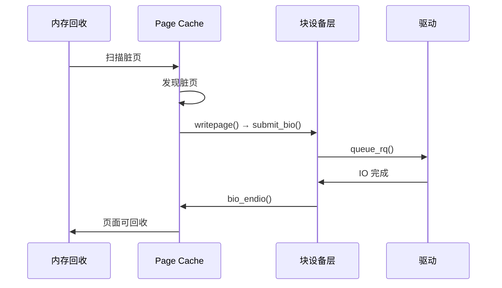
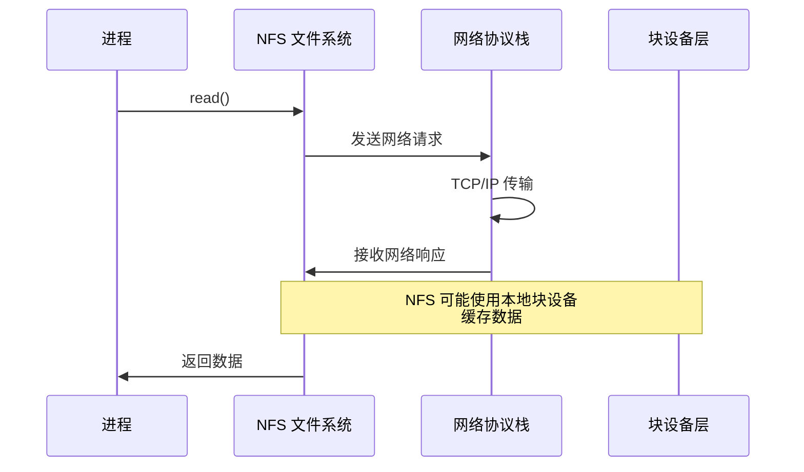

# IO 的上下游模块与同级交互

## 学习目标

- 理解 IO 子系统的上游模块（调用 IO 的模块）
- 理解 IO 子系统的下游模块（IO 调用的模块）
- 掌握 IO 与同级模块的协作关系
- 了解 IO 与不相干模块的隔离
- 理解模块间的交互机制

## 背景介绍

IO 子系统不是孤立存在的，它与 Kernel 中的多个子系统紧密协作。理解这些交互关系，有助于：
- 理解 IO 在整个系统中的作用
- 分析 IO 相关的性能问题
- 理解系统级的行为和优化

## 模块关系总览

### 整体关系图



## 上游模块（调用 IO 的模块）

### 1. VFS 层

**位置**：`fs/read_write.c`, `fs/filemap.c`

**作用**：
- 提供统一的文件操作接口
- 将文件操作转换为块设备操作

**调用 IO 的方式**：
```c
// fs/filemap.c
int generic_file_read_iter(struct kiocb *iocb, struct iov_iter *iter)
{
    // ...
    error = mapping->a_ops->readpage(file, page);
    // readpage 最终会调用 submit_bio()
}
```

**关键函数**：
- `generic_file_read_iter()` - 通用文件读操作
- `generic_file_write_iter()` - 通用文件写操作
- `filemap_read()` - 文件映射读操作

**交互点**：
- VFS 不直接调用 IO，而是通过文件系统的 `file_operations` 接口
- 文件系统实现 `address_space_operations.readpage()` 等接口，这些接口会调用 `submit_bio()`

### 2. 文件系统层

**位置**：`fs/ext4/`, `fs/f2fs/` 等

**作用**：
- 实现具体的文件系统逻辑
- 将文件操作转换为块设备操作

**调用 IO 的方式**：
```c
// fs/ext4/inode.c
static int ext4_readpage(struct file *file, struct page *page)
{
    // ...
    return mpage_readpage(page, ext4_get_block);
    // mpage_readpage 会创建 bio 并调用 submit_bio()
}
```

**关键函数**：
- `ext4_readpage()` - ext4 读页面
- `ext4_writepage()` - ext4 写页面
- `f2fs_readpage()` - f2fs 读页面

**交互点**：
- 实现 `address_space_operations` 接口
- 通过 `submit_bio()` 提交 IO 请求

### 3. Page Cache（内存管理的一部分）

**位置**：`mm/filemap.c`

**作用**：
- 管理文件的 Page Cache
- 缓存文件数据，减少磁盘访问

**调用 IO 的方式**：
```c
// mm/filemap.c
static int page_cache_read(struct file *file, pgoff_t offset,
                           gfp_t gfp_mask)
{
    // ...
    error = mapping->a_ops->readpage(file, page);
    // 触发文件系统的 readpage，最终调用 submit_bio()
}
```

**关键场景**：
- **缺页处理**：页面不在 Cache 中，触发磁盘读取
- **预读**：预测性读取，提高缓存命中率

**交互点**：
- 通过 `address_space_operations` 接口触发 IO
- IO 完成后，更新 Page Cache 状态

**注意**：Page Cache 的缺页处理是上游调用 IO 的场景。而脏页写回是内存回收（同级协作）的场景，见下文"同级模块"部分。

### 4. Page Cache（内存管理的一部分）

**位置**：`mm/filemap.c`

**作用**：
- 管理文件的 Page Cache
- 缓存文件数据，减少磁盘访问

**调用 IO 的方式**：
- 缺页处理：页面不在 Cache 中，触发磁盘读取
- 通过 `address_space_operations.readpage()` 触发 IO

**关键场景**：
- **缺页处理**：页面不在 Cache 中，触发磁盘读取
- **预读**：预测性读取，提高缓存命中率

**交互点**：
- 通过 `address_space_operations` 接口触发 IO
- IO 完成后，更新 Page Cache 状态

**注意**：Page Cache 作为上游模块，通过文件系统触发 IO。而内存回收（mm/vmscan.c）作为同级协作模块，在回收脏页时触发写回 IO。

## 下游模块（IO 调用的模块）

### 1. 设备驱动

**位置**：`drivers/block/`, `drivers/mmc/`, `drivers/ufs/`, `drivers/nvme/`

**作用**：
- 与硬件设备交互
- 将 IO 请求转换为硬件命令

**被 IO 调用的方式**：
```c
// block/blk-mq.c
blk_status_t ret = q->mq_ops->queue_rq(hctx, &bd);
// 调用驱动的 queue_rq 函数
```

**关键接口**：
```c
struct blk_mq_ops {
    blk_status_t (*queue_rq)(struct blk_mq_hw_ctx *hctx,
                             const struct blk_mq_queue_data *bd);
    void (*complete)(struct request *rq);
    // ...
};
```

**驱动实现示例**：
```c
// drivers/nvme/host/core.c
static blk_status_t nvme_queue_rq(struct blk_mq_hw_ctx *hctx,
                                   const struct blk_mq_queue_data *bd)
{
    struct request *rq = bd->rq;
    // 准备 NVMe 命令
    // 提交到硬件队列
    return BLK_STS_OK;
}
```

**交互点**：
- 块设备层通过 `blk_mq_ops` 接口调用驱动
- 驱动完成 IO 后，调用 `blk_mq_complete_request()`

### 2. DMA 子系统

**位置**：`kernel/dma/`, `include/linux/dma-mapping.h`

**作用**：
- 管理直接内存访问（DMA）
- 处理内存与设备间的数据传输

**被 IO 调用的方式**：
```c
// 驱动中使用 DMA
dma_addr_t dma_addr = dma_map_single(dev, buffer, size, DMA_TO_DEVICE);
// 将缓冲区映射为 DMA 地址，用于设备访问
```

**关键函数**：
- `dma_map_single()` - 映射单个缓冲区
- `dma_map_sg()` - 映射散列表
- `dma_unmap_single()` - 取消映射

**交互点**：
- 驱动在提交 IO 前，使用 DMA 映射缓冲区
- IO 完成后，取消 DMA 映射

### 3. 中断处理

**位置**：`kernel/irq/`

**作用**：
- 处理硬件中断
- IO 完成时触发中断

**被 IO 调用的方式**：
```c
// 驱动中注册中断处理函数
request_irq(irq, nvme_irq, IRQF_SHARED, "nvme", dev);

// IO 完成时，硬件触发中断
static irqreturn_t nvme_irq(int irq, void *data)
{
    // 处理 IO 完成
    blk_mq_complete_request(rq);
    return IRQ_HANDLED;
}
```

**交互点**：
- IO 完成时，硬件触发中断
- 中断处理函数调用 `blk_mq_complete_request()`
- 完成回调链返回到上层

## 同级模块（协作关系）

### 1. 内存管理（内存回收）

**位置**：`mm/vmscan.c`

**协作方式**：

**注意**：内存回收与 Page Cache 是不同的场景：
- **Page Cache（上游）**：缺页时触发读取 IO
- **内存回收（同级协作）**：回收脏页时触发写回 IO

#### Page Cache 回收
```c
// mm/vmscan.c
static int shrink_page_list(struct list_head *page_list,
                            struct pglist_data *pgdat,
                            struct scan_control *sc)
{
    // 回收 Page Cache 中的页面
    // 如果是脏页，需要先写回
    if (PageDirty(page)) {
        // 触发写回 IO
        mapping->a_ops->writepage(page, &wbc);
    }
}
```

**交互场景**：
- **内存压力**：内存不足时，回收 Page Cache
- **脏页写回**：回收脏页前，先触发写回 IO
- **IO 与回收竞争**：写回 IO 与内存回收可能竞争资源

#### Swap 与 IO
- Swap 是特殊的 IO 操作
- 内存压力时，将页面交换到磁盘
- 访问交换页面时，触发磁盘读取

**关键源码位置**：
- `mm/vmscan.c` - 内存回收
- `mm/swapfile.c` - Swap 管理
- `mm/page-writeback.c` - 写回机制

### 2. 进程调度

**位置**：`kernel/sched/`

**协作方式**：

**注意**：进程管理与 IO 的关系有两个方面：
- **系统调用触发 IO（上游）**：进程通过 read/write 系统调用间接触发 IO，但这是通过 VFS → 文件系统 → IO 的路径，不是直接调用
- **IO 等待和优先级（同级协作）**：进程等待 IO 完成、IO 优先级调度，这是同级协作关系

#### IO 等待队列
```c
// 进程等待 IO 完成
void __lock_page(struct page *page)
{
    wait_queue_head_t *q = page_waitqueue(page);
    wait_on_page_bit(page, PG_locked);
}

// IO 完成后唤醒
void unlock_page(struct page *page)
{
    wake_up_page(page, PG_locked);
}
```

**交互场景**：
- **IO 等待**：进程等待 IO 完成时，进入等待队列
- **进程调度**：调度器选择其他进程运行
- **IO 完成**：IO 完成时，唤醒等待的进程

#### IO 优先级
```c
// 设置进程 IO 优先级
long ioprio_set(int which, int who, int ioprio);

// IO 调度器根据优先级调度请求
```

**关键源码位置**：
- `kernel/sched/wait.c` - 等待队列
- `block/ioprio.c` - IO 优先级
- `kernel/sched/fair.c` - CFS 调度器中的 IO 等待处理

### 3. 文件系统（网络文件系统）

**位置**：`fs/nfs/`, `fs/cifs/`

**协作方式**：

#### NFS（Network File System）
```c
// fs/nfs/file.c
static ssize_t nfs_file_read_iter(struct kiocb *iocb, struct iov_iter *to)
{
    // NFS 文件系统将文件操作转换为网络请求
    // 通过网络协议栈发送数据
    return nfs_file_read(iocb, to);
}
```

**交互场景**：
- **网络 IO**：文件操作转换为网络请求
- **协议栈交互**：通过 TCP/IP 协议栈传输数据
- **缓存机制**：NFS 也有自己的缓存机制

**关键源码位置**：
- `fs/nfs/` - NFS 文件系统
- `fs/cifs/` - CIFS 文件系统
- `net/` - 网络协议栈

### 4. 网络子系统

**位置**：`net/`

**协作方式**：
- 网络文件系统（NFS、CIFS）使用网络协议栈
- 文件操作转换为网络数据包
- 通过网络接口发送和接收数据

**交互点**：
- 网络文件系统通过 socket 接口使用网络
- 网络 IO 与块设备 IO 是不同路径

## 平级不相干模块

### 1. 网络协议栈（TCP/IP）

**位置**：`net/ipv4/`, `net/ipv6/`

**关系**：
- 与块设备 IO 无直接关系
- 网络文件系统会使用，但这是间接关系
- 独立的子系统，处理网络数据包

### 2. 图形子系统（DRM）

**位置**：`drivers/gpu/drm/`

**关系**：
- 处理图形渲染
- 与块设备 IO 无直接关系
- 可能使用 DMA，但这是硬件层面的共享

### 3. 音频子系统（ALSA）

**位置**：`sound/`

**关系**：
- 处理音频输入输出
- 与块设备 IO 无直接关系
- 可能有自己的 IO 路径（字符设备）

## 模块间交互机制

### 1. 回调机制

**bio_endio 回调链**：
```c
// IO 完成的回调链
驱动完成
  → blk_mq_complete_request(rq)
    → bio_endio(bio)
      → bio->bi_end_io(bio)  // 文件系统设置的回调
        → end_page_writeback(page)  // Page Cache 完成
          → wake_up_page(page, PG_writeback)  // 唤醒等待进程
```

**关键函数**：
- `bio_endio()` - bio 完成处理
- `blk_mq_complete_request()` - request 完成处理

### 2. 等待队列

**IO 等待机制**：
```c
// 进程等待 IO 完成
wait_on_page_bit(page, PG_locked);

// IO 完成后唤醒
wake_up_page(page, PG_locked);
```

**关键数据结构**：
- `wait_queue_head_t` - 等待队列头
- `wait_queue_entry_t` - 等待队列项

### 3. 工作队列

**异步 IO 处理**：
```c
// 使用 workqueue 异步处理 IO
queue_work(io_wq, &work);

// 例如：写回工作队列
queue_work(writeback_wq, &wb->dwork.work);
```

**关键机制**：
- 使用 workqueue 异步处理 IO
- 避免阻塞调用线程
- 提高系统响应性

### 4. 中断处理

**IO 完成中断**：
```c
// 注册中断处理函数
request_irq(irq, handler, flags, name, dev);

// IO 完成时触发中断
static irqreturn_t handler(int irq, void *data)
{
    // 处理 IO 完成
    blk_mq_complete_request(rq);
    return IRQ_HANDLED;
}
```

## 交互场景分析

### 场景 1：文件读取



### 场景 2：内存回收触发写回



### 场景 3：网络文件系统



## 总结

### 核心要点

1. **上游模块调用 IO**：
   - **VFS 层**：通过文件系统的 `file_operations` 接口间接调用
   - **文件系统层**：实现 `address_space_operations`，直接调用 `submit_bio()`
   - **Page Cache**：缺页处理时，通过文件系统的 `readpage()` 触发 IO
   - **注意**：VFS 不直接调用 IO，而是通过文件系统层；进程管理通过系统调用间接触发 IO，但路径是 VFS → 文件系统 → IO

2. **下游模块被 IO 调用**：
   - 设备驱动、DMA 子系统、中断处理
   - 通过 `blk_mq_ops` 接口交互

3. **同级模块协作**：
   - **内存回收**：回收脏页时触发写回 IO（与 Page Cache 缺页处理不同）
   - **进程调度**：IO 等待队列、IO 优先级调度
   - **网络子系统**：网络文件系统（NFS/CIFS）

4. **交互机制**：
   - 回调机制：bio_endio 回调链
   - 等待队列：进程等待 IO 完成
   - 工作队列：异步 IO 处理
   - 中断处理：IO 完成通知

### 关键概念

- **上游模块**：调用 IO 的模块（VFS、文件系统等）
- **下游模块**：IO 调用的模块（驱动、DMA 等）
- **同级模块**：与 IO 协作的模块（内存管理、进程调度等）
- **回调链**：IO 完成的回调机制

### 下一步学习

- [04-单次文件读写的完整 IO 流程](04-单次文件读写的完整IO流程.md) - 从一次读写操作理解整个 IO 过程
- [05-并发 IO 请求的处理机制](05-并发IO请求的处理机制.md) - 理解大量并发 IO 时的系统行为
- [08-IO 与内存管理的交互](08-IO与内存管理的交互.md) - 深入理解 IO 与内存子系统的协作

## 参考资料

- Linux 内核源码：`fs/`, `mm/`, `kernel/sched/`, `drivers/block/`
- 关键文件：
  - `fs/filemap.c` - VFS 与块层的交互
  - `mm/filemap.c` - Page Cache 实现
  - `block/blk-core.c` - submit_bio 入口
  - `kernel/sched/wait.c` - 等待队列

## 更新记录

- 2026-01-26：初始创建，包含 IO 的上下游模块与同级交互
