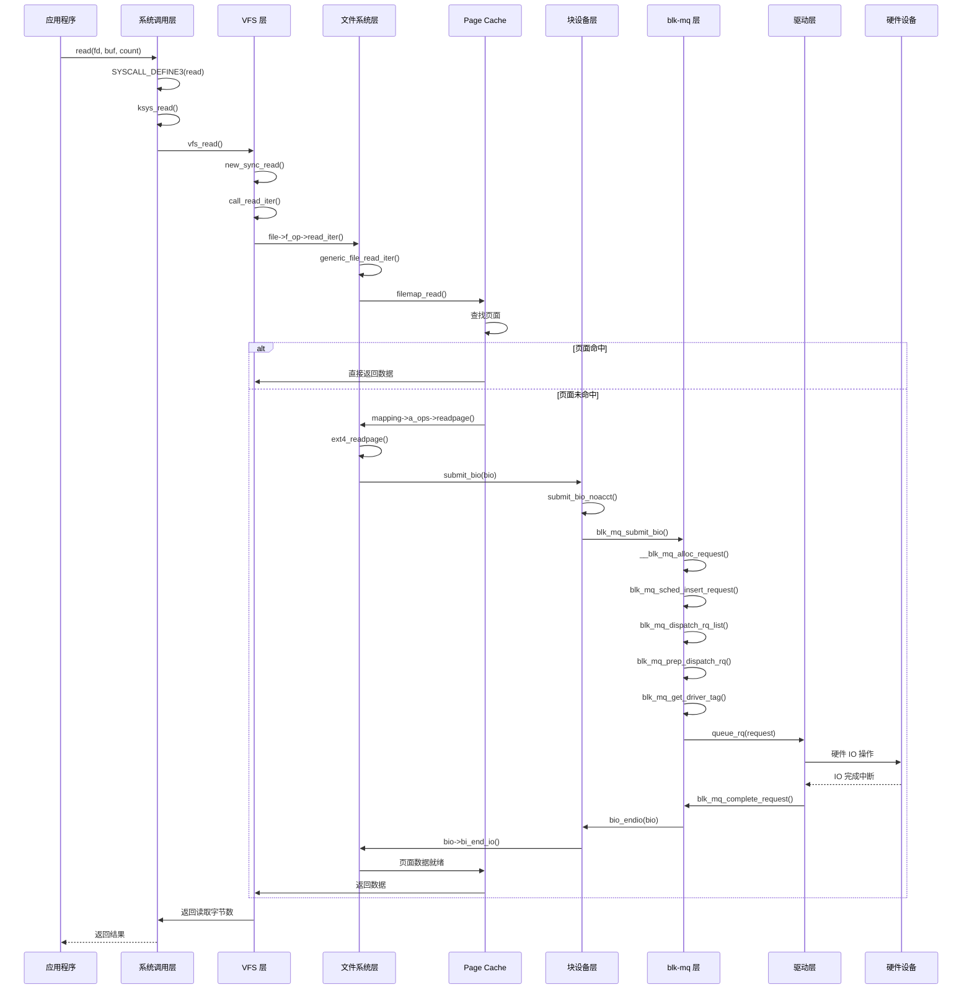
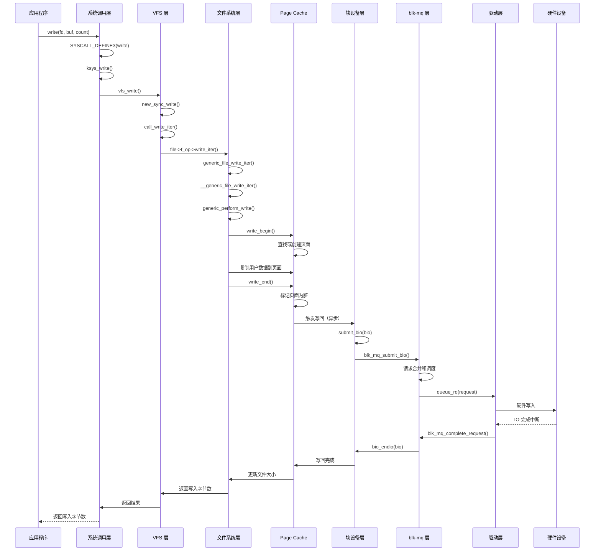

# 单次文件读写的完整 IO 流程

## 学习目标

- 理解一次文件读操作的完整流程
- 理解一次文件写操作的完整流程
- 掌握关键函数调用链
- 理解数据在各个层次间的流转
- 理解 IO 完成的回调机制

## 背景介绍

理解单次文件读写的完整流程，是深入理解 IO 子系统的基础。本文将从一次简单的 `read()` 和 `write()` 系统调用开始，追踪整个 IO 过程，帮助 Framework 层工程师建立完整的 IO 流程认知。

## 读操作完整流程

### 读操作流程图



### 读操作详细步骤

#### 1. 用户空间调用

**系统调用**：
```c
ssize_t read(int fd, void *buf, size_t count);
```

**作用**：
- 从文件描述符 `fd` 读取 `count` 字节数据到缓冲区 `buf`
- 返回实际读取的字节数

#### 2. 系统调用层

**文件**：`fs/read_write.c`

**关键函数**：
```c
SYSCALL_DEFINE3(read, unsigned int, fd, char __user *, buf, size_t, count)
{
    return ksys_read(fd, buf, count);
}

ssize_t ksys_read(unsigned int fd, char __user *buf, size_t count)
{
    struct fd f = fdget_pos(fd);
    // ...
    ret = vfs_read(f.file, buf, count, ppos);
    // ...
    return ret;
}
```

**关键操作**：
- 根据文件描述符获取 `struct file`
- 调用 VFS 层的 `vfs_read()`
- 更新文件位置指针

#### 3. VFS 层

**文件**：`fs/read_write.c`

**关键函数**：
```c
ssize_t vfs_read(struct file *file, char __user *buf, size_t count, loff_t *pos)
{
    // 权限检查
    if (!(file->f_mode & FMODE_READ))
        return -EBADF;
    
    // 调用文件操作
    if (file->f_op->read_iter)
        ret = new_sync_read(file, buf, count, pos);
    // ...
}

static ssize_t new_sync_read(struct file *filp, char __user *buf, size_t len, loff_t *ppos)
{
    struct kiocb kiocb;
    struct iov_iter iter;
    // ...
    ret = call_read_iter(filp, &kiocb, &iter);
    // ...
}
```

**关键操作**：
- 权限检查（`FMODE_READ`）
- 用户空间缓冲区验证（`access_ok()`）
- 构建 `kiocb` 和 `iov_iter`
- 调用文件系统的 `read_iter` 方法

#### 4. 文件系统层

**文件**：`fs/filemap.c`（通用）或 `fs/ext4/file.c`（ext4）

**关键函数**：
```c
// 通用文件读迭代器
ssize_t generic_file_read_iter(struct kiocb *iocb, struct iov_iter *iter)
{
    if (iocb->ki_flags & IOCB_DIRECT) {
        // 直接 IO 路径
        retval = generic_file_direct_read(iocb, iter);
    } else {
        // 缓冲 IO 路径（通过 Page Cache）
        retval = filemap_read(iocb, iter, 0);
    }
    return retval;
}
```

**关键操作**：
- 判断是直接 IO 还是缓冲 IO
- 缓冲 IO 通过 Page Cache
- 直接 IO 绕过 Page Cache

#### 5. Page Cache 层

**文件**：`mm/filemap.c`

**关键函数**：
```c
ssize_t filemap_read(struct kiocb *iocb, struct iov_iter *iter, ssize_t already_read)
{
    // 查找或创建页面
    page = find_get_page(mapping, index);
    
    if (!page) {
        // 页面未命中，触发磁盘读取
        error = page_cache_read(file, index, GFP_KERNEL);
        // page_cache_read 会调用 readpage
    }
    
    // 从页面复制数据到用户空间
    copy_page_to_iter(page, offset, bytes, iter);
}
```

**关键操作**：
- 查找页面是否在 Page Cache 中
- **命中**：直接从 Cache 读取，无需磁盘 IO
- **未命中**：调用 `readpage()` 触发磁盘读取

#### 6. 块设备层（bio 创建）

**文件**：`block/fops.c`（块设备）或文件系统实现

**关键函数**：
```c
// ext4 文件系统的 readpage（fs/ext4/inode.c）
static int ext4_readpage(struct file *file, struct page *page)
{
    int ret = -EAGAIN;
    struct inode *inode = page->mapping->host;

    if (ext4_has_inline_data(inode))
        ret = ext4_readpage_inline(inode, page);

    if (ret == -EAGAIN)
        return ext4_mpage_readpages(inode, NULL, page);
        // ext4_mpage_readpages 会创建 bio 并调用 submit_bio()

    return ret;
}
```

**bio 创建**：
```c
// 创建 bio
struct bio *bio = bio_alloc(GFP_KERNEL, nr_vecs);
bio->bi_bdev = inode->i_sb->s_bdev;
bio->bi_iter.bi_sector = block * (PAGE_SIZE >> 9);
bio->bi_opf = REQ_OP_READ;
bio_add_page(bio, page, PAGE_SIZE, 0);
bio->bi_end_io = end_page_read;

// 提交 bio
submit_bio(bio);
```

#### 7. blk-mq 层

**文件**：`block/blk-mq.c`

**关键函数**：
```c
blk_qc_t blk_mq_submit_bio(struct bio *bio)
{
    // 1. bio 分割和合并尝试
    __blk_queue_split(&bio, &nr_segs);
    blk_attempt_plug_merge(q, bio, nr_segs, &same_queue_rq);
    blk_mq_sched_bio_merge(q, bio, nr_segs);
    
    // 2. 分配 request
    rq = __blk_mq_alloc_request(&data);
    
    // 3. bio 转换为 request
    blk_mq_bio_to_request(rq, bio, nr_segs);
    
    // 4. 插入调度器队列
    blk_mq_sched_insert_request(rq, false, true, true);
    
    return cookie;
}
```

**关键操作**：
- bio 分割（如果超出设备限制）
- 尝试合并相邻请求
- 分配 request（bio → request）
- 插入 IO 调度器队列

#### 8. Dispatch 阶段

**文件**：`block/blk-mq.c`

**关键函数**：
```c
bool blk_mq_dispatch_rq_list(struct blk_mq_hw_ctx *hctx, struct list_head *list, unsigned int nr_budgets)
{
    do {
        rq = list_first_entry(list, struct request, queuelist);
        
        // 准备 dispatch
        prep = blk_mq_prep_dispatch_rq(rq, !nr_budgets);
        if (prep != PREP_DISPATCH_OK)
            break;
        
        // 获取 driver tag
        if (!blk_mq_get_driver_tag(rq)) {
            // tag 不足，等待
            break;
        }
        
        // 发送给驱动
        ret = q->mq_ops->queue_rq(hctx, &bd);
        
    } while (!list_empty(list));
}
```

**关键操作**：
- 从调度器队列取出 request
- 获取 driver tag（硬件队列资源）
- 发送给驱动层

#### 9. 驱动层

**文件**：`drivers/nvme/host/core.c`（以 NVMe 为例）

**关键函数**：
```c
static blk_status_t nvme_queue_rq(struct blk_mq_hw_ctx *hctx, const struct blk_mq_queue_data *bd)
{
    struct request *rq = bd->rq;
    struct nvme_queue *nvmeq = hctx->driver_data;
    
    // 1. 准备 NVMe 命令
    struct nvme_command cmnd;
    cmnd.rw.opcode = nvme_cmd_read;
    cmnd.rw.nsid = cpu_to_le32(ns->head->ns_id);
    cmnd.rw.slba = cpu_to_le64(sector >> (ns->lba_shift - 9));
    
    // 2. 提交到硬件队列
    nvme_submit_cmd(nvmeq, &cmnd);
    
    return BLK_STS_OK;
}
```

**关键操作**：
- 将 request 转换为硬件命令
- 提交到硬件队列
- 硬件执行 IO 操作

#### 10. IO 完成路径

**中断处理**：
```c
static irqreturn_t nvme_irq(int irq, void *data)
{
    // 处理 IO 完成
    struct nvme_completion cqe;
    // ...
    blk_mq_complete_request(rq);
    return IRQ_HANDLED;
}
```

**完成回调链**：
```c
blk_mq_complete_request(rq)
  → bio_endio(bio)
    → bio->bi_end_io(bio)  // end_page_read
      → unlock_page(page)  // 解锁页面
        → wake_up_page(page, PG_locked)  // 唤醒等待进程
```

## 写操作完整流程

### 写操作流程图



### 写操作详细步骤

#### 1-3. 用户空间到 VFS 层

与读操作类似，但调用 `write()` 系统调用和 `vfs_write()`。

#### 4. 文件系统层

**关键函数**：
```c
ssize_t generic_file_write_iter(struct kiocb *iocb, struct iov_iter *from)
{
    if (iocb->ki_flags & IOCB_DIRECT) {
        // 直接 IO
        ret = generic_file_direct_write(iocb, from);
    } else {
        // 缓冲 IO
        ret = __generic_file_write_iter(iocb, from);
    }
    
    // 同步写入（如果需要）
    if (ret > 0)
        ret = generic_write_sync(iocb, ret);
    
    return ret;
}
```

#### 5. Page Cache 层（写操作）

**关键函数**：
```c
ssize_t generic_perform_write(struct file *file, struct iov_iter *i, loff_t pos)
{
    do {
        // 1. write_begin：准备写操作
        error = mapping->a_ops->write_begin(file, mapping, pos, bytes, flags, &page, &fsdata);
        
        // 2. 复制用户数据到页面
        copied = iov_iter_copy_from_user_atomic(page, i, offset, bytes);
        
        // 3. write_end：完成写操作
        error = mapping->a_ops->write_end(file, mapping, pos, bytes, copied, page, fsdata);
        
        pos += copied;
        written += copied;
    } while (iov_iter_count(i));
    
    return written;
}
```

**关键操作**：
- `write_begin()`：查找或创建页面，锁定页面
- 复制用户数据到页面
- `write_end()`：标记页面为脏，解锁页面

#### 6. 脏页写回

**触发时机**：
- 页面变脏后，不会立即写回
- 由写回机制异步写回：
  - 内存压力时
  - 定时写回
  - 显式同步（`fsync()`）

**写回函数**：
```c
int filemap_write_and_wait_range(struct address_space *mapping, loff_t lstart, loff_t lend)
{
    // 触发写回
    __filemap_fdatawrite_range(mapping, lstart, lend, WB_SYNC_ALL);
    // 等待完成
    filemap_fdatawait_range(mapping, lstart, lend);
}
```

#### 7-10. 块设备层到完成

与读操作类似，但：
- bio 操作是 `REQ_OP_WRITE`
- 写操作可能涉及请求合并（相邻扇区）
- 完成回调更新页面状态（清除脏标志）

## 关键函数调用链总结

### 读操作调用链

```
read()
  → SYSCALL_DEFINE3(read)
    → ksys_read()
      → vfs_read()
        → new_sync_read()
          → call_read_iter()
            → file->f_op->read_iter()
              → generic_file_read_iter()
                → filemap_read()
                  → mapping->a_ops->readpage()
                    → ext4_readpage()
                      → submit_bio(bio)
                        → blk_mq_submit_bio()
                          → __blk_mq_alloc_request()
                            → blk_mq_sched_insert_request()
                              → blk_mq_dispatch_rq_list()
                                → blk_mq_prep_dispatch_rq()
                                  → q->mq_ops->queue_rq()
                                    → nvme_queue_rq()
                                      → 硬件 IO
```

### 写操作调用链

```
write()
  → SYSCALL_DEFINE3(write)
    → ksys_write()
      → vfs_write()
        → new_sync_write()
          → call_write_iter()
            → file->f_op->write_iter()
              → generic_file_write_iter()
                → __generic_file_write_iter()
                  → generic_perform_write()
                    → mapping->a_ops->write_begin()
                    → 复制数据到页面
                    → mapping->a_ops->write_end()
                      → 标记页面为脏
                        → 异步写回
                          → submit_bio(bio)
                            → blk_mq_submit_bio()
                              → ... (与读操作类似)
```

## 数据流转

### 读操作数据流转

```
用户空间缓冲区
    ↓ (系统调用，复制参数)
内核空间
    ↓ (iov_iter)
Page Cache 页面
    ↓ (bio)
块设备层
    ↓ (request)
驱动层
    ↓ (硬件命令)
存储设备
    ↓ (硬件读取)
存储设备数据
    ↓ (DMA)
Page Cache 页面
    ↓ (copy_to_user)
用户空间缓冲区
```

### 写操作数据流转

```
用户空间缓冲区
    ↓ (系统调用，复制参数)
内核空间
    ↓ (iov_iter)
Page Cache 页面（脏页）
    ↓ (异步写回，bio)
块设备层
    ↓ (request)
驱动层
    ↓ (硬件命令)
存储设备
    ↓ (硬件写入)
数据写入存储设备
```

## 关键数据结构转换

### bio → request

```c
// bio 转换为 request
static void blk_mq_bio_to_request(struct request *rq, struct bio *bio, unsigned int nr_segs)
{
    rq->__sector = bio->bi_iter.bi_sector;
    rq->__data_len = bio->bi_iter.bi_size;
    rq->bio = rq->biotail = bio;
    rq->ioprio = bio_prio(bio);
}
```

### request → 硬件命令

```c
// request 转换为硬件命令（以 NVMe 为例）
static blk_status_t nvme_queue_rq(struct blk_mq_hw_ctx *hctx, const struct blk_mq_queue_data *bd)
{
    struct request *rq = bd->rq;
    // 从 request 提取信息
    sector = blk_rq_pos(rq);
    nsecs = blk_rq_bytes(rq) >> 9;
    // 构建 NVMe 命令
    cmnd.rw.slba = cpu_to_le64(sector >> (ns->lba_shift - 9));
    cmnd.rw.length = cpu_to_le16(nsecs - 1);
}
```

## 总结

### 核心要点

1. **读操作流程**：
   - 用户空间 → 系统调用 → VFS → 文件系统 → Page Cache
   - Page Cache 未命中时，触发磁盘读取
   - bio → request → 驱动 → 硬件

2. **写操作流程**：
   - 用户空间 → 系统调用 → VFS → 文件系统 → Page Cache
   - 数据先写入 Page Cache（脏页）
   - 异步写回磁盘

3. **关键差异**：
   - 读操作：同步等待数据
   - 写操作：异步写回，立即返回

4. **性能优化点**：
   - Page Cache 命中减少磁盘 IO
   - 请求合并提高效率
   - 异步写回提高响应性

### 关键概念

- **Page Cache**：缓存文件数据，减少磁盘访问
- **bio**：块 IO 描述符，表示一个块设备 IO 操作
- **request**：IO 请求，由一个或多个 bio 组成
- **回调链**：IO 完成的回调机制

### 下一步学习

- [05-并发 IO 请求的处理机制](05-并发IO请求的处理机制.md) - 理解大量并发 IO 时的系统行为
- [08-IO 与内存管理的交互](08-IO与内存管理的交互.md) - 深入理解 Page Cache 和写回机制
- [06-IO 性能优化与调优](06-IO性能优化与调优.md) - 掌握 IO 性能分析和优化方法

## 参考资料

- Linux 内核源码：`fs/read_write.c`, `fs/filemap.c`, `block/blk-core.c`, `block/blk-mq.c`
- 相关文章：[IO完整流程：从用户空间到内核空间](../android/22-IO完整流程：从用户空间到内核空间.md)

## 更新记录

- 2026-01-26：初始创建，包含单次文件读写的完整 IO 流程
