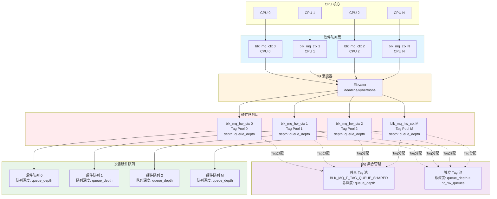
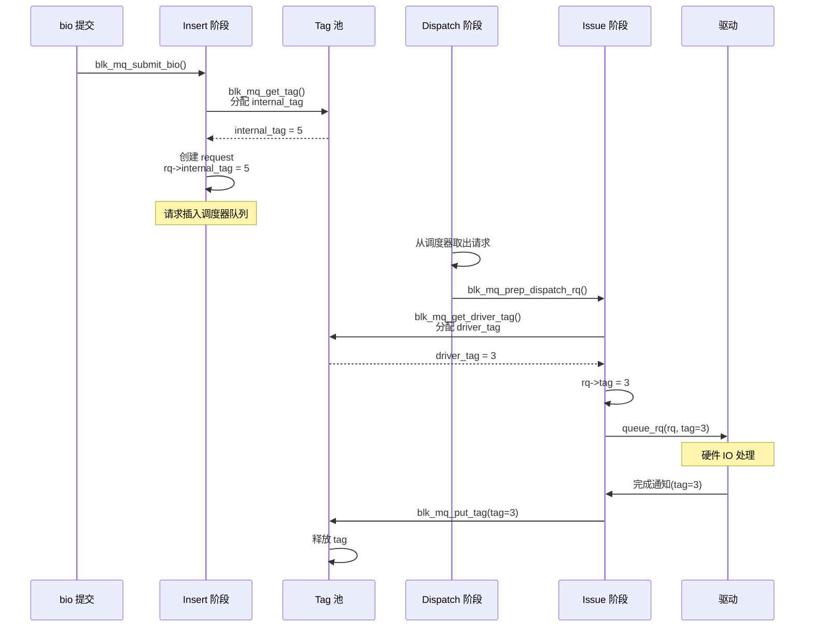

# 并发 IO 请求的处理机制

## 学习目标

- 理解多队列架构（blk-mq）的设计思想
- 掌握 Tag 机制的工作原理
- 理解 IO 调度器的作用和选择
- 掌握请求合并和排序机制
- 理解并发场景下的资源管理和性能优化

## 背景介绍

现代系统需要处理大量并发的 IO 请求。理解并发 IO 的处理机制，对于分析性能问题、优化 IO 吞吐量至关重要。本文将从架构角度分析并发 IO 的处理机制，帮助 Framework 层工程师理解系统在高并发场景下的行为。

## 并发 IO 的挑战

### 传统单队列的问题

**锁竞争**：
- 所有 CPU 竞争同一个全局队列锁
- 多核系统下成为瓶颈

**缓存行失效**：
- 多个 CPU 修改同一队列导致缓存行频繁失效
- 影响性能

**无法利用硬件并行性**：
- 现代 SSD 和 NVMe 设备支持多队列
- 单队列无法充分利用硬件能力

### blk-mq 的解决方案

**多队列架构**：
- 软件队列（per-CPU）：减少锁竞争
- 硬件队列（per-device）：直接映射到设备硬件队列
- 队列映射：软件队列到硬件队列的映射

## 多队列架构（blk-mq）

### 架构图



**架构说明**：
- **Tag 池**：每个硬件队列关联一个 tag 池（或共享 tag 池）
- **Tag 数量**：由 `queue_depth` 决定，表示每个硬件队列的并发请求上限
- **Tag 分配**：请求在 dispatch 阶段分配 driver tag，用于标识硬件队列中的请求

### 软件队列（Software Staging Queues）

**位置**：`struct blk_mq_ctx`

**特点**：
- 按 CPU 或 NUMA 节点分配
- 每个 CPU 有独立的软件队列
- 独立的锁，减少竞争

**关键字段**：
```c
struct blk_mq_ctx {
    struct {
        spinlock_t      lock;                    // 保护软件队列的锁
        struct list_head rq_lists[HCTX_MAX_TYPES]; // 请求列表
    } ____cacheline_aligned_in_smp;
    
    unsigned int        cpu;                     // 所属 CPU
    struct blk_mq_hw_ctx *hctxs[HCTX_MAX_TYPES]; // 关联的硬件队列
    // ...
};
```

**作用**：
- 暂存 IO 请求
- 支持请求合并（相邻扇区）
- 可以应用 IO 调度器

### 硬件队列（Hardware Dispatch Queues）

**位置**：`struct blk_mq_hw_ctx`

**特点**：
- 直接映射到设备的硬件提交队列
- 数量由设备硬件决定，但不超过 CPU 核心数
- 不支持重排序（FIFO 顺序）
- 每个硬件队列关联一个 Tag 池，限制并发请求数

**关键字段**：
```c
struct blk_mq_hw_ctx {
    struct {
        spinlock_t      lock;            // 保护 dispatch 列表的锁
        struct list_head dispatch;       // dispatch 队列
        unsigned long   state;           // 硬件队列状态
    } ____cacheline_aligned_in_smp;
    
    struct blk_mq_tags  *tags;           // Tag 集合（每个硬件队列的 tag 池）
    atomic_t            nr_active;       // 活跃请求数（已分配 tag 的请求数）
    unsigned int        queue_num;       // 硬件队列编号
    // ...
};
```

**Tag 池与硬件队列的关系**：
- **独立 Tag 模式**：每个硬件队列有独立的 tag 池，tag 数量 = `queue_depth`
- **共享 Tag 模式**：所有硬件队列共享一个 tag 池，总 tag 数量 = `queue_depth`
- **Tag 限制**：`nr_active` 表示当前已分配的 tag 数量，不能超过 `tags->nr_tags`

**作用**：
- 直接发送请求给设备驱动
- 管理 Tag 资源（通过 `tags` 字段）
- dispatch 队列：临时存放因 tag 不足无法发送的请求

### 队列映射

**映射关系**：
- 一个软件队列可以映射到多个硬件队列
- 一个硬件队列可以接收来自多个软件队列的请求
- 映射策略：根据 CPU、IO 类型等

**映射函数**：
```c
// 根据 CPU 和 IO 类型选择硬件队列
struct blk_mq_hw_ctx *blk_mq_map_queue(struct request_queue *q,
                                       unsigned int flags,
                                       struct blk_mq_ctx *ctx)
{
    return q->queue_hw_ctx[ctx->cpu];
}
```

## Tag 机制

### Tag 的作用

**为什么需要 Tag**：
- 传统单队列需要线性搜索完成 IO 请求
- blk-mq 使用 Tag 实现 O(1) 的请求查找
- 每个请求分配唯一的 Tag（整数）

**Tag 的类型**：

#### 1. Internal Tag（内部 Tag）

**分配时机**：Insert 阶段，分配 request 时

**用途**：IO 调度器使用，标识调度器队列中的请求

**特点**：
- 范围：0 到 `nr_tags - 1`
- 即使有调度器，也会分配 internal_tag

#### 2. Driver Tag（驱动 Tag）

**分配时机**：Issue 阶段，准备发送给驱动时

**用途**：驱动使用，标识硬件队列中的请求

**特点**：
- 范围：0 到 `nr_tags - 1`
- 如果没有调度器，driver tag = internal tag
- 如果有调度器，driver tag 在 dispatch 时分配

### Tag 分配流程



### Tag 池管理（sbitmap）

**位置**：`block/blk-mq-tag.c`

**数据结构**：
```c
struct blk_mq_tags {
    unsigned int nr_tags;                  // tag 总数
    unsigned int nr_reserved_tags;         // 保留 tag 数量
    struct sbitmap_queue *bitmap_tags;     // 普通 tag 的 bitmap
    struct sbitmap_queue *breserved_tags;  // 保留 tag 的 bitmap
    struct request **rqs;                  // tag 到 request 的映射
    // ...
};
```

**Tag 分配**：
```c
unsigned int blk_mq_get_tag(struct blk_mq_alloc_data *data)
{
    // 1. 尝试分配 tag
    tag = __sbitmap_queue_get(bt);
    if (tag != BLK_MQ_NO_TAG)
        return tag;
    
    // 2. tag 不足，等待
    if (data->flags & BLK_MQ_REQ_NOWAIT)
        return BLK_MQ_NO_TAG;
    
    // 3. 进入等待队列
    sbitmap_prepare_to_wait(bt, ws, &wait);
    io_schedule();  // 睡眠等待
    // ...
}
```

**Tag 等待机制**：

**⚠️ 重要**：internal_tag 和 driver_tag 的等待机制不同：

| Tag 类型 | 分配函数 | 等待行为 | 影响 |
|----------|----------|----------|------|
| **internal_tag** | `blk_mq_get_tag()` | **阻塞等待**（`io_schedule()`） | 进程进入 D 状态 |
| **driver_tag** | `blk_mq_get_driver_tag()` | **不阻塞**，请求放回 dispatch list | IO 延迟增加，但进程不阻塞 |

**internal_tag 等待**：
- 如果 tag 不足，进程进入等待队列
- tag 释放时，唤醒等待的进程
- 使用 sbitmap 实现高效的 tag 管理

**driver_tag 等待**（不阻塞进程）：
- 获取失败时，请求放回 dispatch list
- 硬件队列注册等待回调（`blk_mq_mark_tag_wait()`）
- tag 释放时，重新运行硬件队列尝试 dispatch

### Tag 数量的确定因素

**Tag 数量与 `queue_depth` 的关系**：

Tag 数量由 `blk_mq_tag_set` 中的 `queue_depth` 字段决定，表示每个硬件队列可以同时处理的请求数量。

**关键代码**（`block/blk-mq.c`）：
```c
int blk_mq_alloc_tag_set(struct blk_mq_tag_set *set)
{
    // queue_depth 由驱动在初始化时设置
    if (!set->queue_depth)
        return -EINVAL;
    
    // 最大深度限制：BLK_MQ_MAX_DEPTH (通常为 4096)
    if (set->queue_depth > BLK_MQ_MAX_DEPTH) {
        pr_info("blk-mq: reduced tag depth to %u\n", BLK_MQ_MAX_DEPTH);
        set->queue_depth = BLK_MQ_MAX_DEPTH;
    }
    
    // 实际分配的 tag 数量 = queue_depth
    tags = blk_mq_init_tags(set->queue_depth, reserved_tags, ...);
    // ...
}
```

**Tag 数量与以下因素相关**：

#### 1. 硬件设备能力

**NVMe 设备**：
- NVMe 规范定义了队列深度（Queue Depth）
- 通常为 1024、2048 或更高
- 驱动根据设备能力设置 `queue_depth`

**示例**（`drivers/nvme/host/core.c`）：
```c
// NVMe 驱动根据设备能力设置队列深度
static void nvme_set_queue_limits(struct nvme_ctrl *ctrl,
                                   struct request_queue *q)
{
    // 队列深度通常为设备支持的最大值
    blk_queue_max_hw_sectors(q, ctrl->max_hw_sectors);
    // ...
}
```

#### 2. 内存限制

**自动调整机制**：
- 如果内存不足，内核会自动减少 `queue_depth`
- 每次减少一半，直到分配成功或达到最小值

**关键代码**（`block/blk-mq.c`）：
```c
static int blk_mq_alloc_map_and_requests(struct blk_mq_tag_set *set)
{
    depth = set->queue_depth;
    do {
        err = __blk_mq_alloc_rq_maps(set);
        if (!err)
            break;
        
        // 内存不足，减少队列深度
        set->queue_depth >>= 1;  // 减半
        if (set->queue_depth < set->reserved_tags + BLK_MQ_TAG_MIN) {
            err = -ENOMEM;
            break;
        }
    } while (set->queue_depth);
    
    if (depth != set->queue_depth)
        pr_info("blk-mq: reduced tag depth (%u -> %u)\n",
                depth, set->queue_depth);
}
```

#### 3. Tag 共享 vs 独立

**共享 Tag 池**（`BLK_MQ_F_TAG_QUEUE_SHARED`）：
- 所有硬件队列共享一个 tag 池
- Tag 总数 = `queue_depth`（所有队列共享）
- 通过 `hctx_may_queue()` 限制每个硬件队列的使用量
- 适合硬件队列数量多、但总并发需求不高的场景

**独立 Tag 池**：
- 每个硬件队列有独立的 tag 池
- 每个硬件队列的 tag 数量 = `queue_depth`
- 总 tag 数量 = `queue_depth × nr_hw_queues`
- 适合硬件队列数量少、但需要高并发的场景

**示例对比**：
```
场景：queue_depth = 128, nr_hw_queues = 4

共享 Tag：
  - 总 tag 数：128
  - 每个硬件队列平均可用：32 个

独立 Tag：
  - 总 tag 数：128 × 4 = 512
  - 每个硬件队列可用：128 个
```

#### 4. 特殊场景限制

**Kdump 内核**：
- 在内存受限的 crashdump 环境中
- 强制限制为 64 个 tag，减少内存使用

**关键代码**：
```c
if (is_kdump_kernel()) {
    set->nr_hw_queues = 1;
    set->queue_depth = min(64U, set->queue_depth);
}
```

**总结**：

| 因素 | 影响 |
|------|------|
| 硬件队列深度 | 决定 `queue_depth` 的上限 |
| 内存可用性 | 可能自动减少 `queue_depth` |
| Tag 共享模式 | 影响总 tag 数量和分配策略 |
| 系统状态 | Kdump 等特殊场景会限制 tag 数量 |

**查看当前 Tag 数量**：
```bash
# 查看设备的队列深度
cat /sys/block/sda/queue/nr_requests

# 查看硬件队列数量
cat /sys/block/sda/queue/nr_hw_queues

# 查看当前活跃请求数
cat /sys/block/sda/queue/nr_active
```

### Tag 共享机制

**共享 Tag 队列**（`BLK_MQ_F_TAG_QUEUE_SHARED`）：
- 多个硬件队列共享同一个 tag 池
- 通过 `hctx_may_queue()` 限制每个硬件队列的 tag 数量
- 防止某个硬件队列占用过多 tag

**独立 Tag 队列**：
- 每个硬件队列有独立的 tag 池
- 不需要 `hctx_may_queue()` 检查
- 适合硬件队列数量较少的情况

## IO 调度器

### 调度器的作用

**请求排序**：
- 按扇区排序，减少磁盘寻道时间（机械硬盘）
- 按优先级排序，保证实时性

**请求合并**：
- 合并相邻扇区的请求
- 减少 IO 次数

**延迟保证**：
- 某些调度器（如 deadline）保证请求的延迟上限

### 常用调度器

#### 1. none（无调度器）

**特点**：
- 不使用调度器
- 请求直接进入硬件队列
- 适合现代 SSD（随机访问性能好）

**使用场景**：
- NVMe SSD
- 高性能存储设备

#### 2. mq-deadline

**位置**：`block/mq-deadline.c`

**特点**：
- 按截止时间排序
- 保证请求的延迟上限
- 适合实时性要求高的场景

**关键机制**：
```c
// Deadline 调度器按截止时间排序
static void deadline_add_request(struct request *rq)
{
    struct deadline_data *dd = rq->q->elevator->elevator_data;
    // 计算截止时间
    rq->fifo_time = jiffies + dd->fifo_expire[rq_data_dir(rq)];
    // 插入排序队列
    list_add_tail(&rq->queuelist, &dd->fifo_list[rq_data_dir(rq)]);
}
```

#### 3. kyber

**位置**：`block/kyber-iosched.c`

**特点**：
- 基于令牌桶算法
- 自动调整深度
- 适合现代 SSD

**关键机制**：
- 为不同 IO 类型（读/写）维护独立的队列
- 使用令牌桶控制每个队列的深度
- 自动调整以优化延迟和吞吐量

#### 4. bfq

**位置**：`block/bfq-iosched.c`

**特点**：
- Budget Fair Queueing
- 公平调度
- 适合交互式应用

### 调度器选择

**选择原则**：
- **SSD/NVMe**：通常使用 `none` 或 `kyber`
- **机械硬盘**：使用 `mq-deadline` 或 `bfq`
- **实时性要求**：使用 `mq-deadline`

## 请求合并

### 合并的类型

#### 1. 前端合并（Front Merge）

**场景**：新请求的结束扇区与现有请求的开始扇区相邻

**示例**：
```
现有请求：扇区 10-20
新请求：扇区 5-10
合并后：扇区 5-20
```

#### 2. 后端合并（Back Merge）

**场景**：新请求的开始扇区与现有请求的结束扇区相邻

**示例**：
```
现有请求：扇区 10-20
新请求：扇区 20-30
合并后：扇区 10-30
```

### 合并的时机

#### 1. Plug 机制

**位置**：`block/blk-mq.c`

**作用**：
- 延迟提交请求，增加合并机会
- 在进程上下文中积累请求

**关键代码**：
```c
blk_qc_t blk_mq_submit_bio(struct bio *bio)
{
    // ...
    plug = blk_mq_plug(q, bio);
    if (plug) {
        // 添加到 plug 列表
        blk_add_rq_to_plug(plug, rq);
        // 达到阈值时，flush plug
        if (plug->rq_count >= blk_plug_max_rq_count(plug))
            blk_flush_plug_list(plug, false);
    }
    // ...
}
```

#### 2. 调度器合并

**位置**：`block/blk-mq-sched.c`

**作用**：
- 在调度器队列中尝试合并
- 调度器可以维护排序队列，便于合并

**关键代码**：
```c
bool blk_mq_sched_bio_merge(struct request_queue *q, struct bio *bio, unsigned int nr_segs)
{
    struct elevator_queue *e = q->elevator;
    if (e && e->type->ops.bio_merge)
        return e->type->ops.bio_merge(q, bio, nr_segs);
    return false;
}
```

## 资源管理

### Tag 限制

**作用**：
- 限制并发 IO 数量，防止资源耗尽
- 控制每个硬件队列的并发深度
- 保证系统稳定性

**机制**：
- **Tag 数量限制**：由 `queue_depth` 决定，表示每个硬件队列的最大并发请求数
- **Tag 分配**：请求在 dispatch 阶段必须获取 driver tag 才能发送给驱动
- **Tag 等待**：tag 不足时，请求进入等待队列，直到有 tag 释放
- **Tag 释放**：请求完成后释放 tag，唤醒等待的请求

**Tag 限制的影响**：
- **性能影响**：tag 数量过少会限制并发性能，导致 IO 等待
- **资源保护**：tag 数量过多会占用过多内存（每个 request 需要内存）
- **平衡点**：需要根据硬件能力和内存情况设置合适的 `queue_depth`

**查看和调整 Tag 数量**：
```bash
# 查看当前队列深度（tag 数量）
cat /sys/block/sda/queue/nr_requests

# 查看硬件队列数量
cat /sys/block/sda/queue/nr_hw_queues

# 查看当前活跃请求数（已使用的 tag 数）
cat /sys/block/sda/queue/nr_active

# 调整队列深度（需要驱动支持）
echo 256 > /sys/block/sda/queue/nr_requests
```

### Budget 机制

**位置**：`block/blk-mq.c`

**作用**：
- SCSI 等驱动需要 budget 控制
- 限制每个硬件队列的 dispatch 数量

**关键代码**：
```c
static enum prep_dispatch blk_mq_prep_dispatch_rq(struct request *rq, bool need_budget)
{
    if (need_budget) {
        budget_token = blk_mq_get_dispatch_budget(rq->q);
        if (budget_token < 0) {
            // budget 不足，无法 dispatch
            return PREP_DISPATCH_NO_BUDGET;
        }
    }
    // ...
}
```

### QoS 控制

**位置**：`block/blk-iocost.c`, `block/blk-iolatency.c`

**作用**：
- 基于成本的 IO 带宽控制
- IO 延迟控制
- cgroup v2 支持

**关键机制**：
- 监控 IO 成本（时间、资源）
- 限制每个 cgroup 的 IO 带宽
- 保证延迟上限

## 并发场景分析

### 场景 1：多进程同时读写

**行为**：
- 每个进程在各自的 CPU 上运行
- 请求进入对应 CPU 的软件队列
- 软件队列映射到硬件队列
- 硬件队列并发处理请求

**性能影响**：
- 多队列架构充分利用多核 CPU
- 减少锁竞争
- 提高并发性能

### 场景 2：多线程并发 IO

**行为**：
- 同一进程的多个线程可能在不同 CPU 上运行
- 请求可能进入不同 CPU 的软件队列
- 最终映射到硬件队列

**性能影响**：
- 多线程可以充分利用多队列
- 需要注意线程间的同步

### 场景 3：后台写回与前台 IO 竞争

**行为**：
- 后台写回（writeback）持续产生 IO 请求
- 前台应用也产生 IO 请求
- 两者竞争硬件队列资源

**优化策略**：
- IO 优先级：前台 IO 优先级更高
- QoS 控制：限制后台 IO 的带宽
- 调度器：使用公平调度器（如 bfq）

### 场景 4：IO 密集型应用

**行为**：
- 应用产生大量 IO 请求
- 可能耗尽 tag 资源（`nr_active` 接近 `nr_tags`）
- 其他应用的 IO 可能被阻塞（等待 tag 释放）
- 导致 IO 延迟增加和吞吐量下降

**Tag 耗尽的判断**：
```bash
# 检查 tag 使用情况
nr_requests=$(cat /sys/block/sda/queue/nr_requests)      # 总 tag 数
nr_active=$(cat /sys/block/sda/queue/nr_active)         # 已使用 tag 数
usage=$(echo "scale=2; $nr_active * 100 / $nr_requests" | bc)
echo "Tag 使用率: ${usage}%"
```

**优化策略**：
- **增加 tag 数量**：如果硬件支持更大的队列深度，可以增加 `queue_depth`
  - 注意：需要驱动支持，且会增加内存占用
- **使用 QoS 控制**：限制单个应用的 IO 带宽，防止独占 tag 资源
- **使用 cgroup 隔离**：通过 cgroup v2 的 IO 控制器隔离不同应用的 IO 资源
- **调整调度器**：使用公平调度器（如 bfq）保证不同应用的公平性

## 性能优化

### 批量处理

**位置**：`block/blk-mq.c`

**机制**：
- 批量 dispatch 请求
- 减少函数调用开销
- 提高吞吐量

**关键代码**：
```c
bool blk_mq_dispatch_rq_list(struct blk_mq_hw_ctx *hctx, struct list_head *list, unsigned int nr_budgets)
{
    // 批量处理请求列表
    do {
        rq = list_first_entry(list, struct request, queuelist);
        // 处理请求
        ret = q->mq_ops->queue_rq(hctx, &bd);
    } while (!list_empty(list));
}
```

### 预读（Readahead）

**位置**：`mm/readahead.c`

**机制**：
- 预测性读取
- 提前读取可能访问的数据
- 提高缓存命中率

### 写回合并

**位置**：`mm/page-writeback.c`

**机制**：
- 合并相邻脏页的写回
- 减少 IO 次数
- 提高写回效率

## 总结

### 核心要点

1. **多队列架构**：
   - 软件队列（per-CPU）：减少锁竞争
   - 硬件队列（per-device）：直接映射到设备
   - 提高并发性能

2. **Tag 机制**：
   - Internal tag：调度器使用
   - Driver tag：驱动使用
   - Tag 数量由 `queue_depth` 决定，表示每个硬件队列的并发上限
   - Tag 数量受硬件能力、内存限制、共享模式等因素影响
   - 限制并发 IO 数量，防止资源耗尽

3. **IO 调度器**：
   - 请求排序和合并
   - 不同场景选择不同调度器
   - 保证延迟和公平性

4. **资源管理**：
   - Tag 限制、Budget 机制、QoS 控制
   - 防止资源耗尽
   - 保证系统稳定性

### 关键概念

- **blk-mq**：多队列块设备 IO 机制
- **Tag**：请求标识符，用于高效的请求管理
  - **Tag 数量**：由 `queue_depth` 决定，限制每个硬件队列的并发请求数
  - **Tag 共享**：多个硬件队列可以共享一个 tag 池，或各自独立
- **IO 调度器**：请求排序和合并的机制
- **请求合并**：合并相邻扇区的请求，减少 IO 次数

### 下一步学习

- [06-IO 性能优化与调优](06-IO性能优化与调优.md) - 掌握 IO 性能分析和优化方法
- [08-IO 与内存管理的交互](08-IO与内存管理的交互.md) - 深入理解 Page Cache 和写回机制
- [10-IO 子系统调试与问题排查](10-IO子系统调试与问题排查.md) - 掌握 IO 问题的调试方法

## 参考资料

- Linux 内核源码：`block/blk-mq.c`, `block/blk-mq-tag.c`, `block/blk-mq-sched.c`
- Linux 内核文档：`Documentation/block/blk-mq.rst`
- 调度器实现：`block/mq-deadline.c`, `block/kyber-iosched.c`, `block/bfq-iosched.c`

## 更新记录

- 2026-01-26：初始创建，包含并发 IO 请求的处理机制
