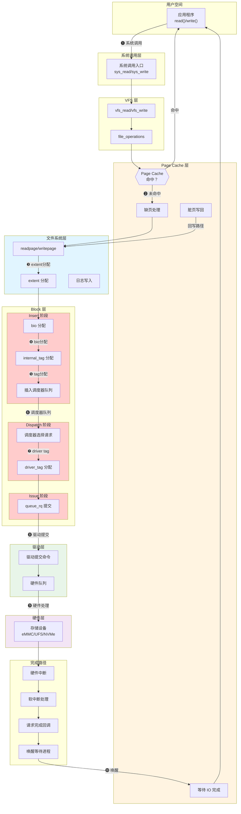
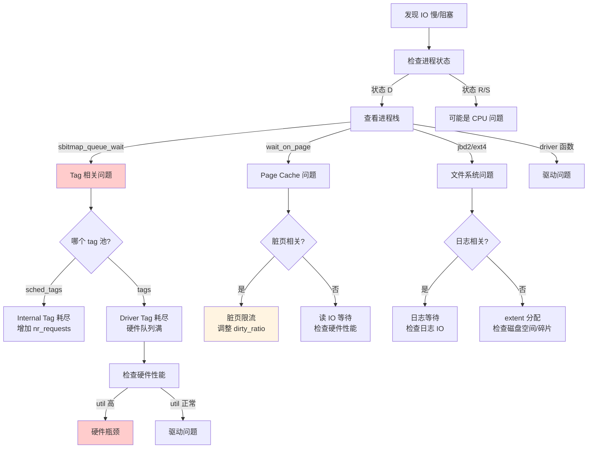

# IO 请求阻塞阶段与劣化分析

## 学习目标

- 理解 IO 请求从用户空间到硬件的完整路径
- 掌握每个阶段可能发生阻塞的原因
- 学会使用 systrace、ftrace 等工具定位阻塞点
- 能够快速分析和定位 IO 劣化问题

## 概述

当系统出现 IO 劣化（IO 阻塞、IO 慢）时，需要定位是哪个阶段出了问题。本文从 IO 请求的完整生命周期出发，详细分析每个阶段可能发生阻塞的原因，并介绍相应的分析方法。

---

## 一、IO 请求完整路径与阻塞点总览

### 架构图：IO 路径与潜在阻塞点



### 阻塞点速查表

| 编号 | 阶段 | 阻塞点 | 常见原因 | 严重程度 | Systrace 可观测 | 观测方法 |
|------|------|--------|----------|----------|------------------|----------|
| ❶ | 系统调用 | 系统调用入口 | 内核锁竞争 | 低 | 🔴 间接 | sched_switch(D) + 进程栈 |
| ❷ | Page Cache | 缺页处理 | Cache 未命中，需要读盘 | 中 | 🔴 间接 | sched_switch(D) + 进程栈 |
| ❸ | 文件系统 | extent 分配 | 元数据锁、日志等待 | 中 | 🔴 间接 | sched_switch(D) + 进程栈 |
| ❹ | Block 层 | bio 分配 | 内存不足 | 低 | 🔴 间接 | sched_switch(D) + 进程栈 |
| ❺ | Block 层 | **internal_tag 分配** | **sched_tags 池耗尽** | **高** | 🟠 **可观测** | bio_queue → getrq（需添加）或 bio_queue → rq_issue |
| ❻ | Block 层 | 调度器队列 | 请求积压 | 中 | 🟠 可观测 | rq_insert → rq_issue（需添加 rq_insert） |
| ❼ | Block 层 | **driver_tag 分配** | **tags 池耗尽** | **中**（不阻塞进程） | 🟠 **可观测** | rq_insert → rq_issue（与调度器队列混合） |
| ❽ | 驱动层 | 驱动提交 | 驱动 bug、资源不足 | 中 | 🟠 间接 | rq_issue → rq_complete 异常 |
| ❾ | 硬件层 | 硬件处理 | 设备性能瓶颈 | 高 | 🟢 **精确** | rq_issue → rq_complete |
| ❿ | 完成路径 | 唤醒等待 | 软中断延迟 | 低 | 🟢 精确 | rq_complete → sched_waking |

**图例**：🟢 精确可测 | 🟠 间接可观测（在 bio_queue 之后） | 🔴 需结合进程栈（在 bio_queue 之前）

**注意**：
1. 使用默认 perfetto 配置（只有 bio_queue/rq_issue/rq_complete）时，❺❻❼ 都包含在 `bio_queue → rq_issue` 时间差中，无法区分。如需精确区分，需添加 `block_getrq` 和 `block_rq_insert` 事件。
2. **关键区别**：❺ internal_tag 分配会**阻塞进程**（调用 `io_schedule()`），而 ❼ driver_tag 分配**不会阻塞进程**（请求放回 dispatch list 等待下次调度）。

---

## 二、各阶段阻塞详解

### 阶段 1：系统调用层

**阻塞点**：系统调用入口

**可能原因**：
- 内核大锁（较少见）
- 信号处理中断

**表现**：
```
进程状态：S (sleeping) 或 R (running)
栈位置：entry_SYSCALL_64 附近
```

**分析方法**：
```bash
# 查看进程栈
cat /proc/<pid>/stack
```

---

### 阶段 2：Page Cache 层

#### 2.1 缺页处理（Cache Miss）

**阻塞点**：Page Cache 未命中，需要从磁盘读取

**可能原因**：
- 首次访问文件
- 内存压力导致页面被回收
- 文件过大，无法全部缓存

**表现**：
```
进程状态：D (uninterruptible sleep)
等待位置：wait_on_page_locked() 或 folio_wait_locked()
```

**关键代码路径**：
```c
// mm/filemap.c
static int filemap_read_folio(struct file *file, struct folio *folio)
{
    // 分配 page 后，启动 IO
    error = mapping->a_ops->read_folio(file, folio);
    // 等待 IO 完成
    folio_wait_locked(folio);  // ← 阻塞点！
}
```

#### 2.2 脏页写回等待

**阻塞点**：同步写或脏页过多触发写回

**可能原因**：
- `O_SYNC`/`O_DSYNC` 同步写
- 脏页比例超过阈值（`dirty_ratio`）
- `fsync()`/`fdatasync()` 调用

**表现**：
```
进程状态：D (uninterruptible sleep)
等待位置：balance_dirty_pages() 或 wait_on_page_writeback()
```

**关键参数**：
```bash
# 查看脏页阈值
cat /proc/sys/vm/dirty_ratio           # 脏页占内存比例阈值（默认 20%）
cat /proc/sys/vm/dirty_background_ratio # 后台写回阈值（默认 10%）

# 查看当前脏页
cat /proc/meminfo | grep Dirty
```

---

### 阶段 3：文件系统层

#### 3.1 extent 分配

**阻塞点**：分配新的磁盘空间

**可能原因**：
- 文件扩展需要分配新 extent
- 磁盘碎片导致分配耗时
- 元数据锁竞争

**表现**：
```
进程状态：D (uninterruptible sleep)
栈位置：ext4_get_block() 或 f2fs_get_block()
```

#### 3.2 日志（Journal）等待

**阻塞点**：等待日志提交

**可能原因**：
- 日志满了需要等待 checkpoint
- `fsync()` 等待日志刷盘
- 日志 IO 慢

**表现**：
```
进程状态：D (uninterruptible sleep)
栈位置：jbd2_log_wait_commit() 或类似
```

**ext4 日志模式**：
```bash
# 查看挂载选项
mount | grep ext4
# data=ordered（默认）：元数据日志，数据先写
# data=journal：数据也写日志（最慢但最安全）
# data=writeback：元数据日志，数据无序（最快但可能损坏）
```

---

### 阶段 4：Block 层 - bio 分配

**阻塞点**：分配 bio 结构体

**可能原因**：
- 内存极度不足
- mempool 耗尽

**表现**：
```
进程状态：D (uninterruptible sleep)
栈位置：mempool_alloc() → bio_alloc()
```

**实际影响**：较少见，因为 bio 使用 mempool 保证最小分配

---

### 阶段 5：Block 层 - Internal Tag 分配 ⚠️ 重要

**阻塞点**：从 `sched_tags` 池分配 internal_tag

**可能原因**：
- `nr_requests` 设置过小
- 调度器队列积压大量请求
- 下游处理慢，请求无法完成

**表现**：
```
进程状态：D (uninterruptible sleep)
栈位置：blk_mq_get_tag() → sbitmap_queue_wait()
```

**关键代码**：
```c
// block/blk-mq-tag.c
int blk_mq_get_tag(struct blk_mq_alloc_data *data)
{
    tag = __blk_mq_get_tag(data, bt);
    if (tag != BLK_MQ_NO_TAG)
        return tag;
    
    // 没有空闲 tag，阻塞等待
    sbitmap_queue_wait(bt, &wait, ws);  // ← 阻塞点！
}
```

**排查方法**：
```bash
# 查看 nr_requests
cat /sys/block/sda/queue/nr_requests

# 查看 sched_tags 使用情况（需要 debugfs）
cat /sys/kernel/debug/block/sda/hctx0/sched_tags
cat /sys/kernel/debug/block/sda/hctx0/sched_tags_bitmap
```

**优化建议**：
```bash
# 增加 nr_requests（需要 root）
echo 256 > /sys/block/sda/queue/nr_requests
```

---

### 阶段 6：Block 层 - 调度器队列

**阻塞点**：请求在调度器队列中等待

**可能原因**：
- 调度器算法导致某些请求延迟
- 高优先级请求抢占
- 请求合并等待

**表现**：
- 请求已入队但未被 dispatch
- 可通过 blktrace 观察 Insert → Issue 时间间隔

**调度器选择**：
```bash
# 查看当前调度器
cat /sys/block/sda/queue/scheduler

# 可选调度器
# [mq-deadline] kyber bfq none
# none：无调度，直接发送（最低延迟）
# mq-deadline：按时间排序（平衡）
# bfq：按进程公平（适合桌面）
```

---

### 阶段 7：Block 层 - Driver Tag 分配 ⚠️ 重要

**阻塞点**：从 `tags` 池分配 driver_tag

**可能原因**：
- 硬件队列深度有限（如 NVMe 1024，eMMC 更小）
- 硬件处理慢，tag 无法释放
- 大量并发 IO 超过硬件能力

**⚠️ 重要区别**：与 internal_tag 不同，**driver_tag 分配不会直接阻塞进程**！
- 获取失败时，请求被放回 dispatch list
- 硬件队列通过 `blk_mq_mark_tag_wait()` 注册等待回调
- 当 tag 释放时，唤醒硬件队列重新尝试 dispatch

**表现**：
```
请求状态：在 dispatch list 等待（不是进程阻塞！）
影响：IO 请求延迟增加，但不会导致进程 D 状态
```

**关键代码**：
```c
// block/blk-mq.c
// 注意：driver_tag 分配不会阻塞，获取失败时请求被放回 dispatch list
static bool __blk_mq_get_driver_tag(struct request *rq)
{
    struct sbitmap_queue *bt = rq->mq_hctx->tags->bitmap_tags;
    int tag;

    tag = __sbitmap_queue_get(bt);  // 非阻塞获取
    if (tag == BLK_MQ_NO_TAG)
        return false;  // 直接返回 false，不阻塞！

    rq->tag = tag + tag_offset;
    return true;
}

bool blk_mq_get_driver_tag(struct request *rq)
{
    if (rq->tag == BLK_MQ_NO_TAG && !__blk_mq_get_driver_tag(rq))
        return false;  // 请求会被放回 dispatch list，等待下次调度
    // ...
    return true;
}
```

**排查方法**：
```bash
# 查看硬件队列深度
cat /sys/block/sda/queue/nr_hw_queues
cat /sys/block/sda/device/queue_depth

# 查看 tags 使用情况
cat /sys/kernel/debug/block/sda/hctx0/tags
cat /sys/kernel/debug/block/sda/hctx0/tags_bitmap
```

---

### 阶段 8：驱动层

**阻塞点**：驱动提交命令到硬件

**可能原因**：
- 驱动 bug
- 驱动内部锁竞争
- DMA 映射失败

**表现**：
```
进程状态：取决于驱动实现
栈位置：nvme_queue_rq() 或 ufshcd_queuecommand() 等
```

---

### 阶段 9：硬件层 ⚠️ 常见瓶颈

**阻塞点**：硬件处理 IO 请求

**可能原因**：
- 设备性能瓶颈（IOPS/带宽上限）
- 闪存垃圾回收（GC）
- 设备过热降速
- 设备固件 bug

**表现**：
```
iostat 指标：
- %util 接近 100%
- await 异常高
- svctm 异常高
```

**UFS 设备特有问题**：
```bash
# 查看 UFS 健康状态
cat /sys/devices/platform/*/host*/scsi_host/host*/life_time_estimation_*

# 查看设备温度（如果支持）
cat /sys/class/thermal/thermal_zone*/temp
```

---

### 阶段 10：完成路径

**阻塞点**：中断处理和进程唤醒

**可能原因**：
- 软中断延迟（其他软中断占用 CPU）
- 唤醒延迟（调度器繁忙）

**表现**：
- blktrace 中 Complete 到进程恢复的时间长
- CPU 使用率高，softirq 占比高

---

## 三、同步 IO vs 异步 IO 的阻塞差异

### 同步 IO 阻塞特点

```
read()/write() with O_SYNC
    │
    ▼
┌─────────────────────────────────┐
│ 进程在系统调用中阻塞             │
│ 状态：D (uninterruptible sleep)  │
│ 等待 IO 完成才返回               │
└─────────────────────────────────┘
```

**阻塞位置**：
- Page Cache 等待
- `wait_on_page_writeback()`
- `filemap_write_and_wait()`

### 异步 IO (io_uring/aio) 阻塞特点

```
io_uring_submit()
    │
    ▼
┌─────────────────────────────────┐
│ 提交通常不阻塞                   │
│ 但可能在以下情况阻塞：           │
│ - SQ ring 满                    │
│ - 需要等待之前的请求完成          │
└─────────────────────────────────┘
```

**异步 IO 也可能阻塞的场景**：
1. **Tag 耗尽**：即使是异步 IO，如果 tag 池耗尽，也需要等待
2. **队列满**：io_uring 的 SQ ring 满时需要等待
3. **内存不足**：分配 bio/request 失败
4. **限流**：cgroup IO 限流、WBT 限流

---

## 四、使用 Systrace/Perfetto 分析 IO 阻塞

### 4.1 Systrace 抓取

```bash
# 抓取包含 block 和 sched 的 trace
python systrace.py -o trace.html -t 10 sched freq idle disk

# Android 12+ 使用 perfetto（基础配置）
adb shell perfetto \
  -c - --txt \
  -o /data/misc/perfetto-traces/trace.perfetto-trace \
<<EOF
buffers: {
    size_kb: 63488
    fill_policy: DISCARD
}
data_sources: {
    config {
        name: "linux.ftrace"
        ftrace_config {
            ftrace_events: "block/block_rq_issue"
            ftrace_events: "block/block_rq_complete"
            ftrace_events: "block/block_bio_queue"
            ftrace_events: "block/block_bio_complete"
            ftrace_events: "sched/sched_switch"
            ftrace_events: "sched/sched_waking"
        }
    }
}
duration_ms: 10000
EOF
```

**精确分析 tag 等待时，添加以下事件**：
```yaml
ftrace_events: "block/block_getrq"       # internal_tag 分配完成时触发
ftrace_events: "block/block_rq_insert"   # 插入调度器队列时触发
```

添加后可以精确区分：
- `bio_queue → getrq` = internal_tag 等待时间
- `rq_insert → rq_issue` = 调度器队列 + driver_tag 等待时间

### 4.2 Systrace 分析要点

```
Systrace 时间线：

进程 A (读文件)
├── [Running] read() 系统调用
├── [Sleep D] 等待 Page Cache IO
│             └── 可以看到 block_rq_issue 事件
├── [Sleep D] ... (IO 处理中)
│             └── 此时可以看到 block_rq_complete 事件
└── [Running] read() 返回

关键观察点：
1. Sleep D 持续时间 = IO 等待时间
2. block_rq_issue 到 block_rq_complete 的时间 = 设备处理时间
3. 如果 Sleep D 时间 >> 设备处理时间，说明有排队等待
```

### 4.3 关键 Trace 事件

| 事件 | 触发时机 | 分析用途 | 默认配置 |
|------|----------|----------|----------|
| `block_bio_queue` | submit_bio_checks() 中，tag 分配前 | bio 入队时间点 | ✅ |
| `block_getrq` | internal_tag 分配成功后 | 精确测量 internal_tag 等待 | ⭕ 需添加 |
| `block_rq_insert` | 插入调度器队列时 | 区分 tag 等待和调度器等待 | ⭕ 需添加 |
| `block_rq_issue` | blk_mq_start_request() 中 | request 发给驱动的时间点 | ✅ |
| `block_rq_complete` | blk_mq_end_request() 中 | request 完成时间点 | ✅ |
| `block_bio_complete` | bio 完成时 | bio 完成时间点 | ✅ |
| `sched_switch` | 进程切换时 | 查看进程何时被切换出去（状态 D = IO 等待） | ✅ |
| `sched_waking` | 进程被唤醒时 | 查看进程何时被唤醒 | ✅ |

### 4.4 Trace 事件覆盖范围与各阶段可观测性

**重要**：理解 trace 事件的触发时机对于正确分析 IO 劣化至关重要！

#### 关键发现：trace_block_bio_queue 的触发时机

根据内核源码分析（`block/blk-core.c`），**`trace_block_bio_queue` 在 tag 分配之前触发**：

```c
// block/blk-core.c: __submit_bio()
static blk_qc_t __submit_bio(struct bio *bio)
{
    // ① 先调用 submit_bio_checks()
    if (!submit_bio_checks(bio) || !blk_crypto_bio_prep(&bio))
        goto queue_exit;
    
    // ② 然后才调用 blk_mq_submit_bio()（内部分配 tag）
    return blk_mq_submit_bio(bio);
}

// submit_bio_checks() 中触发 trace
static bool submit_bio_checks(struct bio *bio)
{
    // ... 各种检查 ...
    trace_block_bio_queue(bio);  // ← trace 在这里触发！
    return true;
}
```

**完整调用顺序**（根据源码 `block/blk-core.c` 和 `block/blk-mq.c`）：
```
submit_bio()
    ↓
__submit_bio()
    ├──► submit_bio_checks()
    │         └──► trace_block_bio_queue()     ← ① bio_queue（tag 分配前）
    ↓
blk_mq_submit_bio()
    ├──► __blk_mq_alloc_request()
    │         └──► blk_mq_get_tag()            ← internal_tag 分配（可能阻塞）
    │                   └──► io_schedule()     ← 阻塞点：等待 sched_tags
    │
    └──► trace_block_getrq()                   ← ② getrq（internal_tag 已分配）
    ↓
blk_mq_sched_insert_request()
    └──► trace_block_rq_insert()               ← ③ rq_insert（插入调度器）
    ↓
[调度器 dispatch]
    ↓
blk_mq_dispatch_rq_list()
    └──► blk_mq_prep_dispatch_rq()
              └──► blk_mq_get_driver_tag()     ← driver_tag 分配（可能阻塞）
    ↓
queue_rq()  [驱动]
    └──► blk_mq_start_request()
              └──► trace_block_rq_issue()      ← ④ rq_issue（发送给驱动）
    ↓
[硬件处理]
    ↓
blk_mq_end_request()
    └──► trace_block_rq_complete()             ← ⑤ rq_complete（完成）
```

#### IO 完整路径与 Systrace 可观测性

```mermaid
flowchart TB
    subgraph UserSpace["用户空间"]
        App["应用调用<br/>read()/write()"]
    end

    subgraph Kernel["内核空间"]
        subgraph VFS["VFS 层"]
            Syscall["系统调用入口"]
            VFSOps["vfs_read/write"]
        end
        
        subgraph PC["Page Cache 层"]
            PCCheck{{"Cache<br/>命中?"}}
            PCWait["等待页面锁"]
            DirtyWait["脏页限流等待"]
        end
        
        subgraph FS["文件系统层"]
            FSRead["readpage/writepage"]
            Journal["日志等待"]
            Extent["extent 分配"]
        end
        
        subgraph Block["Block 层"]
            SubmitBio["submit_bio()"]
            BioQueue["① trace: bio_queue"]
            GetInternalTag["blk_mq_get_tag()"]
            TagWait1["等待 sched_tags"]
            GetRq["② trace: getrq"]
            RqInsert["③ trace: rq_insert"]
            SchedQueue["调度器队列"]
            GetDriverTag["blk_mq_get_driver_tag()"]
            TagWait2["等待 tags"]
            RqIssue["④ trace: rq_issue"]
        end
        
        subgraph Driver["驱动层"]
            DrvSubmit["驱动提交"]
            HWQueue["硬件队列"]
        end
    end
    
    subgraph HW["硬件"]
        Storage["存储设备处理"]
    end
    
    subgraph Complete["完成路径"]
        IRQ["硬件中断"]
        RqComplete["⑤ trace: rq_complete"]
        BioComplete["trace: bio_complete"]
        WakeUp["sched_waking"]
    end

    App --> Syscall
    Syscall --> VFSOps
    VFSOps --> PCCheck
    PCCheck -->|"命中"| App
    PCCheck -->|"未命中"| PCWait
    PCWait --> FSRead
    VFSOps -.->|"写入"| DirtyWait
    DirtyWait -.-> FSRead
    FSRead --> Journal
    Journal --> Extent
    Extent --> SubmitBio
    SubmitBio --> BioQueue
    BioQueue --> GetInternalTag
    GetInternalTag -->|"无空闲tag"| TagWait1
    TagWait1 --> GetInternalTag
    GetInternalTag -->|"成功"| GetRq
    GetRq --> RqInsert
    RqInsert --> SchedQueue
    SchedQueue --> GetDriverTag
    GetDriverTag -->|"无空闲tag"| TagWait2
    TagWait2 --> GetDriverTag
    GetDriverTag -->|"成功"| RqIssue
    RqIssue --> DrvSubmit
    DrvSubmit --> HWQueue
    HWQueue --> Storage
    Storage --> IRQ
    IRQ --> RqComplete
    RqComplete --> BioComplete
    BioComplete --> WakeUp
    WakeUp --> App

    style PCWait fill:#ff6b6b,color:#fff
    style DirtyWait fill:#ff6b6b,color:#fff
    style Journal fill:#ff6b6b,color:#fff
    style TagWait1 fill:#ffa94d
    style TagWait2 fill:#ffa94d
    style Storage fill:#ffa94d
    style BioQueue fill:#51cf66,color:#fff
    style GetRq fill:#74c0fc
    style RqInsert fill:#74c0fc
    style RqIssue fill:#51cf66,color:#fff
    style RqComplete fill:#51cf66,color:#fff
    style BioComplete fill:#51cf66,color:#fff
    style WakeUp fill:#51cf66,color:#fff
```



**图例说明**：
- 🟢 **绿色**：默认 Systrace 配置可直接观测
- 🔵 **蓝色**：需添加额外 trace 事件（`block_getrq`、`block_rq_insert`）
- 🟠 **橙色**：通过时间差间接可观测
- 🔴 **红色**：在 bio_queue 之前，需要结合 sched_switch 栈信息

#### Systrace 可观测性对照表

| 阻塞点 | 可观测性 | 位置 | 精确观测方法 | 默认配置观测方法 |
|--------|----------|------|--------------|------------------|
| Page Cache 等待 | 🔴 间接 | bio_queue 前 | sched_switch(D) + 进程栈 | 同左 |
| 脏页限流等待 | 🔴 间接 | bio_queue 前 | sched_switch(D) + 进程栈 | 同左 |
| 文件系统日志等待 | 🔴 间接 | bio_queue 前 | sched_switch(D) + 进程栈 | 同左 |
| **internal_tag 等待** | 🟠 **可观测** | bio_queue → getrq | **bio_queue → getrq** 时间差 | bio_queue → rq_issue（与❻❼混合） |
| 调度器队列等待 | 🟠 可观测 | rq_insert → rq_issue | **rq_insert → rq_issue** 时间差 | bio_queue → rq_issue（与❺❼混合） |
| **driver_tag 等待** | 🟠 **可观测** | rq_insert → rq_issue | 同上（与调度器混合） | bio_queue → rq_issue（与❺❻混合） |
| 硬件处理 | 🟢 **精确** | rq_issue → rq_complete | rq_issue → rq_complete | 同左 |
| 完成回调 | 🟢 精确 | rq_complete 后 | rq_complete → sched_waking | 同左 |

**精确分析所需的额外 trace 事件**：
```yaml
ftrace_events: "block/block_getrq"       # internal_tag 分配完成
ftrace_events: "block/block_rq_insert"   # 插入调度器队列
```

#### 覆盖范围分析

```
完整 IO 路径                              trace 事件                默认配置  需添加
─────────────────────────────────────────────────────────────────────────────────

用户空间 read()/write()
    │
    ▼
VFS 层                                    (sched_switch 可推断)
    │
    ▼
Page Cache 层                             (sched_switch 可推断)
    │
    ▼
文件系统层                                 (sched_switch 可推断)
    │
    ▼
submit_bio() → submit_bio_checks()
    │
╔═══════════════════════════════════════╗
║  ① trace_block_bio_queue             ║  ✅ 默认       
╚═══════════════════════════════════════╝
    │
    ▼  ← internal_tag 等待在这里（bio_queue 之后）
blk_mq_get_tag() → io_schedule()          (通过 sched_switch(D) 可观测)
    │
    ▼
╔═══════════════════════════════════════╗
║  ② trace_block_getrq                 ║              ⭕ 需添加
╚═══════════════════════════════════════╝
    │
    ▼
╔═══════════════════════════════════════╗
║  ③ trace_block_rq_insert             ║              ⭕ 需添加
╚═══════════════════════════════════════╝
    │
    ▼  ← 调度器队列等待 + driver_tag 等待在这里
blk_mq_get_driver_tag()                   (通过时间差可观测)
    │
    ▼
╔═══════════════════════════════════════╗
║  ④ trace_block_rq_issue              ║  ✅ 默认
╚═══════════════════════════════════════╝
    │
    ▼  ← 硬件处理在这里
驱动 + 硬件                                (rq_issue → rq_complete)
    │
    ▼
╔═══════════════════════════════════════╗
║  ⑤ trace_block_rq_complete           ║  ✅ 默认
╚═══════════════════════════════════════╝
    │
    ▼
╔═══════════════════════════════════════╗
║  trace_block_bio_complete            ║  ✅ 默认
╚═══════════════════════════════════════╝
    │
    ▼
╔═══════════════════════════════════════╗
║  sched_waking                        ║  ✅ 默认
╚═══════════════════════════════════════╝
```

#### 时间段分析

**默认配置（bio_queue / rq_issue / rq_complete）**：
```
[sched_switch D]──T0──►[bio_queue]─────────T1─────────►[rq_issue]──T2──►[rq_complete]──T3──►[sched_waking]
      │                     │                              │              │                    │
      ▼                     ▼                              ▼              ▼                    ▼
  bio_queue前           bio入队                        发给驱动        完成                 唤醒

T0 = VFS/PageCache/FS 耗时          ← bio_queue 之前，需结合栈分析
T1 = internal_tag + 调度器 + driver_tag  ← 三者混合，无法区分！
T2 = 硬件处理时间                    ← 精确可见
T3 = 完成处理 + 唤醒延迟             ← 精确可见
```

**精确配置（添加 getrq / rq_insert）**：
```
[bio_queue]──T1a──►[getrq]──T1b──►[rq_insert]──T1c──►[rq_issue]──T2──►[rq_complete]
     │               │                │                 │              │
     ▼               ▼                ▼                 ▼              ▼
  bio入队      internal_tag     插入调度器         发给驱动        完成
              分配完成

T1a = internal_tag 等待时间    ← 精确可测！（bio_queue → getrq）
T1b ≈ 0                        ← 几乎同步
T1c = 调度器队列 + driver_tag  ← 两者仍混合（rq_insert → rq_issue）
T2  = 硬件处理时间             ← 精确可见（rq_issue → rq_complete）
```

**关键结论**：
- 默认配置：T1 包含 internal_tag + 调度器 + driver_tag，**无法区分**
- 添加 `block_getrq` 后：可以**精确测量 internal_tag 等待时间**
- 调度器等待和 driver_tag 等待仍然混合在一起（两者都在 dispatch 阶段）

#### 各阶段可观测性汇总

| 阶段 | 默认配置 | 精确配置 | 时间段 |
|------|----------|----------|--------|
| VFS/PageCache/FS | 🔴 需栈分析 | 🔴 需栈分析 | T0 |
| **internal_tag 等待** | 🟠 与❻❼混合 | 🟢 **精确** | T1a (bio_queue → getrq) |
| 调度器队列等待 | 🟠 与❺❼混合 | 🟠 与❼混合 | T1c (rq_insert → rq_issue) |
| **driver_tag 等待** | 🟠 与❺❻混合 | 🟠 与❻混合 | T1c (rq_insert → rq_issue) |
| 硬件处理时间 | 🟢 **精确** | 🟢 **精确** | T2 (rq_issue → rq_complete) |
| 完成回调 | 🟢 精确 | 🟢 精确 | T3 (rq_complete → sched_waking) |

#### 如何分析 Tag 等待

由于 tag 等待发生在 `block_bio_queue` 之后，我们可以通过以下方法分析：

**方法 1：添加 block_getrq 事件（推荐）**

```yaml
# 在 perfetto 配置中添加
ftrace_events: "block/block_getrq"          # internal_tag 分配完成
ftrace_events: "block/block_rq_insert"      # 插入调度器
```

精确分析：
```
block_bio_queue ──T1a──► block_getrq ──► block_rq_insert ──T1c──► block_rq_issue
                  │                                         │
                  └── internal_tag 等待                    └── 调度器 + driver_tag 等待
```

**方法 2：默认配置下观察 bio_queue → rq_issue 时间差**

```
Systrace 时间线示例：

block_bio_queue  ──────────────────────────────────────  block_rq_issue
      │                        T1 = 50ms                      │
      │                                                       │
      └── 如果 T1 很长（例如 >10ms），可能存在 tag 等待 ────────┘

注意：T1 包含 internal_tag + 调度器 + driver_tag，无法区分
```

**方法 3：结合 sched_switch 定位阻塞**

```
block_bio_queue                            ← bio 入队
... (少量处理)
sched_switch: prev_comm=app prev_state=D   ← 进程进入 D 状态（tag 等待开始）
... (tag 等待时间)
sched_waking: comm=app                     ← tag 获取成功，进程被唤醒
... (继续处理)
block_rq_issue                             ← request 发给驱动

sched_switch(D) 到 sched_waking 的时间 ≈ tag 等待时间
可通过进程栈确认是 blk_mq_get_tag 还是 blk_mq_get_driver_tag
```

**方法 4：使用 kprobe 追踪 tag 等待**

```bash
# 追踪 tag 等待函数
echo 'p:tag_wait_enter sbitmap_queue_wait' > /sys/kernel/debug/tracing/kprobe_events
echo 'r:tag_wait_exit sbitmap_queue_wait' >> /sys/kernel/debug/tracing/kprobe_events
```

**方法 4：使用 BPF 工具（最精确）**

```bash
# 使用 bpftrace 追踪 tag 等待时间
bpftrace -e '
kprobe:blk_mq_get_tag {
    @start[tid] = nsecs;
}
kretprobe:blk_mq_get_tag /@start[tid]/ {
    $delta = nsecs - @start[tid];
    if ($delta > 1000000) {  // > 1ms
        printf("pid=%d comm=%s tag_wait=%d ms\n", 
               pid, comm, $delta / 1000000);
    }
    delete(@start[tid]);
}
'
```

**方法 5：查看实时进程栈**

```bash
# 当进程状态为 D 时，查看栈确认等待原因
cat /proc/<pid>/stack

# 如果看到以下栈，说明在等待 internal_tag：
# [<0>] sbitmap_queue_wait+0x...
# [<0>] blk_mq_get_tag+0x...
# [<0>] __blk_mq_alloc_request+0x...
```

#### 分析方法选择

| 场景 | 推荐方法 |
|------|----------|
| 快速确认是否 tag 等待 | `/proc/<pid>/stack` |
| 线上问题复现 | sched_switch + 栈信息 |
| 精确测量等待时间 | bpftrace / kprobe |
| 全面分析 | 添加 block_getrq 等额外事件 |

### 4.5 计算各阶段耗时

```
阶段耗时计算：

1. Insert → Issue 时间（调度器排队时间）
   = block_rq_issue.timestamp - block_bio_queue.timestamp

2. Issue → Complete 时间（硬件处理时间）
   = block_rq_complete.timestamp - block_rq_issue.timestamp

3. 进程等待时间
   = sched_waking.timestamp - sched_switch.timestamp
   （当 prev_state == D 时）
```

---

## 五、使用 blktrace 分析 IO 阻塞

### 5.1 blktrace 抓取

```bash
# 抓取 block 层 trace
blktrace -d /dev/sda -o trace &
sleep 10
kill %1

# 解析 trace
blkparse -i trace -o trace.txt

# 或者使用 btt 分析
btt -i trace.blktrace.0
```

### 5.2 blktrace 输出解读

```
# blkparse 输出示例
8,0    1        1     0.000000000  1234  Q   R 123456 + 8 [app_process]
8,0    1        2     0.000001234  1234  G   R 123456 + 8 [app_process]
8,0    1        3     0.000002345  1234  I   R 123456 + 8 [app_process]
8,0    1        4     0.000100000  1234  D   R 123456 + 8 [app_process]
8,0    1        5     0.001000000     0  C   R 123456 + 8 [0]

事件含义：
Q = Queued（bio 入队）
G = Get request（获取 request）
I = Inserted（插入调度器）
D = Dispatched（发送给驱动）
C = Completed（完成）
```

### 5.3 识别阻塞模式

```
正常模式：
Q → G → I → D → C  各阶段时间间隔短

Tag 等待模式：
Q → (长时间等待) → G  // 等待 internal_tag
或
I → (长时间等待) → D  // 等待 driver_tag

调度器延迟模式：
I → (长时间等待) → D  // 调度器没有选择这个请求

硬件慢模式：
D → (长时间等待) → C  // 硬件处理慢
```

---

## 六、使用 ftrace 分析 IO 阻塞

### 6.1 追踪 Tag 分配

```bash
# 追踪 blk_mq_get_tag 函数
echo 'blk_mq_get_tag' > /sys/kernel/debug/tracing/set_ftrace_filter
echo function > /sys/kernel/debug/tracing/current_tracer
echo 1 > /sys/kernel/debug/tracing/tracing_on

# 查看 trace
cat /sys/kernel/debug/tracing/trace
```

### 6.2 追踪进程阻塞

```bash
# 使用 kprobe 追踪 sbitmap_queue_wait（Tag 等待）
echo 'p:tag_wait sbitmap_queue_wait' > /sys/kernel/debug/tracing/kprobe_events
echo 1 > /sys/kernel/debug/tracing/events/kprobes/tag_wait/enable
```

---

## 七、常见 IO 劣化场景与排查

### 场景 1：Internal Tag 耗尽

**现象**：
- 进程状态 D，栈在 `sbitmap_queue_wait`
- `nr_requests` 设置较小
- 大量并发 IO

**排查**：
```bash
# 1. 查看进程栈
cat /proc/<pid>/stack
# 如果看到 blk_mq_get_tag → sbitmap_queue_wait

# 2. 查看 nr_requests
cat /sys/block/sda/queue/nr_requests

# 3. 查看当前 pending 请求数
cat /sys/block/sda/inflight
```

**解决**：
```bash
echo 256 > /sys/block/sda/queue/nr_requests
```

### 场景 2：Driver Tag 耗尽

**现象**：
- blktrace 显示 I → D 时间长
- 硬件队列深度较浅

**排查**：
```bash
# 查看硬件队列深度
cat /sys/block/sda/device/queue_depth

# 查看当前 tags 使用
cat /sys/kernel/debug/block/sda/hctx0/tags_bitmap
```

### 场景 3：硬件性能瓶颈

**现象**：
- iostat 显示 %util 接近 100%
- await 很高
- blktrace 显示 D → C 时间长

**排查**：
```bash
# 持续观察 iostat
iostat -x 1

# 查看设备健康状态（UFS）
cat /sys/devices/platform/*/host*/scsi_host/host*/life_time_estimation_*
```

### 场景 4：脏页写回阻塞

**现象**：
- 进程状态 D，栈在 `balance_dirty_pages`
- 大量写 IO

**排查**：
```bash
# 查看脏页
cat /proc/meminfo | grep -E "Dirty|Writeback"

# 查看脏页阈值
cat /proc/sys/vm/dirty_ratio
cat /proc/sys/vm/dirty_background_ratio
```

**解决**：
```bash
# 调整脏页阈值
echo 40 > /proc/sys/vm/dirty_ratio
echo 20 > /proc/sys/vm/dirty_background_ratio
```

---

## 八、IO 阻塞分析流程图



---

## 九、总结

### 高频阻塞点

1. **Internal Tag 耗尽**（Block 层）
   - 原因：`nr_requests` 小、下游慢
   - 排查：查看进程栈、`nr_requests`、sched_tags

2. **Driver Tag 耗尽**（Block 层）
   - 原因：硬件队列深度限制、硬件慢
   - 排查：blktrace I→D 时间、队列深度

3. **硬件性能瓶颈**（硬件层）
   - 原因：设备 IOPS/带宽上限、GC、过热
   - 排查：iostat %util、await、设备健康状态

4. **脏页限流**（Page Cache 层）
   - 原因：写入过快、dirty_ratio 阈值
   - 排查：/proc/meminfo Dirty、进程栈

### 分析工具选择

| 场景 | 推荐工具 |
|------|----------|
| 快速定位 | `cat /proc/<pid>/stack` |
| 系统级分析 | systrace/perfetto |
| Block 层详细分析 | blktrace + blkparse |
| 函数级追踪 | ftrace |
| 设备性能监控 | iostat |
| 内存/脏页状态 | /proc/meminfo |
