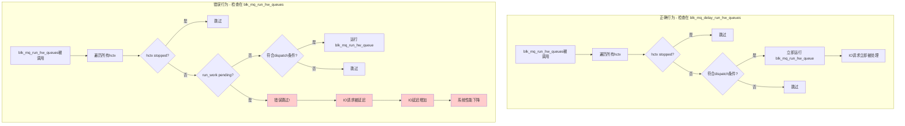

# Kernel升级IO劣化真正根因分析

## 问题背景

在Kernel从 `android13-5.15-2024-05_r2` 升级到 `2024-11_r3` 后，出现了严重的IO劣化问题。

**真正根因**：在apply patch时，git操作自动将 `blk_mq_delay_run_hw_queues()` 的修改错误地打到了 `blk_mq_run_hw_queues()` 函数中。

## 两个函数的作用对比

### blk_mq_run_hw_queues() - 立即运行硬件队列

**文件**: `block/blk-mq.c`  
**位置**: 第1689-1709行

```c
/**
 * blk_mq_run_hw_queues - Run all hardware queues in a request queue.
 * @q: Pointer to the request queue to run.
 * @async: If we want to run the queue asynchronously.
 */
void blk_mq_run_hw_queues(struct request_queue *q, bool async)
{
    struct blk_mq_hw_ctx *hctx, *sq_hctx;
    int i;

    sq_hctx = NULL;
    if (blk_mq_has_sqsched(q))
        sq_hctx = blk_mq_get_sq_hctx(q);
    queue_for_each_hw_ctx(q, hctx, i) {
        if (blk_mq_hctx_stopped(hctx))
            continue;
        /*
         * Dispatch from this hctx either if there's no hctx preferred
         * by IO scheduler or if it has requests that bypass the
         * scheduler.
         */
        if (!sq_hctx || sq_hctx == hctx ||
            !list_empty_careful(&hctx->dispatch))
            blk_mq_run_hw_queue(hctx, async);
    }
}
```

**作用**：
- **立即运行**所有硬件队列
- 支持同步(`async=false`)或异步(`async=true`)模式
- **高频调用**的关键路径函数

**调用场景**（高频）：
1. `blk_freeze_queue_start()` - 冻结队列时
2. `blk_mq_unquiesce_queue()` - 恢复队列时  
3. `blk_mq_requeue_work()` - 请求重新入队时
4. `bfq_finish_requeue_request()` - BFQ调度器完成请求时
5. 调试接口

### blk_mq_delay_run_hw_queues() - 延迟运行硬件队列

**文件**: `block/blk-mq.c`  
**位置**: 第1717-1745行

```c
/**
 * blk_mq_delay_run_hw_queues - Run all hardware queues asynchronously.
 * @q: Pointer to the request queue to run.
 * @msecs: Milliseconds of delay to wait before running the queues.
 */
void blk_mq_delay_run_hw_queues(struct request_queue *q, unsigned long msecs)
{
    struct blk_mq_hw_ctx *hctx, *sq_hctx;
    int i;

    sq_hctx = NULL;
    if (blk_mq_has_sqsched(q))
        sq_hctx = blk_mq_get_sq_hctx(q);
    queue_for_each_hw_ctx(q, hctx, i) {
        if (blk_mq_hctx_stopped(hctx))
            continue;
        /*
         * If there is already a run_work pending, leave the
         * pending delay untouched. Otherwise, a hctx can stall
         * if another hctx is re-delaying the other's work
         * before the work executes.
         */
        if (delayed_work_pending(&hctx->run_work))
            continue;
        /*
         * Dispatch from this hctx either if there's no hctx preferred
         * by IO scheduler or if it has requests that bypass the
         * scheduler.
         */
        if (!sq_hctx || sq_hctx == hctx ||
            !list_empty_careful(&hctx->dispatch))
            blk_mq_delay_run_hw_queue(hctx, msecs);
    }
}
```

**作用**：
- **延迟运行**所有硬件队列（等待指定的毫秒数）
- 用于资源不足时的延迟重试
- **低频调用**的辅助函数

**调用场景**（低频）：
1. `blk_mq_do_dispatch_sched()` - 当budget不足时延迟重试
2. `blk_mq_sched_dispatch_requests()` - 当dispatch失败时延迟重试

## 关键区别

| 特性 | blk_mq_run_hw_queues() | blk_mq_delay_run_hw_queues() |
|------|------------------------|------------------------------|
| **执行时机** | 立即执行 | 延迟执行（msecs后） |
| **调用频率** | **高频**（关键路径） | **低频**（资源不足时） |
| **用途** | 正常IO处理 | 资源不足时的延迟重试 |
| **是否需要pending检查** | **不需要** | **需要**（避免重复延迟） |

---

## 为什么错误地放置检查会导致严重IO劣化？

### 问题代码

**错误的代码**（将检查放在`blk_mq_run_hw_queues()`中）：
```c
void blk_mq_run_hw_queues(struct request_queue *q, bool async)
{
    // ...
    queue_for_each_hw_ctx(q, hctx, i) {
        if (blk_mq_hctx_stopped(hctx))
            continue;
        /*
         * 错误：这个检查不应该在这里！
         */
        if (delayed_work_pending(&hctx->run_work))  // ← 错误位置
            continue;
        // ...
        blk_mq_run_hw_queue(hctx, async);
    }
}
```

### 问题分析

#### 1. 跳过了需要立即处理的hctx

**正常情况**：
- `blk_mq_run_hw_queues()` 应该**立即运行**所有符合条件的硬件队列
- 不应该因为有pending的延迟工作就跳过

**错误情况**：
- 如果某个hctx有pending的`run_work`（例如之前的延迟任务还没执行）
- 该hctx就会被**错误地跳过**
- 导致IO请求无法立即dispatch

#### 2. 高频调用导致问题放大

**调用链分析**：
```
应用程序发起IO请求
    ↓
blk_mq_submit_bio()  →  blk_mq_run_hw_queues()
    ↓
如果delayed_work_pending() → 跳过该hctx
    ↓
IO请求无法立即dispatch → 等待延迟任务执行
    ↓
IO延迟显著增加
```

**问题放大**：
- `blk_mq_run_hw_queues()` 是高频调用的关键路径
- 每次调用都可能跳过某些hctx
- 在高IO压力下，问题被严重放大

#### 3. swap IO特别受影响

**swap IO场景**：
```
kswapd0发起swap IO
    ↓
blk_mq_run_hw_queues() 被调用
    ↓
如果swap IO的hctx有pending work → 被跳过
    ↓
swap IO无法立即dispatch
    ↓
kswapd0被阻塞 → 内存回收变慢
    ↓
更多进程需要swap → 更多IO请求
    ↓
恶性循环：IO压力持续升高
```

### 流程对比图



---

## 为什么这个检查在delay函数中是正确的？

### 在 blk_mq_delay_run_hw_queues() 中的作用

**原始commit的意图**（b69cdb7373f4）：
```
blk-mq: avoid extending delays of active hctx from blk_mq_delay_run_hw_queues
```

**问题场景**：
1. hctx A 调用 `blk_mq_delay_run_hw_queue(hctx_A, 10ms)`
2. 在这10ms内，hctx B 调用 `blk_mq_delay_run_hw_queues(q, 5ms)`
3. 如果不检查pending，hctx A 的延迟会被重置为5ms
4. 这可能导致hctx A 的延迟被不断延长，造成stall

**解决方案**：
- 在设置新的延迟之前，检查是否已有pending的延迟工作
- 如果有，保持原有的延迟时间不变
- 这只在**延迟执行**场景下有意义

### 为什么在立即执行函数中不需要？

**在 `blk_mq_run_hw_queues()` 中**：
- 目的是**立即运行**硬件队列
- 不涉及延迟时间的管理
- 即使有pending的延迟工作，也应该尝试立即运行
- 因为`blk_mq_run_hw_queue()`会处理好并发情况

---

## 问题影响分析

### 影响范围

| 影响点 | 严重程度 | 说明 |
|--------|----------|------|
| 所有IO请求 | **严重** | 任何时候都可能跳过hctx |
| swap IO | **极其严重** | 导致swap风暴和内存压力 |
| 高IO压力场景 | **极其严重** | 问题被严重放大 |
| 系统响应性 | **严重** | ANR激增20倍 |

### 问题严重性

**为什么问题这么严重？**

1. **关键路径被破坏**：
   - `blk_mq_run_hw_queues()` 是IO处理的关键路径
   - 每个IO请求都可能受影响

2. **高频调用**：
   - 该函数被频繁调用
   - 每次调用都可能跳过hctx
   - 累积效应非常显著

3. **条件容易满足**：
   - `delayed_work_pending()` 检查的是延迟工作是否pending
   - 在高IO压力下，很容易有pending的延迟工作
   - 导致大量hctx被跳过

4. **恶性循环**：
   ```
   IO请求被跳过 → IO积压 → 更多延迟工作pending
   → 更多hctx被跳过 → 更多IO积压 → 恶性循环
   ```

---

## 修复方案

### 正确的代码

**blk_mq_run_hw_queues()** - 不需要pending检查：
```c
void blk_mq_run_hw_queues(struct request_queue *q, bool async)
{
    struct blk_mq_hw_ctx *hctx, *sq_hctx;
    int i;

    sq_hctx = NULL;
    if (blk_mq_has_sqsched(q))
        sq_hctx = blk_mq_get_sq_hctx(q);
    queue_for_each_hw_ctx(q, hctx, i) {
        if (blk_mq_hctx_stopped(hctx))
            continue;
        // 这里不应该有 delayed_work_pending() 检查
        if (!sq_hctx || sq_hctx == hctx ||
            !list_empty_careful(&hctx->dispatch))
            blk_mq_run_hw_queue(hctx, async);
    }
}
```

**blk_mq_delay_run_hw_queues()** - 需要pending检查：
```c
void blk_mq_delay_run_hw_queues(struct request_queue *q, unsigned long msecs)
{
    struct blk_mq_hw_ctx *hctx, *sq_hctx;
    int i;

    sq_hctx = NULL;
    if (blk_mq_has_sqsched(q))
        sq_hctx = blk_mq_get_sq_hctx(q);
    queue_for_each_hw_ctx(q, hctx, i) {
        if (blk_mq_hctx_stopped(hctx))
            continue;
        /*
         * If there is already a run_work pending, leave the
         * pending delay untouched. Otherwise, a hctx can stall
         * if another hctx is re-delaying the other's work
         * before the work executes.
         */
        if (delayed_work_pending(&hctx->run_work))  // ← 只在这里需要
            continue;
        if (!sq_hctx || sq_hctx == hctx ||
            !list_empty_careful(&hctx->dispatch))
            blk_mq_delay_run_hw_queue(hctx, msecs);
    }
}
```

### 修复步骤

1. **检查当前代码**：确认`blk_mq_run_hw_queues()`是否包含错误的pending检查
2. **移除错误的检查**：从`blk_mq_run_hw_queues()`中移除`delayed_work_pending()`检查
3. **确认delay函数正确**：确保`blk_mq_delay_run_hw_queues()`中有正确的pending检查
4. **测试验证**：进行充分的IO性能测试

---

## 总结

### 根因

**git apply patch时，将原本属于 `blk_mq_delay_run_hw_queues()` 的修改错误地打到了 `blk_mq_run_hw_queues()` 函数中。**

### 为什么影响如此严重

1. **函数作用不同**：
   - `blk_mq_run_hw_queues()` - 立即运行，关键路径
   - `blk_mq_delay_run_hw_queues()` - 延迟运行，辅助函数

2. **调用频率不同**：
   - `blk_mq_run_hw_queues()` - 高频调用
   - `blk_mq_delay_run_hw_queues()` - 低频调用

3. **检查的意义不同**：
   - 在delay函数中：避免重复设置延迟，防止stall
   - 在立即执行函数中：**完全不应该存在**，会阻止正常IO处理

### 修复建议

1. **从 `blk_mq_run_hw_queues()` 中移除 `delayed_work_pending()` 检查**
2. **确保 `blk_mq_delay_run_hw_queues()` 中有正确的检查**
3. **review patch应用流程**，避免类似问题再次发生

---

## 参考

- Commit: b69cdb7373f4 - "blk-mq: avoid extending delays of active hctx from blk_mq_delay_run_hw_queues"
- 相关文档：[20-r2到r3_具体代码变化与影响分析.md](20-r2到r3_具体代码变化与影响分析.md)
