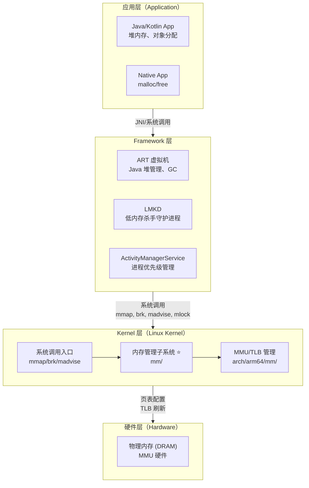
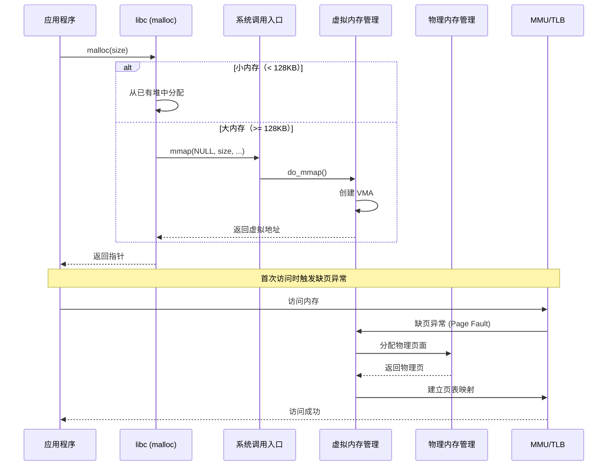
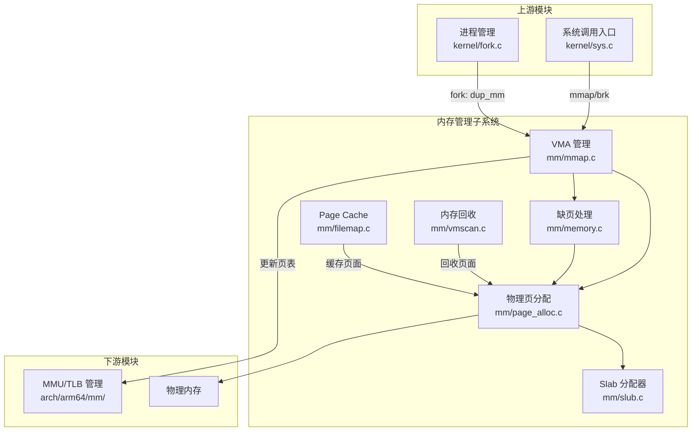
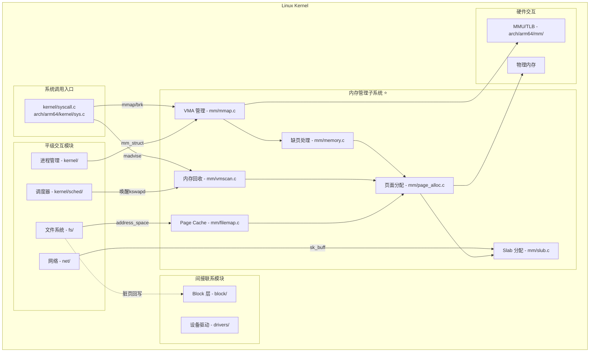
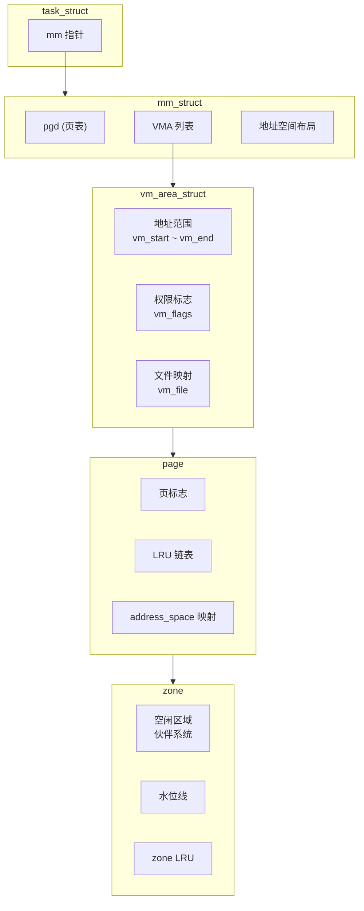

# 内存管理概述与架构设计

## 学习目标

- 从全局视角理解内存管理在整个系统架构中的位置
- 理解 应用层 → Framework → Kernel → 硬件 的完整交互链路
- 掌握内存管理子系统在 Kernel 内部的位置和上下游关系
- 了解内存管理子系统与其他 Kernel 模块的关系（平级交互、无直接联系）
- 理解内存管理子系统的核心职责和主要组件

## 一、系统整体架构视角（应用层 → Kernel → 硬件）

### 内存管理在 Android 系统架构中的位置

Android 系统采用分层架构，内存管理贯穿从应用层到硬件层的每一个层次：




### 各层内存管理职责

#### 1. 应用层内存管理

**Java/Kotlin 应用**：

- 对象在 Java 堆中分配
- 由 ART 虚拟机管理内存生命周期
- 开发者无需手动释放内存

```java
// Java 对象分配 - 在 ART 管理的堆中
Object obj = new Object();
byte[] buffer = new byte[1024 * 1024]; // 1MB

// Bitmap 分配 - Android 8.0+ 在 Native 堆
Bitmap bitmap = Bitmap.createBitmap(1920, 1080, Bitmap.Config.ARGB_8888);
```

**Native 应用**：
- 通过 malloc/free 管理内存
- 底层调用 mmap/brk 系统调用
- 开发者需要手动管理内存生命周期

```c
// Native 内存分配
void* ptr = malloc(1024 * 1024);  // 底层可能调用 mmap 或 brk
free(ptr);

// 直接系统调用
void* mem = mmap(NULL, 4096, PROT_READ | PROT_WRITE,
                 MAP_PRIVATE | MAP_ANONYMOUS, -1, 0);
munmap(mem, 4096);
```

#### 2. Framework 层内存管理

**ART 虚拟机**：
- 管理 Java 堆的分配和回收
- 实现多种 GC 算法（CMS、CC）
- 控制堆大小和增长策略

```java
// ART 堆配置（通过系统属性）
// dalvik.vm.heapsize=512m        // 最大堆大小
// dalvik.vm.heapgrowthlimit=256m // 单应用堆限制
// dalvik.vm.heaptargetutilization=0.75 // 目标利用率
```

**LMKD（Low Memory Killer Daemon）**：
- 监控系统内存压力
- 根据进程优先级（oom_adj）杀死进程
- 与 Kernel 的 PSI（Pressure Stall Information）交互

```c
// LMKD 通过 PSI 监控内存压力
// /proc/pressure/memory
// some avg10=0.00 avg60=0.00 avg300=0.00 total=0
// full avg10=0.00 avg60=0.00 avg300=0.00 total=0
```

**ActivityManagerService**：
- 管理进程生命周期和优先级
- 计算和设置进程的 oom_adj 值
- 与 LMKD 协作进行内存管理

#### 3. Kernel 层内存管理

Kernel 层是内存管理的核心，负责：
- 虚拟内存管理（地址空间、页表）
- 物理内存管理（页面分配、回收）
- 内存映射（mmap、文件映射）
- 内存回收（LRU、kswapd）

```c
// 内存管理相关系统调用
SYSCALL_DEFINE6(mmap, ...)     // 内存映射
SYSCALL_DEFINE1(brk, ...)      // 堆扩展
SYSCALL_DEFINE3(madvise, ...)  // 内存建议
SYSCALL_DEFINE2(mlock, ...)    // 锁定内存
```

#### 4. 硬件层

- **MMU（Memory Management Unit）**：负责虚拟地址到物理地址的转换
- **TLB（Translation Lookaside Buffer）**：页表缓存，加速地址转换
- **DRAM**：物理内存存储

### Framework → Kernel 的完整交互链路

以 `malloc` 分配内存为例，展示完整的交互路径：



### Framework 层如何通过系统调用与 Kernel 交互

#### 1. 内存分配类系统调用

| 系统调用 | 功能 | Framework 使用场景 |
|---------|------|-------------------|
| `mmap()` | 创建内存映射 | 大内存分配、文件映射、共享内存 |
| `munmap()` | 解除内存映射 | 释放 mmap 分配的内存 |
| `brk()` | 调整堆边界 | 小内存分配（通过 malloc） |
| `mremap()` | 调整映射大小 | 动态调整内存区域 |

```c
// mmap 系统调用定义
// mm/mmap.c
SYSCALL_DEFINE6(mmap, unsigned long, addr, unsigned long, len,
                unsigned long, prot, unsigned long, flags,
                unsigned long, fd, unsigned long, off)
{
    return ksys_mmap_pgoff(addr, len, prot, flags, fd, off >> PAGE_SHIFT);
}

// 核心实现
unsigned long do_mmap(struct file *file, unsigned long addr,
                      unsigned long len, unsigned long prot,
                      unsigned long flags, unsigned long pgoff,
                      unsigned long *populate, struct list_head *uf)
{
    // 1. 参数检查和权限验证
    // 2. 查找合适的虚拟地址空间
    // 3. 创建 VMA（vm_area_struct）
    // 4. 如果是文件映射，关联 address_space
    // 5. 返回映射的起始地址
}
```

#### 2. 内存控制类系统调用

| 系统调用 | 功能 | Framework 使用场景 |
|---------|------|-------------------|
| `madvise()` | 提供内存使用建议 | 优化内存访问模式 |
| `mlock()` | 锁定内存页 | 防止关键数据被换出 |
| `mprotect()` | 修改内存保护属性 | 更改读/写/执行权限 |

```c
// madvise 常用建议
MADV_DONTNEED    // 不再需要，可以丢弃
MADV_WILLNEED    // 即将访问，预读取
MADV_FREE        // 可以释放（延迟释放）
MADV_COLD        // 标记为冷页（Android 特有）
MADV_PAGEOUT     // 立即换出（Android 特有）
```

#### 3. 内存查询类接口

Framework 层通过 `/proc` 文件系统查询内存信息：

```bash
# 系统内存信息
/proc/meminfo

# 进程内存映射
/proc/<pid>/maps
/proc/<pid>/smaps

# 进程内存统计
/proc/<pid>/status
/proc/<pid>/statm

# 内存压力信息（PSI）
/proc/pressure/memory
```

---

## 二、Kernel 内部架构视角

### Kernel 内部的主要子系统划分

```
┌─────────────────────────────────────────────────────────────┐
│                  Linux Kernel 内部架构                        │
│                                                              │
│  ┌──────────────┐  ┌──────────────┐  ┌──────────────┐      │
│  │ 进程管理     │  │ 内存管理 ⭐  │  │  文件系统    │      │
│  │ kernel/      │  │   mm/        │  │   fs/        │      │
│  └──────┬───────┘  └──────┬───────┘  └──────┬───────┘      │
│         │                 │                 │               │
│         │    平级交互     │    平级交互     │               │
│         ├─────────────────┼─────────────────┤               │
│         │                 │                 │               │
│  ┌──────▼───────┐  ┌──────▼───────┐  ┌──────▼───────┐      │
│  │  调度子系统  │  │  网络子系统  │  │  Block 层    │      │
│  │  kernel/     │  │   net/       │  │  block/      │      │
│  │  sched/      │  │              │  │              │      │
│  └──────────────┘  └──────────────┘  └──────────────┘      │
│                                                              │
│  ┌──────────────┐  ┌──────────────┐                        │
│  │  设备驱动    │  │  安全子系统  │                        │
│  │  drivers/    │  │  security/   │                        │
│  └──────────────┘  └──────────────┘                        │
└─────────────────────────────────────────────────────────────┘
```

### 内存管理子系统在 Kernel 中的位置

内存管理子系统是 Linux Kernel 的核心子系统之一，负责：
- 虚拟内存管理
- 物理内存管理
- 内存映射
- 内存回收
- Page Cache 管理

**源码位置**：
- `mm/` - 内存管理核心实现
- `include/linux/mm.h` - 核心数据结构定义
- `include/linux/mmzone.h` - Zone 相关定义
- `arch/arm64/mm/` - ARM64 架构相关实现

### 内存管理子系统的上下游关系



#### 上游：系统调用入口和进程管理

**系统调用入口**：

```c
// 内存相关系统调用入口
// arch/arm64/kernel/sys.c
asmlinkage long sys_mmap(unsigned long addr, unsigned long len,
                         unsigned long prot, unsigned long flags,
                         unsigned long fd, off_t off);
asmlinkage long sys_brk(unsigned long brk);
asmlinkage long sys_madvise(unsigned long start, size_t len, int behavior);
```

**进程管理与内存的交互**：

```c
// kernel/fork.c - 进程创建时复制内存描述符
static int copy_mm(unsigned long clone_flags, struct task_struct *tsk)
{
    struct mm_struct *mm, *oldmm;
    
    oldmm = current->mm;
    if (clone_flags & CLONE_VM) {
        // 线程共享地址空间
        mmget(oldmm);
        tsk->mm = oldmm;
        return 0;
    }
    
    // 进程复制地址空间（COW）
    mm = dup_mm(tsk, current->mm);
    tsk->mm = mm;
    return 0;
}
```

#### 下游：MMU/TLB 和物理内存

**页表操作**：

```c
// arch/arm64/mm/mmu.c
// 设置页表项
static void set_pte(pte_t *ptep, pte_t pte)
{
    WRITE_ONCE(*ptep, pte);
    // 确保页表更新对其他 CPU 可见
    dsb(ishst);
}

// TLB 刷新
void flush_tlb_mm(struct mm_struct *mm)
{
    // 刷新特定地址空间的 TLB
    __tlbi(aside1, ASID(mm));
    dsb(ish);
}
```

### 内存管理子系统的同级模块关系

#### 1. 与进程管理（kernel/）的关系 —— 有直接联系

**交互场景**：
- `mm_struct` 是进程描述符 `task_struct` 的重要成员
- fork 时需要复制或共享内存描述符
- 进程退出时需要释放内存资源

```c
// include/linux/sched.h
struct task_struct {
    // ...
    struct mm_struct *mm;        // 用户空间内存描述符
    struct mm_struct *active_mm; // 内核线程借用的地址空间
    // ...
};

// kernel/exit.c - 进程退出时释放内存
static void exit_mm(void)
{
    struct mm_struct *mm = current->mm;
    
    mm_release(current, mm);
    
    if (mm) {
        // 减少引用计数，可能触发释放
        mmput(mm);
    }
}
```

**关系图**：
```
进程管理（kernel/）
      │
      │ task_struct->mm
      ▼
内存管理（mm/）
      │
      ├── mm_struct（内存描述符）
      ├── vm_area_struct（虚拟内存区域）
      └── 页表管理
```

#### 2. 与文件系统（fs/）的关系 —— 有直接联系

**交互场景**：
- Page Cache 缓存文件数据
- mmap 文件映射
- 脏页回写

```c
// mm/filemap.c - Page Cache 核心操作

// 从 Page Cache 读取页面
struct page *find_get_page(struct address_space *mapping, pgoff_t offset)
{
    return pagecache_get_page(mapping, offset, 0, 0);
}

// 添加页面到 Page Cache
int add_to_page_cache_lru(struct page *page, struct address_space *mapping,
                          pgoff_t offset, gfp_t gfp_mask)
{
    // 将页面添加到文件的地址空间
    // 同时加入 LRU 链表
}
```

**关系图**：
```
内存管理（mm/）
      │
      ├── Page Cache (mm/filemap.c)
      │         │
      │         │ address_space
      │         ▼
      │   文件系统（fs/）
      │         │
      │         │ 脏页回写
      │         ▼
      └── Block 层（block/）
```

#### 3. 与调度子系统（kernel/sched/）的关系 —— 有直接联系

**交互场景**：
- 内存分配失败时进程可能睡眠等待
- kswapd 是内核线程，受调度器管理
- 内存压力影响进程调度

```c
// mm/vmscan.c - kswapd 内核线程
static int kswapd(void *p)
{
    while (!kthread_should_stop()) {
        // 等待内存压力事件
        wait_event_interruptible(kswapd_wait, ...);
        
        // 回收内存
        balance_pgdat(pgdat, order, highest_zoneidx);
    }
}

// 内存分配时可能触发直接回收
// mm/page_alloc.c
struct page *__alloc_pages(gfp_t gfp, unsigned int order, int preferred_nid)
{
    // 快速路径分配失败
    // ...
    
    // 慢速路径：可能触发直接回收和等待
    return __alloc_pages_slowpath(gfp, order, &ac);
}
```

#### 4. 与 Block 层（block/）的关系 —— 间接联系

**交互场景**：
- swap 分区的读写
- 脏页回写到块设备
- 内存管理不直接调用 Block 层，通过文件系统

```
内存管理 ─────────────────────── Block 层
    │                               │
    │ 无直接调用关系                 │
    │                               │
    └──► 文件系统 ──► submit_bio ──► Block 层
    └──► swap 子系统 ──► submit_bio ──► Block 层
```

#### 5. 与网络子系统（net/）的关系 —— 有直接联系

**交互场景**：
- 网络缓冲区（sk_buff）的内存分配
- 零拷贝（zero-copy）机制

```c
// net/core/skbuff.c
struct sk_buff *__alloc_skb(unsigned int size, gfp_t gfp_mask, ...)
{
    // 从 slab 分配 sk_buff 结构
    skb = kmem_cache_alloc_node(skbuff_head_cache, gfp_mask, node);
    
    // 分配数据区
    data = kmalloc_reserve(size, gfp_mask, node, &pfmemalloc);
}
```

### Kernel 内部模块关系总图



**图例说明**：
- **蓝色背景**：内存管理子系统（本系列重点）
- **实线箭头**：直接调用关系
- **虚线箭头**：间接关系

---

## 三、内存管理子系统内部架构

### 内存管理子系统的核心职责

1. **虚拟内存管理**
   - 管理进程的虚拟地址空间
   - VMA（虚拟内存区域）管理
   - 页表维护

2. **物理内存管理**
   - 页面分配和释放（伙伴系统）
   - 小对象分配（Slab/Slub）
   - 内存区域（Zone）管理

3. **内存映射**
   - 文件映射
   - 匿名映射
   - 共享内存

4. **内存回收**
   - LRU 页面管理
   - kswapd 后台回收
   - 直接回收
   - swap 交换

5. **缺页处理**
   - 按需分页（demand paging）
   - 写时复制（COW）
   - 页面换入换出

### 内存管理子系统的主要组件

```
┌─────────────────────────────────────────────────────────────┐
│                 内存管理子系统内部架构                        │
│                                                              │
│  ┌──────────────────────────────────────────────────────┐  │
│  │                 虚拟内存管理                          │  │
│  │  mm/mmap.c                                           │  │
│  │  ├── do_mmap() - 创建内存映射                        │  │
│  │  ├── do_munmap() - 解除内存映射                      │  │
│  │  └── find_vma() - 查找 VMA                           │  │
│  └──────────────────────────────────────────────────────┘  │
│                           │                                 │
│  ┌──────────────────────────────────────────────────────┐  │
│  │                 缺页异常处理                          │  │
│  │  mm/memory.c                                         │  │
│  │  ├── handle_mm_fault() - 缺页处理入口                │  │
│  │  ├── do_anonymous_page() - 匿名页处理                │  │
│  │  └── do_cow_fault() - COW 处理                       │  │
│  └──────────────────────────────────────────────────────┘  │
│                           │                                 │
│  ┌──────────────────────────────────────────────────────┐  │
│  │                 物理内存管理                          │  │
│  │  mm/page_alloc.c                                     │  │
│  │  ├── __alloc_pages() - 页面分配入口                  │  │
│  │  ├── free_pages() - 页面释放                         │  │
│  │  └── 伙伴系统实现                                    │  │
│  └──────────────────────────────────────────────────────┘  │
│                           │                                 │
│  ┌──────────────────────────────────────────────────────┐  │
│  │                 Slab 分配器                           │  │
│  │  mm/slub.c                                           │  │
│  │  ├── kmalloc() - 通用小对象分配                      │  │
│  │  ├── kmem_cache_alloc() - 对象缓存分配               │  │
│  │  └── kfree() - 释放                                  │  │
│  └──────────────────────────────────────────────────────┘  │
│                           │                                 │
│  ┌──────────────────────────────────────────────────────┐  │
│  │                 内存回收                              │  │
│  │  mm/vmscan.c                                         │  │
│  │  ├── kswapd() - 后台回收线程                         │  │
│  │  ├── try_to_free_pages() - 直接回收                  │  │
│  │  └── shrink_lruvec() - LRU 链表收缩                  │  │
│  └──────────────────────────────────────────────────────┘  │
│                           │                                 │
│  ┌──────────────────────────────────────────────────────┐  │
│  │                 Page Cache                            │  │
│  │  mm/filemap.c                                        │  │
│  │  ├── find_get_page() - 查找缓存页                    │  │
│  │  ├── add_to_page_cache() - 添加缓存页                │  │
│  │  └── filemap_write_and_wait() - 回写等待             │  │
│  └──────────────────────────────────────────────────────┘  │
└─────────────────────────────────────────────────────────────┘
```

### 关键数据结构概览

#### 1. struct mm_struct

**作用**：内存描述符，描述进程的整个地址空间

```c
// include/linux/mm_types.h
struct mm_struct {
    // VMA 管理
    struct maple_tree mm_mt;           // VMA 的 Maple Tree（6.1+）
    struct vm_area_struct *mmap;       // VMA 链表（旧版本）
    
    // 页表
    pgd_t *pgd;                        // 页全局目录
    
    // 引用计数
    atomic_t mm_users;                 // 用户空间引用
    atomic_t mm_count;                 // 内核引用
    
    // 地址空间布局
    unsigned long start_code, end_code;   // 代码段
    unsigned long start_data, end_data;   // 数据段
    unsigned long start_brk, brk;         // 堆
    unsigned long start_stack;            // 栈
    unsigned long mmap_base;              // mmap 区域基址
    
    // 统计信息
    unsigned long total_vm;            // 总虚拟内存页数
    unsigned long locked_vm;           // 锁定页数
    unsigned long data_vm;             // 数据段页数
    unsigned long exec_vm;             // 可执行段页数
    unsigned long stack_vm;            // 栈页数
    
    // 锁
    spinlock_t page_table_lock;        // 页表锁
    struct rw_semaphore mmap_lock;     // mmap 锁
};
```

#### 2. struct vm_area_struct

**作用**：虚拟内存区域，描述一段连续的虚拟地址空间

```c
// include/linux/mm_types.h
struct vm_area_struct {
    // 地址范围
    unsigned long vm_start;            // 起始地址
    unsigned long vm_end;              // 结束地址
    
    // 链接
    struct mm_struct *vm_mm;           // 所属 mm_struct
    struct vm_area_struct *vm_next;    // 链表下一个
    struct vm_area_struct *vm_prev;    // 链表上一个
    
    // 权限和标志
    pgprot_t vm_page_prot;             // 页保护属性
    unsigned long vm_flags;            // 标志（VM_READ/WRITE/EXEC等）
    
    // 文件映射
    struct file *vm_file;              // 映射的文件
    unsigned long vm_pgoff;            // 文件偏移（页为单位）
    
    // 操作函数
    const struct vm_operations_struct *vm_ops;
};
```

#### 3. struct page

**作用**：页描述符，描述一个物理页面

```c
// include/linux/mm_types.h
struct page {
    unsigned long flags;               // 页标志（PG_locked, PG_dirty等）
    
    union {
        struct {
            // LRU 链表
            struct list_head lru;
            // 映射信息
            struct address_space *mapping;
            pgoff_t index;
            unsigned long private;
        };
        // Slab 相关
        struct {
            struct kmem_cache *slab_cache;
            void *freelist;
        };
    };
    
    // 引用计数
    atomic_t _refcount;
    atomic_t _mapcount;                // 被多少 PTE 映射
};
```

#### 4. struct zone

**作用**：内存区域，管理一组具有相似属性的物理页面

```c
// include/linux/mmzone.h
struct zone {
    // 名称和类型
    const char *name;
    
    // 水位线
    unsigned long _watermark[NR_WMARK];  // min, low, high
    
    // 空闲页面
    struct free_area free_area[MAX_ORDER];  // 伙伴系统
    
    // 统计
    atomic_long_t vm_stat[NR_VM_ZONE_STAT_ITEMS];
    
    // LRU 链表
    struct lruvec lruvec;
    
    // 页面总数
    unsigned long spanned_pages;       // 跨越的总页数
    unsigned long present_pages;       // 实际存在的页数
};
```

#### 数据结构关系图




---

## 总结

### 核心要点

1. **内存管理子系统的位置**：
   - 位于系统调用入口和硬件之间
   - 是 Kernel 的核心子系统之一
   - 贯穿应用层到硬件层的每一层

2. **上下游关系**：
   - **上游**：系统调用入口（mmap/brk/madvise）、进程管理（fork 复制 mm）
   - **下游**：MMU/TLB 硬件、物理内存

3. **同级模块关系**：
   - **有直接联系**：进程管理（mm_struct）、文件系统（Page Cache）、调度器（kswapd）、网络（sk_buff）
   - **间接联系**：Block 层（通过文件系统和 swap）

4. **Android 特有机制**：
   - LMKD 监控内存压力
   - ART 管理 Java 堆
   - ActivityManagerService 管理进程优先级

5. **内存管理子系统的核心组件**：
   - 虚拟内存管理（mm/mmap.c）
   - 物理内存管理（mm/page_alloc.c）
   - Slab 分配器（mm/slub.c）
   - 内存回收（mm/vmscan.c）
   - Page Cache（mm/filemap.c）

### 关键概念

- **mm_struct**：内存描述符，描述进程的整个地址空间
- **vm_area_struct**：虚拟内存区域，描述一段连续的虚拟地址空间
- **page**：页描述符，描述一个物理页面
- **zone**：内存区域，管理一组物理页面

### 后续学习

- [内存管理核心数据结构](02-内存管理核心数据结构.md) - 深入理解核心数据结构
- [内存操作流程总览](03-内存操作流程总览.md) - 理解分配、映射、回收的完整路径
- [物理内存组织与页面管理](04-物理内存组织与页面管理.md) - 深入理解物理内存管理

## 参考资源

- 内核文档：`Documentation/mm/`
- 内核源码：
  - `mm/` - 内存管理核心实现
  - `include/linux/mm.h` - 核心数据结构
  - `arch/arm64/mm/` - ARM64 架构相关
- 相关文章：
  - `../process/02-进程核心数据结构.md` - 进程与内存的关系
  - `../syscalls/06-内存管理类系统调用.md` - 内存相关系统调用

## 更新记录

- 2026-01-28：初始创建，包含内存管理概述和三层递进架构设计
