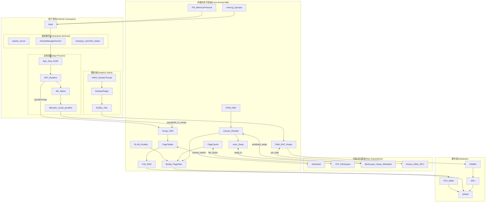

# Android 内存系统全景与分层架构

## 学习目标

- 建立 Android 设备上内存系统的全局视图
- 理解三条关键链路：分配/映射、回收/治理、图形/共享
- 掌握内存子系统与 FS、Block、Scheduler、Drivers 的平级交互
- 为后续各层、各专题文章建立索引关系

## 概述

本文在 [01-内存管理概述与架构设计](01-内存管理概述与架构设计.md) 的基础上，从 **架构师视角** 给出 Android 设备上内存系统的 **全景图** 和 **读图说明**，并明确 **三条关键链路** 与 **平级模块的业务往来**，便于后续按“应用进程 → Framework 治理 → Native 分配 → Kernel 机制 → 图形/共享”自顶向下学习。

---

## 一、整体架构视图

下图按 **用户空间（Android Userspace）→ 内核内存子系统（Linux Kernel MM）→ 平级交互模块 → 硬件层** 分层，体现组件与数据流。




---

## 二、核心组件简介

在深入三条链路之前，先对架构图中的几个核心组件做简要介绍，便于理解后续内容。

### 2.1 VMA（Virtual Memory Area，虚拟内存区域）

VMA 是进程地址空间的基本管理单元，描述一段连续的虚拟地址区域。每个 VMA 具有相同的权限属性（可读/可写/可执行）和映射类型（文件映射/匿名映射）。

```
进程地址空间由多个 VMA 组成：

地址
高  ┌─────────────────────────┐
    │  VMA: 栈               │ 可读写，向下增长
    ├─────────────────────────┤
    │      空闲区域           │
    ├─────────────────────────┤
    │  VMA: libc.so 代码     │ 可读可执行
    ├─────────────────────────┤
    │  VMA: 堆               │ 可读写
    ├─────────────────────────┤
    │  VMA: 代码段           │ 可读可执行
低  └─────────────────────────┘
```

**核心作用**：
- **内存管理单元**：mmap/munmap 等系统调用操作的基本对象
- **权限控制**：不同区域有不同的访问权限
- **按需分配**：缺页时根据 VMA 属性决定如何处理
- **资源跟踪**：跟踪文件映射、匿名映射等

> 详细内容参见 [09-VMA管理机制详解](09-VMA管理机制详解.md)

### 2.2 页表（Page Table）

页表是虚拟地址到物理地址转换的核心数据结构。现代系统使用多级页表（ARM64 使用 4 级），按需分配，节省内存。

```
48位虚拟地址的 4 级页表结构（ARM64，4KB 页）：

虚拟地址
┌────────┬────────┬────────┬────────┬────────────┐
│  PGD   │  PUD   │  PMD   │  PTE   │ 页内偏移   │
│ (9bit) │ (9bit) │ (9bit) │ (9bit) │  (12bit)   │
└───┬────┴───┬────┴───┬────┴───┬────┴─────┬──────┘
    │        │        │        │          │
    ▼        ▼        ▼        ▼          │
  PGD表 → PUD表 → PMD表 → PTE表 → 物理页 + 偏移 = 物理地址
```

**核心作用**：
- **地址转换**：将虚拟地址映射到物理地址
- **进程隔离**：每个进程有独立的页表，相同虚拟地址映射到不同物理地址
- **权限控制**：页表项包含读/写/执行权限位
- **按需分配**：稀疏地址空间只需少量页表

> 详细内容参见 [08-页表与地址转换](08-页表与地址转换.md)

### 2.3 TLB（Translation Lookaside Buffer，地址转换后备缓冲器）

TLB 是页表的高速缓存，存储最近使用的虚拟地址到物理地址的映射，避免每次访问都遍历多级页表。

```
地址转换流程：

             ┌──────────┐
虚拟地址 ───►│   TLB    │───► 物理地址（命中，1-2 周期）
             └────┬─────┘
                  │ 未命中
                  ▼
             ┌──────────┐
             │  页表    │───► 物理地址（数十周期）
             │  遍历    │
             └────┬─────┘
                  │ 填充 TLB
                  ▼
             ┌──────────┐
             │   TLB    │
             └──────────┘
```

**核心特性**：
- **高速缓存**：TLB 命中时地址转换只需 1-2 个 CPU 周期
- **ASID 支持**：地址空间标识符，避免进程切换时刷新整个 TLB
- **多级结构**：L1 TLB（分指令/数据）+ L2 TLB（统一）

> 详细内容参见 [08-页表与地址转换](08-页表与地址转换.md)

### 2.4 MMU（Memory Management Unit，内存管理单元）

MMU 是 CPU 中负责地址转换的硬件单元，配合页表和 TLB 完成虚拟地址到物理地址的转换。

```
MMU 在内存访问中的位置：

CPU 核心                    内存子系统
┌─────────────────────────────────────────────────────┐
│  CPU Core                                           │
│  ┌─────────┐    ┌─────────┐    ┌─────────┐         │
│  │ 执行单元 │───►│   MMU   │───►│ L1 Cache│───►...──►│ DRAM
│  │ (VA)    │    │ TLB+PTW │    │  (PA)   │         │
│  └─────────┘    └─────────┘    └─────────┘         │
└─────────────────────────────────────────────────────┘

VA = 虚拟地址，PA = 物理地址，PTW = Page Table Walker
```

**核心功能**：
- **地址转换**：将 CPU 发出的虚拟地址转换为物理地址
- **TLB 管理**：维护 TLB 缓存，处理 TLB 未命中
- **权限检查**：检查访问权限，触发缺页异常
- **缓存控制**：配合缓存属性控制内存访问行为

### 2.5 四者的协作关系

```
应用访问内存的完整流程：

1. 应用通过 mmap 申请内存
   └─► 内核创建 VMA，记录虚拟地址范围和属性

2. 应用首次访问该地址
   └─► MMU 查 TLB 未命中
       └─► MMU 遍历页表，发现 PTE 无效
           └─► 触发缺页异常

3. 内核处理缺页
   └─► 根据 VMA 属性分配物理页
       └─► 填写页表项（PTE）
           └─► 返回用户态重新执行

4. 应用再次访问该地址
   └─► MMU 查 TLB 未命中
       └─► MMU 遍历页表，获取物理地址
           └─► 填充 TLB
               └─► 访问物理内存

5. 后续访问相同地址
   └─► MMU 查 TLB 命中，直接获取物理地址（快速路径）
```

---

## 三、读图说明（面向 Android 设备）

### 3.1 主链路：分配/映射

- **路径**：App/ART/Allocator → syscall（`brk`/`mmap`）→ VMA → 页表 → TLB/MMU → DRAM
- **含义**：应用与运行时通过 `mmap`/`brk` 向内核申请虚拟地址空间；内核建立 VMA、填写页表，CPU 经 TLB/MMU 将访问落到物理内存（DRAM）。
- **延伸阅读**：[03-应用进程内存地图与指标体系](03-应用进程内存地图与指标体系.md)、[11-进程地址空间与VMA管理](11-进程地址空间与VMA管理.md)、[12-页表与TLB：从访问到缺页](12-页表与TLB：从访问到缺页.md)

### 3.2 回收链路：压力/回收/杀进程

- **路径**：Reclaim/PSI/memcg（内核）→ lmkd（用户态）→ AMS → App（trim/杀进程）
- **含义**：内核通过 vmscan、PSI、memcg 产生内存压力信号；lmkd 结合 AMS 提供的进程重要性（adj 等）做回收或杀进程决策，必要时向应用下发 trim 等回调。
- **延伸阅读**：[06-AMS与进程内存治理框架](06-AMS与进程内存治理框架.md)、[07-lmkd与低内存治理链路](07-lmkd与低内存治理链路.md)、[16-回收与压力：LRU与vmscan与compaction](16-回收与压力-LRU与vmscan与compaction.md)、[18-memcg与PSI：Android低内存信号层](18-memcg与PSI：Android低内存信号层.md)

### 3.3 图形链路：共享缓冲区

- **路径**：Gralloc HAL → DMA-BUF Heaps → IOMMU → GPU → DRAM
- **含义**：图形栈通过 Gralloc 分配图形缓冲区，底层经 DMA-BUF/ION 等与内核交互，由 IOMMU 映射给 GPU，实现跨进程共享与合成。
- **延伸阅读**：[19-DMA-BUF与共享缓冲区模型](19-DMA-BUF与共享缓冲区模型.md)、[20-Gralloc与BufferQueue的内存路径](20-Gralloc与BufferQueue的内存路径.md)、[21-图形内存问题定位框架](21-图形内存问题定位框架.md)

### 3.4 平级交互

- **文件系统（VFS/页缓存）**：PageCache 与 VFS 协同，文件映射、readahead、writeback 均与内存回收、缺页紧密相关。
- **Block 层（swap/writeback）**：Zram 作为块设备参与 swap；Reclaim 的页面回写、swap 读写都经 Block 层。
- **调度器（Scheduler）**：进程切换时页表（mm）切换、TLB 维护与调度器协同。
- **设备驱动（DMA/GPU）**：DMA-BUF 的 pin/map、GPU 显存等与驱动和 IOMMU 交互。

---

## 四、三条关键链路小结

| 链路         | 起点           | 终点   | 核心组件 |
|--------------|----------------|--------|----------|
| 分配/映射    | App/ART/Allocator | DRAM   | VMA、页表、TLB、MMU |
| 回收/治理    | Reclaim/PSI/memcg | App/杀进程 | lmkd、AMS、trim |
| 图形/共享    | Gralloc/SurfaceFlinger | GPU/DRAM | DMA-BUF、IOMMU、Gralloc HAL |

---

## 五、与后续文章的关系

- **第二章（应用进程内存）**：从“进程视角”看内存地图与指标，对应主链路中的“谁在要内存、要了多少”。
- **第三章（Framework 治理）**：AMS、lmkd、统计与可观测性，对应回收/治理链路中的策略与观测。
- **第四章（Native 分配）**：malloc/brk/mmap 与 scudo/jemalloc，对应主链路中用户态分配器与 syscall 的边界。
- **第五章（Kernel MM）**：VMA、页表、伙伴系统、SLUB、PageCache、回收、ZRAM、memcg/PSI，覆盖主链路与回收链路的内核实现。
- **第六章（图形与共享）**：DMA-BUF、Gralloc、BufferQueue、定位框架，对应图形链路的实现与排查。

---

## 总结

- **全景图** 按 Userspace → Kernel MM → 平级模块 → 硬件分层，标出主要组件与数据流。
- **三条关键链路**：分配/映射（到 DRAM）、回收/治理（到 lmkd/AMS/App）、图形/共享（到 GPU/DRAM）。
- **平级交互**：与 FS（页缓存）、Block（swap/writeback）、Scheduler（mm 切换）、Drivers（DMA/GPU）的业务往来是理解“内存系统边界”和排查问题的关键。

建议先通读 [01-内存管理概述与架构设计](01-内存管理概述与架构设计.md)，再回到本文对照总图与三条链路，然后按 [README](README.md) 中的学习路线自顶向下阅读各篇。
