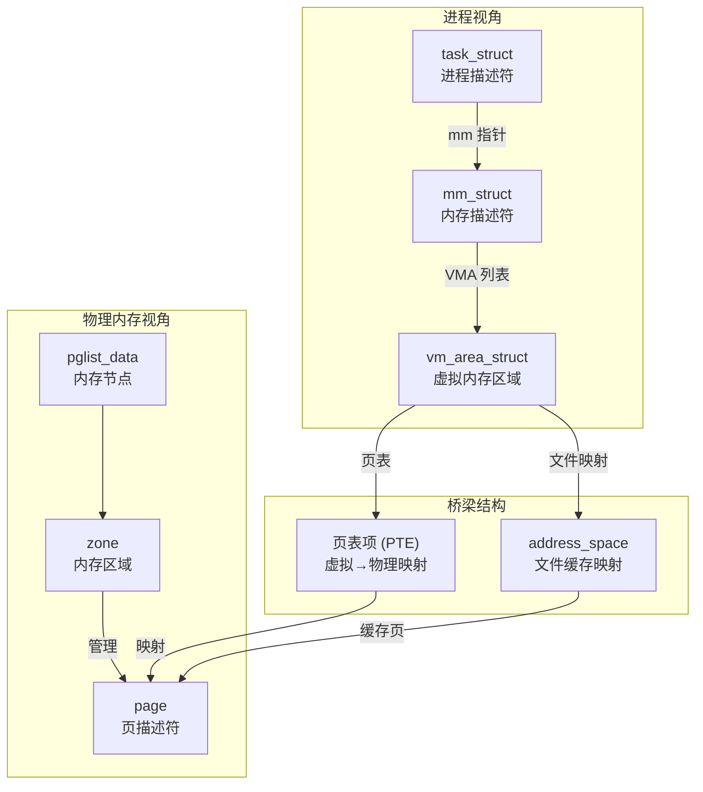
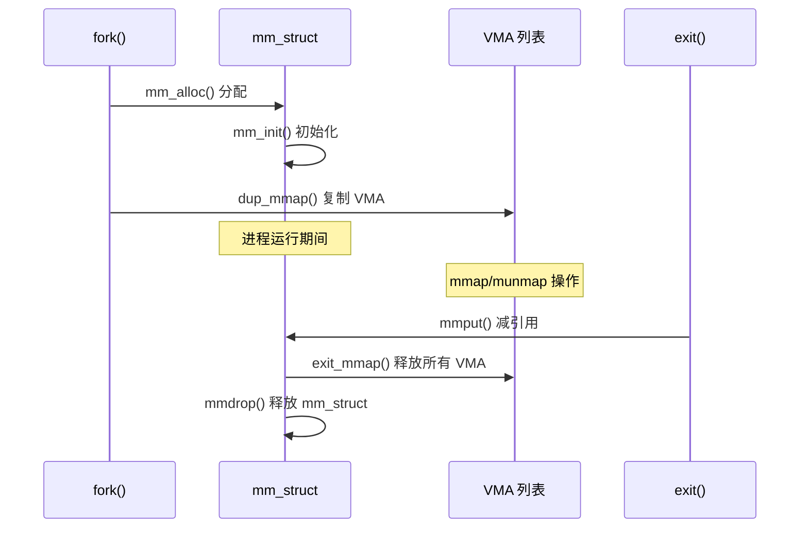
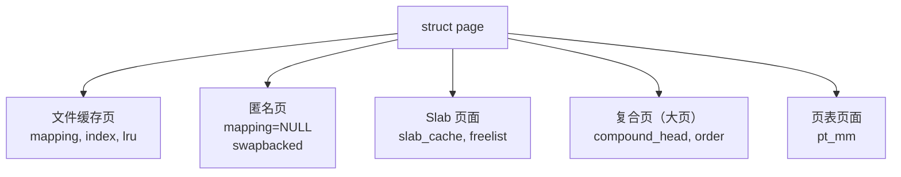
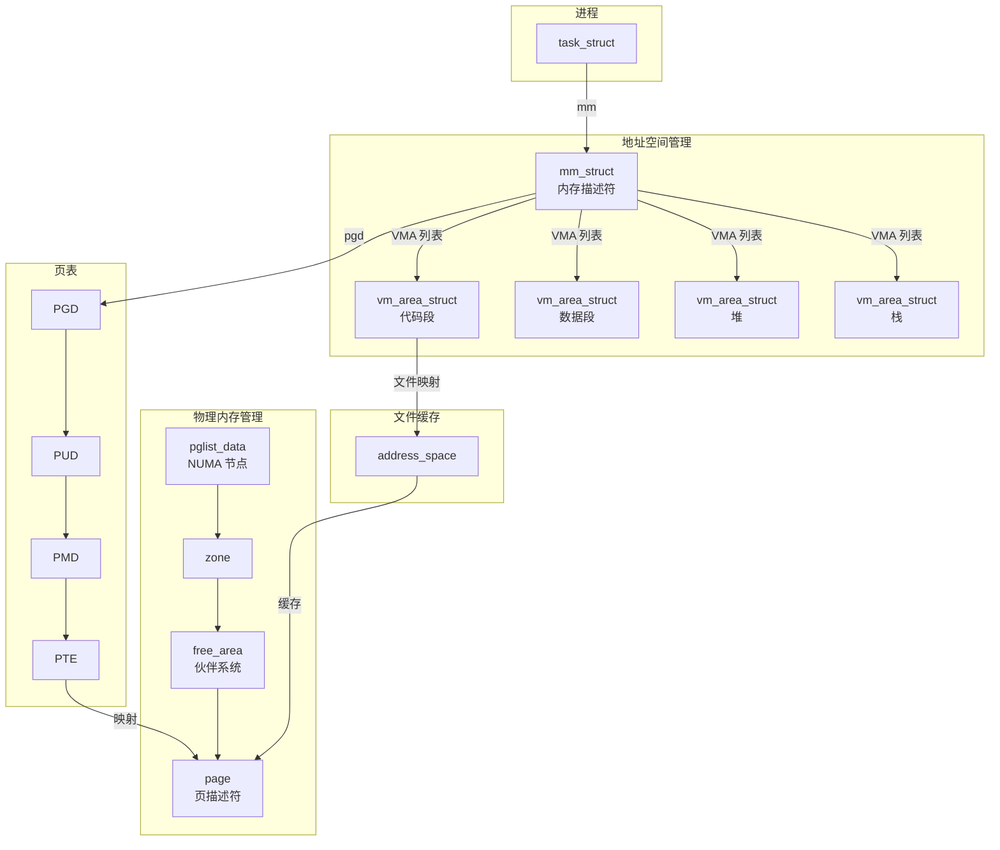

# 内存管理核心数据结构

## 学习目标

- 深入理解内存管理的核心数据结构
- 掌握 mm_struct、vm_area_struct、page、zone、pglist_data 的设计和用途
- 理解数据结构之间的关联关系
- 了解这些数据结构在内存管理各环节中的作用

## 一、数据结构总览

内存管理涉及多个层次的数据结构，从进程视角到物理内存视角：



### 数据结构层次关系

| 层次 | 数据结构 | 作用 | 定义位置 |
|-----|---------|------|---------|
| 进程层 | task_struct | 进程描述符，包含 mm 指针 | include/linux/sched.h |
| 地址空间层 | mm_struct | 进程的完整虚拟地址空间 | include/linux/mm_types.h |
| 虚拟区域层 | vm_area_struct | 一段连续的虚拟内存区域 | include/linux/mm_types.h |
| 页表层 | pgd/pud/pmd/pte | 多级页表，地址转换 | arch/arm64/include/asm/pgtable.h |
| 物理内存层 | pglist_data | NUMA 节点 | include/linux/mmzone.h |
| | zone | 内存区域（DMA、Normal等） | include/linux/mmzone.h |
| | page | 物理页描述符 | include/linux/mm_types.h |

---

## 二、mm_struct - 内存描述符

### 概述

`mm_struct` 是进程内存管理的核心数据结构，描述进程的完整虚拟地址空间。每个用户空间进程都有一个唯一的 `mm_struct`，内核线程没有独立的 `mm_struct`（mm 指针为 NULL）。

### 数据结构定义

```c
// include/linux/mm_types.h
struct mm_struct {
    /* ===== VMA 管理 ===== */
    struct {
        struct maple_tree mm_mt;              // VMA 的 Maple Tree (6.1+)
        unsigned long (*get_unmapped_area)(struct file *filp,
                        unsigned long addr, unsigned long len,
                        unsigned long pgoff, unsigned long flags);
        unsigned long mmap_base;              // mmap 区域基址
        unsigned long mmap_legacy_base;       // 传统布局基址
        
#ifdef CONFIG_HAVE_ARCH_COMPAT_MMAP_BASES
        unsigned long mmap_compat_base;       // 32位兼容基址
        unsigned long mmap_compat_legacy_base;
#endif
        
        unsigned long task_size;              // 用户空间大小
        pgd_t *pgd;                           // 页全局目录
        
        /* 引用计数 */
        atomic_t mm_users;                    // 用户空间引用（进程/线程数）
        atomic_t mm_count;                    // 内核引用
        
        /* 锁 */
        spinlock_t page_table_lock;           // 页表锁
        struct rw_semaphore mmap_lock;        // mmap 操作锁
        
        /* VMA 统计 */
        int map_count;                        // VMA 数量
        
        /* 特殊 VMA */
        struct vm_area_struct *mmap;          // VMA 链表头（旧版本）
    } __randomize_layout;

    /* ===== 地址空间布局 ===== */
    unsigned long start_code, end_code;       // 代码段范围
    unsigned long start_data, end_data;       // 数据段范围
    unsigned long start_brk, brk;             // 堆范围
    unsigned long start_stack;                // 栈起始地址
    unsigned long arg_start, arg_end;         // 参数区域
    unsigned long env_start, env_end;         // 环境变量区域

    /* ===== 内存统计 ===== */
    unsigned long total_vm;                   // 总虚拟内存页数
    unsigned long locked_vm;                  // 锁定页数
    atomic64_t pinned_vm;                     // 固定页数
    unsigned long data_vm;                    // 数据段页数
    unsigned long exec_vm;                    // 可执行段页数
    unsigned long stack_vm;                   // 栈页数

    /* ===== 架构相关 ===== */
    unsigned long flags;                      // 标志
    
    /* ===== 核心转储 ===== */
    struct core_state *core_state;            // 核心转储状态
    
    /* ===== NUMA 相关 ===== */
#ifdef CONFIG_NUMA
    struct mempolicy *mempolicy;              // NUMA 内存策略
#endif

    /* ===== OOM 相关 ===== */
    spinlock_t arg_lock;
    unsigned long saved_auxv[AT_VECTOR_SIZE]; // ELF 辅助向量
    struct user_namespace *user_ns;           // 用户命名空间
    struct file __rcu *exe_file;              // 可执行文件引用

    /* ===== 上下文标识 ===== */
#ifdef CONFIG_MMU
    atomic_long_t pgtables_bytes;             // 页表占用字节
#endif
    int numa_next_scan;
    unsigned long numa_scan_offset;
    int numa_scan_seq;
    
    /* ===== AIO 相关 ===== */
    struct mm_rss_stat rss_stat;              // RSS 统计
};
```

### 关键字段详解

#### 1. VMA 管理

```c
// 新版本使用 Maple Tree 管理 VMA（Linux 6.1+）
struct maple_tree mm_mt;

// 旧版本使用红黑树 + 链表
struct rb_root mm_rb;
struct vm_area_struct *mmap;

// 获取未映射地址的函数指针
unsigned long (*get_unmapped_area)(...)
```

**Maple Tree vs 红黑树**：

| 特性 | 红黑树 + 链表 | Maple Tree |
|-----|-------------|------------|
| 查找复杂度 | O(log n) | O(log n) |
| 内存效率 | 每个 VMA 需要额外节点 | 更紧凑 |
| 缓存友好 | 一般 | 更好 |
| 范围查询 | 需要链表辅助 | 原生支持 |

#### 2. 地址空间布局

```
进程虚拟地址空间布局（64位系统）：

高地址
┌─────────────────────────┐
│     内核空间            │ ← 用户不可访问
├─────────────────────────┤ ← task_size (0x0000_8000_0000_0000)
│     栈 (Stack)          │ ← start_stack
│         ↓               │
│                         │
│         ↑               │
│     mmap 区域           │ ← mmap_base
│         ↓               │
│                         │
│         ↑               │
│     堆 (Heap)           │ ← brk
├─────────────────────────┤ ← start_brk
│     BSS 段              │
├─────────────────────────┤
│     数据段 (Data)       │ ← start_data ~ end_data
├─────────────────────────┤
│     代码段 (Text)       │ ← start_code ~ end_code
├─────────────────────────┤
│     保留区域            │
└─────────────────────────┘ ← 0x0000_0000_0000_0000
低地址
```

#### 3. 引用计数

```c
atomic_t mm_users;  // 使用该地址空间的用户数（进程/线程）
atomic_t mm_count;  // 内核引用计数

// mm_users 减到 0 时，调用 mmput() 清理用户空间资源
// mm_count 减到 0 时，调用 mmdrop() 释放 mm_struct 本身
```

```c
// mm/mmap.c
void mmput(struct mm_struct *mm)
{
    if (atomic_dec_and_test(&mm->mm_users))
        __mmput(mm);
}

// 最终释放
static inline void mmdrop(struct mm_struct *mm)
{
    if (atomic_dec_and_test(&mm->mm_count))
        __mmdrop(mm);
}
```

### mm_struct 生命周期



---

## 三、vm_area_struct - 虚拟内存区域

### 概述

`vm_area_struct`（VMA）描述进程地址空间中一段连续的虚拟内存区域。每个 VMA 有相同的权限和属性，映射到同一个文件或匿名内存。

### 数据结构定义

```c
// include/linux/mm_types.h
struct vm_area_struct {
    /* ===== 地址范围 ===== */
    unsigned long vm_start;                   // 起始地址（包含）
    unsigned long vm_end;                     // 结束地址（不包含）

    /* ===== 所属 mm ===== */
    struct mm_struct *vm_mm;                  // 所属的内存描述符

    /* ===== 页保护属性 ===== */
    pgprot_t vm_page_prot;                    // 页表项保护位

    /* ===== VMA 标志 ===== */
    unsigned long vm_flags;                   // VM_READ, VM_WRITE, VM_EXEC 等

    /* ===== 链接结构 ===== */
    struct {
        struct rb_node rb;                    // 红黑树节点
        unsigned long rb_subtree_last;
    } shared;
    
    struct list_head anon_vma_chain;          // 匿名 VMA 链表
    struct anon_vma *anon_vma;                // 匿名 VMA 描述符

    /* ===== 操作函数 ===== */
    const struct vm_operations_struct *vm_ops;// VMA 操作函数集

    /* ===== 文件映射 ===== */
    unsigned long vm_pgoff;                   // 文件偏移（页为单位）
    struct file *vm_file;                     // 映射的文件（NULL 表示匿名映射）
    void *vm_private_data;                    // 私有数据

    /* ===== NUMA 相关 ===== */
#ifdef CONFIG_NUMA
    struct mempolicy *vm_policy;              // NUMA 内存策略
#endif

    /* ===== 用户空间 VMA ===== */
    struct vm_userfaultfd_ctx vm_userfaultfd_ctx;
};
```

### 关键字段详解

#### 1. vm_flags - VMA 标志

```c
// include/linux/mm.h
#define VM_READ         0x00000001    // 可读
#define VM_WRITE        0x00000002    // 可写
#define VM_EXEC         0x00000004    // 可执行
#define VM_SHARED       0x00000008    // 共享映射

#define VM_MAYREAD      0x00000010    // 可以设置为可读
#define VM_MAYWRITE     0x00000020    // 可以设置为可写
#define VM_MAYEXEC      0x00000040    // 可以设置为可执行
#define VM_MAYSHARE     0x00000080    // 可以设置为共享

#define VM_GROWSDOWN    0x00000100    // 向下增长（栈）
#define VM_UFFD_MISSING 0x00000200    // userfaultfd
#define VM_PFNMAP       0x00000400    // 纯 PFN 映射
#define VM_LOCKED       0x00002000    // 锁定在内存中
#define VM_IO           0x00004000    // I/O 内存映射

#define VM_SEQ_READ     0x00008000    // 顺序读取提示
#define VM_RAND_READ    0x00010000    // 随机读取提示
#define VM_DONTCOPY     0x00020000    // fork 时不复制
#define VM_DONTEXPAND   0x00040000    // 不可扩展
#define VM_ACCOUNT      0x00100000    // 记账
#define VM_NORESERVE    0x00200000    // 不预留 swap
#define VM_HUGETLB      0x00400000    // 大页
#define VM_SYNC         0x00800000    // 同步映射
```

**常见 VMA 类型的标志组合**：

| VMA 类型 | 典型标志 |
|---------|---------|
| 代码段 | VM_READ \| VM_EXEC \| VM_MAYREAD \| VM_MAYEXEC |
| 数据段 | VM_READ \| VM_WRITE \| VM_MAYREAD \| VM_MAYWRITE |
| 堆 | VM_READ \| VM_WRITE \| VM_MAYREAD \| VM_MAYWRITE |
| 栈 | VM_READ \| VM_WRITE \| VM_GROWSDOWN |
| 共享库代码 | VM_READ \| VM_EXEC \| VM_SHARED |
| 匿名 mmap | VM_READ \| VM_WRITE |

#### 2. vm_ops - VMA 操作函数

```c
// include/linux/mm.h
struct vm_operations_struct {
    // VMA 打开/关闭
    void (*open)(struct vm_area_struct *area);
    void (*close)(struct vm_area_struct *area);
    
    // 可能拆分前检查
    int (*may_split)(struct vm_area_struct *area, unsigned long addr);
    
    // 页错误处理
    vm_fault_t (*fault)(struct vm_fault *vmf);
    vm_fault_t (*huge_fault)(struct vm_fault *vmf, enum page_entry_size pe_size);
    
    // 预映射
    vm_fault_t (*map_pages)(struct vm_fault *vmf,
                           pgoff_t start_pgoff, pgoff_t end_pgoff);
    
    // 页面换出
    unsigned long (*pagesize)(struct vm_area_struct *area);
    
    // 权限检查
    int (*access)(struct vm_area_struct *vma, unsigned long addr,
                  void *buf, int len, int write);
    
    // NUMA 相关
    int (*set_policy)(struct vm_area_struct *vma, struct mempolicy *new);
    struct mempolicy *(*get_policy)(struct vm_area_struct *vma, unsigned long addr);
};
```

**不同类型映射的 vm_ops**：

```c
// 匿名映射 - 没有 vm_ops 或使用默认
// 文件映射 - 使用文件系统提供的 vm_ops

// 例如 ext4 文件映射
const struct vm_operations_struct ext4_file_vm_ops = {
    .fault          = ext4_filemap_fault,
    .map_pages      = filemap_map_pages,
    .page_mkwrite   = ext4_page_mkwrite,
};
```

### VMA 在 /proc/pid/maps 中的表示

```bash
# cat /proc/<pid>/maps
# 地址范围               权限 偏移     设备   inode   路径
5655d4a000-5655d4c000    r--p 00000000 fd:01 1234567  /bin/app
5655d4c000-5655d4e000    r-xp 00002000 fd:01 1234567  /bin/app      # 代码段
5655d4e000-5655d50000    r--p 00004000 fd:01 1234567  /bin/app
5655d50000-5655d51000    r--p 00005000 fd:01 1234567  /bin/app
5655d51000-5655d52000    rw-p 00006000 fd:01 1234567  /bin/app      # 数据段
5655d52000-5655d73000    rw-p 00000000 00:00 0        [heap]        # 堆
7f8a12000000-7f8a12021000 rw-p 00000000 00:00 0                     # 匿名映射
7ffcba5fc000-7ffcba61d000 rw-p 00000000 00:00 0        [stack]      # 栈
```

---

## 四、page - 页描述符

### 概述

`struct page` 是描述物理页面的数据结构。每个物理页面（通常 4KB）都有一个对应的 `page` 结构。这是内核中最重要也是最复杂的数据结构之一。

### 数据结构定义

```c
// include/linux/mm_types.h
struct page {
    /* ===== 页标志 ===== */
    unsigned long flags;                      // PG_locked, PG_dirty 等

    /* ===== 联合体：不同用途的页面使用不同字段 ===== */
    union {
        /* ===== 页缓存页面 ===== */
        struct {
            struct list_head lru;             // LRU 链表
            struct address_space *mapping;    // 所属的 address_space
            pgoff_t index;                    // 在 address_space 中的偏移
            unsigned long private;            // 私有数据
        };
        
        /* ===== Slab 页面 ===== */
        struct {
            struct kmem_cache *slab_cache;    // 所属的 kmem_cache
            void *freelist;                   // 空闲对象链表
            union {
                void *s_mem;                  // slab 第一个对象
                unsigned long counters;
                struct {
                    unsigned inuse:16;        // 使用中的对象数
                    unsigned objects:15;      // 总对象数
                    unsigned frozen:1;        // CPU 本地缓存中
                };
            };
        };
        
        /* ===== 复合页面（大页）===== */
        struct {
            unsigned long compound_head;      // 首页指针 + 标志
            unsigned char compound_dtor;      // 析构函数索引
            unsigned char compound_order;     // 页面阶数
            atomic_t compound_mapcount;       // 复合页映射计数
            atomic_t compound_pincount;       // 复合页固定计数
        };
        
        /* ===== 页表页面 ===== */
        struct {
            unsigned long _pt_pad_1;
            pgtable_t pmd_huge_pte;           // 大页 PTE
            unsigned long _pt_pad_2;
            struct mm_struct *pt_mm;          // 所属 mm
        };
        
        /* ===== ZONE_DEVICE 页面 ===== */
        struct {
            struct dev_pagemap *pgmap;
            void *zone_device_data;
        };
    };

    /* ===== 引用计数 ===== */
    atomic_t _refcount;                       // 引用计数
    atomic_t _mapcount;                       // 映射计数（被多少 PTE 映射）

    /* ===== 内存 cgroup ===== */
#ifdef CONFIG_MEMCG
    unsigned long memcg_data;
#endif

    /* ===== 虚拟地址 ===== */
#if defined(WANT_PAGE_VIRTUAL)
    void *virtual;                            // 虚拟地址（部分架构）
#endif
};
```

### 关键字段详解

#### 1. flags - 页面标志

```c
// include/linux/page-flags.h
enum pageflags {
    PG_locked,          // 页面被锁定，防止并发访问
    PG_referenced,      // 最近被访问过
    PG_uptodate,        // 数据是最新的
    PG_dirty,           // 页面被修改，需要回写
    PG_lru,             // 在 LRU 链表中
    PG_active,          // 在活跃 LRU 链表中
    PG_workingset,      // 工作集页面
    PG_waiters,         // 有等待者
    PG_error,           // IO 错误
    PG_slab,            // Slab 使用
    PG_owner_priv_1,    // 文件系统私有
    PG_arch_1,          // 架构特定
    PG_reserved,        // 保留页面
    PG_private,         // 有私有数据
    PG_private_2,       // 额外私有数据
    PG_writeback,       // 正在回写
    PG_head,            // 复合页首页
    PG_mappedtodisk,    // 已映射到磁盘
    PG_reclaim,         // 标记回收
    PG_swapbacked,      // 匿名页面（swap 支持）
    PG_unevictable,     // 不可驱逐
    PG_mlocked,         // mlock 锁定
    // ...
};

// 操作宏
#define PageLocked(page)       test_bit(PG_locked, &(page)->flags)
#define SetPageLocked(page)    set_bit(PG_locked, &(page)->flags)
#define ClearPageLocked(page)  clear_bit(PG_locked, &(page)->flags)
```

#### 2. 引用计数

```c
// _refcount: 引用计数
// - 0: 空闲页面
// - 正值: 被使用的页面

// _mapcount: 映射计数
// - -1: 未被任何 PTE 映射
// - 0: 被一个 PTE 映射
// - >0: 被多个 PTE 映射（共享）

// 获取引用
static inline void get_page(struct page *page)
{
    atomic_inc(&page->_refcount);
}

// 释放引用
static inline void put_page(struct page *page)
{
    if (atomic_dec_and_test(&page->_refcount))
        __put_page(page);
}
```

#### 3. LRU 链表

```c
// 页面在 LRU 链表中的位置
struct list_head lru;

// LRU 链表类型
enum lru_list {
    LRU_INACTIVE_ANON = 0,    // 不活跃匿名页
    LRU_ACTIVE_ANON   = 1,    // 活跃匿名页
    LRU_INACTIVE_FILE = 2,    // 不活跃文件页
    LRU_ACTIVE_FILE   = 3,    // 活跃文件页
    LRU_UNEVICTABLE   = 4,    // 不可驱逐页
    NR_LRU_LISTS
};
```

### page 的不同用途



---

## 五、zone - 内存区域

### 概述

`zone` 结构描述一个内存区域，将物理内存按照不同属性划分为不同的区域。每个区域有自己的空闲页面列表、LRU 链表和水位线。

### 内存区域类型

```c
// include/linux/mmzone.h
enum zone_type {
    ZONE_DMA,           // DMA 内存（0-16MB，部分架构）
    ZONE_DMA32,         // 32位 DMA（0-4GB）
    ZONE_NORMAL,        // 普通内存
    ZONE_HIGHMEM,       // 高端内存（32位系统）
    ZONE_MOVABLE,       // 可移动内存（内存热插拔）
    ZONE_DEVICE,        // 设备内存（持久内存等）
    __MAX_NR_ZONES
};
```

**不同架构的 Zone 配置**：

| 架构 | ZONE_DMA | ZONE_DMA32 | ZONE_NORMAL | ZONE_HIGHMEM |
|-----|----------|------------|-------------|--------------|
| x86-32 | 0-16MB | - | 16MB-896MB | >896MB |
| x86-64 | 0-16MB | 0-4GB | >4GB | - |
| ARM64 | - | 0-4GB | >4GB | - |

### 数据结构定义

```c
// include/linux/mmzone.h
struct zone {
    /* ===== 水位线 ===== */
    unsigned long _watermark[NR_WMARK];       // min, low, high
    unsigned long watermark_boost;            // 水位提升
    
    /* ===== 保留页面 ===== */
    long lowmem_reserve[MAX_NR_ZONES];        // 低端内存保留

    /* ===== NUMA 相关 ===== */
    int node;                                 // 所属 NUMA 节点
    struct pglist_data *zone_pgdat;           // 所属节点

    /* ===== 每 CPU 页面缓存 ===== */
    struct per_cpu_pages __percpu *per_cpu_pageset;
    int pageset_high;                         // 高水位
    int pageset_batch;                        // 批量大小

    /* ===== 伙伴系统 ===== */
    struct free_area free_area[MAX_ORDER];    // 空闲区域数组

    /* ===== Zone 标志 ===== */
    unsigned long flags;

    /* ===== 锁 ===== */
    spinlock_t lock;                          // Zone 锁

    /* ===== 统计 ===== */
    unsigned long spanned_pages;              // 跨越的总页数（含空洞）
    unsigned long present_pages;              // 实际存在的页数
    unsigned long cma_pages;                  // CMA 保留页数
    
    /* ===== Zone 名称 ===== */
    const char *name;

    /* ===== 内存压缩 ===== */
    int initialized;                          // 是否初始化
    struct compact_control compact;           // 压缩控制

    /* ===== 页面分配成本 ===== */
    unsigned long zone_start_pfn;             // 起始页帧号

    /* ===== LRU 管理 ===== */
    struct lruvec lruvec;                     // LRU 向量

    /* ===== 回收统计 ===== */
    atomic_long_t vm_stat[NR_VM_ZONE_STAT_ITEMS];
};
```

### 关键字段详解

#### 1. 水位线（Watermark）

```c
// 水位线类型
enum zone_watermarks {
    WMARK_MIN,      // 最低水位：触发直接回收
    WMARK_LOW,      // 低水位：唤醒 kswapd
    WMARK_HIGH,     // 高水位：停止 kswapd
    NR_WMARK
};

// 获取水位线值
#define min_wmark_pages(z)  (z->_watermark[WMARK_MIN])
#define low_wmark_pages(z)  (z->_watermark[WMARK_LOW])
#define high_wmark_pages(z) (z->_watermark[WMARK_HIGH])
```

**水位线作用**：

```
                        页面数量
                            ↑
    high_wmark ──────────── │ ──── kswapd 停止回收
                            │
    low_wmark  ──────────── │ ──── kswapd 开始回收
                            │
    min_wmark  ──────────── │ ──── 触发直接回收
                            │
                            └─────────────────→ 时间
```

#### 2. 伙伴系统空闲区域

```c
// 空闲区域，每个 order 一个
struct free_area free_area[MAX_ORDER];  // MAX_ORDER = 11 (0-10)

struct free_area {
    struct list_head free_list[MIGRATE_TYPES];  // 按迁移类型分链表
    unsigned long nr_free;                       // 空闲块数量
};

// 迁移类型
enum migratetype {
    MIGRATE_UNMOVABLE,      // 不可移动（内核数据）
    MIGRATE_MOVABLE,        // 可移动（用户数据）
    MIGRATE_RECLAIMABLE,    // 可回收（Page Cache）
    MIGRATE_PCPTYPES,       // Per-CPU 类型数量
    MIGRATE_HIGHATOMIC,     // 高优先级原子分配
    MIGRATE_CMA,            // CMA 区域
    MIGRATE_ISOLATE,        // 隔离区域
    MIGRATE_TYPES
};
```

#### 3. LRU 向量

```c
struct lruvec {
    struct list_head lists[NR_LRU_LISTS];   // 5 个 LRU 链表
    struct zone_reclaim_stat reclaim_stat;   // 回收统计
    atomic_long_t nonresident_age;           // 非驻留年龄
    unsigned long refaults[ANON_AND_FILE];   // 重新故障计数
    unsigned long flags;
};
```

---

## 六、pglist_data - NUMA 节点

### 概述

`pglist_data`（通常简称 `pg_data_t`）描述一个 NUMA 内存节点。在 UMA（统一内存访问）系统中，只有一个节点；在 NUMA 系统中，每个节点都有自己的 `pglist_data`。

### 数据结构定义

```c
// include/linux/mmzone.h
typedef struct pglist_data {
    /* ===== 节点 Zone ===== */
    struct zone node_zones[MAX_NR_ZONES];     // 节点的所有 zone
    struct zonelist node_zonelists[MAX_ZONELISTS]; // 分配顺序列表
    int nr_zones;                              // zone 数量

    /* ===== 节点信息 ===== */
    int node_id;                               // 节点 ID
    wait_queue_head_t kswapd_wait;            // kswapd 等待队列
    wait_queue_head_t pfmemalloc_wait;        // 内存分配等待
    struct task_struct *kswapd;               // kswapd 线程
    int kswapd_order;                         // kswapd 目标 order
    enum zone_type kswapd_highest_zoneidx;    // kswapd 最高 zone

    /* ===== 页面范围 ===== */
    unsigned long node_start_pfn;             // 节点起始页帧号
    unsigned long node_present_pages;         // 实际存在的页数
    unsigned long node_spanned_pages;         // 跨越的总页数
    
    /* ===== 节点名称 ===== */
    const char *name;

    /* ===== 锁 ===== */
    spinlock_t lru_lock;                      // LRU 锁

    /* ===== 内存回收 ===== */
    unsigned long flags;

    /* ===== 统计 ===== */
    atomic_long_t vm_stat[NR_VM_NODE_STAT_ITEMS];

    /* ===== 每 CPU 统计 ===== */
    struct per_cpu_nodestat __percpu *per_cpu_nodestats;

    /* ===== Reclaim 状态 ===== */
    unsigned long totalreserve_pages;         // 总保留页数
} pg_data_t;
```

### NUMA 节点与 Zone 关系

```
                     NUMA 节点 0                        NUMA 节点 1
            ┌─────────────────────────┐        ┌─────────────────────────┐
            │      pglist_data        │        │      pglist_data        │
            │                         │        │                         │
            │  ┌───────────────────┐  │        │  ┌───────────────────┐  │
            │  │   ZONE_DMA32      │  │        │  │   ZONE_DMA32      │  │
            │  │   0 - 4GB         │  │        │  │   16GB - 20GB     │  │
            │  └───────────────────┘  │        │  └───────────────────┘  │
            │                         │        │                         │
            │  ┌───────────────────┐  │        │  ┌───────────────────┐  │
            │  │   ZONE_NORMAL     │  │        │  │   ZONE_NORMAL     │  │
            │  │   4GB - 16GB      │  │        │  │   20GB - 32GB     │  │
            │  └───────────────────┘  │        │  └───────────────────┘  │
            └─────────────────────────┘        └─────────────────────────┘
                        │                                  │
                        └──────────┬───────────────────────┘
                                   │
                              物理内存
```

---

## 七、数据结构关系总图



---

## 总结

### 核心数据结构关系

| 数据结构 | 作用 | 与其他结构的关系 |
|---------|------|----------------|
| task_struct | 进程描述符 | 包含 mm 指针指向 mm_struct |
| mm_struct | 进程地址空间 | 包含 VMA 列表、页表指针 |
| vm_area_struct | 虚拟内存区域 | 描述一段连续虚拟地址，可能映射到文件 |
| page | 物理页描述符 | 被页表项映射，在 zone 的空闲链表中 |
| zone | 内存区域 | 包含伙伴系统空闲链表、LRU 链表 |
| pglist_data | NUMA 节点 | 包含多个 zone |

### 关键概念

- **mm_struct** 是进程虚拟地址空间的总描述符
- **vm_area_struct** 描述进程地址空间中的一个连续区域
- **page** 是物理内存管理的基本单位
- **zone** 将物理内存按属性分区管理
- **伙伴系统** 管理 zone 中的空闲页面

### 后续学习

- [内存操作流程总览](03-内存操作流程总览.md) - 理解内存分配、映射、回收的完整路径
- [物理内存组织与页面管理](04-物理内存组织与页面管理.md) - 深入理解物理内存管理
- [VMA管理机制详解](09-VMA管理机制详解.md) - 深入理解虚拟内存区域管理

## 参考资源

- 内核源码：
  - `include/linux/mm_types.h` - mm_struct、vm_area_struct、page 定义
  - `include/linux/mmzone.h` - zone、pglist_data 定义
  - `include/linux/sched.h` - task_struct 定义
- 内核文档：`Documentation/mm/`

## 更新记录

- 2026-01-28：初始创建，包含内存管理核心数据结构详解
