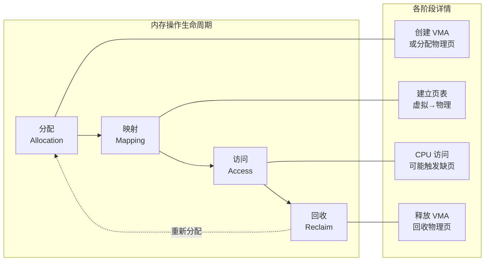
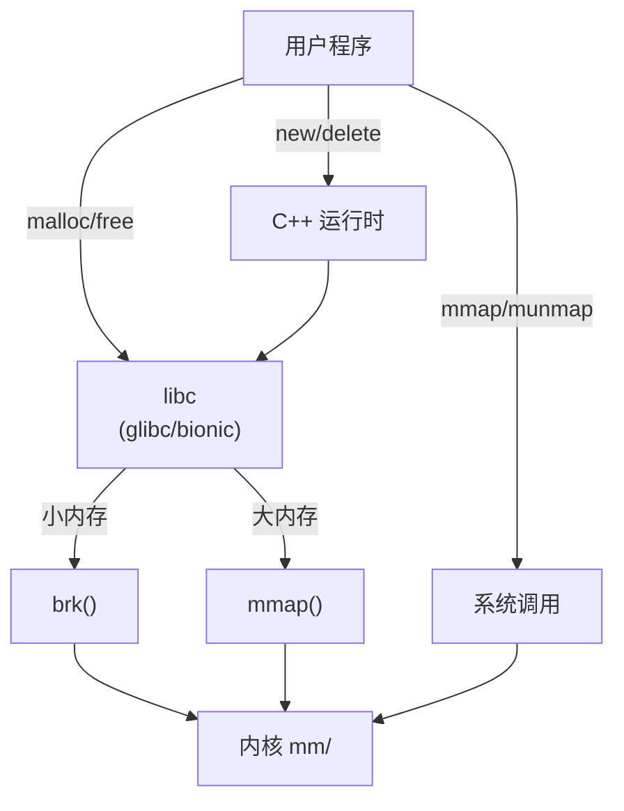
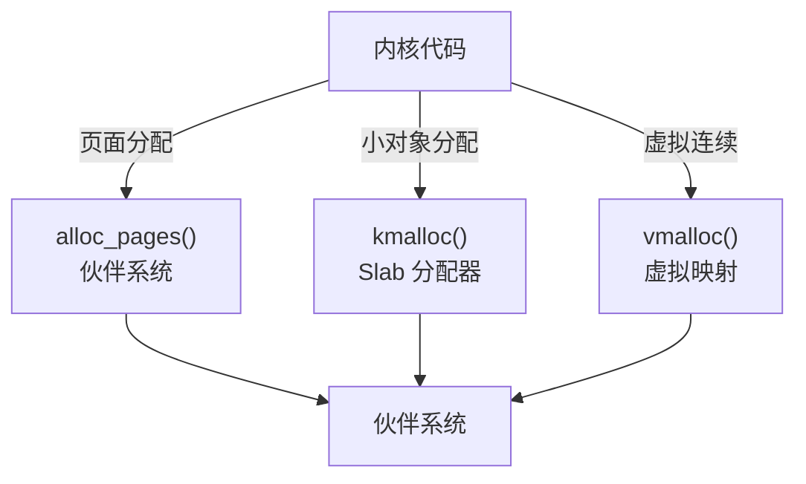
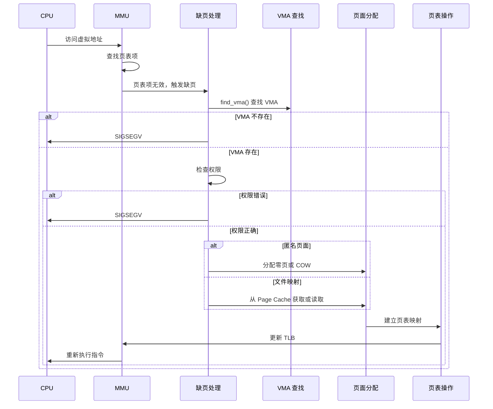
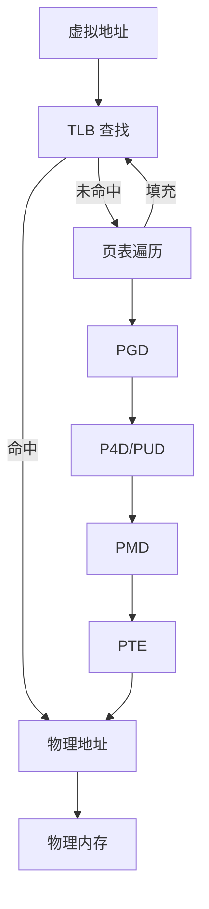
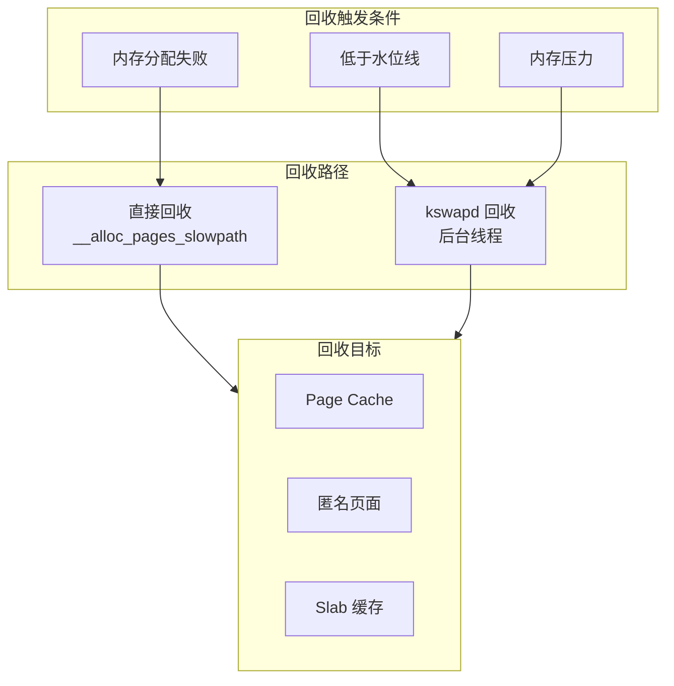
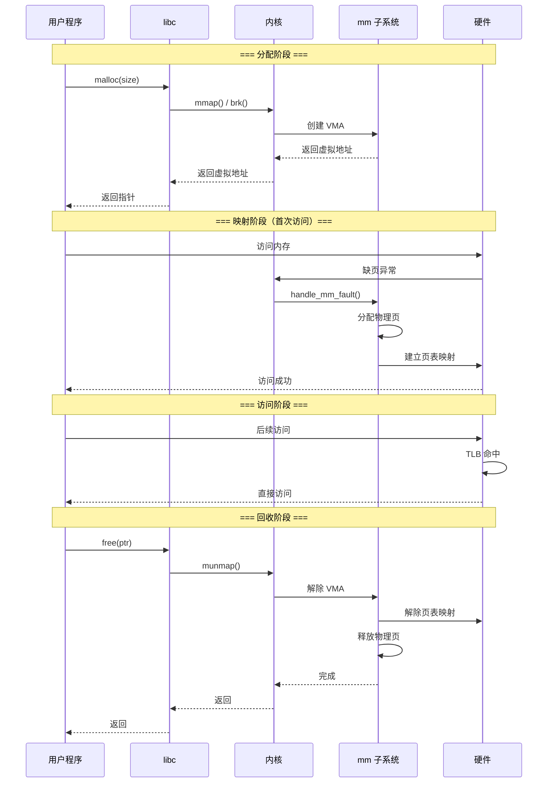

# 内存操作流程总览

## 学习目标

- 理解内存操作的完整生命周期：分配 → 映射 → 访问 → 回收
- 掌握每个阶段的关键步骤和涉及的内核函数
- 理解用户空间和内核空间内存分配的差异
- 建立内存操作的全局视图

## 一、内存操作生命周期概览



### 内存操作的两种模式

| 模式 | 触发时机 | 特点 |
|-----|---------|------|
| **按需分配** | mmap/brk 返回后，首次访问时 | 延迟分配，节省内存 |
| **预分配** | 带 MAP_POPULATE 的 mmap，或 mlock | 立即分配，减少延迟 |

---

## 二、内存分配流程

### 2.1 用户空间内存分配

用户空间内存分配主要通过三种方式：



#### 2.1.1 malloc 分配流程

```c
// 用户调用 malloc
void *ptr = malloc(size);

// libc 内部处理（以 glibc 为例）
// 1. 小内存（< MMAP_THRESHOLD，默认 128KB）
//    - 从堆中分配（如果堆空间不足，调用 brk 扩展）
// 2. 大内存（>= MMAP_THRESHOLD）
//    - 直接调用 mmap 分配

// 堆扩展
SYSCALL_DEFINE1(brk, unsigned long, brk)
{
    struct mm_struct *mm = current->mm;
    unsigned long newbrk, oldbrk, origbrk;
    
    // 获取当前堆边界
    origbrk = mm->brk;
    
    // 检查新边界是否有效
    if (brk < mm->start_brk)
        goto out;
    
    newbrk = PAGE_ALIGN(brk);
    oldbrk = PAGE_ALIGN(mm->brk);
    
    if (oldbrk == newbrk)
        goto set_brk;
    
    // 扩展堆
    if (brk > mm->brk) {
        // 检查是否超出限制
        if (!may_expand_vm(mm, VM_DATA_FLAGS, (newbrk - oldbrk) >> PAGE_SHIFT))
            goto out;
        // 扩展 VMA
        if (do_brk_flags(oldbrk, newbrk - oldbrk, 0, &uf) < 0)
            goto out;
    }
    
set_brk:
    mm->brk = brk;
    // 注意：此时只是扩展了虚拟地址空间，没有分配物理内存
    
out:
    return origbrk;
}
```

#### 2.1.2 mmap 分配流程

```c
// 用户调用 mmap
void *addr = mmap(NULL, length, PROT_READ | PROT_WRITE,
                  MAP_PRIVATE | MAP_ANONYMOUS, -1, 0);

// 内核处理
SYSCALL_DEFINE6(mmap, unsigned long, addr, unsigned long, len,
                unsigned long, prot, unsigned long, flags,
                unsigned long, fd, unsigned long, off)
{
    return ksys_mmap_pgoff(addr, len, prot, flags, fd, off >> PAGE_SHIFT);
}

unsigned long do_mmap(struct file *file, unsigned long addr,
                      unsigned long len, unsigned long prot,
                      unsigned long flags, unsigned long pgoff,
                      unsigned long *populate, struct list_head *uf)
{
    struct mm_struct *mm = current->mm;
    vm_flags_t vm_flags;
    
    // 1. 参数检查
    if (!len)
        return -EINVAL;
    
    // 2. 计算 VM 标志
    vm_flags = calc_vm_prot_bits(prot, pkey) | calc_vm_flag_bits(flags);
    
    // 3. 查找合适的虚拟地址
    addr = get_unmapped_area(file, addr, len, pgoff, flags);
    if (IS_ERR_VALUE(addr))
        return addr;
    
    // 4. 创建 VMA
    addr = mmap_region(file, addr, len, vm_flags, pgoff, uf);
    
    // 5. 如果设置了 MAP_POPULATE，预分配页面
    if (populate)
        *populate = (vm_flags & VM_LOCKED) ? len : 0;
    
    return addr;
}

// mmap_region: 实际创建 VMA
unsigned long mmap_region(struct file *file, unsigned long addr,
                          unsigned long len, vm_flags_t vm_flags,
                          unsigned long pgoff, struct list_head *uf)
{
    struct mm_struct *mm = current->mm;
    struct vm_area_struct *vma;
    
    // 1. 处理可能的重叠区域
    if (munmap_vma_range(mm, addr, len, &prev, &rb_link, &rb_parent, uf))
        return -ENOMEM;
    
    // 2. 尝试扩展现有 VMA
    vma = vma_merge(mm, prev, addr, addr + len, vm_flags, ...);
    if (vma)
        goto out;
    
    // 3. 分配新的 VMA
    vma = vm_area_alloc(mm);
    vma->vm_start = addr;
    vma->vm_end = addr + len;
    vma->vm_flags = vm_flags;
    vma->vm_page_prot = vm_get_page_prot(vm_flags);
    vma->vm_pgoff = pgoff;
    
    // 4. 文件映射：关联文件
    if (file) {
        vma->vm_file = get_file(file);
        error = call_mmap(file, vma);  // 调用文件系统的 mmap
    }
    
    // 5. 插入 VMA 到 mm
    vma_link(mm, vma, prev, rb_link, rb_parent);
    
out:
    return addr;
}
```

### 2.2 内核空间内存分配



#### 2.2.1 页面分配 (alloc_pages)

```c
// 分配 2^order 个连续物理页面
struct page *alloc_pages(gfp_t gfp_mask, unsigned int order)
{
    return __alloc_pages(gfp_mask, order, numa_node_id(), NULL);
}

// 核心实现
struct page *__alloc_pages(gfp_t gfp, unsigned int order, int preferred_nid,
                           nodemask_t *nodemask)
{
    struct page *page;
    struct alloc_context ac = { };
    
    // 1. 准备分配上下文
    if (!prepare_alloc_pages(gfp, order, preferred_nid, nodemask, &ac, &alloc_gfp, &alloc_flags))
        return NULL;
    
    // 2. 快速路径：从空闲链表分配
    page = get_page_from_freelist(alloc_gfp, order, alloc_flags, &ac);
    if (likely(page))
        goto out;
    
    // 3. 慢速路径：可能触发回收
    page = __alloc_pages_slowpath(alloc_gfp, order, &ac);
    
out:
    return page;
}

// 快速路径：遍历 zonelist 寻找空闲页
static struct page *get_page_from_freelist(gfp_t gfp_mask, unsigned int order,
                                           int alloc_flags, const struct alloc_context *ac)
{
    struct zonelist *zonelist = ac->zonelist;
    struct zone *zone;
    
    // 遍历 zonelist
    for_each_zone_zonelist_nodemask(zone, z, zonelist, ac->highest_zoneidx, ac->nodemask) {
        // 检查水位线
        if (!zone_watermark_fast(zone, order, mark, ac->highest_zoneidx, alloc_flags))
            continue;
        
        // 从伙伴系统分配
        page = rmqueue(ac->preferred_zoneref->zone, zone, order, gfp_mask, alloc_flags, ac->migratetype);
        if (page) {
            prep_new_page(page, order, gfp_mask, alloc_flags);
            return page;
        }
    }
    
    return NULL;
}
```

#### 2.2.2 kmalloc 分配

```c
// 分配小对象（最大通常为 8KB 或 32KB）
void *kmalloc(size_t size, gfp_t flags)
{
    // 根据大小选择合适的 slab cache
    if (size > KMALLOC_MAX_CACHE_SIZE)
        return kmalloc_large(size, flags);
    
    return __kmalloc(size, flags);
}

void *__kmalloc(size_t size, gfp_t flags)
{
    struct kmem_cache *s;
    
    // 获取合适大小的 cache
    s = kmalloc_slab(size, flags);
    if (unlikely(ZERO_OR_NULL_PTR(s)))
        return s;
    
    // 从 slab 分配对象
    return slab_alloc(s, flags, _RET_IP_, size);
}
```

---

## 三、内存映射流程

### 3.1 页表建立时机

页表映射可以在以下时机建立：

| 时机 | 场景 | 函数 |
|-----|------|------|
| **mmap + MAP_POPULATE** | 预分配所有页面 | mm_populate() |
| **缺页异常** | 首次访问时 | handle_mm_fault() |
| **mlock** | 锁定内存 | mlock_fixup() |
| **预读** | 文件预读 | do_page_cache_ra() |

### 3.2 缺页异常处理流程



### 3.3 缺页处理核心代码

```c
// arch/arm64/mm/fault.c
static int __kprobes do_page_fault(unsigned long far, unsigned int esr,
                                   struct pt_regs *regs)
{
    struct vm_area_struct *vma;
    struct mm_struct *mm = current->mm;
    unsigned long addr = far;
    vm_fault_t fault;
    
    // 1. 检查是否在用户空间
    if (user_mode(regs))
        flags |= FAULT_FLAG_USER;
    
    // 2. 获取 mmap 锁
    mmap_read_lock(mm);
    
    // 3. 查找 VMA
    vma = find_vma(mm, addr);
    if (!vma || vma->vm_start > addr) {
        // 地址无效
        fault = VM_FAULT_BADMAP;
        goto done;
    }
    
    // 4. 检查权限
    if (!vma_can_access(vma, esr)) {
        fault = VM_FAULT_BADACCESS;
        goto done;
    }
    
    // 5. 处理缺页
    fault = handle_mm_fault(vma, addr, flags, regs);
    
done:
    mmap_read_unlock(mm);
    return fault;
}

// mm/memory.c
vm_fault_t handle_mm_fault(struct vm_area_struct *vma, unsigned long address,
                           unsigned int flags, struct pt_regs *regs)
{
    struct mm_struct *mm = vma->vm_mm;
    vm_fault_t ret;
    
    // 处理大页
    if (is_vm_hugetlb_page(vma))
        return hugetlb_fault(mm, vma, address, flags);
    
    // 普通页面处理
    return __handle_mm_fault(vma, address, flags);
}

static vm_fault_t __handle_mm_fault(struct vm_area_struct *vma,
                                    unsigned long address, unsigned int flags)
{
    struct vm_fault vmf = {
        .vma = vma,
        .address = address & PAGE_MASK,
        .flags = flags,
        .pgoff = linear_page_index(vma, address),
    };
    struct mm_struct *mm = vma->vm_mm;
    pgd_t *pgd;
    p4d_t *p4d;
    pud_t *pud;
    pmd_t *pmd;
    
    // 遍历页表层级
    pgd = pgd_offset(mm, address);
    p4d = p4d_alloc(mm, pgd, address);
    pud = pud_alloc(mm, p4d, address);
    pmd = pmd_alloc(mm, pud, address);
    
    // 处理 PTE 级别的缺页
    return handle_pte_fault(&vmf);
}

// 处理 PTE 级别缺页
static vm_fault_t handle_pte_fault(struct vm_fault *vmf)
{
    pte_t entry;
    
    // 获取 PTE
    vmf->pte = pte_offset_map(vmf->pmd, vmf->address);
    vmf->orig_pte = *vmf->pte;
    
    // PTE 不存在：分配新页面
    if (!pte_present(vmf->orig_pte)) {
        if (vma_is_anonymous(vmf->vma))
            return do_anonymous_page(vmf);    // 匿名页
        else
            return do_fault(vmf);             // 文件映射页
    }
    
    // PTE 存在但写保护：COW
    if (vmf->flags & FAULT_FLAG_WRITE) {
        if (!pte_write(vmf->orig_pte))
            return do_wp_page(vmf);           // 写时复制
    }
    
    return 0;
}
```

### 3.4 匿名页面分配

```c
// mm/memory.c
static vm_fault_t do_anonymous_page(struct vm_fault *vmf)
{
    struct vm_area_struct *vma = vmf->vma;
    struct page *page;
    pte_t entry;
    
    // 1. 只读访问：映射零页
    if (!(vmf->flags & FAULT_FLAG_WRITE) &&
        !mm_forbids_zeropage(vma->vm_mm)) {
        entry = pte_mkspecial(pfn_pte(my_zero_pfn(vmf->address),
                                      vma->vm_page_prot));
        goto setpte;
    }
    
    // 2. 写访问：分配新页面
    page = alloc_zeroed_user_highpage_movable(vma, vmf->address);
    if (!page)
        return VM_FAULT_OOM;
    
    // 3. 设置页表项
    entry = mk_pte(page, vma->vm_page_prot);
    if (vma->vm_flags & VM_WRITE)
        entry = pte_mkwrite(pte_mkdirty(entry));
    
    // 4. 加入匿名 VMA 链表
    page_add_new_anon_rmap(page, vma, vmf->address, false);
    
setpte:
    // 5. 设置 PTE
    set_pte_at(vma->vm_mm, vmf->address, vmf->pte, entry);
    
    return 0;
}
```

### 3.5 写时复制 (COW)

```c
// mm/memory.c
static vm_fault_t do_wp_page(struct vm_fault *vmf)
{
    struct vm_area_struct *vma = vmf->vma;
    struct page *old_page, *new_page;
    pte_t entry;
    
    // 1. 获取原页面
    old_page = vm_normal_page(vma, vmf->address, vmf->orig_pte);
    
    // 2. 检查是否可以复用（单一引用）
    if (page_count(old_page) == 1) {
        // 只有一个引用，直接设置为可写
        entry = pte_mkyoung(vmf->orig_pte);
        entry = maybe_mkwrite(pte_mkdirty(entry), vma);
        goto reuse;
    }
    
    // 3. 分配新页面
    new_page = alloc_page_vma(GFP_HIGHUSER_MOVABLE, vma, vmf->address);
    if (!new_page)
        return VM_FAULT_OOM;
    
    // 4. 复制内容
    copy_user_highpage(new_page, old_page, vmf->address, vma);
    
    // 5. 更新页表
    entry = mk_pte(new_page, vma->vm_page_prot);
    entry = pte_mkwrite(pte_mkdirty(entry));
    
    set_pte_at_notify(vma->vm_mm, vmf->address, vmf->pte, entry);
    
    // 6. 释放旧页面引用
    put_page(old_page);
    
    return VM_FAULT_WRITE;
    
reuse:
    set_pte_at(vma->vm_mm, vmf->address, vmf->pte, entry);
    return VM_FAULT_WRITE;
}
```

---

## 四、内存访问流程

### 4.1 地址转换流程



### 4.2 ARM64 页表结构

```
64位虚拟地址（4KB 页面，4级页表）：

┌───────────┬─────────┬─────────┬─────────┬─────────┬────────────┐
│  未使用   │  PGD    │  PUD    │  PMD    │  PTE    │ 页内偏移   │
│ (16 bits) │(9 bits) │(9 bits) │(9 bits) │(9 bits) │ (12 bits)  │
└───────────┴─────────┴─────────┴─────────┴─────────┴────────────┘
     63-48     47-39     38-30     29-21     20-12      11-0

每级页表：512 个表项（2^9），每个表项 8 字节
页内偏移：4KB（2^12）
```

### 4.3 TLB 管理

```c
// TLB 刷新操作

// 刷新整个 TLB
static inline void flush_tlb_all(void)
{
    __tlbi(vmalle1is);  // 刷新所有 EL1 TLB
    dsb(ish);
    isb();
}

// 刷新指定地址空间的 TLB
static inline void flush_tlb_mm(struct mm_struct *mm)
{
    __tlbi(aside1is, ASID(mm));
    dsb(ish);
}

// 刷新指定地址范围的 TLB
static inline void flush_tlb_range(struct vm_area_struct *vma,
                                   unsigned long start, unsigned long end)
{
    unsigned long asid = ASID(vma->vm_mm);
    unsigned long addr;
    
    for (addr = start; addr < end; addr += PAGE_SIZE)
        __tlbi(vale1is, addr | asid);
    
    dsb(ish);
}
```

---

## 五、内存回收流程

### 5.1 内存回收触发条件



### 5.2 kswapd 工作流程

```c
// mm/vmscan.c
static int kswapd(void *p)
{
    pg_data_t *pgdat = (pg_data_t *)p;
    
    while (!kthread_should_stop()) {
        // 等待唤醒
        kswapd_try_to_sleep(pgdat, highest_zoneidx);
        
        // 检查是否需要回收
        if (pgdat_balanced(pgdat, order, highest_zoneidx))
            continue;
        
        // 执行回收
        balance_pgdat(pgdat, order, highest_zoneidx);
    }
    
    return 0;
}

// 平衡节点内存
static int balance_pgdat(pg_data_t *pgdat, int order, int highest_zoneidx)
{
    int i;
    unsigned long nr_soft_reclaimed;
    unsigned long nr_soft_scanned;
    struct scan_control sc = {
        .gfp_mask = GFP_KERNEL,
        .order = order,
        .priority = DEF_PRIORITY,
        .may_writepage = !laptop_mode,
        .may_unmap = 1,
        .may_swap = 1,
    };
    
    // 从高优先级开始，逐渐降低
    do {
        // 收缩节点
        shrink_node(pgdat, &sc);
        
        // 检查是否达到目标
        if (pgdat_balanced(pgdat, sc.order, highest_zoneidx))
            break;
        
        // 降低优先级，更激进地回收
    } while (--sc.priority >= 0);
    
    return 0;
}
```

### 5.3 LRU 页面回收

```c
// mm/vmscan.c
static unsigned long shrink_lruvec(struct lruvec *lruvec,
                                   struct scan_control *sc)
{
    unsigned long nr_to_reclaim = sc->nr_to_reclaim;
    unsigned long nr_reclaimed = 0;
    
    // 决定扫描匿名页和文件页的比例
    get_scan_count(lruvec, sc, nr);
    
    // 扫描 LRU 链表
    while (nr[LRU_INACTIVE_ANON] || nr[LRU_ACTIVE_ANON] ||
           nr[LRU_INACTIVE_FILE] || nr[LRU_ACTIVE_FILE]) {
        
        // 收缩不活跃链表
        for_each_evictable_lru(lru) {
            if (nr[lru]) {
                nr_reclaimed += shrink_list(lru, nr[lru], lruvec, sc);
            }
        }
        
        if (nr_reclaimed >= nr_to_reclaim)
            break;
    }
    
    return nr_reclaimed;
}

// 从不活跃链表回收页面
static unsigned long shrink_inactive_list(unsigned long nr_to_scan,
                                          struct lruvec *lruvec,
                                          struct scan_control *sc,
                                          enum lru_list lru)
{
    LIST_HEAD(page_list);
    unsigned long nr_reclaimed = 0;
    
    // 1. 从 LRU 尾部取出页面
    nr_taken = isolate_lru_pages(nr_to_scan, lruvec, &page_list, ...);
    
    // 2. 尝试回收页面
    nr_reclaimed = shrink_page_list(&page_list, ...);
    
    // 3. 未回收的页面放回 LRU
    putback_inactive_pages(lruvec, &page_list);
    
    return nr_reclaimed;
}

// 回收单个页面
static unsigned long shrink_page_list(struct list_head *page_list, ...)
{
    while (!list_empty(page_list)) {
        struct page *page = lru_to_page(page_list);
        
        // 1. 检查页面是否被引用
        if (page_referenced(page, ...)) {
            // 最近被访问，放回活跃链表
            goto activate_locked;
        }
        
        // 2. 匿名页面：尝试交换到 swap
        if (PageAnon(page) && !PageSwapCache(page)) {
            if (!add_to_swap(page))
                goto activate_locked;
        }
        
        // 3. 脏页：触发回写
        if (PageDirty(page)) {
            pageout(page, mapping);
            goto keep;
        }
        
        // 4. 解除映射
        try_to_unmap(page, ...);
        
        // 5. 释放页面
        if (page_ref_freeze(page, 1)) {
            __clear_page_locked(page);
            free_unref_page(page);
            nr_reclaimed++;
        }
    }
    
    return nr_reclaimed;
}
```

### 5.4 用户空间内存释放

```c
// munmap 系统调用
SYSCALL_DEFINE2(munmap, unsigned long, addr, size_t, len)
{
    return __vm_munmap(addr, len, true);
}

int __vm_munmap(unsigned long start, size_t len, bool downgrade)
{
    struct mm_struct *mm = current->mm;
    
    // 对齐地址
    len = PAGE_ALIGN(len);
    
    // 获取锁
    mmap_write_lock(mm);
    
    // 解除映射
    ret = do_munmap(mm, start, len, NULL);
    
    mmap_write_unlock(mm);
    return ret;
}

// 核心解除映射函数
int do_munmap(struct mm_struct *mm, unsigned long start, size_t len,
              struct list_head *uf)
{
    struct vm_area_struct *vma;
    
    // 1. 查找受影响的 VMA
    vma = find_vma(mm, start);
    
    // 2. 可能需要拆分 VMA
    if (start > vma->vm_start)
        split_vma(mm, vma, start, 0);
    
    if (end < vma->vm_end)
        split_vma(mm, vma, end, 1);
    
    // 3. 解除页表映射
    unmap_region(mm, vma, prev, start, end);
    
    // 4. 移除 VMA
    remove_vma_list(mm, vma);
    
    return 0;
}

// 解除页表映射
static void unmap_region(struct mm_struct *mm, struct vm_area_struct *vma,
                         struct vm_area_struct *prev,
                         unsigned long start, unsigned long end)
{
    struct vm_area_struct *next = prev ? prev->vm_next : mm->mmap;
    struct mmu_gather tlb;
    
    // 初始化 TLB 批量刷新
    tlb_gather_mmu(&tlb, mm);
    
    // 解除映射
    unmap_vmas(&tlb, vma, start, end);
    
    // 释放页表
    free_pgtables(&tlb, vma, prev ? prev->vm_end : FIRST_USER_ADDRESS,
                  next ? next->vm_start : USER_PGTABLES_CEILING);
    
    // 刷新 TLB
    tlb_finish_mmu(&tlb);
}
```

---

## 六、流程总结

### 6.1 完整生命周期时序图



### 6.2 关键函数总结

| 阶段 | 用户接口 | 内核函数 | 说明 |
|-----|---------|---------|------|
| 分配 | malloc | brk / mmap | 创建虚拟地址空间 |
| | mmap | do_mmap | 创建 VMA |
| 映射 | - | handle_mm_fault | 缺页异常处理 |
| | - | do_anonymous_page | 分配匿名页 |
| | - | do_wp_page | 写时复制 |
| 访问 | - | TLB / 页表 | 地址转换 |
| 回收 | free | munmap | 释放用户空间内存 |
| | - | kswapd | 后台页面回收 |
| | - | shrink_lruvec | LRU 回收 |

---

## 总结

### 关键概念

1. **按需分配**：虚拟地址分配和物理内存分配是分离的
2. **缺页异常**：连接虚拟地址和物理内存的桥梁
3. **写时复制**：延迟复制，提高 fork 效率
4. **LRU 回收**：根据访问频率决定回收优先级

### 后续学习

- [物理内存组织与页面管理](04-物理内存组织与页面管理.md) - 深入理解物理内存管理
- [缺页异常处理机制](10-缺页异常处理机制.md) - 详细了解缺页处理
- [页面回收框架详解](13-页面回收框架详解.md) - 深入理解内存回收

## 参考资源

- 内核源码：
  - `mm/mmap.c` - mmap 实现
  - `mm/memory.c` - 缺页处理
  - `mm/page_alloc.c` - 页面分配
  - `mm/vmscan.c` - 内存回收
- 内核文档：`Documentation/mm/`

## 更新记录

- 2026-01-28：初始创建，包含内存操作流程总览
