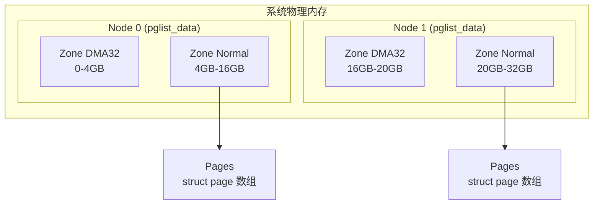

# 物理内存组织与页面管理

## 学习目标

- 理解 Linux 物理内存的层次化组织结构
- 掌握 Node、Zone、Page 的概念和关系
- 了解内存模型（Flat、Sparse）的区别
- 理解页面描述符数组和页帧号（PFN）的概念

## 一、物理内存层次结构

### 1.1 三层结构概览

Linux 使用三层结构组织物理内存：



| 层次 | 数据结构 | 作用 | 典型数量 |
|-----|---------|------|---------|
| Node | pglist_data | 表示 NUMA 节点 | 1-8 个 |
| Zone | zone | 按属性划分的内存区域 | 3-5 个/节点 |
| Page | page | 物理页面描述符 | 数百万个 |

### 1.2 NUMA vs UMA

```
UMA (Uniform Memory Access) - 统一内存访问
┌─────────┐     ┌─────────┐     ┌─────────┐
│  CPU 0  │     │  CPU 1  │     │  CPU 2  │
└────┬────┘     └────┬────┘     └────┬────┘
     │               │               │
     └───────────────┼───────────────┘
                     │
              ┌──────┴──────┐
              │   内存控制器  │
              └──────┬──────┘
                     │
         ┌───────────┴───────────┐
         │      物理内存          │
         │     (单一节点)         │
         └───────────────────────┘

NUMA (Non-Uniform Memory Access) - 非统一内存访问
┌─────────┐           ┌─────────┐
│  CPU 0  │           │  CPU 1  │
└────┬────┘           └────┬────┘
     │                      │
┌────┴────┐           ┌────┴────┐
│ 内存控制器│◄─────────►│ 内存控制器│
└────┬────┘   互联     └────┬────┘
     │                      │
┌────┴────┐           ┌────┴────┐
│ 本地内存  │           │ 本地内存  │
│ (Node 0) │           │ (Node 1) │
└─────────┘           └─────────┘
```

**访问延迟对比**：

| 访问类型 | 延迟 |
|---------|-----|
| 本地内存访问 | ~100ns |
| 远程内存访问 | ~150-300ns |

---

## 二、Node - 内存节点

### 2.1 pglist_data 结构

```c
// include/linux/mmzone.h
typedef struct pglist_data {
    /* Zone 数组 */
    struct zone node_zones[MAX_NR_ZONES];
    
    /* 分配顺序列表 */
    struct zonelist node_zonelists[MAX_ZONELISTS];
    
    int nr_zones;                    // 实际 zone 数量
    
    /* 节点信息 */
    int node_id;                     // 节点 ID
    unsigned long node_start_pfn;    // 起始页帧号
    unsigned long node_present_pages;// 实际存在的页数
    unsigned long node_spanned_pages;// 跨越的总页数（含空洞）
    
    /* kswapd 相关 */
    wait_queue_head_t kswapd_wait;
    struct task_struct *kswapd;
    int kswapd_order;
    enum zone_type kswapd_highest_zoneidx;
    
    /* 统计 */
    atomic_long_t vm_stat[NR_VM_NODE_STAT_ITEMS];
    
    /* 名称 */
    const char *name;
} pg_data_t;
```

### 2.2 全局节点数组

```c
// UMA 系统：只有一个节点
extern pg_data_t *node_data[];
#define NODE_DATA(nid)    (node_data[nid])

// 遍历所有节点
#define for_each_online_node(node)                      \
    for_each_node_state(node, N_ONLINE)

// 获取页面所属节点
static inline int page_to_nid(const struct page *page)
{
    return (page->flags >> NODES_PGSHIFT) & NODES_MASK;
}
```

### 2.3 zonelist - 分配顺序

当从某个 zone 分配失败时，按照 zonelist 的顺序尝试其他 zone：

```c
// 两种分配策略
enum {
    ZONELIST_FALLBACK,      // 备选 zonelist
    ZONELIST_NOFALLBACK,    // 不回退
    MAX_ZONELISTS
};

struct zonelist {
    struct zoneref _zonerefs[MAX_ZONES_PER_ZONELIST + 1];
};

struct zoneref {
    struct zone *zone;      // zone 指针
    int zone_idx;           // zone 索引
};
```

**分配顺序示例**（Node 0 的 ZONE_NORMAL 分配）：

```
优先级：Node 0 ZONE_NORMAL
    → Node 0 ZONE_DMA32
    → Node 1 ZONE_NORMAL（如果是 NUMA）
    → Node 1 ZONE_DMA32
```

---

## 三、Zone - 内存区域

### 3.1 Zone 类型

```c
// include/linux/mmzone.h
enum zone_type {
    #ifdef CONFIG_ZONE_DMA
    ZONE_DMA,           // DMA 内存（ISA DMA: 0-16MB）
    #endif
    #ifdef CONFIG_ZONE_DMA32
    ZONE_DMA32,         // 32位 DMA（0-4GB）
    #endif
    ZONE_NORMAL,        // 普通内存
    #ifdef CONFIG_HIGHMEM
    ZONE_HIGHMEM,       // 高端内存（32位系统特有）
    #endif
    ZONE_MOVABLE,       // 可移动内存（热插拔支持）
    #ifdef CONFIG_ZONE_DEVICE
    ZONE_DEVICE,        // 设备内存（持久内存等）
    #endif
    __MAX_NR_ZONES
};
```

### 3.2 各架构的 Zone 配置

**ARM64 (Android 常用)**：

| Zone | 范围 | 用途 |
|------|------|-----|
| ZONE_DMA32 | 0 - 4GB | 32位 DMA 设备 |
| ZONE_NORMAL | 4GB 以上 | 普通内存 |
| ZONE_MOVABLE | 配置决定 | 内存热插拔 |

**x86_64**：

| Zone | 范围 | 用途 |
|------|------|-----|
| ZONE_DMA | 0 - 16MB | ISA DMA |
| ZONE_DMA32 | 0 - 4GB | 32位 DMA |
| ZONE_NORMAL | 4GB 以上 | 普通内存 |

### 3.3 Zone 结构详解

```c
struct zone {
    /* ===== 水位线管理 ===== */
    unsigned long _watermark[NR_WMARK];  // min/low/high 水位
    unsigned long watermark_boost;        // 水位提升值
    
    /* 保留内存：防止低端 zone 被耗尽 */
    long lowmem_reserve[MAX_NR_ZONES];
    
    /* ===== 节点关联 ===== */
    int node;
    struct pglist_data *zone_pgdat;
    
    /* ===== Per-CPU 页面缓存 ===== */
    struct per_cpu_pages __percpu *per_cpu_pageset;
    int pageset_high;                     // 高水位
    int pageset_batch;                    // 批量大小
    
    /* ===== 伙伴系统 ===== */
    struct free_area free_area[MAX_ORDER];
    
    /* ===== Zone 范围 ===== */
    unsigned long zone_start_pfn;         // 起始 PFN
    unsigned long spanned_pages;          // 跨越页数（含空洞）
    unsigned long present_pages;          // 实际存在页数
    unsigned long managed_pages;          // 内核管理页数
    
    /* ===== 内存压缩 ===== */
    unsigned long compact_cached_free_pfn;
    unsigned long compact_cached_migrate_pfn[2];
    
    /* ===== 统计信息 ===== */
    atomic_long_t vm_stat[NR_VM_ZONE_STAT_ITEMS];
    
    /* ===== LRU 管理 ===== */
    struct lruvec lruvec;
    
    /* ===== 锁 ===== */
    spinlock_t lock;
    
    /* ===== Zone 名称 ===== */
    const char *name;
};
```

### 3.4 水位线机制

```c
enum zone_watermarks {
    WMARK_MIN,     // 最低水位
    WMARK_LOW,     // 低水位
    WMARK_HIGH,    // 高水位
    NR_WMARK
};
```

**水位线作用**：

```
空闲页数
    ↑
    │                    ┌─── kswapd 停止
    │  WMARK_HIGH ───────┤
    │                    │
    │                    │   正常分配
    │                    │
    │  WMARK_LOW  ───────┤
    │                    │   kswapd 唤醒
    │                    │
    │  WMARK_MIN  ───────┤
    │                    │   触发直接回收
    │                    │   高优先级分配
    │                    └─── 普通分配失败
    0────────────────────────────────────→ 时间
```

**水位线计算**：

```c
// mm/page_alloc.c
void __setup_per_zone_wmarks(void)
{
    unsigned long pages_min = min_free_kbytes >> (PAGE_SHIFT - 10);
    
    for_each_zone(zone) {
        unsigned long min, low, high;
        
        // 按比例计算
        min = (pages_min * zone->present_pages) / lowmem_pages;
        
        // 设置水位线
        zone->_watermark[WMARK_MIN] = min;
        zone->_watermark[WMARK_LOW] = min + (min >> 2);  // min * 1.25
        zone->_watermark[WMARK_HIGH] = min + (min >> 1); // min * 1.5
    }
}
```

### 3.5 lowmem_reserve

防止高端 zone 的分配请求耗尽低端 zone：

```c
// 示例：ZONE_NORMAL 对 ZONE_DMA32 的保护
// 当从 ZONE_NORMAL 分配内存回退到 ZONE_DMA32 时，
// ZONE_DMA32 必须保留一定页面给真正需要 DMA32 的请求

void setup_per_zone_lowmem_reserve(void)
{
    for_each_online_pgdat(pgdat) {
        for (i = 0; i < MAX_NR_ZONES - 1; i++) {
            zone = &pgdat->node_zones[i];
            
            for (j = i + 1; j < MAX_NR_ZONES; j++) {
                // 计算高端 zone 对低端 zone 的保留量
                zone->lowmem_reserve[j] = 
                    managed_pages / sysctl_lowmem_reserve_ratio[i];
            }
        }
    }
}
```

---

## 四、Page - 页面描述符

### 4.1 页帧号 (PFN)

每个物理页面都有一个唯一的页帧号（Page Frame Number）：

```c
// PFN 和物理地址的转换
#define PFN_PHYS(x)    ((phys_addr_t)(x) << PAGE_SHIFT)
#define PHYS_PFN(x)    ((unsigned long)((x) >> PAGE_SHIFT))

// PFN 和 struct page 的转换
#define pfn_to_page(pfn)    (mem_map + (pfn))
#define page_to_pfn(page)   ((unsigned long)((page) - mem_map))

// 示例
// 物理地址 0x100000（1MB）的 PFN = 0x100000 / 4096 = 256
```

### 4.2 内存模型

Linux 支持多种内存模型来管理 `struct page` 数组：

#### Flat Memory Model（平坦内存模型）

```c
// 简单的连续数组
struct page *mem_map;

// PFN 转换非常简单
#define pfn_to_page(pfn)    (mem_map + (pfn))
#define page_to_pfn(page)   ((page) - mem_map)
```

适用于：物理内存连续的系统

```
物理地址空间：
0                                           MAX
├──────────────────────────────────────────┤
│              物理内存（连续）              │
├──────────────────────────────────────────┤

page 数组：
mem_map[0] mem_map[1] mem_map[2] ... mem_map[N]
```

#### Sparse Memory Model（稀疏内存模型）

```c
// 分段管理，支持内存空洞和热插拔
struct mem_section {
    unsigned long section_mem_map;
    struct page_ext *page_ext;
    unsigned long pad;
};

// Section 大小通常为 128MB 或 1GB
#define SECTION_SIZE_BITS       27   // 128MB
#define PAGES_PER_SECTION       (1UL << (SECTION_SIZE_BITS - PAGE_SHIFT))

// PFN 转换需要两级索引
#define __pfn_to_section(pfn)   __nr_to_section(pfn_to_section_nr(pfn))

static inline struct page *__pfn_to_page(unsigned long pfn)
{
    struct mem_section *section = __pfn_to_section(pfn);
    return section_mem_map_addr(section) + pfn;
}
```

适用于：NUMA 系统、内存热插拔、有内存空洞的系统

```
物理地址空间：
0        128MB      256MB      384MB      512MB
├─────────┼─────────┼─────────┼─────────┼────
│ Section │  空洞   │ Section │  空洞   │ ...
│    0    │  (无)   │    2    │  (无)   │
├─────────┼─────────┼─────────┼─────────┼────

mem_section 数组：
[0] → page 数组
[1] → NULL
[2] → page 数组
[3] → NULL
...
```

### 4.3 struct page 详解

```c
struct page {
    /* ===== 页面标志 ===== */
    unsigned long flags;      // 包含 zone、node、section 信息
    
    /* ===== 用途相关字段（联合体）===== */
    union {
        /* 页缓存/匿名页 */
        struct {
            struct list_head lru;           // LRU 链表
            struct address_space *mapping;  // 文件映射
            pgoff_t index;                  // 文件偏移/swap entry
            unsigned long private;          // buffer_head 等
        };
        
        /* Slab 使用 */
        struct {
            struct kmem_cache *slab_cache;
            void *freelist;
            union {
                void *s_mem;
                unsigned long counters;
                struct {
                    unsigned inuse:16;
                    unsigned objects:15;
                    unsigned frozen:1;
                };
            };
        };
        
        /* 复合页（大页）*/
        struct {
            unsigned long compound_head;
            unsigned char compound_dtor;
            unsigned char compound_order;
            atomic_t compound_mapcount;
        };
        
        /* 页表页 */
        struct {
            unsigned long _pt_pad_1;
            pgtable_t pmd_huge_pte;
            unsigned long _pt_pad_2;
            struct mm_struct *pt_mm;
        };
    };
    
    /* ===== 引用计数 ===== */
    atomic_t _refcount;       // 引用计数
    atomic_t _mapcount;       // 映射计数
    
    /* ===== 内存 cgroup ===== */
    unsigned long memcg_data;
};
```

### 4.4 页面标志 (flags)

```c
// include/linux/page-flags.h

// 标志位定义
enum pageflags {
    PG_locked,          // 页面被锁定
    PG_referenced,      // 最近被访问
    PG_uptodate,        // 数据是最新的
    PG_dirty,           // 页面被修改
    PG_lru,             // 在 LRU 链表中
    PG_active,          // 在活跃链表中
    PG_workingset,      // 工作集页面
    PG_error,           // I/O 错误
    PG_slab,            // Slab 页面
    PG_reserved,        // 保留页面
    PG_private,         // 有私有数据
    PG_writeback,       // 正在回写
    PG_head,            // 复合页首页
    PG_swapbacked,      // 匿名页（swap 支持）
    PG_unevictable,     // 不可驱逐
    PG_mlocked,         // mlock 锁定
    // ...
};

// flags 字段布局
/*
 * |    Section   |  Node  |   Zone   |   Flags   |
 * |   (sparse)   |        |          |           |
 * | 63        54 | 53  48 | 47    44 | 43      0 |
 */

// 从 flags 提取信息
#define page_zone(page)     zone_from_flags((page)->flags)
#define page_to_nid(page)   ((page)->flags >> NODES_PGSHIFT) & NODES_MASK)
```

### 4.5 页面状态判断

```c
// 常用页面状态检查
static inline bool PageLocked(struct page *page)
{
    return test_bit(PG_locked, &page->flags);
}

static inline bool PageDirty(struct page *page)
{
    return test_bit(PG_dirty, &page->flags);
}

static inline bool PageAnon(struct page *page)
{
    return ((unsigned long)page->mapping & PAGE_MAPPING_ANON) != 0;
}

static inline bool PageSwapBacked(struct page *page)
{
    return test_bit(PG_swapbacked, &page->flags);
}

// 页面类型判断
static inline bool page_is_file_lru(struct page *page)
{
    return !PageSwapBacked(page);
}
```

---

## 五、页面数组初始化

### 5.1 启动时内存检测

```c
// 从设备树或 ACPI 获取内存信息
// arch/arm64/mm/init.c

void __init bootmem_init(void)
{
    unsigned long min, max;
    
    // 获取内存范围
    min = PFN_UP(memblock_start_of_DRAM());
    max = PFN_DOWN(memblock_end_of_DRAM());
    
    // 设置 max_pfn
    max_pfn = max;
    max_low_pfn = max_pfn;
    
    // 初始化 memblock
    arm64_memblock_init();
    
    // 初始化 sparse 内存模型
    sparse_init();
    
    // 初始化 zone
    zone_sizes_init(min, max);
}
```

### 5.2 Zone 初始化

```c
// mm/page_alloc.c
void __init free_area_init(unsigned long *max_zone_pfn)
{
    // 计算每个 zone 的页数
    unsigned long arch_zone_lowest_possible_pfn[MAX_NR_ZONES];
    unsigned long arch_zone_highest_possible_pfn[MAX_NR_ZONES];
    
    // 设置 zone 边界
    arch_zone_lowest_possible_pfn[ZONE_DMA32] = 0;
    arch_zone_highest_possible_pfn[ZONE_DMA32] = max_zone_pfn[ZONE_DMA32];
    
    arch_zone_lowest_possible_pfn[ZONE_NORMAL] = arch_zone_highest_possible_pfn[ZONE_DMA32];
    arch_zone_highest_possible_pfn[ZONE_NORMAL] = max_pfn;
    
    // 初始化每个节点
    for_each_online_node(nid) {
        free_area_init_node(nid);
    }
}

static void __init free_area_init_node(int nid)
{
    pg_data_t *pgdat = NODE_DATA(nid);
    
    // 初始化节点
    pgdat->node_id = nid;
    pgdat->node_start_pfn = start_pfn;
    
    // 计算节点页数
    calculate_node_totalpages(pgdat, start_pfn, end_pfn, zones_size, zholes_size);
    
    // 分配 page 数组内存
    alloc_node_mem_map(pgdat);
    
    // 初始化每个 zone
    free_area_init_core(pgdat);
}
```

### 5.3 Page 数组分配

```c
static void __init alloc_node_mem_map(pg_data_t *pgdat)
{
    unsigned long size;
    unsigned long start, end;
    struct page *map;
    
    // 计算需要的 page 结构数量
    start = pgdat->node_start_pfn & ~(MAX_ORDER_NR_PAGES - 1);
    end = pgdat_end_pfn(pgdat);
    end = ALIGN(end, MAX_ORDER_NR_PAGES);
    
    // 计算内存大小
    size = (end - start) * sizeof(struct page);
    
    // 分配内存（从 memblock）
    map = memblock_alloc_node(size, SMP_CACHE_BYTES, pgdat->node_id);
    
    pgdat->node_mem_map = map + start;
}
```

---

## 六、/proc 接口

### 6.1 /proc/meminfo

```bash
$ cat /proc/meminfo
MemTotal:        8167336 kB    # 总物理内存
MemFree:         2094928 kB    # 空闲内存
MemAvailable:    4827956 kB    # 可用内存（含可回收）
Buffers:          162652 kB    # 块设备缓冲
Cached:          2765440 kB    # 页缓存
SwapCached:            0 kB    # Swap 缓存
Active:          3234456 kB    # 活跃页面
Inactive:        2127820 kB    # 不活跃页面
Active(anon):    1652276 kB    # 活跃匿名页
Inactive(anon):   324560 kB    # 不活跃匿名页
Active(file):    1582180 kB    # 活跃文件页
Inactive(file):  1803260 kB    # 不活跃文件页
Unevictable:      195648 kB    # 不可驱逐页
Mlocked:           32768 kB    # mlock 锁定
SwapTotal:       2097148 kB    # Swap 总量
SwapFree:        2097148 kB    # Swap 空闲
Slab:             456232 kB    # Slab 总量
SReclaimable:     318044 kB    # 可回收 Slab
SUnreclaim:       138188 kB    # 不可回收 Slab
```

### 6.2 /proc/zoneinfo

```bash
$ cat /proc/zoneinfo
Node 0, zone    DMA32
  pages free     262144
        min      2048
        low      2560
        high     3072
        spanned  1048576
        present  1048576
        managed  1032192
        protection: (0, 3789, 3789)
  ...
  
Node 0, zone   Normal
  pages free     524288
        min      8192
        low      10240
        high     12288
        spanned  4194304
        present  4194304
        managed  4177920
        protection: (0, 0, 0)
  ...
```

### 6.3 /proc/pagetypeinfo

```bash
$ cat /proc/pagetypeinfo
Page block order: 9
Pages per block:  512

Free pages count per migrate type at order    0    1    2    3    4    5    6    7    8    9   10
Node    0, zone    DMA32, type    Unmovable    12   45  123  234   56   23   12    5    2    0    1
Node    0, zone    DMA32, type      Movable   156  234  345  456  234  123   56   23   12    5    3
Node    0, zone    DMA32, type  Reclaimable    23   34   45   56   23   12    5    2    1    0    0
...
```

---

## 总结

### 核心概念

1. **Node（节点）**：NUMA 节点，包含多个 zone
2. **Zone（区域）**：按内存属性划分，如 DMA32、Normal
3. **Page（页面）**：物理页面的描述符
4. **PFN（页帧号）**：物理页面的唯一标识
5. **Sparse Memory**：支持内存空洞和热插拔的内存模型

### 关键数据结构

| 结构 | 作用 | 关键字段 |
|-----|------|---------|
| pglist_data | NUMA 节点 | node_zones, kswapd |
| zone | 内存区域 | watermark, free_area |
| page | 页面描述符 | flags, _refcount, lru |

### 后续学习

- [伙伴系统详解](05-伙伴系统详解.md) - 深入理解页面分配机制
- [Slab/Slub分配器详解](06-Slab-Slub分配器详解.md) - 了解小对象分配

## 参考资源

- 内核源码：
  - `include/linux/mmzone.h` - zone 和 pglist_data 定义
  - `include/linux/mm_types.h` - page 定义
  - `mm/page_alloc.c` - 初始化代码
- 内核文档：`Documentation/mm/memory-model.rst`

## 更新记录

- 2026-01-28：初始创建，包含物理内存组织与页面管理详解
