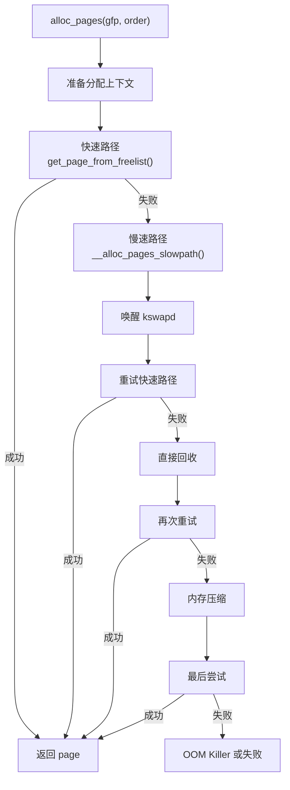

# 伙伴系统详解

## 学习目标

- 理解伙伴系统（Buddy System）的设计原理
- 掌握页面分配和释放的核心流程
- 了解迁移类型和内存碎片整理机制
- 理解 Per-CPU 页面缓存的作用

## 一、伙伴系统概述

### 1.1 设计目标

伙伴系统是 Linux 物理内存分配的核心算法，主要解决：
1. **外部碎片**：通过合并相邻空闲块减少碎片
2. **分配效率**：O(log n) 时间复杂度的分配和释放
3. **大块内存**：支持分配连续的多页内存

### 1.2 基本原理

```
伙伴系统将内存按 2 的幂次方组织：

Order 0:  1 页 (4KB)
Order 1:  2 页 (8KB)
Order 2:  4 页 (16KB)
Order 3:  8 页 (32KB)
...
Order 10: 1024 页 (4MB) - MAX_ORDER-1

每个 order 维护一个空闲链表：

Order  空闲链表
  0    [4KB] → [4KB] → [4KB] → ...
  1    [8KB] → [8KB] → ...
  2    [16KB] → [16KB] → ...
  ...
  10   [4MB] → ...
```

### 1.3 伙伴（Buddy）的定义

两个内存块是伙伴，当且仅当：
1. 大小相同（同一个 order）
2. 物理地址连续
3. 起始地址对齐到 2^(order+1) * PAGE_SIZE

```
假设 order=2 (16KB 块)，PAGE_SIZE=4KB

地址:  0    16KB   32KB   48KB   64KB   80KB   96KB
      ├──────┼──────┼──────┼──────┼──────┼──────┤
      │ 块A  │ 块B  │ 块C  │ 块D  │ 块E  │ 块F  │
      └──────┴──────┴──────┴──────┴──────┴──────┘

伙伴关系：
- A 和 B 是伙伴（合并后对齐到 32KB 边界）
- C 和 D 是伙伴
- E 和 F 是伙伴

非伙伴：
- B 和 C 不是伙伴（合并后不对齐到 32KB 边界）
```

---

## 二、数据结构

### 2.1 free_area 结构

```c
// include/linux/mmzone.h
struct free_area {
    struct list_head free_list[MIGRATE_TYPES];  // 按迁移类型分链表
    unsigned long nr_free;                       // 空闲块数量
};

// zone 中的伙伴系统
struct zone {
    // ...
    struct free_area free_area[MAX_ORDER];  // MAX_ORDER = 11 (0-10)
    // ...
};
```

### 2.2 迁移类型

```c
// include/linux/mmzone.h
enum migratetype {
    MIGRATE_UNMOVABLE,      // 不可移动（内核数据结构）
    MIGRATE_MOVABLE,        // 可移动（用户页面）
    MIGRATE_RECLAIMABLE,    // 可回收（Page Cache）
    MIGRATE_PCPTYPES,       // Per-CPU 类型边界
    MIGRATE_HIGHATOMIC = MIGRATE_PCPTYPES,  // 高优先级原子分配
#ifdef CONFIG_CMA
    MIGRATE_CMA,            // CMA 区域
#endif
#ifdef CONFIG_MEMORY_ISOLATION
    MIGRATE_ISOLATE,        // 隔离区域
#endif
    MIGRATE_TYPES
};
```

**迁移类型的作用**：

| 类型 | 用途 | 示例 |
|-----|------|-----|
| UNMOVABLE | 不能移动的页面 | 内核 slab、页表 |
| MOVABLE | 可以移动的页面 | 用户进程页面 |
| RECLAIMABLE | 可以回收的页面 | Page Cache、Slab 缓存 |
| CMA | 连续内存分配区 | DMA 缓冲区 |

### 2.3 pageblock

```c
// 页面块（pageblock）是迁移类型管理的基本单位
// 通常为 2MB（order-9，512 页）

#define pageblock_order     HUGETLB_PAGE_ORDER  // 通常为 9
#define pageblock_nr_pages  (1UL << pageblock_order)

// 获取页面的迁移类型
static inline int get_pageblock_migratetype(struct page *page)
{
    return get_pfnblock_flags_mask(page, page_to_pfn(page),
                                   MIGRATETYPE_MASK);
}
```

---

## 三、页面分配流程

### 3.1 分配入口

```c
// include/linux/gfp.h
// 分配 2^order 个连续页面
struct page *alloc_pages(gfp_t gfp_mask, unsigned int order);

// 分配单页
#define alloc_page(gfp_mask)    alloc_pages(gfp_mask, 0)

// 分配并返回虚拟地址
unsigned long __get_free_pages(gfp_t gfp_mask, unsigned int order);
#define __get_free_page(gfp_mask)   __get_free_pages(gfp_mask, 0)

// 分配并清零
unsigned long get_zeroed_page(gfp_t gfp_mask);
```

### 3.2 GFP 标志

```c
// include/linux/gfp.h

/* 区域修饰符 */
#define __GFP_DMA           (1 << 0)    // 从 ZONE_DMA 分配
#define __GFP_HIGHMEM       (1 << 1)    // 允许 ZONE_HIGHMEM
#define __GFP_DMA32         (1 << 2)    // 从 ZONE_DMA32 分配
#define __GFP_MOVABLE       (1 << 3)    // 可移动页面

/* 行为修饰符 */
#define __GFP_RECLAIMABLE   (1 << 4)    // 可回收页面
#define __GFP_HIGH          (1 << 5)    // 高优先级
#define __GFP_IO            (1 << 6)    // 允许 I/O
#define __GFP_FS            (1 << 7)    // 允许文件系统调用
#define __GFP_ZERO          (1 << 8)    // 清零页面
#define __GFP_ATOMIC        (1 << 9)    // 原子分配（不睡眠）
#define __GFP_DIRECT_RECLAIM (1 << 10)  // 允许直接回收
#define __GFP_KSWAPD_RECLAIM (1 << 11)  // 允许唤醒 kswapd
#define __GFP_NOWARN        (1 << 12)   // 不打印警告
#define __GFP_RETRY_MAYFAIL (1 << 13)   // 重试可能失败
#define __GFP_NOFAIL        (1 << 14)   // 不允许失败
#define __GFP_NORETRY       (1 << 15)   // 不重试
#define __GFP_HARDWALL      (1 << 16)   // NUMA 严格模式
#define __GFP_THISNODE      (1 << 17)   // 只从本节点分配

/* 常用组合 */
#define GFP_ATOMIC          (__GFP_HIGH | __GFP_ATOMIC | __GFP_KSWAPD_RECLAIM)
#define GFP_KERNEL          (__GFP_RECLAIM | __GFP_IO | __GFP_FS)
#define GFP_KERNEL_ACCOUNT  (GFP_KERNEL | __GFP_ACCOUNT)
#define GFP_NOWAIT          (__GFP_KSWAPD_RECLAIM)
#define GFP_NOIO            (__GFP_RECLAIM)
#define GFP_NOFS            (__GFP_RECLAIM | __GFP_IO)
#define GFP_USER            (__GFP_RECLAIM | __GFP_IO | __GFP_FS | __GFP_HARDWALL)
#define GFP_HIGHUSER        (GFP_USER | __GFP_HIGHMEM)
#define GFP_HIGHUSER_MOVABLE (GFP_HIGHUSER | __GFP_MOVABLE)
```

### 3.3 分配核心流程



### 3.4 快速路径实现

```c
// mm/page_alloc.c
static struct page *get_page_from_freelist(gfp_t gfp_mask, unsigned int order,
                                           int alloc_flags, const struct alloc_context *ac)
{
    struct zonelist *zonelist = ac->zonelist;
    struct zoneref *z;
    struct zone *zone;
    struct page *page = NULL;
    
    // 遍历 zonelist
    for_each_zone_zonelist_nodemask(zone, z, zonelist, ac->highest_zoneidx, ac->nodemask) {
        unsigned long mark;
        
        // 检查水位线
        mark = wmark_pages(zone, alloc_flags & ALLOC_WMARK_MASK);
        if (!zone_watermark_fast(zone, order, mark, ac->highest_zoneidx, alloc_flags)) {
            // 水位不足，考虑回收
            if (alloc_flags & ALLOC_NO_WATERMARKS)
                goto try_this_zone;
            continue;
        }

try_this_zone:
        // 从伙伴系统分配
        page = rmqueue(ac->preferred_zoneref->zone, zone, order,
                       gfp_mask, alloc_flags, ac->migratetype);
        if (page) {
            // 准备新页面
            prep_new_page(page, order, gfp_mask, alloc_flags);
            return page;
        }
    }
    
    return NULL;
}
```

### 3.5 rmqueue - 从伙伴系统取出页面

```c
static inline struct page *rmqueue(struct zone *preferred_zone,
                                   struct zone *zone, unsigned int order,
                                   gfp_t gfp_flags, unsigned int alloc_flags,
                                   int migratetype)
{
    struct page *page;
    
    // order-0 页面尝试从 Per-CPU 缓存分配
    if (likely(order == 0)) {
        page = rmqueue_pcplist(preferred_zone, zone, gfp_flags,
                               migratetype, alloc_flags);
        if (page)
            return page;
    }
    
    // 从伙伴系统分配
    spin_lock_irqsave(&zone->lock, flags);
    
    do {
        page = NULL;
        
        // 尝试从指定迁移类型分配
        if (alloc_flags & ALLOC_HARDER)
            page = __rmqueue_smallest(zone, order, MIGRATE_HIGHATOMIC);
        
        if (!page)
            page = __rmqueue(zone, order, migratetype, alloc_flags);
    } while (page && check_new_pages(page, order));
    
    spin_unlock_irqrestore(&zone->lock, flags);
    
    return page;
}
```

### 3.6 __rmqueue_smallest - 从最小满足的 order 分配

```c
static inline struct page *__rmqueue_smallest(struct zone *zone,
                                              unsigned int order,
                                              int migratetype)
{
    unsigned int current_order;
    struct free_area *area;
    struct page *page;
    
    // 从 order 开始向上查找
    for (current_order = order; current_order < MAX_ORDER; ++current_order) {
        area = &(zone->free_area[current_order]);
        
        // 检查对应迁移类型的链表
        page = get_page_from_free_area(area, migratetype);
        if (!page)
            continue;
        
        // 从链表中移除
        del_page_from_free_list(page, zone, current_order);
        
        // 如果分配的块比需要的大，拆分多余部分
        expand(zone, page, order, current_order, migratetype);
        
        set_pcppage_migratetype(page, migratetype);
        return page;
    }
    
    return NULL;
}
```

### 3.7 expand - 拆分大块

```c
static inline void expand(struct zone *zone, struct page *page,
                          int low, int high, int migratetype)
{
    unsigned long size = 1 << high;
    
    // 从 high 向下拆分到 low
    while (high > low) {
        high--;
        size >>= 1;
        
        // 把后半部分（伙伴）放入空闲链表
        add_to_free_list(&page[size], zone, high, migratetype);
        set_buddy_order(&page[size], high);
    }
}
```

**拆分示例**：

```
需要 order=1 (8KB)，只有 order=3 (32KB) 可用：

初始状态（order=3 块）：
┌────────────────────────────────────┐
│             32KB (order=3)          │
└────────────────────────────────────┘

拆分 order=3 → 2×order=2：
┌──────────────────┬──────────────────┐
│  16KB (order=2)  │  16KB (order=2)  │ ← 后半放入 order=2 链表
│    (继续拆分)     │   (空闲链表)      │
└──────────────────┴──────────────────┘

拆分 order=2 → 2×order=1：
┌─────────┬────────┬──────────────────┐
│8KB(o=1) │8KB(o=1)│  16KB (order=2)  │
│ (返回)  │(空闲)  │   (空闲链表)      │
└─────────┴────────┴──────────────────┘
```

---

## 四、页面释放流程

### 4.1 释放入口

```c
// 释放页面
void free_pages(unsigned long addr, unsigned int order);
#define free_page(addr)     free_pages((addr), 0)

// 释放 struct page
void __free_pages(struct page *page, unsigned int order);
#define __free_page(page)   __free_pages((page), 0)
```

### 4.2 释放核心流程

```c
void __free_pages(struct page *page, unsigned int order)
{
    // 检查引用计数
    if (put_page_testzero(page))
        free_the_page(page, order);
}

static inline void free_the_page(struct page *page, unsigned int order)
{
    // order-0 页面尝试放入 Per-CPU 缓存
    if (order == 0)
        free_unref_page(page);
    else
        __free_pages_ok(page, order, FPI_NONE);
}
```

### 4.3 __free_one_page - 合并伙伴

```c
static inline void __free_one_page(struct page *page,
                                   unsigned long pfn,
                                   struct zone *zone,
                                   unsigned int order,
                                   int migratetype)
{
    unsigned long buddy_pfn;
    unsigned long combined_pfn;
    struct page *buddy;
    
    // 尝试与伙伴合并，直到达到 MAX_ORDER-1
    while (order < MAX_ORDER - 1) {
        // 计算伙伴的 PFN
        buddy_pfn = __find_buddy_pfn(pfn, order);
        buddy = page + (buddy_pfn - pfn);
        
        // 检查伙伴是否空闲且可合并
        if (!page_is_buddy(page, buddy, order))
            break;
        
        // 从空闲链表移除伙伴
        del_page_from_free_list(buddy, zone, order);
        
        // 合并：取较小的 PFN 作为新块的起始
        combined_pfn = buddy_pfn & pfn;
        page = page + (combined_pfn - pfn);
        pfn = combined_pfn;
        order++;
    }
    
    // 将合并后的块加入空闲链表
    add_to_free_list(page, zone, order, migratetype);
}
```

### 4.4 查找伙伴

```c
static inline unsigned long __find_buddy_pfn(unsigned long page_pfn,
                                             unsigned int order)
{
    // 伙伴的 PFN = 当前 PFN ^ (1 << order)
    return page_pfn ^ (1 << order);
}

// 示例：
// PFN=100, order=2 → buddy_pfn = 100 ^ 4 = 104
// PFN=104, order=2 → buddy_pfn = 104 ^ 4 = 100
```

**合并示例**：

```
释放 PFN=104 的 order=2 块：

步骤 1：查找 order=2 伙伴
buddy_pfn = 104 ^ 4 = 100
检查 PFN=100 是否空闲 → 是

步骤 2：合并成 order=3
combined_pfn = 100 & 104 = 100
从 order=2 链表移除 PFN=100
新块 PFN=100, order=3

步骤 3：查找 order=3 伙伴
buddy_pfn = 100 ^ 8 = 108
检查 PFN=108 是否空闲 → 否

步骤 4：停止合并
将 PFN=100, order=3 加入空闲链表
```

---

## 五、Per-CPU 页面缓存

### 5.1 设计目的

- 减少锁竞争（zone->lock）
- 提高 order-0 分配性能
- 批量操作减少开销

### 5.2 数据结构

```c
// include/linux/mmzone.h
struct per_cpu_pages {
    int count;              // 当前缓存的页面数
    int high;               // 高水位
    int batch;              // 批量大小
    short free_factor;      // 释放因子
    short expire;           // 过期计数
    struct list_head lists[NR_PCP_LISTS];  // 按迁移类型分链表
};

// zone 中的 Per-CPU 缓存
struct zone {
    struct per_cpu_pages __percpu *per_cpu_pageset;
    int pageset_high;
    int pageset_batch;
};
```

### 5.3 从 PCP 分配

```c
static struct page *rmqueue_pcplist(struct zone *preferred_zone,
                                    struct zone *zone, gfp_t gfp_flags,
                                    int migratetype, unsigned int alloc_flags)
{
    struct per_cpu_pages *pcp;
    struct list_head *list;
    struct page *page;
    
    pcp = this_cpu_ptr(zone->per_cpu_pageset);
    list = &pcp->lists[migratetype];
    
    // 如果链表为空，从伙伴系统批量获取
    if (list_empty(list)) {
        pcp->count += rmqueue_bulk(zone, 0, pcp->batch, list, migratetype);
    }
    
    // 从链表头取出页面
    page = list_first_entry(list, struct page, lru);
    list_del(&page->lru);
    pcp->count--;
    
    return page;
}
```

### 5.4 释放到 PCP

```c
void free_unref_page(struct page *page)
{
    struct per_cpu_pages *pcp;
    int migratetype;
    
    migratetype = get_pcppage_migratetype(page);
    
    pcp = this_cpu_ptr(zone->per_cpu_pageset);
    
    // 加入链表头
    list_add(&page->lru, &pcp->lists[migratetype]);
    pcp->count++;
    
    // 如果超过高水位，批量释放回伙伴系统
    if (pcp->count >= pcp->high) {
        free_pcppages_bulk(zone, pcp->batch, pcp);
    }
}
```

---

## 六、内存碎片整理

### 6.1 碎片类型

**外部碎片**：
- 有足够的空闲页面，但不连续
- 无法满足大块内存分配

**内部碎片**：
- 分配的块比实际需要大
- 多余部分被浪费

### 6.2 迁移类型的作用

```
通过按迁移类型隔离，减少碎片：

UNMOVABLE    MOVABLE      RECLAIMABLE
┌─────────┐ ┌─────────┐ ┌─────────┐
│ 内核页表 │ │ 用户数据 │ │ Page    │
│ Slab    │ │ 匿名页面 │ │ Cache   │
│ ...     │ │ ...     │ │ Slab    │
└─────────┘ └─────────┘ └─────────┘
   固定        可移动      可回收

当 MOVABLE 区域需要大块内存时：
1. 移动页面到其他位置
2. 合并出连续空间
```

### 6.3 内存压缩 (Compaction)

```c
// mm/compaction.c
// 触发条件：分配大块内存失败时

// 压缩流程
static enum compact_result compact_zone(struct compact_control *cc)
{
    // 1. 从 zone 头部扫描可移动页面（migrate_pfn）
    // 2. 从 zone 尾部扫描空闲页面（free_pfn）
    // 3. 将可移动页面迁移到空闲位置
    // 4. 原位置变为连续空闲空间
    
    while ((migrate_pfn = isolate_migratepages(cc)) != 0) {
        err = migrate_pages(&cc->migratepages, ...);
        
        if (cc->order > 0 && compact_scanners_met(cc))
            break;
    }
    
    return cc->success ? COMPACT_SUCCESS : COMPACT_CONTINUE;
}
```

**压缩示例**：

```
压缩前：
┌─┬─┬─┬─┬─┬─┬─┬─┬─┬─┬─┬─┬─┬─┬─┬─┐
│M│F│M│M│F│M│F│F│M│M│F│M│F│F│F│F│
└─┴─┴─┴─┴─┴─┴─┴─┴─┴─┴─┴─┴─┴─┴─┴─┘
M = 已用  F = 空闲

压缩后：
┌─┬─┬─┬─┬─┬─┬─┬─┬─┬─┬─┬─┬─┬─┬─┬─┐
│M│M│M│M│M│M│M│F│F│F│F│F│F│F│F│F│
└─┴─┴─┴─┴─┴─┴─┴─┴─┴─┴─┴─┴─┴─┴─┴─┘
```

### 6.4 迁移类型回退

当指定迁移类型的链表为空时，尝试从其他类型借用：

```c
// mm/page_alloc.c
static int fallbacks[MIGRATE_TYPES][4] = {
    [MIGRATE_UNMOVABLE]   = { MIGRATE_RECLAIMABLE, MIGRATE_MOVABLE,   MIGRATE_TYPES },
    [MIGRATE_MOVABLE]     = { MIGRATE_RECLAIMABLE, MIGRATE_UNMOVABLE, MIGRATE_TYPES },
    [MIGRATE_RECLAIMABLE] = { MIGRATE_UNMOVABLE,   MIGRATE_MOVABLE,   MIGRATE_TYPES },
};
```

---

## 七、调试接口

### 7.1 /proc/buddyinfo

```bash
$ cat /proc/buddyinfo
Node 0, zone    DMA32     12     45    123    234     56     23     12      5      2      0      1
Node 0, zone   Normal    156    234    345    456    234    123     56     23     12      5      3
#                        o0     o1     o2     o3     o4     o5     o6     o7     o8     o9    o10
```

### 7.2 /proc/pagetypeinfo

```bash
$ cat /proc/pagetypeinfo
Page block order: 9
Pages per block:  512

Free pages count per migrate type at order       0      1      2      3      4      5      6      7      8      9     10
Node    0, zone    DMA32, type    Unmovable     12     45    123    234     56     23     12      5      2      0      1
Node    0, zone    DMA32, type      Movable    156    234    345    456    234    123     56     23     12      5      3
Node    0, zone    DMA32, type  Reclaimable     23     34     45     56     23     12      5      2      1      0      0
```

---

## 总结

### 核心概念

1. **伙伴系统**：按 2 的幂次方组织空闲页面
2. **Order**：页面块的大小（2^order 页）
3. **迁移类型**：按可移动性分类管理，减少碎片
4. **Per-CPU 缓存**：减少锁竞争，提高分配效率

### 关键函数

| 函数 | 作用 |
|-----|------|
| alloc_pages() | 分配页面入口 |
| get_page_from_freelist() | 快速路径分配 |
| __rmqueue_smallest() | 从伙伴系统取出页面 |
| expand() | 拆分大块 |
| __free_one_page() | 释放页面并合并伙伴 |
| compact_zone() | 内存压缩 |

### 后续学习

- [Slab/Slub分配器详解](06-Slab-Slub分配器详解.md) - 了解小对象分配
- [页面回收框架详解](13-页面回收框架详解.md) - 了解内存回收机制

## 参考资源

- 内核源码：`mm/page_alloc.c`
- 内核文档：`Documentation/mm/page_owner.rst`

## 更新记录

- 2026-01-28：初始创建，包含伙伴系统详解
