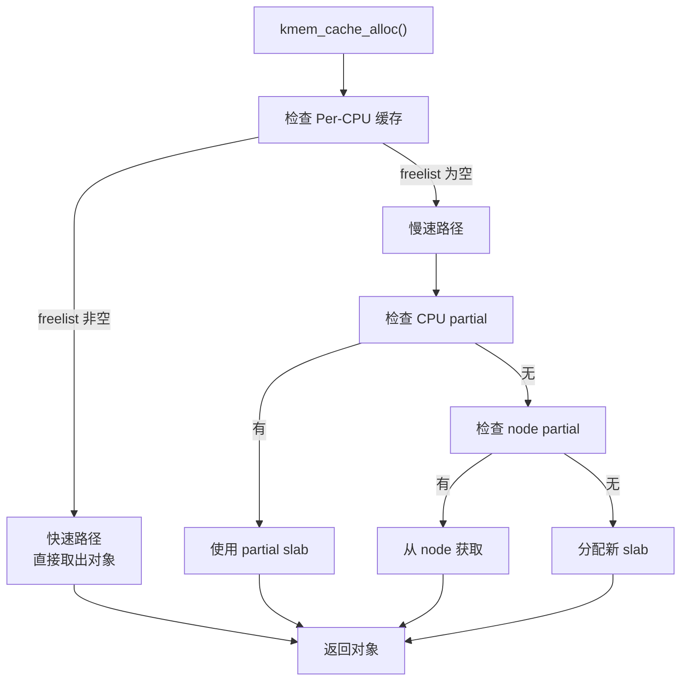

# Slab/Slub 分配器详解

## 学习目标

- 理解 Slab 分配器的设计目标和原理
- 掌握 Slub 分配器的实现机制
- 了解 kmalloc 和对象缓存的使用方法
- 理解 Per-CPU 缓存和 NUMA 优化

## 一、Slab 分配器概述

### 1.1 为什么需要 Slab 分配器

伙伴系统的问题：
- **最小分配单位是页（4KB）**：分配小对象（如 64 字节）浪费大量内存
- **频繁分配/释放开销大**：每次都要操作伙伴系统
- **没有对象缓存**：无法利用已初始化的对象

Slab 分配器的解决方案：
- **小对象分配**：从页中细分出小块内存
- **对象缓存**：缓存已分配的对象，避免重复初始化
- **Per-CPU 缓存**：减少锁竞争

### 1.2 Linux 中的 Slab 实现

| 实现 | 特点 | 状态 |
|-----|------|-----|
| SLAB | 原始实现，功能完整 | 已移除（6.5+） |
| SLUB | 简化设计，默认选择 | **当前默认** |
| SLOB | 极简实现，适合嵌入式 | 已移除（6.4+） |

**本文重点介绍 SLUB**。

### 1.3 基本概念

```
Slab 分配器层次结构：

                    kmem_cache
                    (对象缓存)
                        │
           ┌────────────┼────────────┐
           │            │            │
      Per-CPU       Per-CPU       共享
       缓存          缓存         缓存
     (CPU 0)       (CPU 1)      (node)
           │            │            │
           └────────────┼────────────┘
                        │
                      Slab
                   (一组页面)
                        │
              ┌────┬────┬────┬────┐
              │obj │obj │obj │obj │
              │ 0  │ 1  │ 2  │... │
              └────┴────┴────┴────┘
```

---

## 二、核心数据结构

### 2.1 kmem_cache - 对象缓存

```c
// include/linux/slub_def.h
struct kmem_cache {
    /* Per-CPU 缓存 */
    struct kmem_cache_cpu __percpu *cpu_slab;
    
    /* 对象信息 */
    unsigned int size;           // 对象大小（含对齐和元数据）
    unsigned int object_size;    // 实际对象大小
    unsigned int offset;         // 空闲指针偏移
    
    /* Slab 配置 */
    struct kmem_cache_order_objects oo;  // 首选 order 和对象数
    struct kmem_cache_order_objects min; // 最小 order
    struct kmem_cache_order_objects max; // 最大 order
    gfp_t allocflags;           // 分配标志
    
    /* NUMA 相关 */
    int refcount;               // 引用计数
    void (*ctor)(void *);       // 构造函数
    unsigned int inuse;         // 使用中的字节数
    unsigned int align;         // 对齐要求
    unsigned int red_zone_adjust;
    
    /* 名称和链表 */
    const char *name;           // 缓存名称
    struct list_head list;      // 全局链表
    
    /* Per-Node 缓存 */
    struct kmem_cache_node *node[MAX_NUMNODES];
    
    /* 统计 */
    unsigned long min_partial;
    unsigned int cpu_partial;
    
    /* 调试标志 */
    unsigned long flags;
};
```

### 2.2 kmem_cache_cpu - Per-CPU 缓存

```c
// include/linux/slub_def.h
struct kmem_cache_cpu {
    void **freelist;            // 空闲对象链表
    unsigned long tid;          // 事务 ID
    struct page *page;          // 当前活跃的 slab
    struct page *partial;       // 部分使用的 slab 链表
    unsigned stat[NR_SLUB_STAT_ITEMS];
};
```

### 2.3 kmem_cache_node - Per-Node 缓存

```c
// mm/slab.h
struct kmem_cache_node {
    spinlock_t list_lock;       // 保护链表
    unsigned long nr_partial;   // partial 链表长度
    struct list_head partial;   // 部分使用的 slab 链表
    atomic_long_t nr_slabs;     // slab 总数
    atomic_long_t total_objects;// 对象总数
    struct list_head full;      // 满的 slab（仅调试）
};
```

### 2.4 Slab 页面（使用 struct page）

```c
// include/linux/mm_types.h
// Slab 使用 page 结构的部分字段
struct page {
    union {
        struct {
            struct kmem_cache *slab_cache;  // 所属缓存
            void *freelist;                  // 空闲对象链表
            union {
                void *s_mem;                 // 第一个对象地址
                unsigned long counters;
                struct {
                    unsigned inuse:16;       // 使用中的对象数
                    unsigned objects:15;     // 总对象数
                    unsigned frozen:1;       // CPU 本地缓存中
                };
            };
        };
    };
};
```

---

## 三、SLUB 分配流程

### 3.1 分配入口

```c
// include/linux/slab.h

// 从指定缓存分配对象
void *kmem_cache_alloc(struct kmem_cache *cachep, gfp_t flags);

// 通用分配（自动选择缓存）
void *kmalloc(size_t size, gfp_t flags);

// 分配并清零
void *kzalloc(size_t size, gfp_t flags);

// NUMA 感知分配
void *kmalloc_node(size_t size, gfp_t flags, int node);
```

### 3.2 kmalloc 实现

```c
// include/linux/slab.h
static __always_inline void *kmalloc(size_t size, gfp_t flags)
{
    // 编译时常量大小优化
    if (__builtin_constant_p(size)) {
        // 超过阈值，直接使用页面分配
        if (size > KMALLOC_MAX_CACHE_SIZE)
            return kmalloc_large(size, flags);
        
        // 选择合适大小的缓存
        unsigned int index = kmalloc_index(size);
        return kmem_cache_alloc_trace(kmalloc_caches[kmalloc_type(flags)][index],
                                      flags, size);
    }
    
    return __kmalloc(size, flags);
}
```

### 3.3 kmalloc 缓存大小

```c
// include/linux/slab.h
// kmalloc 使用一系列预定义大小的缓存

// 缓存大小（字节）
// 8, 16, 32, 64, 96, 128, 192, 256, 512, 1024, 2048, 4096, 8192, ...

// kmalloc_index: 根据大小返回缓存索引
static __always_inline unsigned int kmalloc_index(size_t size)
{
    if (size <= 8)        return 3;   // kmalloc-8
    if (size <= 16)       return 4;   // kmalloc-16
    if (size <= 32)       return 5;   // kmalloc-32
    if (size <= 64)       return 6;   // kmalloc-64
    if (size <= 96)       return 1;   // kmalloc-96
    if (size <= 128)      return 7;   // kmalloc-128
    if (size <= 192)      return 2;   // kmalloc-192
    if (size <= 256)      return 8;   // kmalloc-256
    // ... 继续
}
```

### 3.4 快速路径分配



### 3.5 slab_alloc_node 实现

```c
// mm/slub.c
static __always_inline void *slab_alloc_node(struct kmem_cache *s,
                                             gfp_t gfpflags, int node,
                                             unsigned long addr, size_t orig_size)
{
    void *object;
    struct kmem_cache_cpu *c;
    struct page *page;
    unsigned long tid;
    
    // 禁用抢占
    local_irq_save(flags);
    c = this_cpu_ptr(s->cpu_slab);
    tid = c->tid;
    
redo:
    // 快速路径：从 freelist 取对象
    object = c->freelist;
    page = c->page;
    
    if (unlikely(!object || !page || !node_match(page, node))) {
        // 慢速路径
        object = __slab_alloc(s, gfpflags, node, addr, c);
    } else {
        // 更新 freelist
        void *next_object = get_freepointer_safe(s, object);
        
        // 原子更新（防止并发）
        if (!this_cpu_cmpxchg_double(s->cpu_slab->freelist, s->cpu_slab->tid,
                                     object, tid,
                                     next_object, next_tid(tid))) {
            goto redo;
        }
        
        prefetch_freepointer(s, next_object);
    }
    
    local_irq_restore(flags);
    
    // 清零（如果需要）
    if (unlikely(gfpflags & __GFP_ZERO))
        memset(object, 0, s->object_size);
    
    return object;
}
```

### 3.6 慢速路径 __slab_alloc

```c
static void *__slab_alloc(struct kmem_cache *s, gfp_t gfpflags, int node,
                          unsigned long addr, struct kmem_cache_cpu *c)
{
    void *p;
    
    // 1. 尝试从 CPU partial 获取
    page = c->partial;
    if (page) {
        c->partial = page->next;
        c->page = page;
        c->freelist = page->freelist;
        page->freelist = NULL;
        return slab_alloc_node(...);
    }
    
    // 2. 尝试从 node partial 获取
    page = get_partial(s, gfpflags, node, &pc);
    if (page) {
        c->page = page;
        c->freelist = page->freelist;
        return slab_alloc_node(...);
    }
    
    // 3. 分配新 slab
    page = new_slab(s, gfpflags, node);
    if (page) {
        c->page = page;
        c->freelist = page->freelist;
        return slab_alloc_node(...);
    }
    
    return NULL;
}
```

### 3.7 new_slab - 分配新 Slab

```c
static struct page *new_slab(struct kmem_cache *s, gfp_t flags, int node)
{
    struct page *page;
    void *start, *p, *next;
    int idx;
    
    // 从伙伴系统分配页面
    page = allocate_slab(s, flags & (GFP_RECLAIM_MASK | GFP_CONSTRAINT_MASK), node);
    if (!page)
        return NULL;
    
    // 初始化 slab
    page->slab_cache = s;
    page->objects = s->oo.x & OO_MASK;
    page->inuse = 0;
    page->frozen = 1;
    
    // 构建空闲对象链表
    start = page_address(page);
    for (idx = 0, p = start; idx < page->objects - 1; idx++) {
        next = p + s->size;
        set_freepointer(s, p, next);
        p = next;
    }
    set_freepointer(s, p, NULL);
    
    page->freelist = start;
    
    return page;
}
```

---

## 四、SLUB 释放流程

### 4.1 释放入口

```c
// 释放到指定缓存
void kmem_cache_free(struct kmem_cache *cachep, void *objp);

// 通用释放
void kfree(const void *objp);
```

### 4.2 释放流程

```c
// mm/slub.c
static __always_inline void do_slab_free(struct kmem_cache *s,
                                         struct page *page, void *head, void *tail,
                                         int cnt, unsigned long addr)
{
    void *tail_obj = tail ? : head;
    struct kmem_cache_cpu *c;
    unsigned long tid;
    
    local_irq_save(flags);
    c = this_cpu_ptr(s->cpu_slab);
    tid = c->tid;

redo:
    // 快速路径：释放到当前 CPU 的活跃 slab
    if (likely(page == c->page)) {
        // 将对象加到 freelist 头
        set_freepointer(s, tail_obj, c->freelist);
        
        if (!this_cpu_cmpxchg_double(s->cpu_slab->freelist, s->cpu_slab->tid,
                                     c->freelist, tid,
                                     head, next_tid(tid))) {
            goto redo;
        }
    } else {
        // 慢速路径：释放到其他 slab
        __slab_free(s, page, head, tail_obj, cnt, addr);
    }
    
    local_irq_restore(flags);
}
```

### 4.3 慢速路径 __slab_free

```c
static void __slab_free(struct kmem_cache *s, struct page *page,
                        void *head, void *tail, int cnt, unsigned long addr)
{
    void *prior;
    int was_frozen;
    int inuse;
    
    spin_lock_irqsave(&n->list_lock, flags);
    
    // 更新 slab 的空闲链表
    prior = page->freelist;
    set_freepointer(s, tail, prior);
    page->freelist = head;
    page->inuse -= cnt;
    
    was_frozen = page->frozen;
    inuse = page->inuse;
    
    // 检查 slab 状态变化
    if (!inuse && !was_frozen) {
        // slab 变空：可能需要释放
        if (n->nr_partial >= s->min_partial) {
            // partial 链表已满，释放 slab
            discard_slab(s, page);
        } else {
            // 加入 partial 链表
            add_partial(n, page, DEACTIVATE_TO_TAIL);
        }
    } else if (!was_frozen && prior == NULL) {
        // slab 从满变为部分使用：加入 partial
        add_partial(n, page, DEACTIVATE_TO_TAIL);
    }
    
    spin_unlock_irqrestore(&n->list_lock, flags);
}
```

---

## 五、对象缓存管理

### 5.1 创建对象缓存

```c
// 创建对象缓存
struct kmem_cache *kmem_cache_create(const char *name,
                                     unsigned int size,
                                     unsigned int align,
                                     slab_flags_t flags,
                                     void (*ctor)(void *));

// 示例
struct kmem_cache *task_struct_cache;

void __init fork_init(void)
{
    task_struct_cache = kmem_cache_create("task_struct",
                                          sizeof(struct task_struct),
                                          __alignof__(struct task_struct),
                                          SLAB_PANIC | SLAB_ACCOUNT,
                                          NULL);
}
```

### 5.2 常用标志

```c
// include/linux/slab.h

// 调试标志
#define SLAB_CONSISTENCY_CHECKS (1 << 0)  // 一致性检查
#define SLAB_RED_ZONE           (1 << 1)  // 红区检测溢出
#define SLAB_POISON             (1 << 2)  // 毒化未使用内存
#define SLAB_STORE_USER         (1 << 3)  // 记录分配者

// 行为标志
#define SLAB_HWCACHE_ALIGN      (1 << 4)  // 硬件缓存行对齐
#define SLAB_CACHE_DMA          (1 << 5)  // 从 DMA 区域分配
#define SLAB_PANIC              (1 << 6)  // 创建失败时 panic
#define SLAB_RECLAIM_ACCOUNT    (1 << 7)  // 可回收计数
#define SLAB_MEM_SPREAD         (1 << 8)  // NUMA 分散分配
#define SLAB_ACCOUNT            (1 << 9)  // cgroup 计数
```

### 5.3 销毁对象缓存

```c
void kmem_cache_destroy(struct kmem_cache *s)
{
    // 等待所有 RCU 回调完成
    if (s->flags & SLAB_TYPESAFE_BY_RCU)
        rcu_barrier();
    
    // 释放所有 slab
    free_partial(s, n);
    
    // 释放 kmem_cache 结构
    kmem_cache_free(kmem_cache, s);
}
```

---

## 六、SLUB 调试

### 6.1 /proc/slabinfo

```bash
$ cat /proc/slabinfo
# name            <active_objs> <num_objs> <objsize> <objperslab> <pagesperslab>
task_struct         1234        1456       4096        8             8
mm_struct            567         672       1024       16             4
vm_area_struct      8901        9456        216       37             2
dentry             45678       50000        192       42             2
inode_cache         2345        2688        640       25             4
kmalloc-8          12345       16384          8      512             1
kmalloc-16          9876       12288         16      256             1
kmalloc-32          5678        8192         32      128             1
kmalloc-64          3456        4096         64       64             1
```

### 6.2 /sys/kernel/slab

```bash
# 查看特定缓存信息
$ ls /sys/kernel/slab/task_struct/
aliases
align
alloc_fastpath
cache_dma
cpu_slabs
ctor
destroy_by_rcu
hwcache_align
min_partial
object_size
objects
objects_partial
objs_per_slab
order
partial
poison
red_zone
sanity_checks
shrink
slab_size
slabs
store_user
total_objects
trace
```

### 6.3 调试选项

```bash
# 内核启动参数
slub_debug=FZPU                 # 启用调试
slub_debug=FZPU,task_struct     # 只对特定缓存
slub_nomerge                    # 禁止缓存合并

# 调试标志含义
# F - 一致性检查
# Z - 红区
# P - 毒化
# U - 记录用户
```

---

## 七、性能优化

### 7.1 Per-CPU 缓存的作用

```
没有 Per-CPU 缓存：
CPU 0 ─────┐
CPU 1 ─────┼──→ [全局锁] ──→ kmem_cache_node
CPU 2 ─────┤                    │
CPU 3 ─────┘                    └── partial list

有 Per-CPU 缓存：
CPU 0 ──→ [cpu_slab 0] ──┐
CPU 1 ──→ [cpu_slab 1] ──┼──→ kmem_cache_node（很少访问）
CPU 2 ──→ [cpu_slab 2] ──┤
CPU 3 ──→ [cpu_slab 3] ──┘

优势：
- 快速路径无锁
- 减少缓存行竞争
- 改善 NUMA 局部性
```

### 7.2 对象复用

```c
// 构造函数只在第一次分配时调用
struct kmem_cache *cache = kmem_cache_create("my_cache",
                                             sizeof(struct my_struct),
                                             0,
                                             SLAB_HWCACHE_ALIGN,
                                             my_ctor);  // 构造函数

// 后续分配可能复用已初始化的对象
struct my_struct *obj = kmem_cache_alloc(cache, GFP_KERNEL);
// obj 可能是之前释放的对象，已经被构造函数初始化过
```

### 7.3 缓存合并

```bash
# 默认开启缓存合并（相同大小的缓存共享）
# 可以通过 slub_nomerge 禁用

# 查看别名关系
$ cat /sys/kernel/slab/dentry/aliases
2

# 合并条件：
# - 相同的对象大小
# - 相同的对齐要求
# - 相同的标志
# - 没有构造函数
```

---

## 总结

### 核心概念

1. **kmem_cache**：对象缓存，管理特定大小的对象
2. **Slab**：一组页面，存放多个对象
3. **Per-CPU 缓存**：每个 CPU 的本地缓存，无锁分配
4. **freelist**：空闲对象链表

### 分配流程

1. 快速路径：从 Per-CPU freelist 取对象
2. 慢速路径：从 partial slab 或分配新 slab

### 关键函数

| 函数 | 作用 |
|-----|------|
| kmalloc() | 通用内存分配 |
| kfree() | 释放内存 |
| kmem_cache_create() | 创建对象缓存 |
| kmem_cache_alloc() | 从缓存分配对象 |
| kmem_cache_free() | 释放对象到缓存 |

### 后续学习

- [虚拟地址空间设计](07-虚拟地址空间设计.md) - 了解虚拟内存管理
- [内存与其他子系统交互](19-内存与其他子系统交互.md) - 了解 Slab 与其他模块的关系

## 参考资源

- 内核源码：`mm/slub.c`
- 内核文档：`Documentation/mm/slub.rst`

## 更新记录

- 2026-01-28：初始创建，包含 Slab/Slub 分配器详解
