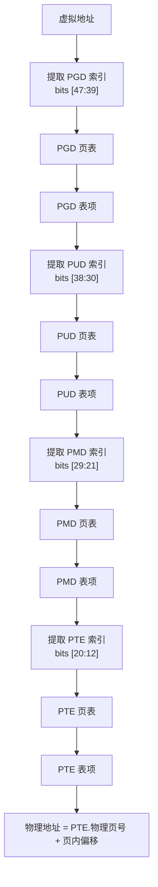

# 页表与地址转换

## 学习目标

- 理解多级页表的设计原理
- 掌握 ARM64 页表结构和地址转换流程
- 了解 TLB 的作用和管理
- 理解页表项的权限和属性控制

## 一、页表概述

### 1.1 为什么需要页表

页表是虚拟地址到物理地址转换的核心数据结构：

```
虚拟地址 ────────► 页表 ────────► 物理地址

          ┌──────────────────────┐
进程 A ──►│     页表 A           │──► 物理页 X
          └──────────────────────┘
          ┌──────────────────────┐
进程 B ──►│     页表 B           │──► 物理页 Y
          └──────────────────────┘

相同虚拟地址 → 不同物理地址 → 进程隔离
```

### 1.2 为什么需要多级页表

单级页表问题（以 48 位地址空间为例）：
- 页表项数 = 2^48 / 4KB = 2^36 = 64G 个
- 每个页表项 8 字节 = 512GB 页表空间
- **每个进程 512GB 页表空间不可接受**

多级页表解决方案：
- 按需分配页表
- 稀疏地址空间只需少量页表
- 典型进程只需几 MB 页表

### 1.3 页表级数

| 架构 | 虚拟地址位数 | 页大小 | 页表级数 |
|-----|------------|-------|---------|
| ARM64 (4K页) | 48-bit | 4KB | 4 级 |
| ARM64 (16K页) | 48-bit | 16KB | 4 级 |
| ARM64 (64K页) | 48-bit | 64KB | 3 级 |
| x86_64 | 48-bit | 4KB | 4 级 |
| ARM64 (52-bit) | 52-bit | 4KB/16KB/64KB | 4/5 级 |

---

## 二、ARM64 页表结构

### 2.1 4KB 页的 4 级页表

```
48位虚拟地址分解（4KB 页，4级页表）：

┌────────┬────────┬────────┬────────┬────────┬────────────┐
│ 未使用 │  PGD   │  PUD   │  PMD   │  PTE   │ 页内偏移   │
│(16bit) │(9bit)  │(9bit)  │(9bit)  │(9bit)  │ (12bit)    │
└────────┴────────┴────────┴────────┴────────┴────────────┘
  63-48    47-39    38-30    29-21    20-12      11-0

每级页表：
- 512 个表项（2^9）
- 每个表项 8 字节
- 一个页表占用 4KB（一页）

覆盖范围：
- PGD 表项覆盖 512GB
- PUD 表项覆盖 1GB
- PMD 表项覆盖 2MB
- PTE 表项覆盖 4KB
```

### 2.2 地址转换流程



### 2.3 代码实现

```c
// arch/arm64/include/asm/pgtable-types.h
typedef struct { pgdval_t pgd; } pgd_t;
typedef struct { pudval_t pud; } pud_t;
typedef struct { pmdval_t pmd; } pmd_t;
typedef struct { pteval_t pte; } pte_t;

// 页表索引计算
// arch/arm64/include/asm/pgtable.h
#define pgd_index(a)    (((a) >> PGDIR_SHIFT) & (PTRS_PER_PGD - 1))
#define pud_index(a)    (((a) >> PUD_SHIFT) & (PTRS_PER_PUD - 1))
#define pmd_index(a)    (((a) >> PMD_SHIFT) & (PTRS_PER_PMD - 1))
#define pte_index(a)    (((a) >> PAGE_SHIFT) & (PTRS_PER_PTE - 1))

// 常量定义（4KB 页）
#define PAGE_SHIFT      12                      // 4KB = 2^12
#define PMD_SHIFT       21                      // 2MB = 2^21
#define PUD_SHIFT       30                      // 1GB = 2^30
#define PGDIR_SHIFT     39                      // 512GB = 2^39

#define PTRS_PER_PTE    512                     // 每级 512 个表项
#define PTRS_PER_PMD    512
#define PTRS_PER_PUD    512
#define PTRS_PER_PGD    512

// 页表项操作
static inline pgd_t *pgd_offset(struct mm_struct *mm, unsigned long addr)
{
    return mm->pgd + pgd_index(addr);
}

static inline pud_t *pud_offset(pgd_t *pgd, unsigned long addr)
{
    return (pud_t *)__va(pgd_val(*pgd) & PAGE_MASK) + pud_index(addr);
}

static inline pmd_t *pmd_offset(pud_t *pud, unsigned long addr)
{
    return (pmd_t *)__va(pud_val(*pud) & PAGE_MASK) + pmd_index(addr);
}

static inline pte_t *pte_offset_kernel(pmd_t *pmd, unsigned long addr)
{
    return (pte_t *)__va(pmd_val(*pmd) & PAGE_MASK) + pte_index(addr);
}
```

### 2.4 页表遍历示例

```c
// 遍历页表查找物理地址
pte_t *lookup_address(unsigned long addr, struct mm_struct *mm)
{
    pgd_t *pgd;
    p4d_t *p4d;
    pud_t *pud;
    pmd_t *pmd;
    pte_t *pte;
    
    // 获取 PGD 表项
    pgd = pgd_offset(mm, addr);
    if (pgd_none(*pgd) || pgd_bad(*pgd))
        return NULL;
    
    // 获取 P4D（ARM64 上通常和 PGD 相同）
    p4d = p4d_offset(pgd, addr);
    if (p4d_none(*p4d) || p4d_bad(*p4d))
        return NULL;
    
    // 获取 PUD 表项
    pud = pud_offset(p4d, addr);
    if (pud_none(*pud) || pud_bad(*pud))
        return NULL;
    
    // 检查是否是 1GB 大页
    if (pud_large(*pud))
        return (pte_t *)pud;
    
    // 获取 PMD 表项
    pmd = pmd_offset(pud, addr);
    if (pmd_none(*pmd) || pmd_bad(*pmd))
        return NULL;
    
    // 检查是否是 2MB 大页
    if (pmd_large(*pmd))
        return (pte_t *)pmd;
    
    // 获取 PTE 表项
    pte = pte_offset_kernel(pmd, addr);
    
    return pte;
}
```

---

## 三、页表项格式

### 3.1 ARM64 页表项格式

```
ARM64 PTE 格式（4KB 页）：

 63    59 58  55 54  52 51  48 47             12 11  10 9  8 7 6 5 4  2 1 0
┌────────┬──────┬──────┬──────┬─────────────────┬──────┬────┬───┬───┬────┬───┐
│ PBHA   │ Ign  │ SW   │ UXN  │   物理地址      │ nG   │ AF │SH │AP │Indx│ V │
│        │      │      │ PXN  │   [47:12]       │      │    │   │   │    │   │
└────────┴──────┴──────┴──────┴─────────────────┴──────┴────┴───┴───┴────┴───┘

关键位说明：
[0]     Valid (V)      - 有效位
[1]     Table/Page     - 表类型（1=页表/页, 0=块）
[4:2]   AttrIndx       - 内存属性索引
[7:6]   AP             - 访问权限
[9:8]   SH             - 共享属性
[10]    AF             - 访问标志
[11]    nG             - 非全局
[47:12] 物理地址       - 输出物理地址
[53]    PXN            - 特权不可执行
[54]    UXN            - 用户不可执行
[58:55] 软件保留       - 内核使用
```

### 3.2 权限控制位

```c
// arch/arm64/include/asm/pgtable-hwdef.h

// 访问权限 (AP)
#define PTE_USER        (1UL << 6)    // 用户可访问
#define PTE_RDONLY      (1UL << 7)    // 只读
#define PTE_WRITE       (0UL << 7)    // 可写

// 执行权限
#define PTE_PXN         (1UL << 53)   // 特权不可执行
#define PTE_UXN         (1UL << 54)   // 用户不可执行

// 常用组合
#define PAGE_KERNEL     __pgprot(PTE_TYPE_PAGE | PTE_AF | PTE_SHARED | PTE_NORMAL)
#define PAGE_KERNEL_RO  __pgprot(PTE_TYPE_PAGE | PTE_AF | PTE_SHARED | PTE_RDONLY | PTE_NORMAL)
#define PAGE_KERNEL_EXEC __pgprot(PTE_TYPE_PAGE | PTE_AF | PTE_SHARED | PTE_NORMAL)

#define PAGE_USER       __pgprot(PTE_TYPE_PAGE | PTE_AF | PTE_USER | PTE_NG | PTE_NORMAL)
#define PAGE_USER_EXEC  __pgprot(PTE_TYPE_PAGE | PTE_AF | PTE_USER | PTE_NG | PTE_NORMAL)
```

### 3.3 内存属性

```c
// 内存类型索引 (AttrIndx)
#define MT_DEVICE_nGnRnE    0   // 设备内存，最严格顺序
#define MT_DEVICE_nGnRE     1   // 设备内存
#define MT_DEVICE_GRE       2   // 设备内存
#define MT_NORMAL_NC        3   // 普通内存，不可缓存
#define MT_NORMAL           4   // 普通内存，可缓存
#define MT_NORMAL_WT        5   // 普通内存，写穿缓存

// 共享属性 (SH)
#define PTE_SHARED      (3UL << 8)    // 内部共享
#define PTE_NON_SHARED  (0UL << 8)    // 非共享

// MAIR 寄存器配置（定义内存属性）
// MAIR_EL1 = | Attr7 | Attr6 | Attr5 | Attr4 | Attr3 | Attr2 | Attr1 | Attr0 |
```

### 3.4 页表项操作函数

```c
// include/linux/pgtable.h

// 设置页表项
static inline void set_pte(pte_t *ptep, pte_t pte)
{
    WRITE_ONCE(*ptep, pte);
}

// 清除页表项
static inline void pte_clear(struct mm_struct *mm, unsigned long addr, pte_t *ptep)
{
    set_pte(ptep, __pte(0));
}

// 检查页表项状态
static inline int pte_present(pte_t pte)
{
    return pte_val(pte) & PTE_VALID;
}

static inline int pte_write(pte_t pte)
{
    return !(pte_val(pte) & PTE_RDONLY);
}

static inline int pte_dirty(pte_t pte)
{
    return pte_val(pte) & PTE_DIRTY;
}

static inline int pte_young(pte_t pte)
{
    return pte_val(pte) & PTE_AF;
}

// 修改页表项属性
static inline pte_t pte_mkwrite(pte_t pte)
{
    return __pte(pte_val(pte) & ~PTE_RDONLY);
}

static inline pte_t pte_wrprotect(pte_t pte)
{
    return __pte(pte_val(pte) | PTE_RDONLY);
}

static inline pte_t pte_mkdirty(pte_t pte)
{
    return __pte(pte_val(pte) | PTE_DIRTY);
}

static inline pte_t pte_mkclean(pte_t pte)
{
    return __pte(pte_val(pte) & ~PTE_DIRTY);
}
```

---

## 四、TLB 管理

### 4.1 TLB 概述

TLB（Translation Lookaside Buffer）是页表的高速缓存：

```
             ┌──────────┐
虚拟地址 ───►│   TLB    │───► 物理地址（命中）
             └────┬─────┘
                  │ 未命中
                  ▼
             ┌──────────┐
             │  页表    │───► 物理地址
             │  遍历    │
             └────┬─────┘
                  │ 填充 TLB
                  ▼
             ┌──────────┐
             │   TLB    │
             └──────────┘
```

### 4.2 ARM64 TLB 架构

```
ARM64 TLB 层次：

┌─────────────────────────────────────────┐
│              L1 TLB (ITLB/DTLB)          │
│  - 指令 TLB (ITLB)                       │
│  - 数据 TLB (DTLB)                       │
│  - 全关联/组关联                         │
│  - 通常 32-64 项                         │
└─────────────────────────────────────────┘
                    │
                    ▼
┌─────────────────────────────────────────┐
│              L2 TLB (统一)               │
│  - 统一的 TLB                            │
│  - 组关联                                │
│  - 通常 512-1024 项                      │
└─────────────────────────────────────────┘
```

### 4.3 TLB 刷新操作

```c
// arch/arm64/include/asm/tlbflush.h

// 刷新所有 TLB
static inline void flush_tlb_all(void)
{
    dsb(ishst);
    __tlbi(vmalle1is);      // 刷新所有 EL1 TLB
    dsb(ish);
    isb();
}

// 刷新指定 mm 的 TLB
static inline void flush_tlb_mm(struct mm_struct *mm)
{
    unsigned long asid = ASID(mm);
    
    dsb(ishst);
    __tlbi(aside1is, asid);  // 按 ASID 刷新
    dsb(ish);
}

// 刷新指定地址范围的 TLB
static inline void flush_tlb_range(struct vm_area_struct *vma,
                                   unsigned long start, unsigned long end)
{
    unsigned long asid = ASID(vma->vm_mm);
    unsigned long addr;
    
    dsb(ishst);
    for (addr = start; addr < end; addr += PAGE_SIZE) {
        __tlbi(vale1is, __TLBI_VADDR(addr, asid));
    }
    dsb(ish);
}

// 刷新单个页面的 TLB
static inline void flush_tlb_page(struct vm_area_struct *vma,
                                  unsigned long addr)
{
    unsigned long asid = ASID(vma->vm_mm);
    
    dsb(ishst);
    __tlbi(vale1is, __TLBI_VADDR(addr, asid));
    dsb(ish);
}
```

### 4.4 ASID (地址空间标识符)

```c
// ASID 避免进程切换时刷新整个 TLB

// 每个进程有唯一的 ASID
// TLB 表项包含 ASID，只匹配相同 ASID 的表项

// ASID 分配
// arch/arm64/mm/context.c
static u64 new_context(struct mm_struct *mm, unsigned int cpu)
{
    static u64 asid_bits;
    u64 asid = atomic64_read(&mm->context.id);
    u64 generation = atomic64_read(&asid_generation);
    
    if ((asid ^ generation) >> asid_bits) {
        // ASID 过期，重新分配
        asid = atomic64_add_return(1, &asid_generation);
        atomic64_set(&mm->context.id, asid);
    }
    
    return asid;
}

// 获取进程的 ASID
#define ASID(mm)    ((mm)->context.id & 0xffff)
```

---

## 五、大页支持

### 5.1 大页类型

| 类型 | 大小 | 页表级别 | 使用场景 |
|-----|------|---------|---------|
| 普通页 | 4KB | PTE | 普通分配 |
| 大页 (Huge Page) | 2MB | PMD | 大内存区域 |
| 巨页 (Giant Page) | 1GB | PUD | 巨大内存区域 |

### 5.2 大页配置

```c
// PMD 级大页（2MB）
// 在 PMD 表项中直接存储物理地址，跳过 PTE 级

static inline pmd_t pmd_mkhuge(pmd_t pmd)
{
    // 设置块描述符位
    return __pmd(pmd_val(pmd) | PMD_TYPE_SECT);
}

// 检查是否是大页
static inline int pmd_huge(pmd_t pmd)
{
    return pmd_val(pmd) && !(pmd_val(pmd) & PMD_TABLE_BIT);
}

// 大页地址转换
// 物理地址 = PMD.物理基址 + (虚拟地址 & 0x1FFFFF)
```

### 5.3 透明大页 (THP)

```c
// 透明大页自动使用 2MB 页面

// 配置文件
// /sys/kernel/mm/transparent_hugepage/enabled
// [always] madvise never

// 代码中使用
int madvise(void *addr, size_t length, int advice);
// advice = MADV_HUGEPAGE: 建议使用大页
// advice = MADV_NOHUGEPAGE: 不使用大页
```

---

## 六、页表操作

### 6.1 分配页表

```c
// 分配 PGD
pgd_t *pgd_alloc(struct mm_struct *mm)
{
    pgd_t *pgd;
    
    pgd = (pgd_t *)__get_free_page(GFP_PGTABLE_USER);
    if (!pgd)
        return NULL;
    
    memset(pgd, 0, PTRS_PER_PGD * sizeof(pgd_t));
    
    // 复制内核页表部分
    pgd_copy_kernel_part(pgd);
    
    return pgd;
}

// 分配下级页表
static inline pud_t *pud_alloc(struct mm_struct *mm, pgd_t *pgd, unsigned long addr)
{
    return (unlikely(pgd_none(*pgd)) && __pud_alloc(mm, pgd, addr)) ?
           NULL : pud_offset(pgd, addr);
}

int __pud_alloc(struct mm_struct *mm, pgd_t *pgd, unsigned long address)
{
    pud_t *new = pud_alloc_one(mm, address);
    if (!new)
        return -ENOMEM;
    
    spin_lock(&mm->page_table_lock);
    if (!pgd_present(*pgd)) {
        pgd_populate(mm, pgd, new);
    } else {
        pud_free(mm, new);
    }
    spin_unlock(&mm->page_table_lock);
    
    return 0;
}
```

### 6.2 设置映射

```c
// 建立单个页面映射
int remap_pfn_range(struct vm_area_struct *vma, unsigned long addr,
                    unsigned long pfn, unsigned long size, pgprot_t prot)
{
    pgd_t *pgd;
    pud_t *pud;
    pmd_t *pmd;
    pte_t *pte;
    
    // 遍历并创建页表
    pgd = pgd_offset(vma->vm_mm, addr);
    pud = pud_alloc(vma->vm_mm, pgd, addr);
    pmd = pmd_alloc(vma->vm_mm, pud, addr);
    pte = pte_alloc_map(vma->vm_mm, pmd, addr);
    
    // 设置 PTE
    set_pte_at(vma->vm_mm, addr, pte, pte_mkspecial(pfn_pte(pfn, prot)));
    
    return 0;
}
```

### 6.3 解除映射

```c
// 解除页表映射
void unmap_page_range(struct mmu_gather *tlb,
                      struct vm_area_struct *vma,
                      unsigned long addr, unsigned long end)
{
    pgd_t *pgd;
    unsigned long next;
    
    pgd = pgd_offset(vma->vm_mm, addr);
    do {
        next = pgd_addr_end(addr, end);
        if (pgd_none_or_clear_bad(pgd))
            continue;
        unmap_pud_range(tlb, vma, pgd, addr, next);
    } while (pgd++, addr = next, addr != end);
}
```

---

## 总结

### 核心概念

1. **多级页表**：4 级页表节省内存空间
2. **页表项**：包含物理地址和权限属性
3. **TLB**：页表高速缓存，加速地址转换
4. **ASID**：地址空间标识符，避免 TLB 全刷新
5. **大页**：2MB/1GB 页面，减少 TLB 开销

### 关键数据结构

| 结构 | 作用 |
|-----|------|
| pgd_t | 页全局目录表项 |
| pud_t | 页上级目录表项 |
| pmd_t | 页中间目录表项 |
| pte_t | 页表项 |

### 后续学习

- [VMA管理机制详解](09-VMA管理机制详解.md) - 了解虚拟内存区域管理
- [缺页异常处理机制](10-缺页异常处理机制.md) - 了解页面错误处理

## 参考资源

- 内核源码：
  - `arch/arm64/include/asm/pgtable.h`
  - `arch/arm64/mm/mmu.c`
- ARM 文档：ARM Architecture Reference Manual

## 更新记录

- 2026-01-28：初始创建，包含页表与地址转换详解
