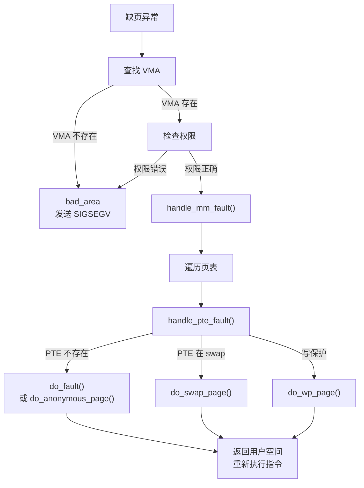

# 缺页异常处理机制

## 学习目标

- 理解缺页异常的触发原因和类型
- 掌握缺页异常的处理流程
- 了解按需分页、写时复制（COW）机制
- 理解主缺页和次缺页的区别

## 一、缺页异常概述

### 1.1 什么是缺页异常

缺页异常（Page Fault）是 CPU 访问虚拟地址时，因为页表无法完成地址转换而触发的异常。

```
CPU 访问虚拟地址
      │
      ▼
┌─────────────┐
│   MMU/TLB   │
└──────┬──────┘
       │
       ▼
   页表查找
       │
       ├── 成功 ──► 物理地址 ──► 内存访问
       │
       └── 失败 ──► 缺页异常 ──► 内核处理
```

### 1.2 缺页异常的原因

| 原因 | 说明 | 处理方式 |
|-----|------|---------|
| 页面未映射 | PTE 不存在或无效 | 分配页面，建立映射 |
| 页面在 swap | PTE 标记为 swap entry | 从 swap 读回页面 |
| 写保护页面 | 写入只读页面（COW） | 复制页面，更新映射 |
| 权限错误 | 访问权限不匹配 | 发送 SIGSEGV |
| 地址无效 | 不在任何 VMA 范围内 | 发送 SIGSEGV |

### 1.3 缺页类型

```c
// 主缺页 (Major Fault)：需要磁盘 I/O
// - 从文件读取页面
// - 从 swap 读回页面
// - 开销大，毫秒级

// 次缺页 (Minor Fault)：不需要磁盘 I/O
// - 分配零页
// - 写时复制
// - 开销小，微秒级
```

---

## 二、缺页处理流程

### 2.1 整体流程



### 2.2 架构入口

```c
// arch/arm64/mm/fault.c
static int __kprobes do_page_fault(unsigned long far, unsigned int esr,
                                   struct pt_regs *regs)
{
    const struct fault_info *inf;
    struct mm_struct *mm = current->mm;
    vm_fault_t fault;
    unsigned long vm_flags;
    unsigned int mm_flags = FAULT_FLAG_DEFAULT;
    unsigned long addr = far;  // Fault Address Register
    
    // 1. 判断是否在中断上下文
    if (faulthandler_disabled() || !mm)
        goto no_context;
    
    // 2. 确定访问类型
    if (is_el0_instruction_abort(esr)) {
        vm_flags = VM_EXEC;
        mm_flags |= FAULT_FLAG_INSTRUCTION;
    } else if (is_write_abort(esr)) {
        vm_flags = VM_WRITE;
        mm_flags |= FAULT_FLAG_WRITE;
    } else {
        vm_flags = VM_READ;
    }
    
    // 3. 用户模式标志
    if (user_mode(regs))
        mm_flags |= FAULT_FLAG_USER;
    
    // 4. 获取 mmap 锁
    if (!mmap_read_trylock(mm)) {
        if (!user_mode(regs) && !search_exception_tables(regs->pc))
            goto no_context;
retry:
        mmap_read_lock(mm);
    }
    
    // 5. 查找 VMA
    vma = find_vma(mm, addr);
    if (unlikely(!vma)) {
        fault = VM_FAULT_BADMAP;
        goto done;
    }
    
    // 6. 检查地址是否在 VMA 范围内
    if (unlikely(vma->vm_start > addr)) {
        // 检查栈自动扩展
        if (!(vma->vm_flags & VM_GROWSDOWN)) {
            fault = VM_FAULT_BADMAP;
            goto done;
        }
        if (expand_stack(vma, addr)) {
            fault = VM_FAULT_BADMAP;
            goto done;
        }
    }
    
    // 7. 检查权限
    if (!(vma->vm_flags & vm_flags)) {
        fault = VM_FAULT_BADACCESS;
        goto done;
    }
    
    // 8. 处理缺页
    fault = handle_mm_fault(vma, addr, mm_flags, regs);
    
done:
    mmap_read_unlock(mm);
    
    // 9. 处理结果
    if (fault & VM_FAULT_ERROR)
        return handle_fault_error(far, esr, regs, fault);
    
    return 0;
}
```

### 2.3 通用缺页处理

```c
// mm/memory.c
vm_fault_t handle_mm_fault(struct vm_area_struct *vma, unsigned long address,
                           unsigned int flags, struct pt_regs *regs)
{
    vm_fault_t ret;
    
    // 大页处理
    if (is_vm_hugetlb_page(vma))
        return hugetlb_fault(vma->vm_mm, vma, address, flags);
    
    // 普通页面处理
    return __handle_mm_fault(vma, address, flags);
}

static vm_fault_t __handle_mm_fault(struct vm_area_struct *vma,
                                    unsigned long address, unsigned int flags)
{
    struct vm_fault vmf = {
        .vma = vma,
        .address = address & PAGE_MASK,
        .flags = flags,
        .pgoff = linear_page_index(vma, address),
    };
    struct mm_struct *mm = vma->vm_mm;
    pgd_t *pgd;
    p4d_t *p4d;
    pud_t *pud;
    pmd_t *pmd;
    vm_fault_t ret;
    
    // 遍历页表层级
    pgd = pgd_offset(mm, address);
    
    p4d = p4d_alloc(mm, pgd, address);
    if (!p4d)
        return VM_FAULT_OOM;
    
    pud = pud_alloc(mm, p4d, address);
    if (!pud)
        return VM_FAULT_OOM;
    
    // 检查 PUD 级大页
    if (pud_trans_huge(*pud) || pud_devmap(*pud)) {
        // 处理 1GB 大页
    }
    
    pmd = pmd_alloc(mm, pud, address);
    if (!pmd)
        return VM_FAULT_OOM;
    
    // 检查 PMD 级大页（透明大页）
    if (pmd_trans_huge(*pmd) || pmd_devmap(*pmd)) {
        // 处理 2MB 大页
    }
    
    // 处理 PTE 级别缺页
    return handle_pte_fault(&vmf);
}
```

---

## 三、PTE 级缺页处理

### 3.1 handle_pte_fault

```c
// mm/memory.c
static vm_fault_t handle_pte_fault(struct vm_fault *vmf)
{
    pte_t entry;
    
    // 获取 PTE
    vmf->pte = pte_offset_map(vmf->pmd, vmf->address);
    vmf->orig_pte = *vmf->pte;
    
    // PTE 不存在
    if (!pte_present(vmf->orig_pte)) {
        if (pte_none(vmf->orig_pte)) {
            // PTE 完全为空
            if (vma_is_anonymous(vmf->vma))
                return do_anonymous_page(vmf);  // 匿名页
            else
                return do_fault(vmf);           // 文件映射页
        }
        // PTE 存在但不在内存（swap）
        return do_swap_page(vmf);
    }
    
    // PTE 存在，检查是否需要 COW
    if (vmf->flags & FAULT_FLAG_WRITE) {
        if (!pte_write(vmf->orig_pte))
            return do_wp_page(vmf);             // 写时复制
        
        // 标记脏页
        entry = pte_mkdirty(vmf->orig_pte);
    }
    
    // 更新访问位
    entry = pte_mkyoung(vmf->orig_pte);
    if (ptep_set_access_flags(vmf->vma, vmf->address, vmf->pte, entry, vmf->flags & FAULT_FLAG_WRITE))
        update_mmu_cache(vmf->vma, vmf->address, vmf->pte);
    
    return 0;
}
```

### 3.2 匿名页面缺页

```c
// mm/memory.c
static vm_fault_t do_anonymous_page(struct vm_fault *vmf)
{
    struct vm_area_struct *vma = vmf->vma;
    struct page *page;
    pte_t entry;
    
    // 检查是否允许分配
    if (!vma->vm_ops || !vma->vm_ops->fault) {
        // 纯匿名映射
    }
    
    // 只读访问：映射零页
    if (!(vmf->flags & FAULT_FLAG_WRITE) &&
        !mm_forbids_zeropage(vma->vm_mm)) {
        // 使用共享的零页
        entry = pte_mkspecial(pfn_pte(my_zero_pfn(vmf->address),
                                      vma->vm_page_prot));
        vmf->pte = pte_offset_map_lock(vma->vm_mm, vmf->pmd, vmf->address, &vmf->ptl);
        
        if (!pte_none(*vmf->pte))
            goto unlock;
        
        // 次缺页（使用零页，无 I/O）
        set_pte_at(vma->vm_mm, vmf->address, vmf->pte, entry);
        goto unlock;
    }
    
    // 写访问：分配新页面
    page = alloc_zeroed_user_highpage_movable(vma, vmf->address);
    if (!page)
        return VM_FAULT_OOM;
    
    // 设置页表项
    entry = mk_pte(page, vma->vm_page_prot);
    entry = pte_sw_mkyoung(entry);
    if (vma->vm_flags & VM_WRITE)
        entry = pte_mkwrite(pte_mkdirty(entry));
    
    vmf->pte = pte_offset_map_lock(vma->vm_mm, vmf->pmd, vmf->address, &vmf->ptl);
    if (!pte_none(*vmf->pte)) {
        // 竞争失败
        put_page(page);
        goto unlock;
    }
    
    // 加入匿名 VMA
    page_add_new_anon_rmap(page, vma, vmf->address, false);
    lru_cache_add_inactive_or_unevictable(page, vma);
    
    // 设置 PTE
    set_pte_at(vma->vm_mm, vmf->address, vmf->pte, entry);
    
unlock:
    pte_unmap_unlock(vmf->pte, vmf->ptl);
    return 0;
}
```

### 3.3 文件映射缺页

```c
// mm/memory.c
static vm_fault_t do_fault(struct vm_fault *vmf)
{
    struct vm_area_struct *vma = vmf->vma;
    
    // 根据访问类型分派
    if (!vma->vm_ops->fault)
        return VM_FAULT_SIGBUS;
    
    if (!(vmf->flags & FAULT_FLAG_WRITE))
        return do_read_fault(vmf);   // 读缺页
    
    if (!(vma->vm_flags & VM_SHARED))
        return do_cow_fault(vmf);    // 私有写缺页（需要 COW）
    
    return do_shared_fault(vmf);     // 共享写缺页
}

// 读缺页
static vm_fault_t do_read_fault(struct vm_fault *vmf)
{
    struct vm_area_struct *vma = vmf->vma;
    vm_fault_t ret = 0;
    
    // 尝试预映射周围页面
    if (vma->vm_ops->map_pages && fault_around_bytes >> PAGE_SHIFT > 1) {
        ret = do_fault_around(vmf);
        if (ret)
            return ret;
    }
    
    // 调用文件系统的 fault 函数
    ret = __do_fault(vmf);
    if (ret)
        return ret;
    
    // 建立只读映射
    ret = finish_fault(vmf);
    return ret;
}

// 调用文件系统的 fault
static vm_fault_t __do_fault(struct vm_fault *vmf)
{
    struct vm_area_struct *vma = vmf->vma;
    vm_fault_t ret;
    
    // 调用文件系统提供的 fault 函数
    ret = vma->vm_ops->fault(vmf);
    
    // 通常会从 Page Cache 获取页面
    // 如果不在 Cache 中，则读取文件
    
    return ret;
}
```

### 3.4 文件系统 fault 实现示例

```c
// mm/filemap.c
vm_fault_t filemap_fault(struct vm_fault *vmf)
{
    struct file *file = vmf->vma->vm_file;
    struct address_space *mapping = file->f_mapping;
    struct inode *inode = mapping->host;
    pgoff_t offset = vmf->pgoff;
    struct page *page;
    vm_fault_t ret = 0;
    
    // 1. 从 Page Cache 查找
    page = find_get_page(mapping, offset);
    if (likely(page)) {
        // 次缺页：页面在缓存中
        if (PageUptodate(page))
            goto have_page;
    }
    
    // 2. 不在缓存中，需要读取
    // 主缺页：需要磁盘 I/O
    page = pagecache_get_page(mapping, offset,
                              FGP_CREAT | FGP_FOR_MMAP,
                              vmf->gfp_mask);
    if (!page)
        return VM_FAULT_OOM;
    
    // 3. 读取页面内容
    if (!PageUptodate(page)) {
        ret = VM_FAULT_MAJOR;  // 标记为主缺页
        
        // 触发实际 I/O
        error = mapping->a_ops->readpage(file, page);
        if (error)
            return VM_FAULT_SIGBUS;
        
        // 等待 I/O 完成
        lock_page(page);
    }
    
have_page:
    vmf->page = page;
    return ret | VM_FAULT_LOCKED;
}
```

---

## 四、写时复制 (COW)

### 4.1 COW 原理

```
fork() 后的内存状态：

初始状态（fork 后）：
┌──────────────┐      ┌──────────────┐
│   父进程     │      │   子进程     │
│   PTE: R     │──┬──►│   PTE: R     │
└──────────────┘  │   └──────────────┘
                  │
                  ▼
            ┌──────────┐
            │ 物理页 P │  refcount = 2
            └──────────┘

父进程写入时（触发 COW）：
┌──────────────┐      ┌──────────────┐
│   父进程     │      │   子进程     │
│   PTE: RW    │──┐   │   PTE: R     │
└──────────────┘  │   └──────────────┘
                  │          │
                  ▼          ▼
            ┌──────────┐ ┌──────────┐
            │ 物理页 P'│ │ 物理页 P │
            │  (copy)  │ │ refcount=1│
            └──────────┘ └──────────┘
```

### 4.2 COW 实现

```c
// mm/memory.c
static vm_fault_t do_wp_page(struct vm_fault *vmf)
{
    struct vm_area_struct *vma = vmf->vma;
    struct page *old_page, *new_page;
    pte_t entry;
    
    // 1. 获取原页面
    old_page = vm_normal_page(vma, vmf->address, vmf->orig_pte);
    if (!old_page) {
        // 特殊映射（如零页），直接分配新页
        return wp_page_copy(vmf);
    }
    
    // 2. 检查是否可以复用
    if (page_count(old_page) == 1) {
        // 只有一个引用，可以直接复用
        // 解除写保护
        entry = pte_mkyoung(vmf->orig_pte);
        entry = maybe_mkwrite(pte_mkdirty(entry), vma);
        
        if (ptep_set_access_flags(vma, vmf->address, vmf->pte, entry, 1))
            update_mmu_cache(vma, vmf->address, vmf->pte);
        
        return VM_FAULT_WRITE;
    }
    
    // 3. 需要复制
    return wp_page_copy(vmf);
}

static vm_fault_t wp_page_copy(struct vm_fault *vmf)
{
    struct vm_area_struct *vma = vmf->vma;
    struct mm_struct *mm = vma->vm_mm;
    struct page *old_page = vmf->page;
    struct page *new_page;
    pte_t entry;
    
    // 分配新页面
    new_page = alloc_page_vma(GFP_HIGHUSER_MOVABLE, vma, vmf->address);
    if (!new_page)
        return VM_FAULT_OOM;
    
    // 复制页面内容
    if (old_page)
        copy_user_highpage(new_page, old_page, vmf->address, vma);
    else
        clear_user_highpage(new_page, vmf->address);
    
    // 设置新 PTE
    entry = mk_pte(new_page, vma->vm_page_prot);
    entry = pte_sw_mkyoung(entry);
    entry = maybe_mkwrite(pte_mkdirty(entry), vma);
    
    // 更新页表
    vmf->pte = pte_offset_map_lock(mm, vmf->pmd, vmf->address, &vmf->ptl);
    
    if (likely(pte_same(*vmf->pte, vmf->orig_pte))) {
        // 原子更新成功
        page_add_new_anon_rmap(new_page, vma, vmf->address, false);
        lru_cache_add_inactive_or_unevictable(new_page, vma);
        
        set_pte_at_notify(mm, vmf->address, vmf->pte, entry);
        update_mmu_cache(vma, vmf->address, vmf->pte);
        
        // 减少旧页面引用
        if (old_page)
            page_remove_rmap(old_page, vma, false);
    } else {
        // 竞争失败，放弃新页面
        put_page(new_page);
    }
    
    pte_unmap_unlock(vmf->pte, vmf->ptl);
    
    if (old_page)
        put_page(old_page);
    
    return VM_FAULT_WRITE;
}
```

---

## 五、Swap 页面处理

### 5.1 do_swap_page

```c
// mm/memory.c
vm_fault_t do_swap_page(struct vm_fault *vmf)
{
    struct vm_area_struct *vma = vmf->vma;
    struct page *page;
    swp_entry_t entry;
    
    // 获取 swap entry
    entry = pte_to_swp_entry(vmf->orig_pte);
    
    // 1. 检查 swap cache
    page = lookup_swap_cache(entry, vma, vmf->address);
    if (page) {
        // 次缺页：页面在 swap cache 中
        goto have_page;
    }
    
    // 2. 不在 cache，需要从 swap 读取
    // 主缺页：需要磁盘 I/O
    page = swapin_readahead(entry, GFP_HIGHUSER_MOVABLE, vmf);
    if (!page) {
        // 同步读取
        page = read_swap_cache_async(entry, GFP_HIGHUSER_MOVABLE,
                                     vma, vmf->address, false);
        if (!page)
            return VM_FAULT_OOM;
    }
    
    // 等待 I/O 完成
    lock_page(page);
    
have_page:
    // 3. 建立映射
    vmf->pte = pte_offset_map_lock(vma->vm_mm, vmf->pmd, vmf->address, &vmf->ptl);
    
    // 检查是否已被其他线程处理
    if (unlikely(!pte_same(*vmf->pte, vmf->orig_pte)))
        goto out_nomap;
    
    // 设置新 PTE
    pte_t pte = mk_pte(page, vma->vm_page_prot);
    if (vmf->flags & FAULT_FLAG_WRITE && reuse_swap_page(page)) {
        pte = pte_mkwrite(pte_mkdirty(pte));
        vmf->flags &= ~FAULT_FLAG_WRITE;
    }
    
    set_pte_at(vma->vm_mm, vmf->address, vmf->pte, pte);
    
    // 释放 swap entry
    swap_free(entry);
    
out_nomap:
    pte_unmap_unlock(vmf->pte, vmf->ptl);
    unlock_page(page);
    
    return ret;
}
```

---

## 六、缺页统计

### 6.1 /proc/vmstat

```bash
$ grep -E "pgfault|pgmajfault" /proc/vmstat
pgfault 12345678      # 总缺页次数（主+次）
pgmajfault 1234       # 主缺页次数（需要 I/O）
```

### 6.2 进程级统计

```bash
$ cat /proc/<pid>/stat
# 第 10 字段：minflt（次缺页）
# 第 12 字段：majflt（主缺页）

# 或使用 getrusage()
struct rusage usage;
getrusage(RUSAGE_SELF, &usage);
printf("Minor faults: %ld\n", usage.ru_minflt);
printf("Major faults: %ld\n", usage.ru_majflt);
```

---

## 总结

### 缺页类型总结

| 类型 | 触发条件 | 处理函数 | I/O |
|-----|---------|---------|-----|
| 匿名页缺页 | PTE 为空，匿名 VMA | do_anonymous_page() | 无 |
| 文件读缺页 | 文件映射，读访问 | do_read_fault() | 可能 |
| 文件写缺页（私有）| 私有文件映射，写访问 | do_cow_fault() | 可能 |
| 文件写缺页（共享）| 共享文件映射，写访问 | do_shared_fault() | 可能 |
| 写时复制 | 写入写保护页面 | do_wp_page() | 无 |
| Swap 换入 | PTE 标记为 swap | do_swap_page() | 是 |

### 关键概念

1. **按需分页**：延迟分配物理内存
2. **写时复制**：延迟复制，提高 fork 效率
3. **主缺页**：需要磁盘 I/O
4. **次缺页**：不需要磁盘 I/O

### 后续学习

- [文件映射与匿名映射](11-文件映射与匿名映射.md) - 了解不同映射类型
- [内存压缩与交换](15-内存压缩与交换.md) - 了解 swap 机制

## 参考资源

- 内核源码：
  - `mm/memory.c` - 缺页处理核心
  - `arch/arm64/mm/fault.c` - 架构相关代码
- 内核文档：`Documentation/mm/`

## 更新记录

- 2026-01-28：初始创建，包含缺页异常处理机制详解
