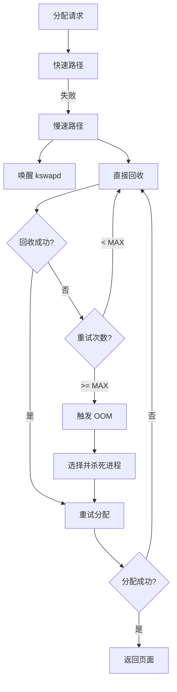

# 直接内存回收机制

## 学习目标

- 理解直接回收的触发条件和流程
- 掌握慢速路径分配的实现机制
- 了解回收优先级和回收策略
- 理解直接回收对性能的影响

## 一、直接回收概述

### 1.1 什么是直接回收

直接回收（Direct Reclaim）是在内存分配路径中同步执行的页面回收，当 kswapd 来不及回收或空闲内存极低时触发。

```
                    内存分配请求
                          │
                          ▼
                   ┌─────────────┐
                   │  快速路径    │ ── 成功 ──► 返回页面
                   │ (无锁分配)  │
                   └─────┬───────┘
                         │ 失败
                         ▼
                   ┌─────────────┐
                   │  慢速路径    │
                   │ (可能睡眠)  │
                   └─────┬───────┘
                         │
           ┌─────────────┼─────────────┐
           │             │             │
           ▼             ▼             ▼
      唤醒 kswapd   直接回收      内存压缩
           │             │             │
           └─────────────┼─────────────┘
                         │
                         ▼
                   重试快速路径
                         │
              ┌──────────┼──────────┐
              │          │          │
           成功       继续重试     OOM
```

### 1.2 直接回收 vs kswapd 回收

| 特性 | 直接回收 | kswapd 回收 |
|-----|---------|------------|
| 触发时机 | 分配失败时 | 低于 low_wmark |
| 执行上下文 | 分配进程 | kswapd 线程 |
| 同步/异步 | 同步（阻塞） | 异步 |
| 性能影响 | 延迟分配 | 后台进行 |
| 优先级 | 可能更激进 | 相对温和 |

---

## 二、慢速路径分配

### 2.1 分配入口回顾

```c
// mm/page_alloc.c
struct page *__alloc_pages(gfp_t gfp, unsigned int order, int preferred_nid,
                           nodemask_t *nodemask)
{
    struct page *page;
    struct alloc_context ac = { };
    
    // 准备分配上下文
    if (!prepare_alloc_pages(gfp, order, preferred_nid, nodemask, &ac))
        return NULL;
    
    // 快速路径
    page = get_page_from_freelist(gfp, order, alloc_flags, &ac);
    if (likely(page))
        return page;
    
    // 慢速路径
    return __alloc_pages_slowpath(gfp, order, &ac);
}
```

### 2.2 慢速路径实现

```c
// mm/page_alloc.c
static inline struct page *__alloc_pages_slowpath(gfp_t gfp_mask,
                                                  unsigned int order,
                                                  struct alloc_context *ac)
{
    struct page *page = NULL;
    unsigned int alloc_flags;
    gfp_t alloc_gfp;
    int did_some_progress;
    enum compact_priority compact_priority;
    enum compact_result compact_result;
    int compaction_retries = 0;
    int no_progress_loops = 0;
    unsigned long alloc_start = jiffies;
    
    // 1. 唤醒 kswapd
    if (gfp_mask & __GFP_KSWAPD_RECLAIM)
        wake_all_kswapds(order, gfp_mask, ac);
    
    // 2. 使用更宽松的水位线重试
    alloc_flags = gfp_to_alloc_flags(gfp_mask);
    page = get_page_from_freelist(gfp_mask, order, alloc_flags, ac);
    if (page)
        goto got_pg;
    
    // 3. 检查是否允许直接回收
    if (!can_direct_reclaim(gfp_mask))
        goto nopage;
    
retry:
    // 4. 直接回收
    if (gfp_mask & __GFP_DIRECT_RECLAIM)
        page = __alloc_pages_direct_reclaim(gfp_mask, order, alloc_flags, ac,
                                            &did_some_progress);
    if (page)
        goto got_pg;
    
    // 5. 内存压缩
    if (can_compact_retry(order, &compact_result)) {
        page = __alloc_pages_direct_compact(gfp_mask, order, alloc_flags, ac,
                                            compact_priority, &compact_result);
        if (page)
            goto got_pg;
    }
    
    // 6. 检查是否需要继续重试
    if (should_reclaim_retry(gfp_mask, order, ac, alloc_flags,
                             did_some_progress > 0, &no_progress_loops))
        goto retry;
    
    // 7. 触发 OOM
    if (gfp_mask & __GFP_NOFAIL) {
        // 必须成功的分配
        page = __alloc_pages_may_oom(gfp_mask, order, ac, &did_some_progress);
        if (page)
            goto got_pg;
        goto retry;
    }
    
nopage:
    // 分配失败
    warn_alloc(gfp_mask, ac->nodemask, "page allocation failure");
    return NULL;
    
got_pg:
    return page;
}
```

### 2.3 直接回收入口

```c
// mm/page_alloc.c
static inline struct page *__alloc_pages_direct_reclaim(gfp_t gfp_mask,
                                                        unsigned int order,
                                                        unsigned int alloc_flags,
                                                        const struct alloc_context *ac,
                                                        unsigned long *did_some_progress)
{
    struct page *page = NULL;
    bool drained = false;
    
    // 执行直接回收
    *did_some_progress = __perform_reclaim(gfp_mask, order, ac);
    if (unlikely(!*did_some_progress))
        return NULL;
    
retry:
    // 回收后重试分配
    page = get_page_from_freelist(gfp_mask, order, alloc_flags, ac);
    
    // 如果仍然失败，尝试排空 PCP
    if (!page && !drained) {
        drain_all_pages(NULL);
        drained = true;
        goto retry;
    }
    
    return page;
}

static unsigned long __perform_reclaim(gfp_t gfp_mask, unsigned int order,
                                       const struct alloc_context *ac)
{
    unsigned long progress;
    
    // 允许被调度
    cond_resched();
    
    // 标记进程正在进行内存回收
    current->flags |= PF_MEMALLOC;
    
    // 执行回收
    progress = try_to_free_pages(ac->zonelist, order, gfp_mask,
                                 ac->nodemask);
    
    current->flags &= ~PF_MEMALLOC;
    
    cond_resched();
    
    return progress;
}
```

---

## 三、try_to_free_pages

### 3.1 核心实现

```c
// mm/vmscan.c
unsigned long try_to_free_pages(struct zonelist *zonelist, int order,
                                gfp_t gfp_mask, nodemask_t *nodemask)
{
    unsigned long nr_reclaimed;
    struct scan_control sc = {
        .nr_to_reclaim = SWAP_CLUSTER_MAX,    // 目标回收页数
        .gfp_mask = gfp_mask,
        .reclaim_idx = gfp_zone(gfp_mask),
        .order = order,
        .may_writepage = !laptop_mode,         // 是否允许回写
        .may_unmap = 1,                        // 是否允许解除映射
        .may_swap = 1,                         // 是否允许换出
    };
    
    // 设置优先级并回收
    nr_reclaimed = do_try_to_free_pages(zonelist, &sc);
    
    return nr_reclaimed;
}

static unsigned long do_try_to_free_pages(struct zonelist *zonelist,
                                          struct scan_control *sc)
{
    unsigned long total_scanned = 0;
    unsigned long nr_reclaimed = 0;
    
    // 从最高优先级开始
    for (sc->priority = DEF_PRIORITY; sc->priority >= 0; sc->priority--) {
        
        // 回收每个符合条件的 zone
        for_each_zone_zonelist_nodemask(zone, z, zonelist, sc->reclaim_idx, sc->nodemask) {
            // 收缩节点
            shrink_node(zone->zone_pgdat, sc);
            
            // 检查是否达到目标
            if (sc->nr_reclaimed >= sc->nr_to_reclaim)
                return sc->nr_reclaimed;
        }
        
        total_scanned += sc->nr_scanned;
        
        // 优先级越低，扫描越激进
        // priority = 12: 扫描 1/4096 的页面
        // priority = 0: 扫描所有页面
    }
    
    return nr_reclaimed;
}
```

### 3.2 回收优先级

```c
// include/linux/mmzone.h
#define DEF_PRIORITY 12    // 默认优先级（最高）

// 每降低一个优先级，扫描范围翻倍
// 扫描数量 = 总页数 >> priority

// 示例：zone 有 1M 页
// priority = 12: 扫描 1M >> 12 = 244 页
// priority = 11: 扫描 1M >> 11 = 488 页
// priority = 0:  扫描 1M >> 0 = 1M 页（全部）

static unsigned long shrink_lruvec(struct lruvec *lruvec,
                                   struct scan_control *sc)
{
    unsigned long nr;
    
    // 根据优先级计算扫描数量
    nr = lruvec_lru_size(lruvec, lru, sc->reclaim_idx);
    nr >>= sc->priority;
    
    // ...
}
```

---

## 四、回收策略

### 4.1 scan_control 结构

```c
// mm/vmscan.c
struct scan_control {
    /* 回收目标 */
    unsigned long nr_to_reclaim;    // 目标回收页数
    
    /* 回收结果 */
    unsigned long nr_reclaimed;     // 已回收页数
    unsigned long nr_scanned;       // 已扫描页数
    
    /* GFP 标志 */
    gfp_t gfp_mask;
    
    /* 回收范围 */
    int order;                      // 分配阶数
    s8 priority;                    // 回收优先级
    s8 reclaim_idx;                 // 最高 zone 索引
    
    /* 回收行为标志 */
    unsigned int may_writepage:1;   // 允许回写脏页
    unsigned int may_unmap:1;       // 允许解除映射
    unsigned int may_swap:1;        // 允许换出匿名页
    unsigned int proactive:1;       // 主动回收
    
    /* memcg 相关 */
    struct mem_cgroup *target_mem_cgroup;
    
    /* 节点掩码 */
    nodemask_t *nodemask;
};
```

### 4.2 不同 GFP 标志的回收策略

```c
// 根据 GFP 标志决定回收策略

// GFP_KERNEL: 允许所有回收操作
// - may_writepage = true
// - may_unmap = true
// - may_swap = true

// GFP_NOFS: 不允许文件系统操作
// - may_writepage = false（避免文件系统死锁）

// GFP_NOIO: 不允许 I/O
// - may_writepage = false
// - may_swap = false

// GFP_ATOMIC: 不允许睡眠
// - 不能进入直接回收
// - 只能使用紧急内存池

static inline bool gfp_can_reclaim(gfp_t gfp_mask)
{
    return (gfp_mask & (__GFP_RECLAIM | __GFP_KSWAPD_RECLAIM)) != 0;
}
```

### 4.3 回收成功条件

```c
// mm/vmscan.c
static bool should_reclaim_retry(gfp_t gfp_mask, unsigned int order,
                                 struct alloc_context *ac, int alloc_flags,
                                 bool did_some_progress, int *no_progress_loops)
{
    // 1. 检查是否有回收进展
    if (!did_some_progress) {
        (*no_progress_loops)++;
        // 多次无进展，放弃
        if (*no_progress_loops >= MAX_RECLAIM_RETRIES)
            return false;
    } else {
        *no_progress_loops = 0;
    }
    
    // 2. 检查水位线
    if (zone_watermark_ok(zone, order, min_wmark_pages(zone),
                          ac->highest_zoneidx, alloc_flags))
        return true;
    
    // 3. 检查是否还有可回收的页面
    if (!can_reclaim_more(gfp_mask))
        return false;
    
    // 4. 检查是否应该触发 OOM
    if (oom_killer_disabled)
        return false;
    
    return true;
}
```

---

## 五、直接回收的性能影响

### 5.1 延迟问题

```
直接回收导致的延迟：

分配请求
    │
    ├── 快速路径成功: ~1μs
    │
    └── 进入慢速路径
            │
            ├── 回收干净文件页: ~10-100μs
            │
            ├── 回写脏页: ~1-10ms
            │
            ├── 换出匿名页: ~1-10ms
            │
            └── 内存压缩: ~1-100ms
```

### 5.2 监控指标

```bash
# 查看直接回收统计
$ grep -E "pgscan_direct|pgsteal_direct|allocstall" /proc/vmstat
pgscan_direct 1234567      # 直接回收扫描的页数
pgsteal_direct 1134567     # 直接回收回收的页数
allocstall_dma 0           # DMA zone 分配停顿次数
allocstall_dma32 12        # DMA32 zone 分配停顿次数
allocstall_normal 345      # Normal zone 分配停顿次数
allocstall_movable 0       # Movable zone 分配停顿次数

# 回收效率
$ awk '/pgscan_direct/{scan=$2} /pgsteal_direct/{steal=$2} END{print steal/scan}' /proc/vmstat
0.92
```

### 5.3 优化建议

```bash
# 1. 增加最小空闲内存，提前触发 kswapd
echo 65536 > /proc/sys/vm/min_free_kbytes

# 2. 调整水位线缩放因子
echo 200 > /proc/sys/vm/watermark_scale_factor

# 3. 减少脏页比例，减少回写延迟
echo 5 > /proc/sys/vm/dirty_background_ratio
echo 10 > /proc/sys/vm/dirty_ratio

# 4. 使用 memory cgroup 限制应用内存
# 避免单个应用触发全局直接回收
```

---

## 六、与 OOM 的关系

### 6.1 OOM 触发条件

```c
// mm/page_alloc.c
static inline struct page *__alloc_pages_may_oom(gfp_t gfp_mask,
                                                 unsigned int order,
                                                 const struct alloc_context *ac,
                                                 unsigned long *did_some_progress)
{
    // 检查是否应该触发 OOM
    if (should_start_oom(gfp_mask, order, ac)) {
        // 选择并杀死进程
        if (out_of_memory(&oc)) {
            // OOM 成功杀死进程
            *did_some_progress = 1;
        }
    }
    
    // OOM 后重试分配
    page = get_page_from_freelist(gfp_mask, order, alloc_flags, ac);
    
    return page;
}
```

### 6.2 直接回收到 OOM 的流程



---

## 总结

### 核心概念

1. **直接回收**：在分配路径中同步执行的回收
2. **慢速路径**：包含直接回收、压缩、OOM 的分配路径
3. **回收优先级**：控制扫描范围和激进程度
4. **GFP 标志**：决定允许哪些回收操作

### 关键函数

| 函数 | 作用 |
|-----|------|
| __alloc_pages_slowpath() | 慢速路径入口 |
| try_to_free_pages() | 直接回收入口 |
| __perform_reclaim() | 执行回收操作 |
| shrink_node() | 收缩节点内存 |

### 后续学习

- [内存压缩与交换](15-内存压缩与交换.md) - 了解 swap 和 zRAM
- [LMKD与OOM机制详解](17-LMKD与OOM机制详解.md) - 了解 Android OOM 处理

## 参考资源

- 内核源码：
  - `mm/page_alloc.c` - 分配路径
  - `mm/vmscan.c` - 回收实现

## 更新记录

- 2026-01-28：初始创建，包含直接内存回收机制详解
