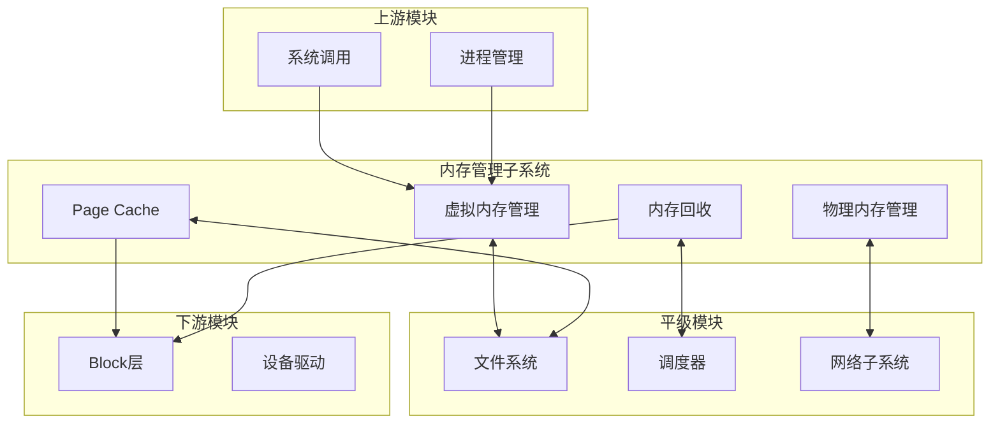

# 内存与其他子系统交互

## 学习目标

- 理解内存管理与进程管理的交互
- 掌握内存管理与文件系统的交互
- 了解内存管理与 Block 层的交互
- 理解内存管理与调度器的交互

## 一、交互总览

### 1.1 内存子系统的位置



### 1.2 交互关系概览

| 模块 | 交互类型 | 交互内容 |
|-----|---------|---------|
| 进程管理 | 双向 | mm_struct, fork/exec, 进程退出 |
| 文件系统 | 双向 | Page Cache, mmap, 脏页回写 |
| Block 层 | 单向(下游) | swap I/O, 脏页回写 |
| 调度器 | 双向 | kswapd, 内存压力, 等待 |
| 网络子系统 | 单向(提供) | sk_buff 内存分配 |

---

## 二、与进程管理的交互

### 2.1 进程创建 (fork)

```c
// kernel/fork.c

// fork 时复制内存描述符
static int copy_mm(unsigned long clone_flags, struct task_struct *tsk)
{
    struct mm_struct *mm, *oldmm;
    
    oldmm = current->mm;
    if (!oldmm)
        return 0;  // 内核线程没有 mm
    
    // 线程共享地址空间
    if (clone_flags & CLONE_VM) {
        mmget(oldmm);
        tsk->mm = oldmm;
        return 0;
    }
    
    // 进程复制地址空间
    mm = dup_mm(tsk, current->mm);
    if (!mm)
        return -ENOMEM;
    
    tsk->mm = mm;
    return 0;
}

// 复制 mm_struct
static struct mm_struct *dup_mm(struct task_struct *tsk, struct mm_struct *oldmm)
{
    struct mm_struct *mm;
    
    // 分配新的 mm_struct
    mm = allocate_mm();
    
    // 复制内容
    memcpy(mm, oldmm, sizeof(*mm));
    
    // 分配新的页表
    if (mm_alloc_pgd(mm))
        goto fail;
    
    // 复制所有 VMA (使用 COW)
    if (dup_mmap(mm, oldmm))
        goto fail;
    
    return mm;
}

// 复制 VMA (写时复制)
static int dup_mmap(struct mm_struct *mm, struct mm_struct *oldmm)
{
    struct vm_area_struct *vma, *tmp;
    
    for (vma = oldmm->mmap; vma; vma = vma->vm_next) {
        // 分配新 VMA
        tmp = vm_area_dup(vma);
        
        // 复制页表 (设置为只读实现 COW)
        copy_page_range(mm, oldmm, tmp, vma);
        
        // 插入 VMA 到新 mm
        insert_vm_struct(mm, tmp);
    }
    
    return 0;
}
```

### 2.2 进程执行 (exec)

```c
// fs/exec.c

// exec 时替换地址空间
static int exec_mmap(struct mm_struct *mm)
{
    struct mm_struct *old_mm;
    
    old_mm = current->mm;
    
    // 切换到新的 mm
    current->mm = mm;
    current->active_mm = mm;
    
    // 激活新地址空间
    activate_mm(old_mm, mm);
    
    // 释放旧 mm
    if (old_mm) {
        mmput(old_mm);
    }
    
    return 0;
}
```

### 2.3 进程退出

```c
// kernel/exit.c

// 进程退出时释放内存
static void exit_mm(void)
{
    struct mm_struct *mm = current->mm;
    
    // 解除所有映射
    // 释放页表
    // 释放 mm_struct
    mmput(mm);
    
    current->mm = NULL;
}

// mm/mmap.c
void mmput(struct mm_struct *mm)
{
    if (atomic_dec_and_test(&mm->mm_users)) {
        // 最后一个用户
        __mmput(mm);
    }
}

static void __mmput(struct mm_struct *mm)
{
    // 释放所有 VMA
    exit_mmap(mm);
    
    // 释放页表
    mm_free_pgd(mm);
    
    // 释放 mm_struct
    if (atomic_dec_and_test(&mm->mm_count))
        free_mm(mm);
}
```

### 2.4 task_struct 与 mm_struct 关系

```c
// include/linux/sched.h
struct task_struct {
    // ...
    struct mm_struct *mm;        // 用户空间 mm
    struct mm_struct *active_mm; // 活跃 mm（内核线程借用）
    // ...
};

// 关系：
// - 用户进程：mm != NULL, active_mm == mm
// - 内核线程：mm == NULL, active_mm 借用上一个用户进程的
// - 线程：共享 mm (CLONE_VM)
```

---

## 三、与文件系统的交互

### 3.1 Page Cache

```c
// mm/filemap.c

// 文件读取通过 Page Cache
ssize_t generic_file_read_iter(struct kiocb *iocb, struct iov_iter *iter)
{
    struct file *file = iocb->ki_filp;
    struct address_space *mapping = file->f_mapping;
    
    // 从 Page Cache 读取
    // 不在缓存中则从文件系统读取
    return filemap_read(iocb, iter, retval);
}

// 文件写入通过 Page Cache
ssize_t generic_file_write_iter(struct kiocb *iocb, struct iov_iter *from)
{
    struct file *file = iocb->ki_filp;
    struct address_space *mapping = file->f_mapping;
    
    // 写入 Page Cache
    // 标记为脏页
    // 后续由回写机制写入磁盘
    return __generic_file_write_iter(iocb, from);
}
```

### 3.2 mmap 文件映射

```c
// mm/mmap.c

// mmap 系统调用
unsigned long do_mmap(struct file *file, ...)
{
    if (file) {
        // 文件映射
        // 调用文件系统的 mmap 方法
        error = call_mmap(file, vma);
    } else {
        // 匿名映射
    }
}

// 文件系统提供 vm_ops
// fs/ext4/file.c
const struct vm_operations_struct ext4_file_vm_ops = {
    .fault          = ext4_filemap_fault,   // 缺页处理
    .map_pages      = filemap_map_pages,    // 批量映射
    .page_mkwrite   = ext4_page_mkwrite,    // 写保护处理
};
```

### 3.3 脏页回写

```c
// mm/page-writeback.c

// 内存系统触发回写
void balance_dirty_pages(struct bdi_writeback *wb, unsigned long pages_dirtied)
{
    // 检查脏页比例
    if (dirty_exceeded) {
        // 触发回写
        wb_start_writeback(wb, nr_pages);
        
        // 如果压力太大，等待
        if (dirty > dirty_ratelimit) {
            io_schedule_timeout(pause);
        }
    }
}

// 回写线程
void wb_workfn(struct work_struct *work)
{
    // 周期性检查脏页
    // 回写超时或超量的脏页
    wb_do_writeback(wb);
}
```

---

## 四、与 Block 层的交互

### 4.1 Page Cache 回写

```c
// mm/page-writeback.c -> fs/* -> block/*

// 回写流程
Page Cache (脏页)
    │
    ▼
文件系统 writepage()
    │
    ▼
submit_bio()
    │
    ▼
Block 层处理
    │
    ▼
设备驱动
```

```c
// fs/ext4/inode.c
static int ext4_writepage(struct page *page, struct writeback_control *wbc)
{
    // 获取块映射
    // 构建 bio
    // 提交到 Block 层
    return ext4_bio_write_page(page, wbc);
}
```

### 4.2 Swap I/O

```c
// mm/page_io.c

// 换出页面
int swap_writepage(struct page *page, struct writeback_control *wbc)
{
    struct swap_info_struct *sis = page_swap_info(page);
    
    // 构建 bio
    struct bio *bio = get_swap_bio(GFP_NOIO, page, end_swap_bio_write);
    
    // 提交到 Block 层
    bio_set_op_attrs(bio, REQ_OP_WRITE, REQ_SWAP);
    submit_bio(bio);
    
    return 0;
}

// 换入页面
int swap_readpage(struct page *page, bool synchronous)
{
    struct bio *bio = get_swap_bio(GFP_KERNEL, page, end_swap_bio_read);
    
    bio_set_op_attrs(bio, REQ_OP_READ, 0);
    submit_bio(bio);
    
    if (synchronous) {
        wait_on_page_locked(page);
    }
    
    return 0;
}
```

---

## 五、与调度器的交互

### 5.1 kswapd 调度

```c
// mm/vmscan.c

// kswapd 是内核线程，受调度器管理
static int kswapd(void *p)
{
    while (!kthread_should_stop()) {
        // 等待唤醒
        kswapd_try_to_sleep(pgdat, highest_zoneidx);
        
        // 执行回收
        balance_pgdat(pgdat, order, highest_zoneidx);
    }
    return 0;
}

// 唤醒 kswapd
void wakeup_kswapd(struct zone *zone, ...)
{
    // 设置唤醒条件
    pgdat->kswapd_order = order;
    
    // 唤醒 kswapd 线程
    wake_up_interruptible(&pgdat->kswapd_wait);
}
```

### 5.2 内存分配等待

```c
// mm/page_alloc.c

// 内存分配失败时可能等待
static inline struct page *__alloc_pages_slowpath(...)
{
    // 直接回收
    page = __alloc_pages_direct_reclaim(gfp_mask, order, ...);
    
    if (!page) {
        // 可能需要等待 kswapd
        congestion_wait(BLK_RW_ASYNC, HZ/50);
        
        // 再次尝试
        page = get_page_from_freelist(...);
    }
    
    return page;
}
```

### 5.3 内存压力通知

```c
// mm/vmpressure.c

// 内存压力通知机制
void vmpressure(gfp_t gfp, struct mem_cgroup *memcg, bool tree,
                unsigned long scanned, unsigned long reclaimed)
{
    // 计算压力级别
    pressure = vmpressure_calc_pressure(scanned, reclaimed);
    
    // 通知注册的回调
    vmpressure_notify(level);
}

// Android 使用此机制
// LMKD 注册回调监听内存压力
```

---

## 六、与网络子系统的交互

### 6.1 sk_buff 分配

```c
// net/core/skbuff.c

// 网络缓冲区分配
struct sk_buff *__alloc_skb(unsigned int size, gfp_t gfp_mask, ...)
{
    // 从 slab 分配 sk_buff 结构
    skb = kmem_cache_alloc_node(skbuff_head_cache, gfp_mask, node);
    
    // 分配数据区
    data = kmalloc_reserve(size, gfp_mask, node, &pfmemalloc);
    
    return skb;
}

// 紧急内存分配（PF_MEMALLOC）
// 网络子系统可能需要在内存压力下分配内存
// 以便完成回写操作
```

### 6.2 sendfile 零拷贝

```c
// mm/filemap.c + net/socket.c

// sendfile 利用 Page Cache 实现零拷贝
ssize_t do_sendfile(int out_fd, int in_fd, ...)
{
    // 从 Page Cache 获取页面
    // 直接传递给网络层
    // 无需复制数据
    splice_direct_to_actor(in, &sd, direct_splice_actor);
}
```

---

## 七、交互总结图

```
                    用户空间
                       │
                       │ 系统调用
                       ▼
┌─────────────────────────────────────────────────────────────┐
│                     VFS / 系统调用                           │
└─────────────────────────────────────────────────────────────┘
         │                    │                    │
         │                    │                    │
    ┌────▼────┐          ┌────▼────┐         ┌────▼────┐
    │进程管理  │◄────────►│内存管理  │◄───────►│文件系统  │
    │         │          │         │          │         │
    │mm_struct│          │Page Cache│         │address_ │
    │fork/exec│          │VMA 管理  │         │space    │
    └─────────┘          │页面回收  │          └────┬────┘
                         └────┬────┘               │
                              │                    │
                              │ swap / writeback   │
                              │                    │
                         ┌────▼────────────────────▼────┐
                         │         Block 层             │
                         └──────────────┬───────────────┘
                                        │
                                        ▼
                         ┌─────────────────────────────┐
                         │         设备驱动            │
                         └─────────────────────────────┘

调度器交互：
- kswapd 线程调度
- 内存等待/唤醒
- 内存压力通知
```

---

## 总结

### 关键交互点

| 子系统 | 交互点 | 说明 |
|-------|-------|------|
| 进程管理 | mm_struct | fork/exec/exit 时的内存操作 |
| 文件系统 | Page Cache | 文件缓存，mmap |
| Block 层 | submit_bio | swap 和脏页回写 |
| 调度器 | kswapd | 后台回收线程 |
| 网络 | sk_buff | 网络缓冲区分配 |

### 交互特点

1. **进程管理**：紧密耦合，共同管理地址空间
2. **文件系统**：Page Cache 是核心交互点
3. **Block 层**：下游单向依赖
4. **调度器**：协作完成内存回收

### 后续学习

- [内存性能分析与问题排查](20-内存性能分析与问题排查.md) - 实际问题诊断

## 参考资源

- 内核源码各子系统目录
- 内核文档：`Documentation/mm/`

## 更新记录

- 2026-01-28：初始创建，包含内存与其他子系统交互详解
