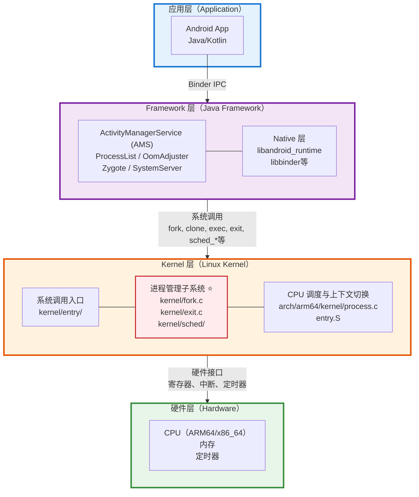
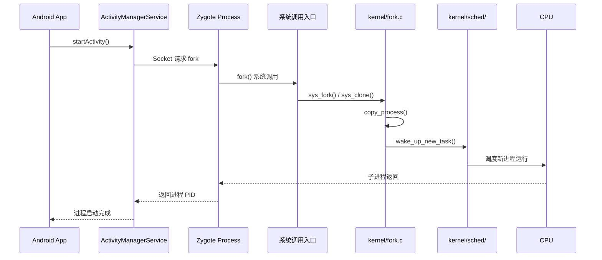
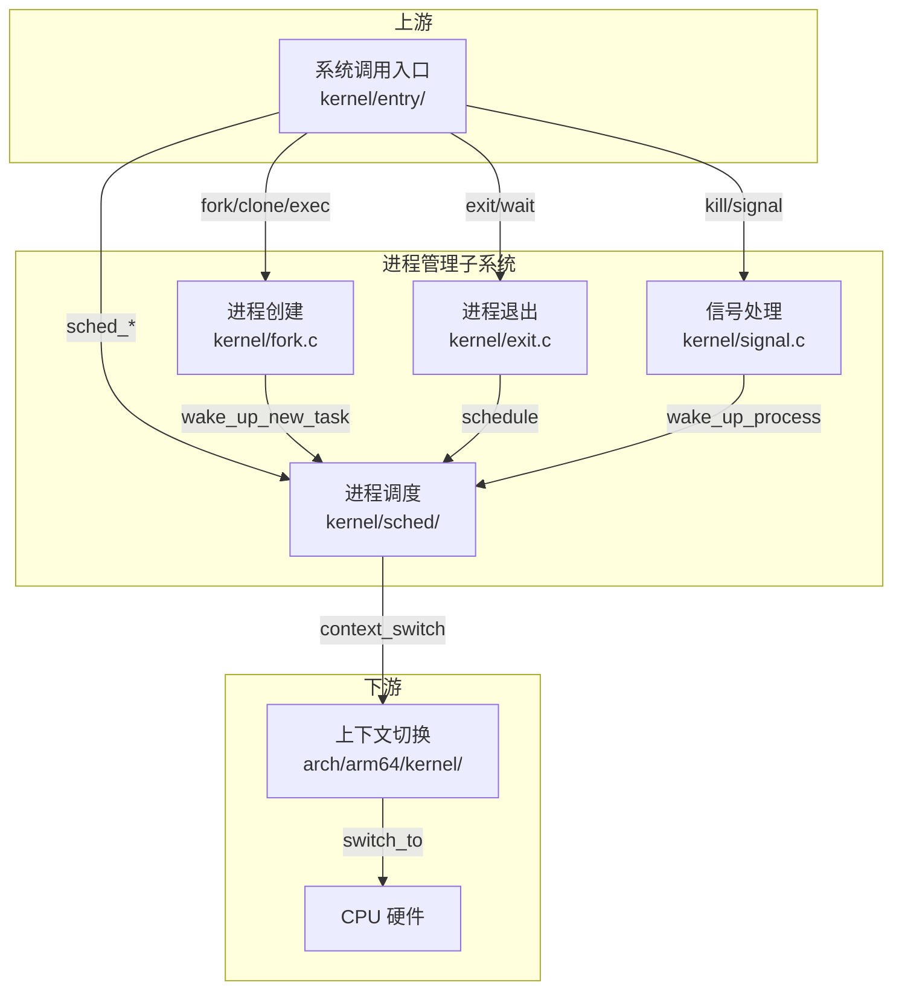
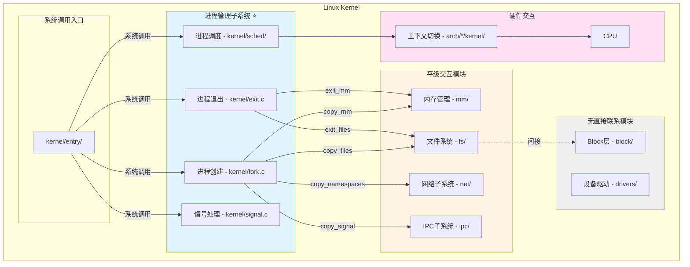
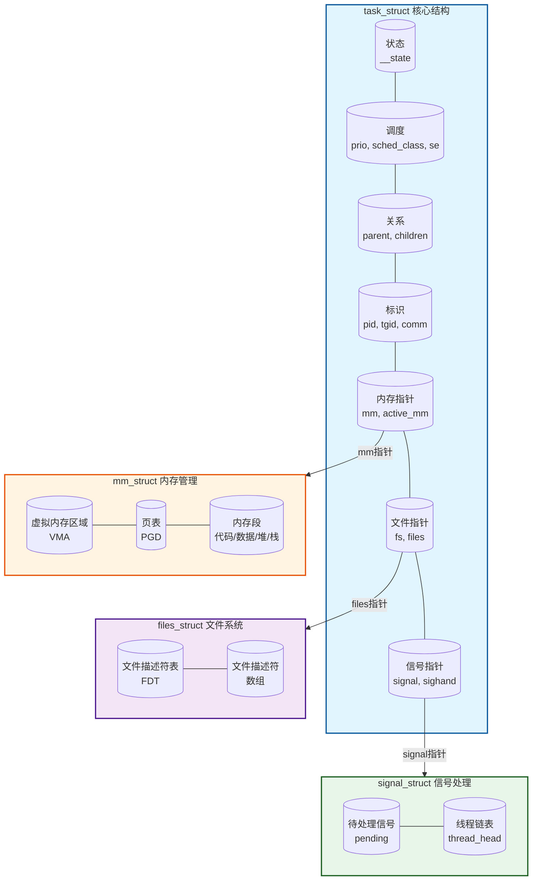

# 进程管理概述与架构设计

## 学习目标

- 从 Framework 层视角理解进程管理在整个系统架构中的位置
- 理解 Framework → Kernel → CPU 的完整交互链路
- 掌握进程管理子系统在 Kernel 内部的位置和上下游关系
- 了解进程管理子系统与其他 Kernel 模块的关系（平级交互、无直接联系）
- 理解进程管理子系统的核心职责和主要组件

## 一、系统整体架构视角（Framework → Kernel → CPU）

### Framework 层在 Android 系统架构中的位置

Android 系统采用分层架构，从应用层到硬件层，进程管理贯穿其中：



### Framework 层进程管理的核心组件

#### 1. Zygote 进程

**作用**：Android 应用进程的孵化器

```java
// Zygote 进程启动应用进程的核心逻辑
// frameworks/base/core/java/com/android/internal/os/ZygoteInit.java
public static void main(String argv[]) {
    // 1. 预加载类和资源
    preload();
    
    // 2. 启动 SystemServer
    if (startSystemServer) {
        Runnable r = forkSystemServer(abiList, socketName, zygoteServer);
        if (r != null) {
            r.run();
            return;
        }
    }
    
    // 3. 等待 AMS 请求 fork 新进程
    zygoteServer.runSelectLoop(abiList);
}
```

**特点**：
- 所有应用进程都是 Zygote fork 出来的
- 预加载常用类和资源，加速应用启动
- 通过 Socket 与 AMS 通信

#### 2. SystemServer 进程

**作用**：系统服务的宿主进程

```java
// SystemServer 启动系统服务
// frameworks/base/services/java/com/android/server/SystemServer.java
private void startBootstrapServices() {
    // 启动 AMS
    mActivityManagerService = ActivityManagerService.Lifecycle.startService(
            mSystemServiceManager, atm);
    
    // 启动 PMS
    mPackageManagerService = PackageManagerService.main(mSystemContext, ...);
}
```

**关键服务**：
- ActivityManagerService (AMS)：进程生命周期管理
- ProcessList：进程列表管理
- OomAdjuster：OOM 优先级调整

#### 3. ActivityManagerService (AMS)

**作用**：管理应用进程的生命周期

```java
// AMS 启动进程
// frameworks/base/services/core/java/com/android/server/am/ActivityManagerService.java
final ProcessRecord startProcessLocked(String processName, ApplicationInfo info, ...) {
    // 1. 检查进程是否已存在
    ProcessRecord app = getProcessRecordLocked(processName, info.uid, keepIfLarge);
    
    // 2. 请求 Zygote fork 新进程
    final Process.ProcessStartResult startResult = Process.start(
            entryPoint,
            app.processName, uid, uid, gids, ...);
    
    return app;
}
```

### Framework → Kernel 的完整交互链路

当 Android 应用启动时，进程创建的完整路径：



### Framework 层如何通过系统调用与 Kernel 交互

Framework 层通过以下系统调用与 Kernel 进程管理子系统交互：

#### 1. 进程创建类系统调用

| 系统调用 | 功能 | Framework 使用场景 |
|---------|------|-------------------|
| `fork()` | 创建子进程（完整复制） | Zygote fork 应用进程 |
| `clone()` | 创建子进程（可选共享） | 创建线程 |
| `vfork()` | 创建子进程（共享地址空间） | 快速 fork + exec |

```c
// 系统调用定义
// kernel/fork.c
SYSCALL_DEFINE0(fork)
{
    struct kernel_clone_args args = {
        .exit_signal = SIGCHLD,
    };
    return kernel_clone(&args);
}

SYSCALL_DEFINE5(clone, unsigned long, clone_flags, unsigned long, newsp,
                int __user *, parent_tidptr, int __user *, child_tidptr,
                unsigned long, tls)
{
    struct kernel_clone_args args = {
        .flags      = (clone_flags & ~CSIGNAL),
        .pidfd      = parent_tidptr,
        .child_tid  = child_tidptr,
        .parent_tid = parent_tidptr,
        .exit_signal = (clone_flags & CSIGNAL),
        .stack      = newsp,
        .tls        = tls,
    };
    return kernel_clone(&args);
}
```

#### 2. 进程执行类系统调用

| 系统调用 | 功能 | Framework 使用场景 |
|---------|------|-------------------|
| `execve()` | 执行新程序 | 启动 Native 进程 |
| `execveat()` | 带目录 fd 的 execve | 安全执行 |

```c
// kernel/exec.c
SYSCALL_DEFINE3(execve,
                const char __user *, filename,
                const char __user *const __user *, argv,
                const char __user *const __user *, envp)
{
    return do_execve(getname(filename), argv, envp);
}
```

#### 3. 进程退出类系统调用

| 系统调用 | 功能 | Framework 使用场景 |
|---------|------|-------------------|
| `exit()` | 退出进程 | 进程正常退出 |
| `exit_group()` | 退出线程组 | 多线程进程退出 |
| `wait4()` | 等待子进程 | 回收子进程资源 |
| `waitid()` | 等待子进程（扩展） | 更灵活的等待 |

```c
// kernel/exit.c
SYSCALL_DEFINE1(exit, int, error_code)
{
    do_exit((error_code&0xff)<<8);
}

SYSCALL_DEFINE1(exit_group, int, error_code)
{
    do_group_exit((error_code & 0xff) << 8);
    /* NOTREACHED */
    return 0;
}
```

#### 4. 进程调度类系统调用

| 系统调用 | 功能 | Framework 使用场景 |
|---------|------|-------------------|
| `sched_setscheduler()` | 设置调度策略 | 设置线程调度策略 |
| `sched_setparam()` | 设置调度参数 | 设置优先级 |
| `setpriority()` | 设置 nice 值 | 调整进程优先级 |
| `sched_setaffinity()` | 设置 CPU 亲和性 | 绑定 CPU |

```c
// kernel/sched/core.c
SYSCALL_DEFINE3(sched_setscheduler, pid_t, pid, int, policy,
                struct sched_param __user *, param)
{
    return do_sched_setscheduler(pid, policy, param);
}
```

### Framework 层如何感知进程状态

Framework 层**不能直接感知** Kernel 进程管理子系统的内部状态，但可以通过以下方式间接感知：

#### 1. 通过 /proc 文件系统

```java
// 读取进程状态
// /proc/<pid>/stat
// /proc/<pid>/status
// /proc/<pid>/oom_score_adj

// Android 读取进程内存信息
// frameworks/base/core/java/android/os/Debug.java
public static native void getMemoryInfo(int pid, MemoryInfo memoryInfo);
```

#### 2. 通过系统调用返回值

```java
// fork() 返回 PID 或错误码
// wait() 返回子进程退出状态
int pid = Os.fork();
if (pid == 0) {
    // 子进程
} else if (pid > 0) {
    // 父进程
} else {
    // 错误
}
```

#### 3. 通过信号

```java
// 接收 SIGCHLD 信号得知子进程退出
// 通过 SignalHandler 处理
```

---

## 二、Kernel 内部架构视角

### Kernel 内部的主要子系统划分

Linux Kernel 内部主要分为以下几个子系统：

```
┌─────────────────────────────────────────────────────────────┐
│                  Linux Kernel 内部架构                        │
│                                                              │
│  ┌──────────────┐  ┌──────────────┐  ┌──────────────┐      │
│  │ 进程管理 ⭐  │  │  内存管理    │  │  文件系统    │      │
│  │ kernel/      │  │   mm/        │  │   fs/        │      │
│  │ fork.c       │  │              │  │              │      │
│  │ exit.c       │  │              │  │              │      │
│  │ sched/       │  │              │  │              │      │
│  └──────┬───────┘  └──────┬───────┘  └──────┬───────┘      │
│         │                 │                 │               │
│         │    平级交互     │    平级交互     │               │
│         ├─────────────────┼─────────────────┤               │
│         │                 │                 │               │
│  ┌──────▼───────┐  ┌──────▼───────┐  ┌──────▼───────┐      │
│  │  网络子系统  │  │  IPC 子系统  │  │  设备驱动    │      │
│  │   net/       │  │   ipc/       │  │  drivers/    │      │
│  └──────────────┘  └──────────────┘  └──────────────┘      │
│                                                              │
│  ┌──────────────┐  ┌──────────────┐                        │
│  │  Block 层    │  │  安全子系统  │  ← 与进程管理无直接联系 │
│  │  block/      │  │  security/   │                        │
│  └──────────────┘  └──────────────┘                        │
└─────────────────────────────────────────────────────────────┘
```

### 进程管理子系统在 Kernel 中的位置

进程管理子系统是 Linux Kernel 的核心子系统之一，负责：
- 进程的创建和销毁
- 进程的调度
- 进程间通信
- 进程状态管理

**源码位置**：
- `kernel/fork.c` - 进程创建
- `kernel/exit.c` - 进程退出
- `kernel/sched/` - 进程调度
- `kernel/signal.c` - 信号处理
- `kernel/sys.c` - 系统调用

### 进程管理子系统的上下游关系



#### 上游：系统调用入口

**系统调用入口如何调用进程管理子系统**：

```c
// arch/arm64/kernel/syscall.c
static void invoke_syscall(struct pt_regs *regs, unsigned int scno,
                           unsigned int sc_nr,
                           const syscall_fn_t syscall_table[])
{
    long ret;
    
    if (scno < sc_nr) {
        syscall_fn_t syscall_fn;
        syscall_fn = syscall_table[array_index_nospec(scno, sc_nr)];
        ret = __invoke_syscall(regs, syscall_fn);
    } else {
        ret = do_ni_syscall(regs);
    }
    
    regs->regs[0] = ret;
}
```

**关键转换点**：
- `sys_fork()` → `kernel_clone()` → `copy_process()`
- `sys_exit()` → `do_exit()`
- `sys_sched_setscheduler()` → `do_sched_setscheduler()`

#### 下游：CPU 调度与上下文切换

**进程管理如何调用下游**：

```c
// kernel/sched/core.c
static void __sched notrace __schedule(unsigned int sched_mode)
{
    struct task_struct *prev, *next;
    struct rq *rq;
    int cpu;
    
    cpu = smp_processor_id();
    rq = cpu_rq(cpu);
    prev = rq->curr;
    
    // 选择下一个要运行的进程
    next = pick_next_task(rq, prev, &rf);
    
    if (likely(prev != next)) {
        // 上下文切换
        rq = context_switch(rq, prev, next, &rf);
    }
}

// kernel/sched/core.c
static __always_inline struct rq *
context_switch(struct rq *rq, struct task_struct *prev,
               struct task_struct *next, struct rq_flags *rf)
{
    // 切换地址空间
    if (!next->mm) {
        // 内核线程
        next->active_mm = prev->active_mm;
    } else {
        // 用户进程
        switch_mm_irqs_off(prev->active_mm, next->mm, next);
    }
    
    // 切换寄存器上下文
    switch_to(prev, next, prev);
    
    return finish_task_switch(prev);
}
```

### 进程管理子系统的同级模块关系

#### 1. 与内存管理（mm/）的关系 —— 有直接联系

**交互场景**：
- 进程创建时复制/共享地址空间（mm_struct）
- 写时复制（COW）机制
- 进程退出时释放内存

```c
// kernel/fork.c - 进程创建时与内存管理的交互
static int copy_mm(unsigned long clone_flags, struct task_struct *tsk)
{
    struct mm_struct *mm, *oldmm;
    
    oldmm = current->mm;
    if (!oldmm)
        return 0;
    
    if (clone_flags & CLONE_VM) {
        // 共享地址空间（线程）
        mmget(oldmm);
        tsk->mm = oldmm;
        return 0;
    }
    
    // 复制地址空间（进程）
    mm = dup_mm(tsk, current->mm);
    if (!mm)
        return -ENOMEM;
    
    tsk->mm = mm;
    return 0;
}
```

**关系图**：
```
进程管理（kernel/fork.c）
      │
      │ copy_mm() / exit_mm()
      ▼
内存管理（mm/）
      │
      ├── mm_struct（内存描述符）
      ├── vm_area_struct（虚拟内存区域）
      └── 页表管理
```

#### 2. 与文件系统（fs/）的关系 —— 有直接联系

**交互场景**：
- 进程创建时复制/共享文件描述符表
- 进程的当前工作目录
- 进程的根目录

```c
// kernel/fork.c - 进程创建时与文件系统的交互
static int copy_files(unsigned long clone_flags, struct task_struct *tsk)
{
    struct files_struct *oldf, *newf;
    
    oldf = current->files;
    if (!oldf)
        return -EINVAL;
    
    if (clone_flags & CLONE_FILES) {
        // 共享文件描述符表（线程）
        atomic_inc(&oldf->count);
        tsk->files = oldf;
        return 0;
    }
    
    // 复制文件描述符表（进程）
    newf = dup_fd(oldf, NR_OPEN_MAX, &error);
    if (!newf)
        return error;
    
    tsk->files = newf;
    return 0;
}

static int copy_fs(unsigned long clone_flags, struct task_struct *tsk)
{
    struct fs_struct *fs = current->fs;
    
    if (clone_flags & CLONE_FS) {
        // 共享文件系统信息
        spin_lock(&fs->lock);
        fs->users++;
        spin_unlock(&fs->lock);
        return 0;
    }
    
    // 复制文件系统信息
    tsk->fs = copy_fs_struct(fs);
    return 0;
}
```

**关系图**：
```
进程管理（kernel/fork.c）
      │
      ├── copy_files() ──► files_struct（文件描述符表）
      │
      └── copy_fs() ──► fs_struct（工作目录、根目录）
```

#### 3. 与网络子系统（net/）的关系 —— 有直接联系

**交互场景**：
- 进程的网络命名空间
- Socket 与进程的关联

```c
// kernel/fork.c - 进程创建时与网络的交互
static int copy_namespaces(unsigned long flags, struct task_struct *tsk)
{
    struct nsproxy *new_ns;
    
    if (likely(!(flags & (CLONE_NEWNS | CLONE_NEWUTS | CLONE_NEWIPC |
                          CLONE_NEWPID | CLONE_NEWNET | ...)))) {
        // 共享命名空间
        get_nsproxy(tsk->nsproxy);
        return 0;
    }
    
    // 创建新的命名空间
    new_ns = create_new_namespaces(flags, tsk, ...);
    tsk->nsproxy = new_ns;
    return 0;
}
```

#### 4. 与 IPC 子系统（ipc/）的关系 —— 有直接联系

**交互场景**：
- 信号的发送和接收
- 共享内存、信号量、消息队列

```c
// kernel/fork.c - 进程创建时与信号的交互
static int copy_signal(unsigned long clone_flags, struct task_struct *tsk)
{
    struct signal_struct *sig;
    
    if (clone_flags & CLONE_THREAD) {
        // 线程共享信号处理
        return 0;
    }
    
    // 分配新的信号结构
    sig = kmem_cache_zalloc(signal_cachep, GFP_KERNEL);
    tsk->signal = sig;
    return 0;
}
```

#### 5. 与 Block 层（block/）的关系 —— 无直接联系

**特点**：
- Block 层负责块设备 IO 管理
- 进程管理不直接调用 Block 层
- 两者通过文件系统间接关联

**关系说明**：
```
进程管理 ─────────────────────────── Block 层
    │                                    │
    │ 无直接调用关系                      │
    │                                    │
    └──► 文件系统（fs/）──► VFS ──► Block 层
```

#### 6. 与设备驱动（drivers/）的关系 —— 无直接联系

**特点**：
- 设备驱动负责硬件交互
- 进程管理不直接调用设备驱动
- 设备驱动通过中断与进程管理交互（唤醒等待的进程）

### Kernel 内部模块关系总图



**图例说明**：
- **蓝色背景**：进程管理子系统（本系列重点）
- **黄色背景**：与进程管理有直接联系的模块
- **灰色背景**：与进程管理无直接联系的模块
- **粉色背景**：硬件交互层
- **实线箭头**：直接调用关系
- **虚线箭头**：间接关系

---

## 三、进程管理子系统内部架构

### 进程管理子系统的核心职责

进程管理子系统是 Linux 内核的核心子系统，主要职责包括：

1. **进程创建与销毁**
   - 创建新进程（fork/clone/vfork）
   - 执行新程序（exec）
   - 进程退出（exit）
   - 等待子进程（wait）

2. **进程调度**
   - 选择下一个运行的进程
   - 上下文切换
   - 负载均衡
   - 优先级管理

3. **进程间通信**
   - 信号（signal）
   - 管道（pipe）
   - 共享内存、信号量、消息队列

4. **进程状态管理**
   - 进程状态转换
   - 进程睡眠与唤醒
   - 进程组与会话管理

### 进程管理子系统的主要组件

```
┌─────────────────────────────────────────────────────────────┐
│                 进程管理子系统内部架构                        │
│                                                              │
│  ┌──────────────────────────────────────────────────────┐  │
│  │                 进程创建模块                          │  │
│  │  kernel/fork.c                                       │  │
│  │  ├── kernel_clone() - 进程创建入口                   │  │
│  │  ├── copy_process() - 复制进程                       │  │
│  │  └── wake_up_new_task() - 唤醒新进程                 │  │
│  └──────────────────────────────────────────────────────┘  │
│                           │                                 │
│  ┌──────────────────────────────────────────────────────┐  │
│  │                 进程执行模块                          │  │
│  │  kernel/exec.c, fs/exec.c                            │  │
│  │  ├── do_execveat_common() - exec 入口                │  │
│  │  ├── bprm_execve() - 执行二进制                      │  │
│  │  └── load_elf_binary() - 加载 ELF                    │  │
│  └──────────────────────────────────────────────────────┘  │
│                           │                                 │
│  ┌──────────────────────────────────────────────────────┐  │
│  │                 进程退出模块                          │  │
│  │  kernel/exit.c                                       │  │
│  │  ├── do_exit() - 进程退出                            │  │
│  │  ├── do_group_exit() - 线程组退出                    │  │
│  │  └── do_wait() - 等待子进程                          │  │
│  └──────────────────────────────────────────────────────┘  │
│                           │                                 │
│  ┌──────────────────────────────────────────────────────┐  │
│  │                 进程调度模块                          │  │
│  │  kernel/sched/                                       │  │
│  │  ├── core.c - 调度核心                               │  │
│  │  ├── fair.c - CFS 调度器                             │  │
│  │  ├── rt.c - 实时调度器                               │  │
│  │  └── deadline.c - Deadline 调度器                    │  │
│  └──────────────────────────────────────────────────────┘  │
│                           │                                 │
│  ┌──────────────────────────────────────────────────────┐  │
│  │                 信号处理模块                          │  │
│  │  kernel/signal.c                                     │  │
│  │  ├── do_send_sig_info() - 发送信号                   │  │
│  │  ├── get_signal() - 获取信号                         │  │
│  │  └── handle_signal() - 处理信号                      │  │
│  └──────────────────────────────────────────────────────┘  │
└─────────────────────────────────────────────────────────────┘
```

### 关键数据结构概览

#### 1. struct task_struct

**作用**：进程描述符，Linux 中最重要的数据结构之一

**定义位置**：`include/linux/sched.h`

```c
struct task_struct {
    // 进程状态
    unsigned int            __state;
    
    // 调度相关
    int                     prio;
    int                     static_prio;
    int                     normal_prio;
    const struct sched_class *sched_class;
    struct sched_entity     se;
    
    // 进程关系
    struct task_struct      *parent;
    struct list_head        children;
    struct list_head        sibling;
    
    // 内存管理
    struct mm_struct        *mm;
    struct mm_struct        *active_mm;
    
    // 文件系统
    struct fs_struct        *fs;
    struct files_struct     *files;
    
    // 信号处理
    struct signal_struct    *signal;
    struct sighand_struct   *sighand;
    
    // 进程标识
    pid_t                   pid;
    pid_t                   tgid;
    
    // 进程名称
    char                    comm[TASK_COMM_LEN];
    
    // ... 更多字段
};
```

#### 2. struct mm_struct

**作用**：内存描述符，描述进程的地址空间

```c
struct mm_struct {
    struct vm_area_struct *mmap;       // VMA 链表
    struct rb_root mm_rb;               // VMA 红黑树
    pgd_t *pgd;                         // 页全局目录
    atomic_t mm_users;                  // 用户计数
    atomic_t mm_count;                  // 引用计数
    unsigned long start_code, end_code; // 代码段
    unsigned long start_data, end_data; // 数据段
    unsigned long start_brk, brk;       // 堆
    unsigned long start_stack;          // 栈
    // ...
};
```

#### 3. struct files_struct

**作用**：文件描述符表

```c
struct files_struct {
    atomic_t count;                     // 引用计数
    struct fdtable __rcu *fdt;          // 文件描述符表
    struct fdtable fdtab;               // 内嵌的小表
    spinlock_t file_lock;               // 锁
    unsigned int next_fd;               // 下一个可用 fd
    // ...
};
```

#### 4. struct signal_struct

**作用**：信号处理结构

```c
struct signal_struct {
    refcount_t sigcnt;                  // 引用计数
    atomic_t live;                      // 存活线程数
    struct list_head thread_head;       // 线程链表
    wait_queue_head_t wait_chldexit;    // 等待子进程退出
    struct task_struct *curr_target;    // 当前信号目标
    struct sigpending shared_pending;   // 共享的待处理信号
    // ...
};
```

#### 数据结构关系图



---

## 总结

### 核心要点

1. **进程管理子系统的位置**：
   - 位于系统调用入口和 CPU 硬件之间
   - 是 Kernel 的核心子系统之一

2. **上下游关系**：
   - **上游**：系统调用入口通过 `sys_fork()`、`sys_exit()` 等调用进程管理
   - **下游**：进程管理通过 `context_switch()` 调用 CPU 上下文切换

3. **同级模块关系**：
   - **有直接联系**：内存管理（mm/）、文件系统（fs/）、网络（net/）、IPC（ipc/）
   - **无直接联系**：Block 层（block/）、设备驱动（drivers/）

4. **Framework 与 Kernel 的交互**：
   - Framework 层通过系统调用触发进程操作
   - Kernel 层通过回调和信号通知 Framework 层
   - Framework 层通过 /proc 文件系统查询进程状态

5. **进程管理子系统的核心组件**：
   - 进程创建模块（fork.c）
   - 进程执行模块（exec.c）
   - 进程退出模块（exit.c）
   - 进程调度模块（sched/）
   - 信号处理模块（signal.c）

### 关键概念

- **进程管理子系统**：Linux 内核中负责进程生命周期管理的核心子系统
- **task_struct**：进程描述符，描述一个进程的所有信息
- **mm_struct**：内存描述符，描述进程的地址空间
- **系统调用**：Framework 层与 Kernel 层交互的标准接口

### 后续学习

- [进程核心数据结构](02-进程核心数据结构.md) - 深入理解 task_struct 等核心数据结构
- [进程生命周期总览](03-进程生命周期总览.md) - 理解进程从创建到销毁的完整路径
- [进程创建机制详解](04-进程创建机制详解.md) - 深入理解 fork/clone 的实现

## 参考资源

- 内核文档：`Documentation/process/`
- 内核源码：
  - `kernel/fork.c` - 进程创建
  - `kernel/exit.c` - 进程退出
  - `kernel/sched/` - 进程调度
  - `include/linux/sched.h` - task_struct 定义
- 相关文章：
  - `../syscalls/05-进程管理类系统调用.md` - 进程相关系统调用

## 更新记录

- 2026-01-27：初始创建，包含进程管理概述和三层递进架构设计
