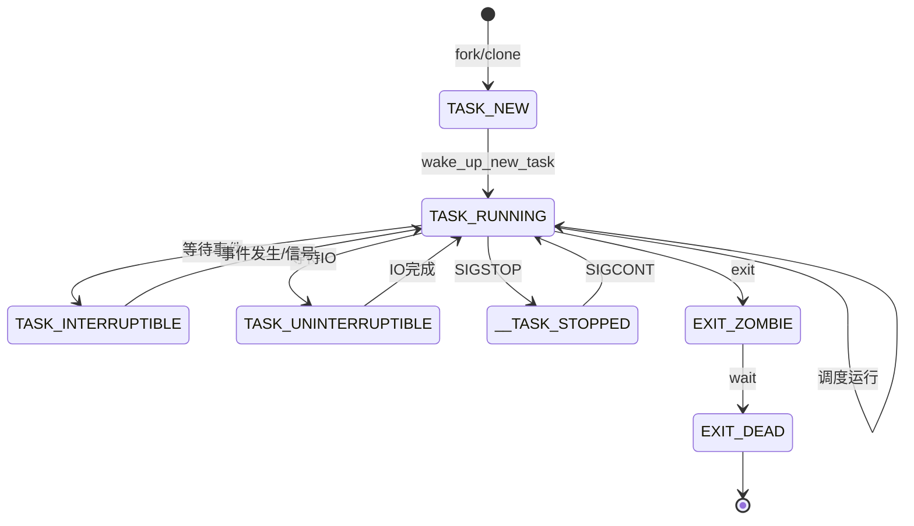
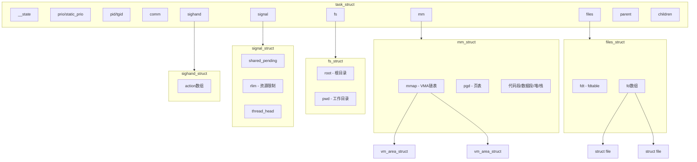

# 进程核心数据结构

## 学习目标

- 理解进程管理子系统的核心数据结构及其作用
- 掌握 task_struct、mm_struct、files_struct 等关键数据结构
- 理解数据结构之间的关系和生命周期
- 了解数据结构在进程创建、调度、退出中的使用场景
- 理解虚拟地址空间的独立性和页表映射机制
- 掌握不同类型进程（Java vs C++）在内存布局上的差异

## 概述

进程管理子系统的核心数据结构构成了整个进程管理系统的基础。理解这些数据结构对于深入理解 Linux 进程管理至关重要。

本文档将介绍以下核心数据结构：

1. **struct task_struct** - 进程描述符（最核心）
2. **struct mm_struct** - 内存描述符
3. **struct files_struct** - 文件描述符表
4. **struct fs_struct** - 文件系统信息
5. **struct signal_struct** - 信号处理结构
6. **struct thread_info** - 线程信息
7. **虚拟地址空间的独立性** - 每个进程的完整虚拟地址空间
8. **不同类型进程的内存布局** - Java进程 vs C++进程

---

## 一、struct task_struct - 进程描述符

### 定义位置

**头文件**：`include/linux/sched.h`

### 作用

`struct task_struct` 是 Linux 内核中最重要的数据结构，也是最大的数据结构之一。它描述了一个进程（或线程）的所有信息，包括：
- 进程状态
- 调度信息
- 进程关系
- 内存管理
- 文件系统
- 信号处理
- 进程标识

### 关键字段分类

#### 1. 进程状态相关

```c
struct task_struct {
    // 进程状态
    unsigned int            __state;
    
    // 退出状态
    int                     exit_state;
    int                     exit_code;
    int                     exit_signal;
    
    // 进程标志
    unsigned int            flags;
    // ...
};
```

**__state 可能的值**（定义在 `include/linux/sched.h`）：

```c
/* 进程状态 */
#define TASK_RUNNING            0x00000000  // 运行或就绪
#define TASK_INTERRUPTIBLE      0x00000001  // 可中断睡眠
#define TASK_UNINTERRUPTIBLE    0x00000002  // 不可中断睡眠
#define __TASK_STOPPED          0x00000004  // 停止
#define __TASK_TRACED           0x00000008  // 被跟踪
#define EXIT_DEAD               0x00000010  // 最终退出状态
#define EXIT_ZOMBIE             0x00000020  // 僵尸状态
#define TASK_PARKED             0x00000040  // 停放
#define TASK_DEAD               0x00000080  // 死亡
#define TASK_WAKEKILL           0x00000100  // 可被致命信号唤醒
#define TASK_WAKING             0x00000200  // 正在唤醒
#define TASK_NOLOAD             0x00000400  // 不计入负载
#define TASK_NEW                0x00000800  // 新创建
#define TASK_STATE_MAX          0x00001000
```

**状态转换图**：



**重要说明：TASK_RUNNING 状态的两种子状态**

在 Linux 内核中，`TASK_RUNNING` 状态实际上包含了两种子状态，通过 `on_cpu` 和 `on_rq` 字段来区分：

1. **正在运行（Running）**：
   - `__state = TASK_RUNNING` (0x00000000)
   - `on_rq = 1` (在运行队列中)
   - `on_cpu = 1` (正在 CPU 上执行)

2. **就绪（Runnable/Ready）**：
   - `__state = TASK_RUNNING` (0x00000000)
   - `on_rq = 1` (在运行队列中)
   - `on_cpu = 0` (不在 CPU 上，等待被调度)

**设计原因**：
- 从调度器的角度看，这两种状态都是"可调度"的，因此统一使用 `TASK_RUNNING` 状态
- 通过 `on_cpu` 字段可以快速判断任务是否正在执行
- 通过 `on_rq` 字段可以判断任务是否在运行队列中等待调度
- 这种设计简化了状态管理，避免了状态位的浪费

**总结**：runnable 状态 = `TASK_RUNNING` + `on_rq = 1` + `on_cpu = 0`

#### 2. 调度相关

```c
struct task_struct {
    // 优先级
    int                     prio;           // 动态优先级
    int                     static_prio;    // 静态优先级（nice 值映射）
    int                     normal_prio;    // 普通优先级
    unsigned int            rt_priority;    // 实时优先级
    
    // 调度类
    const struct sched_class *sched_class;
    
    // 调度实体
    struct sched_entity     se;             // CFS 调度实体
    struct sched_rt_entity  rt;             // RT 调度实体
    struct sched_dl_entity  dl;             // Deadline 调度实体
    
    // 调度策略
    unsigned int            policy;         // SCHED_NORMAL, SCHED_FIFO, etc.
    
    // CPU 相关
    int                     on_cpu;         // 是否正在 CPU 上运行（1=运行中，0=就绪等待）
    int                     on_rq;          // 是否在运行队列中（用于区分 TASK_RUNNING 的子状态）
    cpumask_t               cpus_mask;      // 允许的 CPU 掩码
    // ...
};
```

**调度策略**（定义在 `include/uapi/linux/sched.h`）：

```c
#define SCHED_NORMAL    0   // 普通进程（CFS）
#define SCHED_FIFO      1   // 实时先进先出
#define SCHED_RR        2   // 实时轮转
#define SCHED_BATCH     3   // 批处理
#define SCHED_IDLE      5   // 空闲
#define SCHED_DEADLINE  6   // Deadline
```

#### 3. 进程关系

```c
struct task_struct {
    // 父进程
    struct task_struct __rcu *parent;
    
    // 真实父进程（调试用）
    struct task_struct __rcu *real_parent;
    
    // 子进程链表
    struct list_head        children;
    
    // 兄弟进程链表
    struct list_head        sibling;
    
    // 线程组领头
    struct task_struct      *group_leader;
    
    // 线程链表
    struct list_head        thread_group;
    struct list_head        thread_node;
    // ...
};
```

**进程关系图**：

```
                    init (PID 1)
                         │
           ┌─────────────┼─────────────┐
           │             │             │
        systemd       zygote        kthreadd
           │             │             │
     ┌─────┼─────┐   ┌───┼───┐     ┌───┼───┐
     │     │     │   │   │   │     │   │   │
   AMS   PMS   WMS App1 App2 App3  kworker ...
   (线程组)
   │
   ├── main thread (group_leader)
   ├── Binder:xxx
   └── RenderThread
```

#### 4. 进程标识

```c
struct task_struct {
    // 进程 ID
    pid_t                   pid;            // 进程 ID
    pid_t                   tgid;           // 线程组 ID
    
    // PID 命名空间
    struct pid              *thread_pid;
    struct hlist_node       pid_links[PIDTYPE_MAX];
    
    // 进程名
    char                    comm[TASK_COMM_LEN];  // 16 字节
    
    // 凭证
    const struct cred __rcu *cred;
    
    // 命名空间
    struct nsproxy          *nsproxy;
    // ...
};
```

**pid 和 tgid 的区别**：

| 概念 | 说明 | 示例 |
|-----|------|-----|
| pid | 内核视角的进程 ID，每个 task_struct 唯一 | 主线程 1000，子线程 1001、1002 |
| tgid | 用户视角的进程 ID（getpid() 返回值） | 主线程和子线程都是 1000 |

```c
// 对于单线程进程：pid == tgid
// 对于多线程进程：
//   主线程：pid == tgid
//   子线程：pid != tgid，tgid 等于主线程的 pid
```

#### 5. 内存管理指针

```c
struct task_struct {
    // 内存描述符
    struct mm_struct        *mm;            // 用户空间内存
    struct mm_struct        *active_mm;     // 当前活跃的内存描述符
    
    // 栈
    void                    *stack;         // 内核栈指针
    // ...
};
```

**mm 和 active_mm 的区别与联系**：

| 进程类型 | mm | active_mm | 说明 |
|---------|----|-----------|------|
| 用户进程 | 指向自己的 mm_struct | 等于 mm | 拥有自己的地址空间 |
| 内核线程 | NULL | 借用前一个用户进程的 mm | 没有用户空间，但需要页表上下文 |

**核心概念**：

- **mm**：进程**拥有**的地址空间（用户进程有，内核线程为 NULL）
- **active_mm**：CPU 上**当前激活**的地址空间（用于页表切换）

**为什么内核线程要借用用户进程的页表？**

1. **内核线程只运行在内核空间**，而内核空间的页表映射在所有进程中都是相同的
2. **避免 TLB flush 开销**：切换页表需要刷新 TLB（Translation Lookaside Buffer），这是非常昂贵的操作
3. **借用机制**：内核线程借用前一个用户进程的页表，可以正常访问内核空间，同时避免不必要的页表切换

**代码中的使用**：

```c
// 判断是否是用户上下文
if (current->mm) {
    // 用户进程上下文
} else {
    // 内核线程上下文
}
```

> 📖 **深入阅读**：关于 mm 和 active_mm 的详细原理、TLB 机制、上下文切换中的处理流程，请参阅 [内存管理概述与架构设计](../mm/01-内存管理概述与架构设计.md)

#### 6. 文件系统指针

```c
struct task_struct {
    // 文件系统信息
    struct fs_struct        *fs;            // 工作目录、根目录
    
    // 文件描述符表
    struct files_struct     *files;         // 打开的文件
    // ...
};
```

#### 7. 信号处理指针

```c
struct task_struct {
    // 信号处理
    struct signal_struct    *signal;        // 信号结构
    struct sighand_struct   *sighand;       // 信号处理函数
    sigset_t                blocked;        // 阻塞的信号
    sigset_t                real_blocked;   // 真实阻塞的信号
    struct sigpending       pending;        // 待处理信号
    // ...
};
```

### task_struct 的分配

```c
// kernel/fork.c
static struct task_struct *dup_task_struct(struct task_struct *orig, int node)
{
    struct task_struct *tsk;
    unsigned long *stack;
    
    // 1. 分配 task_struct
    tsk = alloc_task_struct_node(node);
    if (!tsk)
        return NULL;
    
    // 2. 分配内核栈
    stack = alloc_thread_stack_node(tsk, node);
    if (!stack)
        goto free_tsk;
    
    // 3. 复制 task_struct
    *tsk = *orig;
    
    // 4. 设置栈指针
    tsk->stack = stack;
    
    // 5. 初始化 thread_info
    setup_thread_stack(tsk, orig);
    
    return tsk;
    
free_tsk:
    free_task_struct(tsk);
    return NULL;
}
```

---

## 二、struct mm_struct - 内存描述符

### 定义位置

**头文件**：`include/linux/mm_types.h`

### 作用

`struct mm_struct` 描述进程的地址空间，包括：
- 虚拟内存区域（VMA）
- 页表
- 内存统计信息

### 关键字段

> **注意**：从 Linux 6.1 开始，VMA 管理改用 **Maple Tree**（`mm_mt` 字段），`mmap`、`mm_rb`、`mmap_cache` 字段已被移除/替换。

```c
struct mm_struct {
    // VMA 管理（Linux 5.x 及之前）
    struct vm_area_struct *mmap;        // VMA 链表（6.1+ 已移除）
    struct rb_root mm_rb;               // VMA 红黑树（6.1+ 改为 maple_tree mm_mt）
    struct vm_area_struct *mmap_cache;  // 最近访问的 VMA（6.1+ 已移除）
    
    // 页表
    pgd_t *pgd;                         // 页全局目录
    
    // 引用计数
    atomic_t mm_users;                  // 使用此 mm 的进程数
    atomic_t mm_count;                  // mm_struct 引用计数
    
    // VMA 计数
    int map_count;                      // VMA 数量
    
    // 地址空间边界
    unsigned long start_code, end_code;     // 代码段
    unsigned long start_data, end_data;     // 数据段
    unsigned long start_brk, brk;           // 堆
    unsigned long start_stack;              // 栈起始地址
    unsigned long arg_start, arg_end;       // 参数区
    unsigned long env_start, env_end;       // 环境变量区
    
    // 内存统计
    unsigned long total_vm;             // 总页数
    unsigned long locked_vm;            // 锁定的页数
    unsigned long pinned_vm;            // 固定的页数
    unsigned long data_vm;              // 数据段页数
    unsigned long exec_vm;              // 可执行页数
    unsigned long stack_vm;             // 栈页数
    
    // 锁
    spinlock_t page_table_lock;         // 页表锁
    struct rw_semaphore mmap_lock;      // mmap 锁
    
    // 内存映射基地址
    unsigned long mmap_base;            // mmap 区域基地址
    
    // 上下文信息
    mm_context_t context;               // 架构相关上下文
    // ...
};
```

### 地址空间布局

```
⚠️ 重要理解：这是【单个进程】的虚拟地址空间布局！

每个进程都有自己独立的虚拟地址空间，
每个进程看到的虚拟地址范围都是一样的！

进程1的虚拟地址空间：

0xFFFF_FFFF_FFFF_FFFF ┌─────────────────────────┐
                      │      内核空间           │ ← 所有进程共享
0xFFFF_0000_0000_0000 ├─────────────────────────┤
                      │      (未使用)           │
                      │                         │
0x0000_FFFF_FFFF_FFFF ├─────────────────────────┤
                      │      栈 (向下增长)      │ ← start_stack
                      │         ↓               │ ← 进程1独有
                      ├─────────────────────────┤
                      │      (空洞)             │
                      ├─────────────────────────┤
                      │      mmap 区域          │ ← mmap_base
                      │   (共享库、文件映射)    │ ← 进程1独有
                      │         ↓               │
                      ├─────────────────────────┤
                      │      (空洞)             │
                      ├─────────────────────────┤
                      │         ↑               │
                      │      堆 (向上增长)      │ ← brk
                      │                         │ ← start_brk
                      ├─────────────────────────┤ ← 进程1独有
                      │      BSS 段             │
                      ├─────────────────────────┤
                      │      数据段             │ ← start_data, end_data
                      ├─────────────────────────┤ ← 进程1独有
                      │      代码段             │ ← start_code, end_code
0x0000_0000_0040_0000 ├─────────────────────────┤ ← 进程1独有
                      │      (保留)             │
0x0000_0000_0000_0000 └─────────────────────────┘


进程2也有完全相同范围的虚拟地址空间：

0xFFFF_FFFF_FFFF_FFFF ┌─────────────────────────┐
                      │      内核空间           │ ← 所有进程共享
0xFFFF_0000_0000_0000 ├─────────────────────────┤
                      │      栈                 │ ← 进程2独有
                      │      mmap 区域          │ ← 进程2独有
                      │      堆                 │ ← 进程2独有
                      │      数据段             │ ← 进程2独有
                      │      代码段             │ ← 进程2独有
0x0000_0000_0000_0000 └─────────────────────────┘


关键理解：
✓ 每个进程的虚拟地址空间是独立的、完整的
✓ 每个进程的代码段可能都在虚拟地址 0x400000
✓ 每个进程的栈可能都在虚拟地址 0x7FFF_FFFF_0000
✓ 但它们通过不同的页表映射到不同的物理内存
✓ 进程看不到其他进程的内存
✓ 这就是内存隔离和保护的基础
```

### 深入理解：虚拟地址空间的独立性

#### 关键概念澄清

**您的原理解是正确的**：每个用户进程的虚拟地址空间是连续的（0x0000_0000_0000_0000 到 0x0000_FFFF_FFFF_FFFF）。

**关键点**：100个进程不是共享一个虚拟地址空间，而是**每个进程都有自己独立的虚拟地址空间**。

#### 虚拟地址空间 vs 物理内存

```
=== 错误理解 ===

100个进程共享一个虚拟地址空间：
┌──────────────────────────────────────────┐
│  虚拟地址空间（所有进程共享）            │
│  ┌─────────────┐                          │
│  │ 进程1代码段 │ 0x00400000               │
│  ├─────────────┤                          │
│  │ 进程2代码段 │ 0x00500000               │
│  ├─────────────┤                          │
│  │ 进程3代码段 │ 0x00600000               │
│  ├─────────────┤                          │
│  │ ...         │                          │
│  └─────────────┘                          │
└──────────────────────────────────────────┘
❌ 这是错误的！


=== 正确理解 ===

每个进程都有独立的虚拟地址空间：

进程1的虚拟地址空间：        进程2的虚拟地址空间：
┌──────────────────┐         ┌──────────────────┐
│ 0x7FFF_F000      │         │ 0x7FFF_F000      │
│ 进程1的栈        │         │ 进程2的栈        │
│ ...              │         │ ...              │
│ 0x0040_0000      │         │ 0x0040_0000      │
│ 进程1的代码段    │         │ 进程2的代码段    │
└──────────────────┘         └──────────────────┘
        ↓                            ↓
   进程1的页表                  进程2的页表
        ↓                            ↓
┌────────────────────────────────────────────┐
│          物理内存（DRAM）                   │
│  ┌───────────┐                              │
│  │进程1代码  │ 物理地址: 0x10000000         │
│  ├───────────┤                              │
│  │进程2代码  │ 物理地址: 0x20000000         │
│  ├───────────┤                              │
│  │进程1栈    │ 物理地址: 0x30000000         │
│  ├───────────┤                              │
│  │进程2栈    │ 物理地址: 0x40000000         │
│  └───────────┘                              │
└────────────────────────────────────────────┘
✅ 这是正确的！
```

#### 详细示例：3个进程的内存布局

```c
// === 进程1：/bin/bash (PID=1001) ===

进程1看到的虚拟地址空间（连续的0-0x7FFF_FFFF_FFFF）：
┌──────────────────────────────────────┐
│ 0x7FFF_FFFF_FFFF                     │
│ ┌──────────────┐                     │
│ │ 栈           │ 0x7FFF_0000_0000    │ ← bash的栈
│ ├──────────────┤                     │
│ │ mmap区       │ 0x7F00_0000_0000    │ ← libc.so等
│ │ - libc.so    │ 0x7F12_3456_0000    │
│ │ - libncurses │ 0x7F10_0000_0000    │
│ ├──────────────┤                     │
│ │ 堆           │ 0x0100_0000         │ ← bash的堆
│ ├──────────────┤                     │
│ │ .bss         │ 0x0070_0000         │ ← bash的BSS
│ ├──────────────┤                     │
│ │ .data        │ 0x0060_0000         │ ← bash的数据段
│ ├──────────────┤                     │
│ │ .text        │ 0x0040_0000         │ ← bash的代码段
│ └──────────────┘                     │
│ 0x0000_0000_0000                     │
└──────────────────────────────────────┘

进程1的页表映射：
    虚拟地址 0x0040_0000 → 物理地址 0x1000_0000 (bash代码)
    虚拟地址 0x0060_0000 → 物理地址 0x1010_0000 (bash数据)
    虚拟地址 0x7F12_3456_0000 → 物理地址 0x5000_0000 (libc.so)
    虚拟地址 0x7FFF_0000_0000 → 物理地址 0x3000_0000 (bash栈)


// === 进程2：/usr/bin/vim (PID=1002) ===

进程2看到的虚拟地址空间（连续的0-0x7FFF_FFFF_FFFF）：
┌──────────────────────────────────────┐
│ 0x7FFF_FFFF_FFFF                     │
│ ┌──────────────┐                     │
│ │ 栈           │ 0x7FFF_0000_0000    │ ← vim的栈
│ ├──────────────┤                     │
│ │ mmap区       │ 0x7F00_0000_0000    │
│ │ - libc.so    │ 0x7F12_3456_0000    │ ← 同一个libc.so
│ ├──────────────┤                     │
│ │ 堆           │ 0x0100_0000         │ ← vim的堆
│ ├──────────────┤                     │
│ │ .data        │ 0x0060_0000         │ ← vim的数据段
│ ├──────────────┤                     │
│ │ .text        │ 0x0040_0000         │ ← vim的代码段
│ └──────────────┘                     │
│ 0x0000_0000_0000                     │
└──────────────────────────────────────┘

进程2的页表映射：
    虚拟地址 0x0040_0000 → 物理地址 0x2000_0000 (vim代码) ← 不同物理地址！
    虚拟地址 0x0060_0000 → 物理地址 0x2010_0000 (vim数据)
    虚拟地址 0x7F12_3456_0000 → 物理地址 0x5000_0000 (libc.so) ← 共享物理页
    虚拟地址 0x7FFF_0000_0000 → 物理地址 0x4000_0000 (vim栈)


// === 进程3：/usr/bin/python (PID=1003) ===

进程3看到的虚拟地址空间（连续的0-0x7FFF_FFFF_FFFF）：
┌──────────────────────────────────────┐
│ 0x7FFF_FFFF_FFFF                     │
│ ┌──────────────┐                     │
│ │ 栈           │ 0x7FFF_0000_0000    │ ← python的栈
│ ├──────────────┤                     │
│ │ mmap区       │ 0x7F00_0000_0000    │
│ │ - libc.so    │ 0x7F12_3456_0000    │ ← 同一个libc.so
│ ├──────────────┤                     │
│ │ 堆           │ 0x0100_0000         │ ← python的堆
│ ├──────────────┤                     │
│ │ .data        │ 0x0060_0000         │ ← python的数据段
│ ├──────────────┤                     │
│ │ .text        │ 0x0040_0000         │ ← python的代码段
│ └──────────────┘                     │
│ 0x0000_0000_0000                     │
└──────────────────────────────────────┘

进程3的页表映射：
    虚拟地址 0x0040_0000 → 物理地址 0x6000_0000 (python代码) ← 又不同！
    虚拟地址 0x0060_0000 → 物理地址 0x6010_0000 (python数据)
    虚拟地址 0x7F12_3456_0000 → 物理地址 0x5000_0000 (libc.so) ← 共享物理页
    虚拟地址 0x7FFF_0000_0000 → 物理地址 0x7000_0000 (python栈)


// === 物理内存的实际布局 ===

物理内存（DRAM芯片）：
┌────────────────────────────────────────┐
│ 物理地址 0x0000_0000                   │
│ ┌────────────────┐                     │
│ │ 内核代码       │ 0x0000_1000         │
│ ├────────────────┤                     │
│ │ 内核数据       │ 0x0080_0000         │
│ ├────────────────┤                     │
│ │ bash代码       │ 0x1000_0000 ← 进程1 │
│ ├────────────────┤                     │
│ │ bash数据       │ 0x1010_0000         │
│ ├────────────────┤                     │
│ │ vim代码        │ 0x2000_0000 ← 进程2 │
│ ├────────────────┤                     │
│ │ vim数据        │ 0x2010_0000         │
│ ├────────────────┤                     │
│ │ bash栈         │ 0x3000_0000 ← 进程1 │
│ ├────────────────┤                     │
│ │ vim栈          │ 0x4000_0000 ← 进程2 │
│ ├────────────────┤                     │
│ │ libc.so        │ 0x5000_0000 ← 共享  │
│ │ (只读代码)     │                     │
│ ├────────────────┤                     │
│ │ python代码     │ 0x6000_0000 ← 进程3 │
│ ├────────────────┤                     │
│ │ python数据     │ 0x6010_0000         │
│ ├────────────────┤                     │
│ │ python栈       │ 0x7000_0000 ← 进程3 │
│ ├────────────────┤                     │
│ │ ...            │                     │
│ └────────────────┘                     │
│ 物理地址 0xFFFF_FFFF_FFFF_FFFF         │
└────────────────────────────────────────┘
```

#### 关键理解

1. **虚拟地址可以相同，物理地址不同**：
   - 进程1的虚拟地址0x0040_0000 → 物理地址0x1000_0000
   - 进程2的虚拟地址0x0040_0000 → 物理地址0x2000_0000
   - 进程3的虚拟地址0x0040_0000 → 物理地址0x6000_0000

2. **每个进程的虚拟地址空间是连续的**：
   - 您的理解是对的！
   - 每个进程看到的虚拟地址范围是0x0000_0000_0000_0000到0x0000_FFFF_FFFF_FFFF
   - 这个范围是连续的

3. **但这些虚拟地址空间是独立的**：
   - 100个进程有100个独立的虚拟地址空间
   - 不是在一个大的虚拟地址空间中划分区域

4. **物理内存才是共享和分散的**：
   - 物理内存是所有进程共享的
   - 每个进程的物理页可能分散在物理内存的任何地方
   - 物理地址通常不是连续的（但虚拟地址是连续的）

5. **页表实现映射**：
   - 每个进程有自己的页表
   - 页表记录：虚拟地址 → 物理地址的映射
   - 进程切换时，切换页表（CR3/TTBR0寄存器）

#### 为什么会产生误解？

```
误解的来源：
1. 看到内存布局图，以为是全局的
2. 没有意识到每个进程都有独立的虚拟地址空间
3. 混淆了虚拟地址空间和物理内存

正确的理解：
1. 图中显示的是单个进程的虚拟地址空间布局
2. 每个进程都有一份这样的布局
3. 通过页表映射到物理内存的不同位置
```

### VMA（虚拟内存区域）

> **注意**：以下是 Linux 5.x 及之前版本的 VMA 结构。从 Linux 6.1 开始，VMA 管理改用 **Maple Tree** 取代了传统的链表+红黑树，`vm_next`、`vm_prev`、`vm_rb` 字段已被移除。核心字段（`vm_start`、`vm_end`、`vm_flags` 等）保持不变。

```c
// Linux 5.x 及之前版本
struct vm_area_struct {
    unsigned long vm_start;         // 起始地址
    unsigned long vm_end;           // 结束地址
    
    struct vm_area_struct *vm_next; // 链表下一个（6.1+ 已移除）
    struct vm_area_struct *vm_prev; // 链表前一个（6.1+ 已移除）
    
    struct rb_node vm_rb;           // 红黑树节点（6.1+ 已移除，改用 Maple Tree）
    
    struct mm_struct *vm_mm;        // 所属的 mm_struct
    
    pgprot_t vm_page_prot;          // 页保护标志
    unsigned long vm_flags;         // VMA 标志
    
    const struct vm_operations_struct *vm_ops;  // VMA 操作
    
    struct file *vm_file;           // 映射的文件
    unsigned long vm_pgoff;         // 文件偏移
    // ...
};
```

**vm_flags 常见值**：

```c
#define VM_READ         0x00000001  // 可读
#define VM_WRITE        0x00000002  // 可写
#define VM_EXEC         0x00000004  // 可执行
#define VM_SHARED       0x00000008  // 共享
#define VM_GROWSDOWN    0x00000100  // 向下增长（栈）
#define VM_GROWSUP      0x00000200  // 向上增长
#define VM_DENYWRITE    0x00000800  // 拒绝写
#define VM_LOCKED       0x00002000  // 锁定在内存
```

### mm_struct 的共享与复制

```c
// kernel/fork.c
static int copy_mm(unsigned long clone_flags, struct task_struct *tsk)
{
    struct mm_struct *mm, *oldmm;
    
    oldmm = current->mm;
    if (!oldmm)
        return 0;  // 内核线程
    
    if (clone_flags & CLONE_VM) {
        // CLONE_VM: 共享地址空间（创建线程）
        mmget(oldmm);
        tsk->mm = oldmm;
        tsk->active_mm = oldmm;
        return 0;
    }
    
    // 创建新的地址空间（创建进程）
    mm = dup_mm(tsk, current->mm);
    if (!mm)
        return -ENOMEM;
    
    tsk->mm = mm;
    tsk->active_mm = mm;
    return 0;
}
```

---

## 三、struct files_struct - 文件描述符表

### 定义位置

**头文件**：`include/linux/fdtable.h`

### 作用

`struct files_struct` 管理进程打开的文件，包含文件描述符表。

### 关键字段

```c
struct files_struct {
    atomic_t count;                 // 引用计数
    
    bool resize_in_progress;        // 是否正在扩展
    wait_queue_head_t resize_wait;  // 扩展等待队列
    
    struct fdtable __rcu *fdt;      // 文件描述符表指针
    struct fdtable fdtab;           // 内嵌的小表（优化小进程）
    
    spinlock_t file_lock;           // 自旋锁
    unsigned int next_fd;           // 下一个可用的 fd
    unsigned long close_on_exec_init[1]; // exec 时关闭的 fd
    unsigned long open_fds_init[1]; // 打开的 fd 位图
    unsigned long full_fds_bits_init[1];
    struct file __rcu *fd_array[NR_OPEN_DEFAULT]; // 内嵌的文件数组
};

struct fdtable {
    unsigned int max_fds;           // 最大 fd 数
    struct file __rcu **fd;         // 文件指针数组
    unsigned long *close_on_exec;   // exec 时关闭位图
    unsigned long *open_fds;        // 打开的 fd 位图
    unsigned long *full_fds_bits;   // 满位图
    struct rcu_head rcu;
};
```

### 文件描述符表结构

```
files_struct
├── count: 引用计数
├── fdt → fdtable
│         ├── max_fds: 256
│         ├── fd[] ─→ [0] → struct file (stdin)
│         │          [1] → struct file (stdout)
│         │          [2] → struct file (stderr)
│         │          [3] → struct file (socket)
│         │          [4] → struct file (file)
│         │          ...
│         ├── close_on_exec: 位图
│         └── open_fds: 位图
└── next_fd: 5
```

### files_struct 的共享与复制

```c
// kernel/fork.c
static int copy_files(unsigned long clone_flags, struct task_struct *tsk)
{
    struct files_struct *oldf, *newf;
    
    oldf = current->files;
    if (!oldf)
        return -EINVAL;
    
    if (clone_flags & CLONE_FILES) {
        // CLONE_FILES: 共享文件描述符表（线程）
        atomic_inc(&oldf->count);
        tsk->files = oldf;
        return 0;
    }
    
    // 复制文件描述符表（进程）
    newf = dup_fd(oldf, NR_OPEN_MAX, &error);
    if (!newf)
        return error;
    
    tsk->files = newf;
    return 0;
}
```

---

## 四、struct fs_struct - 文件系统信息

### 定义位置

**头文件**：`include/linux/fs_struct.h`

### 作用

`struct fs_struct` 存储进程的文件系统相关信息：
- 当前工作目录
- 根目录
- umask

### 关键字段

```c
struct fs_struct {
    int users;                  // 使用计数
    spinlock_t lock;            // 自旋锁
    seqcount_spinlock_t seq;    // 序列锁
    int umask;                  // 文件创建掩码
    int in_exec;                // exec 中
    struct path root;           // 根目录
    struct path pwd;            // 当前工作目录
};

struct path {
    struct vfsmount *mnt;       // 挂载点
    struct dentry *dentry;      // 目录项
};
```

### fs_struct 的共享与复制

```c
// kernel/fork.c
static int copy_fs(unsigned long clone_flags, struct task_struct *tsk)
{
    struct fs_struct *fs = current->fs;
    
    if (clone_flags & CLONE_FS) {
        // CLONE_FS: 共享文件系统信息
        spin_lock(&fs->lock);
        if (fs->in_exec) {
            spin_unlock(&fs->lock);
            return -EAGAIN;
        }
        fs->users++;
        spin_unlock(&fs->lock);
        return 0;
    }
    
    // 复制文件系统信息
    tsk->fs = copy_fs_struct(fs);
    if (!tsk->fs)
        return -ENOMEM;
    return 0;
}
```

---

## 五、struct signal_struct - 信号处理结构

### 定义位置

**头文件**：`include/linux/sched/signal.h`

### 作用

`struct signal_struct` 是线程组共享的信号结构，包含：
- 线程组信息
- 资源限制
- 共享的待处理信号

### 关键字段

```c
struct signal_struct {
    refcount_t sigcnt;              // 引用计数
    atomic_t live;                  // 存活线程数
    int nr_threads;                 // 线程数
    
    struct list_head thread_head;   // 线程链表头
    
    wait_queue_head_t wait_chldexit; // 等待子进程退出
    
    struct task_struct *curr_target; // 当前信号目标
    struct sigpending shared_pending; // 共享的待处理信号
    
    // 资源限制
    struct rlimit rlim[RLIM_NLIMITS];
    
    // 统计信息
    u64 utime, stime, cutime, cstime;
    unsigned long nvcsw, nivcsw, cnvcsw, cnivcsw;
    unsigned long min_flt, maj_flt, cmin_flt, cmaj_flt;
    unsigned long inblock, oublock, cinblock, coublock;
    
    // 进程组和会话
    struct pid *pids[PIDTYPE_MAX];
    struct pid *tty_old_pgrp;
    
    // 控制终端
    struct tty_struct *tty;
    // ...
};
```

### struct sighand_struct

```c
struct sighand_struct {
    refcount_t count;                   // 引用计数
    struct k_sigaction action[_NSIG];   // 信号处理函数数组
    spinlock_t siglock;                 // 自旋锁
    wait_queue_head_t signalfd_wqh;     // signalfd 等待队列
};

struct k_sigaction {
    struct sigaction sa;
};

struct sigaction {
    __sighandler_t sa_handler;      // 信号处理函数
    unsigned long sa_flags;          // 标志
    sigset_t sa_mask;                // 执行处理函数时阻塞的信号
};
```

---

## 六、struct thread_info - 线程信息

### 定义位置

**头文件**：`arch/arm64/include/asm/thread_info.h`（架构相关）

### 作用

`struct thread_info` 存储与体系结构相关的线程信息，位于内核栈底部。

### 关键字段（ARM64）

```c
struct thread_info {
    unsigned long flags;            // 线程标志（TIF_*）
    u64 ttbr0;                      // 用户页表基地址
    union {
        u64 preempt_count;          // 抢占计数
        struct {
            u32 count;
            u32 need_resched;
        } preempt;
    };
};
```

**线程标志**：

```c
#define TIF_SIGPENDING      0   // 有待处理信号
#define TIF_NEED_RESCHED    1   // 需要重新调度
#define TIF_NOTIFY_RESUME   2   // 恢复时通知
#define TIF_FOREIGN_FPSTATE 3   // 外部 FP 状态
#define TIF_SYSCALL_TRACE   8   // 系统调用跟踪
#define TIF_SYSCALL_AUDIT   9   // 系统调用审计
#define TIF_SECCOMP         11  // seccomp 启用
#define TIF_MEMDIE          18  // OOM 被杀
```

---

## 七、数据结构之间的关系

### 关系图



### 进程与线程的数据结构共享

| 数据结构 | 进程（fork） | 线程（clone + CLONE_*） |
|---------|------------|----------------------|
| task_struct | 复制 | 复制 |
| mm_struct | 复制（COW） | 共享（CLONE_VM） |
| files_struct | 复制 | 共享（CLONE_FILES） |
| fs_struct | 复制 | 共享（CLONE_FS） |
| signal_struct | 新建 | 共享（CLONE_THREAD） |
| sighand_struct | 复制 | 共享（CLONE_SIGHAND） |

### 线程组的数据结构

```
                    task_struct (主线程, pid=1000, tgid=1000)
                    ├── mm ──────────────────┬── mm_struct
                    ├── files ───────────────┼── files_struct
                    ├── fs ──────────────────┼── fs_struct
                    ├── signal ──────────────┼── signal_struct
                    ├── sighand ─────────────┼── sighand_struct
                    ├── group_leader ────────┘
                    └── thread_group ────────┐
                                             │
                    task_struct (子线程, pid=1001, tgid=1000)
                    ├── mm ──────────────────┤ (共享)
                    ├── files ───────────────┤ (共享)
                    ├── fs ──────────────────┤ (共享)
                    ├── signal ──────────────┤ (共享)
                    ├── sighand ─────────────┤ (共享)
                    ├── group_leader ────────┘
                    └── thread_group ────────┐
                                             │
                    task_struct (子线程, pid=1002, tgid=1000)
                    ├── mm ──────────────────┤ (共享)
                    ├── files ───────────────┤ (共享)
                    ├── fs ──────────────────┤ (共享)
                    ├── signal ──────────────┤ (共享)
                    ├── sighand ─────────────┤ (共享)
                    ├── group_leader ────────┘
                    └── thread_group ─────────┘
```

---

## 八、不同类型进程的内存布局：Java vs C++

### 问题：Java进程和C++进程有什么区别？

从**Linux内核视角**看，Java进程和C++进程本质上都是普通进程，都有`task_struct`和`mm_struct`，但它们在**内存布局**和**运行方式**上有显著差异。

### 核心差异总览

| 维度 | C++进程 | Java进程 |
|------|---------|----------|
| **本质** | 原生进程（Native Process） | JVM进程（虚拟机进程） |
| **执行方式** | 直接执行机器码 | JVM解释执行/JIT编译字节码 |
| **内存管理** | 手动管理（malloc/free）或智能指针 | GC自动管理 |
| **代码段** | ELF可执行文件的.text段 | JVM的机器码 + 类加载器加载的字节码 |
| **数据段** | 全局/静态变量 | JVM的数据 |
| **堆** | C++ heap（通过malloc/new分配） | JVM heap（Java对象） |
| **栈** | 原生线程栈（内核管理） | 原生线程栈 + JVM栈帧 |
| **mmap区域** | 共享库（libc.so等） | JVM自身（libjvm.so）+ JNI库 |
| **额外内存区** | 无 | 元空间（Metaspace）、代码缓存（Code Cache） |

---

### 8.1 C++进程的内存布局

#### 典型的C++进程

```cpp
// example.cpp
#include <iostream>
#include <vector>

int global_var = 100;  // 数据段

int main() {
    int stack_var = 200;  // 栈
    int* heap_var = new int(300);  // 堆
    
    std::vector<int> vec{1, 2, 3};  // 栈上的对象 + 堆上的数据
    
    std::cout << "Hello" << std::endl;
    
    delete heap_var;
    return 0;
}
```

#### C++进程的虚拟地址空间布局

```
进程：/usr/bin/example (C++编译后的原生可执行文件)

0xFFFF_FFFF_FFFF_FFFF ┌─────────────────────────────────────┐
                      │      内核空间                       │
0xFFFF_0000_0000_0000 ├─────────────────────────────────────┤
                      │                                     │
0x0000_FFFF_FFFF_FFFF ├─────────────────────────────────────┤
                      │      栈                             │
                      │  ┌─────────────────────┐           │
                      │  │ main函数的栈帧      │           │
                      │  │ - stack_var = 200   │           │
                      │  │ - vec对象本身       │           │
                      │  │ - 返回地址          │           │
                      │  └─────────────────────┘           │
                      │         ↓ (向下增长)                │
                      ├─────────────────────────────────────┤
                      │      (空洞)                         │
                      ├─────────────────────────────────────┤
                      │      mmap区域                       │
                      │  ┌─────────────────────┐           │
                      │  │ libstdc++.so.6      │ 0x7F..    │
                      │  │ - std::cout         │           │
                      │  │ - std::vector实现   │           │
                      │  ├─────────────────────┤           │
                      │  │ libc.so.6           │           │
                      │  │ - malloc/free       │           │
                      │  │ - printf            │           │
                      │  ├─────────────────────┤           │
                      │  │ ld-linux.so         │           │
                      │  │ (动态链接器)        │           │
                      │  └─────────────────────┘           │
                      │         ↓ (向下增长)                │
                      ├─────────────────────────────────────┤
                      │      (空洞)                         │
                      ├─────────────────────────────────────┤
                      │         ↑ (向上增长)                │
                      │      堆（Heap）                     │
                      │  ┌─────────────────────┐           │
                      │  │ heap_var指向的内存  │           │
                      │  │ (300)               │           │
                      │  ├─────────────────────┤           │
                      │  │ vec的内部数组       │           │
                      │  │ {1, 2, 3}           │           │
                      │  ├─────────────────────┤           │
                      │  │ malloc管理结构      │           │
                      │  └─────────────────────┘           │
                      ├─────────────────────────────────────┤
                      │      BSS段（未初始化数据）          │
                      ├─────────────────────────────────────┤
                      │      数据段（已初始化全局/静态）    │
                      │  ┌─────────────────────┐           │
                      │  │ global_var = 100    │           │
                      │  └─────────────────────┘           │
                      ├─────────────────────────────────────┤
                      │      代码段（.text）                │
                      │  ┌─────────────────────┐           │
                      │  │ main函数机器码      │           │
                      │  │ 其他函数机器码      │           │
                      │  └─────────────────────┘           │
0x0000_0000_0040_0000 ├─────────────────────────────────────┤
                      │      (保留)                         │
0x0000_0000_0000_0000 └─────────────────────────────────────┘
```

#### C++进程的mm_struct特点

```c
// C++进程的mm_struct
struct mm_struct *cpp_process_mm = current->mm;

// VMA列表（虚拟内存区域）
cpp_process_mm->mmap:
    VMA1: 0x00400000 - 0x00401000  [r-xp]  /usr/bin/example (代码段)
    VMA2: 0x00600000 - 0x00601000  [rw-p]  /usr/bin/example (数据段)
    VMA3: 0x01000000 - 0x01021000  [rw-p]  [heap] (堆)
    VMA4: 0x7F0000000000 - 0x7F0000200000 [r-xp] /lib/libc.so.6
    VMA5: 0x7F0000200000 - 0x7F0000300000 [r-xp] /usr/lib/libstdc++.so.6
    VMA6: 0x7FFF00000000 - 0x7FFF00021000 [rw-p] [stack] (栈)

// 内存段边界
cpp_process_mm->start_code = 0x00400000;  // 代码段起始
cpp_process_mm->end_code   = 0x00401000;  // 代码段结束
cpp_process_mm->start_data = 0x00600000;  // 数据段起始
cpp_process_mm->end_data   = 0x00601000;  // 数据段结束
cpp_process_mm->start_brk  = 0x01000000;  // 堆起始
cpp_process_mm->brk        = 0x01021000;  // 堆当前结束
cpp_process_mm->start_stack= 0x7FFF00021000; // 栈起始
```

---

### 8.2 Java进程的内存布局

#### 典型的Java进程

```java
// Example.java
public class Example {
    private static int globalVar = 100;  // 堆中的静态字段
    
    public static void main(String[] args) {
        int stackVar = 200;  // JVM栈帧中
        Integer heapVar = Integer.valueOf(300);  // Java堆中（自动装箱也会在堆中）
        
        java.util.List<Integer> list = java.util.Arrays.asList(1, 2, 3);
        
        System.out.println("Hello");
    }
}
```

#### Java进程的虚拟地址空间布局

```
进程：/usr/bin/java (JVM进程，实际上是原生可执行文件)

0xFFFF_FFFF_FFFF_FFFF ┌─────────────────────────────────────┐
                      │      内核空间                       │
0xFFFF_0000_0000_0000 ├─────────────────────────────────────┤
                      │                                     │
0x0000_FFFF_FFFF_FFFF ├─────────────────────────────────────┤
                      │      原生线程栈                     │
                      │  ┌─────────────────────┐           │
                      │  │ JVM C++代码的栈帧   │           │
                      │  │ JNI调用的栈帧       │           │
                      │  └─────────────────────┘           │
                      │         ↓                           │
                      ├─────────────────────────────────────┤
                      │      (空洞)                         │
                      ├─────────────────────────────────────┤
                      │      mmap区域（关键！）             │
                      │  ┌─────────────────────┐           │
                      │  │ ═══ Java堆 (Heap) ═══│ 0x7F..  │
                      │  │ 通过mmap/madvise分配 │ (-Xmx)  │
                      │  │                     │           │
                      │  │ ┌─────────────────┐ │           │
                      │  │ │ 年轻代 (Young)  │ │           │
                      │  │ │ - Eden空间      │ │           │
                      │  │ │ - S0/S1 Survivor│ │           │
                      │  │ ├─────────────────┤ │           │
                      │  │ │ 老年代 (Old)    │ │           │
                      │  │ │ - 长期存活对象  │ │           │
                      │  │ └─────────────────┘ │           │
                      │  │                     │           │
                      │  │ heapVar对象在这里   │           │
                      │  │ list对象在这里      │           │
                      │  │ globalVar在这里     │           │
                      │  └─────────────────────┘           │
                      │  ┌─────────────────────┐           │
                      │  │ ═══ 元空间(Metaspace) ═══       │
                      │  │ 类元数据            │ (-XX:Max)│
                      │  │ - Example.class     │           │
                      │  │ - Integer.class     │           │
                      │  │ - 方法元数据        │           │
                      │  └─────────────────────┘           │
                      │  ┌─────────────────────┐           │
                      │  │ ═══ 代码缓存(Code Cache) ═══    │
                      │  │ JIT编译后的机器码   │           │
                      │  │ - main方法的机器码  │           │
                      │  └─────────────────────┘           │
                      │  ┌─────────────────────┐           │
                      │  │ ═══ JVM线程栈 ═══   │           │
                      │  │ Java线程栈帧        │ (-Xss)   │
                      │  │ ┌─────────────────┐ │           │
                      │  │ │ main栈帧        │ │           │
                      │  │ │ - stackVar=200  │ │           │
                      │  │ │ - 局部变量表    │ │           │
                      │  │ │ - 操作数栈      │ │           │
                      │  │ └─────────────────┘ │           │
                      │  └─────────────────────┘           │
                      │  ┌─────────────────────┐           │
                      │  │ Direct Buffer Memory │           │
                      │  │ (堆外内存)          │           │
                      │  └─────────────────────┘           │
                      │  ┌─────────────────────┐           │
                      │  │ libjvm.so           │ 0x7F..    │
                      │  │ - JVM实现代码       │           │
                      │  │ - GC实现            │           │
                      │  │ - JIT编译器         │           │
                      │  ├─────────────────────┤           │
                      │  │ libjava.so          │           │
                      │  │ - Java核心库本地代码│           │
                      │  ├─────────────────────┤           │
                      │  │ libzip.so, libnio.so│           │
                      │  │ (JNI库)             │           │
                      │  ├─────────────────────┤           │
                      │  │ libc.so.6           │           │
                      │  │ libpthread.so       │           │
                      │  └─────────────────────┘           │
                      ├─────────────────────────────────────┤
                      │      (空洞)                         │
                      ├─────────────────────────────────────┤
                      │         ↑                           │
                      │      堆（Heap，JVM自己的C++ heap） │
                      │  ┌─────────────────────┐           │
                      │  │ JVM内部数据结构     │           │
                      │  │ (C++ new分配)       │           │
                      │  └─────────────────────┘           │
                      ├─────────────────────────────────────┤
                      │      BSS段                          │
                      ├─────────────────────────────────────┤
                      │      数据段                         │
                      │  ┌─────────────────────┐           │
                      │  │ JVM全局变量         │           │
                      │  └─────────────────────┘           │
                      ├─────────────────────────────────────┤
                      │      代码段（.text）                │
                      │  ┌─────────────────────┐           │
                      │  │ /usr/bin/java       │           │
                      │  │ (启动器机器码)      │           │
                      │  └─────────────────────┘           │
0x0000_0000_0040_0000 ├─────────────────────────────────────┤
                      │      (保留)                         │
0x0000_0000_0000_0000 └─────────────────────────────────────┘
```

#### Java进程的mm_struct特点

```c
// Java进程的mm_struct
struct mm_struct *java_process_mm = current->mm;

// VMA列表 - 注意Java进程有大量的mmap区域！
java_process_mm->mmap:
    VMA1:  0x00400000 - 0x00401000  [r-xp]  /usr/bin/java (启动器代码段)
    VMA2:  0x00600000 - 0x00601000  [rw-p]  /usr/bin/java (数据段)
    VMA3:  0x01000000 - 0x01021000  [rw-p]  [heap] (JVM自己的C++ heap)
    
    VMA4:  0x7F0000000000 - 0x7F0040000000 [rw-p] [anon] (Java堆，-Xmx1G)
           ↑ 这就是Java Heap！通过mmap匿名映射分配
    
    VMA5:  0x7F0040000000 - 0x7F0050000000 [rw-p] [anon] (Metaspace)
           ↑ 类元数据区域
    
    VMA6:  0x7F0050000000 - 0x7F0060000000 [rwxp] [anon] (Code Cache)
           ↑ JIT编译后的机器码（注意有执行权限x）
    
    VMA7:  0x7F0060000000 - 0x7F0060100000 [rw-p] [anon] (Java线程栈，-Xss1M)
    VMA8:  0x7F0060100000 - 0x7F0060200000 [rw-p] [anon] (另一个Java线程栈)
    ...    (每个Java线程一个VMA)
    
    VMA20: 0x7F1000000000 - 0x7F1000500000 [r-xp] /usr/lib/jvm/.../libjvm.so
    VMA21: 0x7F1000700000 - 0x7F1000800000 [rw-p] /usr/lib/jvm/.../libjvm.so
    
    VMA22: 0x7F2000000000 - 0x7F2000100000 [r-xp] /usr/lib/jvm/.../libjava.so
    VMA23: 0x7F3000000000 - 0x7F3000200000 [r-xp] /lib/libc.so.6
    VMA24: 0x7F4000000000 - 0x7F4000100000 [r-xp] /lib/libpthread.so.0
    
    VMA30: 0x7FFF00000000 - 0x7FFF00021000 [rw-p] [stack] (主线程栈)

// 内存段边界（只反映JVM启动器）
java_process_mm->start_code = 0x00400000;  // java启动器代码段
java_process_mm->end_code   = 0x00401000;
// Java堆、Metaspace等都是通过mmap的VMA表示，不在这些边界中
```

---

### 8.3 关键差异详解

#### 差异1：堆的实现方式

**C++进程**：
```c
// C++ heap通过brk/sbrk系统调用扩展
void* ptr = malloc(1024);
// ↓
// glibc的malloc调用brk系统调用
// 移动mm_struct->brk指针
// 在[start_brk, brk)区域分配内存
```

**Java进程**：
```c
// Java Heap通过mmap系统调用分配大块内存
// 启动JVM时：
// java -Xmx1G -Xms512M Example
// ↓
// JVM调用mmap分配1GB虚拟内存
void* java_heap = mmap(NULL, 1GB, PROT_READ|PROT_WRITE,
                       MAP_PRIVATE|MAP_ANONYMOUS, -1, 0);
// 创建一个1GB的VMA
// Java对象在这个大块内分配，由GC管理
```

#### 差异2：栈的实现方式

**C++进程**：
```c
// 主线程栈：内核在进程启动时分配
// 创建新线程：
pthread_t thread;
pthread_create(&thread, NULL, thread_func, NULL);
// ↓
// 内核分配新的栈VMA
// 通常是8MB（ulimit -s）
```

**Java进程**：
```c
// Java线程栈由JVM管理
// new Thread(() -> { ... }).start();
// ↓
// JVM调用pthread_create创建原生线程
// 原生线程栈：内核分配（8MB）
// Java虚拟栈：JVM通过mmap分配（-Xss1M）
// ↓
// 每个Java线程有两个栈：
// 1. 原生栈：用于JVM的C++代码、JNI调用
// 2. Java虚拟栈：用于Java栈帧（局部变量、操作数栈）
```

#### 差异3：代码的存储方式

**C++进程**：
```
代码段（.text）：
- 编译时确定的机器码
- 直接加载到固定虚拟地址
- 只读+可执行权限

readelf -l /usr/bin/example
Program Headers:
  Type           Offset   VirtAddr   Perm
  LOAD           0x000000 0x00400000 R E  ← 代码段
  LOAD           0x001000 0x00600000 RW   ← 数据段
```

**Java进程**：
```
代码分三层：
1. 启动器代码段（/usr/bin/java）：
   - 只是启动JVM的C++代码
   
2. 类元数据（Metaspace中）：
   - Example.class加载后的类结构、方法信息
   - 包含方法字节码（非机器码）
   - 常量池、字段描述等
   
3. JIT编译后的机器码（Code Cache中）：
   - 热点方法被JIT编译成机器码
   - 运行时动态生成
   - 需要可执行权限（rwx）
   
// 查看Java进程的VMA
cat /proc/<java_pid>/maps
7f00000000-7f40000000 rw-p ... [anon]  ← Java Heap
7f40000000-7f50000000 rw-p ... [anon]  ← Metaspace (类元数据)
7f50000000-7f60000000 rwxp ... [anon]  ← Code Cache (JIT机器码)
```

#### 差异4：内存分配的数量级

**C++进程**：
```bash
# 查看C++进程的VMA数量
cat /proc/<cpp_pid>/maps | wc -l
# 通常：10-50个VMA
# - 1个代码段
# - 1个数据段
# - 1个堆
# - 1个栈
# - 若干共享库（libc, libstdc++等）
```

**Java进程**：
```bash
# 查看Java进程的VMA数量
cat /proc/<java_pid>/maps | wc -l
# 通常：500-2000+个VMA！
# - 大块Java Heap（可能分成多个VMA）
# - Metaspace（多个VMA）
# - Code Cache（多个VMA）
# - 每个Java线程的栈（每个线程1个VMA）
# - 大量JNI库（.so文件）
# - GC相关的VMA
```

#### 差异5：从内核视角看

```c
// 内核看到的task_struct完全一样
struct task_struct *cpp_task = find_task_by_pid(cpp_pid);
struct task_struct *java_task = find_task_by_pid(java_pid);

// 两者都有相同的字段
cpp_task->mm;   // mm_struct
java_task->mm;  // mm_struct

// 但mm_struct的内容不同
cpp_task->mm->mmap;  // 10-50个VMA
java_task->mm->mmap; // 500-2000+个VMA

// 内核不知道也不关心这是Java还是C++
// 内核只知道：
// - 这是一个进程
// - 它有虚拟内存区域（VMA）
// - 它请求分配内存（mmap/brk）
// - 它有线程（task_struct）
```

---

### 8.4 实战验证

#### 验证C++进程的内存布局

```bash
# 编译C++程序
g++ -o example example.cpp

# 运行并查看内存布局
./example &
PID=$!

# 查看进程的内存映射
cat /proc/$PID/maps

# 输出示例：
00400000-00401000 r-xp 00000000 08:01 12345  /usr/bin/example  ← 代码段
00600000-00601000 rw-p 00001000 08:01 12345  /usr/bin/example  ← 数据段
01000000-01021000 rw-p 00000000 00:00 0      [heap]            ← 堆
7f0000000000-7f0000200000 r-xp ... /lib/libc.so.6             ← libc
7f0000200000-7f0000300000 r-xp ... /usr/lib/libstdc++.so.6    ← libstdc++
7fff00000000-7fff00021000 rw-p 00000000 00:00 0 [stack]       ← 栈

# VMA数量
cat /proc/$PID/maps | wc -l
# 输出：20-30行

# 查看进程的mm_struct信息
cat /proc/$PID/status | grep -E "Vm|Rss"
VmSize:    10240 kB  # 虚拟内存大小
VmRSS:      2048 kB  # 物理内存占用
```

#### 验证Java进程的内存布局

```bash
# 运行Java程序
java -Xmx1G -Xms512M -Xss1M Example &
JAVA_PID=$!

# 查看内存映射（输出会非常长！）
cat /proc/$JAVA_PID/maps | head -50

# 输出示例：
00400000-00401000 r-xp ... /usr/bin/java        ← java启动器
00600000-00601000 rw-p ... /usr/bin/java
01000000-01021000 rw-p ... [heap]               ← JVM自己的C++ heap

7f0000000000-7f0040000000 rw-p ... [anon]       ← Java Heap (1GB)
7f0040000000-7f0050000000 rw-p ... [anon]       ← Metaspace
7f0050000000-7f0060000000 rwxp ... [anon]       ← Code Cache (可执行!)

7f0060000000-7f0060100000 rw-p ... [anon]       ← Java线程栈1
7f0060100000-7f0060200000 rw-p ... [anon]       ← Java线程栈2
...

7f1000000000-7f1000500000 r-xp ... /usr/lib/jvm/.../libjvm.so  ← JVM核心库
7f2000000000-7f2000100000 r-xp ... /usr/lib/jvm/.../libjava.so
...

7fff00000000-7fff00021000 rw-p ... [stack]      ← 主线程原生栈

# VMA数量
cat /proc/$JAVA_PID/maps | wc -l
# 输出：500-2000+行！

# 查看进程的内存占用
cat /proc/$JAVA_PID/status | grep -E "Vm|Rss"
VmSize:  2560000 kB  # 虚拟内存2.5GB（-Xmx1G + 元空间 + 线程栈 + ...）
VmRSS:   1024000 kB  # 物理内存占用1GB

# 查看Java特定的内存信息
jmap -heap $JAVA_PID

# 输出示例：
Heap Configuration:
   MinHeapFreeRatio = 40
   MaxHeapFreeRatio = 70
   MaxHeapSize      = 1073741824 (1024.0MB)  ← -Xmx1G
   NewSize          = 536870912 (512.0MB)
   MaxNewSize       = 536870912 (512.0MB)
   OldSize          = 536870912 (512.0MB)
   
Heap Usage:
Eden Space:
   capacity = 268435456 (256.0MB)
   used     = 123456789 (117.7MB)
   free     = 144978667 (138.3MB)
```

#### 对比总结

```bash
# 创建对比脚本
cat > compare_process.sh << 'EOF'
#!/bin/bash

echo "=== C++ Process ==="
CPP_PID=$(pgrep -f example)
echo "PID: $CPP_PID"
echo "VMA count: $(cat /proc/$CPP_PID/maps | wc -l)"
echo "VmSize: $(grep VmSize /proc/$CPP_PID/status)"
echo "VmRSS: $(grep VmRSS /proc/$CPP_PID/status)"

echo ""
echo "=== Java Process ==="
JAVA_PID=$(pgrep -f "java.*Example")
echo "PID: $JAVA_PID"
echo "VMA count: $(cat /proc/$JAVA_PID/maps | wc -l)"
echo "VmSize: $(grep VmSize /proc/$JAVA_PID/status)"
echo "VmRSS: $(grep VmRSS /proc/$JAVA_PID/status)"

echo ""
echo "=== Java Heap Breakdown ==="
jmap -heap $JAVA_PID | grep -A 5 "Heap Configuration"
EOF

chmod +x compare_process.sh
./compare_process.sh

# 输出示例：
=== C++ Process ===
PID: 12345
VMA count: 25
VmSize:	   10240 kB
VmRSS:	    2048 kB

=== Java Process ===
PID: 23456
VMA count: 876
VmSize:	 2560000 kB
VmRSS:	 1024000 kB

=== Java Heap Breakdown ===
Heap Configuration:
   MaxHeapSize      = 1073741824 (1024.0MB)
   NewSize          = 536870912 (512.0MB)
```

---

### 8.5 核心总结

| 层面 | C++进程 | Java进程 |
|------|---------|----------|
| **内核视角** | 普通进程，task_struct + mm_struct | 普通进程，task_struct + mm_struct |
| **代码段** | 编译好的机器码 | 启动器 + 字节码 + JIT机器码 |
| **数据段** | 全局/静态变量 | JVM内部变量 |
| **堆** | brk系统调用扩展，malloc/free管理 | mmap大块内存，GC管理 |
| **栈** | 内核管理的线程栈（8MB） | 原生栈（8MB）+ Java虚拟栈（-Xss） |
| **额外区域** | 无 | Java Heap、Metaspace、Code Cache |
| **VMA数量** | 10-50个 | 500-2000+个 |
| **内存管理** | 应用程序负责 | JVM负责（GC） |
| **性能开销** | 低，直接执行机器码 | 中等，解释执行或JIT编译 |
| **内存占用** | 小，按需分配 | 大，预先分配堆和元空间 |

**关键理解**：
1. ✅ 从Linux内核视角，Java进程和C++进程**本质相同**，都是普通进程
2. ✅ 差异在于**内存布局**和**内存管理方式**
3. ✅ Java进程是一个运行JVM的原生进程，Java代码运行在JVM之上
4. ✅ Java进程的大部分内存（Heap、Metaspace等）都在mmap区域
5. ✅ C++进程更简单、更直接，Java进程更复杂、有额外抽象层

---

## 总结

### 核心要点

1. **task_struct**：
   - 进程描述符，Linux 中最重要的数据结构
   - 包含进程的所有信息：状态、调度、关系、内存、文件、信号

2. **mm_struct**：
   - 内存描述符，描述进程的地址空间
   - 进程独立，线程共享

3. **files_struct**：
   - 文件描述符表，管理打开的文件
   - 进程独立，线程共享

4. **fs_struct**：
   - 文件系统信息，包含工作目录和根目录
   - 进程独立，线程共享

5. **signal_struct**：
   - 信号处理结构，线程组共享

6. **虚拟地址空间的独立性**：
   - 每个进程都有独立且完整的虚拟地址空间（0x0000000000000000 - 0x0000FFFFFFFFFFFF）
   - 100个进程就有100个独立的虚拟地址空间，不是共享一个大空间
   - 不同进程的虚拟地址可以相同，但通过页表映射到不同的物理内存
   - 进程切换时切换页表（CR3/TTBR0寄存器）实现内存隔离

7. **Java进程 vs C++进程**：
   - 从内核视角本质相同：都是普通进程，都有task_struct和mm_struct
   - C++进程：代码段是编译好的机器码，堆通过brk扩展，VMA数量少（10-50个）
   - Java进程：是运行JVM的原生进程，大部分内存在mmap区域（Java Heap、Metaspace、Code Cache），VMA数量多（500-2000+个）
   - Java进程有额外的内存抽象层：Java Heap、Metaspace、JIT编译代码
   - 每个Java线程有两个栈：原生栈（内核管理）+ Java虚拟栈（JVM管理）

### 后续学习

- [进程生命周期总览](03-进程生命周期总览.md) - 理解进程状态转换
- [进程创建机制详解](04-进程创建机制详解.md) - 理解数据结构如何被复制或共享

## 参考资源

- 内核源码：
  - `include/linux/sched.h` - task_struct 定义
  - `include/linux/mm_types.h` - mm_struct 定义
  - `include/linux/fdtable.h` - files_struct 定义
  - `include/linux/fs_struct.h` - fs_struct 定义
  - `include/linux/sched/signal.h` - signal_struct 定义

## 更新记录

- 2026-01-27：初始创建，包含进程核心数据结构详解
- 2026-01-31：
  - 新增虚拟地址空间独立性详解（澄清常见误解）
  - 新增100个进程的内存模型图解
  - 新增页表映射机制和进程切换时的页表切换详解
  - 新增第八章：不同类型进程的内存布局（Java vs C++）
    - 详细对比C++进程和Java进程的内存布局
    - 展示JVM进程的特殊内存区域（Java Heap、Metaspace、Code Cache等）
    - 提供实战验证命令和输出示例
  - 更新学习目标、概述和总结，增加新内容的关键要点
  - 技术审查与修正：
    - 添加 mm_struct 和 vm_area_struct 中关于 Linux 6.1+ Maple Tree 变更的说明
    - 修正 Java Metaspace 的描述（存储类元数据，而非单纯的字节码）
    - 更新 Java 代码示例，使用 `Integer.valueOf()` 替代已废弃的 `new Integer()`
