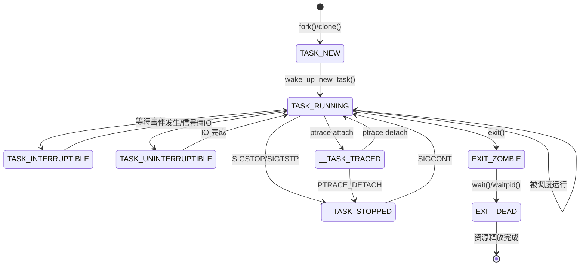

# 进程生命周期总览

## 学习目标

- 理解进程从创建到销毁的完整生命周期
- 掌握进程状态及状态转换机制
- 理解 Framework 层和 Kernel 层视角的进程生命周期
- 了解 Framework → Kernel 的关键转换点

## 概述

进程生命周期是指进程从被创建（fork/clone）到最终退出（exit）并被回收（wait）的整个过程。本文档从两个视角介绍进程生命周期：

1. **Kernel 层视角**：进程状态机、状态转换、调度
2. **Framework 层视角**：Android 应用进程的生命周期

---

## 一、进程状态机（Kernel 视角）

### 进程状态定义

Linux 内核定义了多种进程状态（`include/linux/sched.h`）：

```c
/* 基本状态 */
#define TASK_RUNNING            0x00000000  // 运行或就绪
#define TASK_INTERRUPTIBLE      0x00000001  // 可中断睡眠
#define TASK_UNINTERRUPTIBLE    0x00000002  // 不可中断睡眠

/* 停止状态 */
#define __TASK_STOPPED          0x00000004  // 停止（收到 SIGSTOP 等）
#define __TASK_TRACED           0x00000008  // 被调试器跟踪

/* 退出状态 */
#define EXIT_DEAD               0x00000010  // 最终死亡状态
#define EXIT_ZOMBIE             0x00000020  // 僵尸状态

/* 其他状态 */
#define TASK_PARKED             0x00000040  // 停放（用于 CPU hotplug）
#define TASK_DEAD               0x00000080  // 死亡
#define TASK_WAKEKILL           0x00000100  // 可被致命信号唤醒
#define TASK_WAKING             0x00000200  // 正在唤醒
#define TASK_NOLOAD             0x00000400  // 不计入负载统计
#define TASK_NEW                0x00000800  // 新创建，尚未运行
```

### 状态说明

| 状态 | 说明 | 典型场景 |
|-----|------|---------|
| TASK_RUNNING | 进程正在运行或在就绪队列等待运行 | 正常执行代码 |
| TASK_INTERRUPTIBLE | 进程在等待某个事件，可被信号唤醒 | 等待用户输入、等待 socket 数据 |
| TASK_UNINTERRUPTIBLE | 进程在等待某个事件，不可被信号唤醒 | 等待磁盘 IO |
| __TASK_STOPPED | 进程被停止 | 收到 SIGSTOP、SIGTSTP |
| __TASK_TRACED | 进程被调试器跟踪 | 被 ptrace 附加 |
| EXIT_ZOMBIE | 进程已退出，等待父进程回收 | exit 后等待 wait |
| EXIT_DEAD | 进程完全死亡，即将被销毁 | wait 后 |
| TASK_NEW | 进程刚创建，尚未被调度 | fork 后 wake_up_new_task 前 |

### 进程状态转换图



### 状态转换的关键函数

#### 1. 创建 → 就绪

```c
// kernel/fork.c
pid_t kernel_clone(struct kernel_clone_args *args)
{
    struct task_struct *p;
    
    // 创建新进程，初始状态为 TASK_NEW
    p = copy_process(NULL, trace, NUMA_NO_NODE, args);
    
    // 唤醒新进程，状态变为 TASK_RUNNING
    wake_up_new_task(p);
    
    return nr;
}

// kernel/sched/core.c
void wake_up_new_task(struct task_struct *p)
{
    // 状态从 TASK_NEW 变为 TASK_RUNNING
    WRITE_ONCE(p->__state, TASK_RUNNING);
    
    // 加入运行队列
    activate_task(rq, p, ENQUEUE_NOCLOCK);
}
```

#### 2. 运行 → 睡眠

```c
// kernel/sched/wait.c
void __sched schedule_timeout_interruptible(long timeout)
{
    // 设置状态为可中断睡眠
    set_current_state(TASK_INTERRUPTIBLE);
    schedule_timeout(timeout);
}

// include/linux/sched.h
#define set_current_state(state_value)          \
    do {                                        \
        WRITE_ONCE(current->__state, (state_value)); \
        smp_mb();                               \
    } while (0)
```

#### 3. 睡眠 → 就绪（唤醒）

```c
// kernel/sched/core.c
int wake_up_process(struct task_struct *p)
{
    return try_to_wake_up(p, TASK_NORMAL, 0);
}

static int try_to_wake_up(struct task_struct *p, unsigned int state, int wake_flags)
{
    // 检查进程是否在指定状态
    if (!(p->__state & state))
        goto out;
    
    // 设置状态为 TASK_RUNNING
    WRITE_ONCE(p->__state, TASK_RUNNING);
    
    // 将进程加入运行队列
    ttwu_queue(p, cpu, wake_flags);
    
    return success;
}
```

#### 4. 运行 → 退出

```c
// kernel/exit.c
void __noreturn do_exit(long code)
{
    struct task_struct *tsk = current;
    
    // 设置退出状态
    tsk->exit_code = code;
    
    // 释放资源
    exit_mm();
    exit_files(tsk);
    exit_fs(tsk);
    exit_signals(tsk);
    
    // 设置状态为 EXIT_ZOMBIE
    tsk->exit_state = EXIT_ZOMBIE;
    
    // 通知父进程
    exit_notify(tsk, group_dead);
    
    // 调度其他进程
    schedule();
    
    // 永不返回
    BUG();
}
```

#### 5. 僵尸 → 死亡（回收）

```c
// kernel/exit.c
static int wait_task_zombie(struct wait_opts *wo, struct task_struct *p)
{
    // 获取子进程的退出状态
    int status = p->exit_code;
    
    // 释放子进程的 task_struct
    release_task(p);
    
    return retval;
}

void release_task(struct task_struct *p)
{
    // 从父进程的子进程链表中移除
    list_del_rcu(&p->sibling);
    
    // 设置状态为 EXIT_DEAD
    p->exit_state = EXIT_DEAD;
    
    // 释放 task_struct
    put_task_struct(p);
}
```

---

## 二、进程生命周期（完整路径）

### 从创建到销毁的完整流程

```
┌─────────────────────────────────────────────────────────────┐
│                    进程生命周期                              │
├─────────────────────────────────────────────────────────────┤
│                                                              │
│  1. 创建阶段                                                 │
│     ┌─────────┐     ┌─────────────┐     ┌─────────────┐    │
│     │ fork()  │────►│copy_process │────►│  TASK_NEW   │    │
│     └─────────┘     └─────────────┘     └──────┬──────┘    │
│                                                 │           │
│  2. 唤醒阶段                                    ▼           │
│     ┌─────────────────┐     ┌─────────────────────────┐    │
│     │wake_up_new_task │────►│  TASK_RUNNING (就绪)   │    │
│     └─────────────────┘     └───────────┬─────────────┘    │
│                                         │                   │
│  3. 执行阶段                            ▼                   │
│     ┌─────────────────────────────────────────────────┐    │
│     │                 调度循环                         │    │
│     │  ┌─────────┐      ┌─────────┐      ┌─────────┐ │    │
│     │  │ 运行中  │◄────►│  睡眠   │◄────►│  停止   │ │    │
│     │  └─────────┘      └─────────┘      └─────────┘ │    │
│     └─────────────────────────────────────────────────┘    │
│                              │                              │
│  4. 退出阶段                 ▼ exit()                       │
│     ┌─────────────┐     ┌─────────────┐                    │
│     │  do_exit()  │────►│ EXIT_ZOMBIE │                    │
│     └─────────────┘     └──────┬──────┘                    │
│                                │                            │
│  5. 回收阶段                   ▼ wait()                     │
│     ┌─────────────┐     ┌─────────────┐     ┌─────────┐   │
│     │release_task │────►│ EXIT_DEAD   │────►│  销毁   │   │
│     └─────────────┘     └─────────────┘     └─────────┘   │
│                                                              │
└─────────────────────────────────────────────────────────────┘
```

### 关键阶段详解

#### 阶段 1：创建（fork/clone）

```c
// 用户空间调用
pid_t pid = fork();

// 内核处理流程
sys_fork()
    └── kernel_clone()
        └── copy_process()
            ├── dup_task_struct()      // 复制 task_struct
            ├── copy_creds()           // 复制凭证
            ├── copy_mm()              // 复制内存描述符
            ├── copy_files()           // 复制文件描述符表
            ├── copy_fs()              // 复制文件系统信息
            ├── copy_signal()          // 复制信号结构
            └── copy_thread()          // 复制线程信息
```

#### 阶段 2：执行（exec，可选）

```c
// 用户空间调用
execve("/bin/ls", argv, envp);

// 内核处理流程
sys_execve()
    └── do_execveat_common()
        └── bprm_execve()
            ├── prepare_binprm()       // 准备执行参数
            ├── search_binary_handler()
            └── load_elf_binary()      // 加载 ELF
                ├── flush_old_exec()   // 清理旧的地址空间
                ├── setup_new_exec()   // 设置新的执行环境
                └── start_thread()     // 设置入口点
```

#### 阶段 3：调度（运行、睡眠、唤醒）

```c
// 调度主函数
schedule()
    └── __schedule()
        ├── pick_next_task()           // 选择下一个进程
        └── context_switch()           // 上下文切换
            ├── switch_mm()            // 切换地址空间
            └── switch_to()            // 切换寄存器上下文
```

#### 阶段 4：退出（exit）

```c
// 用户空间调用
exit(0);

// 内核处理流程
sys_exit_group()
    └── do_group_exit()
        └── do_exit()
            ├── exit_signals()         // 处理信号
            ├── exit_mm()              // 释放内存
            ├── exit_files()           // 关闭文件
            ├── exit_fs()              // 释放文件系统
            ├── exit_notify()          // 通知父进程
            └── schedule()             // 调度离开
```

#### 阶段 5：回收（wait）

```c
// 父进程调用
pid_t child = waitpid(-1, &status, 0);

// 内核处理流程
sys_wait4()
    └── do_wait()
        └── wait_task_zombie()
            ├── 获取退出状态
            └── release_task()
                ├── 从进程链表移除
                └── 释放 task_struct
```

---

## 三、Framework 层视角（Android 应用进程）

### Android 进程类型

| 进程类型 | 说明 | 生命周期管理者 |
|---------|------|--------------|
| 系统进程 | init、zygote、system_server | init |
| 应用进程 | Android 应用 | ActivityManagerService |
| Native 进程 | 原生服务进程 | init |

### Android 应用进程生命周期

```mermaid
graph TB
    subgraph Framework[Framework 层]
        AMS[ActivityManagerService]
        ProcessList[ProcessList]
        OomAdj[OomAdjuster]
        Zygote[Zygote]
    end
    
    subgraph Kernel[Kernel 层]
        Fork[fork/clone]
        Sched[调度器]
        Exit[exit]
        LMK[LMK/LMKD]
    end
    
    AMS -->|1. startProcessLocked| Zygote
    Zygote -->|2. fork()| Fork
    Fork -->|3. 新进程| Sched
    
    AMS -->|4. 更新优先级| OomAdj
    OomAdj -->|5. setOomAdj| ProcessList
    ProcessList -->|6. 写入 oom_score_adj| Kernel
    
    LMK -->|7. 内存不足时| Exit
    Exit -->|8. 进程退出| AMS
```

### 应用进程启动流程

```
┌─────────────────────────────────────────────────────────────┐
│              Android 应用进程启动流程                         │
├─────────────────────────────────────────────────────────────┤
│                                                              │
│  1. 应用请求启动                                             │
│     App A ─────► startActivity(Intent) ─────► AMS           │
│                                                              │
│  2. AMS 处理请求                                             │
│     AMS.startProcessLocked()                                 │
│         │                                                    │
│         ├── 检查进程是否存在                                 │
│         ├── 创建 ProcessRecord                               │
│         └── 请求 Zygote fork                                 │
│                                                              │
│  3. Zygote fork 新进程                                       │
│     Zygote ─────► fork() ─────► 新进程                       │
│         │                           │                        │
│         │                           ├── 关闭不需要的 fd       │
│         │                           ├── 设置进程名            │
│         │                           └── 调用 ActivityThread  │
│         │                                                    │
│         └── 返回 PID 给 AMS                                  │
│                                                              │
│  4. 新进程初始化                                             │
│     ActivityThread.main()                                    │
│         │                                                    │
│         ├── 创建 Looper                                      │
│         ├── 创建 ActivityThread                              │
│         ├── attach 到 AMS                                    │
│         └── 进入消息循环                                     │
│                                                              │
│  5. AMS 绑定 Application                                     │
│     AMS ─────► bindApplication() ─────► 新进程               │
│         │                                                    │
│         ├── 加载 Application 类                              │
│         ├── 调用 onCreate()                                  │
│         └── 进程启动完成                                     │
│                                                              │
└─────────────────────────────────────────────────────────────┘
```

### 应用进程优先级变化

```
┌─────────────────────────────────────────────────────────────┐
│              Android 进程优先级变化                          │
├─────────────────────────────────────────────────────────────┤
│                                                              │
│  进程优先级（从高到低）：                                     │
│                                                              │
│  ┌─────────────────┐                                        │
│  │ 前台进程        │ ADJ = 0                                 │
│  │ (Foreground)    │ 用户正在交互的进程                      │
│  └────────┬────────┘                                        │
│           │ 切换到后台                                       │
│           ▼                                                  │
│  ┌─────────────────┐                                        │
│  │ 可见进程        │ ADJ = 100                               │
│  │ (Visible)       │ 可见但不在前台                          │
│  └────────┬────────┘                                        │
│           │ 完全不可见                                       │
│           ▼                                                  │
│  ┌─────────────────┐                                        │
│  │ 服务进程        │ ADJ = 200                               │
│  │ (Service)       │ 运行后台服务                            │
│  └────────┬────────┘                                        │
│           │ 服务停止                                         │
│           ▼                                                  │
│  ┌─────────────────┐                                        │
│  │ 缓存进程        │ ADJ = 900-999                           │
│  │ (Cached)        │ 后台进程，可被杀死                      │
│  └────────┬────────┘                                        │
│           │ 内存不足                                         │
│           ▼                                                  │
│  ┌─────────────────┐                                        │
│  │ 进程被杀死      │ LMK/LMKD 杀死                           │
│  │ (Killed)        │                                         │
│  └─────────────────┘                                        │
│                                                              │
└─────────────────────────────────────────────────────────────┘
```

### Framework → Kernel 的转换点

| Framework 操作 | 系统调用 | Kernel 处理 |
|---------------|---------|-------------|
| `Process.start()` | `fork()` / `clone()` | `copy_process()` |
| `Runtime.exec()` | `execve()` | `load_elf_binary()` |
| `Process.killProcess()` | `kill()` | `do_send_sig_info()` |
| `System.exit()` | `exit_group()` | `do_group_exit()` |
| `Thread.sleep()` | `nanosleep()` | `schedule_timeout()` |
| `Object.wait()` | `futex()` | `futex_wait()` |
| `setOomAdj()` | 写 `/proc/pid/oom_score_adj` | 更新 `signal->oom_score_adj` |

---

## 四、特殊进程状态

### 僵尸进程（Zombie）

**产生原因**：
- 子进程退出后，父进程没有调用 `wait()` 回收

**特点**：
- 占用 `task_struct` 和少量内核资源
- 在 `ps` 中显示为 `Z` 状态
- 无法被 `kill` 杀死

**解决方法**：
1. 父进程调用 `wait()` 或 `waitpid()`
2. 父进程退出（僵尸进程被 init 收养并回收）
3. 杀死父进程

```c
// 僵尸进程的产生
pid_t pid = fork();
if (pid == 0) {
    // 子进程立即退出
    exit(0);
} else {
    // 父进程不调用 wait，继续运行
    while (1) {
        sleep(1);  // 子进程变成僵尸
    }
}
```

### 孤儿进程（Orphan）

**产生原因**：
- 父进程退出，子进程还在运行

**处理**：
- 孤儿进程被 init（PID 1）收养
- init 会在孤儿进程退出时调用 `wait()` 回收

```c
// 孤儿进程的产生
pid_t pid = fork();
if (pid == 0) {
    // 子进程继续运行
    sleep(100);  // 父进程退出后变成孤儿
    exit(0);
} else {
    // 父进程立即退出
    exit(0);  // 子进程被 init 收养
}
```

### D 状态进程（Uninterruptible Sleep）

**特点**：
- 进程在等待 IO（磁盘、网络等）
- 不响应任何信号（包括 SIGKILL）
- 在 `ps` 中显示为 `D` 状态

**常见原因**：
- NFS 挂载点无响应
- 磁盘故障
- 内核 bug

```c
// D 状态的设置
// 在 IO 操作前
set_current_state(TASK_UNINTERRUPTIBLE);
schedule();  // 等待 IO 完成
```

---

## 五、进程生命周期与资源管理

### 资源分配时机

| 资源 | 分配时机 | 函数 |
|-----|---------|------|
| task_struct | fork | `dup_task_struct()` |
| 内核栈 | fork | `alloc_thread_stack_node()` |
| mm_struct | fork（进程）或共享（线程） | `dup_mm()` |
| 页表 | fork（COW） | `dup_mmap()` |
| files_struct | fork（进程）或共享（线程） | `dup_fd()` |
| signal_struct | fork | `copy_signal()` |

### 资源释放时机

| 资源 | 释放时机 | 函数 |
|-----|---------|------|
| 打开的文件 | exit | `exit_files()` |
| 内存映射 | exit | `exit_mm()` |
| 信号处理 | exit | `exit_signals()` |
| 文件系统 | exit | `exit_fs()` |
| task_struct | wait | `release_task()` |
| 内核栈 | wait | `free_thread_stack()` |

### 资源释放流程

```c
// kernel/exit.c
void __noreturn do_exit(long code)
{
    struct task_struct *tsk = current;
    
    // 1. 退出信号处理
    exit_signals(tsk);
    
    // 2. 释放内存
    exit_mm();
    
    // 3. 关闭文件
    exit_files(tsk);
    
    // 4. 释放文件系统
    exit_fs(tsk);
    
    // 5. 释放命名空间
    exit_task_namespaces(tsk);
    
    // 6. 释放线程信息
    exit_thread(tsk);
    
    // 7. 通知父进程
    tsk->exit_state = EXIT_ZOMBIE;
    exit_notify(tsk, group_dead);
    
    // 8. 调度
    schedule();
    
    BUG();  // 永不返回
}
```

---

## 总结

### 核心要点

1. **进程状态**：
   - TASK_RUNNING：运行或就绪
   - TASK_INTERRUPTIBLE：可中断睡眠
   - TASK_UNINTERRUPTIBLE：不可中断睡眠
   - EXIT_ZOMBIE：僵尸状态
   - EXIT_DEAD：最终死亡状态

2. **生命周期阶段**：
   - 创建：`fork()` → `copy_process()`
   - 唤醒：`wake_up_new_task()` → TASK_RUNNING
   - 执行：调度循环（运行、睡眠、唤醒）
   - 退出：`exit()` → `do_exit()` → EXIT_ZOMBIE
   - 回收：`wait()` → `release_task()` → EXIT_DEAD

3. **Framework 层视角**：
   - AMS 管理应用进程生命周期
   - Zygote fork 创建应用进程
   - OOM_ADJ 控制进程优先级
   - LMK 在内存不足时杀死进程

### 后续学习

- [进程创建机制详解](04-进程创建机制详解.md) - 深入理解 fork/clone
- [进程执行机制详解](05-进程执行机制详解.md) - 深入理解 exec
- [进程退出机制详解](06-进程退出机制详解.md) - 深入理解 exit/wait

## 参考资源

- 内核源码：
  - `kernel/fork.c` - 进程创建
  - `kernel/exit.c` - 进程退出
  - `kernel/sched/core.c` - 调度核心
  - `include/linux/sched.h` - 进程状态定义
- Android 源码：
  - `frameworks/base/services/core/java/com/android/server/am/` - AMS
  - `frameworks/base/core/java/com/android/internal/os/ZygoteInit.java` - Zygote

## 更新记录

- 2026-01-27：初始创建，包含进程生命周期总览
