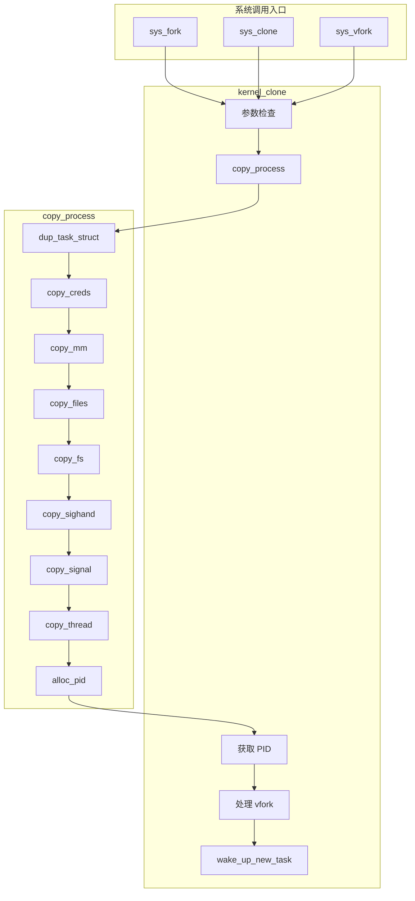
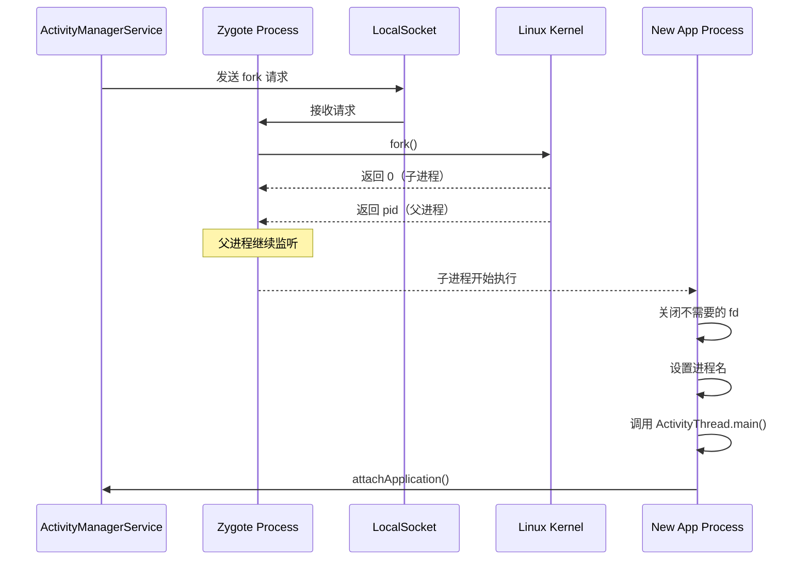

# 进程创建机制详解

## 学习目标

- 理解 fork()、clone()、vfork() 系统调用的区别和实现
- 掌握 copy_process() 核心函数的工作流程
- 理解写时复制（COW）机制
- 了解进程创建时与内存管理、文件系统的交互
- 理解 Android Zygote 如何使用 fork

## 概述

进程创建是操作系统最基本的功能之一。Linux 提供了多种进程创建方式：

| 系统调用 | 功能 | 特点 |
|---------|------|-----|
| `fork()` | 创建子进程 | 完整复制父进程（COW） |
| `clone()` | 创建进程/线程 | 可选择共享哪些资源 |
| `vfork()` | 创建子进程 | 共享地址空间，用于 fork+exec |

---

## 一、系统调用入口

### fork() 系统调用

```c
// kernel/fork.c
SYSCALL_DEFINE0(fork)
{
#ifdef CONFIG_MMU
    struct kernel_clone_args args = {
        .exit_signal = SIGCHLD,
    };
    return kernel_clone(&args);
#else
    /* 无 MMU 的系统不支持 fork */
    return -EINVAL;
#endif
}
```

### clone() 系统调用

```c
// kernel/fork.c
#ifdef __ARCH_WANT_SYS_CLONE
SYSCALL_DEFINE5(clone, unsigned long, clone_flags, unsigned long, newsp,
                int __user *, parent_tidptr,
                int __user *, child_tidptr,
                unsigned long, tls)
{
    struct kernel_clone_args args = {
        .flags      = (clone_flags & ~CSIGNAL),
        .pidfd      = parent_tidptr,
        .child_tid  = child_tidptr,
        .parent_tid = parent_tidptr,
        .exit_signal = (clone_flags & CSIGNAL),
        .stack      = newsp,
        .tls        = tls,
    };

    return kernel_clone(&args);
}
#endif
```

### vfork() 系统调用

```c
// kernel/fork.c
SYSCALL_DEFINE0(vfork)
{
    struct kernel_clone_args args = {
        .flags      = CLONE_VFORK | CLONE_VM,
        .exit_signal = SIGCHLD,
    };

    return kernel_clone(&args);
}
```

### clone 标志位

```c
// include/uapi/linux/sched.h
#define CLONE_VM            0x00000100  /* 共享地址空间 */
#define CLONE_FS            0x00000200  /* 共享文件系统信息 */
#define CLONE_FILES         0x00000400  /* 共享文件描述符表 */
#define CLONE_SIGHAND       0x00000800  /* 共享信号处理 */
#define CLONE_PIDFD         0x00001000  /* 创建 pidfd */
#define CLONE_PTRACE        0x00002000  /* 继续被跟踪 */
#define CLONE_VFORK         0x00004000  /* 父进程等待子进程 exec/exit */
#define CLONE_PARENT        0x00008000  /* 与调用者同父 */
#define CLONE_THREAD        0x00010000  /* 同一线程组 */
#define CLONE_NEWNS         0x00020000  /* 新挂载命名空间 */
#define CLONE_SYSVSEM       0x00040000  /* 共享 System V 信号量 */
#define CLONE_SETTLS        0x00080000  /* 设置 TLS */
#define CLONE_PARENT_SETTID 0x00100000  /* 在父进程设置 TID */
#define CLONE_CHILD_CLEARTID 0x00200000 /* 在子进程清除 TID */
#define CLONE_DETACHED      0x00400000  /* 未使用 */
#define CLONE_UNTRACED      0x00800000  /* 不被跟踪 */
#define CLONE_CHILD_SETTID  0x01000000  /* 在子进程设置 TID */
#define CLONE_NEWCGROUP     0x02000000  /* 新 cgroup 命名空间 */
#define CLONE_NEWUTS        0x04000000  /* 新 UTS 命名空间 */
#define CLONE_NEWIPC        0x08000000  /* 新 IPC 命名空间 */
#define CLONE_NEWUSER       0x10000000  /* 新用户命名空间 */
#define CLONE_NEWPID        0x20000000  /* 新 PID 命名空间 */
#define CLONE_NEWNET        0x40000000  /* 新网络命名空间 */
#define CLONE_IO            0x80000000  /* 共享 IO 上下文 */
```

---

## 二、kernel_clone() 核心函数

### 函数签名

```c
// kernel/fork.c
pid_t kernel_clone(struct kernel_clone_args *args)
{
    u64 clone_flags = args->flags;
    struct task_struct *p;
    int trace = 0;
    pid_t nr;

    // 1. 参数检查和处理
    // ...
    
    // 2. 创建新进程（核心）
    p = copy_process(NULL, trace, NUMA_NO_NODE, args);
    if (IS_ERR(p))
        return PTR_ERR(p);
    
    // 3. 获取 PID
    nr = pid_vnr(get_task_pid(p, PIDTYPE_PID));
    
    // 4. 处理 vfork
    if (clone_flags & CLONE_VFORK) {
        // 父进程等待
        wait_for_vfork_done(p, &vfork_done);
    }
    
    // 5. 唤醒新进程
    wake_up_new_task(p);
    
    return nr;
}
```

### 完整流程图



---

## 三、copy_process() 详解

`copy_process()` 是进程创建的核心函数，负责：
1. 分配和初始化 task_struct
2. 复制或共享各种资源

### 函数流程

```c
// kernel/fork.c
static __latent_entropy struct task_struct *copy_process(
    struct pid *pid,
    int trace,
    int node,
    struct kernel_clone_args *args)
{
    int retval;
    struct task_struct *p;
    u64 clone_flags = args->flags;
    
    // 1. 参数合法性检查
    retval = copy_process_flags_check(clone_flags);
    if (retval)
        goto fork_out;
    
    // 2. 分配 task_struct 和内核栈
    p = dup_task_struct(current, node);
    if (!p)
        goto fork_out;
    
    // 3. 初始化子进程的 task_struct
    retval = copy_creds(p, clone_flags);
    if (retval < 0)
        goto bad_fork_free;
    
    // 4. 初始化调度相关
    retval = sched_fork(clone_flags, p);
    if (retval)
        goto bad_fork_cleanup_policy;
    
    // 5. 复制各种资源
    retval = copy_files(clone_flags, p);       // 文件描述符
    if (retval)
        goto bad_fork_cleanup_semundo;
    
    retval = copy_fs(clone_flags, p);          // 文件系统信息
    if (retval)
        goto bad_fork_cleanup_files;
    
    retval = copy_sighand(clone_flags, p);     // 信号处理函数
    if (retval)
        goto bad_fork_cleanup_fs;
    
    retval = copy_signal(clone_flags, p);      // 信号结构
    if (retval)
        goto bad_fork_cleanup_sighand;
    
    retval = copy_mm(clone_flags, p);          // 内存描述符
    if (retval)
        goto bad_fork_cleanup_signal;
    
    retval = copy_namespaces(clone_flags, p);  // 命名空间
    if (retval)
        goto bad_fork_cleanup_mm;
    
    retval = copy_thread(clone_flags, args->stack, args->stack_size, p, args->tls);
    if (retval)
        goto bad_fork_cleanup_namespaces;
    
    // 6. 分配 PID
    if (pid != &init_struct_pid) {
        pid = alloc_pid(p->nsproxy->pid_ns_for_children, args->set_tid,
                        args->set_tid_size);
        if (IS_ERR(pid)) {
            retval = PTR_ERR(pid);
            goto bad_fork_cleanup_thread;
        }
    }
    
    // 7. 设置进程关系
    p->pid = pid_nr(pid);
    if (clone_flags & CLONE_THREAD) {
        p->tgid = current->tgid;
        p->group_leader = current->group_leader;
    } else {
        p->tgid = p->pid;
        p->group_leader = p;
    }
    
    // 8. 将子进程加入各种链表
    retval = copy_process_finish(p, clone_flags, pid);
    if (retval)
        goto bad_fork_free_pid;
    
    return p;

bad_fork_free_pid:
    // 错误处理...
    
fork_out:
    return ERR_PTR(retval);
}
```

### 3.1 dup_task_struct() - 复制 task_struct

```c
// kernel/fork.c
static struct task_struct *dup_task_struct(struct task_struct *orig, int node)
{
    struct task_struct *tsk;
    unsigned long *stack;
    struct vm_struct *stack_vm_area __maybe_unused;
    int err;
    
    // 1. 分配 task_struct
    tsk = alloc_task_struct_node(node);
    if (!tsk)
        return NULL;
    
    // 2. 分配内核栈
    stack = alloc_thread_stack_node(tsk, node);
    if (!stack)
        goto free_tsk;
    
    // 3. 复制 task_struct 内容
    err = arch_dup_task_struct(tsk, orig);
    if (err)
        goto free_stack;
    
    // 4. 设置栈指针
    tsk->stack = stack;
    
    // 5. 初始化 thread_info
#ifdef CONFIG_THREAD_INFO_IN_TASK
    refcount_set(&tsk->stack_refcount, 1);
#endif
    
    // 6. 初始化各种计数器
    tsk->stack_canary = get_random_canary();
    clear_tsk_need_resched(tsk);
    
    // 7. 重置一些不能继承的字段
    tsk->splice_pipe = NULL;
    tsk->task_frag.page = NULL;
    
    return tsk;

free_stack:
    free_thread_stack(tsk);
free_tsk:
    free_task_struct(tsk);
    return NULL;
}
```

### 3.2 copy_mm() - 复制内存描述符

```c
// kernel/fork.c
static int copy_mm(unsigned long clone_flags, struct task_struct *tsk)
{
    struct mm_struct *mm, *oldmm;
    int retval;
    
    tsk->min_flt = tsk->maj_flt = 0;
    tsk->nvcsw = tsk->nivcsw = 0;
#ifdef CONFIG_DETECT_HUNG_TASK
    tsk->last_switch_count = tsk->nvcsw + tsk->nivcsw;
#endif
    
    tsk->mm = NULL;
    tsk->active_mm = NULL;
    
    // 获取父进程的 mm
    oldmm = current->mm;
    if (!oldmm)
        return 0;  // 内核线程没有 mm
    
    // 检查是否共享地址空间
    if (clone_flags & CLONE_VM) {
        // 线程：共享 mm
        mmget(oldmm);
        tsk->mm = oldmm;
        tsk->active_mm = oldmm;
        return 0;
    }
    
    // 进程：复制 mm
    retval = -ENOMEM;
    mm = dup_mm(tsk, current->mm);
    if (!mm)
        goto fail_nomem;
    
    tsk->mm = mm;
    tsk->active_mm = mm;
    return 0;

fail_nomem:
    return retval;
}
```

### 3.3 dup_mm() - 复制地址空间

```c
// kernel/fork.c
static struct mm_struct *dup_mm(struct task_struct *tsk,
                                struct mm_struct *oldmm)
{
    struct mm_struct *mm;
    int err;
    
    // 1. 分配 mm_struct
    mm = allocate_mm();
    if (!mm)
        goto fail_nomem;
    
    // 2. 复制 mm_struct 内容
    memcpy(mm, oldmm, sizeof(*mm));
    
    // 3. 初始化
    if (!mm_init(mm, tsk, mm->user_ns))
        goto fail_nomem;
    
    // 4. 复制页表和 VMA（核心，实现 COW）
    err = dup_mmap(mm, oldmm);
    if (err)
        goto free_pt;
    
    return mm;

free_pt:
    mm_free_pgd(mm);
fail_nomem:
    return NULL;
}
```

### 3.4 copy_files() - 复制文件描述符表

```c
// kernel/fork.c
static int copy_files(unsigned long clone_flags, struct task_struct *tsk)
{
    struct files_struct *oldf, *newf;
    int error = 0;
    
    oldf = current->files;
    if (!oldf)
        goto out;
    
    if (clone_flags & CLONE_FILES) {
        // 线程：共享文件描述符表
        atomic_inc(&oldf->count);
        goto out;
    }
    
    // 进程：复制文件描述符表
    newf = dup_fd(oldf, NR_OPEN_MAX, &error);
    if (!newf)
        goto out;
    
    tsk->files = newf;
    error = 0;
out:
    return error;
}
```

### 3.5 copy_thread() - 复制线程信息（架构相关）

```c
// arch/arm64/kernel/process.c
int copy_thread(unsigned long clone_flags, unsigned long stack_start,
                unsigned long stk_sz, struct task_struct *p,
                unsigned long tls)
{
    struct pt_regs *childregs = task_pt_regs(p);
    
    memset(&p->thread.cpu_context, 0, sizeof(struct cpu_context));
    
    if (likely(!(p->flags & PF_KTHREAD))) {
        // 用户进程
        *childregs = *task_pt_regs(current);
        childregs->regs[0] = 0;  // 子进程 fork 返回 0
        
        // 设置子进程的栈
        if (stack_start)
            childregs->sp = stack_start;
        
        // 设置 TLS
        if (clone_flags & CLONE_SETTLS)
            p->thread.uw.tp_value = tls;
    } else {
        // 内核线程
        memset(childregs, 0, sizeof(struct pt_regs));
        childregs->pstate = PSR_MODE_EL1h;
        // ...
    }
    
    // 设置子进程恢复执行的入口点
    p->thread.cpu_context.pc = (unsigned long)ret_from_fork;
    p->thread.cpu_context.sp = (unsigned long)childregs;
    
    return 0;
}
```

---

## 四、写时复制（COW）机制

### 原理

写时复制（Copy-On-Write）是一种优化技术：
- fork 时不立即复制物理页，而是让父子进程共享
- 将共享页标记为只读
- 当任一进程尝试写入时，触发缺页异常
- 缺页处理程序复制该页，然后修改

### 实现

```c
// kernel/fork.c -> dup_mmap()
static __latent_entropy int dup_mmap(struct mm_struct *mm,
                                     struct mm_struct *oldmm)
{
    struct vm_area_struct *mpnt, *tmp;
    
    // 遍历父进程的所有 VMA
    for (mpnt = oldmm->mmap; mpnt; mpnt = mpnt->vm_next) {
        // 1. 复制 VMA
        tmp = vm_area_dup(mpnt);
        if (!tmp)
            goto fail_nomem;
        
        // 2. 复制页表（设置为只读，实现 COW）
        retval = copy_page_range(tmp, mpnt);
        if (retval)
            goto fail_nomem;
        
        // 3. 将 VMA 加入新 mm
        insert_vm_struct(mm, tmp);
    }
    
    return retval;
}

// mm/memory.c
int copy_page_range(struct vm_area_struct *dst_vma,
                    struct vm_area_struct *src_vma)
{
    // ...
    // 遍历页表，复制 PTE
    // 对于可写的私有页，设置为只读（COW）
    // ...
}
```

### COW 缺页处理

```c
// mm/memory.c
static vm_fault_t do_wp_page(struct vm_fault *vmf)
{
    struct vm_area_struct *vma = vmf->vma;
    struct page *page = vmf->page;
    
    // 1. 检查是否需要复制
    if (page_count(page) != 1) {
        // 多个进程共享此页，需要复制
        struct page *new_page = alloc_page_vma(GFP_HIGHUSER_MOVABLE, vma, vmf->address);
        if (!new_page)
            return VM_FAULT_OOM;
        
        // 2. 复制页内容
        cow_user_page(new_page, page, vmf->address, vma);
        
        // 3. 更新页表，指向新页
        set_pte_at(mm, vmf->address, vmf->pte,
                   mk_pte(new_page, vma->vm_page_prot));
    } else {
        // 只有一个进程使用此页，直接设为可写
        // ...
    }
    
    return 0;
}
```

### COW 示意图

```
fork 前：
父进程         物理内存
┌─────────┐   ┌─────────┐
│ VMA     │──►│ 页 A    │ (可写)
│ PTE: RW │   │ 页 B    │ (可写)
└─────────┘   └─────────┘

fork 后（COW）：
父进程         物理内存         子进程
┌─────────┐   ┌─────────┐   ┌─────────┐
│ VMA     │──►│ 页 A    │◄──│ VMA     │
│ PTE: RO │   │ 页 B    │   │ PTE: RO │ (共享，只读)
└─────────┘   └─────────┘   └─────────┘

子进程写入后：
父进程         物理内存         子进程
┌─────────┐   ┌─────────┐   ┌─────────┐
│ VMA     │──►│ 页 A    │   │ VMA     │
│ PTE: RO │   │ 页 B    │   │ PTE: RW │──►┌─────────┐
└─────────┘   └─────────┘   └─────────┘   │ 页 A'   │ (复制)
                                          └─────────┘
```

---

## 五、Android Zygote 的 fork 机制

### Zygote 简介

Zygote 是 Android 系统中的特殊进程：
- 所有应用进程的父进程
- 预加载了常用类和资源
- 通过 fork 快速创建应用进程

### Zygote fork 流程



### Zygote fork 代码

```java
// frameworks/base/core/java/com/android/internal/os/Zygote.java
static int forkAndSpecialize(int uid, int gid, int[] gids, int runtimeFlags,
        int[][] rlimits, int mountExternal, String seInfo, String niceName,
        int[] fdsToClose, int[] fdsToIgnore, boolean startChildZygote,
        String instructionSet, String appDataDir, boolean isTopApp,
        String[] pkgDataInfoList, String[] whitelistedDataInfoList,
        boolean bindMountAppDataDirs, boolean bindMountAppStorageDirs) {
    
    // 1. 预 fork 准备
    VM_HOOKS.preFork();
    
    // 2. 调用 native fork
    int pid = nativeForkAndSpecialize(uid, gid, gids, runtimeFlags, rlimits,
            mountExternal, seInfo, niceName, fdsToClose, fdsToIgnore,
            startChildZygote, instructionSet, appDataDir, isTopApp,
            pkgDataInfoList, whitelistedDataInfoList,
            bindMountAppDataDirs, bindMountAppStorageDirs);
    
    // 3. 后续处理
    if (pid == 0) {
        // 子进程
        VM_HOOKS.postForkChild(runtimeFlags, isSystemServer, isZygote, instructionSet);
    } else {
        // 父进程
        VM_HOOKS.postForkCommon();
    }
    
    return pid;
}
```

```c
// frameworks/base/core/jni/com_android_internal_os_Zygote.cpp
static jint com_android_internal_os_Zygote_nativeForkAndSpecialize(
        JNIEnv* env, jclass, jint uid, jint gid, jintArray gids,
        jint runtime_flags, jobjectArray rlimits,
        jint mount_external, jstring se_info, jstring nice_name,
        jintArray managed_fds_to_close, jintArray managed_fds_to_ignore,
        jboolean is_child_zygote, jstring instruction_set, jstring app_data_dir,
        jboolean is_top_app, jobjectArray pkg_data_info_list,
        jobjectArray whitelisted_data_info_list,
        jboolean mount_data_dirs, jboolean mount_storage_dirs) {
    
    // 1. 调用 fork
    pid_t pid = ForkCommon(env, false, fds_to_close, fds_to_ignore, true);
    
    if (pid == 0) {
        // 2. 子进程特化
        SpecializeCommon(env, uid, gid, gids, runtime_flags, rlimits,
                        capabilities, capabilities, mount_external, se_info,
                        nice_name, false, is_child_zygote, instruction_set,
                        app_data_dir, is_top_app, pkg_data_info_list,
                        whitelisted_data_info_list, mount_data_dirs,
                        mount_storage_dirs);
    }
    
    return pid;
}

static pid_t ForkCommon(JNIEnv* env, bool is_system_server,
                        const std::vector<int>& fds_to_close,
                        const std::vector<int>& fds_to_ignore,
                        bool is_priority_fork) {
    // 调用 Linux fork
    pid_t pid = fork();
    
    if (pid == 0) {
        // 子进程
        // 关闭不需要的文件描述符
        for (int fd : fds_to_close) {
            close(fd);
        }
        
        // 重置信号处理
        UnsetChldSignalHandler();
    }
    
    return pid;
}
```

### Zygote 预加载优势

```
                    ┌─────────────────────────────────────┐
                    │           Zygote Process            │
                    │  ┌───────────────────────────────┐  │
                    │  │     预加载的类和资源          │  │
                    │  │  - android.app.Activity       │  │
                    │  │  - android.view.View          │  │
                    │  │  - 常用系统资源               │  │
                    │  │  - 字体、图片等               │  │
                    │  └───────────────────────────────┘  │
                    └────────────────┬────────────────────┘
                                     │ fork (COW)
            ┌────────────────────────┼────────────────────────┐
            │                        │                        │
            ▼                        ▼                        ▼
    ┌───────────────┐        ┌───────────────┐        ┌───────────────┐
    │   App1 进程   │        │   App2 进程   │        │   App3 进程   │
    │  共享预加载   │        │  共享预加载   │        │  共享预加载   │
    │  内容（只读） │        │  内容（只读） │        │  内容（只读） │
    └───────────────┘        └───────────────┘        └───────────────┘

优势：
1. 共享只读内存，节省物理内存
2. 不需要重复加载类和资源，加快启动速度
3. 子进程立即可用，无需等待类加载
```

---

## 六、进程与线程创建的区别

### clone 标志对比

| 场景 | clone 标志 | 结果 |
|-----|-----------|-----|
| fork 创建进程 | 无特殊标志 | 复制所有资源 |
| 创建线程 | CLONE_VM \| CLONE_FS \| CLONE_FILES \| CLONE_SIGHAND \| CLONE_THREAD | 共享地址空间、文件、信号 |
| vfork | CLONE_VFORK \| CLONE_VM | 共享地址空间，父进程阻塞 |

### pthread_create 使用的 clone 标志

```c
// glibc/nptl/pthread_create.c
// pthread_create 实际上调用 clone，使用以下标志：
const int clone_flags = (CLONE_VM | CLONE_FS | CLONE_FILES | CLONE_SIGHAND
                        | CLONE_THREAD | CLONE_SYSVSEM | CLONE_SETTLS
                        | CLONE_PARENT_SETTID | CLONE_CHILD_CLEARTID);
```

### 资源共享对比

```
fork 创建进程：                    clone 创建线程：

父进程          子进程            父线程          子线程
┌─────────┐   ┌─────────┐       ┌─────────┐   ┌─────────┐
│task_struct│ │task_struct│     │task_struct│ │task_struct│
├─────────┤   ├─────────┤       ├─────────┤   ├─────────┤
│ mm      │──►│ mm'     │       │ mm      │──►│ mm      │ (共享)
├─────────┤   ├─────────┤       ├─────────┤   ├─────────┤
│ files   │──►│ files'  │       │ files   │──►│ files   │ (共享)
├─────────┤   ├─────────┤       ├─────────┤   ├─────────┤
│ fs      │──►│ fs'     │       │ fs      │──►│ fs      │ (共享)
├─────────┤   ├─────────┤       ├─────────┤   ├─────────┤
│ signal  │──►│ signal' │       │ signal  │──►│ signal  │ (共享)
└─────────┘   └─────────┘       └─────────┘   └─────────┘
  (复制)                           (共享)
```

---

## 总结

### 核心要点

1. **系统调用入口**：
   - `fork()` - 完整复制进程
   - `clone()` - 可选共享资源
   - `vfork()` - 共享地址空间，用于 fork+exec

2. **核心函数**：
   - `kernel_clone()` - 统一入口
   - `copy_process()` - 创建和初始化 task_struct
   - `dup_task_struct()` - 分配 task_struct 和内核栈

3. **写时复制（COW）**：
   - fork 时共享物理页
   - 写入时触发缺页，复制页
   - 节省内存，加快 fork 速度

4. **Android Zygote**：
   - 预加载类和资源
   - 通过 fork 快速创建应用进程
   - COW 机制使应用共享预加载内容

### 后续学习

- [进程执行机制详解](05-进程执行机制详解.md) - 深入理解 exec
- [进程退出机制详解](06-进程退出机制详解.md) - 深入理解 exit

## 参考资源

- 内核源码：
  - `kernel/fork.c` - 进程创建
  - `mm/memory.c` - COW 实现
  - `arch/arm64/kernel/process.c` - ARM64 进程
- Android 源码：
  - `frameworks/base/core/java/com/android/internal/os/Zygote.java`
  - `frameworks/base/core/jni/com_android_internal_os_Zygote.cpp`

## 更新记录

- 2026-01-27：初始创建，包含进程创建机制详解
