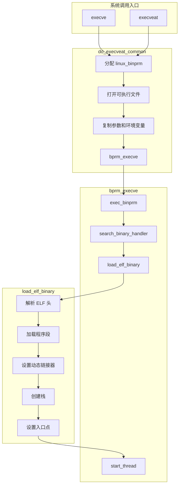

# 进程执行机制详解

## 学习目标

- 理解 exec 系列系统调用的功能和区别
- 掌握 do_execveat_common() 核心函数的工作流程
- 理解 ELF 文件的加载过程
- 了解进程映像替换的完整过程
- 理解 Android 应用启动与 exec 的关系

## 概述

exec 系列系统调用用于执行一个新程序，它会：
1. 替换当前进程的地址空间
2. 加载新程序的代码和数据
3. 从新程序的入口点开始执行

注意：exec 不会创建新进程，而是在当前进程中执行新程序。

---

## 一、exec 系列系统调用

### 系统调用列表

| 系统调用 | 参数形式 | 环境变量 | 路径查找 |
|---------|---------|---------|---------|
| `execve()` | 数组 | 显式传递 | 不查找 |
| `execveat()` | 数组 + dirfd | 显式传递 | 不查找 |
| `execl()` | 列表 | 继承 | 不查找 |
| `execle()` | 列表 | 显式传递 | 不查找 |
| `execlp()` | 列表 | 继承 | 查找 PATH |
| `execv()` | 数组 | 继承 | 不查找 |
| `execvp()` | 数组 | 继承 | 查找 PATH |
| `execvpe()` | 数组 | 显式传递 | 查找 PATH |

### execve() 系统调用

```c
// fs/exec.c
SYSCALL_DEFINE3(execve,
                const char __user *, filename,
                const char __user *const __user *, argv,
                const char __user *const __user *, envp)
{
    return do_execve(getname(filename), argv, envp);
}

static int do_execve(struct filename *filename,
                     const char __user *const __user *__argv,
                     const char __user *const __user *__envp)
{
    struct user_arg_ptr argv = { .ptr.native = __argv };
    struct user_arg_ptr envp = { .ptr.native = __envp };
    return do_execveat_common(AT_FDCWD, filename, argv, envp, 0);
}
```

### execveat() 系统调用

```c
// fs/exec.c
SYSCALL_DEFINE5(execveat,
                int, fd, const char __user *, filename,
                const char __user *const __user *, argv,
                const char __user *const __user *, envp,
                int, flags)
{
    int lookup_flags = (flags & AT_EMPTY_PATH) ? LOOKUP_EMPTY : 0;
    
    return do_execveat(fd,
                       getname_flags(filename, lookup_flags, NULL),
                       argv, envp, flags);
}
```

---

## 二、do_execveat_common() 核心函数

### 函数流程

```c
// fs/exec.c
static int do_execveat_common(int fd, struct filename *filename,
                              struct user_arg_ptr argv,
                              struct user_arg_ptr envp,
                              int flags)
{
    struct linux_binprm *bprm;
    int retval;
    
    // 1. 分配 linux_binprm 结构
    bprm = alloc_bprm(fd, filename);
    if (IS_ERR(bprm))
        return PTR_ERR(bprm);
    
    // 2. 打开可执行文件
    retval = bprm_execve(bprm, fd, filename, flags);
    if (retval < 0)
        goto out_free;
    
    // 3. 复制参数和环境变量
    retval = bprm_stack_limits(bprm);
    if (retval < 0)
        goto out_free;
    
    retval = copy_string_kernel(bprm->filename, bprm);
    if (retval < 0)
        goto out_free;
    
    retval = copy_strings(bprm->envc, envp, bprm);
    if (retval < 0)
        goto out_free;
    
    retval = copy_strings(bprm->argc, argv, bprm);
    if (retval < 0)
        goto out_free;
    
    // 4. 执行二进制文件
    retval = bprm_execve(bprm, fd, filename, flags);
    
out_free:
    free_bprm(bprm);
    return retval;
}
```

### linux_binprm 结构

```c
// include/linux/binfmts.h
struct linux_binprm {
    char buf[BINPRM_BUF_SIZE];      // 文件头缓冲区（128字节）
#ifdef CONFIG_MMU
    struct vm_area_struct *vma;     // 临时 VMA
    unsigned long vma_pages;        // VMA 页数
#endif
    struct mm_struct *mm;           // 新的地址空间
    unsigned long p;                // 当前栈顶指针
    unsigned long argmin;           // 参数区最小地址
    unsigned int have_execfd:1;     // 是否有 execfd
    unsigned int execfd_creds:1;    // execfd 凭证
    unsigned int secureexec:1;      // 安全执行
    unsigned int point_of_no_return:1; // 不可返回点
    struct file *executable;        // 可执行文件
    struct file *interpreter;       // 解释器文件
    struct file *file;              // 当前文件
    struct cred *cred;              // 新凭证
    int unsafe;                     // 不安全标志
    unsigned int per_clear;         // personality 清除标志
    int argc, envc;                 // 参数和环境变量数量
    const char *filename;           // 文件名
    const char *interp;             // 解释器名
    const char *fdpath;             // fd 路径
    unsigned interp_flags;          // 解释器标志
    int execfd;                     // exec 文件描述符
    unsigned long loader, exec;     // 加载器和执行地址
    // ...
};
```

### 完整流程图



---

## 三、bprm_execve() 函数

```c
// fs/exec.c
static int bprm_execve(struct linux_binprm *bprm,
                       int fd, struct filename *filename, int flags)
{
    struct file *file;
    int retval;
    
    // 1. 打开可执行文件
    file = do_open_execat(fd, filename, flags);
    if (IS_ERR(file))
        return PTR_ERR(file);
    
    bprm->file = file;
    
    // 2. 检查权限
    retval = prepare_binprm(bprm);
    if (retval < 0)
        goto out;
    
    // 3. 准备新的地址空间
    retval = prepare_bprm_creds(bprm);
    if (retval)
        goto out;
    
    // 4. 执行
    retval = exec_binprm(bprm);
    if (retval < 0)
        goto out;
    
    // 5. 执行成功，返回用户空间
    return retval;
    
out:
    // 清理
    return retval;
}
```

### prepare_binprm() - 准备执行

```c
// fs/exec.c
int prepare_binprm(struct linux_binprm *bprm)
{
    int retval;
    loff_t pos = 0;
    
    // 1. 设置凭证
    bprm_fill_uid(bprm, file);
    
    // 2. 读取文件头（前 128 字节）
    retval = kernel_read(bprm->file, bprm->buf, BINPRM_BUF_SIZE, &pos);
    if (retval < 0)
        return retval;
    
    // bprm->buf 现在包含文件头
    // 用于后续识别文件格式（ELF、脚本等）
    
    return 0;
}
```

### exec_binprm() - 执行二进制

```c
// fs/exec.c
static int exec_binprm(struct linux_binprm *bprm)
{
    pid_t old_pid, old_vpid;
    int ret, depth;
    
    // 保存旧 PID
    old_pid = current->pid;
    old_vpid = task_pid_nr_ns(current, task_active_pid_ns(current->parent));
    
    // 搜索并执行
    ret = search_binary_handler(bprm);
    if (ret >= 0) {
        // 成功
        audit_bprm(bprm);
        trace_sched_process_exec(current, old_pid, bprm);
    }
    
    return ret;
}
```

---

## 四、search_binary_handler() - 搜索二进制处理程序

### 二进制格式处理程序

Linux 支持多种可执行文件格式，每种格式有对应的处理程序：

```c
// include/linux/binfmts.h
struct linux_binfmt {
    struct list_head lh;
    struct module *module;
    int (*load_binary)(struct linux_binprm *);     // 加载二进制
    int (*load_shlib)(struct file *);              // 加载共享库
    int (*core_dump)(struct coredump_params *cprm); // 核心转储
    unsigned long min_coredump;
};
```

### 已注册的格式

```c
// fs/binfmt_elf.c
static struct linux_binfmt elf_format = {
    .module         = THIS_MODULE,
    .load_binary    = load_elf_binary,
    .load_shlib     = load_elf_library,
    .core_dump      = elf_core_dump,
    .min_coredump   = ELF_EXEC_PAGESIZE,
};

// fs/binfmt_script.c
static struct linux_binfmt script_format = {
    .module         = THIS_MODULE,
    .load_binary    = load_script,
};

// fs/binfmt_misc.c
static struct linux_binfmt misc_format = {
    .module         = THIS_MODULE,
    .load_binary    = load_misc_binary,
};
```

### search_binary_handler() 实现

```c
// fs/exec.c
static int search_binary_handler(struct linux_binprm *bprm)
{
    struct linux_binfmt *fmt;
    int retval;
    bool need_retry = IS_ENABLED(CONFIG_MODULES);
    
retry:
    // 遍历所有注册的格式
    list_for_each_entry(fmt, &formats, lh) {
        if (!try_module_get(fmt->module))
            continue;
        
        // 尝试加载
        retval = fmt->load_binary(bprm);
        
        module_put(fmt->module);
        
        if (retval != -ENOEXEC) {
            // 成功或错误（非格式不匹配）
            return retval;
        }
    }
    
    // 如果是脚本，可能需要加载模块
    if (need_retry && retval == -ENOEXEC) {
        request_module("binfmt-%04x", *(ushort *)(bprm->buf + 2));
        need_retry = false;
        goto retry;
    }
    
    return -ENOEXEC;
}
```

---

## 五、load_elf_binary() - 加载 ELF 文件

### ELF 文件结构

```
ELF 文件结构：

┌─────────────────────────────────────┐
│           ELF Header                │  ← Elf64_Ehdr
│  - Magic number (0x7f ELF)          │
│  - 机器类型、入口点等               │
├─────────────────────────────────────┤
│        Program Headers              │  ← Elf64_Phdr[]
│  - 描述如何加载到内存               │
│  - PT_LOAD: 需要加载的段            │
│  - PT_INTERP: 动态链接器路径        │
├─────────────────────────────────────┤
│           .text                     │  ← 代码段
├─────────────────────────────────────┤
│           .rodata                   │  ← 只读数据
├─────────────────────────────────────┤
│           .data                     │  ← 已初始化数据
├─────────────────────────────────────┤
│           .bss                      │  ← 未初始化数据
├─────────────────────────────────────┤
│        Section Headers              │  ← Elf64_Shdr[]
│  - 描述各个节的信息                 │
└─────────────────────────────────────┘
```

### load_elf_binary() 实现

```c
// fs/binfmt_elf.c
static int load_elf_binary(struct linux_binprm *bprm)
{
    struct elfhdr *elf_ex = (struct elfhdr *)bprm->buf;
    struct elf_phdr *elf_ppnt, *elf_phdata;
    unsigned long elf_entry;
    unsigned long interp_load_addr = 0;
    unsigned long start_code, end_code, start_data, end_data;
    int retval, i;
    
    // 1. 验证 ELF 头
    if (memcmp(elf_ex->e_ident, ELFMAG, SELFMAG) != 0)
        return -ENOEXEC;
    
    if (elf_ex->e_type != ET_EXEC && elf_ex->e_type != ET_DYN)
        return -ENOEXEC;
    
    // 2. 读取 Program Headers
    elf_phdata = load_elf_phdrs(elf_ex, bprm->file);
    if (!elf_phdata)
        return -ENOMEM;
    
    // 3. 查找解释器（动态链接器）
    for (i = 0; i < elf_ex->e_phnum; i++) {
        if (elf_ppnt[i].p_type == PT_INTERP) {
            // 读取解释器路径（通常是 /lib64/ld-linux-x86-64.so.2）
            char *elf_interpreter = kmalloc(elf_ppnt[i].p_filesz, GFP_KERNEL);
            kernel_read(bprm->file, elf_interpreter, 
                       elf_ppnt[i].p_filesz, &elf_ppnt[i].p_offset);
            
            // 打开解释器文件
            interpreter = open_exec(elf_interpreter);
            // ...
        }
    }
    
    // 4. 清理旧的地址空间（不可返回点）
    retval = begin_new_exec(bprm);
    if (retval)
        goto out_free_dentry;
    
    // 5. 设置新的地址空间
    setup_new_exec(bprm);
    
    // 6. 加载 PT_LOAD 段
    for (i = 0, elf_ppnt = elf_phdata; i < elf_ex->e_phnum; i++, elf_ppnt++) {
        if (elf_ppnt->p_type != PT_LOAD)
            continue;
        
        // 映射段到内存
        error = elf_map(bprm->file, load_bias + vaddr, elf_ppnt,
                        elf_prot, elf_flags, total_size);
        if (error < 0)
            goto out_free_dentry;
        
        // 更新代码/数据边界
        if (elf_ppnt->p_flags & PF_X) {
            start_code = elf_ppnt->p_vaddr;
            end_code = elf_ppnt->p_vaddr + elf_ppnt->p_filesz;
        }
        if (!(elf_ppnt->p_flags & PF_W)) {
            // 只读段
        } else {
            start_data = elf_ppnt->p_vaddr;
            end_data = elf_ppnt->p_vaddr + elf_ppnt->p_filesz;
        }
    }
    
    // 7. 加载动态链接器
    if (interpreter) {
        interp_load_addr = load_elf_interp(interp_elf_ex, interpreter, ...);
        elf_entry = interp_load_addr + interp_elf_ex->e_entry;
    } else {
        elf_entry = elf_ex->e_entry;
    }
    
    // 8. 设置 BSS
    set_brk(elf_bss, elf_brk, bss_prot);
    
    // 9. 创建栈
    retval = setup_arg_pages(bprm, randomize_stack_top(STACK_TOP), executable_stack);
    if (retval < 0)
        goto out_free_dentry;
    
    // 10. 设置 mm 结构
    current->mm->start_code = start_code;
    current->mm->end_code = end_code;
    current->mm->start_data = start_data;
    current->mm->end_data = end_data;
    current->mm->start_stack = bprm->p;
    
    // 11. 设置入口点
    start_thread(regs, elf_entry, bprm->p);
    
    return 0;

out_free_dentry:
    // 清理
    return retval;
}
```

### begin_new_exec() - 清理旧地址空间

```c
// fs/exec.c
int begin_new_exec(struct linux_binprm *bprm)
{
    // 标记不可返回点
    bprm->point_of_no_return = true;
    
    // 1. 处理多线程：杀死其他线程
    de_thread(current);
    
    // 2. 清理旧的 mm
    exec_mmap(bprm->mm);
    
    // 3. 重置信号处理
    flush_signal_handlers(current, 0);
    
    // 4. 关闭设置了 close-on-exec 的文件
    do_close_on_exec(current->files);
    
    // 5. 设置新的凭证
    commit_creds(bprm->cred);
    
    return 0;
}
```

### setup_arg_pages() - 设置参数页

```c
// fs/exec.c
int setup_arg_pages(struct linux_binprm *bprm,
                    unsigned long stack_top,
                    int executable_stack)
{
    struct mm_struct *mm = current->mm;
    struct vm_area_struct *vma;
    
    // 1. 创建栈 VMA
    vma = find_extend_vma(mm, bprm->p);
    
    // 2. 设置栈权限
    vm_flags = VM_STACK_FLAGS;
    if (executable_stack == EXSTACK_ENABLE_X)
        vm_flags |= VM_EXEC;
    
    // 3. 设置栈限制
    rlim_stack = rlimit(RLIMIT_STACK);
    
    // 4. 调整栈位置（ASLR）
    stack_top = randomize_stack_top(stack_top);
    
    return 0;
}
```

---

## 六、start_thread() - 设置入口点

### ARM64 实现

```c
// arch/arm64/include/asm/processor.h
static inline void start_thread(struct pt_regs *regs, unsigned long pc,
                                unsigned long sp)
{
    // 清除寄存器
    memset(regs, 0, sizeof(*regs));
    
    // 设置用户态
    regs->pstate = PSR_MODE_EL0t;
    
    // 启用浮点
    if (system_supports_fpsimd()) {
        regs->pstate |= PSR_F_BIT;
    }
    
    // 设置 PC 和 SP
    regs->pc = pc;           // 程序入口点
    regs->sp = sp;           // 栈顶指针
}
```

### 返回用户空间

exec 成功后，当前进程会从新程序的入口点开始执行：

```
                    exec 执行流程
                    
用户空间              内核空间              用户空间（新程序）
   │                    │                       │
   │ execve()           │                       │
   ├──────────────────► │                       │
   │                    │ do_execveat_common()  │
   │                    │ load_elf_binary()     │
   │                    │ start_thread()        │
   │                    │          │            │
   │                    │          │ 设置 PC/SP │
   │                    │          │            │
   │                    │ 返回用户空间          │
   │                    │──────────────────────►│
   │                    │                       │ 从 entry point 开始执行
   │                    │                       │ _start -> __libc_start_main
   │                    │                       │ -> main()
```

---

## 七、地址空间变化

### exec 前后的地址空间

```
exec 前（旧程序）：              exec 后（新程序）：

┌─────────────────────┐         ┌─────────────────────┐
│        栈           │         │        栈           │ ← 新栈
│   (旧程序的栈)      │         │   argc, argv, envp  │
├─────────────────────┤         ├─────────────────────┤
│        堆           │         │        堆           │ ← 新的 brk
│   (旧程序的堆)      │         │   (空)              │
├─────────────────────┤         ├─────────────────────┤
│      mmap 区        │         │      mmap 区        │
│   (旧共享库等)      │         │   (新共享库)        │
├─────────────────────┤         ├─────────────────────┤
│       .bss          │         │       .bss          │ ← 新程序的 BSS
├─────────────────────┤         ├─────────────────────┤
│       .data         │         │       .data         │ ← 新程序的数据
├─────────────────────┤         ├─────────────────────┤
│       .text         │         │       .text         │ ← 新程序的代码
│   (旧程序代码)      │         │   (新程序代码)      │
└─────────────────────┘         └─────────────────────┘

        完全替换
```

### 保留的内容

exec 后保留的进程属性：
- PID 和 PPID
- 进程组 ID 和会话 ID
- 控制终端
- 当前工作目录和根目录
- umask
- 资源限制（大部分）
- 未决信号
- 进程时间

exec 后清除的内容：
- 地址空间
- 信号处理函数（恢复默认）
- 文件锁
- 目录流
- 共享内存
- 内存映射

---

## 八、Android 应用启动与 exec

### Android 不使用 exec 的原因

Android 应用进程通过 Zygote fork 创建，**不使用 exec**，原因：

1. **预加载优势**：Zygote 预加载了类和资源，fork 后直接可用
2. **共享内存**：COW 机制使应用共享预加载内容
3. **启动速度**：避免重新加载 ART 虚拟机

### Android 应用启动流程

```
Zygote                              新应用进程
   │                                    │
   │ fork()                             │
   ├────────────────────────────────────►
   │                                    │
   │                     （不调用 exec）
   │                                    │
   │                    ┌───────────────┤
   │                    │ 1. 关闭不需要的 fd
   │                    │ 2. 设置进程名
   │                    │ 3. 初始化 ART
   │                    │ 4. 调用 ActivityThread.main()
   │                    └───────────────┤
   │                                    │
   │                                    │ 进入消息循环
   │                                    │
```

### Native 进程使用 exec

只有 Native 进程（通过 Runtime.exec() 或 ProcessBuilder）才使用 exec：

```java
// Java 层
Process p = Runtime.getRuntime().exec("/system/bin/ls");

// 底层调用
// fork() + execve("/system/bin/ls", ...)
```

---

## 总结

### 核心要点

1. **exec 系列系统调用**：
   - `execve()` 是最基本的系统调用
   - 替换当前进程的地址空间，不创建新进程

2. **核心函数**：
   - `do_execveat_common()` - 统一入口
   - `search_binary_handler()` - 搜索合适的加载器
   - `load_elf_binary()` - 加载 ELF 文件

3. **ELF 加载过程**：
   - 验证 ELF 头
   - 清理旧地址空间
   - 加载程序段
   - 设置动态链接器
   - 设置入口点

4. **Android 特殊性**：
   - 应用进程通过 fork 创建，不使用 exec
   - 保留预加载内容，加速启动

### 后续学习

- [进程退出机制详解](06-进程退出机制详解.md) - 深入理解 exit
- [进程状态与上下文切换](07-进程状态与上下文切换.md) - 理解进程调度

## 参考资源

- 内核源码：
  - `fs/exec.c` - exec 实现
  - `fs/binfmt_elf.c` - ELF 加载器
  - `include/linux/binfmts.h` - linux_binprm 定义

## 更新记录

- 2026-01-27：初始创建，包含进程执行机制详解
