# 进程退出机制详解

## 学习目标

- 理解 exit() 系统调用的实现
- 掌握 do_exit() 核心函数的资源清理流程
- 理解僵尸进程和孤儿进程的产生与处理
- 掌握 wait() 系列系统调用的实现
- 了解进程组退出和线程组退出的机制

## 概述

进程退出是进程生命周期的最后阶段，涉及：
1. 释放进程占用的资源
2. 通知父进程
3. 变为僵尸状态等待回收
4. 父进程调用 wait() 回收子进程

---

## 一、exit 系列系统调用

### 系统调用列表

| 系统调用 | 功能 | 适用场景 |
|---------|------|---------|
| `exit()` | 退出当前线程 | 单线程进程 |
| `exit_group()` | 退出整个线程组 | 多线程进程 |
| `_exit()` | 直接退出（不执行清理） | 子进程 fork 后 |

### exit_group() 系统调用

```c
// kernel/exit.c
SYSCALL_DEFINE1(exit_group, int, error_code)
{
    do_group_exit((error_code & 0xff) << 8);
    /* NOTREACHED */
    return 0;
}
```

### exit() 系统调用

```c
// kernel/exit.c
SYSCALL_DEFINE1(exit, int, error_code)
{
    do_exit((error_code & 0xff) << 8);
}
```

### C 库 exit() vs _exit()

```c
// C 库 exit() 会执行清理
exit(status);
// 1. 调用 atexit() 注册的函数
// 2. 刷新 stdio 缓冲区
// 3. 调用 _exit()

// _exit() 直接调用系统调用
_exit(status);
// 直接进入内核，不执行清理
```

---

## 二、do_group_exit() - 线程组退出

```c
// kernel/exit.c
void do_group_exit(int exit_code)
{
    struct signal_struct *sig = current->signal;
    
    BUG_ON(exit_code & 0x80); /* 核心转储标志 */
    
    // 检查是否已经在退出
    if (signal_group_exit(sig))
        exit_code = sig->group_exit_code;
    else if (!thread_group_empty(current)) {
        // 多线程进程
        struct sighand_struct *const sighand = current->sighand;
        
        spin_lock_irq(&sighand->siglock);
        
        // 设置线程组退出标志
        if (signal_group_exit(sig))
            exit_code = sig->group_exit_code;
        else {
            sig->group_exit_code = exit_code;
            sig->flags = SIGNAL_GROUP_EXIT;
            
            // 杀死同组的其他线程
            zap_other_threads(current);
        }
        
        spin_unlock_irq(&sighand->siglock);
    }
    
    // 执行退出
    do_exit(exit_code);
    /* NOTREACHED */
}
```

### zap_other_threads() - 杀死其他线程

```c
// kernel/signal.c
int zap_other_threads(struct task_struct *p)
{
    struct task_struct *t = p;
    int count = 0;
    
    p->signal->group_stop_count = 0;
    
    // 遍历同组的所有线程
    while_each_thread(p, t) {
        task_clear_jobctl_pending(t, JOBCTL_PENDING_MASK);
        count++;
        
        // 设置退出信号
        if (t->exit_state)
            continue;
        
        sigaddset(&t->pending.signal, SIGKILL);
        signal_wake_up(t, 1);
    }
    
    return count;
}
```

---

## 三、do_exit() - 进程退出核心函数

### 函数流程

```c
// kernel/exit.c
void __noreturn do_exit(long code)
{
    struct task_struct *tsk = current;
    int group_dead;
    
    // 1. 设置退出状态
    tsk->exit_code = code;
    
    // 2. 同步文件系统
    if (tsk->io_context)
        exit_io_context(tsk);
    
    // 3. 释放信号量
    exit_sem(tsk);
    
    // 4. 释放内存
    exit_mm();
    
    // 5. 释放文件
    exit_files(tsk);
    
    // 6. 释放文件系统信息
    exit_fs(tsk);
    
    // 7. 退出信号处理
    exit_signals(tsk);
    
    // 8. 释放命名空间
    exit_task_namespaces(tsk);
    
    // 9. 释放线程信息
    exit_thread(tsk);
    
    // 10. 性能计数器
    perf_event_exit_task(tsk);
    
    // 11. cgroup 退出
    cgroup_exit(tsk);
    
    // 12. 检查是否是线程组最后一个线程
    group_dead = atomic_dec_and_test(&tsk->signal->live);
    
    // 13. 更新进程统计
    acct_update_integrals(tsk);
    
    // 14. 设置退出状态为僵尸
    tsk->exit_state = EXIT_ZOMBIE;
    
    // 15. 通知父进程
    exit_notify(tsk, group_dead);
    
    // 16. 切换到其他进程
    do_task_dead();
    
    // 永不返回
    BUG();
}
```

### 完整流程图

```mermaid
graph TB
    subgraph DoExit[do_exit]
        E1[设置 exit_code]
        E2[exit_io_context]
        E3[exit_sem]
        E4[exit_mm]
        E5[exit_files]
        E6[exit_fs]
        E7[exit_signals]
        E8[exit_task_namespaces]
        E9[exit_thread]
        E10[设置 EXIT_ZOMBIE]
        E11[exit_notify]
        E12[do_task_dead]
    end
    
    E1 --> E2
    E2 --> E3
    E3 --> E4
    E4 --> E5
    E5 --> E6
    E6 --> E7
    E7 --> E8
    E8 --> E9
    E9 --> E10
    E10 --> E11
    E11 --> E12
```



---

## 四、资源释放详解

### 4.1 exit_mm() - 释放内存

```c
// kernel/exit.c
static void exit_mm(void)
{
    struct mm_struct *mm = current->mm;
    
    if (!mm)
        return;  // 内核线程没有 mm
    
    // 同步 core dump
    mm_update_next_owner(mm);
    
    // 切换到内核地址空间
    mmgrab(mm);
    current->mm = NULL;
    
    // 等待内存操作完成
    mmap_read_lock(mm);
    mmap_read_unlock(mm);
    
    // 释放 mm
    mmput(mm);
}

// kernel/fork.c
void mmput(struct mm_struct *mm)
{
    if (atomic_dec_and_test(&mm->mm_users)) {
        // 没有用户了，释放地址空间
        exit_mmap(mm);
        // ...
        mmdrop(mm);
    }
}
```

### 4.2 exit_files() - 关闭文件

```c
// kernel/exit.c
void exit_files(struct task_struct *tsk)
{
    struct files_struct *files = tsk->files;
    
    if (files) {
        task_lock(tsk);
        tsk->files = NULL;
        task_unlock(tsk);
        put_files_struct(files);
    }
}

// fs/file.c
void put_files_struct(struct files_struct *files)
{
    if (atomic_dec_and_test(&files->count)) {
        // 关闭所有打开的文件
        close_files(files);
        // 释放 files_struct
        kmem_cache_free(files_cachep, files);
    }
}

static void close_files(struct files_struct *files)
{
    struct fdtable *fdt = rcu_dereference_raw(files->fdt);
    unsigned int i, j = 0;
    
    // 遍历所有文件描述符
    for (;;) {
        unsigned long set = fdt->open_fds[j++];
        i = j * BITS_PER_LONG;
        
        while (set) {
            if (set & 1) {
                struct file *file = fdt->fd[i];
                if (file) {
                    filp_close(file, files);
                }
            }
            i++;
            set >>= 1;
        }
        
        if (j >= BITS_TO_LONGS(fdt->max_fds))
            break;
    }
}
```

### 4.3 exit_fs() - 释放文件系统信息

```c
// kernel/exit.c
void exit_fs(struct task_struct *tsk)
{
    struct fs_struct *fs = tsk->fs;
    
    if (fs) {
        task_lock(tsk);
        tsk->fs = NULL;
        task_unlock(tsk);
        
        // 减少引用计数
        if (--fs->users)
            return;  // 还有其他用户
        
        // 释放 fs_struct
        free_fs_struct(fs);
    }
}
```

### 4.4 exit_signals() - 退出信号处理

```c
// kernel/exit.c
static void exit_signals(struct task_struct *tsk)
{
    // 设置 PF_EXITING 标志
    tsk->flags |= PF_EXITING;
    
    // 处理待处理信号
    cgroup_threadgroup_change_begin(tsk);
    
    if (thread_group_empty(tsk) || signal_group_exit(tsk->signal)) {
        // 最后一个线程或组退出
        tsk->flags |= PF_GROUP_LEADER;
    }
    
    cgroup_threadgroup_change_end(tsk);
    
    // 清除待处理信号
    flush_sigqueue(&tsk->pending);
    flush_sigqueue(&tsk->signal->shared_pending);
}
```

---

## 五、exit_notify() - 通知父进程

```c
// kernel/exit.c
static void exit_notify(struct task_struct *tsk, int group_dead)
{
    bool autoreap;
    struct task_struct *p, *n;
    
    // 1. 处理子进程（让 init 收养）
    forget_original_parent(tsk, &dead);
    
    // 2. 确定是否自动回收
    if (group_dead)
        kill_orphaned_pgrp(tsk->group_leader, NULL);
    
    tsk->exit_state = EXIT_ZOMBIE;
    
    // 3. 判断是否需要通知父进程
    if (tsk->exit_signal != -1 && thread_group_empty(tsk)) {
        // 发送 SIGCHLD 给父进程
        do_notify_parent(tsk, tsk->exit_signal);
    } else {
        // 自动回收
        autoreap = true;
    }
    
    // 4. 如果自动回收，直接释放
    if (autoreap) {
        tsk->exit_state = EXIT_DEAD;
        release_task(tsk);
    }
}
```

### forget_original_parent() - 处理子进程

```c
// kernel/exit.c
static void forget_original_parent(struct task_struct *father,
                                   struct list_head *dead)
{
    struct task_struct *p, *t, *reaper;
    
    // 找到新的父进程（通常是 init）
    reaper = find_new_reaper(father, father->group_leader);
    
    // 遍历所有子进程
    list_for_each_entry(p, &father->children, sibling) {
        // 重新设置父进程
        p->real_parent = reaper;
        reparent_leader(father, p, dead);
    }
    
    // 将子进程链表移到 reaper
    list_splice_init(&father->children, &reaper->children);
}
```

### do_notify_parent() - 发送 SIGCHLD

```c
// kernel/signal.c
bool do_notify_parent(struct task_struct *tsk, int sig)
{
    struct kernel_siginfo info;
    struct task_struct *parent;
    
    // 准备信号信息
    clear_siginfo(&info);
    info.si_signo = sig;
    info.si_errno = 0;
    info.si_pid = task_pid_nr_ns(tsk, task_active_pid_ns(tsk->parent));
    info.si_uid = from_kuid_munged(task_cred_xxx(tsk->parent, user_ns),
                                   task_uid(tsk));
    info.si_status = tsk->exit_code;
    
    // 发送信号给父进程
    parent = tsk->parent;
    __send_signal(sig, &info, parent, PIDTYPE_TGID, false);
    
    // 唤醒等待的父进程
    __wake_up_parent(tsk, parent);
    
    return true;
}
```

---

## 六、僵尸进程与孤儿进程

### 僵尸进程（Zombie）

**产生原因**：
- 子进程退出后变为 EXIT_ZOMBIE 状态
- 父进程没有调用 wait() 回收

**危害**：
- 占用 task_struct 和少量内核资源
- 占用 PID

**解决方法**：
- 父进程调用 wait()
- 杀死父进程（僵尸被 init 回收）

```c
// 僵尸进程示例
pid_t pid = fork();
if (pid == 0) {
    // 子进程立即退出
    exit(0);
} else {
    // 父进程不调用 wait
    while (1) {
        sleep(1);
        // 子进程变成僵尸
        // ps 显示: Z (zombie)
    }
}
```

### 孤儿进程（Orphan）

**产生原因**：
- 父进程先于子进程退出

**处理**：
- 内核自动将孤儿进程的 parent 设为 init（PID 1）
- init 会定期调用 wait() 回收

```c
// 孤儿进程示例
pid_t pid = fork();
if (pid == 0) {
    // 子进程
    sleep(10);  // 父进程退出后变成孤儿
    // ppid 变为 1
    exit(0);
} else {
    // 父进程立即退出
    exit(0);
}
```

### 状态转换图

```
                 fork
                  │
                  ▼
            ┌──────────┐
            │ 子进程   │
            │ RUNNING  │
            └────┬─────┘
                 │ exit()
                 ▼
            ┌──────────┐
            │ 子进程   │◄──────────────────────────┐
            │ ZOMBIE   │                           │
            └────┬─────┘                           │
                 │                                 │
       ┌─────────┴─────────┐                       │
       │                   │                       │
       ▼                   ▼                       │
父进程存活             父进程已退出                │
  │                       │                       │
  │ wait()                │ 被 init 收养          │
  ▼                       ▼                       │
┌──────────┐         ┌──────────┐                │
│ 子进程   │         │ 子进程   │ init wait()    │
│ DEAD     │         │ ZOMBIE   │────────────────┘
│ (已回收) │         │ (等待回收)│
└──────────┘         └──────────┘
```

---

## 七、wait() 系列系统调用

### 系统调用列表

| 系统调用 | 功能 | 特点 |
|---------|------|-----|
| `wait()` | 等待任一子进程 | 阻塞 |
| `waitpid()` | 等待指定子进程 | 可指定选项 |
| `wait3()` | 等待 + 资源使用 | 获取 rusage |
| `wait4()` | waitpid + rusage | 最完整 |
| `waitid()` | 等待（扩展版） | 更多选项 |

### wait4() 系统调用

```c
// kernel/exit.c
SYSCALL_DEFINE4(wait4, pid_t, upid, int __user *, stat_addr,
                int, options, struct rusage __user *, ru)
{
    struct wait_opts wo;
    struct pid *pid = NULL;
    enum pid_type type;
    long ret;
    
    // 解析 pid 参数
    if (upid == -1) {
        type = PIDTYPE_MAX;  // 等待任一子进程
    } else if (upid < 0) {
        type = PIDTYPE_PGID;  // 等待进程组
        pid = find_get_pid(-upid);
    } else if (upid == 0) {
        type = PIDTYPE_PGID;  // 等待同组进程
        pid = get_task_pid(current, PIDTYPE_PGID);
    } else {
        type = PIDTYPE_PID;  // 等待指定进程
        pid = find_get_pid(upid);
    }
    
    // 设置等待选项
    wo.wo_type      = type;
    wo.wo_pid       = pid;
    wo.wo_flags     = options | WEXITED;
    wo.wo_info      = NULL;
    wo.wo_stat      = 0;
    wo.wo_rusage    = ru;
    
    // 执行等待
    ret = do_wait(&wo);
    
    // 返回状态
    if (stat_addr && wo.wo_stat)
        put_user(wo.wo_stat, stat_addr);
    
    return ret;
}
```

### do_wait() - 等待核心函数

```c
// kernel/exit.c
static long do_wait(struct wait_opts *wo)
{
    struct task_struct *tsk;
    int retval;
    
    // 添加到等待队列
    add_wait_queue(&current->signal->wait_chldexit, &wo->child_wait);
    
repeat:
    // 设置可中断睡眠
    set_current_state(TASK_INTERRUPTIBLE);
    
    // 遍历子进程
    tsk = current;
    do {
        retval = do_wait_thread(wo, tsk);
        if (retval)
            goto end;
    } while_each_thread(current, tsk);
    
    // 没有找到，等待
    if (!signal_pending(current)) {
        // 进入睡眠
        schedule();
        goto repeat;
    }
    
    retval = -EINTR;
    
end:
    __set_current_state(TASK_RUNNING);
    remove_wait_queue(&current->signal->wait_chldexit, &wo->child_wait);
    
    return retval;
}
```

### wait_task_zombie() - 回收僵尸进程

```c
// kernel/exit.c
static int wait_task_zombie(struct wait_opts *wo, struct task_struct *p)
{
    int state, status;
    pid_t pid = task_pid_vnr(p);
    uid_t uid = from_kuid_munged(current_user_ns(), task_uid(p));
    
    // 获取退出状态
    status = p->exit_code;
    
    // 获取资源使用信息
    if (wo->wo_rusage)
        getrusage(p, RUSAGE_BOTH, wo->wo_rusage);
    
    // 设置返回信息
    wo->wo_stat = status;
    
    // 释放进程
    if (wo->wo_flags & WEXITED) {
        // 释放 task_struct
        release_task(p);
    }
    
    return pid;
}
```

### release_task() - 释放进程资源

```c
// kernel/exit.c
void release_task(struct task_struct *p)
{
    struct task_struct *leader;
    
    // 从各种链表中移除
    __exit_signal(p);
    
    // 设置最终状态
    p->exit_state = EXIT_DEAD;
    
    // 从父进程的子进程链表移除
    list_del_rcu(&p->sibling);
    
    // 释放 PID
    proc_flush_task(p);
    
    // 释放 task_struct
    put_task_struct(p);
}
```

---

## 八、wait 选项

### WNOHANG - 非阻塞等待

```c
// 不阻塞，立即返回
pid_t pid = waitpid(-1, &status, WNOHANG);
if (pid == 0) {
    // 没有子进程退出
} else if (pid > 0) {
    // 子进程已退出
}
```

### WUNTRACED - 检测停止状态

```c
// 也报告停止的子进程
pid_t pid = waitpid(-1, &status, WUNTRACED);
if (WIFSTOPPED(status)) {
    // 子进程被停止
    printf("stopped by signal %d\n", WSTOPSIG(status));
}
```

### WCONTINUED - 检测继续状态

```c
// 也报告继续运行的子进程
pid_t pid = waitpid(-1, &status, WCONTINUED);
if (WIFCONTINUED(status)) {
    // 子进程继续运行
}
```

### 状态检查宏

```c
// include/uapi/linux/wait.h
#define WIFEXITED(status)    (((status) & 0x7f) == 0)          // 正常退出
#define WEXITSTATUS(status)  (((status) >> 8) & 0xff)          // 退出码
#define WIFSIGNALED(status)  (((status) & 0x7f) != 0 && ((status) & 0x7f) != 0x7f)  // 信号终止
#define WTERMSIG(status)     ((status) & 0x7f)                 // 终止信号
#define WIFSTOPPED(status)   (((status) & 0xff) == 0x7f)       // 停止
#define WSTOPSIG(status)     (((status) >> 8) & 0xff)          // 停止信号
#define WIFCONTINUED(status) ((status) == 0xffff)              // 继续
```

---

## 九、进程组退出

### 进程组

进程组是一组相关进程的集合，通常是一个 shell 命令创建的所有进程。

```
Shell ──► 前台进程组
      └─► 后台进程组1
      └─► 后台进程组2
```

### 孤儿进程组

当进程组的领头进程退出时，如果组内还有停止的进程，需要发送 SIGHUP 和 SIGCONT。

```c
// kernel/exit.c
static void kill_orphaned_pgrp(struct task_struct *tsk, struct task_struct *parent)
{
    struct pid *pgrp = task_pgrp(tsk);
    struct task_struct *ignored_task = tsk;
    
    if (!parent)
        parent = tsk->real_parent;
    else
        ignored_task = NULL;
    
    // 检查是否为孤儿进程组
    if (task_pgrp(parent) != pgrp &&
        task_session(parent) == task_session(tsk) &&
        will_become_orphaned_pgrp(pgrp, ignored_task) &&
        has_stopped_jobs(pgrp)) {
        // 发送 SIGHUP 和 SIGCONT
        __kill_pgrp_info(SIGHUP, SEND_SIG_PRIV, pgrp);
        __kill_pgrp_info(SIGCONT, SEND_SIG_PRIV, pgrp);
    }
}
```

---

## 总结

### 核心要点

1. **exit 系统调用**：
   - `exit()` - 退出单个线程
   - `exit_group()` - 退出整个线程组

2. **do_exit() 资源清理顺序**：
   - 内存（exit_mm）
   - 文件（exit_files）
   - 文件系统（exit_fs）
   - 信号（exit_signals）
   - 设置 EXIT_ZOMBIE
   - 通知父进程

3. **僵尸进程与孤儿进程**：
   - 僵尸：子进程退出，父进程未 wait
   - 孤儿：父进程先退出，子进程被 init 收养

4. **wait 系统调用**：
   - 回收僵尸进程
   - 获取子进程退出状态
   - 释放 task_struct

### 后续学习

- [进程状态与上下文切换](07-进程状态与上下文切换.md) - 理解进程调度
- [进程调度基础架构](08-进程调度基础架构.md) - 深入调度器

## 参考资源

- 内核源码：
  - `kernel/exit.c` - 进程退出
  - `kernel/signal.c` - 信号处理

## 更新记录

- 2026-01-27：初始创建，包含进程退出机制详解
