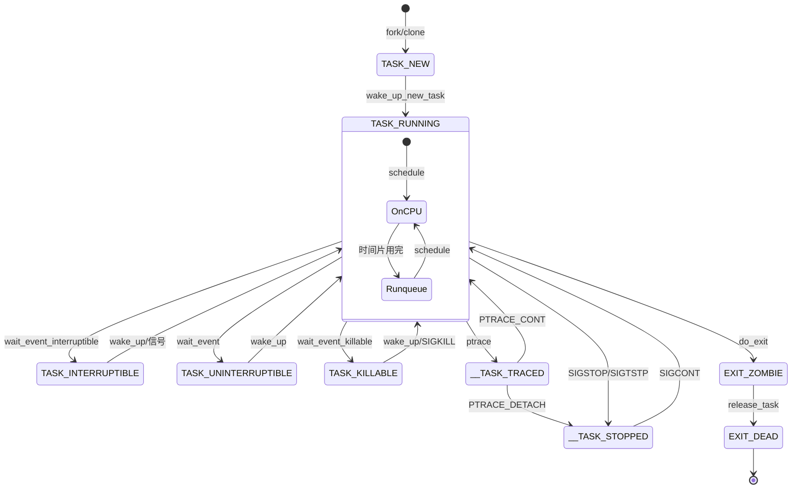

# 进程状态与上下文切换

## 学习目标

- 深入理解所有进程状态及其含义
- 掌握进入各种状态的所有方式和场景
- 理解 D 状态（TASK_UNINTERRUPTIBLE）的设计目的和问题
- **理解系统调用中进程状态的变化规律和进程身份**
- **澄清关键概念：系统调用时仍是用户进程在执行，只是切换到内核态**
- 掌握进程睡眠与唤醒机制的实现
- 理解僵尸进程的产生和避免方法
- **区分用户态/内核态切换与进程上下文切换的本质差异**
- 理解上下文切换（context_switch）的完整流程
- 了解 switch_to 宏的底层汇编实现
- 理解上下文切换的开销和优化方法

## 概述

进程状态与上下文切换是 Linux 进程调度的两大核心机制：

- **进程状态**：决定了进程是否可以被调度执行
  - TASK_RUNNING（运行态）
  - TASK_INTERRUPTIBLE/UNINTERRUPTIBLE（睡眠态）
  - TASK_STOPPED/TRACED（停止态）
  - EXIT_ZOMBIE（僵尸态）

- **上下文切换**：实现进程之间的 CPU 切换
  - 切换地址空间（页表）
  - 切换寄存器状态
  - 切换内核栈

本文将详细讲解每种状态的含义、进入方式、使用场景，以及上下文切换的完整实现。特别关注：

1. **系统调用中的进程身份与状态**：
   - 很多人误以为系统调用会改变进程状态或切换进程
   - **澄清关键概念**：系统调用时仍然是同一个用户进程在执行，只是从用户态切换到内核态
   - 进程在内核态执行时仍然是 TASK_RUNNING
   - 用户态/内核态切换 ≠ 进程切换

2. **D 状态的设计哲学**：
   - 为什么需要不可中断睡眠？
   - 如何避免 D 状态进程堆积？

3. **上下文切换的开销**：
   - 理解切换成本，优化系统性能
   - 区分特权级切换与进程切换

---

## 一、进程状态详解

### 状态定义

```c
// include/linux/sched.h

/* 基本运行状态 */
#define TASK_RUNNING            0x00000000  // 运行中或就绪

/* 睡眠状态 */
#define TASK_INTERRUPTIBLE      0x00000001  // 可中断睡眠
#define TASK_UNINTERRUPTIBLE    0x00000002  // 不可中断睡眠
#define TASK_KILLABLE           (TASK_WAKEKILL | TASK_UNINTERRUPTIBLE)

/* 停止状态 */
#define __TASK_STOPPED          0x00000004  // 停止
#define __TASK_TRACED           0x00000008  // 被跟踪

/* 退出状态 */
#define EXIT_DEAD               0x00000010  // 最终死亡
#define EXIT_ZOMBIE             0x00000020  // 僵尸
#define EXIT_TRACE              (EXIT_ZOMBIE | EXIT_DEAD)

/* 特殊状态 */
#define TASK_PARKED             0x00000040  // 停放
#define TASK_DEAD               0x00000080  // 死亡
#define TASK_WAKEKILL           0x00000100  // 可被致命信号唤醒
#define TASK_WAKING             0x00000200  // 正在唤醒
#define TASK_NOLOAD             0x00000400  // 不计入负载
#define TASK_NEW                0x00000800  // 新创建
```

### 状态含义

| 状态 | 含义 | 可调度 | 可被信号唤醒 |
|-----|------|-------|------------|
| TASK_RUNNING | 正在运行或在就绪队列 | 是 | - |
| TASK_INTERRUPTIBLE | 等待事件，可被信号中断 | 否 | 是 |
| TASK_UNINTERRUPTIBLE | 等待事件，不可中断 | 否 | 否 |
| TASK_KILLABLE | 等待事件，可被致命信号中断 | 否 | 仅 SIGKILL |
| __TASK_STOPPED | 收到 SIGSTOP 等信号 | 否 | SIGCONT |
| __TASK_TRACED | 被调试器跟踪 | 否 | 调试器控制 |
| EXIT_ZOMBIE | 已退出，等待父进程回收 | 否 | - |

### 状态转换详图



---

## 二、进入各种状态的方式详解

### 2.1 进入 TASK_RUNNING 状态

TASK_RUNNING 是进程的活跃状态，包括两种情况：
1. **正在 CPU 上运行**：进程当前占用 CPU
2. **在运行队列中等待**：进程就绪，等待调度器分配 CPU

#### 进入 TASK_RUNNING 的方式

```c
// 1. 进程创建时
pid_t pid = fork();  // 新进程初始状态为 TASK_RUNNING

// 2. 从睡眠状态被唤醒
wake_up(&wait_queue);  // 唤醒睡眠的进程

// 3. 从 STOPPED 状态恢复
kill(pid, SIGCONT);  // 发送 SIGCONT 信号

// 4. 从信号处理返回
// 信号处理完成后，进程恢复 TASK_RUNNING
```

### 2.2 进入 TASK_INTERRUPTIBLE 状态

TASK_INTERRUPTIBLE（可中断睡眠）是最常用的睡眠状态，可以被信号唤醒。

#### 使用场景

- 等待用户输入
- 等待网络数据
- 等待定时器到期
- 等待子进程退出

#### 进入方式

```c
// 1. wait_event_interruptible - 等待条件
wait_queue_head_t my_queue;
int condition = 0;

int ret = wait_event_interruptible(my_queue, condition != 0);
if (ret == -ERESTARTSYS) {
    // 被信号中断
}

// 2. schedule_timeout_interruptible - 定时睡眠
long timeout = msecs_to_jiffies(1000);  // 1秒
schedule_timeout_interruptible(timeout);

// 3. msleep_interruptible - 毫秒级睡眠
unsigned long ret = msleep_interruptible(1000);  // 睡眠1秒

// 4. down_interruptible - 信号量（可中断）
struct semaphore sem;
int ret = down_interruptible(&sem);
if (ret) {
    // 被信号中断
}

// 5. mutex_lock_interruptible - 互斥锁（可中断）
struct mutex lock;
int ret = mutex_lock_interruptible(&lock);
if (ret) {
    // 被信号中断
}

// 6. read/write 系统调用（阻塞模式）
char buf[100];
ssize_t n = read(fd, buf, sizeof(buf));  // 如果没有数据，进入可中断睡眠

// 7. Binder 同步调用（Android 特有）
// 发起 Binder 调用后，等待对方进程返回
Parcel data, reply;
remote->transact(code, data, &reply);  // 进入 TASK_INTERRUPTIBLE，等待返回
```

#### 重要场景：Binder 同步调用

在 Android 系统中，Binder IPC 是最常用的进程间通信机制。当进程发起**同步 Binder 调用**时：

```cpp
// frameworks/native/libs/binder/IPCThreadState.cpp
status_t IPCThreadState::waitForResponse(Parcel *reply, status_t *acquireResult)
{
    int32_t cmd;
    int32_t err;
    
    while (1) {
        // 通过 ioctl 进入内核，等待 Binder 驱动返回数据
        if (ioctl(mProcess->mDriverFD, BINDER_WRITE_READ, &bwr) >= 0)
            err = NO_ERROR;
        else
            err = -errno;
        
        // ioctl 阻塞期间，进程处于 TASK_INTERRUPTIBLE 状态
        
        if (err == NO_ERROR) {
            // 处理返回的数据
            if (talkWithDriver() == NO_ERROR) {
                // 收到回复，返回
            }
        }
    }
}
```

在 Binder 驱动中的实现：

```c
// drivers/android/binder.c
static int binder_thread_read(struct binder_proc *proc,
                               struct binder_thread *thread,
                               binder_uintptr_t binder_buffer,
                               size_t size,
                               binder_size_t *consumed,
                               int non_block)
{
    void __user *buffer = (void __user *)(uintptr_t)binder_buffer;
    void __user *ptr = buffer + *consumed;
    void __user *end = buffer + size;
    
    // 等待工作到来
    if (wait_for_proc_work) {
        // 进入 TASK_INTERRUPTIBLE 状态，等待被唤醒
        ret = wait_event_freezable_exclusive(proc->wait, 
                                             binder_has_proc_work(proc, thread));
    } else {
        // 等待特定线程的工作
        ret = wait_event_freezable(thread->wait, 
                                   binder_has_thread_work(thread));
    }
    
    if (ret)
        return ret;  // 被信号中断
    
    // 被唤醒后，处理 Binder 事务
    // ...
}
```

**Binder 调用的状态变化过程**：

```
1. 用户进程 A 调用 remote->transact()
   状态：TASK_RUNNING（用户态）
   ↓
2. 进入 ioctl(BINDER_WRITE_READ) 系统调用
   状态：TASK_RUNNING（内核态，Binder 驱动）
   ↓
3. 将 Binder 事务发送给目标进程 B
   唤醒进程 B 的 Binder 线程
   ↓
4. 调用 wait_event_freezable，等待回复
   状态：TASK_INTERRUPTIBLE（可中断睡眠）
   进程 A 让出 CPU，进入等待队列
   ↓
   【此时进程 B 处理请求】
   ↓
5. 进程 B 处理完成，发送 BC_REPLY
   唤醒进程 A（wake_up）
   ↓
6. 进程 A 被唤醒
   状态：TASK_RUNNING（内核态）
   ↓
7. 从 ioctl 返回，继续执行
   状态：TASK_RUNNING（用户态）
```

**为什么 Binder 使用 TASK_INTERRUPTIBLE？**

1. **允许被信号中断**：如果目标进程崩溃或无响应，调用者可以被 Ctrl+C 中断
2. **支持超时机制**：可以使用 `wait_event_interruptible_timeout`
3. **避免死锁**：如果使用 TASK_UNINTERRUPTIBLE，进程可能永久卡在 D 状态

**查看 Binder 调用时的进程状态**：

```bash
# 在 Binder 调用阻塞期间查看进程状态
$ adb shell ps -eo pid,stat,wchan:30,comm | grep your_process
12345 S     binder_thread_read        com.example.app
#     ↑
#     S = TASK_INTERRUPTIBLE（可中断睡眠）

# wchan 显示进程在内核中等待的函数
# binder_thread_read 表示正在等待 Binder 返回

# 如果进程在等待 Binder，可以看到调用堆栈
$ adb shell cat /proc/12345/stack
[<0>] binder_thread_read+0x2a8/0x1234
[<0>] binder_ioctl+0x5c4/0x890
[<0>] do_vfs_ioctl+0x4b0/0x6c0
[<0>] SyS_ioctl+0x7c/0xa0
```

#### 代码示例：驱动中的可中断睡眠

```c
// 驱动示例：等待设备就绪
static ssize_t my_device_read(struct file *file, char __user *buf,
                               size_t count, loff_t *ppos)
{
    struct my_device *dev = file->private_data;
    int ret;
    
    // 等待设备有数据可读（可中断）
    ret = wait_event_interruptible(dev->read_queue,
                                    dev->data_ready);
    if (ret)
        return -ERESTARTSYS;  // 被信号中断
    
    // 读取数据
    if (copy_to_user(buf, dev->buffer, count))
        return -EFAULT;
    
    return count;
}
```

### 2.3 进入 TASK_UNINTERRUPTIBLE 状态

TASK_UNINTERRUPTIBLE（不可中断睡眠，即 D 状态）不能被信号唤醒，只能被 `wake_up()` 唤醒。

#### 为什么需要 D 状态？

D 状态的设计目的是**保护关键操作的原子性**：

```c
// 场景：正在更新文件系统元数据
// 如果这时被信号中断，可能导致文件系统损坏
lock_buffer(bh);
modify_critical_data(bh);  // 在这期间必须不可中断
unlock_buffer(bh);
```

#### 进入 TASK_UNINTERRUPTIBLE 的方式

```c
// 1. wait_event - 等待条件（不可中断）
wait_event(wait_queue, condition);

// 2. schedule_timeout - 定时睡眠（不可中断）
set_current_state(TASK_UNINTERRUPTIBLE);
schedule_timeout(timeout);

// 3. msleep - 毫秒级睡眠（不可中断）
msleep(1000);  // 睡眠1秒，不可被信号中断

// 4. down - 信号量（不可中断）
struct semaphore sem;
down(&sem);  // 如果信号量不可用，进入不可中断睡眠

// 5. mutex_lock - 互斥锁（不可中断）
struct mutex lock;
mutex_lock(&lock);  // 如果锁被占用，进入不可中断睡眠

// 6. io_schedule - IO 等待
set_current_state(TASK_UNINTERRUPTIBLE);
io_schedule();  // 等待 IO 完成
```

#### D 状态的常见场景

```c
// 1. 磁盘 IO 操作
static void wait_for_io_completion(struct request *rq)
{
    DEFINE_WAIT(wait);
    
    prepare_to_wait(&rq->wait_queue, &wait, TASK_UNINTERRUPTIBLE);
    
    // 等待 IO 完成（不可中断，避免数据损坏）
    if (!request_completed(rq))
        io_schedule();
    
    finish_wait(&rq->wait_queue, &wait);
}

// 2. NFS 网络文件系统
// NFS 挂载时，如果服务器无响应，进程会卡在 D 状态
static int nfs_read_page(struct file *file, struct page *page)
{
    // NFS 读取可能进入长时间 D 状态
    return nfs_readpage_sync(file, page);
}

// 3. 等待页面回写
void wait_on_page_writeback(struct page *page)
{
    // 等待页面写回完成（不可中断）
    wait_event(page_wait_queue, !PageWriteback(page));
}
```

#### D 状态的问题

```bash
# D 状态进程无法被 kill，即使 kill -9 也无效
$ ps aux | grep D
root      1234  0.0  0.1   D   ?   0:00  process_name

$ kill -9 1234   # 无效！进程仍然存在

# 原因：进程在内核中等待，信号无法传递
# 只有当等待的资源就绪时，进程才能被唤醒并处理信号
```

### 2.4 进入 TASK_KILLABLE 状态

TASK_KILLABLE 是 TASK_UNINTERRUPTIBLE 的改进版本，可以被 SIGKILL 信号唤醒。

#### 设计目的

解决 D 状态进程无法杀死的问题：

```c
// TASK_KILLABLE 定义
#define TASK_KILLABLE  (TASK_WAKEKILL | TASK_UNINTERRUPTIBLE)

// 进程在关键操作时不可中断，但可以被 kill -9 强制终止
```

#### 使用示例

```c
// wait_event_killable - 可被 SIGKILL 中断
int ret = wait_event_killable(wait_queue, condition);
if (ret == -ERESTARTSYS) {
    // 被 SIGKILL 中断
    return ret;
}

// 内核实现
#define wait_event_killable(wq_head, condition)                 \
({                                                              \
    int __ret = 0;                                              \
    might_sleep();                                              \
    if (!(condition))                                           \
        __ret = __wait_event_killable(wq_head, condition);      \
    __ret;                                                      \
})
```

### 2.5 进入 STOPPED 状态

__TASK_STOPPED 状态表示进程被停止执行，通常用于作业控制。

#### 进入 STOPPED 的方式

```bash
# 1. 前台进程按 Ctrl+Z
$ long_running_command
^Z
[1]+  Stopped                 long_running_command

# 2. 发送 SIGSTOP 信号
$ kill -STOP <pid>

# 3. 发送 SIGTSTP 信号（终端停止）
$ kill -TSTP <pid>

# 4. 发送 SIGTTIN（后台进程试图读终端）
$ long_running_command &
[1] 12345
# 如果程序尝试从终端读取，会收到 SIGTTIN 并停止

# 5. 发送 SIGTTOU（后台进程试图写终端）
```

#### 从 STOPPED 恢复

```bash
# 1. 发送 SIGCONT 信号
$ kill -CONT <pid>

# 2. 前台继续执行
$ fg

# 3. 后台继续执行
$ bg
```

#### 代码中的状态检查

```c
// kernel/signal.c
static void do_signal_stop(int signr)
{
    struct signal_struct *sig = current->signal;
    int notify = 0;
    
    if (!sig->group_stop_count) {
        sig->group_stop_count = 1;
        notify = CLD_STOPPED;
    }
    
    // 设置为 STOPPED 状态
    __set_current_state(TASK_STOPPED);
    
    // 通知父进程
    if (notify)
        do_notify_parent_cldstop(current, notify, signr);
    
    // 调度到其他进程
    schedule();
}
```

### 2.6 进入 TRACED 状态

__TASK_TRACED 状态表示进程被调试器（如 gdb）跟踪。

#### 进入 TRACED 的方式

```bash
# 1. 使用 gdb 调试
$ gdb ./program
(gdb) run
# 进程进入 TRACED 状态

# 2. strace 跟踪系统调用
$ strace ./program
# 进程进入 TRACED 状态

# 3. 使用 ptrace 系统调用
```

#### ptrace 系统调用

```c
// 父进程跟踪子进程
pid_t pid = fork();

if (pid == 0) {
    // 子进程：请求被跟踪
    ptrace(PTRACE_TRACEME, 0, NULL, NULL);
    execl("./target", "target", NULL);
} else {
    // 父进程：等待子进程
    int status;
    waitpid(pid, &status, 0);
    
    // 子进程现在处于 TRACED 状态
    // 可以读取/修改子进程的内存和寄存器
    
    // 继续执行子进程
    ptrace(PTRACE_CONT, pid, NULL, NULL);
}
```

#### gdb 调试时的状态变化

```bash
# 查看进程状态
$ ps -eo pid,stat,comm | grep program
12345 t    program        # t = TRACED

# gdb 中的操作
(gdb) break main          # 设置断点
(gdb) run                 # 运行到断点，进入 TRACED
(gdb) continue            # 继续执行（仍在 TRACED）
(gdb) step                # 单步执行（TRACED）
(gdb) detach              # 分离调试器，进程恢复 RUNNING
```

### 2.7 进入 ZOMBIE 状态

EXIT_ZOMBIE（僵尸状态）表示进程已经执行完成，但其 task_struct 还未被回收。

#### 为什么会有僵尸进程？

```c
// 父进程需要获取子进程的退出状态
pid_t pid = fork();

if (pid == 0) {
    // 子进程
    exit(42);  // 退出码 42
    // 此时进入 ZOMBIE 状态，等待父进程回收
}

// 父进程
int status;
waitpid(pid, &status, 0);  // 回收子进程
int exit_code = WEXITSTATUS(status);  // 获取退出码 42
```

#### 僵尸进程的特点

```bash
# 查看僵尸进程
$ ps aux | grep Z
user     12345  0.0  0.0      0     0 ?        Z    10:00   0:00 [defunct]

# 僵尸进程的资源占用
# - 不占用内存（已释放）
# - 不占用 CPU
# - 仅占用一个 PID 和 task_struct
```

#### 如何避免僵尸进程

```c
// 方法1：父进程及时回收
pid_t pid = fork();
if (pid == 0) {
    // 子进程工作
    exit(0);
}

// 父进程及时 wait
waitpid(pid, NULL, 0);

// 方法2：忽略 SIGCHLD 信号（自动回收）
signal(SIGCHLD, SIG_IGN);

// 方法3：使用 sigaction 设置 SA_NOCLDWAIT
struct sigaction sa;
sa.sa_handler = SIG_DFL;
sa.sa_flags = SA_NOCLDWAIT;  // 不产生僵尸进程
sigaction(SIGCHLD, &sa, NULL);

// 方法4：捕获 SIGCHLD 并主动回收
void sigchld_handler(int signo)
{
    while (waitpid(-1, NULL, WNOHANG) > 0)
        ;  // 回收所有已退出的子进程
}

signal(SIGCHLD, sigchld_handler);
```

#### 内核中的僵尸处理

```c
// kernel/exit.c
void do_exit(long code)
{
    struct task_struct *tsk = current;
    
    // ... 释放资源 ...
    
    // 设置退出码
    tsk->exit_code = code;
    
    // 设置为僵尸状态
    tsk->state = EXIT_ZOMBIE;
    
    // 通知父进程
    do_notify_parent(tsk, tsk->exit_signal);
    
    // 调度到其他进程（不会再被调度回来）
    schedule();
    BUG();  // 不应该到达这里
}
```

### 2.8 系统调用中的进程状态

**重要问题：当用户空间发起系统调用后，进程处于什么状态？**

#### 答案：通常仍是 TASK_RUNNING

```c
// 用户空间
int fd = open("/path/to/file", O_RDONLY);  // 发起系统调用
char buf[100];
ssize_t n = read(fd, buf, sizeof(buf));    // 发起系统调用

// 进程状态：TASK_RUNNING（虽然在内核态执行）
```

#### 系统调用执行过程

```
用户态 TASK_RUNNING
    |
    | 系统调用指令（SVC/SYSCALL）
    ↓
内核态 TASK_RUNNING  ← 仍然是 RUNNING 状态！
    |
    | 执行系统调用代码
    |
    ├─→ 如果不需要等待：直接返回
    |   状态保持 TASK_RUNNING
    |
    └─→ 如果需要等待资源：
        - 设置为 TASK_INTERRUPTIBLE 或 TASK_UNINTERRUPTIBLE
        - 调用 schedule()
        - 让出 CPU
        
等待资源就绪：
    ↓
被唤醒：TASK_RUNNING
    ↓
继续执行系统调用
    ↓
返回用户态：TASK_RUNNING
```

#### 不同系统调用的状态变化

```c
// 1. 快速系统调用 - 始终 TASK_RUNNING
pid_t pid = getpid();     // 立即返回，不改变状态
int ret = gettimeofday(); // 立即返回，不改变状态

// 2. 可能睡眠的系统调用 - 可能改变状态
ssize_t n = read(fd, buf, size);
// 如果数据已就绪：TASK_RUNNING（快速返回）
// 如果数据未就绪：TASK_INTERRUPTIBLE（等待数据）

// 3. 阻塞的系统调用
int ret = wait(NULL);  // 等待子进程退出
// 进入 TASK_INTERRUPTIBLE 状态
// 直到子进程退出或收到信号

// 4. IO 密集型系统调用
ssize_t n = write(fd, buf, size);
// 如果缓冲区满：可能进入 TASK_UNINTERRUPTIBLE（等待IO）

// 5. Binder 同步调用（Android）
Parcel data, reply;
status_t result = remote->transact(TRANSACTION_CODE, data, &reply);
// 内部调用 ioctl(BINDER_WRITE_READ)
// 等待对方返回时：TASK_INTERRUPTIBLE
```

#### read() 系统调用示例

```c
// fs/read_write.c
SYSCALL_DEFINE3(read, unsigned int, fd, char __user *, buf, size_t, count)
{
    // 此时进程在内核态，状态仍是 TASK_RUNNING
    
    struct file *file = fget(fd);
    if (!file)
        return -EBADF;
    
    // 调用文件系统的 read 方法
    loff_t pos = file_pos_read(file);
    ret = vfs_read(file, buf, count, &pos);
    
    // vfs_read 可能调用到驱动的 read 函数
    // 驱动可能会调用 wait_event_interruptible
    // 这时状态才会改变为 TASK_INTERRUPTIBLE
    
    fput(file);
    return ret;
}

// 驱动中的实现
static ssize_t my_read(struct file *file, char __user *buf,
                       size_t count, loff_t *ppos)
{
    struct my_device *dev = file->private_data;
    
    // 等待数据就绪（状态改变为 TASK_INTERRUPTIBLE）
    if (wait_event_interruptible(dev->wait_queue, dev->data_ready))
        return -ERESTARTSYS;
    
    // 被唤醒后，状态恢复为 TASK_RUNNING
    return do_read(dev, buf, count);
}
```

#### Binder 同步调用示例（Android）

Binder 是一个特殊且重要的例子，它通过 `ioctl` 系统调用实现：

```c
// drivers/android/binder.c
static long binder_ioctl(struct file *filp, unsigned int cmd, unsigned long arg)
{
    // 进入时：TASK_RUNNING（内核态）
    
    struct binder_proc *proc = filp->private_data;
    struct binder_thread *thread;
    
    switch (cmd) {
    case BINDER_WRITE_READ:
        struct binder_write_read bwr;
        
        // 从用户空间复制参数
        if (copy_from_user(&bwr, ubuf, sizeof(bwr)))
            return -EFAULT;
        
        // 写入数据（发送 Binder 事务）
        if (bwr.write_size > 0)
            ret = binder_thread_write(proc, thread, ...);
        
        // 读取数据（等待 Binder 回复）
        if (bwr.read_size > 0) {
            // 这里可能进入 TASK_INTERRUPTIBLE
            ret = binder_thread_read(proc, thread, ...);
            // ↑ 在这个函数中调用 wait_event_freezable
            //   进程状态变为 TASK_INTERRUPTIBLE
        }
        
        // 返回时：TASK_RUNNING（内核态）
        return ret;
    }
}

// 等待 Binder 回复
static int binder_thread_read(...)
{
    // 状态：TASK_RUNNING（正在执行）
    
    // 检查是否有工作要处理
    if (binder_has_thread_work(thread)) {
        // 有工作，直接处理，保持 TASK_RUNNING
        goto process_work;
    }
    
    // 没有工作，需要等待
    // 进入 TASK_INTERRUPTIBLE 状态
    ret = wait_event_freezable(thread->wait, 
                               binder_has_thread_work(thread));
    
    if (ret) {
        // 被信号中断，返回错误
        return ret;
    }
    
    // 被唤醒，状态恢复为 TASK_RUNNING
process_work:
    // 处理 Binder 事务
    // ...
}
```

**完整的 Binder 调用流程**：

```
客户端进程（调用方）：
┌─────────────────────────────────────────────┐
│ Java/Native 代码                             │
│ remote.transact(code, data, reply)          │  TASK_RUNNING（用户态）
│        ↓                                     │
│ IPCThreadState::transact()                  │
│        ↓                                     │
│ ioctl(fd, BINDER_WRITE_READ, &bwr)          │  系统调用入口
└─────────────────────────────────────────────┘
                    ↓
┌─────────────────────────────────────────────┐
│ Binder 驱动（内核态）                        │  TASK_RUNNING（内核态）
│                                              │
│ binder_ioctl()                              │
│   ├─> binder_thread_write()                │
│   │     发送 BC_TRANSACTION 给服务端        │
│   │     唤醒服务端 Binder 线程              │
│   │                                          │
│   └─> binder_thread_read()                 │
│         wait_event_freezable()              │  TASK_INTERRUPTIBLE ← 在这里睡眠！
│         【等待服务端返回】                   │
└─────────────────────────────────────────────┘
                    ↓
        【服务端处理请求...】
                    ↓
┌─────────────────────────────────────────────┐
│ Binder 驱动（内核态）                        │
│                                              │
│ 服务端调用 BC_REPLY 返回结果                │
│   ├─> 将数据复制到客户端缓冲区              │
│   └─> wake_up(&thread->wait)               │  唤醒客户端
└─────────────────────────────────────────────┘
                    ↓
┌─────────────────────────────────────────────┐
│ 客户端被唤醒                                 │  TASK_RUNNING（内核态）
│                                              │
│ binder_thread_read() 继续执行               │
│   ├─> 读取 BR_REPLY                         │
│   └─> 返回到 binder_ioctl()                │
│         ↓                                    │
│ 从 ioctl 系统调用返回                       │  TASK_RUNNING（用户态）
│         ↓                                    │
│ transact() 返回                             │
└─────────────────────────────────────────────┘
```

**关键观察**：
1. `ioctl` 系统调用本身不改变状态（保持 TASK_RUNNING）
2. 只有在 `binder_thread_read` 中调用 `wait_event_freezable` 时才进入 TASK_INTERRUPTIBLE
3. 被唤醒后立即恢复 TASK_RUNNING，继续执行系统调用

#### 总结：系统调用中的状态

| 阶段 | 状态 | 说明 |
|-----|------|------|
| 用户态执行 | TASK_RUNNING | 正常执行用户代码 |
| 进入系统调用 | TASK_RUNNING | 切换到内核态，状态不变 |
| 内核态执行 | TASK_RUNNING | 执行系统调用代码 |
| 需要等待资源 | TASK_INTERRUPTIBLE<br>或 TASK_UNINTERRUPTIBLE | 主动调用 schedule() |
| 资源就绪被唤醒 | TASK_RUNNING | 恢复执行 |
| 返回用户态 | TASK_RUNNING | 系统调用完成 |

**关键点**：
1. 系统调用本身不改变进程状态
2. 只有系统调用中**主动睡眠**才会改变状态
3. 用户态/内核态切换 ≠ 进程状态切换

### 2.9 重要概念澄清：系统调用中的进程与上下文

很多人有一个疑问：**当用户进程陷入内核态后，真正在内核执行的还是用户进程吗？上下文是谁的？**

#### 答案：仍然是同一个用户进程在执行！

这是一个容易混淆的概念，关键要理解：

```
系统调用 ≠ 进程切换
用户态 → 内核态 ≠ 用户进程 → 内核进程
```

#### 进程的双重身份

每个进程都有**两个执行空间**：

```
┌────────────────────────────────────────────────────────┐
│              进程（task_struct）                        │
│                                                         │
│  ┌─────────────────────┐    ┌─────────────────────┐   │
│  │    用户态空间       │    │    内核态空间       │   │
│  │                     │    │                     │   │
│  │  用户代码           │    │  系统调用处理代码   │   │
│  │  用户栈             │    │  内核栈             │   │
│  │  用户堆             │    │  进程内核数据       │   │
│  │  .text .data .bss   │    │  task_struct       │   │
│  │                     │    │  thread_info       │   │
│  │  CPL=3 (用户特权级) │    │  CPL=0 (内核特权级) │   │
│  └─────────────────────┘    └─────────────────────┘   │
│           ↑                           ↑                 │
│           │    系统调用（不切换进程）│                 │
│           └───────────────────────────┘                 │
│                                                         │
│  【始终是同一个进程，只是在不同的特权级执行】         │
└────────────────────────────────────────────────────────┘
```

#### 系统调用的执行流程详解

```c
// 用户进程 PID=1234 在用户态执行
void user_function() {
    // 此时：
    // - current = task_struct(PID=1234)
    // - CPU 运行在用户态（CPL=3）
    // - 使用用户栈
    
    int fd = open("/path/file", O_RDONLY);  // 发起系统调用
    
    // 系统调用指令（ARM64: SVC, x86: SYSCALL）触发
    // ↓
}

// === CPU 硬件自动完成 ===
// 1. 保存用户态的寄存器（PC、SP、CPSR等）到内核栈
// 2. 切换到内核态（特权级提升 CPL=3 → CPL=0）
// 3. 切换栈指针：用户栈 → 内核栈（同一个进程的内核栈）
// 4. 跳转到系统调用处理入口

// === 内核态执行 ===
// 仍然是进程 PID=1234 在执行！
SYSCALL_DEFINE3(open, const char __user *, filename, int, flags, umode_t, mode)
{
    // 此时：
    // - current = task_struct(PID=1234)  ← 仍然是同一个进程！
    // - CPU 运行在内核态（CPL=0）
    // - 使用该进程的内核栈
    // - 可以访问内核内存和硬件
    
    printk("current process: %s, PID: %d\n", current->comm, current->pid);
    // 输出：current process: my_app, PID: 1234
    
    struct file *f = do_filp_open(filename, flags, mode);
    return PTR_ERR(f);
}

// === 返回用户态 ===
// 1. 从内核栈恢复用户态寄存器
// 2. 切换回用户态（CPL=0 → CPL=3）
// 3. 切换栈指针：内核栈 → 用户栈
// 4. 继续执行用户代码

// 用户进程继续执行
void user_function() {
    int fd = open("/path/file", O_RDONLY);  // 系统调用返回
    
    // 此时：
    // - current = task_struct(PID=1234)  ← 还是同一个进程
    // - CPU 运行在用户态
    // - 使用用户栈
}
```

#### current 指针的含义

Linux 内核使用 `current` 宏来获取当前正在执行的进程：

```c
// arch/arm64/include/asm/current.h
// current 始终指向当前 CPU 上正在执行的进程
static __always_inline struct task_struct *get_current(void)
{
    unsigned long sp_el0;
    
    asm ("mrs %0, sp_el0" : "=r" (sp_el0));
    
    return (struct task_struct *)sp_el0;
}

#define current get_current()

// 在系统调用中访问 current
SYSCALL_DEFINE1(getpid, void)
{
    // current 指向发起系统调用的用户进程
    return task_tgid_vnr(current);  // 返回当前进程的 PID
}

// 在任何内核代码中都可以使用 current
void some_kernel_function(void)
{
    // 这个函数知道是哪个进程调用的
    printk("Called by process: %s (PID: %d)\n", 
           current->comm, current->pid);
}
```

#### 上下文（Context）的归属

**上下文始终属于发起系统调用的用户进程**：

```c
// 进程上下文包含：
struct task_struct *current_process = current;

// 1. CPU 寄存器状态（保存在内核栈）
struct pt_regs *regs = task_pt_regs(current_process);
// - 通用寄存器（x0-x30）
// - 程序计数器（PC）
// - 栈指针（SP）
// - 处理器状态寄存器（PSTATE）

// 2. 内存地址空间（页表）
struct mm_struct *mm = current_process->mm;
// - 用户空间的虚拟地址映射
// - 页表（CR3/TTBR0）
// - 注意：内核空间所有进程共享

// 3. 内核栈
void *kernel_stack = current_process->stack;
// - 每个进程有独立的内核栈
// - 系统调用在这个栈上执行
// - 大小通常为 8KB 或 16KB

// 4. 进程描述符
// - task_struct 本身
// - 打开的文件描述符（files_struct）
// - 信号处理（signal_struct）
// - 等等
```

#### 用户态和内核态的切换过程

以 ARM64 架构为例：

```asm
// arch/arm64/kernel/entry.S

// 用户态调用系统调用
// 用户代码：syscall(SYS_write, fd, buf, count)
//   ↓
// 执行 SVC #0 指令

// === 硬件自动完成 ===
// 1. 保存用户态的 PC 到 ELR_EL1
// 2. 保存用户态的 PSTATE 到 SPSR_EL1
// 3. 切换到内核态（EL1）
// 4. 跳转到异常向量表 el0_sync

// === 内核代码 ===
el0_sync:
    // 保存用户态寄存器到内核栈
    kernel_entry 0
    
    // 此时的栈：当前进程的内核栈
    // 此时的 current：仍然是用户进程
    
    // 获取系统调用号
    ldr     x16, [tsk, #TSK_TI_FLAGS]
    
    // 调用系统调用处理函数
    bl      el0_svc_handler
    
    // 系统调用返回
    b       ret_to_user

ret_to_user:
    // 从内核栈恢复用户态寄存器
    kernel_exit 0
    
    // === 硬件自动完成 ===
    // 1. 从 ELR_EL1 恢复 PC
    // 2. 从 SPSR_EL1 恢复 PSTATE
    // 3. 切换回用户态（EL0）
    // 4. 继续执行用户代码
    eret
```

#### 内核栈与用户栈

每个进程有**两个栈**：

```c
// 进程的栈布局
struct task_struct {
    // ...
    void *stack;  // 内核栈指针
    struct mm_struct *mm;  // 包含用户栈信息
    // ...
};

// 内核栈（每个进程独立）
// 位置：内核空间
// 大小：通常 8KB 或 16KB
// 用途：系统调用、中断处理
union thread_union {
    struct thread_info thread_info;
    unsigned long stack[THREAD_SIZE/sizeof(long)];
};

// 用户栈（每个进程独立）
// 位置：用户空间（高地址）
// 大小：可增长，通常限制为 8MB
// 用途：用户态函数调用

// 系统调用时的栈切换
void syscall_example() {
    // 用户态：使用用户栈
    // SP 指向用户空间（如 0x7fff12340000）
    
    syscall(SYS_getpid);  // 触发系统调用
    
    // 内核态：自动切换到内核栈
    // SP 指向内核空间（如 0xffff888012340000）
    
    // 返回用户态：自动切换回用户栈
    // SP 恢复到用户空间
}
```

#### 与进程切换的对比

**场景1：系统调用（不切换进程）**：

```
时刻 T1: 进程 A 用户态执行
         current = A
         PID = 1234
         CPL = 3 (用户态)
         使用进程 A 的用户栈
         
         ↓ syscall 指令（SVC/SYSCALL）
         
时刻 T2: 进程 A 内核态执行  ← 仍然是进程 A！
         current = A         ← 没变
         PID = 1234          ← 没变
         CPL = 0 (内核态)    ← 改变
         使用进程 A 的内核栈  ← 切换栈
         
         执行系统调用代码...
         
         ↓ sysret 指令（ERET）
         
时刻 T3: 进程 A 用户态执行
         current = A
         PID = 1234
         CPL = 3 (用户态)
         使用进程 A 的用户栈

特点：
✓ 没有调用 schedule()
✓ 没有调用 context_switch()
✓ current 始终指向进程 A
✓ PID 始终是 1234
✓ task_struct 没有改变
✓ 页表（CR3/TTBR0）没有改变
✓ 只是特权级和栈指针改变
```

**场景2：进程切换（上下文切换）**：

```
时刻 T1: 进程 A 内核态执行
         current = A
         PID = 1234
         正在执行某个系统调用
         
         ↓ 时间片用完或主动睡眠
         ↓ schedule() 被调用
         
时刻 T2: 进入调度器
         __schedule()
         pick_next_task() → 选中进程 B
         context_switch(A, B)
         
         ↓ 保存 A 的寄存器
         ↓ 恢复 B 的寄存器
         ↓ 切换页表
         ↓ 切换内核栈
         ↓ switch_to(A, B, last)
         
时刻 T3: 进程 B 内核态执行  ← 切换到进程 B！
         current = B         ← 改变了！
         PID = 5678          ← 改变了！
         CPL = 0 (内核态)
         使用进程 B 的内核栈
         
         ↓ 进程 B 的系统调用完成
         ↓ 返回用户态
         
时刻 T4: 进程 B 用户态执行
         current = B
         PID = 5678
         CPL = 3 (用户态)

特点：
✓ 调用了 schedule()
✓ 调用了 context_switch()
✓ current 从进程 A 变为进程 B
✓ PID 从 1234 变为 5678
✓ task_struct 改变了
✓ 页表（CR3/TTBR0）改变了
✓ 所有寄存器状态改变了
✓ 内核栈切换了
```

**可视化对比**：

```
系统调用：同一进程的特权级切换
┌─────────────────────────────────────┐
│         进程 A (PID=1234)            │
│                                      │
│  用户态 ──syscall──> 内核态 ──sysret──> 用户态
│   ↑                    ↑              ↑   │
│   └────────────────────┴──────────────┘   │
│         current 始终指向进程 A            │
└─────────────────────────────────────┘

进程切换：不同进程之间的切换
┌───────────┐                    ┌───────────┐
│ 进程 A     │                    │ 进程 B     │
│ PID=1234  │  schedule()        │ PID=5678  │
│           │  context_switch()  │           │
│ 内核态 ────┼───────────────────>│ 内核态    │
│           │  切换 current      │           │
│ current=A │  切换页表          │ current=B │
└───────────┘  切换内核栈        └───────────┘
```

#### 实际验证

可以通过以下代码验证：

```c
// 用户态代码
#include <stdio.h>
#include <unistd.h>
#include <sys/syscall.h>

int main() {
    pid_t pid = getpid();
    printf("User space: PID = %d\n", pid);
    
    // 发起系统调用
    syscall(SYS_getpid);
    
    return 0;
}

// 内核模块代码
#include <linux/kernel.h>
#include <linux/module.h>

// 劫持 sys_getpid 系统调用（仅用于演示）
asmlinkage long my_getpid(void)
{
    // 在内核态，current 指向调用 getpid 的用户进程
    printk("Kernel space: current->comm = %s, current->pid = %d\n",
           current->comm, current->pid);
    
    // 输出：Kernel space: current->comm = my_app, current->pid = 1234
    // 证明内核态执行的仍然是用户进程的代码
    
    return task_tgid_vnr(current);
}
```

#### 系统调用 vs 进程切换对比表

| 维度 | 系统调用（特权级切换） | 进程切换（上下文切换） |
|-----|---------------------|---------------------|
| **本质** | 同一进程的特权级切换 | 不同进程之间切换 |
| **进程身份** | 仍然是发起调用的用户进程 | 从进程 A 切换到进程 B |
| **current 指针** | 不变，仍指向用户进程 | **改变**，从 A 切换到 B |
| **task_struct** | 不变，同一个 | **改变**，切换到另一个 |
| **页表（CR3/TTBR0）** | 不变（用户空间页表） | **改变**，加载新进程页表 |
| **内核栈** | 使用当前进程的内核栈 | **切换**到新进程的内核栈 |
| **用户栈** | 不变 | **改变**，切换到新进程的用户栈 |
| **CPU 寄存器** | 保存到当前进程内核栈 | 保存 A 的寄存器，恢复 B 的寄存器 |
| **特权级** | **改变**：CPL3 → CPL0 | 不变（都在内核态） |
| **内存地址空间** | 不变（同一个 mm_struct） | **改变**（切换 mm_struct） |
| **是否调用 schedule()** | **否** | **是** |
| **是否调用 context_switch()** | **否** | **是** |
| **进程 PID** | 不变 | **改变** |
| **开销** | 小（几百个 CPU 周期） | 大（几千到几万个 CPU 周期） |
| **状态变化** | 通常保持 TASK_RUNNING | 需要两个进程都是 TASK_RUNNING |
| **触发方式** | syscall/SVC 指令 | 调用 schedule() 函数 |

#### 问答总结

| 问题 | 答案 |
|-----|------|
| 系统调用时是哪个进程在执行？ | **仍然是发起系统调用的用户进程** |
| current 指向谁？ | **指向发起系统调用的用户进程** |
| 上下文是谁的？ | **是用户进程的上下文**（包括页表、内核栈、寄存器状态） |
| 用户态→内核态是进程切换吗？ | **不是**，只是特权级切换，不调用 schedule() |
| 内核栈属于谁？ | **每个进程有自己的内核栈**，系统调用使用当前进程的内核栈 |
| task_struct 变了吗？ | **没变**，始终是同一个 task_struct |
| 进程状态变了吗？ | **通常不变**，保持 TASK_RUNNING（除非主动睡眠） |
| 进程 PID 变了吗？ | **没变**，在内核中可以用 current->pid 验证 |

**关键理解**：
1. 进程既可以在用户态执行用户代码，也可以在内核态执行内核代码
2. 系统调用是**同一个进程的两种执行模式**，不是进程切换
3. 内核代码通过 `current` 知道是哪个进程在执行
4. 每个进程都有独立的内核栈，系统调用在这个栈上执行
5. 只有调用 `schedule()` 和 `context_switch()` 才是真正的进程切换
6. **系统调用 = 特权级切换**，**进程切换 = 上下文切换**，两者完全不同

---

## 三、进程睡眠机制

### 睡眠的基本流程

```c
// 睡眠的典型模式
// 1. 设置状态
set_current_state(TASK_INTERRUPTIBLE);

// 2. 检查条件
if (condition)
    goto done;

// 3. 进入睡眠
schedule();

// 4. 被唤醒后继续
done:
    set_current_state(TASK_RUNNING);
```

### wait_event 系列宏

```c
// include/linux/wait.h

// 不可中断睡眠
#define wait_event(wq_head, condition)                          \
do {                                                            \
    might_sleep();                                              \
    if (condition)                                              \
        break;                                                  \
    __wait_event(wq_head, condition);                           \
} while (0)

// 可中断睡眠
#define wait_event_interruptible(wq_head, condition)            \
({                                                              \
    int __ret = 0;                                              \
    might_sleep();                                              \
    if (!(condition))                                           \
        __ret = __wait_event_interruptible(wq_head, condition); \
    __ret;                                                      \
})

// 可被 SIGKILL 中断
#define wait_event_killable(wq_head, condition)                 \
({                                                              \
    int __ret = 0;                                              \
    might_sleep();                                              \
    if (!(condition))                                           \
        __ret = __wait_event_killable(wq_head, condition);      \
    __ret;                                                      \
})

// 带超时的睡眠
#define wait_event_timeout(wq_head, condition, timeout)         \
({                                                              \
    long __ret = timeout;                                       \
    might_sleep();                                              \
    if (!___wait_cond_timeout(condition))                       \
        __ret = __wait_event_timeout(wq_head, condition, timeout); \
    __ret;                                                      \
})
```

### __wait_event 实现

```c
// include/linux/wait.h
#define __wait_event(wq_head, condition)                        \
    (void)___wait_event(wq_head, condition, TASK_UNINTERRUPTIBLE, 0, 0, \
                        schedule())

#define ___wait_event(wq_head, condition, state, exclusive, ret, cmd)    \
({                                                                       \
    __label__ __out;                                                     \
    struct wait_queue_entry __wq_entry;                                  \
    long __ret = ret;                                                    \
                                                                         \
    init_wait_entry(&__wq_entry, exclusive ? WQ_FLAG_EXCLUSIVE : 0);     \
    for (;;) {                                                           \
        long __int = prepare_to_wait_event(&wq_head, &__wq_entry, state);\
                                                                         \
        if (condition)                                                   \
            break;                                                       \
                                                                         \
        if (___wait_is_interruptible(state) && __int) {                  \
            __ret = __int;                                               \
            goto __out;                                                  \
        }                                                                \
                                                                         \
        cmd;  /* schedule() */                                           \
    }                                                                    \
    finish_wait(&wq_head, &__wq_entry);                                  \
__out:  __ret;                                                           \
})
```

### 等待队列

```c
// include/linux/wait.h
struct wait_queue_head {
    spinlock_t lock;
    struct list_head head;
};

struct wait_queue_entry {
    unsigned int flags;
    void *private;              // 通常指向 task_struct
    wait_queue_func_t func;     // 唤醒回调函数
    struct list_head entry;
};

// 初始化等待队列
DECLARE_WAIT_QUEUE_HEAD(my_queue);
// 或
wait_queue_head_t my_queue;
init_waitqueue_head(&my_queue);
```

---

## 四、进程唤醒机制

### wake_up 系列函数

```c
// include/linux/wait.h

// 唤醒一个进程
#define wake_up(x)              __wake_up(x, TASK_NORMAL, 1, NULL)

// 唤醒所有进程
#define wake_up_all(x)          __wake_up(x, TASK_NORMAL, 0, NULL)

// 唤醒可中断的进程
#define wake_up_interruptible(x) __wake_up(x, TASK_INTERRUPTIBLE, 1, NULL)

// 唤醒所有可中断的进程
#define wake_up_interruptible_all(x) __wake_up(x, TASK_INTERRUPTIBLE, 0, NULL)
```

### __wake_up() 实现

```c
// kernel/sched/wait.c
void __wake_up(struct wait_queue_head *wq_head, unsigned int mode,
               int nr_exclusive, void *key)
{
    __wake_up_common_lock(wq_head, mode, nr_exclusive, 0, key);
}

static void __wake_up_common_lock(struct wait_queue_head *wq_head,
                                  unsigned int mode, int nr_exclusive,
                                  int wake_flags, void *key)
{
    unsigned long flags;
    
    spin_lock_irqsave(&wq_head->lock, flags);
    __wake_up_common(wq_head, mode, nr_exclusive, wake_flags, key);
    spin_unlock_irqrestore(&wq_head->lock, flags);
}

static int __wake_up_common(struct wait_queue_head *wq_head, unsigned int mode,
                            int nr_exclusive, int wake_flags, void *key)
{
    struct wait_queue_entry *curr, *next;
    int cnt = 0;
    
    // 遍历等待队列
    list_for_each_entry_safe(curr, next, &wq_head->head, entry) {
        unsigned flags = curr->flags;
        int ret;
        
        // 调用唤醒函数
        ret = curr->func(curr, mode, wake_flags, key);
        
        if (ret < 0)
            break;
        
        if (ret && (flags & WQ_FLAG_EXCLUSIVE) && !--nr_exclusive)
            break;
        
        cnt++;
    }
    
    return cnt;
}
```

### try_to_wake_up() - 核心唤醒函数

```c
// kernel/sched/core.c
static int try_to_wake_up(struct task_struct *p, unsigned int state,
                          int wake_flags)
{
    unsigned long flags;
    int cpu, success = 0;
    
    // 获取锁
    raw_spin_lock_irqsave(&p->pi_lock, flags);
    
    // 检查进程状态
    if (!(p->state & state))
        goto out;
    
    // 设置状态为 TASK_WAKING
    if (p->on_rq && ttwu_runnable(p, wake_flags))
        goto out;
    
    // 获取目标 CPU
    cpu = select_task_rq(p, p->wake_cpu, SD_BALANCE_WAKE, wake_flags);
    
    // 设置状态为 TASK_RUNNING
    WRITE_ONCE(p->state, TASK_RUNNING);
    
    // 加入运行队列
    ttwu_queue(p, cpu, wake_flags);
    
    success = 1;
out:
    raw_spin_unlock_irqrestore(&p->pi_lock, flags);
    return success;
}
```

---

## 五、上下文切换（context_switch）

### 什么是上下文

进程上下文包括：
1. **CPU 寄存器**：通用寄存器、程序计数器、栈指针等
2. **内存映射**：页表（地址空间）
3. **内核栈**：内核态使用的栈

### schedule() - 调度入口

```c
// kernel/sched/core.c
asmlinkage __visible void __sched schedule(void)
{
    struct task_struct *tsk = current;
    
    // 调度前准备
    sched_submit_work(tsk);
    
    do {
        preempt_disable();
        __schedule(SM_NONE);
        sched_preempt_enable_no_resched();
    } while (need_resched());
    
    sched_update_worker(tsk);
}
```

### __schedule() - 调度核心

```c
// kernel/sched/core.c
static void __sched notrace __schedule(unsigned int sched_mode)
{
    struct task_struct *prev, *next;
    unsigned long *switch_count;
    struct rq_flags rf;
    struct rq *rq;
    int cpu;
    
    cpu = smp_processor_id();
    rq = cpu_rq(cpu);
    prev = rq->curr;
    
    // 1. 锁定运行队列
    rq_lock(rq, &rf);
    
    // 2. 如果当前进程不再运行，从运行队列移除
    if (!preempt_count() && prev->state) {
        if (signal_pending_state(prev->state, prev)) {
            prev->state = TASK_RUNNING;
        } else {
            deactivate_task(rq, prev, DEQUEUE_SLEEP);
        }
    }
    
    // 3. 选择下一个进程
    next = pick_next_task(rq, prev, &rf);
    
    // 4. 清除需要重新调度标志
    clear_tsk_need_resched(prev);
    clear_preempt_need_resched();
    
    // 5. 上下文切换
    if (likely(prev != next)) {
        rq->nr_switches++;
        RCU_INIT_POINTER(rq->curr, next);
        
        // 执行上下文切换
        rq = context_switch(rq, prev, next, &rf);
    } else {
        rq_unlock_irq(rq, &rf);
    }
    
    // 6. 平衡负载
    balance_callback(rq);
}
```

### context_switch() - 上下文切换

```c
// kernel/sched/core.c
static __always_inline struct rq *
context_switch(struct rq *rq, struct task_struct *prev,
               struct task_struct *next, struct rq_flags *rf)
{
    // 准备切换
    prepare_task_switch(rq, prev, next);
    
    // 1. 切换地址空间
    if (!next->mm) {
        // next 是内核线程
        enter_lazy_tlb(prev->active_mm, next);
        next->active_mm = prev->active_mm;
        if (prev->mm)
            mmgrab(prev->active_mm);
        else
            prev->active_mm = NULL;
    } else {
        // next 是用户进程
        membarrier_switch_mm(rq, prev->active_mm, next->mm);
        switch_mm_irqs_off(prev->active_mm, next->mm, next);
        
        if (!prev->mm) {
            // prev 是内核线程
            rq->prev_mm = prev->active_mm;
            prev->active_mm = NULL;
        }
    }
    
    // 2. 切换寄存器上下文
    switch_to(prev, next, prev);
    
    // 3. 完成切换
    return finish_task_switch(prev);
}
```

### 上下文切换流程图

```
                    context_switch
                          │
         ┌────────────────┴────────────────┐
         │                                 │
         ▼                                 ▼
   切换地址空间                        切换寄存器
  switch_mm_irqs_off                    switch_to
         │                                 │
         ▼                                 ▼
   ┌───────────────┐               ┌───────────────┐
   │ 加载新页表     │               │ 保存 prev 寄存器 │
   │ (TTBR0/CR3)   │               │ 恢复 next 寄存器 │
   │ 刷新 TLB      │               │ 切换内核栈     │
   └───────────────┘               └───────────────┘
```

---

## 六、switch_to - 切换寄存器上下文

### ARM64 实现

```c
// arch/arm64/include/asm/switch_to.h
#define switch_to(prev, next, last)                             \
    do {                                                        \
        (last) = __switch_to((prev), (next));                   \
    } while (0)

// arch/arm64/kernel/process.c
__notrace_funcgraph struct task_struct *__switch_to(
    struct task_struct *prev,
    struct task_struct *next)
{
    struct task_struct *last;
    
    // 1. 保存浮点/SIMD 寄存器
    fpsimd_thread_switch(next);
    
    // 2. 保存 TLS
    tls_thread_switch(next);
    
    // 3. 切换硬件调试寄存器
    hw_breakpoint_thread_switch(next);
    
    // 4. 上下文跟踪
    contextidr_thread_switch(next);
    
    // 5. 切换地址空间（用户页表）
    entry_task_switch(next);
    
    // 6. 调用汇编切换
    last = cpu_switch_to(prev, next);
    
    return last;
}
```

### ARM64 汇编切换

```asm
// arch/arm64/kernel/entry.S
SYM_FUNC_START(cpu_switch_to)
    // x0 = prev task_struct
    // x1 = next task_struct
    
    // 计算 prev 的 cpu_context 偏移
    mov     x10, #THREAD_CPU_CONTEXT
    add     x8, x0, x10
    
    // 保存 prev 的 callee-saved 寄存器
    stp     x19, x20, [x8], #16
    stp     x21, x22, [x8], #16
    stp     x23, x24, [x8], #16
    stp     x25, x26, [x8], #16
    stp     x27, x28, [x8], #16
    stp     x29, x9, [x8], #16      // x29=FP, x9=保存的 SP
    
    // 保存 prev 的 SP 和 PC
    mov     x9, sp
    str     x9, [x8]
    str     lr, [x8, #8]            // 返回地址作为恢复点
    
    // 计算 next 的 cpu_context 偏移
    add     x8, x1, x10
    
    // 恢复 next 的 callee-saved 寄存器
    ldp     x19, x20, [x8], #16
    ldp     x21, x22, [x8], #16
    ldp     x23, x24, [x8], #16
    ldp     x25, x26, [x8], #16
    ldp     x27, x28, [x8], #16
    ldp     x29, x9, [x8], #16
    
    // 恢复 next 的 SP
    ldr     x9, [x8]
    mov     sp, x9
    
    // 恢复 next 的 PC（跳转）
    ldr     x9, [x8, #8]
    
    // 设置返回值为 prev
    mov     x0, x0
    
    // 跳转到 next 的恢复点
    ret     x9
SYM_FUNC_END(cpu_switch_to)
```

### switch_to 的返回值

switch_to 有三个参数：prev、next、last

```c
// switch_to(prev, next, last) 的执行流程：

// 1. 进程 A 执行 switch_to(A, B, last)
//    - 保存 A 的上下文
//    - 恢复 B 的上下文
//    - 跳转到 B 上次被切走的位置

// 2. 进程 B 开始执行...

// 3. 后来，进程 C 执行 switch_to(C, A, last)
//    - 保存 C 的上下文
//    - 恢复 A 的上下文
//    - A 从 switch_to 返回，last = C

// 所以 last 是"上一个运行在这个 CPU 上的进程"
```

---

## 七、finish_task_switch() - 完成切换

```c
// kernel/sched/core.c
static struct rq *finish_task_switch(struct task_struct *prev)
    __releases(rq->lock)
{
    struct rq *rq = this_rq();
    struct mm_struct *mm = rq->prev_mm;
    
    // 清除 prev_mm
    rq->prev_mm = NULL;
    
    // 如果 prev 是内核线程借用的 mm，释放它
    if (mm)
        mmdrop(mm);
    
    // 如果 prev 已经退出，释放它
    if (unlikely(prev->state == TASK_DEAD)) {
        put_task_struct_rcu_user(prev);
        
        // 释放 prev 的内核栈
        put_task_stack(prev);
        
        // 释放 task_struct
        put_task_struct(prev);
    }
    
    return rq;
}
```

---

## 八、抢占与调度时机

### 调度时机

1. **自愿调度**：进程主动调用 schedule()
   - 等待 IO
   - 等待锁
   - 调用 sleep

2. **强制调度**：设置 need_resched 标志
   - 时间片用完
   - 更高优先级进程就绪
   - 中断返回时检查

### need_resched 标志

```c
// include/linux/sched.h
static inline void set_tsk_need_resched(struct task_struct *tsk)
{
    set_tsk_thread_flag(tsk, TIF_NEED_RESCHED);
}

static inline void clear_tsk_need_resched(struct task_struct *tsk)
{
    clear_tsk_thread_flag(tsk, TIF_NEED_RESCHED);
}

static inline int test_tsk_need_resched(struct task_struct *tsk)
{
    return unlikely(test_tsk_thread_flag(tsk, TIF_NEED_RESCHED));
}
```

### 抢占检查点

```c
// 1. 系统调用返回用户空间
// arch/arm64/kernel/entry.S
ret_to_user:
    disable_daif
    ldr     x1, [tsk, #TSK_TI_FLAGS]
    tbnz    x1, #TIF_NEED_RESCHED, el0_svc_reschedule

// 2. 中断返回
// arch/arm64/kernel/entry.S
el1_irq:
    // ...
    irq_handler
    // 检查是否需要重新调度
    ldr     x24, [tsk, #TSK_TI_PREEMPT]
    cbnz    x24, 1f                     // 如果抢占计数非零，跳过
    ldr     x0, [tsk, #TSK_TI_FLAGS]
    tbz     x0, #TIF_NEED_RESCHED, 1f   // 如果不需要重新调度，跳过
    bl      el1_preempt                 // 执行抢占
1:
    // 返回

// 3. 内核抢占点
// kernel/sched/core.c
asmlinkage __visible void __sched preempt_schedule(void)
{
    if (likely(!preemptible()))
        return;
    
    preempt_schedule_common();
}
```

### 内核抢占

```c
// 抢占计数器
// include/linux/preempt.h
#define preempt_count()         (current_thread_info()->preempt_count)

// 禁用抢占
#define preempt_disable()       \
do {                            \
    preempt_count_inc();        \
    barrier();                  \
} while (0)

// 启用抢占
#define preempt_enable()        \
do {                            \
    barrier();                  \
    if (unlikely(preempt_count_dec_and_test())) \
        __preempt_schedule();   \
} while (0)
```

---

## 九、上下文切换开销

### 直接开销

1. **CPU 寄存器保存/恢复**：约 10-50 个寄存器
2. **页表切换**：修改 CR3（x86）或 TTBR0（ARM64）
3. **TLB 刷新**：地址空间切换需要刷新 TLB
4. **缓存失效**：新进程的数据可能不在缓存中

### 间接开销

1. **缓存污染**：新进程需要重新加载缓存
2. **TLB Miss**：页表切换后的地址翻译
3. **分支预测失效**：新进程的分支模式不同

### 优化措施

```c
// 1. 惰性 TLB 切换
// 内核线程不需要自己的地址空间
static inline void enter_lazy_tlb(struct mm_struct *mm, struct task_struct *tsk)
{
    // 保持使用前一个进程的页表
}

// 2. PCID（Process Context ID）
// x86: 避免频繁刷新 TLB
// 每个地址空间有一个唯一 ID

// 3. ASID（Address Space ID）
// ARM64: 类似 PCID
// 页表项中包含 ASID，TLB 可以缓存多个地址空间
```

---

## 总结

### 核心要点

1. **进程状态分类**：
   - **TASK_RUNNING**：运行或就绪状态，可被调度
   - **TASK_INTERRUPTIBLE**：可中断睡眠，可被信号唤醒
   - **TASK_UNINTERRUPTIBLE**：不可中断睡眠（D状态），只能被 wake_up 唤醒
   - **TASK_KILLABLE**：可被 SIGKILL 唤醒的不可中断睡眠
   - **__TASK_STOPPED**：停止状态，可被 SIGCONT 恢复
   - **__TASK_TRACED**：被调试器跟踪
   - **EXIT_ZOMBIE**：僵尸状态，等待父进程回收

2. **进入不同状态的方式**：
   - **TASK_INTERRUPTIBLE**：
     - `wait_event_interruptible()` - 等待条件
     - `msleep_interruptible()` - 可中断睡眠
     - `mutex_lock_interruptible()` - 可中断加锁
     - `read()/write()` 系统调用（阻塞模式）
     - **Binder 同步调用**（Android）- 等待对方进程返回
   
   - **TASK_UNINTERRUPTIBLE**：
     - `wait_event()` - 不可中断等待
     - `msleep()` - 不可中断睡眠
     - `mutex_lock()` - 不可中断加锁
     - `io_schedule()` - IO 等待
   
   - **TASK_STOPPED**：
     - 按 `Ctrl+Z`
     - 收到 `SIGSTOP/SIGTSTP` 信号
   
   - **TASK_TRACED**：
     - `ptrace()` 系统调用
     - `gdb/strace` 调试工具
   
   - **EXIT_ZOMBIE**：
     - 进程调用 `exit()` 但父进程未 `wait()`

3. **系统调用中的进程与上下文**（重要概念）：
   - **核心理解**：系统调用 ≠ 进程切换
   - **进程身份**：系统调用时**仍然是用户进程在执行**，只是切换到内核态
   - **current 指针**：始终指向发起系统调用的用户进程
   - **上下文归属**：上下文（页表、内核栈、寄存器）属于用户进程
   - **进程状态**：通常保持 TASK_RUNNING（除非主动睡眠）
   - **关键区别**：
     - 用户态→内核态：特权级切换，不调用 `schedule()`
     - 进程切换：调用 `schedule()` 和 `context_switch()`，切换 task_struct
   - **每个进程有两个栈**：用户栈（用户态使用）和内核栈（内核态使用）
   - **示例**：
     - `getpid()` - 始终 TASK_RUNNING，current 指向用户进程
     - `read()` - 数据未就绪时进入 TASK_INTERRUPTIBLE，但仍是用户进程
     - `write()` - 缓冲区满时可能进入 TASK_UNINTERRUPTIBLE
     - **`ioctl(BINDER_WRITE_READ)`**（Android）- Binder 调用等待时进入 TASK_INTERRUPTIBLE

4. **D 状态（TASK_UNINTERRUPTIBLE）的重要性**：
   - **设计目的**：保护关键操作的原子性
   - **典型场景**：磁盘 IO、文件系统元数据更新、NFS 挂载
   - **特点**：无法被 `kill -9` 杀死
   - **改进**：TASK_KILLABLE 可被 SIGKILL 中断
   - **对比**：Binder 使用 TASK_INTERRUPTIBLE 而非 D 状态，避免进程永久挂起

5. **Binder 同步调用的状态变化**（Android 重要场景）：
   - **发起调用**：`remote->transact()` → `ioctl(BINDER_WRITE_READ)`
   - **等待阶段**：在 `binder_thread_read()` 中调用 `wait_event_freezable()`
   - **进程状态**：TASK_INTERRUPTIBLE（可中断睡眠）
   - **被唤醒**：目标进程返回 BC_REPLY，调用 `wake_up()` 唤醒
   - **为何可中断**：允许被信号中断，避免进程永久阻塞（如对方崩溃）
   - **调试方法**：`ps` 查看状态为 S，`wchan` 显示 `binder_thread_read`

6. **僵尸进程处理**：
   - **产生原因**：子进程退出但父进程未 `wait()`
   - **避免方法**：
     - 及时调用 `wait()/waitpid()`
     - 设置 `signal(SIGCHLD, SIG_IGN)`
     - 使用 `SA_NOCLDWAIT` 标志
   - **特点**：不占用内存和 CPU，仅占用 PID

7. **睡眠与唤醒机制**：
   - **wait_event 系列**：进入睡眠，等待条件满足
   - **wake_up 系列**：唤醒等待队列中的进程
   - **try_to_wake_up**：核心唤醒函数，设置状态并加入运行队列

8. **上下文切换**：
   - **context_switch**：切换入口
   - **switch_mm**：切换地址空间（页表）
   - **switch_to**：切换寄存器（汇编实现）
   - **开销**：寄存器保存/恢复、TLB 刷新、缓存失效

9. **调度时机**：
   - **自愿调度**：主动调用 `schedule()`
   - **强制调度**：`need_resched` 标志触发
   - **检查点**：系统调用返回、中断返回、`preempt_enable()`

### 后续学习

- [进程调度基础架构](08-进程调度基础架构.md) - 深入调度器框架
- [CFS调度器详解](09-CFS调度器详解.md) - 理解完全公平调度

## 参考资源

- 内核源码：
  - `kernel/sched/core.c` - 调度核心
  - `arch/arm64/kernel/process.c` - ARM64 上下文切换
  - `include/linux/sched.h` - 进程状态定义
  - `kernel/sched/wait.c` - 等待队列

## 更新记录

- 2026-01-31：重大更新
  - 新增第二章：详细讲解进入各种状态的所有方式和场景
  - 新增 2.8 节：系统调用中的进程状态详解，包含 Binder 场景
  - **新增 2.9 节：重要概念澄清 - 系统调用中的进程与上下文**
    - 澄清系统调用时仍是用户进程在执行的核心概念
    - 详细讲解 current 指针、进程身份、上下文归属
    - 对比系统调用（特权级切换）与进程切换（上下文切换）
    - 添加进程双重身份图、执行流程对比图、对比表格
  - 补充 Binder 同步调用的状态分析（Android 场景）
  - 更新学习目标和总结，强调关键概念
- 2026-01-27：初始创建，包含进程状态与上下文切换详解
