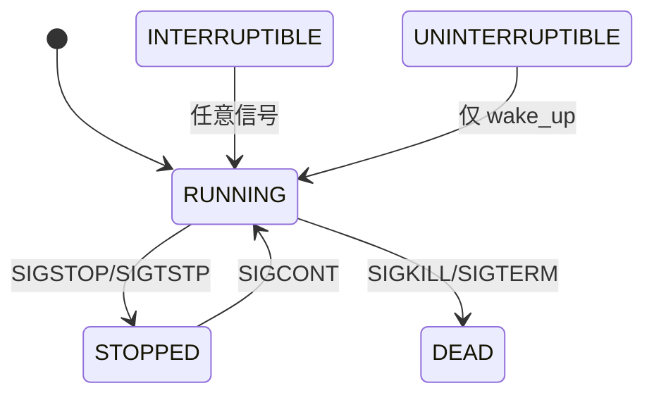

# 信号机制详解

## 学习目标

- 理解信号的概念和分类
- 掌握信号的发送和接收机制
- 理解信号处理函数的执行
- 了解信号阻塞和等待机制
- 理解实时信号与标准信号的区别

## 概述

信号（Signal）是 Unix/Linux 系统中最古老的进程间通信机制，主要用于通知进程发生了某个事件。信号是异步的，进程可以随时接收到信号。

---

## 一、信号概念与分类

### 信号列表

```bash
# 查看系统支持的信号
kill -l

# 标准信号（1-31）
 1) SIGHUP       2) SIGINT       3) SIGQUIT      4) SIGILL
 5) SIGTRAP      6) SIGABRT      7) SIGBUS       8) SIGFPE
 9) SIGKILL     10) SIGUSR1     11) SIGSEGV     12) SIGUSR2
13) SIGPIPE     14) SIGALRM     15) SIGTERM     16) SIGSTKFLT
17) SIGCHLD     18) SIGCONT     19) SIGSTOP     20) SIGTSTP
21) SIGTTIN     22) SIGTTOU     23) SIGURG      24) SIGXCPU
25) SIGXFSZ     26) SIGVTALRM   27) SIGPROF     28) SIGWINCH
29) SIGIO       30) SIGPWR      31) SIGSYS

# 实时信号（32-64）
32) SIGRTMIN    33) SIGRTMIN+1  ... 64) SIGRTMAX
```

### 常用信号

| 信号 | 编号 | 默认动作 | 说明 |
|-----|------|---------|-----|
| SIGHUP | 1 | 终止 | 终端挂起 |
| SIGINT | 2 | 终止 | Ctrl+C |
| SIGQUIT | 3 | 核心转储 | Ctrl+\ |
| SIGKILL | 9 | 终止 | 强制终止（不可捕获） |
| SIGSEGV | 11 | 核心转储 | 段错误 |
| SIGPIPE | 13 | 终止 | 管道破裂 |
| SIGALRM | 14 | 终止 | 定时器 |
| SIGTERM | 15 | 终止 | 终止请求 |
| SIGCHLD | 17 | 忽略 | 子进程状态改变 |
| SIGCONT | 18 | 继续 | 继续执行 |
| SIGSTOP | 19 | 停止 | 停止（不可捕获） |
| SIGUSR1 | 10 | 终止 | 用户定义 |
| SIGUSR2 | 12 | 终止 | 用户定义 |

### 信号分类

```c
// include/uapi/asm-generic/signal.h

// 标准信号（不可靠信号）
// 1-31：可能丢失，不排队
#define SIGHUP    1
#define SIGINT    2
// ...
#define SIGSYS   31

// 实时信号（可靠信号）
// 32-64：保证送达，排队
#define SIGRTMIN 32
#define SIGRTMAX 64
```

---

## 二、信号发送

### 系统调用

```c
// 发送信号给进程
int kill(pid_t pid, int sig);

// 发送信号给自己
int raise(int sig);

// 发送信号并携带数据
int sigqueue(pid_t pid, int sig, const union sigval value);

// 向线程发送信号
int pthread_kill(pthread_t thread, int sig);
int tgkill(pid_t tgid, pid_t tid, int sig);
```

### kill() 系统调用实现

```c
// kernel/signal.c
SYSCALL_DEFINE2(kill, pid_t, pid, int, sig)
{
    struct kernel_siginfo info;
    
    clear_siginfo(&info);
    info.si_signo = sig;
    info.si_errno = 0;
    info.si_code = SI_USER;
    info.si_pid = task_tgid_vnr(current);
    info.si_uid = from_kuid_munged(current_user_ns(), current_uid());
    
    return kill_something_info(sig, &info, pid);
}

static int kill_something_info(int sig, struct kernel_siginfo *info, pid_t pid)
{
    if (pid > 0) {
        // 发送给单个进程
        return kill_proc_info(sig, info, pid);
    } else if (pid == 0) {
        // 发送给同进程组的所有进程
        return kill_pgrp_info(sig, info, task_pgrp(current));
    } else if (pid == -1) {
        // 发送给所有进程（除了 init 和自己）
        return kill_proc_info(sig, info, -1);
    } else {
        // 发送给指定进程组
        return kill_pgrp_info(sig, info, find_vpid(-pid));
    }
}
```

### do_send_sig_info() - 发送信号核心函数

```c
// kernel/signal.c
int do_send_sig_info(int sig, struct kernel_siginfo *info, struct task_struct *p,
                     enum pid_type type)
{
    unsigned long flags;
    int ret = -ESRCH;
    
    if (lock_task_sighand(p, &flags)) {
        ret = send_signal(sig, info, p, type);
        unlock_task_sighand(p, &flags);
    }
    
    return ret;
}

static int send_signal(int sig, struct kernel_siginfo *info, struct task_struct *t,
                       enum pid_type type)
{
    struct sigpending *pending;
    struct sigqueue *q;
    int override_rlimit;
    int ret = 0;
    
    // 选择待处理信号队列
    pending = (type != PIDTYPE_PID) ? &t->signal->shared_pending : &t->pending;
    
    // 检查信号是否已在待处理集合中
    if (legacy_queue(pending, sig))
        goto ret;
    
    // 分配信号队列节点
    q = __sigqueue_alloc(sig, t, GFP_ATOMIC, override_rlimit);
    if (q) {
        list_add_tail(&q->list, &pending->list);
        // 复制信号信息
        copy_siginfo(&q->info, info);
        
        // 设置待处理位
        sigaddset(&pending->signal, sig);
    }
    
    // 唤醒目标进程
    complete_signal(sig, t, type);
    
ret:
    return ret;
}
```

### complete_signal() - 完成信号发送

```c
// kernel/signal.c
static void complete_signal(int sig, struct task_struct *p, enum pid_type type)
{
    struct signal_struct *signal = p->signal;
    struct task_struct *t;
    
    // 找到合适的目标线程
    if (wants_signal(sig, p))
        t = p;
    else if ((type == PIDTYPE_PID) || thread_group_empty(p))
        return;
    else {
        // 在线程组中找一个可以接收的线程
        t = signal->curr_target;
        while (!wants_signal(sig, t)) {
            t = next_thread(t);
            if (t == signal->curr_target)
                return;
        }
        signal->curr_target = t;
    }
    
    // 设置 TIF_SIGPENDING
    if (!sig_fatal(p, sig)) {
        if (sig_kernel_stop(sig))
            // 停止信号
        else
            // 设置待处理标志
            signal_wake_up(t, sig == SIGKILL);
    }
}
```

---

## 三、信号接收与处理

### 信号检查点

信号在以下时机被检查和处理：
1. 系统调用返回用户空间时
2. 中断返回用户空间时
3. 从睡眠状态被唤醒时

```c
// arch/arm64/kernel/entry.S
// 系统调用返回时检查
ret_to_user:
    disable_daif
    ldr     x1, [tsk, #TSK_TI_FLAGS]
    tbnz    x1, #TIF_SIGPENDING, do_signal
    // ...
```

### get_signal() - 获取待处理信号

```c
// kernel/signal.c
bool get_signal(struct ksignal *ksig)
{
    struct sighand_struct *sighand = current->sighand;
    struct signal_struct *signal = current->signal;
    int signr;
    
    for (;;) {
        struct k_sigaction *ka;
        
        // 1. 处理组退出
        if (signal_group_exit(signal)) {
            do_exit(signal->group_exit_code);
        }
        
        // 2. 获取下一个待处理信号
        signr = dequeue_signal(current, &current->blocked, &ksig->info);
        if (!signr)
            break;
        
        // 3. 获取信号处理函数
        ka = &sighand->action[signr - 1];
        
        if (ka->sa.sa_handler == SIG_IGN) {
            // 忽略信号
            continue;
        }
        
        if (ka->sa.sa_handler != SIG_DFL) {
            // 用户定义的处理函数
            ksig->ka = *ka;
            if (ka->sa.sa_flags & SA_ONESHOT)
                ka->sa.sa_handler = SIG_DFL;
            
            return true;
        }
        
        // 4. 默认处理
        if (sig_kernel_ignore(signr))
            continue;
        
        if (sig_kernel_stop(signr)) {
            // 停止信号
            do_signal_stop(signr);
            continue;
        }
        
        // 终止信号
        if (sig_kernel_coredump(signr)) {
            do_coredump(&ksig->info);
        }
        
        do_group_exit(signr);
    }
    
    return false;
}
```

### dequeue_signal() - 出队信号

```c
// kernel/signal.c
int dequeue_signal(struct task_struct *tsk, sigset_t *mask, kernel_siginfo_t *info)
{
    int signr;
    
    // 1. 先检查线程私有的待处理信号
    signr = __dequeue_signal(&tsk->pending, mask, info);
    
    // 2. 再检查共享的待处理信号
    if (!signr)
        signr = __dequeue_signal(&tsk->signal->shared_pending, mask, info);
    
    // 3. 清除 TIF_SIGPENDING（如果没有更多待处理信号）
    if (!signr)
        clear_thread_flag(TIF_SIGPENDING);
    
    return signr;
}
```

---

## 四、信号处理函数

### 设置信号处理

```c
// 简单方式
signal(SIGINT, handler);

// 完整方式
struct sigaction act = {
    .sa_handler = handler,
    .sa_flags = SA_RESTART,
};
sigemptyset(&act.sa_mask);
sigaction(SIGINT, &act, NULL);
```

### sigaction 结构

```c
// include/uapi/asm-generic/signal.h
struct sigaction {
    __sighandler_t sa_handler;      // 处理函数或 SIG_IGN/SIG_DFL
    unsigned long sa_flags;          // 标志
    __sigrestore_t sa_restorer;      // 恢复函数（内部使用）
    sigset_t sa_mask;                // 处理时阻塞的信号
};

// 标志
#define SA_NOCLDSTOP    0x00000001  // SIGCHLD 时不通知停止
#define SA_NOCLDWAIT    0x00000002  // 不创建僵尸进程
#define SA_SIGINFO      0x00000004  // 使用 sa_sigaction
#define SA_ONSTACK      0x08000000  // 使用备用栈
#define SA_RESTART      0x10000000  // 自动重启被中断的系统调用
#define SA_NODEFER      0x40000000  // 不阻塞自身信号
#define SA_RESETHAND    0x80000000  // 执行后恢复默认
```

### 信号处理函数执行

```c
// arch/arm64/kernel/signal.c
static void handle_signal(struct ksignal *ksig, struct pt_regs *regs)
{
    sigset_t *oldset = sigmask_to_save();
    int ret;
    
    // 1. 设置信号帧
    ret = setup_rt_frame(ksig, oldset, regs);
    
    // 2. 阻塞信号
    if (!ret) {
        // 阻塞正在处理的信号
        sigaddset(&current->blocked, ksig->sig);
        // 阻塞 sa_mask 中的信号
        sigaddset(&current->blocked, ksig->ka.sa.sa_mask);
        set_current_blocked(&current->blocked);
    }
}

// 设置信号帧（在用户栈上）
static int setup_rt_frame(struct ksignal *ksig, sigset_t *set,
                          struct pt_regs *regs)
{
    struct rt_sigframe __user *frame;
    
    // 1. 在用户栈上分配信号帧
    frame = get_sigframe(ksig, regs, sizeof(*frame));
    
    // 2. 保存当前上下文
    setup_sigframe(&frame->uc, regs, set);
    
    // 3. 设置返回地址（指向 sigreturn）
    regs->regs[30] = (unsigned long)ksig->ka.sa.sa_restorer;
    
    // 4. 设置信号处理函数参数
    regs->regs[0] = ksig->sig;                    // 信号编号
    regs->regs[1] = (unsigned long)&frame->info;  // siginfo
    regs->regs[2] = (unsigned long)&frame->uc;    // ucontext
    
    // 5. 跳转到信号处理函数
    regs->pc = (unsigned long)ksig->ka.sa.sa_handler;
    regs->sp = (unsigned long)frame;
    
    return 0;
}
```

### 信号处理函数返回

```c
// 用户处理函数返回后，执行 sigreturn
// 恢复被中断的上下文

// kernel/signal.c
SYSCALL_DEFINE0(rt_sigreturn)
{
    struct pt_regs *regs = current_pt_regs();
    struct rt_sigframe __user *frame;
    
    frame = (struct rt_sigframe __user *)regs->sp;
    
    // 1. 恢复信号掩码
    set_current_blocked(&frame->uc.uc_sigmask);
    
    // 2. 恢复寄存器上下文
    restore_sigframe(regs, frame);
    
    return regs->regs[0];
}
```

---

## 五、信号阻塞与等待

### 信号掩码

```c
// 阻塞信号
sigset_t set, oldset;
sigemptyset(&set);
sigaddset(&set, SIGINT);
sigprocmask(SIG_BLOCK, &set, &oldset);  // 阻塞 SIGINT

// 解除阻塞
sigprocmask(SIG_UNBLOCK, &set, NULL);

// 设置掩码
sigprocmask(SIG_SETMASK, &set, NULL);
```

### 等待信号

```c
// 暂停直到收到信号
pause();

// 等待指定信号
int sig;
sigset_t set;
sigemptyset(&set);
sigaddset(&set, SIGUSR1);
sigwait(&set, &sig);

// 带超时的等待
struct timespec ts = {.tv_sec = 5};
sigtimedwait(&set, &info, &ts);
```

### sigprocmask() 实现

```c
// kernel/signal.c
SYSCALL_DEFINE4(rt_sigprocmask, int, how, sigset_t __user *, nset,
                sigset_t __user *, oset, size_t, sigsetsize)
{
    sigset_t old_set, new_set;
    int error;
    
    if (oset) {
        old_set = current->blocked;
        if (copy_to_user(oset, &old_set, sizeof(*oset)))
            return -EFAULT;
    }
    
    if (nset) {
        if (copy_from_user(&new_set, nset, sizeof(*nset)))
            return -EFAULT;
        
        // SIGKILL 和 SIGSTOP 不能被阻塞
        sigdelset(&new_set, SIGKILL);
        sigdelset(&new_set, SIGSTOP);
        
        switch (how) {
        case SIG_BLOCK:
            sigorsets(&new_set, &current->blocked, &new_set);
            break;
        case SIG_UNBLOCK:
            sigandsets(&new_set, &current->blocked, &new_set);
            break;
        case SIG_SETMASK:
            break;
        default:
            return -EINVAL;
        }
        
        set_current_blocked(&new_set);
    }
    
    return 0;
}
```

---

## 六、实时信号

### 特点

| 特性 | 标准信号 | 实时信号 |
|-----|---------|---------|
| 编号 | 1-31 | 32-64 |
| 排队 | 不排队（可能丢失） | 排队（保证送达） |
| 携带数据 | 无 | 可携带 sigval |
| 顺序 | 不保证 | 保证（相同信号） |

### 发送实时信号

```c
// 使用 sigqueue 发送实时信号
union sigval value;
value.sival_int = 42;
sigqueue(pid, SIGRTMIN, value);

// 或携带指针
value.sival_ptr = data;
sigqueue(pid, SIGRTMIN, value);
```

### 接收实时信号

```c
// 使用 SA_SIGINFO 接收携带的数据
void handler(int sig, siginfo_t *info, void *context)
{
    printf("Received signal %d\n", sig);
    printf("Value: %d\n", info->si_value.sival_int);
    printf("Sender PID: %d\n", info->si_pid);
}

struct sigaction act = {
    .sa_sigaction = handler,
    .sa_flags = SA_SIGINFO,
};
sigaction(SIGRTMIN, &act, NULL);
```

---

## 七、信号与进程状态

### 信号对进程状态的影响



### 中断睡眠

```c
// 可中断睡眠可被信号唤醒
set_current_state(TASK_INTERRUPTIBLE);
schedule();

// 被信号唤醒后检查
if (signal_pending(current)) {
    // 有待处理信号
    return -EINTR;
}

// 不可中断睡眠不能被信号唤醒（除了 SIGKILL）
set_current_state(TASK_UNINTERRUPTIBLE);
schedule();
```

---

## 总结

### 核心要点

1. **信号分类**：
   - 标准信号（1-31）：不排队，可能丢失
   - 实时信号（32-64）：排队，保证送达

2. **信号发送**：
   - `kill()`：发送信号
   - `sigqueue()`：发送实时信号（携带数据）

3. **信号处理**：
   - 默认动作、忽略、用户定义
   - 处理时机：系统调用/中断返回时

4. **信号阻塞**：
   - `sigprocmask()` 设置阻塞掩码
   - SIGKILL 和 SIGSTOP 不能被阻塞

### 后续学习

- [管道与共享内存机制](14-管道与共享内存机制.md) - 数据传输 IPC

## 参考资源

- 内核源码：
  - `kernel/signal.c` - 信号实现
  - `arch/arm64/kernel/signal.c` - ARM64 信号处理

## 更新记录

- 2026-01-27：初始创建，包含信号机制详解
