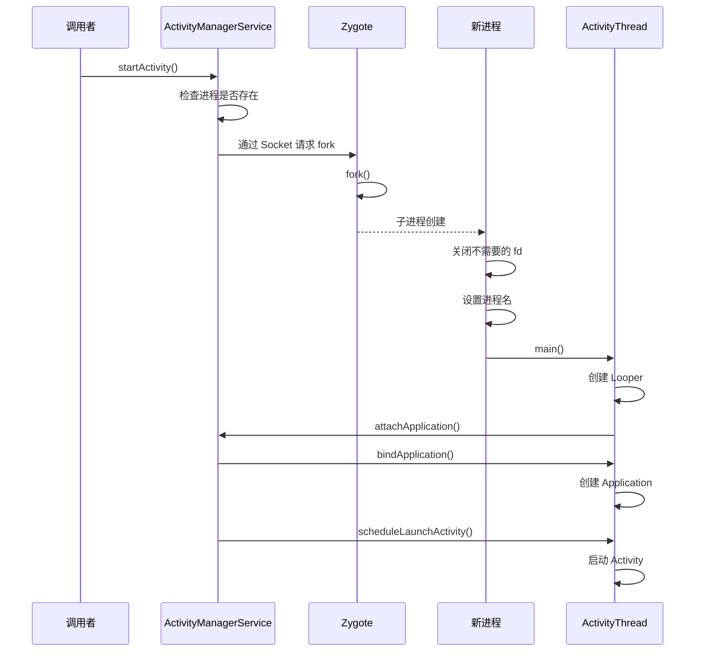

# Android 进程模型与 Zygote

## 学习目标

- 理解 Android 进程架构全景
- 掌握 Zygote 进程的作用和启动流程
- 理解 Zygote fork 机制与预加载
- 了解 SystemServer 启动流程
- 理解应用进程启动的完整流程

## 概述

Android 系统采用独特的进程模型：
- 所有应用进程由 Zygote fork 而来
- 预加载机制加速应用启动
- AMS 管理进程生命周期

---

## 一、Android 进程架构

### 进程分类

| 进程类型 | 说明 | 示例 |
|---------|------|-----|
| init 进程 | 系统第一个进程，PID=1 | /system/bin/init |
| Zygote 进程 | 应用进程孵化器 | zygote64, zygote |
| SystemServer | 系统服务宿主 | system_server |
| 应用进程 | Android 应用 | com.example.app |
| Native 进程 | 原生守护进程 | surfaceflinger, servicemanager |

### 进程关系图

```
                        init (PID=1)
                             │
        ┌────────────────────┼────────────────────┐
        │                    │                    │
   servicemanager        zygote64            surfaceflinger
        │                    │                    
        │                    ├─────────────────────────────┐
        │                    │                             │
        │              system_server                   zygote
        │                    │                             │
        │         ┌──────────┼──────────┐                 │
        │         │          │          │                 │
        │        AMS        WMS       PMS                 │
        │                                                 │
        │                                                 │
        └──── Binder 通信 ────┬─────── Binder 通信 ───────┘
                              │
                ┌─────────────┼─────────────┐
                │             │             │
           App1 进程      App2 进程     App3 进程
```

---

## 二、Zygote 启动流程

### init.rc 配置

```bash
# system/core/rootdir/init.zygote64.rc
service zygote /system/bin/app_process64 -Xzygote /system/bin --zygote --start-system-server
    class main
    priority -20
    user root
    group root readproc reserved_disk
    socket zygote stream 660 root system
    socket usap_pool_primary stream 660 root system
    onrestart write /sys/power/state on
    onrestart restart audioserver
    onrestart restart cameraserver
    onrestart restart media
    ...
```

### app_process 启动

```cpp
// frameworks/base/cmds/app_process/app_main.cpp
int main(int argc, char* const argv[])
{
    AppRuntime runtime(argv[0], computeArgBlockSize(argc, argv));
    
    // 解析参数
    bool zygote = false;
    bool startSystemServer = false;
    
    while (i < argc) {
        if (strcmp(arg, "--zygote") == 0) {
            zygote = true;
        } else if (strcmp(arg, "--start-system-server") == 0) {
            startSystemServer = true;
        }
        i++;
    }
    
    if (zygote) {
        // 启动 Zygote
        runtime.start("com.android.internal.os.ZygoteInit", args, zygote);
    } else {
        // 启动普通应用
        runtime.start("com.android.internal.os.RuntimeInit", args, zygote);
    }
}
```

### ZygoteInit.main()

```java
// frameworks/base/core/java/com/android/internal/os/ZygoteInit.java
public static void main(String argv[]) {
    ZygoteServer zygoteServer = null;
    
    // 1. 设置进程标记
    Os.setpgid(0, 0);
    
    // 2. 预加载资源（重要！）
    preload(bootTimingsTraceLog);
    
    // 3. GC 清理
    gcAndFinalize();
    
    // 4. 创建 Zygote 服务端 Socket
    zygoteServer = new ZygoteServer(isPrimaryZygote);
    
    // 5. 启动 SystemServer
    if (startSystemServer) {
        Runnable r = forkSystemServer(abiList, zygoteServer);
        if (r != null) {
            r.run();
            return;
        }
    }
    
    // 6. 进入监听循环，等待 fork 请求
    caller = zygoteServer.runSelectLoop(abiList);
    
    // 7. 子进程执行
    if (caller != null) {
        caller.run();
    }
}
```

### 预加载机制

```java
// frameworks/base/core/java/com/android/internal/os/ZygoteInit.java
static void preload(TimingsTraceLog bootTimingsTraceLog) {
    // 1. 预加载类
    preloadClasses();
    
    // 2. 预加载资源
    preloadResources();
    
    // 3. 预加载 OpenGL
    preloadOpenGL();
    
    // 4. 预加载共享库
    preloadSharedLibraries();
    
    // 5. 预加载文本资源
    preloadTextResources();
}

private static void preloadClasses() {
    // 从 /system/etc/preloaded-classes 读取类列表
    InputStream is = ClassLoader.getSystemClassLoader()
            .getResourceAsStream(PRELOADED_CLASSES);
    
    BufferedReader br = new BufferedReader(new InputStreamReader(is));
    String line;
    while ((line = br.readLine()) != null) {
        // 加载类
        Class.forName(line, true, null);
    }
}
```

### 预加载的类（部分）

```
# /system/etc/preloaded-classes
android.app.Activity
android.app.Application
android.app.Service
android.content.BroadcastReceiver
android.content.ContentProvider
android.view.View
android.view.ViewGroup
android.widget.TextView
android.widget.ImageView
android.graphics.Bitmap
...
```

---

## 三、SystemServer 启动

### forkSystemServer()

```java
// frameworks/base/core/java/com/android/internal/os/ZygoteInit.java
private static Runnable forkSystemServer(String abiList, ZygoteServer zygoteServer) {
    // 1. 设置参数
    String args[] = {
        "--setuid=1000",
        "--setgid=1000",
        "--setgroups=1001,1002,1003,1004,...",
        "--capabilities=" + capabilities + "," + capabilities,
        "--nice-name=system_server",
        "--runtime-args",
        "--target-sdk-version=" + VMRuntime.SDK_VERSION_CUR_DEVELOPMENT,
        "com.android.server.SystemServer",
    };
    
    // 2. 解析参数
    ZygoteArguments parsedArgs = new ZygoteArguments(args);
    
    // 3. Fork 子进程
    int pid = Zygote.forkSystemServer(
            parsedArgs.mUid, parsedArgs.mGid,
            parsedArgs.mGids,
            parsedArgs.mRuntimeFlags,
            null,
            parsedArgs.mPermittedCapabilities,
            parsedArgs.mEffectiveCapabilities);
    
    if (pid == 0) {
        // 子进程（SystemServer）
        zygoteServer.closeServerSocket();
        return handleSystemServerProcess(parsedArgs);
    }
    
    return null;
}
```

### SystemServer.main()

```java
// frameworks/base/services/java/com/android/server/SystemServer.java
public static void main(String[] args) {
    new SystemServer().run();
}

private void run() {
    // 1. 设置系统属性
    SystemProperties.set("persist.sys.dalvik.vm.lib.2", VMRuntime.getRuntime().vmLibrary());
    
    // 2. 创建主线程 Looper
    Looper.prepareMainLooper();
    
    // 3. 加载本地库
    System.loadLibrary("android_servers");
    
    // 4. 创建系统上下文
    createSystemContext();
    
    // 5. 创建 SystemServiceManager
    mSystemServiceManager = new SystemServiceManager(mSystemContext);
    
    // 6. 启动各类服务
    startBootstrapServices();  // 启动引导服务
    startCoreServices();       // 启动核心服务
    startOtherServices();      // 启动其他服务
    
    // 7. 进入消息循环
    Looper.loop();
}

private void startBootstrapServices() {
    // ActivityManagerService
    mActivityManagerService = ActivityManagerService.Lifecycle.startService(
            mSystemServiceManager, atm);
    
    // PowerManagerService
    mPowerManagerService = mSystemServiceManager.startService(PowerManagerService.class);
    
    // PackageManagerService
    mPackageManagerService = PackageManagerService.main(mSystemContext, ...);
    
    // ...
}
```

---

## 四、应用进程启动

### 启动流程概览



### AMS 请求创建进程

```java
// frameworks/base/services/core/java/com/android/server/am/ActivityManagerService.java
private ProcessRecord startProcessLocked(String processName,
        ApplicationInfo info, boolean knownToBeDead, int intentFlags,
        HostingRecord hostingRecord, int zygotePolicyFlags, boolean allowWhileBooting,
        boolean isolated, boolean keepIfLarge) {
    
    ProcessRecord app;
    
    // 1. 检查进程是否已存在
    if (!isolated) {
        app = getProcessRecordLocked(processName, info.uid, keepIfLarge);
        if (app != null && app.pid > 0) {
            return app;
        }
    }
    
    // 2. 创建 ProcessRecord
    app = newProcessRecordLocked(info, processName, isolated, isolatedUid, hostingRecord);
    
    // 3. 通过 Process.start() 请求 Zygote fork
    final String entryPoint = "android.app.ActivityThread";
    return startProcessLocked(hostingRecord, entryPoint, app, uid, gids,
            runtimeFlags, mountExternal, seInfo, requiredAbi, instructionSet,
            invokeWith, startTime);
}
```

### Process.start()

```java
// frameworks/base/core/java/android/os/Process.java
public static ProcessStartResult start(final String processClass,
        final String niceName, int uid, int gid, int[] gids,
        int runtimeFlags, int mountExternal,
        int targetSdkVersion, String seInfo, String abi,
        String instructionSet, String appDataDir, String invokeWith,
        String packageName, int zygotePolicyFlags, boolean isTopApp,
        long[] disabledCompatChanges, Map<String, Pair<String, Long>> pkgDataInfoMap,
        Map<String, Pair<String, Long>> whitelistedDataInfoList,
        boolean bindMountAppsData, boolean bindMountAppStorageDirs,
        String[] zygoteArgs) {
    
    return ZYGOTE_PROCESS.start(processClass, niceName, uid, gid, gids,
            runtimeFlags, mountExternal, targetSdkVersion, seInfo,
            abi, instructionSet, appDataDir, invokeWith, packageName,
            zygotePolicyFlags, isTopApp, disabledCompatChanges,
            pkgDataInfoMap, whitelistedDataInfoList, bindMountAppsData,
            bindMountAppStorageDirs, zygoteArgs);
}
```

### Zygote fork 子进程

```java
// frameworks/base/core/java/com/android/internal/os/Zygote.java
static int forkAndSpecialize(int uid, int gid, int[] gids, int runtimeFlags,
        int[][] rlimits, int mountExternal, String seInfo, String niceName,
        int[] fdsToClose, int[] fdsToIgnore, boolean startChildZygote,
        String instructionSet, String appDataDir, boolean isTopApp,
        String[] pkgDataInfoList, String[] whitelistedDataInfoList,
        boolean bindMountAppDataDirs, boolean bindMountAppStorageDirs) {
    
    // 1. 预 fork 准备
    VM_HOOKS.preFork();
    
    // 2. 调用 native fork
    int pid = nativeForkAndSpecialize(
            uid, gid, gids, runtimeFlags, rlimits, mountExternal, seInfo,
            niceName, fdsToClose, fdsToIgnore, startChildZygote,
            instructionSet, appDataDir, isTopApp, pkgDataInfoList,
            whitelistedDataInfoList, bindMountAppDataDirs, bindMountAppStorageDirs);
    
    if (pid == 0) {
        // 3. 子进程处理
        VM_HOOKS.postForkChild(runtimeFlags, isSystemServer, isZygote, instructionSet);
    } else {
        // 4. 父进程处理
        VM_HOOKS.postForkCommon();
    }
    
    return pid;
}
```

### ActivityThread.main()

```java
// frameworks/base/core/java/android/app/ActivityThread.java
public static void main(String[] args) {
    // 1. 准备主线程 Looper
    Looper.prepareMainLooper();
    
    // 2. 创建 ActivityThread
    ActivityThread thread = new ActivityThread();
    
    // 3. attach 到 AMS
    thread.attach(false, startSeq);
    
    // 4. 获取 Handler
    if (sMainThreadHandler == null) {
        sMainThreadHandler = thread.getHandler();
    }
    
    // 5. 进入消息循环
    Looper.loop();
    
    throw new RuntimeException("Main thread loop unexpectedly exited");
}

private void attach(boolean system, long startSeq) {
    if (!system) {
        // 应用进程
        final IActivityManager mgr = ActivityManager.getService();
        mgr.attachApplication(mAppThread, startSeq);
    } else {
        // SystemServer
    }
}
```

---

## 五、Zygote 优势

### 预加载优势

```
                    Zygote 进程
                    ┌─────────────────────────────────────┐
                    │     预加载的类和资源                │
                    │  ┌───────────────────────────────┐  │
                    │  │ android.app.Activity          │  │
                    │  │ android.view.View             │  │
                    │  │ android.widget.*              │  │
                    │  │ 系统资源                       │  │
                    │  │ 字体、图片等                   │  │
                    │  └───────────────────────────────┘  │
                    └────────────────┬────────────────────┘
                                     │ fork (COW)
            ┌────────────────────────┼────────────────────────┐
            │                        │                        │
            ▼                        ▼                        ▼
    ┌───────────────┐        ┌───────────────┐        ┌───────────────┐
    │   App1 进程   │        │   App2 进程   │        │   App3 进程   │
    │  共享预加载   │        │  共享预加载   │        │  共享预加载   │
    │  (只读，COW)  │        │  (只读，COW)  │        │  (只读，COW)  │
    └───────────────┘        └───────────────┘        └───────────────┘
    
    优势：
    1. 共享只读内存，节省物理内存
    2. 不需要重复加载，加速启动
    3. COW 机制，写时才复制
```

### 启动时间对比

| 启动方式 | 时间 | 说明 |
|---------|------|-----|
| 完整启动 | ~2s | 从零加载所有类和资源 |
| Zygote fork | ~200ms | 预加载已完成 |

---

## 总结

### 核心要点

1. **Zygote 角色**：
   - 应用进程孵化器
   - 预加载类和资源
   - 通过 fork 快速创建应用进程

2. **启动流程**：
   - init → Zygote → SystemServer
   - AMS → Zygote → 应用进程

3. **预加载优势**：
   - 共享内存
   - 加速启动
   - COW 机制

### 后续学习

- [Android进程优先级与LMK](17-Android进程优先级与LMK.md) - 进程优先级管理

## 参考资源

- Android 源码：
  - `frameworks/base/core/java/com/android/internal/os/ZygoteInit.java`
  - `frameworks/base/services/java/com/android/server/SystemServer.java`
  - `frameworks/base/core/java/android/app/ActivityThread.java`

## 更新记录

- 2026-01-27：初始创建，包含 Android 进程模型与 Zygote
