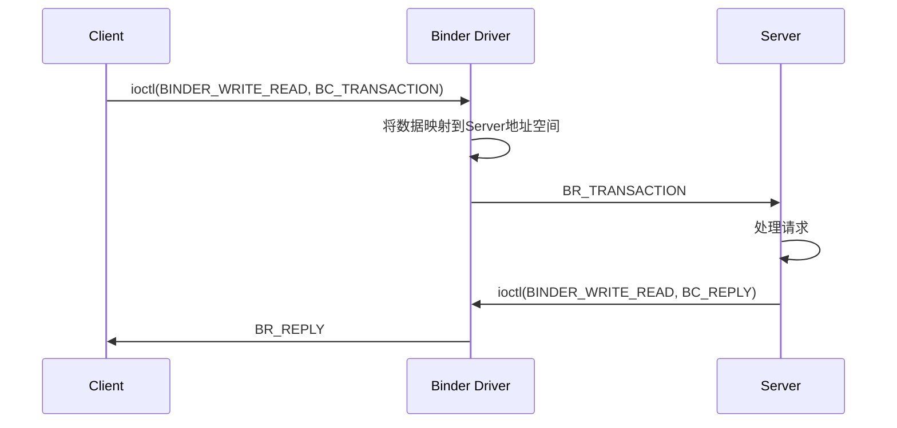

# Android Binder 与进程调试

## 学习目标

- 理解 Binder 机制概述和核心概念
- 了解 Binder 驱动与进程管理的关系
- 掌握 Binder 线程池管理
- 掌握进程监控和调试工具
- 了解常见问题排查方法

## 概述

本文介绍 Android Binder IPC 机制的核心概念，以及进程相关的调试技术。

---

## 一、Binder 机制概述

### Binder 是什么

Binder 是 Android 的核心 IPC 机制：
- 高效：只需一次数据拷贝
- 安全：支持 UID/PID 验证
- 面向对象：支持跨进程对象引用

### 核心组件

```
┌─────────────────────────────────────────────────────────────┐
│                    用户空间                                  │
│                                                              │
│  ┌─────────────┐                    ┌─────────────┐         │
│  │  Client     │                    │  Server     │         │
│  │  (Proxy)    │                    │  (Stub)     │         │
│  └──────┬──────┘                    └──────┬──────┘         │
│         │                                  │                 │
│  ┌──────▼──────┐                    ┌──────▼──────┐         │
│  │ BpBinder    │                    │  BBinder    │         │
│  │ (代理对象)  │                    │ (本地对象)  │         │
│  └──────┬──────┘                    └──────┬──────┘         │
│         │                                  │                 │
│  ┌──────▼──────┐                    ┌──────▼──────┐         │
│  │ IPCThread   │                    │IPCThread    │         │
│  │ State       │                    │State        │         │
│  └──────┬──────┘                    └──────┬──────┘         │
├─────────┼──────────────────────────────────┼────────────────┤
│         │          ioctl                   │                │
│  ┌──────▼──────────────────────────────────▼──────┐        │
│  │              Binder Driver                      │        │
│  │              /dev/binder                        │        │
│  │  ┌──────────────────────────────────────────┐  │        │
│  │  │  binder_proc   binder_proc   binder_proc │  │        │
│  │  └──────────────────────────────────────────┘  │        │
│  └────────────────────────────────────────────────┘        │
│                    内核空间                                  │
└─────────────────────────────────────────────────────────────┘
```

### Binder 通信流程



---

## 二、Binder 驱动与进程管理

### 核心数据结构

```c
// drivers/android/binder.c

// 进程信息
struct binder_proc {
    struct hlist_node proc_node;        // 全局进程链表
    struct rb_root threads;             // 线程红黑树
    struct rb_root nodes;               // Binder 节点红黑树
    struct rb_root refs_by_desc;        // 引用（按描述符）
    struct rb_root refs_by_node;        // 引用（按节点）
    struct list_head waiting_threads;   // 等待线程列表
    int pid;                            // 进程 ID
    struct task_struct *tsk;            // 任务结构
    struct mm_struct *vma_vm_mm;        // 内存映射
    // ...
};

// 线程信息
struct binder_thread {
    struct binder_proc *proc;           // 所属进程
    struct rb_node rb_node;             // 红黑树节点
    struct list_head waiting_thread_node;
    int pid;                            // 线程 ID
    int looper;                         // Looper 状态
    bool looper_need_return;
    struct binder_transaction *transaction_stack;  // 事务栈
    struct list_head todo;              // 待处理工作
    // ...
};
```

### Binder 内存映射

```c
// 一次拷贝的秘密：mmap
static int binder_mmap(struct file *filp, struct vm_area_struct *vma)
{
    struct binder_proc *proc = filp->private_data;
    
    // 在内核分配一块内存
    // 同时映射到用户空间和内核空间
    // 数据只需从发送方复制到这块内存
    // 接收方可以直接访问
    
    proc->buffer = kzalloc(vma->vm_end - vma->vm_start, GFP_KERNEL);
    // ...
}
```

### ioctl 命令

```c
// include/uapi/linux/android/binder.h
#define BINDER_WRITE_READ       _IOWR('b', 1, struct binder_write_read)
#define BINDER_SET_MAX_THREADS  _IOW('b', 5, __u32)
#define BINDER_SET_CONTEXT_MGR  _IOW('b', 7, __s32)
#define BINDER_THREAD_EXIT      _IOW('b', 8, __s32)
#define BINDER_VERSION          _IOWR('b', 9, struct binder_version)
```

---

## 三、Binder 线程池

### 线程池管理

```cpp
// frameworks/native/libs/binder/ProcessState.cpp
void ProcessState::spawnPooledThread(bool isMain)
{
    if (mThreadPoolStarted) {
        String8 name = makeBinderThreadName();
        sp<Thread> t = new PoolThread(isMain);
        t->run(name.string());
    }
}

// Binder 线程主循环
void IPCThreadState::joinThreadPool(bool isMain)
{
    mOut.writeInt32(isMain ? BC_ENTER_LOOPER : BC_REGISTER_LOOPER);
    
    do {
        // 等待并处理请求
        result = getAndExecuteCommand();
    } while (result != -ECONNREFUSED && result != -EBADF);
    
    mOut.writeInt32(BC_EXIT_LOOPER);
}
```

### 线程池配置

```cpp
// 设置最大线程数
ProcessState::self()->setThreadPoolMaxThreadCount(15);

// 启动线程池
ProcessState::self()->startThreadPool();

// 加入线程池
IPCThreadState::self()->joinThreadPool();
```

### 线程状态

```cpp
// Looper 状态
enum {
    BINDER_LOOPER_STATE_REGISTERED  = 0x01,  // 已注册
    BINDER_LOOPER_STATE_ENTERED     = 0x02,  // 已进入
    BINDER_LOOPER_STATE_EXITED      = 0x04,  // 已退出
    BINDER_LOOPER_STATE_INVALID     = 0x08,  // 无效
    BINDER_LOOPER_STATE_WAITING     = 0x10,  // 等待中
    BINDER_LOOPER_STATE_POLL        = 0x20,  // 轮询中
};
```

---

## 四、进程监控工具

### ps 命令

```bash
# 查看所有进程
ps -A

# 查看特定用户的进程
ps -u u0_a100

# 显示线程
ps -T -p <pid>

# 详细信息
ps -o pid,ppid,uid,nice,stat,wchan,comm
```

### top 命令

```bash
# 实时监控
top

# 按 CPU 排序
top -o %CPU

# 按内存排序
top -o %MEM

# 显示线程
top -H -p <pid>
```

### /proc 文件系统

```bash
# 进程状态
cat /proc/<pid>/status

# 内存映射
cat /proc/<pid>/maps

# 文件描述符
ls -la /proc/<pid>/fd

# 线程
ls /proc/<pid>/task

# OOM 信息
cat /proc/<pid>/oom_score
cat /proc/<pid>/oom_score_adj

# Cgroup
cat /proc/<pid>/cgroup

# 调度信息
cat /proc/<pid>/sched
```

### dumpsys 命令

```bash
# 进程信息
dumpsys activity processes

# OOM ADJ
dumpsys activity oom

# 内存信息
dumpsys meminfo
dumpsys meminfo <package>

# Binder 信息
dumpsys binder

# 服务列表
dumpsys -l
```

---

## 五、调度延迟分析

### Systrace/Perfetto

```bash
# 抓取 trace
python systrace.py -o trace.html sched freq idle am wm gfx view

# 使用 Perfetto
perfetto --txt -c config.pbtxt -o trace.pb
```

### 调度延迟分析

```bash
# 查看调度统计
cat /proc/<pid>/sched

# 关键指标
# se.wait_max: 最大等待时间
# se.wait_sum: 总等待时间
# nr_switches: 上下文切换次数
```

### CPU 亲和性检查

```bash
# 查看 CPU 亲和性
taskset -p <pid>

# 设置 CPU 亲和性
taskset -p 0xf <pid>  # 绑定到 CPU 0-3
```

---

## 六、常见问题排查

### ANR（Application Not Responding）

**原因**：
- 主线程阻塞超过 5 秒（Activity）
- 前台广播处理超过 10 秒
- 后台广播处理超过 60 秒

**排查步骤**：
```bash
# 1. 获取 ANR traces
adb pull /data/anr/traces.txt

# 2. 查看系统日志
adb logcat -b events | grep am_anr

# 3. 查看主线程状态
dumpsys activity <package>
```

**常见原因**：
- 主线程 IO 操作
- 主线程网络操作
- 主线程长时间计算
- 锁竞争
- Binder 调用阻塞

### OOM（Out Of Memory）

**排查步骤**：
```bash
# 1. 查看内存使用
dumpsys meminfo <package>

# 2. 查看 GC 日志
adb logcat -s dalvikvm:D

# 3. 使用 MAT 分析 heap dump
adb shell am dumpheap <pid> /data/local/tmp/heap.hprof
adb pull /data/local/tmp/heap.hprof
```

**常见原因**：
- 内存泄漏
- Bitmap 过大
- 缓存过多
- 静态变量持有 Activity

### 进程被杀

**排查步骤**：
```bash
# 1. 查看 LMK 日志
dmesg | grep lowmemorykiller
logcat -s lmkd

# 2. 查看 ActivityManager 日志
logcat -s ActivityManager:* | grep -i kill

# 3. 查看进程优先级历史
dumpsys activity oom
```

---

## 七、性能优化建议

### 进程启动优化

1. **减少 Application.onCreate() 耗时**
2. **延迟初始化非必要组件**
3. **使用 ContentProvider 懒加载**

### 内存优化

1. **避免内存泄漏**
2. **使用合适的数据结构**
3. **及时释放大对象**
4. **监控内存使用**

### 调度优化

1. **避免主线程阻塞**
2. **合理使用线程池**
3. **避免频繁创建线程**

### Binder 优化

1. **避免传输大数据（> 1MB）**
2. **使用 oneway 减少等待**
3. **合并多次调用**

---

## 总结

### 核心要点

1. **Binder 机制**：
   - 一次拷贝，高效
   - 支持安全验证
   - 面向对象设计

2. **线程池管理**：
   - 自动创建和回收
   - 可配置最大线程数

3. **调试工具**：
   - ps、top、/proc
   - dumpsys、systrace

4. **常见问题**：
   - ANR：主线程阻塞
   - OOM：内存不足
   - 进程被杀：LMK

### 参考资源

- Android 源码：
  - `drivers/android/binder.c`
  - `frameworks/native/libs/binder/`
  - `frameworks/base/core/java/android/os/`

## 更新记录

- 2026-01-27：初始创建，包含 Android Binder 与进程调试
