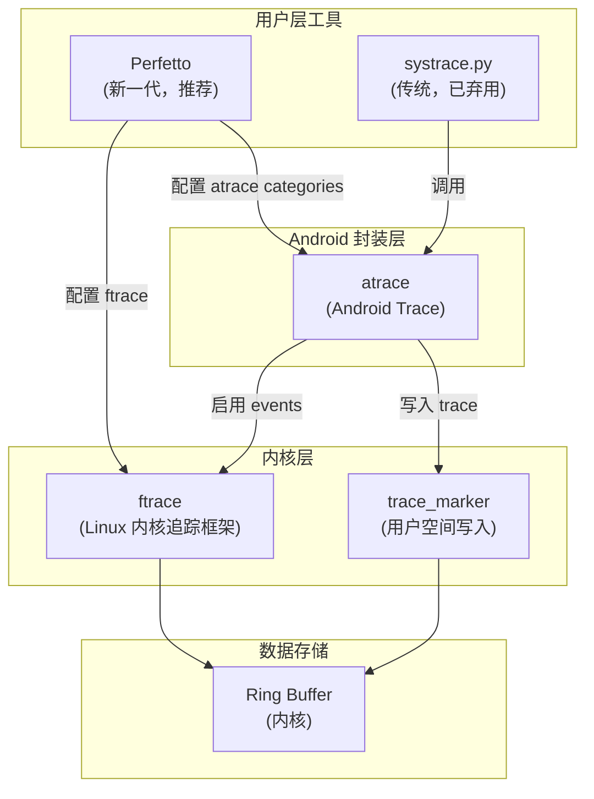
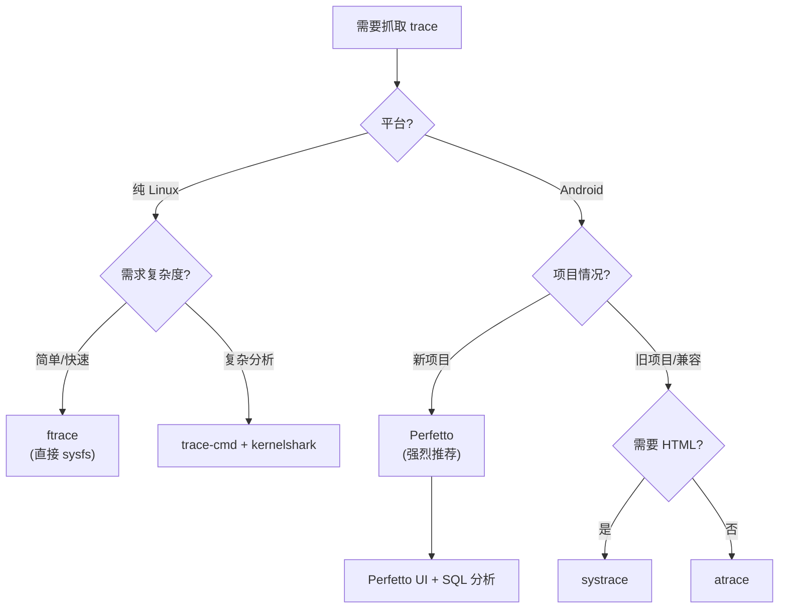
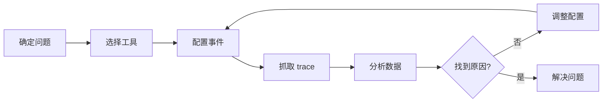

# Trace 抓取方法全面指南：ftrace、atrace、systrace、perfetto

## 学习目标

- 理解 Linux/Android 系统中各种 trace 工具的层次关系
- 掌握 ftrace、atrace、systrace、perfetto 四种工具的使用方法
- 学会根据不同场景选择合适的 trace 工具
- 能够抓取和分析 Block 层相关的 trace 数据

## 概述

在 Linux/Android 系统性能分析中，trace 是最重要的调试手段之一。本文全面介绍四种主流的 trace 抓取工具：**ftrace**（内核层）、**atrace**（Android 封装层）、**systrace**（传统用户层工具）、**perfetto**（新一代追踪工具），帮助你理解它们的原理、使用方法和适用场景。

---

## 一、工具层次关系

### 1.1 架构图



### 1.2 工具演进历史

```
时间线：
────────────────────────────────────────────────────────────────────►

2008        2012          2016           2018          现在
 │           │             │              │             │
 ▼           ▼             ▼              ▼             ▼
ftrace    atrace       systrace      perfetto      perfetto
(内核)    (Android)    (Python)      (发布)        (主流)

└─────────────────────────────────────────────────────────────────┘
           ftrace 始终是底层基础
```

### 1.3 关系总结

| 工具 | 层级 | 基于 | 主要用途 |
|------|------|------|---------|
| **ftrace** | 内核 | - | 内核事件追踪基础设施 |
| **atrace** | Android | ftrace | 封装 ftrace，增加 categories |
| **systrace** | 用户 | atrace | 生成 HTML 报告（已弃用） |
| **perfetto** | 用户 | ftrace + atrace | 新一代追踪工具（推荐） |

---

## 二、ftrace 详解

### 2.1 原理介绍

**ftrace**（Function Tracer）是 Linux 内核内置的追踪框架，是所有其他追踪工具的基础。

**核心特点**：
- 内核原生支持，无需额外安装
- 通过 debugfs 文件系统接口操作
- 支持函数追踪、事件追踪、延迟追踪等多种模式
- 性能开销极低

**关键路径**：

```
/sys/kernel/debug/tracing/
├── available_events        # 可用事件列表
├── available_tracers       # 可用追踪器
├── current_tracer          # 当前追踪器
├── trace                   # 追踪输出（快照）
├── trace_pipe              # 追踪输出（实时流）
├── buffer_size_kb          # 缓冲区大小
├── tracing_on              # 追踪开关
└── events/                 # 事件目录
    ├── block/              # Block 层事件
    │   ├── enable          # 启用所有 block 事件
    │   ├── block_rq_issue/
    │   │   ├── enable      # 启用单个事件
    │   │   ├── filter      # 事件过滤器
    │   │   └── format      # 事件格式说明
    │   └── ...
    ├── sched/              # 调度事件
    └── ...
```

### 2.2 使用方法

#### 基础操作

```bash
# 1. 查看可用事件
cat /sys/kernel/debug/tracing/available_events | grep block

# 2. 启用单个事件
echo 1 > /sys/kernel/debug/tracing/events/block/block_rq_issue/enable

# 3. 启用一类事件
echo 1 > /sys/kernel/debug/tracing/events/block/enable

# 4. 查看追踪输出
cat /sys/kernel/debug/tracing/trace

# 5. 实时查看（流式）
cat /sys/kernel/debug/tracing/trace_pipe

# 6. 禁用事件
echo 0 > /sys/kernel/debug/tracing/events/block/enable

# 7. 清空缓冲区
echo > /sys/kernel/debug/tracing/trace
```

#### 完整抓取流程

```bash
#!/bin/bash
# ftrace_block.sh - 使用 ftrace 抓取 block 事件

# 1. 设置缓冲区大小（KB）
echo 65536 > /sys/kernel/debug/tracing/buffer_size_kb

# 2. 清空旧数据
echo > /sys/kernel/debug/tracing/trace

# 3. 启用 block 事件
echo 1 > /sys/kernel/debug/tracing/events/block/enable

# 4. 启用追踪
echo 1 > /sys/kernel/debug/tracing/tracing_on

# 5. 等待抓取
echo "Tracing for 10 seconds..."
sleep 10

# 6. 停止追踪
echo 0 > /sys/kernel/debug/tracing/tracing_on

# 7. 禁用事件
echo 0 > /sys/kernel/debug/tracing/events/block/enable

# 8. 保存结果
cat /sys/kernel/debug/tracing/trace > ftrace_output.txt
echo "Saved to ftrace_output.txt"
```

#### 使用过滤器

```bash
# 只追踪写操作
echo 'rwbs ~ "*W*"' > /sys/kernel/debug/tracing/events/block/block_rq_issue/filter

# 只追踪特定设备（设备号 8:0）
echo 'dev == 0x800000' > /sys/kernel/debug/tracing/events/block/block_rq_issue/filter

# 只追踪大于 4KB 的请求
echo 'bytes > 4096' > /sys/kernel/debug/tracing/events/block/block_rq_issue/filter

# 清除过滤器
echo 0 > /sys/kernel/debug/tracing/events/block/block_rq_issue/filter
```

### 2.3 Android 设备使用

```bash
# 通过 adb 使用 ftrace
adb shell "
# 设置缓冲区
echo 32768 > /sys/kernel/debug/tracing/buffer_size_kb

# 清空
echo > /sys/kernel/debug/tracing/trace

# 启用 block 事件
echo 1 > /sys/kernel/debug/tracing/events/block/enable

# 抓取 5 秒
sleep 5

# 停止并导出
echo 0 > /sys/kernel/debug/tracing/events/block/enable
cat /sys/kernel/debug/tracing/trace > /data/local/tmp/ftrace.txt
"

# 拉取到本地
adb pull /data/local/tmp/ftrace.txt ./
```

### 2.4 trace-cmd 工具

`trace-cmd` 是 ftrace 的用户空间前端工具，简化了 ftrace 的使用。

```bash
# 安装
apt install trace-cmd  # Debian/Ubuntu
yum install trace-cmd  # CentOS/RHEL

# 录制
trace-cmd record -e block -e sched sleep 10

# 查看报告
trace-cmd report

# 生成可视化文件（配合 kernelshark）
trace-cmd report > trace.txt
```

### 2.5 ftrace 输出格式

```
# tracer: nop
#
# entries-in-buffer/entries-written: 1234/1234   #P:8
#
#                                _-----=> irqs-off
#                               / _----=> need-resched
#                              | / _---=> hardirq/softirq
#                              || / _--=> preempt-depth
#                              ||| /     delay
#           TASK-PID     CPU#  ||||   TIMESTAMP  FUNCTION
#              | |         |   ||||      |         |
              dd-12345   [002] ....  1234.567890: block_rq_issue: 8,0 W 0 + 8 [dd]
              dd-12345   [002] ....  1234.567891: block_rq_complete: 8,0 W 0 + 8 [0]
```

**字段说明**：
- `TASK-PID`：进程名和 PID
- `CPU#`：CPU 编号
- `TIMESTAMP`：时间戳（秒）
- `FUNCTION`：事件名称和参数

---

## 三、atrace 详解

### 3.1 原理介绍

**atrace**（Android Trace）是 Android 系统对 ftrace 的封装，提供了更友好的使用接口。

**核心特点**：
- 封装了 ftrace 操作
- 引入 **categories** 概念，简化配置
- 支持用户空间 trace（通过 `trace_marker`）
- Android 专用，支持 Java/Kotlin 层 trace

**Categories 机制**：
```
┌─────────────────────────────────────────────────────────────────────────┐
│                      atrace categories 映射                              │
├─────────────────────────────────────────────────────────────────────────┤
│                                                                         │
│  atrace category     →    ftrace events                                 │
│  ────────────────         ─────────────                                 │
│                                                                         │
│  sched               →    sched/sched_switch, sched/sched_wakeup, ...  │
│  disk                →    block/block_rq_issue, f2fs/*, ext4/*, ...    │
│  freq                →    power/cpu_frequency, ...                      │
│  gfx                 →    (用户空间 trace_marker)                       │
│  view                →    (用户空间 trace_marker)                       │
│  am                  →    (用户空间 trace_marker)                       │
│                                                                         │
└─────────────────────────────────────────────────────────────────────────┘
```

### 3.2 使用方法

#### 查看可用 categories

```bash
adb shell atrace --list_categories
```

**常见 categories**：

| Category | 说明 | 对应 ftrace events |
|----------|------|-------------------|
| `sched` | 调度 | sched/* |
| `disk` | 磁盘 IO | block/*, f2fs/*, ext4/* |
| `freq` | CPU 频率 | power/cpu_frequency |
| `idle` | CPU 空闲 | power/cpu_idle |
| `gfx` | 图形 | 用户空间 |
| `view` | 视图 | 用户空间 |
| `am` | Activity Manager | 用户空间 |
| `wm` | Window Manager | 用户空间 |
| `binder_driver` | Binder 驱动 | binder/* |
| `dalvik` | Dalvik/ART | 用户空间 |

#### 基础使用

```bash
# 抓取 10 秒，包含 sched 和 disk
adb shell atrace -t 10 sched disk

# 指定缓冲区大小（KB）
adb shell atrace -t 10 -b 8192 sched disk

# 输出到文件
adb shell atrace -t 10 -b 8192 sched disk -o /data/local/tmp/trace.txt
adb pull /data/local/tmp/trace.txt ./

# 压缩输出
adb shell atrace -t 10 -z sched disk -o /data/local/tmp/trace.gz
```

#### 异步模式

```bash
# 开始抓取（后台运行）
adb shell atrace --async_start -b 8192 sched disk

# 执行测试操作...

# 停止并导出
adb shell atrace --async_stop -o /data/local/tmp/trace.txt
adb pull /data/local/tmp/trace.txt ./
```

#### 查看当前状态

```bash
# 查看当前启用的 categories
adb shell atrace --list_categories

# 查看帮助
adb shell atrace --help
```

### 3.3 atrace 命令参数

| 参数 | 说明 | 示例 |
|------|------|------|
| `-t <N>` | 抓取时间（秒） | `-t 10` |
| `-b <N>` | 缓冲区大小（KB） | `-b 8192` |
| `-o <file>` | 输出文件 | `-o trace.txt` |
| `-z` | 压缩输出 | `-z` |
| `--async_start` | 异步开始 | `--async_start` |
| `--async_stop` | 异步停止 | `--async_stop` |
| `--async_dump` | 异步导出 | `--async_dump` |
| `-a <app>` | 指定应用 | `-a com.example.app` |
| `-k <functions>` | 内核函数追踪 | `-k do_sys_open` |

### 3.4 抓取 Block 层事件

```bash
# 方式 1：使用 disk category
adb shell atrace -t 10 -b 16384 disk -o /data/local/tmp/disk_trace.txt

# 方式 2：组合多个 categories
adb shell atrace -t 10 -b 16384 sched disk freq -o /data/local/tmp/trace.txt

# 拉取文件
adb pull /data/local/tmp/disk_trace.txt ./
```

### 3.5 用户空间 Trace

atrace 支持应用程序写入自定义 trace 事件：

**Java/Kotlin**：
```kotlin
import android.os.Trace

// 同步区域
Trace.beginSection("MyOperation")
// ... 你的代码 ...
Trace.endSection()

// 异步事件
Trace.beginAsyncSection("AsyncTask", 12345)
// ... 异步操作 ...
Trace.endAsyncSection("AsyncTask", 12345)

// 计数器
Trace.setCounter("BufferSize", 1024)
```

**Native (C/C++)**：
```c
#include <cutils/trace.h>

// 或者直接写入 trace_marker
int fd = open("/sys/kernel/debug/tracing/trace_marker", O_WRONLY);
write(fd, "B|1234|MyEvent\n", 15);  // Begin
// ... 代码 ...
write(fd, "E|1234\n", 7);           // End
close(fd);
```

---

## 四、systrace 详解

### 4.1 原理介绍

**systrace** 是一个 Python 脚本，封装了 atrace，并生成交互式 HTML 报告。

**注意**：systrace 已被 **Perfetto 取代**，但在旧项目中仍可使用。

**特点**：
- 基于 atrace
- 生成可在浏览器中打开的 HTML 报告
- 支持 Chrome DevTools 界面
- Android SDK 自带

### 4.2 安装与配置

```bash
# systrace 位于 Android SDK 中
# 路径：$ANDROID_SDK/platform-tools/systrace/

# 或者从 AOSP 下载
# https://android.googlesource.com/platform/external/chromium-trace/

# 确保 Python 2.7 或 3.x 可用
python --version

# 设置路径
export PATH=$PATH:$ANDROID_SDK/platform-tools/systrace
```

### 4.3 使用方法

#### 基础使用

```bash
# 进入 systrace 目录
cd $ANDROID_SDK/platform-tools/systrace

# 基础抓取
python systrace.py -t 10 sched disk -o trace.html

# 指定缓冲区
python systrace.py -t 10 -b 8192 sched disk freq -o trace.html

# 抓取所有 categories
python systrace.py -t 10 -b 16384 -o trace.html
```

#### 常用参数

| 参数 | 说明 | 示例 |
|------|------|------|
| `-t <N>` | 抓取时间（秒） | `-t 10` |
| `-b <N>` | 缓冲区大小（KB） | `-b 8192` |
| `-o <file>` | 输出文件 | `-o trace.html` |
| `-a <app>` | 指定应用包名 | `-a com.example.app` |
| `-l` | 列出可用 categories | `-l` |
| `--from-file` | 从文件转换 | `--from-file trace.txt` |

#### 抓取 Block 层

```bash
# 抓取磁盘 IO 相关
python systrace.py -t 10 -b 16384 sched disk -o block_trace.html

# 组合更多 categories
python systrace.py -t 10 -b 16384 sched disk freq idle binder_driver -o trace.html
```

### 4.4 HTML 报告分析

生成的 HTML 报告可以在 Chrome 浏览器中打开，支持：

- **时间线视图**：可视化各个事件的时间关系
- **CPU 占用**：查看每个 CPU 的活动状态
- **进程/线程视图**：查看每个进程的活动
- **搜索功能**：搜索特定事件
- **快捷键**：W/S 缩放，A/D 平移，M 标记

**快捷键**：
| 快捷键 | 功能 |
|--------|------|
| W/S | 放大/缩小 |
| A/D | 左移/右移 |
| M | 标记当前位置 |
| / | 搜索 |
| ? | 显示帮助 |

### 4.5 从 atrace 输出转换

```bash
# 先用 atrace 抓取
adb shell atrace -t 10 sched disk > trace.txt

# 转换为 HTML
python systrace.py --from-file trace.txt -o trace.html
```

---

## 五、Perfetto 详解（重点推荐）

### 5.1 原理介绍

**Perfetto** 是 Google 开发的新一代追踪工具，已成为 Android 10+ 的默认追踪工具。

**核心优势**：
- 统一的追踪框架，支持多种数据源
- 高效的二进制格式（protobuf）
- 强大的 SQL 查询能力
- 现代化的 Web UI
- 支持长时间追踪

**架构**：
```
┌─────────────────────────────────────────────────────────────────────────┐
│                         Perfetto 架构                                    │
├─────────────────────────────────────────────────────────────────────────┤
│                                                                         │
│  ┌─────────────────────────────────────────────────────────────────┐   │
│  │                        perfetto CLI                              │   │
│  │                    (命令行工具/守护进程)                          │   │
│  └─────────────────────────────────────────────────────────────────┘   │
│                               │                                         │
│            ┌──────────────────┼──────────────────┐                     │
│            ▼                  ▼                  ▼                      │
│  ┌──────────────────┐ ┌──────────────────┐ ┌──────────────────┐       │
│  │  linux.ftrace    │ │ linux.process_   │ │   其他数据源      │       │
│  │  (ftrace 事件)   │ │  stats (进程)    │ │ (内存、电池等)    │       │
│  └──────────────────┘ └──────────────────┘ └──────────────────┘       │
│            │                  │                  │                      │
│            └──────────────────┼──────────────────┘                     │
│                               ▼                                         │
│  ┌─────────────────────────────────────────────────────────────────┐   │
│  │                     Ring Buffer (内存)                           │   │
│  └─────────────────────────────────────────────────────────────────┘   │
│                               │                                         │
│                               ▼                                         │
│  ┌─────────────────────────────────────────────────────────────────┐   │
│  │                  .perfetto-trace 文件                            │   │
│  │                    (protobuf 格式)                               │   │
│  └─────────────────────────────────────────────────────────────────┘   │
│                               │                                         │
│            ┌──────────────────┼──────────────────┐                     │
│            ▼                  ▼                  ▼                      │
│  ┌──────────────────┐ ┌──────────────────┐ ┌──────────────────┐       │
│  │   Perfetto UI    │ │ trace_processor  │ │    SQL 查询       │       │
│  │   (Web 界面)     │ │  (命令行分析)    │ │                   │       │
│  └──────────────────┘ └──────────────────┘ └──────────────────┘       │
│                                                                         │
└─────────────────────────────────────────────────────────────────────────┘
```

### 5.2 抓取方式总览

Perfetto 支持多种抓取方式：

| 方式 | 适用场景 | 复杂度 |
|------|---------|--------|
| 命令行参数方式 | 快速抓取 | 低 |
| 配置文件方式 | 复杂配置 | 中 |
| Perfetto UI 在线生成 | 可视化配置 | 低 |
| record_android_trace 脚本 | 便捷脚本 | 低 |
| Android 开发者选项 | 无 adb 场景 | 低 |

### 5.3 方式一：命令行参数方式

最简单的方式，适合快速抓取。

```bash
# 基础用法
adb shell perfetto  -t 10s sched/sched_switch block/*

# 抓取 block 事件
adb shell perfetto -o /data/misc/perfetto-traces/trace.pb -t 10s sched/sched_switch sched/sched_waking block/block_rq_insert block/block_rq_issue block/block_rq_complete

# 抓取 所有block 事件 -Tony pegi
adb shell perfetto -o /data/misc/perfetto-traces/ptrace-block.pb -t 10s sched/sched_switch sched/sched_waking block/*

# 拉取文件
adb pull /data/misc/perfetto-traces/ptrace-block.pb  D:\Users\jiabo.wang\Desktop\IO-SOP\LI9
```

**完整 Block 事件抓取命令**：

```bash
adb shell perfetto -o /data/misc/perfetto-traces/ptrace-block.pb -t 10s sched/sched_switch sched/sched_waking block/* && adb pull /data/misc/perfetto-traces/ptrace-block.pb  D:\Users\jiabo.wang\Desktop\IO-SOP\LI9
```

### 5.4 方式二：配置文件方式

适合复杂配置和重复使用。

#### 配置文件结构

```protobuf
# trace_config.pbtxt

# 缓冲区配置
buffers {
  size_kb: 65536           # 缓冲区大小
  fill_policy: RING_BUFFER # 填充策略：RING_BUFFER 或 DISCARD
}

# 数据源配置
data_sources {
  config {
    name: "linux.ftrace"   # 数据源名称
    ftrace_config {
      # ftrace 事件
      ftrace_events: "block/block_rq_issue"
      ftrace_events: "block/block_rq_complete"
      
      # atrace categories
      atrace_categories: "sched"
      atrace_categories: "disk"
      
      # 缓冲区
      buffer_size_kb: 32768
    }
  }
}

# 进程统计
data_sources {
  config {
    name: "linux.process_stats"
  }
}

# 持续时间
duration_ms: 10000
```

#### 完整 Block 事件配置

```bash
# 创建配置文件
cat > block_config.pbtxt << 'EOF'
buffers {
  size_kb: 65536
  fill_policy: RING_BUFFER
}

data_sources {
  config {
    name: "linux.ftrace"
    ftrace_config {
      # Block 层事件 - Request 相关
      ftrace_events: "block/block_rq_insert"
      ftrace_events: "block/block_rq_issue"
      ftrace_events: "block/block_rq_complete"
      ftrace_events: "block/block_rq_requeue"
      ftrace_events: "block/block_rq_merge"
      ftrace_events: "block/block_rq_remap"
      
      # Block 层事件 - Bio 相关
      ftrace_events: "block/block_bio_queue"
      ftrace_events: "block/block_bio_complete"
      ftrace_events: "block/block_bio_backmerge"
      ftrace_events: "block/block_bio_frontmerge"
      ftrace_events: "block/block_bio_bounce"
      ftrace_events: "block/block_bio_remap"
      
      # Block 层事件 - 其他
      ftrace_events: "block/block_getrq"
      ftrace_events: "block/block_split"
      ftrace_events: "block/block_plug"
      ftrace_events: "block/block_unplug"
      ftrace_events: "block/block_dirty_buffer"
      ftrace_events: "block/block_touch_buffer"
      
      # 调度事件（用于上下文分析）
      ftrace_events: "sched/sched_switch"
      ftrace_events: "sched/sched_waking"
      ftrace_events: "sched/sched_wakeup"
      
      buffer_size_kb: 32768
    }
  }
}

data_sources {
  config {
    name: "linux.process_stats"
  }
}

duration_ms: 30000
EOF

# 推送配置并抓取
adb push block_config.pbtxt /data/local/tmp/
adb shell perfetto -c /data/local/tmp/block_config.pbtxt -o /data/local/tmp/trace.pb
adb pull /data/local/tmp/trace.pb ./block_trace.perfetto-trace
```

#### 配置文件字段说明

**buffers 配置**：

| 字段 | 说明 | 可选值 |
|------|------|--------|
| `size_kb` | 缓冲区大小 | 建议 32768-131072 |
| `fill_policy` | 填充策略 | `RING_BUFFER`（覆盖旧数据）、`DISCARD`（丢弃新数据） |

**ftrace_config 配置**：

| 字段 | 说明 | 示例 |
|------|------|------|
| `ftrace_events` | ftrace 事件 | `"block/block_rq_issue"` |
| `atrace_categories` | atrace 分类 | `"sched"`, `"disk"` |
| `buffer_size_kb` | ftrace 缓冲区 | `32768` |
| `drain_period_ms` | 读取周期 | `250` |

### 5.5 方式三：Perfetto UI 在线生成

1. 访问 https://ui.perfetto.dev/
2. 点击 **"Record new trace"**
3. 选择目标设备和配置选项
4. 点击 **"Start Recording"**
5. 完成后自动下载 trace 文件

### 5.6 方式四：record_android_trace 脚本

Google 提供的便捷脚本，简化命令行操作。

```bash
# 下载脚本
curl -O https://raw.githubusercontent.com/nicecai/nicecai.github.io/refs/heads/master/_wiki/files/record_android_trace
chmod +x record_android_trace

# 使用脚本抓取
./record_android_trace -o trace.perfetto-trace -t 10s -b 64mb \
  sched/sched_switch \
  block/block_rq_issue \
  block/block_rq_complete
```

### 5.7 方式五：Android 开发者选项

1. 打开设置 → 开发者选项 → System Tracing
2. 选择 Categories
3. 点击开始录制
4. 完成后在通知栏分享 trace 文件

### 5.8 Perfetto UI 分析

#### 打开 trace 文件

1. 访问 https://ui.perfetto.dev/
2. 拖拽 `.perfetto-trace` 文件到页面
3. 或点击 "Open trace file"

#### 界面功能

| 功能 | 说明 |
|------|------|
| 时间线 | 可视化事件时间关系 |
| 搜索 | Ctrl+F 搜索事件 |
| SQL 查询 | 执行自定义 SQL |
| 详情面板 | 查看事件详细信息 |
| 标记 | M 键标记位置 |

#### SQL 查询示例

```sql
-- 查看 block 事件统计
SELECT name, COUNT(*) as count
FROM ftrace_event
WHERE name LIKE 'block%'
GROUP BY name
ORDER BY count DESC;

-- 计算 IO 延迟
-- (参见 19-Perfetto SQL查询Block层Trace Events指南.md)
```

### 5.9 trace_processor 命令行分析

```bash
# 下载 trace_processor
curl -LO https://get.perfetto.dev/trace_processor
chmod +x trace_processor

# 交互式 SQL
./trace_processor trace.perfetto-trace

# 执行单个查询
./trace_processor trace.perfetto-trace --query "
SELECT name, COUNT(*) FROM ftrace_event WHERE name LIKE 'block%' GROUP BY name
"

# 导出为 JSON
./trace_processor trace.perfetto-trace --query "SELECT * FROM ftrace_event LIMIT 100" --output json
```

---

## 六、工具对比

### 6.1 详细对比表

| 对比项 | ftrace | atrace | systrace | perfetto |
|--------|--------|--------|----------|----------|
| **层级** | 内核 | Android 封装 | 用户工具 | 用户工具 |
| **输出格式** | 文本 | 文本 | HTML | 二进制 (protobuf) |
| **配置方式** | sysfs 文件 | 命令行参数 | 命令行参数 | 配置文件/命令行 |
| **分析能力** | 弱（需自行解析） | 弱 | 中（可视化） | 强（SQL + UI） |
| **长时间追踪** | 有限 | 有限 | 有限 | 支持 |
| **用户空间 trace** | 需手动 | 原生支持 | 支持 | 支持 |
| **跨平台** | Linux | Android | Android | Android + Linux |
| **状态** | 活跃 | 活跃 | 已弃用 | **推荐** |
| **学习曲线** | 陡峭 | 中等 | 简单 | 中等 |

### 6.2 选择建议



### 6.3 场景推荐

| 场景 | 推荐工具 | 原因 |
|------|---------|------|
| **快速内核调试** | ftrace | 直接、无依赖 |
| **Android 性能分析** | Perfetto | 功能最强、官方推荐 |
| **CI/CD 自动化** | Perfetto + SQL | 可编程分析 |
| **旧 Android 项目** | systrace | 兼容性好 |
| **简单 Android 抓取** | atrace | 快速方便 |
| **长时间追踪** | Perfetto | 支持大缓冲区 |

---

## 七、Block 层专用抓取命令

### 7.1 ftrace 方式

```bash
#!/bin/bash
# block_ftrace.sh

adb shell "
echo 65536 > /sys/kernel/debug/tracing/buffer_size_kb
echo > /sys/kernel/debug/tracing/trace
echo 1 > /sys/kernel/debug/tracing/events/block/enable
echo 1 > /sys/kernel/debug/tracing/tracing_on
sleep 10
echo 0 > /sys/kernel/debug/tracing/tracing_on
echo 0 > /sys/kernel/debug/tracing/events/block/enable
cat /sys/kernel/debug/tracing/trace > /data/local/tmp/block_ftrace.txt
"
adb pull /data/local/tmp/block_ftrace.txt ./
echo "Done: block_ftrace.txt"
```

### 7.2 atrace 方式

```bash
#!/bin/bash
# block_atrace.sh

adb shell atrace -t 10 -b 16384 sched disk -o /data/local/tmp/block_atrace.txt
adb pull /data/local/tmp/block_atrace.txt ./
echo "Done: block_atrace.txt"
```

### 7.3 systrace 方式

```bash
#!/bin/bash
# block_systrace.sh

python $ANDROID_SDK/platform-tools/systrace/systrace.py \
  -t 10 -b 16384 sched disk -o block_systrace.html
echo "Done: block_systrace.html"
```

### 7.4 Perfetto 方式（推荐）

```bash
#!/bin/bash
# block_perfetto.sh

adb shell perfetto \
  -o /data/local/tmp/block.pb \
  -t 30s \
  -b 65536 \
  sched/sched_switch \
  sched/sched_waking \
  block/block_rq_insert \
  block/block_rq_issue \
  block/block_rq_complete \
  block/block_rq_requeue \
  block/block_rq_merge \
  block/block_bio_queue \
  block/block_bio_complete \
  block/block_bio_backmerge \
  block/block_bio_frontmerge \
  block/block_getrq \
  block/block_split \
  block/block_plug \
  block/block_unplug

adb pull /data/local/tmp/block.pb ./block_trace.perfetto-trace
echo "Done: block_trace.perfetto-trace"
echo "Open with: https://ui.perfetto.dev/"
```

### 7.5 一键脚本（所有方式）

```bash
#!/bin/bash
# trace_all_methods.sh - 演示所有抓取方式

DURATION=10
OUTPUT_DIR="./traces"
mkdir -p $OUTPUT_DIR

echo "=== Trace 抓取演示 ==="
echo "持续时间: ${DURATION}s"
echo ""

# 1. ftrace
echo "[1/4] ftrace 方式..."
adb shell "
echo 32768 > /sys/kernel/debug/tracing/buffer_size_kb
echo > /sys/kernel/debug/tracing/trace
echo 1 > /sys/kernel/debug/tracing/events/block/enable
sleep $DURATION
echo 0 > /sys/kernel/debug/tracing/events/block/enable
cat /sys/kernel/debug/tracing/trace
" > $OUTPUT_DIR/ftrace.txt
echo "  保存到: $OUTPUT_DIR/ftrace.txt"

# 2. atrace
echo "[2/4] atrace 方式..."
adb shell atrace -t $DURATION -b 8192 sched disk -o /data/local/tmp/atrace.txt
adb pull /data/local/tmp/atrace.txt $OUTPUT_DIR/atrace.txt 2>/dev/null
echo "  保存到: $OUTPUT_DIR/atrace.txt"

# 3. perfetto (简单)
echo "[3/4] perfetto 简单方式..."
adb shell perfetto -o /data/local/tmp/perfetto_simple.pb -t ${DURATION}s \
  block/block_rq_issue block/block_rq_complete sched/sched_switch
adb pull /data/local/tmp/perfetto_simple.pb $OUTPUT_DIR/perfetto_simple.perfetto-trace 2>/dev/null
echo "  保存到: $OUTPUT_DIR/perfetto_simple.perfetto-trace"

# 4. perfetto (完整)
echo "[4/4] perfetto 完整方式..."
adb shell perfetto -o /data/local/tmp/perfetto_full.pb -t ${DURATION}s \
  block/block_rq_insert block/block_rq_issue block/block_rq_complete \
  block/block_bio_queue block/block_bio_complete \
  sched/sched_switch sched/sched_waking
adb pull /data/local/tmp/perfetto_full.pb $OUTPUT_DIR/perfetto_full.perfetto-trace 2>/dev/null
echo "  保存到: $OUTPUT_DIR/perfetto_full.perfetto-trace"

echo ""
echo "=== 完成 ==="
echo "输出目录: $OUTPUT_DIR"
ls -la $OUTPUT_DIR
```

---

## 八、常见问题与解决方案

### 8.1 权限问题

**问题**：`Permission denied` 或无法访问 debugfs

**解决**：
```bash
# Android 需要 root 或 shell 权限
adb root

# 或使用 userdebug/eng 版本

# 检查权限
adb shell ls -la /sys/kernel/debug/tracing/
```

### 8.2 SELinux 限制

**问题**：SELinux 阻止访问 trace 文件

**解决**：
```bash
# 临时关闭（仅测试环境）
adb shell setenforce 0

# 查看当前状态
adb shell getenforce
```

### 8.3 事件未抓取到

**问题**：trace 文件中没有期望的事件

**解决**：

```bash
# 1. 检查事件是否存在
adb shell ls /sys/kernel/debug/tracing/events/block/

# 2. 检查事件是否可启用
adb shell cat /sys/kernel/debug/tracing/events/block/block_bio_queue/enable

# 3. Perfetto 配置检查 - 确保使用正确格式
ftrace_events: "block/block_rq_issue"  # 正确
ftrace_events: "block/*"               # 可能不支持通配符

# 4. 手动验证
adb shell "
echo 1 > /sys/kernel/debug/tracing/events/block/block_bio_queue/enable
cat /sys/kernel/debug/tracing/events/block/block_bio_queue/enable
"
```

### 8.4 Buffer 溢出

**问题**：事件丢失或 trace 不完整

**解决**：
```bash
# 增大缓冲区
# ftrace
echo 131072 > /sys/kernel/debug/tracing/buffer_size_kb

# atrace
atrace -b 32768 ...

# perfetto
buffers {
  size_kb: 131072
  fill_policy: RING_BUFFER
}
```

### 8.5 性能影响

**问题**：抓取 trace 导致系统变慢

**解决**：
```bash
# 1. 减少抓取的事件数量
# 只抓取必要的事件，不要用 "block/*"

# 2. 减小缓冲区
# 够用即可，不要过大

# 3. 缩短抓取时间
# 聚焦问题时间段

# 4. 使用过滤器
echo 'bytes > 4096' > /sys/kernel/debug/tracing/events/block/block_rq_issue/filter
```

### 8.6 Perfetto 无法抓取 bio 事件

**问题**：只有 `block_rq_*` 没有 `block_bio_*`

**原因**：
1. 内核可能没有编译这些 tracepoint
2. 配置文件格式问题

**解决**：
```bash
# 检查内核支持
adb shell cat /sys/kernel/debug/tracing/available_events | grep block_bio

# 如果没有输出，说明内核不支持，需要重新编译内核：
# CONFIG_BLK_DEV_IO_TRACE=y
```

---

## 九、最佳实践

### 9.1 开发调试场景

```bash
# 快速抓取，使用 atrace
adb shell atrace -t 5 sched disk -o /data/local/tmp/quick.txt
adb pull /data/local/tmp/quick.txt ./

# 或者简单的 perfetto
adb shell perfetto -o /data/local/tmp/dev.pb -t 5s \
  sched/sched_switch block/block_rq_issue block/block_rq_complete
```

### 9.2 性能分析场景

```bash
# 使用完整的 Perfetto 配置
# 1. 创建详细的配置文件
# 2. 抓取足够长的时间
# 3. 使用 SQL 进行深入分析

# 配置文件见 5.4 节
```

### 9.3 生产环境注意事项

1. **最小化影响**：只抓取必要的事件
2. **控制时间**：设置合理的 duration
3. **清理数据**：抓取后删除临时文件
4. **权限控制**：避免在生产环境启用 root
5. **空间监控**：确保有足够的存储空间

### 9.4 Trace 分析流程



---

## 十、总结

### 工具选择速查

| 需求 | 推荐工具 | 命令示例 |
|------|---------|---------|
| 快速内核调试 | ftrace | `echo 1 > events/block/enable` |
| Android 快速抓取 | atrace | `atrace -t 10 sched disk` |
| 生成 HTML 报告 | systrace | `systrace.py -t 10 sched disk` |
| 深入分析 | **Perfetto** | `perfetto -c config.pbtxt` |
| SQL 查询分析 | Perfetto | `trace_processor trace.pb` |

### 关键要点

1. **ftrace** 是基础，其他工具都基于它
2. **atrace** 是 Android 对 ftrace 的封装，增加了 categories
3. **systrace** 已弃用，但在旧项目中仍可使用
4. **Perfetto** 是推荐的新一代工具，功能最强大
5. 根据场景选择合适的工具和配置
6. 注意性能影响，只抓取必要的事件

### 延伸阅读

- [18-Block层Tracepoint详解与使用指南.md](18-Block层Tracepoint详解与使用指南.md) - Block 层 tracepoint 详解
- [19-Perfetto SQL查询Block层Trace Events指南.md](19-Perfetto%20SQL查询Block层Trace%20Events指南.md) - Perfetto SQL 查询指南
- [Perfetto 官方文档](https://perfetto.dev/docs/)
- [ftrace 内核文档](https://www.kernel.org/doc/html/latest/trace/ftrace.html)
